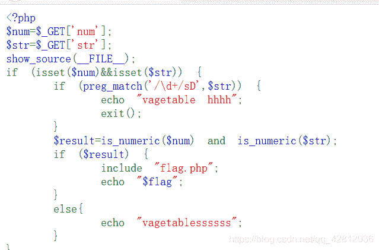
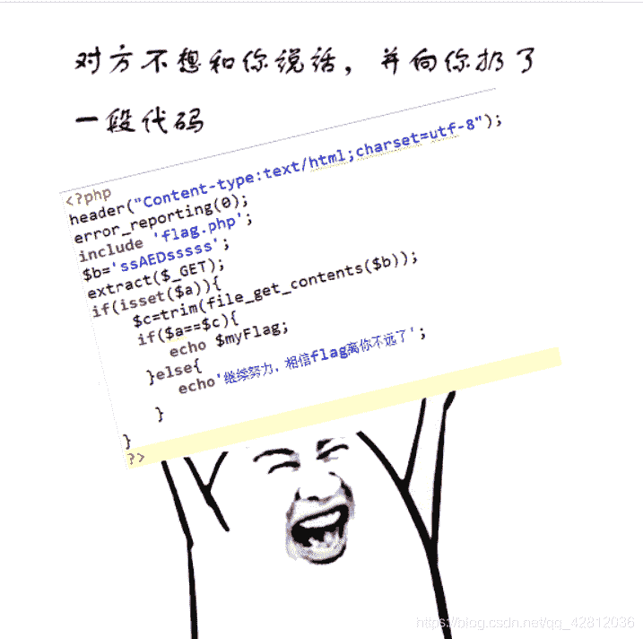
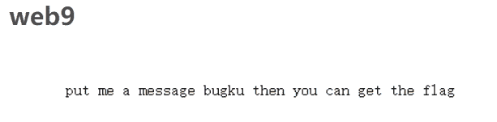
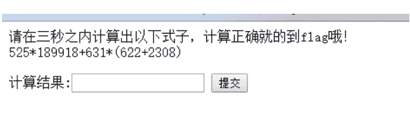
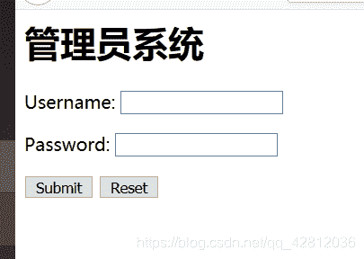
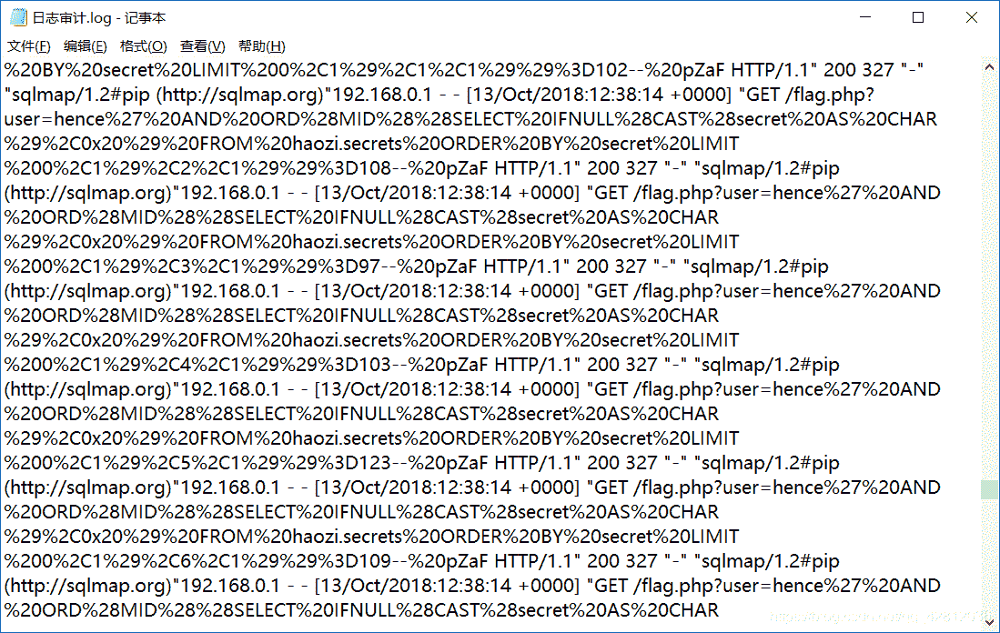
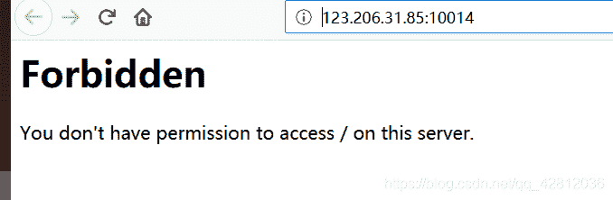

<!--yml
category: 未分类
date: 2022-04-26 14:50:17
-->

# web ctf解题记录 bugku的ctf_论剑场_昂首下楼梯的博客-CSDN博客

> 来源：[https://blog.csdn.net/qq_42812036/article/details/101023900](https://blog.csdn.net/qq_42812036/article/details/101023900)

[需要写脚本的都放在脚本专辑里了，点这句话](https://blog.csdn.net/qq_42812036/article/details/101057021)

# web26

> PHP is_numeric() 函数 PHP 可用的函数 is_numeric()
> 函数用于检测变量是否为**数字**或**数字字符串**。
> 
> ```
> preg_match('/\d+/sD' 
> ```
> 
> 正则表达式 //里的是指要匹配的内容，g代表匹配多次，而不是第一次匹配到就结束。


解答

> 这题既不能写入数字，又要检测到数字才能输出flag

# web1

> 变量覆盖漏洞
> 见到 extract() 想到变量覆盖漏洞

[变量覆盖漏洞](http://www.mamicode.com/info-detail-2314166.html)

> playload
> ?a=&c=aaaaa



# web9



> 要求put过去 bugku得到flag

将get的http请求改为put
在空白处加入bugku

# web2


python写脚本计算提交

```
在这里插入代码片 
```

# web6（xff,f12）


加入xff并没有直接出flag，出了一句提示，打开f12，发现注释提示，解码后为登入密码。完。
xff=x-forwarded-for

# 日志审计

txt里搜索flag，发现许多sql注入语句
观察了发现最后一位的数值不同 猜测可能是ascii 转成 字符就行了
于是把这一串字符串先粘贴到一个记事本里
tip：记住常见字符的ascii码

> f:102
> 123和125 分别是 { }


python自动抓取数值代码

```
import re
f = open("shenhe.txt")             
line = 1             
while line:
    line = f.readline()
    if line!='':
        left = re.search('%3D',line).end()
        right = re.search('--',line).start()
        print(chr(int(line[left:right])),end='')
f.close() 
```

# web14


题目提示是 备份