<!--yml
category: 未分类
date: 2022-04-26 14:29:54
-->

# webCTF简单题解_ONE_huster0828的博客-CSDN博客

> 来源：[https://blog.csdn.net/huster0828/article/details/109787246](https://blog.csdn.net/huster0828/article/details/109787246)

#### 1\. view_source(from 攻防世界)

X老师让小宁同学查看一个网页的源代码，但小宁同学发现鼠标右键好像不管用了。

我是用的谷歌浏览器，Ctrl + U 就可以查看源代码

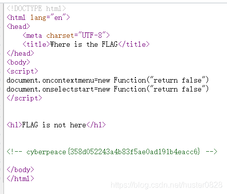

#### 2\. robots(from 攻防世界)

题目描述是：X老师上课讲了Robots协议，小宁同学却上课打了瞌睡，赶紧来教教小宁Robots协议是什么吧。

打开网页什么都没有
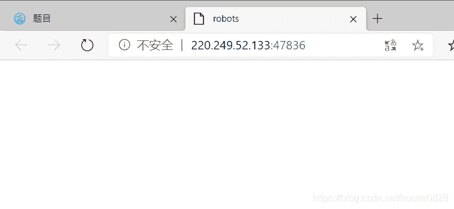
然后去网上搜一下robots协议是啥
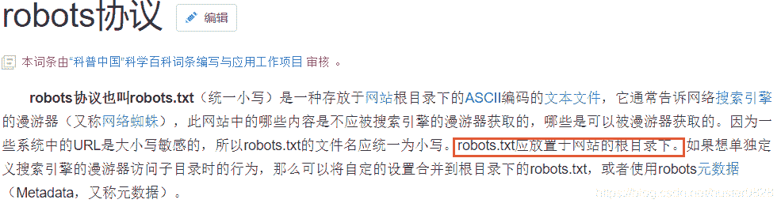
然后就进入了robots.txt这个根目录，出现了这个
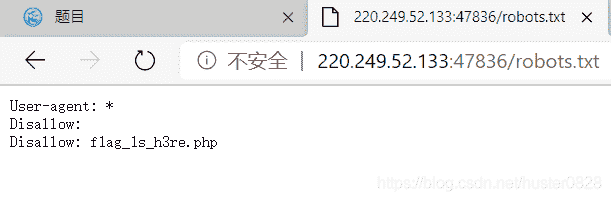

又进入f1ag_1s_h3re.php里面,就找到flag啦
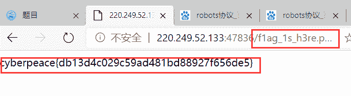

#### 3\. get_post(from 攻防世界)

题目描述是：X老师告诉小宁同学HTTP通常使用两种请求方法，你知道是哪两种吗？
<mark>GET</mark>
对于访问网页来讲，最常用的类型就是GET。GET 就是去服务器获取一些资源。对于访问网页来讲，要获取的资源往往是一个页面。常用的方法就是在后面加个问号

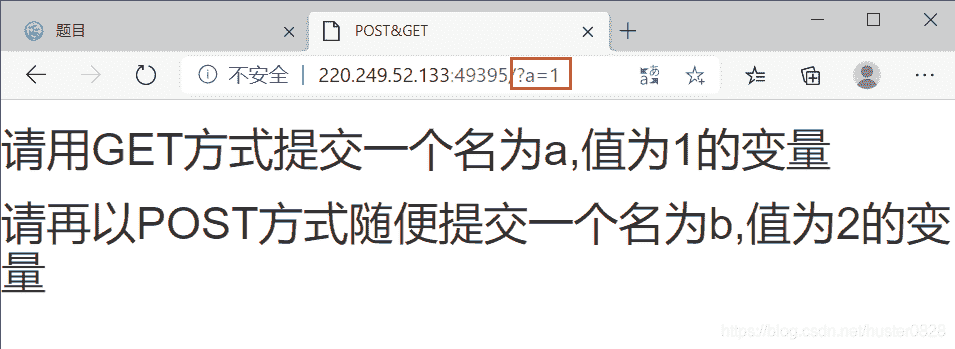
<mark>POST</mark>
它需要主动告诉服务端一些信息，而非获取。要告诉服务端的东西一般会放在正文里面。
向服务端发送的插件在火狐里可以搜到
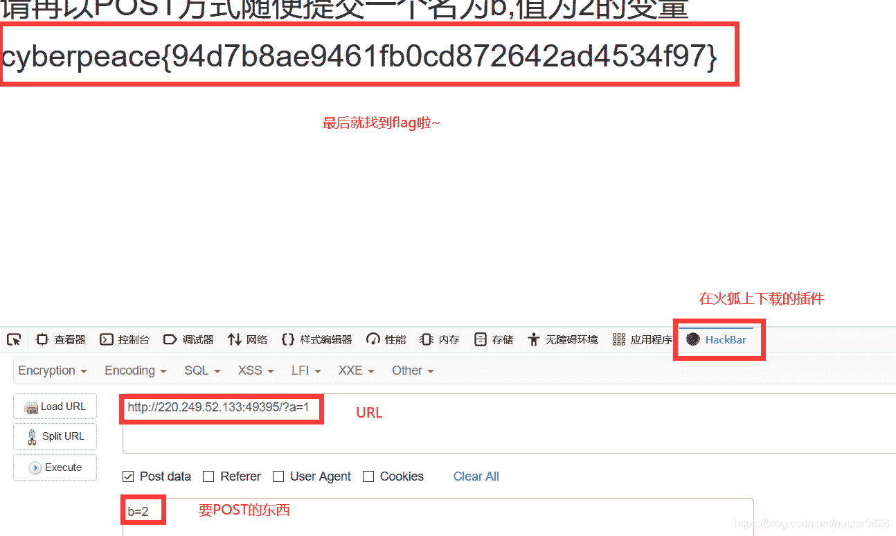

#### 4.webs2(from Bugku)

直接查看源代码就可以找到flag
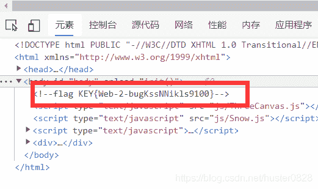

#### 5\. 计算器(from Bugku)

这是一道计算题，答案是110，可是验证框里面只能输入一位数
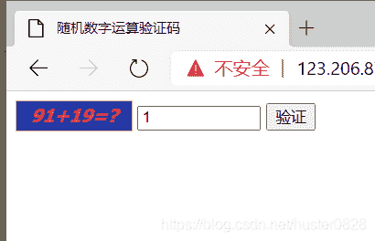
先查看源代码，发现那个输出框的最大长度被设置成1

将maxlength改成3就可以啦，就得到flag啦
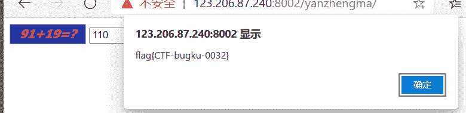

#### 6\. web基础$_GET(from Bugku)

这道题应该是考的get
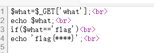
盲猜这些的大概意思是：get到what,就输出what里包含的东西，如果what=flag就输出flag啦
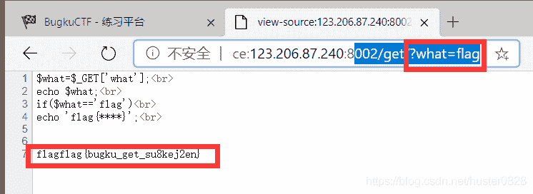

#### 7.web基础$_POST(from Bugku)

和第六题差不多的，不过需要用到插件向服务端发送
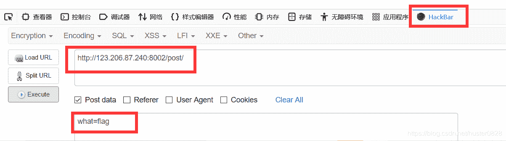
然后就得到flag啦~

#### 8\. webs3(from Bugku)

网页打开后是一个弹窗，而且还关不掉。然后查看一下源码，在末尾的时候找到了这个
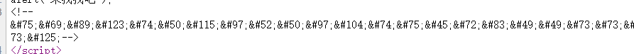

然后再解码，是html的加密
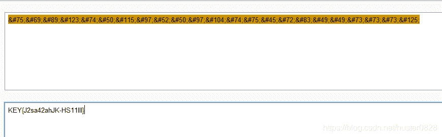

#### 9\. 矛盾(from Bugku)

打开之后里面有一个新的函数
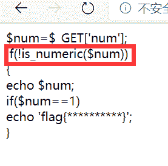
搜索了一下这个函数的意思
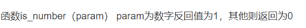
看了一下网上的思路是这个样子的
代码的意思是你要想拿到flag，就要构造一个GET一个参数，这个参数是不是数字和数字字符串
is_numeric() 函数用于检测变量是否为数字或数字字符串，然后它又等于1
在其他语言里面也许没有，别忘了php是一个弱类型的语言
==表示的是等于 ，只要数值等于就可以了，类型无所谓的，那如果我们传GET参数为 “1”的话，is_numeric() 就进不去了，所以我们可以传一个开头为1的字符串，这个字符串肯定不是数字，可以是 1‘ ，1x,随便构造一个1开头的字符串即可

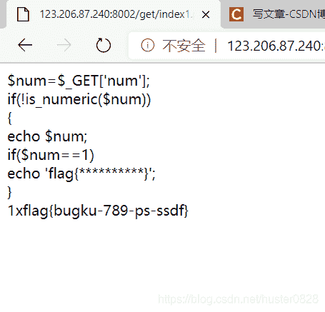

#### 10\. 你必须让他停下(from Bugku)

这个网页打开了之后就一直再刷新，查看源代码发现当出现图片的时候源代码也会出现flag,然后截图就能截下来啦~
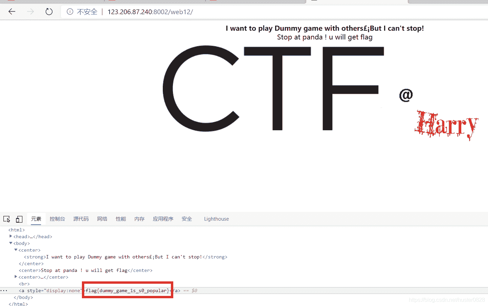

flag{dummy_game_1s_s0_popular}