<!--yml
category: 未分类
date: 2022-04-26 14:52:59
-->

# “百度杯”CTF比赛 十一月场(Misc)_andiao1218的博客-CSDN博客

> 来源：[https://blog.csdn.net/andiao1218/article/details/101192779](https://blog.csdn.net/andiao1218/article/details/101192779)

题目提示：

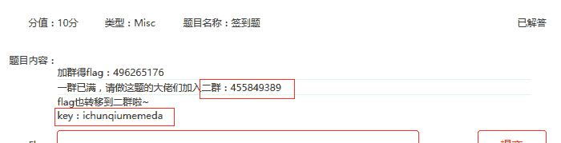

文件在i春秋的ctf2群里，加群下载文件

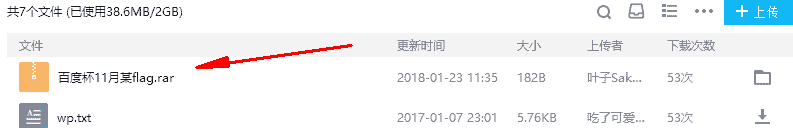

下载下来之后发现有压缩密码

题目提示有提示解压密码：key：ichunqiumemeda

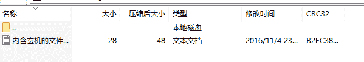

打开文件，得到flag

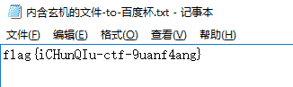

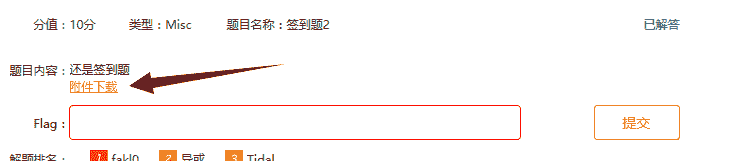

点击下载附件

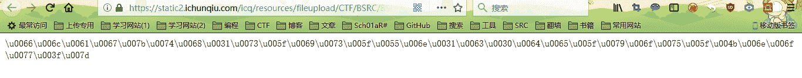

给出的却是一串unicode码，转换一下编码

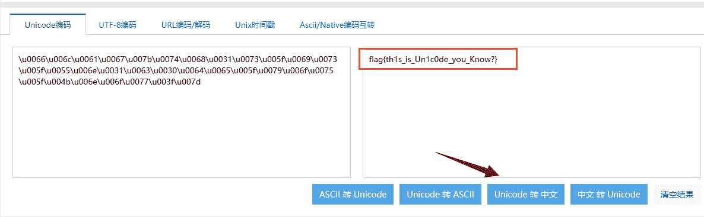

得到flag

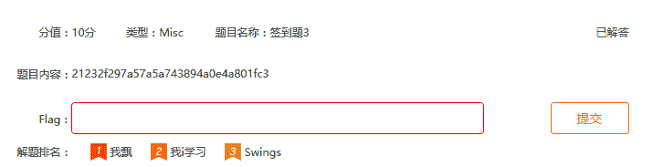

一串md5：21232f297a57a5a743894a0e4a801fc3

拿去解一下，得到admin

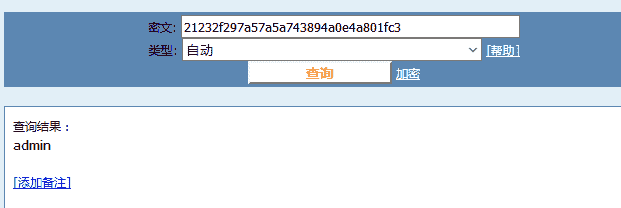

加上flag{}格式就是flag了

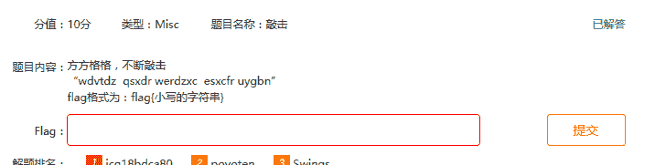

按照字母跟着在键盘上连，可得到字母x，z，v，o，c

加上flag{}格式就得到flag

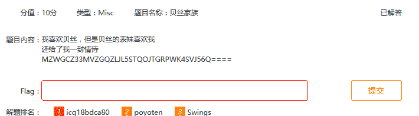

根据题目提示，可能是base32编码

解码一下

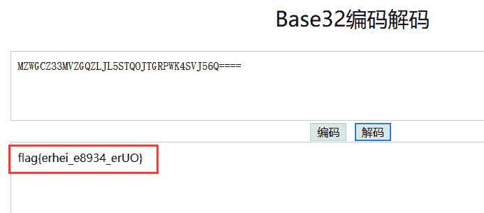

得到flag

根据题目提示，可能是XXencode编码，解码一下

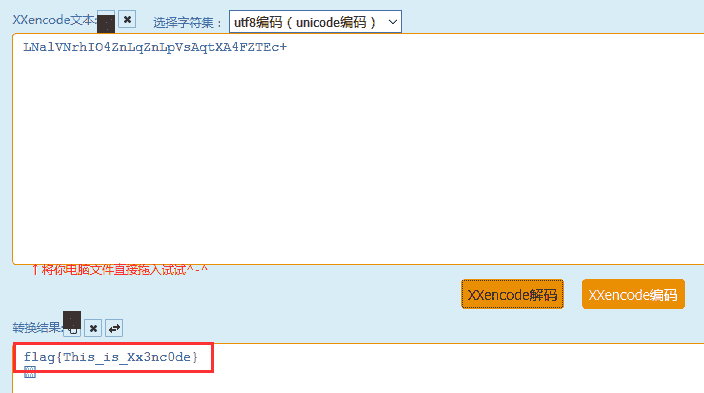

得到flag

密文：f5-lf5aa9gc9{-8648cbfb4f979c-c2a851d6e5-c}

栅栏密码在线解密一下

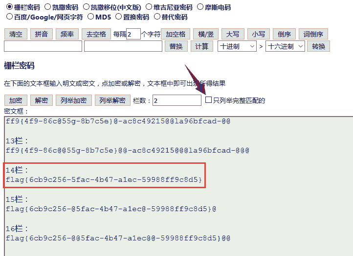

得到flag

题目内容：synt{mur_VF_syn9_svtug1at}

用rot13解码，http://www.mxcz.net/tools/rot13.aspx

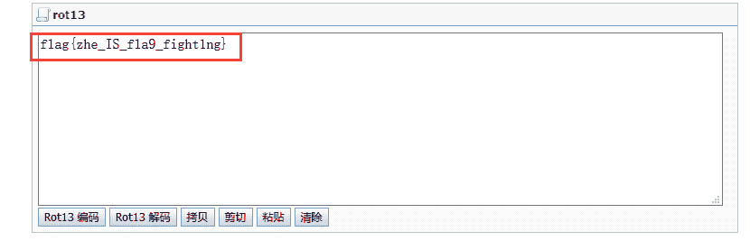

得到flag

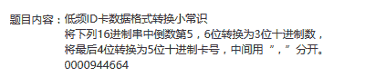

把94从十六进制转为十进制，把4664从十六进制转为十进制，用逗号隔开，然后加上flag格式，即得到flag