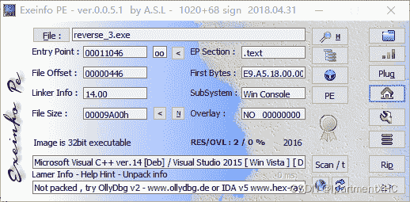
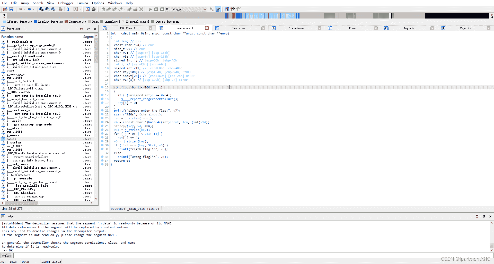
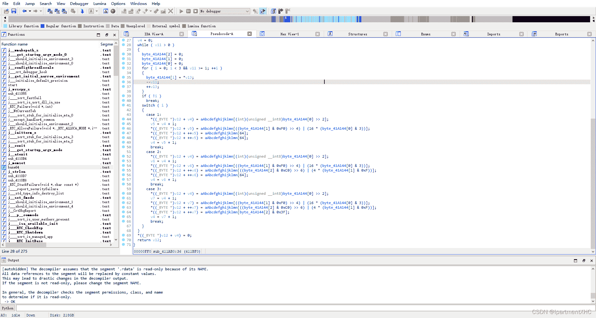
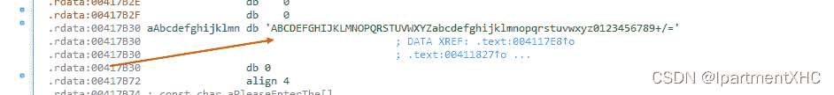

<!--yml
category: 未分类
date: 2022-04-26 14:40:54
-->

# 《BUUCTF逆向题解》——reverse3_IpartmentXHC的博客-CSDN博客

> 来源：[https://blog.csdn.net/qq_62735163/article/details/124086840](https://blog.csdn.net/qq_62735163/article/details/124086840)

常规查壳

 

32位 无壳 exe文件 无法直接运行

用IDA打开（已还原函数逻辑）



 其中这里有个base64加密



 input输入之后进行一次base64的加密后，复制给key,然后将key的每一位key[j]加上他们在数组中的所在的位置j。然后复制给key0，key0已知。

写脚本

```
import base64
key0 = 'e3nifIH9b_C@n@dH'
len_key0 = len(key0)
key=''
for i in range(len_key0):
    key+=chr(ord(key0[i])-i)
print('flag'+str(base64.b64decode(key))[2:-1:]) 
```

> flag{i_l0ve_you}