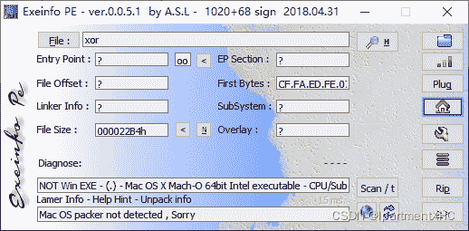
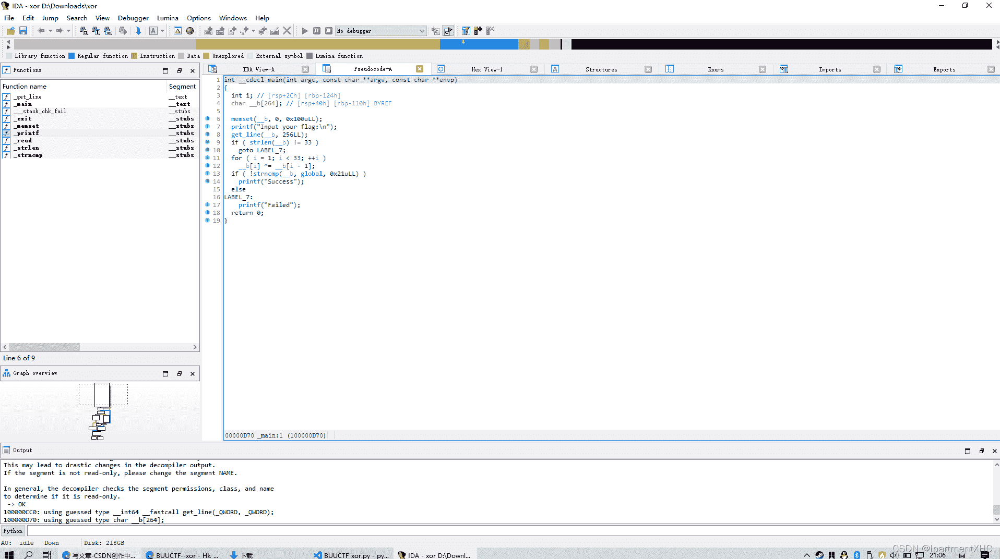
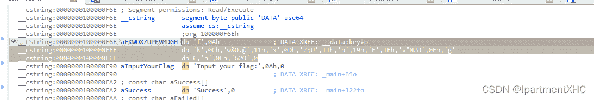
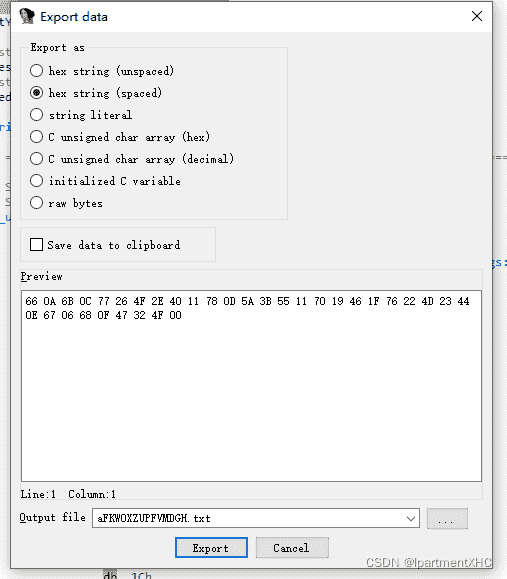

<!--yml
category: 未分类
date: 2022-04-26 14:38:04
-->

# 《BUUCTF逆向题解》——xor_IpartmentXHC的博客-CSDN博客

> 来源：[https://blog.csdn.net/qq_62735163/article/details/124085839](https://blog.csdn.net/qq_62735163/article/details/124085839)

常规查壳



无壳 64位程序

用IDA打开，F5查看伪代码



很明显 _b就是input,global就是key了

input的每一位（除了第一位）与前一位的异或就是key了

查看key,对应着一个字符串

用shift+e取出数据（16进制）





 开始写脚本

```
key=[0x66,0x0A,0x6B,0x0C,0x77,0x26,0x4F,0x2E,0x40,0x11,0x78,0x0D,0x5A,0x3B,0x55,0x11,0x70,0x19,0x46,0x1F,0x76,0x22,0x4D,0x23,0x44,0x0E,0x67,0x06,0x68,0x0F,0x47,0x32,0x4F]
flag =''
for i in range(32,0,-1):
    key[i]=(key[i]^key[i-1])
for i in range(33):
    flag+=chr(key[i])
print(flag)
```

> 结果为：flag{QianQiuWanDai_YiTongJiangHu}