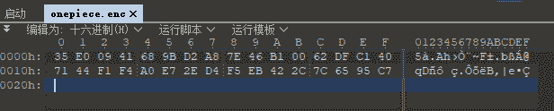
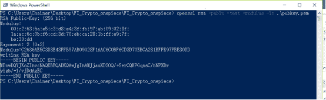
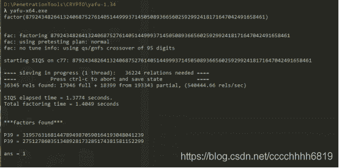
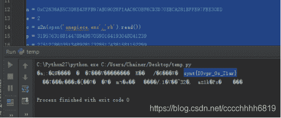
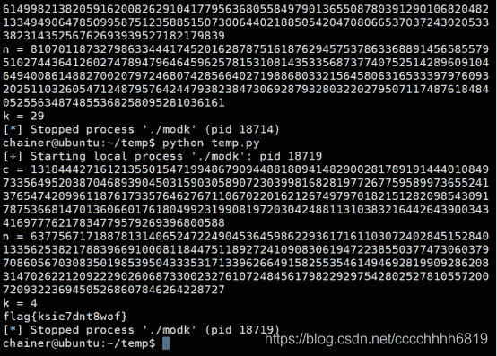
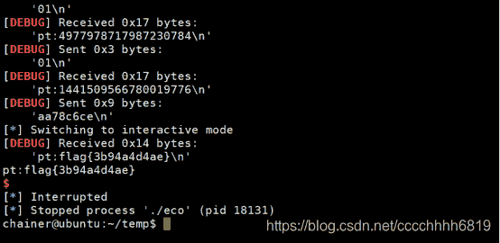
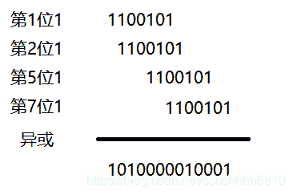
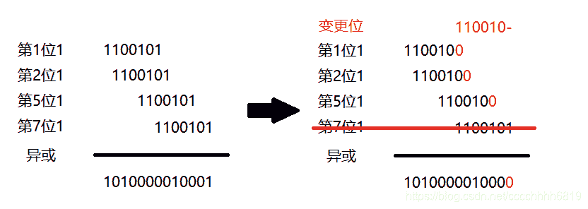
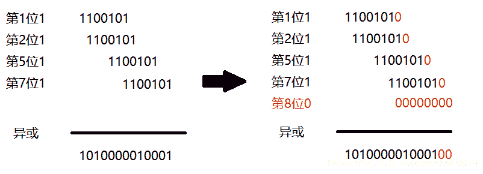

<!--yml
category: 未分类
date: 2022-04-26 14:40:25
-->

# 【CTF WriteUp】2020中央企业”新基建“网络安全技术大赛决赛部分Crypto题解_零食商人的博客-CSDN博客

> 来源：[https://blog.csdn.net/cccchhhh6819/article/details/109688302](https://blog.csdn.net/cccchhhh6819/article/details/109688302)

# Crypto

## FI_Crypto_onepiece

### 题目

public.pem

```
-----BEGIN PUBLIC KEY-----
MDowDQYJKoZIhvcNAQEBBQADKQAwJgIhAMJjauXD2OQ/+5erCQKPGqxsC/bNPXDr
yigb/+l/vjDdAgEC
-----END PUBLIC KEY----- 
```

onepiece.enc


### 解答

首先提取公钥信息

```
openssl rsa -pubin -text -modulus -in pubkey.pem 
```


根据参数知e=2，本题为类Rabin算法，需要分解n。使用yafu分解n
使用rabin算法解码

```
 from libnum import n2s,s2n

def egcd(a,b):
    if b==0:
        return 1,0
    else:
        x,y=egcd(b,a%b)
        return y,x-a/b*y

n = 0xC2636AE5C3D8E43FFB97AB09028F1AAC6C0BF6CD3D70EBCA281BFFE97FBE30DD
e = 2
c = s2n(open('onepiece.enc','rb').read())
p = 319576316814478949870590164193048041239
q = 275127860351348928173285174381581152299

mp = pow(c,(p+1)/4,p)
mq = pow(c,(q+1)/4,q)

yp, yq = egcd(p,q)

r0 = ( yp*p*mq + yq*q*mp ) % n
r1 = n - r0
s0 = ( yp*p*mq - yq*q*mp ) % n
s1 = n - s0
print n2s(r0),n2s(r1),n2s(s0),n2s(s1) 
```

得到的结果再进行一次ROT13，即为flag

## Fi_Crypto_modk

### 题目

```
class Unbuffered(object):
   def __init__(self, stream):
       self.stream = stream
   def write(self, data):
       self.stream.write(data)
       self.stream.flush()
   def __getattr__(self, attr):
       return getattr(self.stream, attr)
import sys
sys.stdout = Unbuffered(sys.stdout)
import signal
signal.alarm(600)
import os
from Crypto.Cipher import AES
from Crypto.Util.number import *
os.chdir("/home/ctf")
flag=open("flag","rb").read()
import random
import hashlib
p=getPrime(512)
q=getPrime(512)
n=p*q
m=bytes_to_long(flag)
e=0x10001
d=inverse(e,(p-1)*(q-1))
k=random.randint(1,128)

def run():
    print "enc system"
    while 1:
        choice=raw_input("choice:")
        if choice=="1":
            print pow(m,e,n)
        elif choice=="2":
            print n
        elif choice=="3":
            tmp=int(raw_input())
            print pow(tmp,d,n)%k

        else:
            print "wrong choice"

if __name__ == '__main__':
    run() 
```

### 解答

本题代码中给出了三种操作：操作1返回c；操作2返回n；操作3则输入一个值c0，系统解密后得到m0，然后返回m0%k，其中k为1~128中的随机数。

首先尝试去掉不确定项k。注意到e是已知的，如果我们依次以pow(1, e, n)、pow(2, e, n)、…、pow(128, e, n)作为操作3的输入，则返回内容应当依次为1%k、2%k、…、128%k 。由于k取值不超过128，因此这一序列中首个为0的项对应的就是k。

在求出了k以后，我们发现题目依然比较复杂，所以尝试研究简单取值下的情况。当k=2时，输入c，返回结果为pow(c, d, n)%2。我们知道pow(m, e, n) = c，于是有

```
pow(2m, e, n) = (2m)**e (mod n) = 2**e * m**e (mod n) = 2**e * c (mod n) 
```

因此在已知c、e、n的情况下，可以利用`2 ** e * c`作为密文输入，这样解出来的明文是`2m % n`，返回结果为其奇偶性。注意到n是奇数，且`2m < 2n`，所以若结果是偶数，说明2m大小并未超过n，即m位于(0, n/2)之间；否则，2m超过了n会自动减n变成奇数，此时m位于(n/2, n)之间。利用得到的`2 ** e * c`作为新的密文继续进行上述操作，可逐步限定m的取值范围，最终直接确定明文m。（此方法即为RSA LSB Oracle Attack）

那么当k较大时情况如何呢？我们注意到，只要k是偶数，就可以用返回值模2的结果来代替返回值，采用上述k=2的方法进行解题。由于每次访问k随机生成，因此多试几次即可解答本题。

完整解题脚本如下：

```
 from pwn import *
from Crypto.Util.number import long_to_bytes

p = process("./modk")

def sendmessage(text):
    p.sendline("3")
    p.sendline(text)
    return int(p.recvline().strip()[7:])

e = 0x10001
p.recvline()

p.sendline("1")
c = int(p.recvline().strip()[7:])
print "c = %s" % str(c)

p.sendline("2")
n = int(p.recvline().strip()[7:])
print "n = %s" % str(n)

k = 0
for i in range(1, 129):
    res = sendmessage(str(pow(i, e, n)))
    if(res == 0):
        k = i
        break

if(k % 2 == 1):
    print "k = %s" % str(k)
    exit(0)
else:
    print "k = %s" % str(k)

import decimal
decimal.getcontext().prec = 1024
lower = decimal.Decimal(0)
upper = decimal.Decimal(n)
c_of_2 = pow(2, e, n)

for i in range(1024):
    c = (c * c_of_2)%n
    res = sendmessage(str(c))
    possible = (lower+upper)/2
    if(res % 2 == 1):
        lower = possible
    else:
        upper = possible

print long_to_bytes(int(upper)) 
```



## FI_Crypto_eco

### 题目

```
class Unbuffered(object):
   def __init__(self, stream):
       self.stream = stream
   def write(self, data):
       self.stream.write(data)
       self.stream.flush()
   def __getattr__(self, attr):
       return getattr(self.stream, attr)
import sys
sys.stdout = Unbuffered(sys.stdout)
import os
from Crypto.Cipher import AES
from Crypto.Util.number import *
import random
os.chdir("/home/ctf")
flag=open("flag","rb").read()
random.seed(os.urandom(32))

def encode(n):
    a = 0
    for i in bin(n)[2:]:
        a = a << 1
        if (int(i)):
            a = a ^ n
        if a >> 256:
            a = a ^ 0x10000000000000000000000000000000000000000000000000000000000000223L
    return a

def run():
    print "rco"
    while 1:
        pt=raw_input("pt:").decode("hex")
        m=bytes_to_long(pt)
        k=random.getrandbits(32)
        if m==k:
            print flag
        else:
            print encode(k)

if __name__ == '__main__':
    run() 
```

### 解答

（本题为标准数学题解题方法中的 观察——猜想——证明 步骤，不过对于解题而言，猜想得出结论就足够了）
注意到，题目中的encode函数对于固定的输入，其输出也是固定的。我们尝试打印一些输出：

```
0 0
1 1
2 4
3 5
4 16
5 17
6 20
7 21
8 64
9 65
10 68
11 69
12 80
13 81
14 84
15 85
...... 
```

观察发现encode函数满足如下规律：

```
1\.  encode(2x+1) = encode(2x) + 1
2\.  encode(2x) = 4 * encode(x) 
```

分析代码，发现encode的输入为32位时，输出最多不超过64位，因此if(a>>256)根本不可能触发，至此已经可以写出解题代码了。首先写出decode将每轮随机数还原，然后凑齐梅森旋转的连续624个状态后，推断下一个状态，输入获取flag。完整解题代码如下：

```
 from pwn import *
from randcrack import RandCrack

context.log_level="debug"
p = process("./eco")

def padding16(text):
    padding_length = 16 - len(text) % 16
    return text + chr(padding_length) * padding_length

def decode(num):
    res = ""
    while(num>0):
        if(num % 2 == 1):
            res = "1" + res
            num -= 1
        else:
            res = "0" + res
            num /= 4
    sum = 0
    for i in res:
        if int(i):
            sum += 1
        else:
            sum *= 2
    return sum

rc = RandCrack()

p.recvline()
for i in range(624):
    p.sendline("01")
    s = decode(int(p.recvline().strip()[3:]))
    rc.submit(s)

key = rc.predict_randrange(0, 2**32-1)
p.sendline(hex(key)[2:])
p.interactive() 
```

作为CTF题目，到此已经结束了。但是在数学上，我们还需要尝试理解刚才我们发现的结论。首先来看加密过程，对于一个数的二进制表示，我们以101（二进制1100101）为例，其加密步骤是这样的：
101是奇数，属于2k+1，我们将其改为2k，查看发生的变化：
注意到，当末尾的1变成0时，每一行参与运算的数最后一位都发生了变化。由于当且仅当第`k`位为1时该处才有一行，所以第`k`位为1时，该变化影响的是第`k+l-1`位，其中l是二进制串长度。将影响位全部提出汇总，可以发现恰好是从第`l`位开始的该数字的二进制表示。

另一方面，末尾的1变成0时，最后一行不再参与运算，即原有的从第`l`位开始的该数字的二进制表示不再参与运算。由于运算是异或，此时二者除最后一位外恰好完全抵消，仅最后一位由1变0，此即`encode(2x+1) = encode(2x) + 1`

再来看2倍关系的变化

这似乎更好理解一些：0在异或运算中不影响结果，所以末尾加0（乘以2）只是在结果后边补充了两个0（乘以4），即`encode(2x) = 4 * encode(x)`