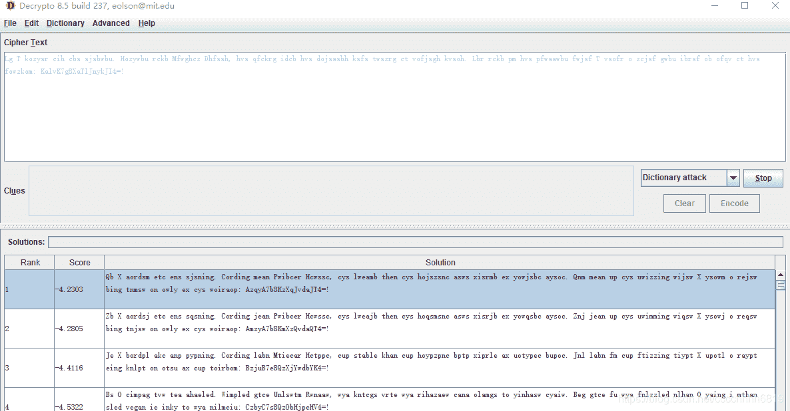

<!--yml
category: 未分类
date: 2022-04-26 14:40:09
-->

# 【CTF WriteUp】2020中央企业”新基建“网络安全技术大赛初赛Crypto题解_零食商人的博客-CSDN博客

> 来源：[https://blog.csdn.net/cccchhhh6819/article/details/109324871](https://blog.csdn.net/cccchhhh6819/article/details/109324871)

# Crypto

## Crypto_ezCrypto

观察密文，很像字母替换后的英文语法，但注意到其中有一段是.ubwbsjs，标点符号通常在后边，所以说明密文是颠倒的，首先反过来以后，尝试使用词频分析工具解码


发现明显不是人话，但是后边flag的base64加密的情况基本可以确定。将后边那几位固定为flag字符的base64编码Zxmh重新跑


经过一段时间后，得到的英文基本成为单词，采用方式也是ROT，但是注意到大写字母在语义中完全不对，所以猜测大写字母ROT的数值和小写字母不同，写程序爆破：

```
 s = "!=4IJkynJlTaX8g7KvlaK :mokzwof svh tc vqfo bo fsrbi ubwg fsjcz o rfosv T fsjwf ubwaawfp svh mp bkcr rbL .hosvk hgsjfov tc grzswt sfsk hbsasjod svh bcdi grkcfq svh ,hssfhD zchgwfM bkcr ubwyzoH .ubwbsjs sbc hic rsyzok T gL"
s = s[::-1]

def change(c, a, b):
    dic1 = "abcdefghijklmnopqrstuvwxyz"
    dic2 = "ABCDEFGHIJKLMNOPQRSTUVWXYZ"
    if c in dic1:
        return dic1[(dic1.index(c) + a)%26]
    elif c in dic2:
        return dic2[(dic2.index(c) + b)%26]
    else:
        return c

for i in range(26):
    for j in range(26):
        m = ""
        for k in s:
            m += change(k, i, j)
        if m.find("As I walked out one evening")>=0:
            print i, j, m 
```

发现果然是这样，一个轮12另一个轮15，得到flag密文：ZmxhZ7s8MmIxYzkwYX4=，解码再次失败，成功一大半。其中大写字母和小写字母解码部分基本正确，数字部分错误，因此猜测这是个换表base64，数字0-9和+/符号也是个ROT，经实验确认表为

```
ABCDEFGHIJKLMNOPQRSTUVWXYZabcdefghijklmnopqrstuvwxyz456789+/0123 
```

写解题代码得到flag

```
def myb64decode(text):
    dic = "ABCDEFGHIJKLMNOPQRSTUVWXYZabcdefghijklmnopqrstuvwxyz456789+/0123"
    b = ""
    for i in text:
        if i == "=":
            b += "000000"
        else:
            tmp = bin(dic.index(i))[2:]
            tmp = '0'*(6-len(tmp))+tmp
            b += tmp
    return ''.join(chr(int(b[i:i+8], 2)) for i in range(0, len(b), 8))

print myb64decode("ZmxhZ7s8MmIxYzkwYX4=") 
```

flag{82b1c90a}

## Crypto_LD

（本题为202004数字中国创新大赛原题GM修改数据得到）
题目给出了N和phi，所以可以以此求出p和q。根据题目代码，一个模p的余数和一个模q的余数之和为N-phi-1=(p-1)+(q-1)，而模p的余数最大为p-1，模q余数最大为q-1，所以有

```
pow(q ** 2 * x, (p-1)/2, p) = p - 1
pow(p ** 2 * x, (q-1)/2, q) = q - 1 
```

根据第一个式子，有

```
pow(q**2, (p-1)/2, p) * pow(x, (p-1)/2, p) = p-1
pow(q, p-1, p)* pow(x, (p-1)/2, p) = p-1 
```

根据欧拉定理，第一项为1，所以pow(x, (p-1)/2, p) = p-1
同理pow(x, (q-1)/2, q) = q-1

**（不好意思之前这里写错了，更正）**

根据N % 8 = 1和phi % 8 = 4可知，p、q模4均为3，于是根据Goldwasser–Micali加密系统的密钥选择算法，x = n - 1是一个满足所有情况的解（此处不严谨，但不影响解题）

另一方面，我们知道phi和N，所以

```
N - phi + 1 = p + q
(N - phi + 1) ** 2 = (p + q) ** 2 
= p ** 2 + 2 * p * q + q ** 2 = (p - q) ** 2 + 4 * N 
```

可以求出p + q和p - q，进而求出p和q

继续往下做。代码将flag转换为二进制，然后把每一位s提出来，拼在一个随机二进制数r的后边，形成一个新数，然后计算

```
(pow(x, 2r+s, n) * r ** 2) % n 
```

并告诉我们。当x = n - 1时，可以直接用 -1 带进去，得到

```
(pow(x, 2r+s, n) * r ** 2) % n
= (pow(-1, 2r+s, n) * r ** 2) % n
= (pow(-1, s, n) * r ** 2) % n 
```

当 s = 1 时，这个数就是 - r ** 2 % n；当 s = 0 时，这个数就是 r ** 2 % n。注意到这里非常类似e = 2的RSA，所以我们尝试用Rabin算法对其进行求解，再将解带回原来的式子进行验证。如果验证正确，说明原来是正的平方数，s = 0；反之则 s = 1。以此求出flag。完整解题代码如下：

```
 import gmpy2
from libnum import n2s

phi = ...
n = ...
c = [...]

pandq = n - phi + 1
pminq = int(gmpy2.iroot(pandq ** 2 - 4 * n, 2)[0])
p = (pandq + pminq)/2
q = pandq - p

def egcd(a,b):
    if b==0:
        return 1,0
    else:
        x,y=egcd(b,a%b)
        return y,x-a/b*y

m = ''
for tmpc in c:

    mp = pow(tmpc,(p+1)/4,p)
    mq = pow(tmpc,(q+1)/4,q)

    yp, yq = egcd(p,q)

    r0 = ( yp*p*mq + yq*q*mp ) % n
    if ((r0**2) % n) - tmpc == 0:
        m += '0'
    else:
        m += '1'

print n2s(int(m,2)) 
```

flag{W0w_GRe4t_J0b_oF_Y0U}

## Crypto_x0RSA

本题对密文的c进行了二次加密，转成字符串后加入前缀cipher，然后用已知密码aurora异或，再使用未知密码异或。由于明文和密文前六位均已知，所以可以先利用前六位求出未知密码，再求出完整的c。代码如下：

```
 c2 = "8fb4f15b5cdddde5b4050f96dbecb0030096dee4b00b019dd8e9b7070b96d4eab9040d9ad8efb807089ad5edb002089fdaefb6020c9eddeeb700089dd4efb9030199dce5b7010c97d8ecb4060c96d8efb70a099dd5eeb806089cddefb50b0b9ddaefb7050f9edde5b10b0b9fdcefb20b009cdde4b4030e9bdaedb4040d9cddeeb2000c9bd9e4b6020a9bdde4b8020a9edfecb7000f9fd9e4b5000b9fd4ecb4000c9ad5e9b603089adee9b90a0c98dbe4b0030997dbe5b1030a9fd5e9b5000b99deeab0010a99dcedb3060096d8e4b00a0b9fddebb6010a9cdeeeb5010d9bd5edb20b0b98dde8b7070b9adde8b50a0196ddeeb2030b9dddefb001009fd8eeb30a0997dfe5b5030c99d9ecb502089cd5e9b3020b96dbe4b1050c9adfefb3000c96dfecb003089dd4e8b1070998d5efb3060b9dd9efb5000c9dd8ecb6040a98d8ebb505019dd5efb60b0f98dfe4b907089edceab3000e99d5ebb8010e9ed8efb6060e9dd9e9b60b009bdde9b4050d9fdae9b602099edbe4b40a0d9edfe8b403009dddecb2070f99ddecb00b089fd9e9b60a0896d5edb407089fd4e8b7070c9ad9e9b4000a9dd4e4b8050a9cdde5b0070b9edfe9b4040199d4eab5000896d9e9b8050a9bdce8b60b009dd8efb9010e97dcebb7000999d8eab104009cd4e4b6070d96d9ecb4030c99d8edb3030c9dddeeb5030a9adaefb3010c9fd4edb90a0897dce4b3020b97d5ebb504099edcecb4010a97d5ebb8070c9fdcecb4030c9fd5ebb3040a97dee4b60a0f96daefb400099ddbedb805009fdfebb20b009cdfecb30b019fdfecb007099fdcebb6010f9bd4edb30a0997deeab005009adae5b8040c9bd9eab205009cd4ebb60a0d9cdfe4b906".decode('hex')
rankey = strxor(strxor(c2[:6], "cipher"), "aurora")
c = int(strxor(strxor(c2, rankey), "aurora")[6:]) 
```

得到

```
c = 1856697110992918824464298787454294159011106271511363128280860862584155594269029395131248226266611808200238931950746057431333545971341991313163605943208153559470152489577910087800309443262712360025994919201672332342449038271564251549891330221212904329083840565141139421297906553223593110128504079225225243524177374646829278673984110723769692714275725478941456406471017959413550921134661118105479199054108564555453328996331814213457868743195496340578924282780663064707938974495150564020521340356222508089180921289647010152389694500150509627382979696253027096903638933128803114000672648029082716956897545736938679433985 
```

继续参与后续计算。接下来处理那个奇怪的表达式，设

```
x = e*phi+2*d+2000 
```

为已知，其中p、q为1024位，e为256位，d最大为2048位，则

```
x = e*(p-1)*(q-1) + 2*d + 2000 
```

等式两边除以n

```
x/n = e - e/p - e/q + e/n + 2*d/n + 2000/n 
```

观察整数部分，由于e远远小于p、q、n的，所以x/n的整数部分就在e和e+2之间，检查其中质数情况可以求出e
求出e之后，我们继续查看原式：

```
x-2000 = e*(p-1)*(q-1) + 2*d 
```

两边乘以e

```
e*(x-2000) = e*e*(p-1)*(q-1) + 2*e*d
e*(x-2000) = e*e*(p-1)*(q-1) + 2*(a*(p-1)*(q-1)+1)
e*(x-2000)-2 = (e*e+2*a)*(p-1)*(q-1) 
```

所以e*(x-2000)-2是phi的一个整数倍，且可求。我们知道

```
pow(c, d, n) = pow(pow(m, e, n), d, n) = pow(m, ed, n) = m * pow(m, phi, n) ** a = m 
```

所以计算dd = inv(e, e*(x-2000)-2)，有

```
pow(m, e*(x-2000)-2, n) = pow(m, phi, n) ** b = 1
pow(c, dd, n) = pow(pow(m, e, n), dd, n) = pow(m, e*dd, n) = m * pow(m, e*(x-2000)-2, n) ** a = m 
```

完整解题代码如下：

```
 import gmpy2
from libnum import n2s

def strxor(a, b):
    return "".join(chr(ord(a[i])^ord(b[i%len(b)])) for i in range(len(a)))

x = 1267982668072513231452891863043424295599834859100149573631132691595983329470423884239104289369242212251891490867692440047416100533141306836274387621030189535353453497214687975530093393776691837662099778202721802783459072343625657847902483364574074675844370114187041501516164524844560501180602491635032095054050468409668106317972933045713247586266030529732217997511486967953665597945551895583076407217918050242533151323363573068151249311147549761111688506751695988878207998582474739061539806489240491925479395640190191976972656159237635585081329365088001534308652965962150210160485125292710903028061655467118074792803701813091473848960821379158422678252985725282494730999219827545731624223169002
n = 12481674614855685953431310069139262770181111896679332858866368534047537666480569760106869666713999606187655666521091324286510186479595436084367101655509452542502349245680670188096288818989023660590513347753471182289817286176898990883927311061256037550588683828709224481144088322585331288408741487874543701938368655046545540421273512332162617552393131417390793555393898354606731643126500725127350104840163420140767953528301349877632196173183839299220917643489404456656955737164844088165024091907559909967664122295807264526567102312418385269875719242576503849975407146024422857786698109651727438983673071610691953929487

c2 = "8fb4f15b5cdddde5b4050f96dbecb0030096dee4b00b019dd8e9b7070b96d4eab9040d9ad8efb807089ad5edb002089fdaefb6020c9eddeeb700089dd4efb9030199dce5b7010c97d8ecb4060c96d8efb70a099dd5eeb806089cddefb50b0b9ddaefb7050f9edde5b10b0b9fdcefb20b009cdde4b4030e9bdaedb4040d9cddeeb2000c9bd9e4b6020a9bdde4b8020a9edfecb7000f9fd9e4b5000b9fd4ecb4000c9ad5e9b603089adee9b90a0c98dbe4b0030997dbe5b1030a9fd5e9b5000b99deeab0010a99dcedb3060096d8e4b00a0b9fddebb6010a9cdeeeb5010d9bd5edb20b0b98dde8b7070b9adde8b50a0196ddeeb2030b9dddefb001009fd8eeb30a0997dfe5b5030c99d9ecb502089cd5e9b3020b96dbe4b1050c9adfefb3000c96dfecb003089dd4e8b1070998d5efb3060b9dd9efb5000c9dd8ecb6040a98d8ebb505019dd5efb60b0f98dfe4b907089edceab3000e99d5ebb8010e9ed8efb6060e9dd9e9b60b009bdde9b4050d9fdae9b602099edbe4b40a0d9edfe8b403009dddecb2070f99ddecb00b089fd9e9b60a0896d5edb407089fd4e8b7070c9ad9e9b4000a9dd4e4b8050a9cdde5b0070b9edfe9b4040199d4eab5000896d9e9b8050a9bdce8b60b009dd8efb9010e97dcebb7000999d8eab104009cd4e4b6070d96d9ecb4030c99d8edb3030c9dddeeb5030a9adaefb3010c9fd4edb90a0897dce4b3020b97d5ebb504099edcecb4010a97d5ebb8070c9fdcecb4030c9fd5ebb3040a97dee4b60a0f96daefb400099ddbedb805009fdfebb20b009cdfecb30b019fdfecb007099fdcebb6010f9bd4edb30a0997deeab005009adae5b8040c9bd9eab205009cd4ebb60a0d9cdfe4b906".decode('hex')
rankey = strxor(strxor(c2[:6], "cipher"), "aurora")
c = int(strxor(strxor(c2, rankey), "aurora")[6:])

x -= 2000
e = x/n
new = e*x-2
dd = gmpy2.invert(e, new)
print n2s(pow(c, dd, n)) 
```

flag{s1mplE_x0r_uND_rs4}