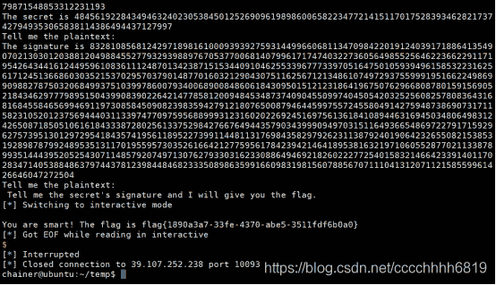
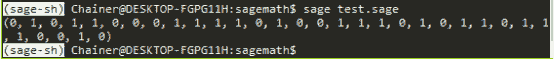

<!--yml
category: 未分类
date: 2022-04-26 14:39:01
-->

# 【CTF WriteUp】2020全国工业互联网安全技术技能大赛（原护网杯）Crypto题解_零食商人的博客-CSDN博客

> 来源：[https://blog.csdn.net/cccchhhh6819/article/details/109262974](https://blog.csdn.net/cccchhhh6819/article/details/109262974)

# Crypto

## signsystem

#### 题目

task.py

```
from Crypto.Util.number import getPrime, bytes_to_long
from gmpy2 import lcm,invert
import SocketServer
import signal,os,random,string
from hashlib import sha256

from secret import FLAG

def genKey():
    e = 65537
    p = getPrime(2048)
    q = getPrime(2048)
    N = p*q
    s = lcm(lcm(p-1,q-1),lcm(q+1,p+1))
    d = invert(e,s)
    return e,d,N

def encrypt(m,e,N):
    if e == 0:
        return 2
    t1 = 2
    t2 = m
    e = bin(e)[3:]
    for i in e:
        tk  = (t2*t1 - m)%N
        sk = (t2*t2 - 2)%N
        rk = (m*t2*t2-t2*t1-m)%N
        if i == '0' :
            t2 = sk
            t1 = tk
        else:
            t2 = rk
            t1 = sk
    return t2
class Task(SocketServer.BaseRequestHandler):
    def proof_of_work(self):
        random.seed(os.urandom(8))
        proof = ''.join([random.choice(string.ascii_letters+string.digits) for _ in xrange(20)])
        digest = sha256(proof).hexdigest()
        self.request.send("sha256(XXXX+%s) == %s\n" % (proof[4:],digest))
        self.request.send('Give me XXXX:')
        x = self.request.recv(10)
        x = x.strip()
        if len(x) != 4 or sha256(x+proof[4:]).hexdigest() != digest: 
            return False
        return True

    def dorecv(self,sz):
        try:
            return int(self.request.recv(sz).strip())
        except:
            return 0

    def dosend(self, msg):
        try:
            self.request.sendall(msg)
        except:
            pass

    def handle(self):
        signal.alarm(200)
        if not self.proof_of_work():
            return
        secret = bytes_to_long(os.urandom(48))
        self.dosend("Welcome to the Signature System.")
        self.dosend('You can sign any message you want and if you give me the secret\'s signature I will give you the flag.\n')   
	e,d,N = genKey()

        self.dosend('The pulickey is '+str(e)+" "+ str(N)+'\n')
	self.dosend('The secret is '+str(secret)+'\n')
        for i in range(4):	
            self.dosend("Tell me the plaintext: ")
            pt = self.dorecv(1500)
            if pt == 0:
                break
            if pt == secret:
                self.dosend('NO! You can not sign the secret!')
                break
            sig = encrypt(pt,d,N)
            self.dosend('The signature is ' + str(sig) + '\n')
        self.dosend('Tell me the secret\'s signature and I will give you the flag.\n')
        sig = self.dorecv(1500)
        if(encrypt(sig,e,N) == secret):
            self.dosend('You are smart! The flag is '+FLAG + '\n')
        self.request.close()

class ForkingServer(SocketServer.ForkingTCPServer, SocketServer.TCPServer):
    pass

if __name__ == "__main__":
    HOST, PORT = '0.0.0.0', 10004
    server = ForkingServer((HOST, PORT), Task)
    server.allow_reuse_address = True
    server.serve_forever() 
```

#### 解答

题目中的加密算法很奇怪，所以测试一下加密算法的结果，得到如下结论：

在不模n的情况下，该函数加密结果满足以下数列：

```
f(1) = m, f(2) = m^2-2, f(n+2) = m*f(n+1) - f(n) 
```

列出几项观察：

```
m, m^2-2, m^3-3m, m^4-4m^2+2, m^5-5m^3+5m, ... 
```

暂时没有得到有用结论。再看一看e和d的关系，随便找了100个输入，确认e和d在该算法可逆，原理不明。

继续看代码。代码允许输入一个明文m计算enc(m, d, n)，但m不能是secret。注意到允许输入负数，因此输入负secret时，也能得到一个签名sign。根据数列的特性，当m变为-m时，其奇数项变负，偶数项保持不变，因此尝试直接用sign或者-sign当作sig进行签名。结果发现当输入-sign时签名成功，即第e（奇数）项取负值。完整解题代码如下：

```
 from pwn import *
import hashlib
import string
p = remote("39.107.252.238", 10093)

def myhash(text):
    mysha = hashlib.sha256()
    mysha.update(text)
    return mysha.hexdigest()

def passPoW(plain, cipher):
    dic = string.digits+string.ascii_letters
    for a0 in dic:
        for a1 in dic:
            for a2 in dic:
                for a3 in dic:
                    tmp = a0+a1+a2+a3+plain
                    if(myhash(tmp)==cipher):
                        return a0+a1+a2+a3

def encrypt(m,e,N):
    if e == 0:
        return 2
    t1 = 2
    t2 = m
    e = bin(e)[3:]
    for i in e:
        tk  = (t2*t1 - m)%N
        sk = (t2*t2 - 2)%N
        rk = (m*t2*t2-t2*t1-m)%N
        if i == '0' :
            t2 = sk
            t1 = tk
        else:
            t2 = rk
            t1 = sk
    return t2

recv = p.recvline()
print recv.strip()
plain = recv[12:28]
cipher = recv[33:97]
res = passPoW(plain, cipher)
print p.recvuntil("Give me XXXX:")
p.sendline(res)

recv = p.recvline()
print recv.strip()
recv = p.recvline()
print recv.strip()
n = int(recv.strip()[22:])
recv = p.recvline()
print recv.strip()
secret = int(recv.strip()[14:])
e = 65537

print p.recvuntil("Tell me the plaintext:")
p.sendline(str(-secret))
recv = p.recvline()
print recv.strip()
result = recv.strip()[17:]
print p.recvuntil("Tell me the plaintext:")
p.sendline("0")
print p.recvuntil("Tell me the secret's signature and I will give you the flag.")
p.sendline("-"+result)
p.interactive() 
```


flag{1890a3a7-33fe-4370-abe5-3511fdf6b0a0}

### dislogAgain

#### 题目

task.py

```
from gmpy2 import *
from Crypto.Util.number import bytes_to_long
import random
from secret import flag
def keygen():
    p = next_prime(random.getrandbits(1024))
    q = next_prime(p**3)
    n = p*p*q
    tmp = p*p
    while True:
        g = random.randint(2,n-1)
        if pow(g,p-1,tmp) != 1:
            break
    return g,n,p,q

def encrypt(g,n,msg,p):
    msg = bytes_to_long(msg)
    assert(msg<p)
    r = random.randint(1,n-1) 
    h = pow(g,n,n)

    return (pow(g,msg,n)*pow(h,r,n))%n

g,n,p,q = keygen()

print g
print n
print encrypt(g,n,flag,p) 
```

out

```
137261919839707081160655330560956867995894804265247730499195988354503088921949409954943072057697292541253034534835700613830535742360897463631920633501203526409427256243296724830206327965478964707657622756269801570256719219397907211471793647401907258197687047172379076495879780075822215321321075351966321975248339716973022846475731695610685935032135321624338977475023528252024112566241730257211266833331874349028231317740509495588457797779102358174332937905603748045384741485174112107008884052498137719901235389362138360008096353902250713852195601694871454039981760765043088617789198634190290341250492480439889937728791128954629075131024415061264603758654913522235248083623764730062877911397448971010931810531490589084961439461465038297594738827260498062295088954167946297607018557519955626568624684638253531787888089133620268961212182993200434175297172229214654914470845590104662319878903416882577170667707700609678371809434757030103786988576512392665856502329308799144267569722010525231675066901859752771636518581507128071127323948466412921904129439179141168543590957499160382924875283499063362296143936019590244223294964741840468354815587092080267333339007049123873921574685837372506244539017914942403244950444208621733801241685625684067042998896142683699363394698167939478414701161082868202246250423910631209244634278558789141173955248888647672455921398646918695076757832551185938751796494635337489091562370702061565172018757379568335990039982611509278691959581404834210547498278459019046436329949508113958785434482204870461041999840081
145653267779296434305965396429100057154650730875021900492290747987400136992494375933967058997589836329649396995937093732593407112124438951423662842412368933037054730694298108685851286805873539358360293824782698205687123542276396025702798181870213166726673185465405836324762345900324304003173262510246892658532662492567170903417955641341474597417790615461846138808296772316948558957950012936348479615555901285182760167391958741645609359649307857935972341319616858241290598110226020297782583289565922306641770794817518253388680556855751447183449278015731856288641268650334586318382845222374403969941804604965995881881370793043211400497577003521914571380211441355875377998761359487809978550309057840242150900242781342077525207499481924832073927811206648196442835608774947433813401440034680922393284999234895419955041475935927642967126548774469338248349077487687781236144035796142478667730144944269102235021066928374364173695693483445241101917552592242458801153108082951415989660626178394526788417396849582367197438990141435913607252573589212403634570699675357352298022852214318930070434389174287745613702311198282268505984337191589078321516275555471231144725377339028067958681385141181446825701152603028116568465638704488778423750171666917323194451666355188287727494415147635407843523358120864096169442942276446242195918360828914245651538450905944605444807610641225102352788653187601037865116336632449302281608594244117698675518689842908653527867809876259690834989711942877346219979164092295516847199248611598900988900916518133131741613955731
84898063004825671587996219036581751699332145694704354611647705648649024723047159511943763741924381779210491000536164827638609708049380766733724215890935318675533670751139000781453970742552060752017029192265046320227315724768101715519242348802177774001507101840172806600423324917497487147094834993054580361239193293563435327259015429820458309917062906440831144834783527800982688911550880904774735297002235824350311138665140151680809746208328141434352199633367529952291028554314825523742968346430761020349449949582485079320447472306972643192876498374756657527421908292423554992397798378047987083692851616997120409739144335553593884096099206853975355978907173994114011930838946733976833903562665892283324081490968907309610395950012636772468998300719788816029408959433854204988773549703536071898454528673103323749234494497372923784342375398618136726225417264765921880998908756168464788484084447295314122440538230217918521364755266776269035727957626803363813889460422038720590563436987484066137419511075734768572993381538950339190862054374343990223129676806770859588153156218474203663981913409519880189719973048141355105115565928720263286557708060098315216098290498367186360723251135395513520820351468242305164361059604816328318688646025688237963833511694705050675742961811404427767051123592029594255270274316529160969260245028245765768076289044469106363079431096557982000628055059665205066888883025708604594523853371998907361615145141523404742991862716528669060293816658918346561789811866235766351738555975285482887683858672764357438244486073 
```

#### 解答

（折腾了半天，最后才想到查一查dislog什么意思，嗯，离散对数- -。再一看g已知，c已知，p可求，真的是离散对数。于是又掉进了离散对数坑。。。）

求p、q
因为q=gmpy2.next_prime(p ^ 3)，所以直接将n开5次方，往回找就能找到p

```
 import gmpy2

g = ...
n = ...
c = ...

p, q = 0, 0
s = int(gmpy2.iroot(n,5)[0])
while True:
    while not gmpy2.is_prime(s):
        s -= 1
    if(n%s==0):
        p = s
        q = n //(p**2)
        break

print p
print q 
```

得到p，q后，网上查到该加密算法为Okamoto-Uchiyama 密码系统，利用维基百科上的解密代码求解。

```
 import gmpy2
from libnum import n2s

g = ...
n = ...
c = ...

p, q = 0, 0
s = int(gmpy2.iroot(n,5)[0])
while True:
    while not gmpy2.is_prime(s):
        s -= 1
    if(n%s==0):
        p = s
        q = n //(p**2)
        break

a = (pow(c, p-1, p*p) - 1) // p
b = gmpy2.invert((pow(g, p-1, p*p) - 1) // p, p)
print n2s((a * b) % p) 
```

flag{8bc0de2f-0995-40e2-9c33-83aa96d618e4}

### 2EM

#### 题目

task.py

```
import random
from secret import flag
from Crypto.Util.number import bytes_to_long
pbox1 = [22, 28, 2, 21, 3, 26, 6, 14, 7, 16, 15, 9, 17, 19, 8, 11, 10, 1, 13, 31, 23, 12, 0, 27, 4, 18, 30, 29, 24, 20, 5, 25]
pbox2 = [17, 6, 7, 27, 4, 20, 11, 22, 2, 19, 9, 24, 23, 31, 15, 10, 18, 28, 5, 0, 16, 29, 25, 8, 3, 21, 30, 12, 14, 13, 1, 26]
def p(data,pbox):
    tmp = bin(data)[2:].rjust(32,'0')
    out = [ tmp[x] for x in pbox ]
    return int(''.join(out),2)

def genkey(l):
    return random.getrandbits(l)

def encrypt(key,msg):
    tmp1 = p(msg^key,pbox1)
    tmp2 = p(tmp1^key,pbox2)
    return tmp2^key

key = genkey(32)
flag = flag.ljust(44,'\x00')
for i in range(len(flag)/4):
    pt = bytes_to_long(flag[i*4:i*4+4])
    print encrypt(key,pt)
for i in range(2**22):
    pt = random.getrandbits(32)
    ct = encrypt(key,pt)
    print pt,ct 
```

data

```
2670163133
2168059145
2640667901
1361473960
4285198444
1462920522
1669035357
1836344829
292090312
1735062728
2338346668
3972024911 3661089527
...... 
```

注意到，题目代码中的所有运算都是异或与换位，也就是说，如果我们将明文m的二进制表示视作32个不同的变量的话，可以列出一个多元一次方程组。例如以下参数：

```
pbox1 = [22, 28, 2, 21, 3, 26, 6, 14, 7, 16, 15, 9, 17, 19, 8, 11, 10, 1, 13, 31, 23, 12, 0, 27, 4, 18, 30, 29, 24, 20, 5, 25]
pbox2 = [17, 6, 7, 27, 4, 20, 11, 22, 2, 19, 9, 24, 23, 31, 15, 10, 18, 28, 5, 0, 16, 29, 25, 8, 3, 21, 30, 12, 14, 13, 1, 26] 
```

设明文m为m[0]-m[31]
密钥k为k[0]-k[31]

第一次异或key后的32位:
m[0] ^ k[0], m[1] ^ k[1], …

按照pbox1变换:
m[22] ^ k[22], m[28] ^ k[28], …

第二次异或key:
m[22] ^ k[22] ^ k[0], m[28] ^ k[28] ^ k[1], …

按照pbox2变换:
m[1] ^ k[1] ^ k[17], m[6] ^ k[6] ^ k[6], …

第三次异或key:
m[1] ^ k[1] ^ k[17] ^ k[0], m[6] ^ k[6] ^ k[6] ^ k[1], …

由于我们有后边的明密文对照，所以可以根据明密文对照情况，求出形如k[1] ^ k[17] ^ k[0]的32个值，然后根据里边的参数构造矩阵，用sage求解k[i]，即求出了key。再根据key直接写逆算法求出明文

计算k[a] ^ k[b] ^ k[c]

```
def calckey(plain, cipher):
    newbox = [1,6,14,29,3,23,9,0,2,31,16,4,27,25,11,15,13,24,26,22,10,20,18,7,21,12,5,17,8,19,28,30]
    m = list(bin(plain)[2:].rjust(32,'0'))
    c = list(bin(cipher)[2:].rjust(32,'0'))
    mm = []
    for i in newbox:
        mm.append(m[i])
    keys = ""
    for i in range(32):
        keys += str(ord(mm[i])^ord(c[i]))
    return keys

print calckey(【plain】, 【cipher】)

import random 
```

得到一个序列01001001111000111101111011001100。剩下的部分类似一个32元一次方程做，用sage的矩阵来解题

```
from sage import *

A = Matrix(GF(2),[
[1,1,0,0,0,0,0,0,0,0,0,0,0,0,0,0,0,1,0,0,0,0,0,0,0,0,0,0,0,0,0,0],
[0,1,0,0,0,0,0,0,0,0,0,0,0,0,0,0,0,0,0,0,0,0,0,0,0,0,0,0,0,0,0,0],
[0,0,1,0,0,0,0,1,0,0,0,0,0,0,1,0,0,0,0,0,0,0,0,0,0,0,0,0,0,0,0,0],
[0,0,0,1,0,0,0,0,0,0,0,0,0,0,0,0,0,0,0,0,0,0,0,0,0,0,0,1,0,1,0,0],
[0,0,0,1,0,0,0,0,0,0,0,0,0,0,0,0,0,0,0,0,0,0,0,0,0,0,0,0,0,0,0,0],
[0,0,0,0,0,1,0,0,0,0,0,0,0,0,0,0,0,0,0,0,1,0,0,1,0,0,0,0,0,0,0,0],
[0,0,0,0,0,0,1,0,0,1,0,1,0,0,0,0,0,0,0,0,0,0,0,0,0,0,0,0,0,0,0,0],
[1,0,0,0,0,0,0,1,0,0,0,0,0,0,0,0,0,0,0,0,0,0,1,0,0,0,0,0,0,0,0,0],
[0,0,0,0,0,0,0,0,1,0,0,0,0,0,0,0,0,0,0,0,0,0,0,0,0,0,0,0,0,0,0,0],
[0,0,0,0,0,0,0,0,0,1,0,0,0,0,0,0,0,0,0,1,0,0,0,0,0,0,0,0,0,0,0,1],
[0,0,0,0,0,0,0,0,0,1,1,0,0,0,0,0,1,0,0,0,0,0,0,0,0,0,0,0,0,0,0,0],
[0,0,0,0,1,0,0,0,0,0,0,1,0,0,0,0,0,0,0,0,0,0,0,0,1,0,0,0,0,0,0,0],
[0,0,0,0,0,0,0,0,0,0,0,0,1,0,0,0,0,0,0,0,0,0,0,1,0,0,0,1,0,0,0,0],
[0,0,0,0,0,0,0,0,0,0,0,0,0,1,0,0,0,0,0,0,0,0,0,0,0,1,0,0,0,0,0,1],
[0,0,0,0,0,0,0,0,0,0,0,1,0,0,1,1,0,0,0,0,0,0,0,0,0,0,0,0,0,0,0,0],
[0,0,0,0,0,0,0,0,0,0,1,0,0,0,0,0,0,0,0,0,0,0,0,0,0,0,0,0,0,0,0,0],
[0,0,0,0,0,0,0,0,0,0,0,0,0,1,0,0,1,0,1,0,0,0,0,0,0,0,0,0,0,0,0,0],
[0,0,0,0,0,0,0,0,0,0,0,0,0,0,0,0,0,1,0,0,0,0,0,0,1,0,0,0,1,0,0,0],
[0,0,0,0,0,1,0,0,0,0,0,0,0,0,0,0,0,0,1,0,0,0,0,0,0,0,1,0,0,0,0,0],
[1,0,0,0,0,0,0,0,0,0,0,0,0,0,0,0,0,0,0,1,0,0,1,0,0,0,0,0,0,0,0,0],
[0,0,0,0,0,0,0,0,0,0,1,0,0,0,0,0,1,0,0,0,1,0,0,0,0,0,0,0,0,0,0,0],
[0,0,0,0,0,0,0,0,0,0,0,0,0,0,0,0,0,0,0,0,1,1,0,0,0,0,0,0,0,1,0,0],
[0,0,0,0,0,0,0,0,0,0,0,0,0,0,0,0,0,0,1,0,0,0,1,0,0,1,0,0,0,0,0,0],
[0,0,0,0,0,0,0,1,1,0,0,0,0,0,0,0,0,0,0,0,0,0,0,1,0,0,0,0,0,0,0,0],
[0,0,0,1,0,0,0,0,0,0,0,0,0,0,0,0,0,0,0,0,0,1,0,0,1,0,0,0,0,0,0,0],
[0,0,0,0,0,0,0,0,0,0,0,0,1,0,0,0,0,0,0,0,0,1,0,0,0,1,0,0,0,0,0,0],
[0,0,0,0,0,1,0,0,0,0,0,0,0,0,0,0,0,0,0,0,0,0,0,0,0,0,1,0,0,0,1,0],
[0,0,0,0,0,0,0,0,0,0,0,0,1,0,0,0,0,1,0,0,0,0,0,0,0,0,0,1,0,0,0,0],
[0,0,0,0,0,0,0,0,1,0,0,0,0,0,1,0,0,0,0,0,0,0,0,0,0,0,0,0,1,0,0,0],
[0,0,0,0,0,0,0,0,0,0,0,0,0,1,0,0,0,0,0,1,0,0,0,0,0,0,0,0,0,1,0,0],
[0,1,0,0,0,0,0,0,0,0,0,0,0,0,0,0,0,0,0,0,0,0,0,0,0,0,0,0,1,0,1,0],
[0,0,0,0,0,0,0,0,0,0,0,0,0,0,0,0,0,0,0,0,0,0,0,0,0,0,1,0,0,0,1,1]])
w = vector(GF(2),[0,1,0,0,1,0,0,1,1,1,1,0,0,0,1,1,1,1,0,1,1,1,1,0,1,1,0,0,1,1,0,0])
print A.solve_right(w) 
```


这个转为整数即为key，为1492446066，于是可以写出解密代码

（其实不需要求解key这一步。上一步已经知道了k[0] ^ k[1] ^ k[17]，直接用来解明文就好）

逆算法

```
from libnum import n2s

pbox1 = [22, 28, 2, 21, 3, 26, 6, 14, 7, 16, 15, 9, 17, 19, 8, 11, 10, 1, 13, 31, 23, 12, 0, 27, 4, 18, 30, 29, 24, 20, 5, 25]
pbox2 = [17, 6, 7, 27, 4, 20, 11, 22, 2, 19, 9, 24, 23, 31, 15, 10, 18, 28, 5, 0, 16, 29, 25, 8, 3, 21, 30, 12, 14, 13, 1, 26]

def p(data,pbox):
    tmp = bin(data)[2:].rjust(32,'0') 
    out = [ tmp[x] for x in pbox ] 
    return int(''.join(out),2)

def rep(data,pbox):
    tmp = bin(data)[2:].rjust(32,'0')
    out = [tmp[pbox.index(x)] for x in range(32)]
    return int(''.join(out),2)

def encrypt(key,msg):
    tmp1 = p(msg^key,pbox1)
    tmp2 = p(tmp1^key,pbox2)
    return tmp2^key

def decrypt(key,msg):
    msg = msg^key
    msg = rep(msg, pbox2)
    msg = msg^key
    msg = rep(msg, pbox1)
    msg = msg^key
    return msg

key = 1492446066
cipher = [2670163133,2168059145,2640667901,1361473960,4285198444,1462920522,1669035357,1836344829,292090312,1735062728,2338346668]
plain = ""
for i in cipher:
    plain += n2s(decrypt(key, i))
print plain 
```

flag{843f4cf5-8edc-49e7-9fd2-7cb31840c10f}