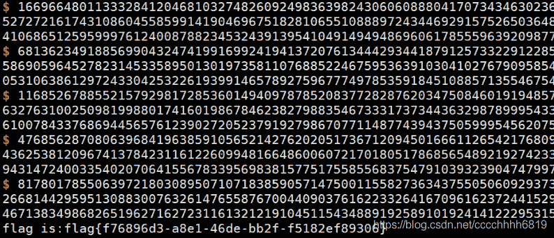

<!--yml
category: 未分类
date: 2022-04-26 14:38:52
-->

# 【CTF WriteUp】2020数字中国创新大赛部分题解_零食商人的博客-CSDN博客

> 来源：[https://blog.csdn.net/cccchhhh6819/article/details/105638398](https://blog.csdn.net/cccchhhh6819/article/details/105638398)

（好难啊~不会做啊）

# Crypto

## Can you get flag from GM crypto system

观察代码，程序生成的p和q要满足一些条件，其中有一条比较奇怪

```
pow(q ** 2 * x, (p-1)/2, p) + pow(p ** 2 * x, (q-1)/2, q) == N - phi - 1 
```

我们知道 N = p * q，phi = (p - 1) * (q - 1)，所以右边就是 p + q - 2，即(p - 1) + (q - 1)
再看左边，左边是一个数模p的余数，加上另一个数模q的余数。由于模p的余数最大为p - 1，模q的余数最大为q - 1，所以当且仅当这两个数为最大值时，等式才能成立，于是我们有：

```
pow(q ** 2 * x, (p-1)/2, p) = p-1
pow(p ** 2 * x, (q-1)/2, q) = q-1 
```

我们知道p和q都是素数，且p不等于q，所以p、q互质。根据欧拉定理，有

```
pow(q, p-1, p) = 1 
```

所以

```
p - 1 = pow(q ** 2 * x, (p-1)/2, p) 
= pow(q ** 2, (p-1)/2, p) * pow(x, (p-1)/2, p) 
= pow(x, (p-1)/2, p)

q - 1 = pow(p ** 2 * x, (q-1)/2, q)
= pow(p ** 2, (q-1)/2, q) * pow(x, (q-1)/2, q)
= pow(x, (q-1)/2, q) 
```

根据N % 8 = 1和phi % 8 = 4可知，p、q模4均为3，于是根据Goldwasser–Micali加密系统的密钥选择算法，x = n - 1是一个满足所有情况的解（此处不严谨，但不影响解题）

另一方面，我们知道phi和N，所以

```
N - phi + 1 = p + q
(N - phi + 1) ** 2 = (p + q) ** 2 
= p ** 2 + 2 * p * q + q ** 2 = (p - q) ** 2 + 4 * N 
```

可以求出p + q和p - q，进而求出p和q

继续往下做。代码将flag转换为二进制，然后把每一位s提出来，拼在一个随机二进制数r的后边，形成一个新数，然后计算

```
(pow(x, 2r+s, n) * r ** 2) % n 
```

并告诉我们。当x = n - 1时，可以直接用 -1 带进去，得到

```
(pow(x, 2r+s, n) * r ** 2) % n
= (pow(-1, 2r+s, n) * r ** 2) % n
= (pow(-1, s, n) * r ** 2) % n 
```

当 s = 1 时，这个数就是 - r ** 2 % n；当 s = 0 时，这个数就是 r ** 2 % n。注意到这里非常类似e = 2的RSA，所以我们尝试用Rabin算法对其进行求解，再将解带回原来的式子进行验证。如果验证正确，说明原来是正的平方数，s = 0；反之则 s = 1。以此求出flag

```
def egcd(a,b):
    if b==0:
        return 1,0
    else:
        x,y=egcd(b,a%b)
        return y,x-a/b*y

m = ''
for tmpc in c:
    # Rabin算法，首先计算mp和mq
    mp = pow(tmpc,(p+1)/4,p)
    mq = pow(tmpc,(q+1)/4,q)
    # 然后找到yp和yq，使得 yp*p + yq*q = 1
    yp, yq = egcd(p,q)
    # 根据以下公式计算出四个解，看哪个是正确的（验一个就行，剩下三个用不着）
    r0 = ( yp*p*mq + yq*q*mp ) % n
    if ((r0**2) % n) - tmpc == 0:
        m += '0'
    else:
        m += '1'
print n2s(int(m,2)) 
```

flag{bd4f1790-f4a2-4904-b4d2-8db8b24fd864}

## pell

（这题比较坑，蒙出来的，还没证出来）
阅读代码，首先要进行一个Proof of Work，略；然后服务器会随机生成一对(a, b)，其中a在10至50之间，b为1或2，然后要你输入不重复的150组解(x, y)，满足

```
x ** 2 - a * y ** 2 = b 
```

注意到，当a本身也是完全平方数如16、25、36、49时，你是一组解都找不到的，所以本题只针对特定的a、b有解，你需要刷出你想要的a、b。因为完全没有思路，所以写程序输出了100万以内所有可能的解，观察发现a = 15，b = 1时解比较多：

```
(a, b, x, y)
15 1 4 1
15 1 31 8
15 1 244 63
15 1 1921 496
15 1 15124 3905
15 1 119071 30744
15 1 937444 242047
15 1 7380481 1905632
15 1 58106404 15003009
15 1 457470751 118118440 
```

可以发现y基本上是成比例增加的，随着位数增加，比例的精度也随之增加。我们不知道具体精度，但是可以通过沿用上一个比例来计算下一个，即用最后一个y的平方除以倒数第二个y，求出下一个y，并验算此时是否存在x。按此方法，我们成功得到了当a = 15，b = 1时的150组解。

所以大体解题思路如下：

```
1\. 先过Proof of Work
2\. 拿到a和b，在小范围如100万以内找解，不够两个的就当无解，扔掉
3\. 够两个的，取最大的两个y，按照刚才的方法求下一个y，并验证是否存在x与之对应
4\. 确认答案没问题，扔给服务器 
```

结果是仅有不到10%的组合能求出解，果然我还是太菜了，好在题能做就行。代码提交时需要注意加延时，不然网络波动你后边的包先到，就错误了

```
#!/usr/bin/env python
# coding:utf-8
from pwn import *
import string
import hashlib
import sys

def proofofwork(suffix, res):
    dic = string.ascii_letters+string.digits
    for a in dic:
        for b in dic:
            for c in dic:
                for d in dic:
                    tmp = a+b+c+d
                    if(hashlib.sha256(tmp+suffix).hexdigest()==res):
                        return tmp

p = remote("39.97.210.182", 61235)

s = p.recvline()
print s.strip()
suffix = s[12:28]
res = s.strip()[33:]
x = proofofwork(suffix, res)
print x
p.send(x)
s = p.recvline()
print s.strip()
s = p.recvline()
print s.strip()
a = int(s.strip().split(',')[0].split('=')[1][1:])
b = int(s.strip().split(',')[1].split('=')[1][1:])

# goodlist = [11,12,14,15,17,18,20,21,23]

import gmpy2
import time

ylist = []
for y in range(1,1000000):
    s = gmpy2.iroot((y ** 2) * a + b, 2)
    if not s[1]:
        continue
    ylist.append(int(y))
print ylist
print 'The resolve is '+str(len(ylist))
if(len(ylist)<2):
    sys.exit(1)

for i in range(150):
    newy = ylist[-1]**2 / ylist[-2]
    s = gmpy2.iroot(newy**2*a+b,2)
    if(s[1]):
        print "SEND x = %s, y = %s" % (str(int(s[0])), str(newy))
        p.send(str(int(s[0])))
        p.send(str(newy))
        time.sleep(0.5)
        ylist.append(newy)
    else:
        break

s = p.recvline()
print s.strip() 
```


flag{f76896d3-a8e1-46de-bb2f-f5182ef89306}