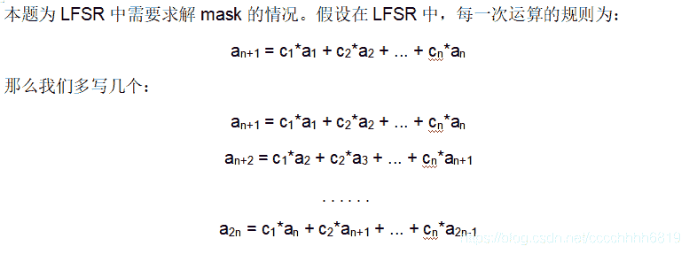
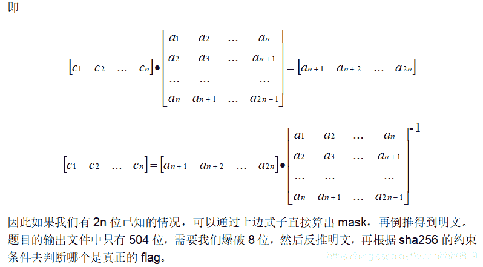
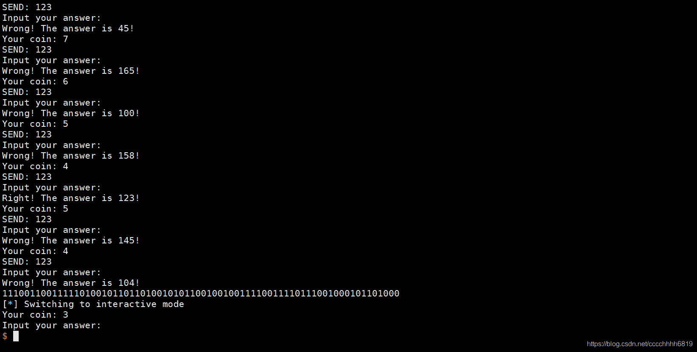
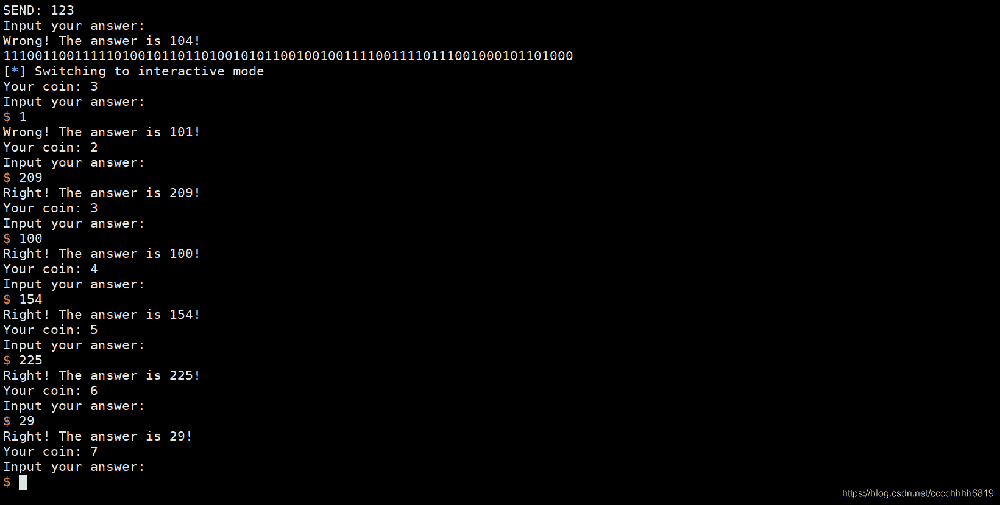
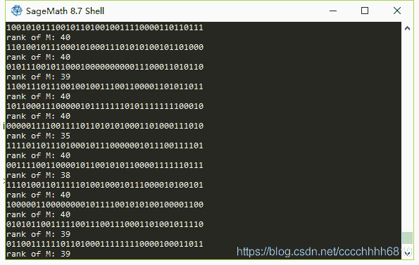
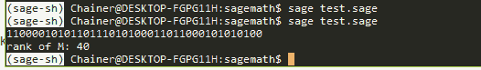
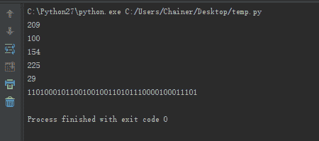

<!--yml
category: 未分类
date: 2022-04-26 14:35:10
-->

# 【CTF WriteUp】2020网鼎杯第三场Crypto题解_零食商人的博客-CSDN博客

> 来源：[https://blog.csdn.net/cccchhhh6819/article/details/106187873/](https://blog.csdn.net/cccchhhh6819/article/details/106187873/)

# Crypto

## simple

根据题目名称提示，本题为简单仿射密码，爆破得映射关系为：y = 8a + 22 (mod 26)，密钥使用方法为：123456 % 26 = 8，321564 % 26 = 22与爆破结果相同。于是得到正向替换表a-w b-e c-m d-u e-c f-k，反向替换得到flag。

## RUA

题目给出了三组n和c，且三个n之间两两互质，所以本题只可能是利用中国剩余定理求出me，然后爆破e求解m。解题代码如下：

```
#!/usr/bin/env python
# -*- coding: utf-8 -*-
import gmpy2
from libnum import n2s

c0 = 8024667293310019199660855174436055144348010556139300886990767145319919733369837206849070207955417356957254331839203914525519504562595117422955140319552013305532068903324132309109484106720045613714716627620318471048195232209672212970269569790677144450501305289670783572919282909796765124242287108717189750662740283813981242918671472893126494796140877412502365037187659905034193901633516360208987731322599974612602945866477752340080783296268396044532883548423045471565356810753599618810964317690395898263698123505876052304469769153374038403491084285836952034950978098249299597775306141671935146933958644456499200221696
n0 = 18856599160001833299560082802925753595735945621023660831294740454109973698430284916320395522883536507135735383517926050963512440162483065097256884040938259092582892259657340825971260278387406398529168309426241530551396056450450728728601248269612166083300938497235910244979946020059799495231539400114422748104072550004260736766137354572252872437140063474603268146956570787143010441293268321641092743010805639953103578977668248726500636191043930770036787317928372179939360510179438436665591755940224156131460271763912868322774604558314812111335691108887319827579162188169744014973478052491398688611046800951698773893393
c1 = 17388575106047489057419896548519877785989670179021521580945768965101106268068805843720622749203590810185213416901978773748832854888898576822477243682874784689127705334243899967896321836688567602323551986980634884700045627950473546069670440078998428940082620044462222475031805594211784370238038168894827559017562364252406425134530719911057780692073760058203345936344269833206906999625580911856011564697811258009937314511410514416706482571471852503756675411177080916350899445106002226392895645443215522671155311715637759618276305217468892076287376401516124640727839779731609203202530346427613422430202271506248285086956
n1 = 21996468204721630460566169654781925102402634427772676287751800587544894952838038401189546149401344752771866376882226876072201426041697882026653772987648569053238451992877808811034545463363146057879646485465730317977739706776287970278094261290398668538232727000322458605289913900919015380904209692398479885177984131014170652915222062267448446642158394150657058846328033404309210836219241651882903083719822769947131283541299760283547938795574020478852839044803553093825730447126796668238131579735916546235889726257184058908852902241422169929720898025622336508382492878690496154797198800699611812166851455110635853297883
c2 = 5170826942130658374627267470548549396328896108666717036999395626588154882531377393671593939192779292151584678688653835775920356845071292462816417186595460417761844407911946323815187102170021222644920874070699813549492713967666736815947822200867353461264579419205756500926218294604616696969184793377381622818381733352202456524002876336304465082656612634304327627259494264840838687207529676882041997761204004549052900816658341867989593333356630311753611684503882509990853456022056473296726728969894815574884063807804354952314391764618179147583447848871220103094864884798102542377747761263052887894135796051521881179607
n2 = 22182114562385985868993176463839749402849876738564142471647983947408274900941377521795379832791801082248237432130658027011388009638587979450937703029168222842849801985646044116463703409531938580410511097238939431284352109949200312466658018635489121157805030775386698514705824737070792739967925773549468095396944503293347398507980924747059180705269064441084577177316227162712249300900490014519213102070911105044792363935553422311683947941027846793608299170467483012199132849683112640658915359398437290872795783350944147546342693285520002760411554647284259473777888584007026980376463757296179071968120796742375210877789

assert gmpy2.gcd(n0, n1) == 1
assert gmpy2.gcd(n0, n2) == 1
assert gmpy2.gcd(n1, n2) == 1

N = n0*n1*n2
s = c0 * (N//n0) * gmpy2.invert(N//n0, n0) + c1 * (N//n1) * gmpy2.invert(N//n1, n1) + c2 * (N//n2) * gmpy2.invert(N//n2, n2)
s = s % N
prime = 2
while True:
    if not gmpy2.iroot(s, prime)[1]:
        prime = gmpy2.next_prime(prime)
        continue
    print n2s(int(gmpy2.iroot(s, prime)[0]))
    break 
```

## Guess-game（更新）

查看题目代码，发现题目主要涉及两个问题：问题1是根据现有的d = (d*a+c) (mod b)算出下一个d，取得(500, 10)的硬币，否则无法继续往下做；问题2是如何利用有限的10个硬币确定r和key的值，使得后续问题能够全对。

首先看问题1。设7个d分别为d0、d1、…、d6，根据条件有

```
d1 = d0*a+c % b
d2 = d1*a+c % b
…… 
```

所以

```
d2-d1 = (d1-d0)*a % b
d3-d2 = (d2-d1)*a % b
d4-d3 = (d3-d2)*a % b 
```

所以

```
b | (d2-d1)^2 - (d3-d2)*(d1-d0)
b | (d3-d2)^2 - (d4-d3)*(d2-d1)
b | (d4-d3)^2 - (d5-d4)*(d3-d2) 
```

右边三个求最大公约数，即为b。然后带入原式得

```
a = (d2-d1)*(d1-d0)^-1 求得a
c = d1-d0*a % b 求得c
d6 = (d5*a+c) % b 求得d6 
```

接下来看问题2。在我们有10个硬币的时候，可以允许9次错误机会。每次无论正确或错误，都可以知道当前r用过的连续8位，9次可以知道72位。由于算法流程类似求解mask的LFSR。有另一道类似的题目，其解答过程参考如下：

本题非常糟糕的一点是，我们有40个变量，但是只有32个方程。即使爆破其中的8位，每种组合至少也有一个解，而当这些解作为mask时，每一个都能导出正确的后续32位，但33-40位各不相同。因此说到底，本题必须在前期撞大运正确一次，才有希望继续往下做。（一直刷，其实概率不低）

本地搭了一个，示意如下：
（接上图，只有蒙对一个以后，后续才能逐个求出来，这是因为可以允许多错一次，那我就知道了完整的40个变量40个方程，可以求解）
只有32个方程时的sage脚本：

```
from sage.all_cmdline import *
import hashlib

GF2 = GF(2);
def pad(m):
    pad_length = 8 - len(m)
    return pad_length*'0' + m

for x in range(256):
    a = '111001100111110100101101101001010110010010011110011110111001000101101000'
    a = a + pad(bin(x)[2:])

    A = []
    for i in range(40):
        A.append([int(op) for op in a[i:i+40]])
    A = matrix(GF2,A)

    if A.rank() != 40:
        continue
    last = a[40:]

    b = [int(op) for op in last]
    b = vector(GF2, b)

    mask = A.solve_right(b)
    sss = ''
    for x in range(40):
        sss += str(mask[x])
    print  sss
    mask = int(sss, 2)

    N = 40
    F = GF(2)

    b = a
    R = [vector(F, N) for i in range(N)]

    for i in range(N):
        R[i][N - 1] = mask >> (N-1 - i) & 1

    for i in range(N - 1):
        R[i + 1][i] = 1

    M = Matrix(F, R)
    M = M ** N
    vec = vector(F, N)
    row = 0
    for i in range(N / 8):
        t = int(a[i*8:i*8+8],2)
        for j in xrange(7, -1, -1):
            vec[row] = t >> j & 1
            row += 1

    print 'rank of M:',rank(M)
    if M.rank() != 40:
        continue 
```

解题截图：

这一堆mask全是满足知道前40位能求出后边正确32位的，没法做。

再来看有40个方程时的sage脚本：

```
from sage.all_cmdline import *
import hashlib

GF2 = GF(2);
def pad(m):
    pad_length = 8 - len(m)
    return pad_length*'0' + m

for x in range(1):
    a = '11100110011111010010110110100101011001001001111001111011100100010110100001100101'
    #a = a + pad(bin(x)[2:])

    A = []
    for i in range(40):
        A.append([int(op) for op in a[i:i+40]])
    A = matrix(GF2,A)

    #if A.rank() != 40:
    #    continue
    last = a[40:]

    b = [int(op) for op in last]
    b = vector(GF2, b)

    mask = A.solve_right(b)
    sss = ''
    for x in range(40):
        sss += str(mask[x])
    print  sss
    mask = int(sss, 2)

    N = 40
    F = GF(2)

    b = a
    R = [vector(F, N) for i in range(N)]

    for i in range(N):
        R[i][N - 1] = mask >> (N-1 - i) & 1

    for i in range(N - 1):
        R[i + 1][i] = 1

    M = Matrix(F, R)
    M = M ** N
    vec = vector(F, N)
    row = 0
    for i in range(N / 8):
        t = int(a[i*8:i*8+8],2)
        for j in xrange(7, -1, -1):
            vec[row] = t >> j & 1
            row += 1

    print 'rank of M:',rank(M)
    if M.rank() != 40:
        continue 
```


就只剩一个了，然后随便写个程序就能继续往下求：

```
def solve(text, key):
    res = ''
    for k in range(40):
        text = text[-40:]
        tmp = 0
        for i in range(40):
            if(text[i]=='1')and(key[i]=='1'):
                tmp += 1
        res += str(tmp % 2)
        text = text + str(tmp % 2)
    print int(res[0:8],2)
    print int(res[8:16],2)
    print int(res[16:24],2)
    print int(res[24:32],2)
    print int(res[32:40],2)
    return res

text = "1001111001111011100100010110100001100101"
key  = "1100001010110111010100011011000101010100"
print solve(text[:40], key) 
```


就是刚才那张图一路right的结果。由于这题sage和python混用，本人菜鸡，只能输出500个数一个一个往里填拿到flag，这样也算是能做了吧。一键搞定的脚本我是写不出来，求大佬指点。