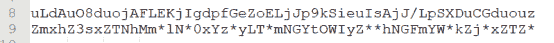

<!--yml
category: 未分类
date: 2022-04-26 14:18:51
-->

# 【CTF WriteUp】2020网鼎杯第二场Crypto题解_零食商人的博客-CSDN博客

> 来源：[https://blog.csdn.net/cccchhhh6819/article/details/106134649](https://blog.csdn.net/cccchhhh6819/article/details/106134649)

# Crypto

## b64

题目给了一个密文，和一组对应的明文密文，因此肯定是先通过已知对应明密文破解出加密算法，再利用加密算法和密文得到flag。根据题目名称b64，将给定明文base64加密一下看，发现指定位置变换相同，所以本题应该是一个单表代换再加一个base64解密。

大致得到对应表如上，但是很糟糕的是，明密文变换没有直接的对应关系，这里应该是随机映射。所以我们需要进行暴力破解。
统计一下已知的字母变换对，发现有22个字符还不知道。而未知的9个位置中，有6种不同字符。爆破6种字符的选择，再根据flag格式flag{xxxxxxxx-xxxx-xxxx-xxxx-xxxxxxxxxxxx}以及内容均为0<sub>9a</sub>f来验证是否可能为正确答案。大致代码如下：

```
#!/usr/bin/env python
# -*- coding: utf-8 -*-
import base64
import string

true_c = 'uLdAuO8duojAFLEKjIgdpfGeZoELjJp9kSieuIsAjJ/LpSXDuCGduouz'

c = 'pTjMwJ9WiQHfvC+eFCFKTBpWQtmgjopgqtmPjfKfjSmdFLpeFf/Aj2ud3tN7u2+enC9+nLN8kgdWo29ZnCrOFCDdFCrOFoF='
m = 'ashlkj!@sj1223%^&*Sd4564sd879s5d12f231a46qwjkd12J;DJjl;LjL;KJ8729128713'
m = base64.b64encode(m)
p = []
dic = 'ABCDEFGHIJKLMNOPQRSTUVWXYZabcdefghijklmnopqrstuvwxyz0123456789+/='

def thesame(a0,a1,a2,a3,a4,a5):
    if a0==a1 or a0==a2 or a0==a3 or a0==a4 or a0==a5:
        return True
    if a1==a2 or a1==a3 or a1==a4 or a1==a5:
        return True
    if a2==a3 or a2==a4 or a2==a5 or a3==a4 or a3==a5 or a4==a5:
        return True
    return False

def valid(text):
    for i in text:
        if i not in string.printable:
            return False
    return True

notselect = 'ACHJKPRVefnuvw156789+/'
f = open('1111.txt','w')
for a0 in notselect:
    print a0
    for a1 in notselect:
        for a2 in notselect:
            for a3 in notselect:
                for a4 in notselect:
                    for a5 in notselect:
                        if thesame(a0,a1,a2,a3,a4,a5):
                            continue
                        cipher = 'ZmxhZ3sxZTNhMm'+a0+'lN'+a1+'0xYz'+a2+'yLT'+a0+'mNGYtOWIyZ'+a1+a3+'hNGFmYW'+a4+'kZj'+a2+'xZTZ'+a5
                        plain = base64.b64decode(cipher)
                        if(valid(plain)and(plain[28]=='-')and(plain[-1]=='}')):
                            f.write(plain+'\n')
                            print plain 
```

（代码功底烂，见谅）

这样爆破可以得到很多结果，再根据flag常见格式进行筛选，得到满足要求的flag一共有六个：

```
flag{1e3a2ee4-1c02-5f4f-9b2d-a4afabdf01e6}
flag{1e3a2ee4-1c02-5f4f-9b2d-a4afaddf01e6}
flag{1e3a2de4-1c02-4f4f-9b2d-a4afabdf01e6}
flag{1e3a2de4-1c02-4f4f-9b2d-a4afaedf01e6}
flag{1e3a2be4-1c02-2f4f-9b2d-a4afaddf01e6}
flag{1e3a2be4-1c02-2f4f-9b2d-a4afaedf01e6} 
```

依次提交，其中某一个为正确答案

## rand

本题考查python中的伪随机数。代码首先给出了700个伪随机数的输出，而MT19937只有624个不同状态，因此是可以推出伪随机种子的，根据伪随机种子内容继续向下猜测，可以得到key。

在得到key之后尝试进行解密。注意到加密环节是Feistel结构，当前的加密函数不可复用，因此需要对照该加密函数写解密函数，再进行调用即可。完整代码如下：

```
#!/usr/bin/env python
# -*- coding: utf-8 -*-
from randcrack import RandCrack
import base64

...

def dedecrypt(ciphertext, secretkey):
    netss = SubstitutionBox(HexToBin(StrToHex(ciphertext)), IP)
    R, L = netss[:32], netss[32:]
    for i in range(16):
        L, R = Binxor(R, Function(L, secretkey[15-i])), L
    return SubstitutionBox(L + R, IP_1)

lines = open('random','r').readlines()
rc = RandCrack()
count = 0
for line in lines:
    count += 1
    rc.submit(int(line.strip()))
    if(count==624):
        break
for i in range(76):
    key = rc.predict_randrange(0, 2**32-1)

key = rc.predict_randrange(0, 2**32-1)
key = str(key)
keys = enkey(key[:8])
ciphertext = 't2GzuEfVDaJsNLBqC8N7C3/2UgIeCoQLC2qLkT1ukFULskzMc1u9QeFizVUfFYfA'
ciphertext = base64.b64decode(ciphertext)
plaintext = ''
for i in range(len(ciphertext) / 8):
    plaintext += dedecrypt(ciphertext[i * 8:(i + 1) * 8], keys)
print BinToStr(plaintext) 
```