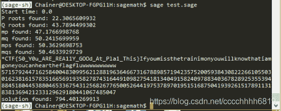
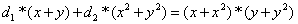

<!--yml
category: 未分类
date: 2022-04-26 14:21:42
-->

# 【CTF WriteUp】2021 starCTF部分Crypto题解_零食商人的博客-CSDN博客

> 来源：[https://blog.csdn.net/cccchhhh6819/article/details/112766888](https://blog.csdn.net/cccchhhh6819/article/details/112766888)

（打比赛感想：大佬真TM多。。。）

# Crypto

## Crypto-GuessKey

### 题目

```
from random import randint
import os
from flag import flag
N=64
key=randint(0,2**N)
print key
key=bin(key)[2:].rjust(N,'0')
count=0
while True:
	p=0
	q=0
	new_key=''
	zeros=[0]
	for j in range(len(key)):
		if key[j]=='0':
			zeros.append(j)
	p=zeros[randint(0,len(zeros))-1]
	q=zeros[randint(0,len(zeros))-1]
	try:
		mask=int(raw_input("mask:"))
	except:
		exit(0)
	mask=bin(mask)[2:]
	if p>q:
		tmp=q
		q=p
		p=tmp
	cnt=0
	for j in range(0,N):
		if j in range(p,q+1):
			new_key+=str(int(mask[cnt])^int(key[j]))
		else:
			new_key+=key[j]
		cnt+=1
		cnt%=len(mask)
	key=new_key
	try:
		guess=int(raw_input("guess:"))
	except:
		exit(0)
	if guess==int(key,2):
		count+=1
		print 'Nice.'
	else:
		count=0
		print 'Oops.'
	if count>2:
		print flag 
```

### 解答

题目出错了，给出key让猜key，输入mask=0保持key不变就可以了。

## Crypto-GuessKey2

### 题目

```
from random import randint
import os
from flag import flag
N=64
key=randint(0,2**N)

key=bin(key)[2:].rjust(N,'0')
count=0
while True:
	p=0
	q=0
	new_key=''
	zeros=[0]
	for j in range(len(key)):
		if key[j]=='0':
			zeros.append(j)
	p=zeros[randint(0,len(zeros))-1]
	q=zeros[randint(0,len(zeros))-1]
	try:
		mask=int(raw_input("mask:"))
	except:
		exit(0)
	mask=bin(mask)[2:]
	if p>q:
		tmp=q
		q=p
		p=tmp
	cnt=0
	for j in range(0,N):
		if j in range(p,q+1):
			new_key+=str(int(mask[cnt])^int(key[j]))
		else:
			new_key+=key[j]
		cnt+=1
		cnt%=len(mask)
	key=new_key
	try:
		guess=int(raw_input("guess:"))
	except:
		exit(0)
	if guess==int(key,2):
		count+=1
		print 'Nice.'
	else:
		count=0
		print 'Oops.'
	if count>2:
		print flag 
```

### 解答

修正后的题目，隐藏了key值，因此输入mask=0没有作用了。首先分析一下算法：

1.  随机生成一个64位0和1组成的key
2.  将其所有为0的位置存储到一个数组中，从中取两个数p < q
3.  要求我们输入一个mask，然后对key进行处理，对于(p, q)之间的部分异或我们的mask，其余部分不动，得到新key，让我们猜
4.  回到步骤2

注意到key在每次输入后是发生变化的，因此尝试通过输入将key修正为我们想要的值。注意到p的选择来自zeros数组，因此key[p]一定是0。当我们输入一个不是0的mask时，mask转换为二进制参与运算，其首位为1，则新的key[p]将变成1。如果我们随机到了最左边的0的位置参与运算，那么在此位变成1以后，后续每个选择的p都会在这一位的右边（因为p只能选择为0的位置），p的左边在更新key时原样照抄，即从左边开始数连续为1的位数只增不减。因此我们只需要输入mask为全1，然后疯狂猜测key = 2 ** 64 - 1。当某次正确后，再输入两次mask = 0即可。完整解题代码如下：

```
 from pwn import *

p = remote("52.163.228.53", 8082)
count = 0
while True:
    p.recvuntil("mask:")
    p.sendline("18446744073709551615")
    p.recvuntil("guess:")
    p.sendline("18446744073709551615")
    rec = p.recvline()
    print rec.strip() + " " + str(count)
    count += 1
    if(rec.startswith("Oops.")):
        continue
    else:
        for i in range(2):
            p.recvuntil("mask:")
            p.sendline("0")
            p.recvuntil("guess:")
            p.sendline("18446744073709551615")
            print p.recvline()
        print p.recvline()
        break
p.close() 
```

（后话：mask = 2 ** 64 - 1 没有问题，但按照解题原理输入任意非0值最后都能得到结果，实际没跑出来）

## Crypto-little case

### 题目

challenge.py

```
from Crypto.Util.number import *
from libnum import *
from secret import flag,special,p,q,n

def little_trick(msg):
    p1 = getPrime(1024)
    q1 = getPrime(1024)
    n1 = p1 * q1
    d1=random.randint(1,2**256)
    e1=inverse(d1,(p-1)*(q-1))
    print(n1)
    print(e1)
    print(pow(msg,e1,n1))

def real_trick():
    assert (special > (ord("*")*100) and gcd(special,(p-1)*(q-1))!=1 )
    print(n)
    print(pow(libnum.s2n(flag),special,n))

if __name__ == '__main__':
    little_trick(p-1)
    real_trick() 
```

out.sage

```
21669699875387343975765484834175962461348837371447024695458479154615348697330944566714587217852888702291368306637977095490953192701450127798670425959768118384915082017373951315699899009631834471691811815393784748930880954114446745814058132752897827717077886547911476575751254872623927783670252969995075629255541621917767501261249192653546875104532649043219697616464205772025267019328364349763854659490144531087349974469079255236823096415094552037488277752927579909539401311624671444833332618177513356173537573280352724384376372955100031534236816681805396608147647003653628203258681097552049114308367967967184116839561

20717541468269984768938524534679430706714860712589983300712432366828367981392533792814384884126053081363266457682162675931547901815985830455612301105504518353600255693451085179954519939635263372257973143178677586338992274607959326361412487748088349413448526455377296931144384663805056580662706419414607407821761761574754611275621927387380065975844282519447660467416826579669726178901884060454994606177784839804528666823956703141147239309978420776148158425922031573513062568162012505209805669623841355103885621402814626329355281853436655713194649170570579414480803671531927080535374958180810697826214794117466378050607

17653913822265292046140436077352027388518012934178497059850703004839268622175666123728756590505344279395546682262531546841391088108347695091027910544112830270722179480786859703225421972669021406495452107007154426730798752912163553332446929049057464612267870012438268458914652129391150217932076946886301294155031704279222594842585123671871118879574946424138391703308869753154497665630799300138651304835205755177940116680821142858923842124294529640719629497853598914963074656319325664210104788201957945801990296604585721820046391439235286951088086966253038989586737352467905401107613763487302070546247282406664431777475

2346087036331379968192118389403047568445805414881948978518580277027027486284293415097623011228506968071753709256352246733181304513713003096615266613365080909760605498017330085960699607777361429562376124376340215426398797920168016137830563564636922257215066266075494625782943973857490781916694118187094786034792437781964601089843549995939887939410763350338658901108020658475956489391300528691289604149598720803012371765770928211044755626045817053870803040863722458554924076011151695567147976903053993914859714631837755435592006986598006207692599019026644753575853382810261910332197447386727419606073948645238377595719

12732299056226934743176360461051108799706450051853623472248552066649321279227693844417404789169416642586313895494292082308084823101092675162498154181999270703392144766031531668783213589136974486867571090321426005719333327425286160436925591205840653712046866950957876967715226097699016798471712274797888761218915345301238306497841970203137048433491914195023230951832644259526895087301990301002618450573323078919808182376666320244077837033894089805640452791930176084416087344594957596135877833163152566525019063919662459299054294655118065279192807949989681674190983739625056255497842063989284921411358232926435537518406L 
```

### 解答

这题损得一批，但也不是不能做，毕竟过程中留下了提示。

首先看little_trick，e1的那个求法明显和周围格格不入，正常应当是`e1 = inverse(d1, (p1-1) * (q1-1))`。且按照这个算法，可以使用wiener攻击求出d1，并成功分解n1。这里隐藏着题目最核心的一个提示：**代码不一定是对的**。

```
n1 = 21669699875387343975765484834175962461348837371447024695458479154615348697330944566714587217852888702291368306637977095490953192701450127798670425959768118384915082017373951315699899009631834471691811815393784748930880954114446745814058132752897827717077886547911476575751254872623927783670252969995075629255541621917767501261249192653546875104532649043219697616464205772025267019328364349763854659490144531087349974469079255236823096415094552037488277752927579909539401311624671444833332618177513356173537573280352724384376372955100031534236816681805396608147647003653628203258681097552049114308367967967184116839561
e1 = 20717541468269984768938524534679430706714860712589983300712432366828367981392533792814384884126053081363266457682162675931547901815985830455612301105504518353600255693451085179954519939635263372257973143178677586338992274607959326361412487748088349413448526455377296931144384663805056580662706419414607407821761761574754611275621927387380065975844282519447660467416826579669726178901884060454994606177784839804528666823956703141147239309978420776148158425922031573513062568162012505209805669623841355103885621402814626329355281853436655713194649170570579414480803671531927080535374958180810697826214794117466378050607
c1 = 17653913822265292046140436077352027388518012934178497059850703004839268622175666123728756590505344279395546682262531546841391088108347695091027910544112830270722179480786859703225421972669021406495452107007154426730798752912163553332446929049057464612267870012438268458914652129391150217932076946886301294155031704279222594842585123671871118879574946424138391703308869753154497665630799300138651304835205755177940116680821142858923842124294529640719629497853598914963074656319325664210104788201957945801990296604585721820046391439235286951088086966253038989586737352467905401107613763487302070546247282406664431777475
d1 = 36167461773898995192586226632578677184913220227461899855497899052924496298787
p1 = 172725732665160218766764654273481422951178250693790825716359642314019315013321867434849375780994146440118500992456863730311444752367847389052666095324149584230474450693683416636565463345342017830651196454735159385924736453857045827989347928771104006978412412405607299616293396656259291378061505961429915687703
q1 = 125457275769068125757485908164006976153846494199951055956773829512867658202991509882220598391130551501414264867302691498062034690987771420463818096949614464177297177742292221196272475473441901790650971196178740160270878352307469807794533558079725928555246759355468676092854618354193968504322694550607414849887
msg = pow(c1, d1, n1) 
```

以这个观点继续看real_trick，可以发现n比余数c少一位数字。加上之前我们通过little_trick求出的msg与p的关系，可以猜测出题人故意删掉了一位，经实验发现在n前补一个2，正好可以被msg+1整除，所以这才是真正的n

```
n = 22346087036331379968192118389403047568445805414881948978518580277027027486284293415097623011228506968071753709256352246733181304513713003096615266613365080909760605498017330085960699607777361429562376124376340215426398797920168016137830563564636922257215066266075494625782943973857490781916694118187094786034792437781964601089843549995939887939410763350338658901108020658475956489391300528691289604149598720803012371765770928211044755626045817053870803040863722458554924076011151695567147976903053993914859714631837755435592006986598006207692599019026644753575853382810261910332197447386727419606073948645238377595719
p = 199138677823743837339927520157607820029746574557746549094921488292877226509198315016018919385259781238148402833316033634968163276198999279327827901879426429664674358844084491830543271625147280950273934405879341438429171453002453838897458102128836690385604150324972907981960626767679153125735677417397078196059
q = 112213695905472142415221444515326532320352429478341683352811183503269676555434601229013679319423878238944956830244386653674413411658696751173844443394608246716053086226910581400528167848306119179879115809778793093611381764939789057524575349501163689452810148280625226541609383166347879832134495444706697124741 
```

然后我们只剩最后一个条件可以用了，即`gcd(special, (p-1)(q-1)) != 1`。用factordb尝试分解一下p-1和q-1，发现有公共因数2和4919。以出题人这道题的尿性，估计special就是4919没跑了。后边很像NCTF的easyrsa，即求出满足`pow(x, 4919, p) = c % p`和`pow(x, 4919, q) = c % q`的各4919个根，然后用中国剩余定理求出4919 * 4919种情况下的m并分别进行验证，找到真正的flag。解题代码如下：（需要运行约15分钟）

```
import random
import time

def AMM(o, r, q):
    g = GF(q)
    o = g(o)
    p = g(random.randint(1, q))
    while p ^ ((q-1) // r) == 1:
        p = g(random.randint(1, q))
    t = 0
    s = q - 1
    while s % r == 0:
        t += 1
        s = s // r
    k = 1
    while (k * s + 1) % r != 0:
        k += 1
    alp = (k * s + 1) // r
    a = p ^ (r**(t-1) * s)
    b = o ^ (r*alp - 1)
    c = p ^ s
    h = 1
    for i in range(1, t):
        d = b ^ (r^(t-1-i))
        if d == 1:
            j = 0
        else:
            j = - dicreat_log(a, d)
        b = b * (c^r)^j
        h = h * c^j
        c = c ^ r
    result = o^alp * h
    return result

def findAllPRoot(p, e):
    proot = set()
    while len(proot) < e:
        proot.add(pow(random.randint(2, p-1), (p-1)//e, p))
    return proot

def findAllSolutions(mp, proot, cp, p):
    all_mp = set()
    for root in proot:
        mp2 = mp * root % p
        assert(pow(mp2, e, p) == cp)
        all_mp.add(mp2)
    return all_mp

c = 12732299056226934743176360461051108799706450051853623472248552066649321279227693844417404789169416642586313895494292082308084823101092675162498154181999270703392144766031531668783213589136974486867571090321426005719333327425286160436925591205840653712046866950957876967715226097699016798471712274797888761218915345301238306497841970203137048433491914195023230951832644259526895087301990301002618450573323078919808182376666320244077837033894089805640452791930176084416087344594957596135877833163152566525019063919662459299054294655118065279192807949989681674190983739625056255497842063989284921411358232926435537518406
p = 199138677823743837339927520157607820029746574557746549094921488292877226509198315016018919385259781238148402833316033634968163276198999279327827901879426429664674358844084491830543271625147280950273934405879341438429171453002453838897458102128836690385604150324972907981960626767679153125735677417397078196059
q = 112213695905472142415221444515326532320352429478341683352811183503269676555434601229013679319423878238944956830244386653674413411658696751173844443394608246716053086226910581400528167848306119179879115809778793093611381764939789057524575349501163689452810148280625226541609383166347879832134495444706697124741
e = 4919

start_time = time.time()
print "Start time: 0.0"
# find all roots for pow(x, e, p)=1 and pow(x, e, q)=1 
cp = c % p
cq = c % q
p_proot = findAllPRoot(p, e)
print "P roots found: %s" % str(time.time()-start_time)
q_proot = findAllPRoot(q, e)
print "Q roots found: %s" % str(time.time()-start_time)

# find all roots for pow(x, e, p)=cp and pow(x, e, q)=cq
mp = AMM(cp, e, p)
print "mp found: %s" % str(time.time()-start_time)
mq = AMM(cq, e, q)
print "mq found: %s" % str(time.time()-start_time)

mps = findAllSolutions(mp, p_proot, cp, p)
print "mps found: %s" % str(time.time()-start_time)
mqs = findAllSolutions(mq, q_proot, cq, q)
print "mqs found: %s" % str(time.time()-start_time)

def check(m):
    h = m.hex()
    if len(h) & 1:
        return False
    if h.decode('hex').startswith('*CTF'):
        print(h.decode('hex'))
        return True
    else:
        return False

# check 4919*4919 possibles for answer
for mpp in mps:
    for mqq in mqs:
        solution = CRT_list([int(mpp), int(mqq)], [p, q])
        if check(solution):
            print solution
            print "solution found: %s" % str(time.time()-start_time) 
```



## Crypto-MyEnc

### 题目

```
from Crypto.Util.number import getPrime,bytes_to_long
import time,urandom
from flag import flag
iv=bytes_to_long(urandom(256))
assert len(flag)==15
keystream=bin(int(flag.encode('hex'),16))[2:].rjust(8*len(flag),'0')
p=getPrime(1024)
q=getPrime(1024)
n=p*q
print "n:",n
cnt=0
while True:
	try:
		print 'give me a number:'
		m=int(raw_input())
	except:
		break
	ct=iv
	for i in range(1,8):
		if keystream[cnt]=='1':
			ct+=pow(m^q,i**i**i,n)
			ct%=n
		cnt=(cnt+1)%len(keystream)
	print "done:",ct 
```

### 解答

根据题目代码，flag长度为15，并且针对构成这15个字符的120位，每次要求我们输入一个m，然后取出其中7位进行一些计算。120位循环出现

```
ct=iv
for i in range(1,8):
	if keystream[cnt]=='1':
		ct+=pow(m^q,i**i**i,n)
		ct%=n
	cnt=(cnt+1)%len(keystream) 
```

由于m^q的异或比较难处理，我们先令m=0，得到2个结果。注意到这些结果在模q的情况下是同余的，因此任选其中两个做差，与n求最大公约数，即可求出q

求出q以后就非常好办了，令m = q xor 2，这样我们得到的就是ct加上一些2 ** x的结果，而这些x我们又是知道的，只有固定的七种（太大这里写不下）。我们可以通过爆破iv的所有可能取值并逐个验证找到真实iv，再还原flag。解题代码分为两部分，一部分为取数，另一部分为解题。

取数代码：

```
 from pwn import *
import hashlib
import string
import gmpy2

def mysha(text):
    myhash = hashlib.sha256()
    myhash.update(text)
    return myhash.hexdigest()

def passpow(suffix, target):
    dic = string.letters + string.digits
    for a0 in dic:
        for a1 in dic:
            for a2 in dic:
                for a3 in dic:
                    tmp = a0 + a1 + a2 + a3 + suffix
                    if(mysha(tmp)==target):
                        return a0 + a1 + a2 + a3

p = remote("52.163.228.53", 8081)
line = p.readline()
suffix = line[12:28]
target = line[33:97]
passwd = passpow(suffix, target)
p.recvuntil("Give me xxxx:")
p.sendline(passwd)

line = p.readline()
n = int(p.readline().strip()[3:])

arr = []
for i in range(2):
    p.recvuntil("give me a number:")
    p.sendline("0")
    line = p.readline()
    arr.append(int(p.readline().strip()[6:]))

q = gmpy2.gcd(arr[1]-arr[0], n)
assert n > q
assert q > 1

arr = []
newm = q ^ 2
for i in range(18):
    p.recvuntil("give me a number:")
    p.sendline(str(newm))
    line = p.readline()
    arr.append(int(p.readline().strip()[6:]))
print n
print q
print arr

p.interactive() 
```

解题代码：

```
n = ...
q = ...
arr = [...]
mark = [pow(2, i**i**i, n) for i in range(1, 8)] 

tmpiv1 = []
tmpiv2 = []
for i in range(128):
    tmp = bin(i)[2:].rjust(7, '0')
    s0 = arr[0]
    s1 = arr[1]
    for j in range(7):
        if(tmp[j]=='1'):
            s0 = (s0 - mark[j]) % n
            s1 = (s1 - mark[j]) % n
    tmpiv1.append(s0)
    tmpiv2.append(s1)

ss = list(set(tmpiv1).intersection(set(tmpiv2)))

for m in range(len(ss)):
    try:
        iv = int(ss[m])
        res = []
        for i in range(128):
            tmp = bin(i)[2:].rjust(7, '0')
            s = iv
            for j in range(7):
                if(tmp[j]=='1'):
                    s = (s + mark[j]) % n
            res.append(s)

        c = ""
        for i in range(len(arr)):
            tmp = res.index(arr[i])
            tmp = bin(tmp)[2:].rjust(7, '0')
            c += tmp
        c = c[:120]

        c = c[106:] + c[:106]
        print ''.join(chr(int(c[i:i+8], 2)) for i in range(0, 120, 8))
    except:
        continue 
```

## Crypto-MyCurve

（感谢大佬提供解答）

### 题目

```
from Crypto.Util.number import bytes_to_long
from flag import flag
assert flag[:5]=='*CTF{' and flag[-1]=='}'
flag=flag[5:-1]
def add(P,Q):
	if Q==0:
		return P
	x1,y1=P
	x2,y2=Q
	return (d1*(x1+x2)+d2*(x1+y1)*(x2+y2)+(x1+x1^2)*(x2*(y1+y2+1)+y1*y2))/(d1+(x1+x1^2)*(x2+y2)),(d1*(y1+y2)+d2*(x1+y1)*(x2+y2)+(y1+y1^2)*(y2*(x1+x2+1)+x1*x2))/(d1+(y1+y1^2)*(x2+y2))

def mul(k,P):
	Q=(0,0)
	while k>0:
		if is_even(k):
			k/=2
			P=add(P,P)
		else:
			k-=1
			Q=add(P,Q)
	return Q

F=GF(2**100)
R.<x,y>=F[]
d1=F.fetch_int(1)
d2=F.fetch_int(1)
x,y=(698546134536218110797266045394L, 1234575357354908313123830206394L)
G=(F.fetch_int(x),F.fetch_int(y))
P=mul(bytes_to_long(flag),G)
print (G[0].integer_representation(),G[1].integer_representation())
print (P[0].integer_representation(),P[1].integer_representation())
#(698546134536218110797266045394L, 1234575357354908313123830206394L)
#(403494114976379491717836688842L, 915160228101530700618267188624L) 
```

### 解答

本题考查二元域上的爱德华兹曲线。该曲线方程通用形式为

曲线的细节见这里
https://www.hyperelliptic.org/EFD/g12o/auto-edwards.html
https://www.hyperelliptic.org/EFD/g12o/data/edwards/coordinates

使用sagemath中的椭圆曲线设置与离散对数函数可以直接求解

```
from Crypto.Util.number import long_to_bytes

F = GF(2**100)
R.<x,y> = F[]

def _map(p):
    x,y = F.fetch_int(p[0]), F.fetch_int(p[1])
    u = 3*(x+y)/(x*y+x+y)
    v = 3*(x/(x*y+x+y)+2)
    return (u,v)

G = (698546134536218110797266045394, 1234575357354908313123830206394)
P = (403494114976379491717836688842, 915160228101530700618267188624)

E = EllipticCurve(GF(2**100), [1, 2, 0, 0, 3])
base = E(_map(G))
res = E(_map(P))
flag = discrete_log(res, base, base.order(), operation="+")
print(long_to_bytes(flag)) 
```