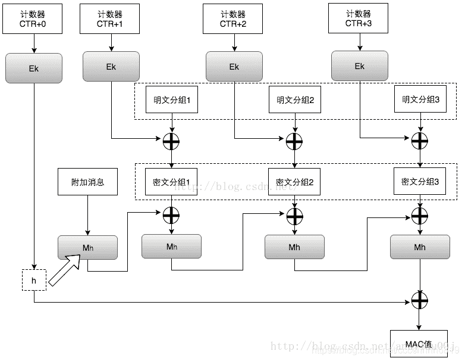
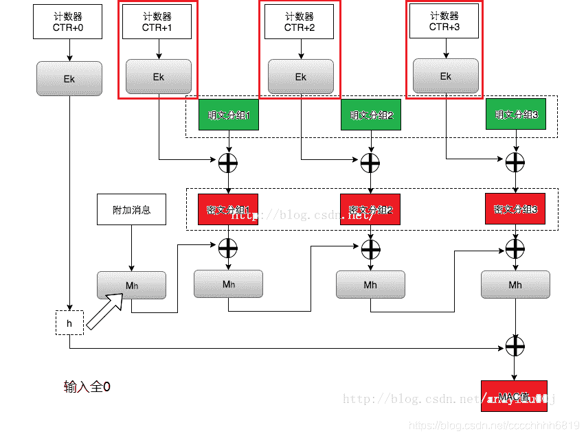
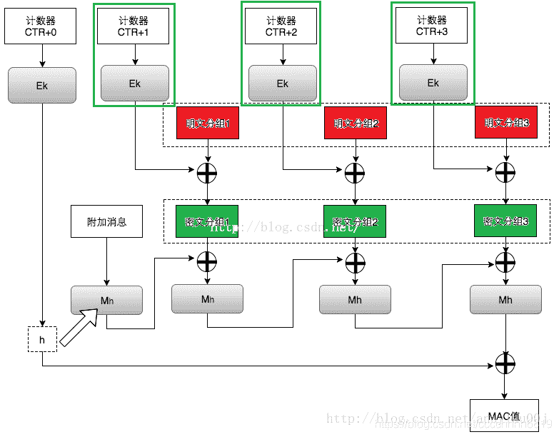

<!--yml
category: 未分类
date: 2022-04-26 14:37:25
-->

# 【CTF WriteUp】UTCTF 2020部分题解_零食商人的博客-CSDN博客

> 来源：[https://blog.csdn.net/cccchhhh6819/article/details/104847217](https://blog.csdn.net/cccchhhh6819/article/details/104847217)

看大佬们不屑于写这种比赛的WP，那就我这个菜鸡来献丑了

# Crypto

## [basics] crypto

先把1和0转成ascii

```
Uh-oh, looks like we have another block of text, with some sort of special encoding. Can you figure out what this encoding is? (hint: if you look carefully, you'll notice that there only characters present are A-Z, a-z, 0-9, and sometimes / and +. See if you can find an encoding that looks like this one.)
TmV3IGNoYWxsZW5nZSEgQ2FuIHlvdSBmaWd1cmUgb3V0IHdoYXQncyBnb2luZyBvbiBoZXJlPyBJdCBsb29rcyBsaWtlIHRoZSBsZXR0ZXJzIGFyZSBzaGlmdGVkIGJ5IHNvbWUgY29uc3RhbnQuIChoaW50OiB5b3UgbWlnaHQgd2FudCB0byBzdGFydCBsb29raW5nIHVwIFJvbWFuIHBlb3BsZSkuCmt2YnNxcmQsIGl5ZSdibyBrdnd5Y2QgZHJvYm8hIFh5ZyBweWIgZHJvIHBzeGt2IChreG4gd2tpbG8gZHJvIHJrYm5vY2QuLi4pIHprYmQ6IGsgY2VsY2RzZGVkc3l4IG1zenJvYi4gU3ggZHJvIHB5dnZ5Z3N4cSBkb2hkLCBTJ2ZvIGRrdW94IHdpIHdvY2NrcW8ga3huIGJvenZrbW9uIG9mb2JpIGt2enJrbG9kc20gbXJrYmttZG9iIGdzZHIgayBteWJib2N6eXhub3htbyBkeSBrIG5zcHBvYm94ZCBtcmtia21kb2IgLSB1eHlneCBrYyBrIGNlbGNkc2RlZHN5eCBtc3pyb2IuIE1reCBpeWUgcHN4biBkcm8gcHN4a3YgcHZrcT8gcnN4ZDogR28gdXh5ZyBkcmtkIGRybyBwdmtxIHNjIHF5c3hxIGR5IGxvIHlwIGRybyBweWJ3a2QgZWRwdmtxey4uLn0gLSBncnNtciB3b2t4YyBkcmtkIHNwIGl5ZSBjb28gZHJrZCB6a2Rkb2J4LCBpeWUgdXh5ZyBncmtkIGRybyBteWJib2N6eXhub3htb2MgcHliIGUsIGQsIHAsIHYgaywga3huIHEga2JvLiBJeWUgbWt4IHpieWxrbHZpIGd5YnUgeWVkIGRybyBib3drc3hzeHEgbXJrYmttZG9iYyBsaSBib3p2a21zeHEgZHJvdyBreG4gc3hwb2Jic3hxIG15d3d5eCBneWJuYyBzeCBkcm8gT3hxdnNjciB2a3hxZWtxby4gS3h5ZHJvYiBxYm9rZCB3b2RyeW4gc2MgZHkgZWNvIHBib2Flb3htaSBreGt2aWNzYzogZ28gdXh5ZyBkcmtkICdvJyBjcnlnYyBleiB3eWNkIHlwZG94IHN4IGRybyBrdnpya2xvZCwgY3kgZHJrZCdjIHpieWxrbHZpIGRybyB3eWNkIG15d3d5eCBtcmtia21kb2Igc3ggZHJvIGRvaGQsIHB5dnZ5Z29uIGxpICdkJywga3huIGN5IHl4LiBZeG1vIGl5ZSB1eHlnIGsgcG9nIG1ya2JrbWRvYmMsIGl5ZSBta3ggc3hwb2IgZHJvIGJvY2QgeXAgZHJvIGd5Ym5jIGxrY29uIHl4IG15d3d5eCBneWJuYyBkcmtkIGNyeWcgZXogc3ggZHJvIE94cXZzY3Igdmt4cWVrcW8uCnJnaG54c2RmeXNkdGdodSEgcWdmIGlzYWsgY3RodHVpa2UgZGlrIHprbnRoaGt4IHJ4cWxkZ254c2xpcSByaXN5eWtobmsuIGlreGsgdHUgcyBjeXNuIGNneCBzeXkgcWdmeCBpc3hlIGtjY2d4ZHU6IGZkY3lzbntoMHZfZGk0ZHVfdmk0ZF90X3I0eXlfcnhxbGQwfS4gcWdmIHZ0eXkgY3RoZSBkaXNkIHMgeWdkIGdjIHJ4cWxkZ254c2xpcSB0dSBwZnVkIHpmdHlldGhuIGdjYyBkaXR1IHVneGQgZ2MgenN1dHIgYmhndnlrZW5rLCBzaGUgdGQgeGtzeXlxIHR1IGhnZCB1ZyB6c2Ugc2Nka3ggc3l5LiBpZ2xrIHFnZiBraHBncWtlIGRpayByaXN5eWtobmsh 
```

然后把这一堆base64解码

```
New challenge! Can you figure out what's going on here? It looks like the letters are shifted by some constant. (hint: you might want to start looking up Roman people).
kvbsqrd, iye'bo kvwycd drobo! Xyg pyb dro psxkv (kxn wkilo dro rkbnocd...) zkbd: k celcdsdedsyx mszrob. Sx dro pyvvygsxq dohd, S'fo dkuox wi wocckqo kxn bozvkmon ofobi kvzrklodsm mrkbkmdob gsdr k mybboczyxnoxmo dy k nsppoboxd mrkbkmdob - uxygx kc k celcdsdedsyx mszrob. Mkx iye psxn dro psxkv pvkq? rsxd: Go uxyg drkd dro pvkq sc qysxq dy lo yp dro pybwkd edpvkq{...} - grsmr wokxc drkd sp iye coo drkd zkddobx, iye uxyg grkd dro mybboczyxnoxmoc pyb e, d, p, v k, kxn q kbo. Iye mkx zbylklvi gybu yed dro bowksxsxq mrkbkmdobc li bozvkmsxq drow kxn sxpobbsxq mywwyx gybnc sx dro Oxqvscr vkxqekqo. Kxydrob qbokd wodryn sc dy eco pboaeoxmi kxkvicsc: go uxyg drkd 'o' crygc ez wycd ypdox sx dro kvzrklod, cy drkd'c zbylklvi dro wycd mywwyx mrkbkmdob sx dro dohd, pyvvygon li 'd', kxn cy yx. Yxmo iye uxyg k pog mrkbkmdobc, iye mkx sxpob dro bocd yp dro gybnc lkcon yx mywwyx gybnc drkd cryg ez sx dro Oxqvscr vkxqekqo.
rghnxsdfysdtghu! qgf isak cthtuike dik zknthhkx rxqldgnxsliq risyykhnk. ikxk tu s cysn cgx syy qgfx isxe kccgxdu: fdcysn{h0v_di4du_vi4d_t_r4yy_rxqld0}. qgf vtyy cthe disd s ygd gc rxqldgnxsliq tu pfud zftyethn gcc ditu ugxd gc zsutr bhgvykenk, she td xksyyq tu hgd ug zse scdkx syy. iglk qgf khpgqke dik risyykhnk! 
```

打开词频分析工具弄就可以了（非常尴尬的是两段的替换方式还不一样）

```
congratulations! you have finished the beginner cryptography challenge. here is a flag for all your hard efforts: utflag{n0w_th4ts_wh4t_i_c4ll_crypt0}. you will find that a lot of cryptography is just building off this sort of basic knowledge, and it really is not so bad after all. hope you enjoyed the challenge! 
```

utflag{n0w_th4ts_wh4t_i_c4ll_crypt0}

## One True Problem

以前见过类似题目，是一次一密同一密钥复用。如果明文和密钥都有语义的话，可以根据语义逐个猜测出所有内容。
思路过程：密钥前几位是utflag => 明文大部分为大写字母和空格（有一个逗号） => 因为密钥的某一位和两个密文的该位异或都是大写字母或空格，写程序输出密钥的所有可能值 => 其中有一位只能是l，看上下文猜这可能是flag => 第一段明文最后CRYPTOGRAPHY结尾 => 密钥前边重写一遍 => 第一段明文中间CATEGORY => 全密钥
utflag{tw0_tim3_p4ds}

## Hill

这题就是个二阶希尔密码加密。知道密文前6位wznqca和明文前6位utflag，等于4个未知数6个一阶方程，居然还有解，那就是二阶跑不了了。求个逆乘回来就好。

```
a00, a01, a10, a11 = 13, 6, 3, 21
dic = 'abcdefghijklmnopqrstuvwxyz'
c = 'wznqcaduqopfkqnwofdbzgeu'
m = ''
for i in xrange(0, len(c), 2):
    a, b = dic.index(c[i]), dic.index(c[i+1])
    a0, b0 = (a00*a+a01*b)%26, (a10*a+a11*b)%26
    m += dic[a0]
    m += dic[b0]
print m 
```

记得把中间下划线、空格、数字之类的补回去，还有一个字母是大写别忘了
utflag{d4nger0us_c1pherText_qq}

## Galois

参考文章https://blog.csdn.net/andylau00j/article/details/79269303

脚本中加密使用的算法是AES-GCM，这是一个很类似AES-CTR的算法，示意图如下：（来自参考文章）

题目首先告知了flag的密文，并且允许我们进行加密和解密。解密需要密文和tag，太麻烦不管，我们先看看加密能给我们什么。
加密的时候明文分组是我选的，已知；密文分组会回复我们，已知；使用同一个字段加密两次发现结果相同，说明计数器CTR在一次访问内是不变的。因此利用明文和密文，可以求出这些enc(CTR+i)的值

那么问题就简单了。我们知道enc(flag)，知道enc(CTR+i)，异或就可以了管你算法干嘛。。

代码略
utflag{6cm_f0rb1dd3n_4774ck_777}

## Random ECB

观察代码，服务器端对你给出的待加密内容，可能会在前边缀一个A字符，也可能不会缀，然后在后边加上flag字符串，采用AES-ECB加密并返回。我们知道AES-ECB加密的每一块（128位）是互不影响的，因此我们可以把待加密字符串视作若干次128位的字符串分别加密。于是我们可以依托该加密原理，达到以下目的：

1.判断flag的长度。我们知道AES加密的时候要padding，对于这种有可能在前边加个字符的情况，在特定的位数下可能会额外padding出来一段。也就是说同样一个输入，可能会造成两种不同长度（注意不是不同内容）的返回结果。以此原理，可以通过大量相同内容测试，判断出flag的长度

```
#!/usr/bin/env python
# -*- coding: utf-8 -*-
from pwn import *

r = remote('crypto.utctf.live',9003)
def sendmessage(text):
    s = r.recvline()
    r.sendline(text)
    s = r.recvline()
    s = r.recvline()
    # print 'SEND: %s %s' % (text, str(len(text)))
    # print 'RECEIVE: %s %s' % (s.strip(), str(len(s.strip())))
    return s.strip()

# Step 1: find length of flag
count = 1
flaglength = 0
while(True):
    tmpstr = 'A' * count
    legal = len(sendmessage(tmpstr))
    for i in range(10):
        tmpl = len(sendmessage(tmpstr))
        if(tmpl != legal):
            ll = legal
            if(tmpl>ll):
                ll = tmpl
            flaglength = ll/2 - count - 17
    if(flaglength>0):
        break
    count += 1
print '*** flag length is %s ***' % str(flaglength) 
```

可以看到，输入为1个A时，返回内容可能是32或48位，因此flag长度为30

2.对于任何一个输入，题目在前边加A或者不加A会造成一定的干扰。为了降低这个干扰，我们索性一律采用在明文前填充若干个A的形式进行加密。由于输入1个A时返回长度会变化，因此输入1+16=17个A时，返回长度同样会发生变化，而较长的那个就是在flag前加入了18个A的加密结果，较短的那个是加了17个A。
然后如何使用呢？我们尝试输入16个A。如果结果和刚才得到的17个A结果相同，说明服务器替我们加了一个A，把这个结果舍弃；否则就是flag前加16个A的结果。以此类推，可以一直推到flag前加1个A的结果。（不能不输入，至少1个A）

```
flaglength = 30
# Step2: get result of different padding A
paddingA = []
for i in range(20):
    paddingA.append('')
while(True):
    s = sendmessage('A'*17)
    if(len(s)==128):
        paddingA[18] = s
        break
for i in range(17,0,-1):
    print i
    for j in range(10):
        tmpstr = sendmessage('A'*i)
        if not tmpstr == paddingA[i+1]:
            paddingA[i] = tmpstr
            break 
```

3.然而光加A是没用的，我们希望能够知道flag是什么。先看flag的第一位。paddingA[15]的前128位结果就是让它加密时与前边的15个A拼接起来，作为一段进行加密的结果。我们不知道密钥，但是我们可以通过构造15个A+任意可见字符的方式，尝试让服务器替我们加密，看哪个结果和刚才的答案一样。如果服务器替我们增加了一个A也无所谓，因为16个A的加密结果我知道，扔掉就可以了。以此可以推出flag的第一位。将flag的第一位视作已知，前边缀14个A，继续可以推出第二位，以此类推得到flag的前15位。

```
# Step 3: begin to burp 1~15 digit
known = ''
for i in range(15):
    print '****** ROUND %d *****' % (i+1)
    last32 = paddingA[16-i][0:32]
    new32 = paddingA[15-i][0:32]
    print 'LAST: %s' % last32
    print 'NEW: %s' % new32
    for j in range(32,128):
        if(j==65):
            continue
        tmpstr = 'A'*(15-i)+known+chr(j)
        tmps = ''
        while(True):
            print 'SEND: %s'%tmpstr
            tmps = sendmessage(tmpstr)
            print 'TMP: %s' % tmps[0:32]
            if not (tmps[0:32]==last32):
                break
        if(tmps[0:32]==new32):
            known += chr(j)
            print known
            break 
```

4.flag的16-30位方法类似，由于ECB各段不干扰的特型，我们直接比对第二个128位即可

```
# Step 4: begin to burp 16~30 digit
known = 'utflag{3cb_w17h'
for i in range(15):
    print '****** ROUND %d *****' % (i+1)
    last32 = paddingA[17-i][32:64]
    new32 = paddingA[16-i][32:64]
    print 'LAST: %s' % last32
    print 'NEW: %s' % new32
    for j in range(32,128):
        if(j==65):
            continue
        tmpstr = 'A'*(16-i)+known+chr(j)
        tmps = ''
        while(True):
            print 'SEND: %s'%tmpstr
            tmps = sendmessage(tmpstr)
            print 'TMP: %s' % tmps[32:64]
            if not (tmps[32:64]==last32):
                break
        if(tmps[32:64]==new32):
            known += chr(j)
            print known
            break 
```

（代码写的烂，见谅）建议四部分分开执行，因为合在一起会超时。
utflag{3cb_w17h_r4nd0m_pr3f1x}

## Curveball

一眼看去无论题目还是格式就知道是Shamir秘密共享，但是无论如何都做不对，后来比赛完了才知道，这三个数

```
(C81E728D9D4C2F636F067F89CC14862C, 31E96A93BF1A7CE1872A3CCDA6E07F86)
(ECCBC87E4B5CE2FE28308FD9F2A7BAF3, ADF6E4F1052BDE978344743CCDCF5771)
(E4DA3B7FBBCE2345D7772B0674A318D5, 0668FBCFE4098FEA0218163AC21E6531) 
```

不是十六进制，而是哈！希！值！(md5)
所以真正的内容其实是

```
(2, 5398141)
(3, 5398288)
(5, 5398756) 
```

然后就没什么悬念了

```
x0, y0 = 2, 5398141
x1, y1 = 3, 5398288
x2, y2 = 5, 5398756
R.<x> = QQ[]
f0 = ((x-x1)/(x0-x1))*((x-x2)/(x0-x2))
f1 = ((x-x0)/(x1-x0))*((x-x2)/(x1-x2))
f2 = ((x-x0)/(x2-x0))*((x-x1)/(x2-x1))
fx = (y0*f0)+(y1*f1)+(y2*f2)
print(fx) 
```

解得29*x^2 + 2*x + 5398021，当x=0时为5398021。而这个跟题目给的138M的txt唯一能对上的就是行号，即5398021行内容为flag。
utflag{wOq0}

## Cube Crypto

根据题目内容提示搜索，发现本题为Anshel–Anshel–Goldfeld密钥交换算法，地址：
https://en.wikipedia.org/wiki/Anshel%E2%80%93Anshel%E2%80%93Goldfeld_key_exchange
具体是什么也不太懂，反正照着做就是了：

Mr.A的公钥[B’ U’, F B F, R’ D, B D’]，这就是a

```
a = (a1, a2, a3, a4) = (B' U', F B F, R' D, B D') 
```

Mr.G的公钥[R D L’, D U’ B, U F’, L’ F]，这就是b

```
b = (b1, b2, b3, b4) = (R D L', D U' B, U F', L' F) 
```

Mr.A和Mr.G的私钥为a和b中元素构成的序列

接下来Mr.A发送[B D’ R’ D R D L’ D’ R D B’, B D’ R’ D D U’ B D’ R D B’, B D’ R’ D U F’ D’ R D B’, B D’ R’ D L’ F D’ R D B’]，根据维基百科内容就是(A^-1 b1 A, A^-1 b2 A, A^-1 b3 A, A^-1 b4 A)，所以

```
A = D' R D B'
A^-1 = B D' R' D 
```

然后Mr.G发送: [U F’ R D L’ B’ U’ L D’ R’ F U’, U F’ R D L’ F B F L D’ R’ F U’, U F’ R D L’ R’ D L D’ R’ F U’, U F’ R D L’ B D’ L D’ R’ F U’]，同理可知

```
B = L D' R' F U'
B^-1 = U F' R D L' 
```

所以二者的共享密钥就是A^-1 B^-1 A B，即B D’ R’ D U F’ R D L’ D’ R D B’ L D’ R’ F U’
套上框提交即可