<!--yml
category: 未分类
date: 2022-04-26 14:18:30
-->

# 【CTF WriteUp】网鼎杯 青龙组 Misc题解复现（整理，WP非原创）_零食商人的博客-CSDN博客

> 来源：[https://blog.csdn.net/cccchhhh6819/article/details/106359444](https://blog.csdn.net/cccchhhh6819/article/details/106359444)

（原本还打算四场Crypto全刷的，结果第四场被教做人了，算了整理点别的当补偿了）
（另：求白虎组 Misc-boot 的 WP）

# Misc

## 虚幻2

图片在RGB信道各有一张图，提出来
R：

G：
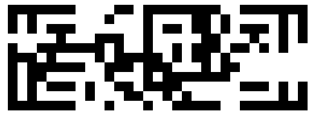
B：

注意到R和B均是31 * 10，G是31 * 11，所以肯定是将这三个图拼成一个方形。根据2018年网鼎杯的题目内容，该方形应该为汉信码。经实验，将三张图以GBR顺序，每行像素轮流提出后并拼接在一起，可以得到一个类似汉信码的图。将该图上下颠倒，并将左下角方块旋转180度后，得到如下汉信码：

可以看到，汉信码右方有一处7 * 9的空白区域，根据提示需要爆破恢复。但是破解2^63是不可能的，因此必须依据汉信码本身的纠错机制，将其中一部分填充完成后，破解另一部分。
网上找到汉信码的相关定义。汉信码有4个角落和围绕4个角落的功能码，其中功能码有17 * 4=68位，分成2个34位一样的，分别是：类型（8）+纠错（2）+掩码（2）+16位的RS码+6位自定义。
我们找一个汉信码生成网站：
http://www.efittech.com/hanxin/cp_hanxin_test.aspx
尝试生成一个跟原图差不多的码，需要选择类型5（长度31）。在新生成的码上，我们尝试逐行删除右边的7*1格子，看看内容是否可以读取。当删除完第8行后，内容仍可读取，但删除完第9行后则不行。因此，如果我们能够恢复第9行内容，那么大概率该破损汉信码也将可以读取，此类情况一共有2^7=128种，在可处理范围内。最后恢复的汉信码如下：

flag{eed70c7d-e530-49ba-ad45-80fdb7872e0a}

## Teslaaaaa

（WriteUp by 看雪大佬 HHHso）
本题考查的是UDS诊断协议(ISO 15765-2，ISO 14229-1)。题目难点在于CAN bus汽车通讯协议的处理。
CAN bus协议在传输时，采用的是帧传输模式，以本题为例，其结构如下：
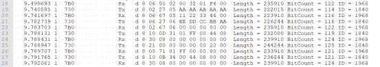
但实际上，这是简写后的通讯帧。CAN的标准帧固定为11个字节，我们记为B1 B2 … B11，每一个字节从高到低依次为bit7, bit6, …, bit0。根据协议，标准帧内容如下：

其中，
B1.bit7 = 0 指示通讯帧为CAN标准帧
B1.bit6 = 0 指示通讯帧为数据帧，此时N_PCI部分才有效
B1.bit3-0 指示N_PCI和N_Data的长度
B2.bit7-0和B3.bit7-6构成报文ID

示例：取一帧

```
9.499693 1  7B0             Rx   d 8 06 50 02 00 32 01 F4 00  Length = 235910 BitCount = 122 ID = 1968 
```

其中1968 = 0x7B0为报文ID，因此B2 = 0x7B0 >> 3 = 0xF6，B3 = (0x7B0 & 7) << 5 = 0x00
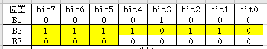
所以相应的CAN标准帧为【08 F6 00 06 50 02 00 32 01 F4 00】
根据B1帧的定义，该帧为标准帧，N_PCI和N_Data的总长度为8。

接下来看N_PCI和N_Data的内容。在CAN协议的网络层，结点之间通讯的基本网络协议数据单元结构为N_PDU(Protoco Data Unit)。其由三部分组成：（截图来自ISO-15765-2-2004）
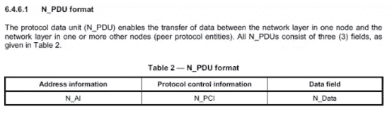
其中N_PCI的结构如下：
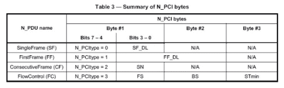
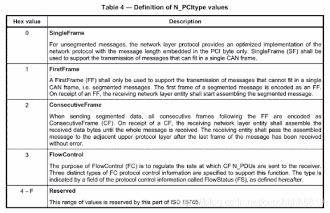
根据表中内容，N_PCI的高四位N_PCIType指示了N_PCI的类型：
0x0* 表示单帧
0x1* 表示多帧中的第一帧
0x2* 表示多帧中的后续帧
0x3* 为流控制
0x4*~0xF* 保留（未使用，无意义）

示例：通讯
考察以下一段对话：
7DF Tx d 8 02 10 02 AA AA AA AA AA
7B0 Rx d 8 06 50 02 00 32 01 F4 00
第一行表示向汽车ECU单元发送数据，发送的N_PCI为0x02表示单帧，有效内容2字节，即后边的[10 02]；汽车反馈的N_PCI为0x06同样为单帧，有效内容6字节，即后边的[50 02 00 32 01 F4]。后边的内容AA和00因为没有使用到，全部被舍弃。

回到本题，我们根据协议，来看一看通讯内容中究竟有些什么。为方便记录，设发送者（涉及Tx的）为A，接收者（涉及Rx的）为B。

(1)【4.000621 1 7DF Tx d 8 02 3E 80 00 00 00 00 00】（解题无用）
根据刚才介绍的分析帧方法，可知A向B发送了[3E 80]，其中3E表示TesterPresent (0x3E) service，即实现链路保持。实际上该条信息对做题无帮助，是出题者为了防止连接中断所采用的保险措施。在本题中，A经常性的会向B发送链路保持指令。如果服务端有需要链路保持，其Tester端会收到服务端的链路保持正响应，如[02 7E 80]
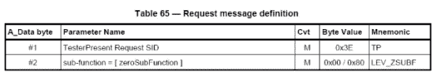

(2)【9.498709 1 7DF Tx d 8 02 10 02 AA AA AA AA AA】
【9.499693 1 7B0 Rx d 8 06 50 02 00 32 01 F4 00】（解题无用）
A向B发送了[10 02]，B向A反馈了[50 02 00 32 01 F4]。[10 02]表示A通知B开启编程会话，[50 02]表示正响应。如会话出错或拒绝，响应会变成7F SID+错误代码等内容。

(3)【9.740585 1 730 Tx d 8 02 27 05 AA AA AA AA AA】
【9.741697 1 7B0 Rx d 8 06 67 05 11 22 33 44 00】
【9.782739 1 730 Tx d 8 06 27 06 EE DD CC BB AA】
【9.783703 1 7B0 Rx d 8 02 67 06 00 00 00 00 00】（解题无用）
因为要开启编程会话，安全等级较高，所以需要进行安全验证。验证步骤为：A发送[27 05]请求安全验证，B反馈正响应为0x11223344；A根据0x11223344，使用双方协定的安全算法函数algo_op（看来就是减法）计算出key，然后发送[27 06 key]给B；B用key进行验证，验证通过后，返回正响应[67 06]。若验证未通过，则B会拒绝后续会话。

(4)【9.788131 1 730 Tx d 8 10 0D 31 01 FF 00 44 08】
【9.788947 1 730 Tx d 8 21 00 00 00 00 00 20 00】（解题无用）
第一行发出数据长度为13(0D)，第二行21表示后续帧，所以此处发送数据实际为[31 01 FF 00 44 08 00 00 00 00 00 20 00]，表示擦除eraseMemory过程。根据相应指令格式，31表示执行一系列指令；01暂时意义不明，但影响不大；FF 00表示擦除；44表示后边标记的地址和大小均为4字节，即从0x08000000处擦除0x00002000大小的内容。

(5)【9.791765 1 730 Tx d 8 10 0B 34 00 44 08 00 00】
【9.792625 1 730 Tx d 8 21 00 00 00 20 00 AA AA】（解题无用）
同上，发送数据为[34 00 44 08 00 00 00 00 00 20 00]。34表示下载数据要求；00表示采用0x00编号的加密方式（即不加密）；44同样代表地址和大小均为4字节，下载0x00002000大小的数据，写到0x08000000开始的位置。

【9.795696 1 730 Tx d 8 10 82 36 01 28 04 00 20】
0x82表示本段后面长度为130字节，其中两个字节[36 01]代表写入第一段数据，后边跟着的130-2=128字节为相应数据。观察题目内容可知，从[36 01]到[36 40]一共写入了0x80 * 0x40 = 0x2000大小的数据。完整的[36 01]数据段示例如下：
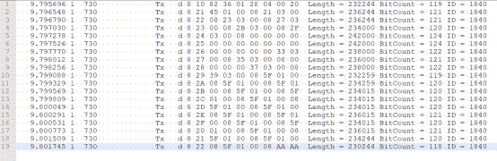
所以可以将原来数据的第31行至第1567行数据部分提出，并将其中不符合格式的第624行删除，然后使用脚本进行处理：

```
#!/usr/bin/env python
# -*- coding: utf-8 -*-

lines = open('data','r').readlines()
final_data = ''
tmpdata = []
# Step 1: Remove Rx
for line in lines:
    if line.find('Rx')>=0:
        continue
    tmpdata.append(line.split('Tx')[1].split('Length')[0][7:-2].replace(' ',''))

for i in range(len(tmpdata)):
    if i % 19 == 0:
        final_data += tmpdata[i][8:]
    elif i % 19 == 18:
        final_data += tmpdata[i][2:-4]
    else:
        final_data += tmpdata[i][2:]
final_data = final_data.decode('hex')
open('bin','wb').write(final_data) 
```

提出相应二进制文件后，其实就可以用来解题了。但是为了完整起见，我们继续将最后一部分协议内容分析完。
【10.314499 1 730 Tx d 8 02 37 01 AA AA AA AA AA】
0x37表示传输结束。
【10.318529 1 730 Tx d 8 04 31 01 DF FF AA AA AA】
执行0xDFFF标志的过程，此处为厂家定义。
【10.322633 1 730 Tx d 8 04 31 01 FF 01 AA AA AA】
执行0xFF01标志的过程，此处为checkProgrammingDependencies，检查编程相关项。
【10.325697 1 7DF Tx d 8 02 11 01 AA AA AA AA AA】
请求重启汽车ECU。

协议分析完毕，后面均与解题无关，继续解题。将刚才提出的二进制文件用IDA打开，注意选择ARM小端序，初始加载位置0x08000000。通过快捷键Alt+G设置T值为1选择Thumb后，再对0x08000000处快捷键C反编译，如下所示：
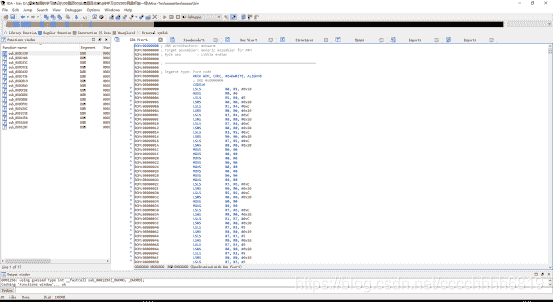
可以看到左边出现函数，观察代码逻辑，发现sub_8000168为主要flag相关函数：
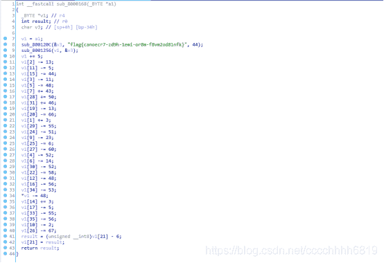
上边那个为假的flag，需要照下边操作一番才能得到真正的flag

```
c = 'canoecr7-zd9h-1emi-or8m-f8vm2od81nfk'
operate = [-48, 3, -13, -11, -52, -48, -14, 43, 0, -23, -2, -5, -48, 0, 3, -44, -56, -5, 0, -13, -66, -6, -58, 0, -51, -6, -67, -60, 50, -55, -52, 46, 0, -55, -53, -56]
print 'flag{' + ''.join(chr(ord(c[i])+operate[i]) for i in range(len(c))) + '}' 
```

flag{3dad13db-cb48-495d-b023-3231d80f1713}

## 未完成的书

（WriteUp by 某大佬）
解压后得到一个README和一堆svg文件。README先不管，svg文件是文言文编程代码，所以写程序读出：

```
#!/usr/bin/env python
# -*- coding: utf-8 -*-
import re

result = ''
for i in range(30):
    filename = str(i)
    filename = '0'*(3-len(filename))+filename
    filename = './file/part.'+filename+'.svg'
    res = open(filename,'r',encoding='UTF-8').read()
    c = re.findall('wy-data="(.+?)"', res, flags=0)
    for j in c:
        result += j
print(result) 
```

得到这样一个文件：
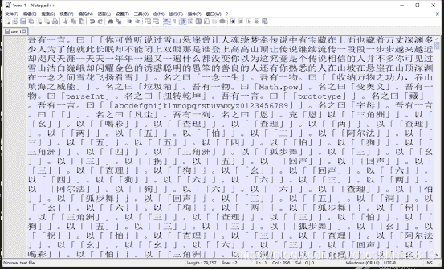
然后使用文言文转js代码的api：https://ide.wy-lang.org/对其进行转换，得到可以阅读的代码：
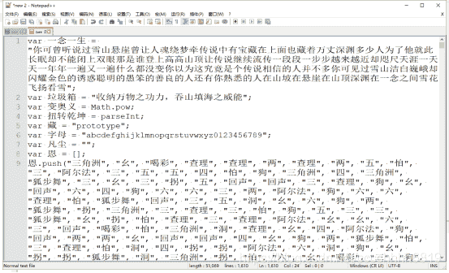
该代码无法直接运行，因为function和new后边都缺少一个空格，批量替换可解决此问题。将最终得到的可执行代码保存为js。

接下来分析这个js的功能：
在文档最下边找到主函数 天地初始。我们可以使用一个html文件调用这个js，然后修改js代码用console.log记录翻译后的值。调用html：

```
<!DOCTYPE html>
<html>
<head>
   <meta charset="UTF-8">
   <title>01</title>
</head>
<body>
<script type="text/javascript" src="what.js">
</script>
</body> 
```

得到运行时部分信息：
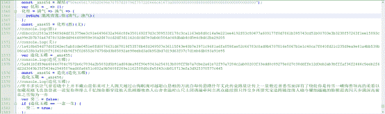
那么我们要关注的逻辑就简单了：
(i)我们需要最后让 造化玉碟 = 一念一生，其中 一念一生 已知；造化玉碟 是利用函数 造化() 将一个整数翻译过来得到的；
(ii)这个整数是通过函数 化形(恩)(义) 计算得到，其中 恩、义 均已知；
(iii)化形(恩)(义) 调用的是 混沌青莲.悟(清气、浊气)，其中 混沌青莲 由 混沌青莲.酝(母气) 初始化，其中 母气 已知；
(iv)混沌青莲 由 无中生有(混沌) 生成，但其过程中没有进行赋值，所以不影响后续内容。
于是我们关注的点变成两个：一是函数函数 化形(恩)(义) 究竟如何操作；二是函数 造化() 如何将一个数翻译成一堆汉字。
先看函数 化形(恩)(义)，调用的是混沌青莲.悟，即 虚空悟。
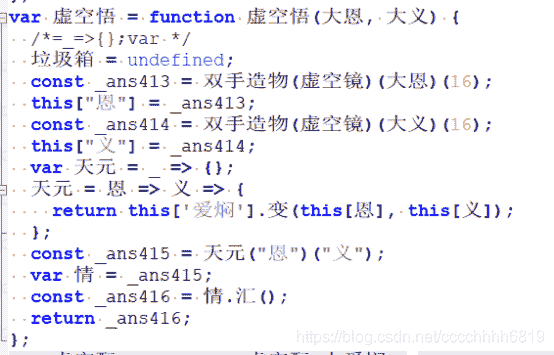
其中 双手造物 为调用2个变量的函数，虚空镜 如下：
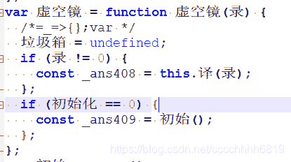
译 即 虚空译：
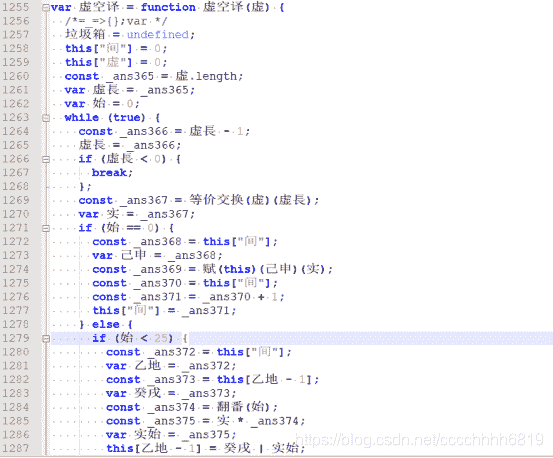
这里类似C++中的36进制转换，但是相对更加麻烦。举例如下：
原文：flag转换为hex后的66 6c 61 67
将666c6167从36进制字母表abcdefghijklmnopqrstuvwxyz0123456789中的位置取出得：32 32 32 02 32 27 32 33
再将其转换为16进制：20 20 20 02 20 1b 20 21
然后进位异或，如下图所示：
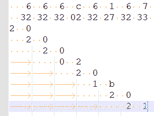所以得到的输出是222021b21。
继续往下读，将 恩、义 转换的整数置入 虚空变，结果再进行 虚空汇。此时 this[“爱焖”] 已由 混沌青莲.酝 更新为了
int(“506c6561736520696e70757420796f757220666c61673a00000000000000000000000000000000000000”, 16)
调用 this[‘爱焖’].变(this[恩], this[义]) ：

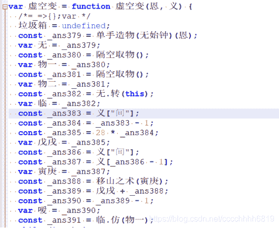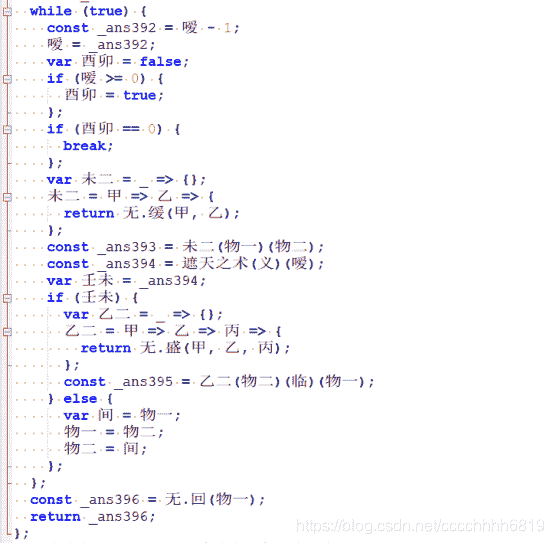
这里是计算 爱焖 的 恩 次方 模 义，存为 情，然后调用 情.汇() ：
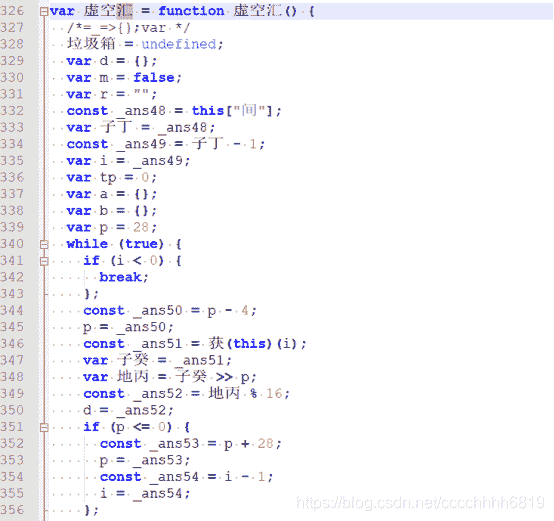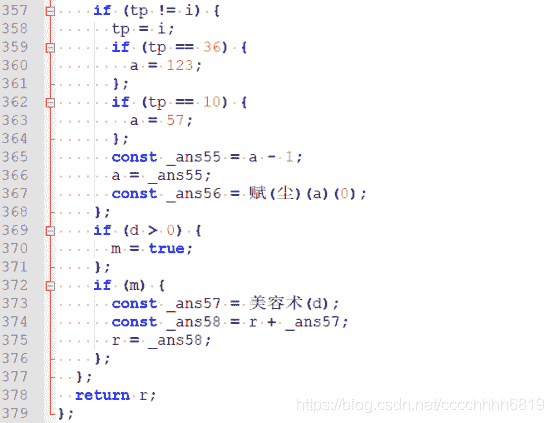
在if (m) 内部加入输出，可以看到r被一位一位拼成，因此 虚空汇 函数实际上是一个hex()函数
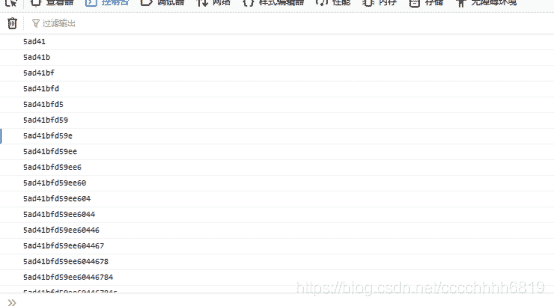
综合以上结论，化形(恩)(义)即为基础RSA：计算c = m^e (mod n)
然后看关键函数 造化() 。
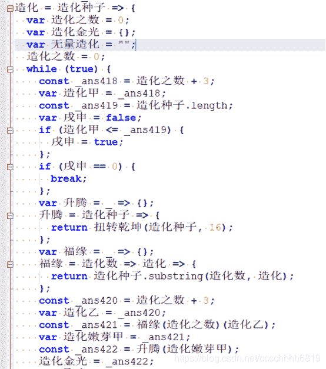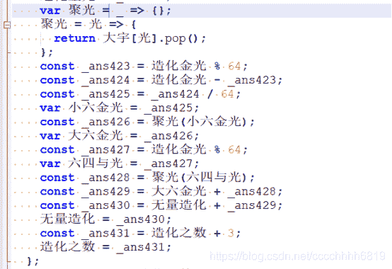
函数 造化 的前半部分，是从参数 造化种子 中，每3个字符分为一段，将其取出后转换为整数，再以模64并替换的方式变成四位汉字。与一般base64不同的是，替换的汉字并不固定，来自 大宇[光] 中的内容在使用后会pop出去。
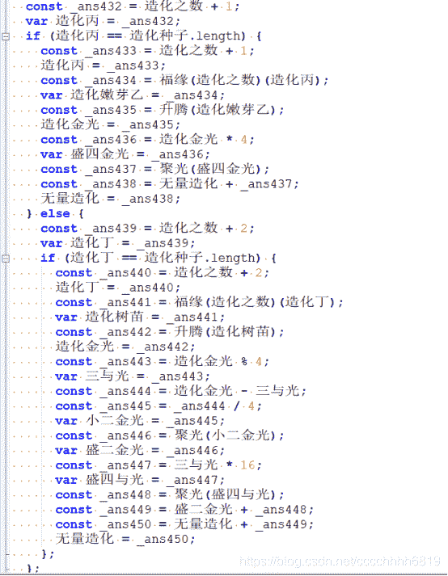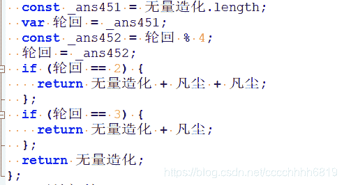
函数 造化 的后半部分，则用于处理编码到最后长度不足3位的情况。以上为全部代码逻辑。

根据题目要求，我们需要找到flag，其经过RSA计算后的c值再经过造化 函数转换后得到 一念一生。RSA部分比较简单，因为e很大，所以可以利用Wiener算法直接求出d，结果为

```
d = 0xa50b2b58ebae31b821f9e28f7185ffdc8a351b51166fa7e281963c29146248c5 
```

转换函数这部分就比较麻烦了，因为汉字有各种重复，所以需要用到最开始README中的各种限制条件。代码如下：

```
n = 0xd1bcc2c2583a355489d4df31375ee3c91e6496632a966c8fe3501692f7d3c389533f178c3ca1163eb8d0c14a9e221ee4192f83c80477a609177f0d7861b395743cd51b00703e3b3238f57263f1ee15893caa99e2b7b70a47d78c32dedd966489888e38a2d47ccd2df3d1142cdcdd7e3abdc504ac48dbab4cd5e6cbdc2ba29205
e = 0x1a418b654d77d0f242ec5abfcde0451e8fd0076631d67819f53578b4fd349507e36115f43e40b7e3971c9681a6fa859fae52c66783c8ad9b6707816e5067b1e1c40ca7f840fd21c235d9ea9e81a4bb539b06ca528b3a5028f9186186b96f9f026552e74756bd3b85892ae98eebd3a0b952bd7d19d63f07c7d1eb6db093a91e95
d = 0xa50b2b58ebae31b821f9e28f7185ffdc8a351b51166fa7e281963c29146248c5

sha256flag = '41589e08cc938fa719d7c21c83befcbf75b8490764af210a769b07ee32339741'
sha265base64 = '2348cd09e1624d34542806545906f2054a18036ce8a1cbe0ed5b0e4869bee5c2'
base64format = '*******y****2****fy****oR**********N***********L******4**3**JT***g4**6*********T*zKr8**C**R******4*******OK**PW***J****D*********Q****B**8**Sj**z**DwxS*T**jd***yl**********'

cipher = "你可曾听说过雪山悬崖曾让人魂绕梦牵传说中有宝藏在上面也藏着万丈深渊多少人为了他就此长眠却不能闭上双眼那是谁登上高高山顶让传说继续流传一段段一步步越来越近却咫尺天涯一天天一年年一遍又一遍什么都没变你以为这究竟是个传说相信的人并不多你可见过雪山洁白巍峨却闪耀金色的诱惑聪明的愚笨的善良的人还有你熟悉的人在山坡在悬崖在山顶深渊在一念之间雪花飞扬看雪"
dic = 'ABCDEFGHIJKLMNOPQRSTUVWXYZabcdefghijklmnopqrstuvwxyz0123456789+/'
t = {}
t[0] = ["悔", "土", "春", "挥", "穿", "自", "终", "以", "是", "过"]
t[1] = ["缘", "我", "回", "留", "烽", "的", "这", "双", "梦", "说"]
t[2] = ["潇", "重", "怨", "细", "豪", "光", "是", "一", "高", "绕"]
t[3] = ["穿", "然", "言", "挥", "当", "破", "虔", "的", "山", "什"]
t[4] = ["由", "和", "留", "愿", "秋", "穿", "落", "都", "年", "中"]
t[5] = ["乡", "庆", "始", "离", "志", "断", "亦", "雪", "崖", "段"]
t[6] = ["虔", "始", "挥", "未", "诚", "等", "尘", "寻", "只", "聪"]
t[7] = ["未", "重", "忆", "余", "造", "腔", "百", "始", "留", "牵"]
t[8] = ["烽", "生", "灭", "骨", "志", "轮", "舍", "再", "晓", "究"]
t[9] = ["寻", "细", "月", "当", "庆", "柔", "前", "诱", "你", "传"]
t[10] = ["潇", "时", "无", "扬", "念", "渊", "顶", "说", "天", "渊"]
t[11] = ["烽", "细", "热", "光", "舍", "雁", "色", "登", "上", "你"]
t[12] = ["灭", "诚", "潇", "潇", "月", "数", "随", "耀", "顶", "藏"]
t[13] = ["然", "思", "南", "汇", "数", "百", "余", "舍", "忆", "人"]
t[14] = ["星", "落", "我", "破", "儿", "里", "等", "笨", "传", "流"]
t[15] = ["皆", "烽", "盼", "今", "躇", "醉", "深", "峨", "雪", "的"]
t[16] = ["星", "潇", "我", "瓣", "骨", "舍", "的", "却", "少", "多"]
t[17] = ["无", "春", "余", "留", "终", "轮", "秋", "挥", "一", "上"]
t[18] = ["停", "河", "平", "跨", "穿", "星", "醉", "终", "山", "的"]
t[19] = ["从", "南", "尘", "去", "月", "在", "天", "尺", "说", "了"]
t[20] = ["洒", "始", "愿", "盼", "寻", "土", "瓣", "惑", "见", "年"]
t[21] = ["志", "如", "气", "未", "烽", "踌", "气", "时", "躇", "气"]
t[22] = ["心", "缘", "当", "星", "顾", "今", "躇", "人", "遍", "听"]
t[23] = ["细", "始", "秋", "言", "乡", "文", "骨", "顾", "金", "崖"]
t[24] = ["余", "愿", "豪", "落", "乡", "如", "离", "留", "数", "晓"]
t[25] = ["留", "我", "和", "造", "百", "如", "造", "咫", "高", "能"]
t[26] = ["交", "晓", "复", "雁", "缘", "舍", "踏", "气", "南", "可"]
t[27] = ["满", "路", "愧", "如", "诚", "离", "舍", "穿", "眠", "长"]
t[28] = ["秋", "然", "终", "破", "舍", "回", "之", "闪", "深", "曾"]
t[29] = ["瓣", "光", "踏", "穿", "肩", "河", "踏", "悔", "柔", "山"]
t[30] = ["纵", "顾", "众", "千", "忆", "雁", "踌", "复", "看", "近"]
t[31] = ["时", "路", "穿", "转", "顾", "细", "众", "温", "飞", "传"]
t[32] = ["雁", "时", "路", "醉", "众", "有", "还", "涯", "传", "此"]
t[33] = ["时", "留", "南", "晓", "千", "怨", "愧", "随", "怨", "不"]
t[34] = ["月", "如", "今", "汇", "未", "挥", "缘", "土", "坡", "悬"]
t[35] = ["今", "南", "漫", "瓣", "肩", "寻", "随", "在", "熟", "人"]
t[36] = ["等", "缘", "河", "踏", "踏", "潇", "明", "白", "万", "魂"]
t[37] = ["顾", "百", "缘", "温", "漫", "一", "越", "续", "闭", "雪"]
t[38] = ["未", "未", "已", "地", "地", "从", "造", "乡", "相", "来"]
t[39] = ["余", "已", "土", "自", "未", "造", "跨", "如", "并", "曾"]
t[40] = ["与", "去", "我", "由", "踌", "复", "过", "也", "在", "有"]
t[41] = ["躇", "漫", "愧", "南", "温", "气", "春", "洁", "多", "段"]
t[42] = ["文", "光", "转", "余", "千", "交", "复", "轮", "星", "悬"]
t[43] = ["诚", "去", "众", "肩", "满", "百", "灭", "造", "路", "天"]
t[44] = ["红", "汇", "轮", "潇", "心", "等", "雪", "愚", "却", "个"]
t[45] = ["潇", "已", "地", "留", "亦", "心", "言", "悔", "星", "不"]
t[46] = ["无", "骨", "河", "春", "儿", "无", "春", "土", "为", "着"]
t[47] = ["儿", "数", "潇", "腔", "皆", "庆", "细", "千", "和", "悉"]
t[48] = ["踏", "尘", "如", "豪", "断", "平", "汇", "人", "谁", "藏"]
t[49] = ["余", "灭", "细", "虔", "和", "言", "在", "变", "眼", "可"]
t[50] = ["言", "皆", "穿", "从", "我", "时", "在", "步", "说", "山"]
t[51] = ["纵", "离", "忆", "离", "当", "河", "破", "盼", "你", "一"]
t[52] = ["光", "春", "腔", "今", "热", "瓣", "顾", "善", "却", "越"]
t[53] = ["温", "细", "言", "怨", "志", "豪", "再", "路", "悔", "遍"]
t[54] = ["心", "随", "躇", "跨", "留", "踏", "前", "前", "那", "人"]
t[55] = ["去", "从", "断", "月", "言", "我", "愧", "与", "晓", "山"]
t[56] = ["时", "数", "柔", "骨", "再", "血", "花", "你", "一", "上"]
t[57] = ["挥", "春", "众", "气", "我", "光", "无", "信", "继", "就"]
t[58] = ["秋", "造", "断", "南", "满", "众", "间", "一", "面", "让"]
t[59] = ["当", "骨", "我", "留", "和", "造", "没", "步", "他", "丈"]
t[60] = ["热", "始", "去", "余", "怨", "的", "又", "一", "为", "宝"]
t[61] = ["纵", "腔", "从", "热", "潇", "骨", "血", "雁", "重", "巍"]
t[62] = ["灭", "细", "尘", "南", "汇", "满", "舍", "众", "愧", "么"]
t[63] = ["轮", "顾", "躇", "南", "余", "细", "烽", "良", "竟", "让"]
t[64] = ["如", "腔", "转", "月", "顾", "复", "前", "今", "瓣", "花"]
t[65] = ["红", "时", "未", "破", "洒", "怨", "虔", "细", "众", "潇"]

# 当前已知文字，当前层数，当前剩余矩阵
def solve(parttext, level, letters):
    if(level == len(cipher)): # 已全部替换成功
        tmpbase64 = parttext+'='
        if(mysha(tmpbase64.encode())==sha265base64):
            # print(tmpbase64)
            # LxnWBAlyiXc62kCBHfyEo8woR6oMuk7cKQQN8T75gbbQtZlLBx2AwL4CZ3M/JT5lOg4Fp6y70mle0ZTTgzKr8EUCW8R1D+E7x4AuBI/CsOKm5PWnhpJaUoPDpk9PscMXLQJUGkBsO80/SjggzjvDwxSiTqFjdKPKylKc6F4fKes=
            tmpc = bytes_to_long(base64.b64decode(tmpbase64))
            tmpm = pow(tmpc, d, n)
            print(hex(tmpm)[2:])
            # 222021b2311dfdddbdfdf1df31dc3dddfdbddc3dfdf1df3c3f21df321c3ddf31f1df221f3dfdfdddb2213
        return
    suitable = []
    if(base64format[level]!='*'): # 触发base64残片限制
        m = dic.index(base64format[level])
        if(letters[m][-1] == cipher[level]):
            suitable.append(m)
    else:
        for i in range(64): # 深度搜索，寻找可能的下一个
            if(letters[i][-1] == cipher[level]):
                suitable.append(i)
    for i in suitable:
        tmpletters = {}
        for a in range(64):
            tmpletters[a] = []
            for b in letters[a]:
                tmpletters[a].append(b)
        tmpletters[i].pop()
        solve(parttext+dic[i], level+1, tmpletters) 
```

如上所示，根据sha256验证base64结果，然后解得m

```
m = 0x222021b2311dfdddbdfdf1df31dc3dddfdbddc3dfdf1df3c3f21df321c3ddf31f1df221f3dfdfdddb2213 
```

接下来最糟糕的环节到了。根据刚才解析的函数 虚空译 的规则，每一位均可能进位或不进位，如果完全考虑，则可能性是2^84，是不可接受的。所以我们进行一定的限制，即：flag格式固定，除了头尾和中间的-外都是0-9a-z，转换为hex编码时也都在0-9a-z期间，写出爆破代码如下：

```
flagcheck = 'flag{********-****-****-****-************}'
flagcheckmode = '666c61677b****************2d********2d********2d********2d************************7d'
dic36 = 'abcdefghijklmnopqrstuvwxyz0123456789'
dic1 = [1, 3, 5, 7, 9, 11, 13, 15]
dic2 = [2, 3, 6, 7, 10, 11, 14, 15]
dic_avail = '0123456789abcdef'
check_avail = ['30', '31', '32', '33', '34', '35', '36', '37', '38', '39', '61', '62', '63', '64', '65', '66']
usage_avail = ['1da', '1db', '1dc', '1dd', '1de', '1df', '1f0', '1f1', '1f2', '1f3', '21b', '21c', '21d', '21e', '21f', '220']
swap1 = ['66', '6c', '61', '67', '7b', '7d', '2d']
swap2 = ['220', '202', '21b', '221', '211', '213', '1c3']
def contains(a, b):
    if(a[0]!=b[0])or(a[1]!=b[1]):
        return False
    tmpa = bin(int(a[2],16))[2:]
    tmpa = '0'*(4-len(tmpa)) + tmpa
    tmpb = bin(int(b[2],16))[2:]
    tmpb = '0'*(4-len(tmpb)) + tmpb
    for i in range(4):
        if(tmpa[i]=='0')and(tmpb[i]=='1'):
            return False
    return True

count = 0
def burphex(knowntext, level, unusedpart):
    global count
    if(level == len(flagcheckmode)): # 所有位置已知
        count += 1
        tmpflag = str(bytes.fromhex(knowntext))[2:-1]
        if (count % 10000 == 0):
            print(tmpflag)
        if (mysha(tmpflag.encode("UTF-8"))==sha256flag):
            print("****************")
            print(tmpflag)
            print("****************")
        return
    if(flagcheckmode[level:level+2] != '**'): # 确定位
        tmp = swap1.index(flagcheckmode[level:level+2])
        tmp = swap2[tmp]
        if not contains(unusedpart[:3], tmp):
            return
        c1 = int(tmp[2],16)
        c2 = int(unusedpart[2],16)
        if(c1 == c2):
            burphex(knowntext + flagcheckmode[level:level+2], level + 2, '0' + unusedpart[3:])
        if(c1 | 1 == c2):
            burphex(knowntext + flagcheckmode[level:level+2], level + 2, '1' + unusedpart[3:])
        if(c2 | 2 == c2):
            burphex(knowntext + flagcheckmode[level:level+2], level + 2, '2' + unusedpart[3:])
    else: # 不确定位置
        avail = []
        for i in range(16):
            if contains(unusedpart[:3], usage_avail[i]):
                avail.append(i)
        if(len(avail)==0):
            return
        for i in avail:
            c1 = int(usage_avail[i][2], 16)
            c2 = int(unusedpart[2],16)
            if(c1 == c2):
                burphex(knowntext + check_avail[i], level + 2, '0' + unusedpart[3:])
            if(c1 | 1 == c2):
                burphex(knowntext + check_avail[i], level + 2, '1' + unusedpart[3:])
            if(c1 | 2 == c2):
                burphex(knowntext + check_avail[i], level + 2, '2' + unusedpart[3:]) 
```

结果初步估计至少爆破8个小时以上，比赛期间时间根本不够，所以需要切换思路。根据flag格式，明文未知部分只有0<sub>9和a</sub>f，所以其对应的表示也是固定的：
0 -> 0x30 -> 1da 1 -> 0x31 -> 1db 2 -> 0x32 -> 1dc 3 -> 0x33 -> 1dd
4 -> 0x34 -> 1de 5 -> 0x35 -> 1df 6 -> 0x36 -> 1f0 7 -> 0x37 -> 1f1
8 -> 0x38 -> 1f2 9 -> 0x39 -> 1f3 a -> 0x61 -> 21b b -> 0x62 -> 21c
c -> 0x63 -> 21d d -> 0x64 -> 21e e -> 0x65 -> 21f f -> 0x66 -> 220
如果我们将明文每个字符影响的两位一起来看，则其对应的三位中，中间的那一位是固定的（由密文决定），而在所有合法的三位组合中，当中间一位固定时，前边第一位也是固定的。因此只需要考虑最后一位的可能性。在大多数情况下，最后一位只有两种取值可能，对应的字符也是二选一，如下图所示：
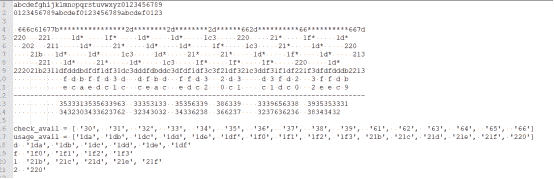

所以需要确定的字符串总计有2^28个。这些字符串在经过 虚空译 运算后，都可以得到刚才的m，所以此处必须依托哈希值进行暴力破解。破解代码如下：

```
resource = [['35', '34'], ['33', '32'], ['31', '30'], ['35', '34'], ['35', '33'], ['63', '62'], ['39', '37'],
            ['63', '62'], ['33', '32'], ['35', '34'], ['31', '30'], ['33', '32'], ['35', '34'], ['35', '33'],
            ['63', '62'], ['39', '38'], ['38', '36'], ['63', '62'], ['39', '37'], ['33', '32'], ['39', '37'],
            ['65', '63'], ['63', '62'], ['38', '36'], ['39', '38'], ['35', '34'], ['35', '34'], ['33', '32']]
for i in range(0,2**28):
    if (i%1000000==0):
        print (i)
    bini = bin(i)[2:]
    bini = '0'*(28-len(bini))+bini
    tmpflag = '666c61677b'
    for k in range(0, 8):
        tmpflag += resource[k][int(bini[k])]
    tmpflag += '2d'
    for k in range(8, 12):
        tmpflag += resource[k][int(bini[k])]
    tmpflag += '2d'
    for k in range(12, 16):
        tmpflag += resource[k][int(bini[k])]
    tmpflag += '2d'
    for k in range(16, 19):
        tmpflag += resource[k][int(bini[k])]
    tmpflag += '662d'
    for k in range(19, 24):
        tmpflag += resource[k][int(bini[k])]
    tmpflag += '66'
    for k in range(24, 28):
        tmpflag += resource[k][int(bini[k])]
    tmpflag += '31667d'
    tmpflag = str(bytes.fromhex(tmpflag))[2:-1]
    if(mysha(tmpflag.encode("UTF-8")) == sha256flag):
        print(tmpflag) 
```

当i在93000000~94000000中找到解，大概需要爆破45分钟。
flag{52143c7c-2513-45b9-8b7f-37eb8f94431f}