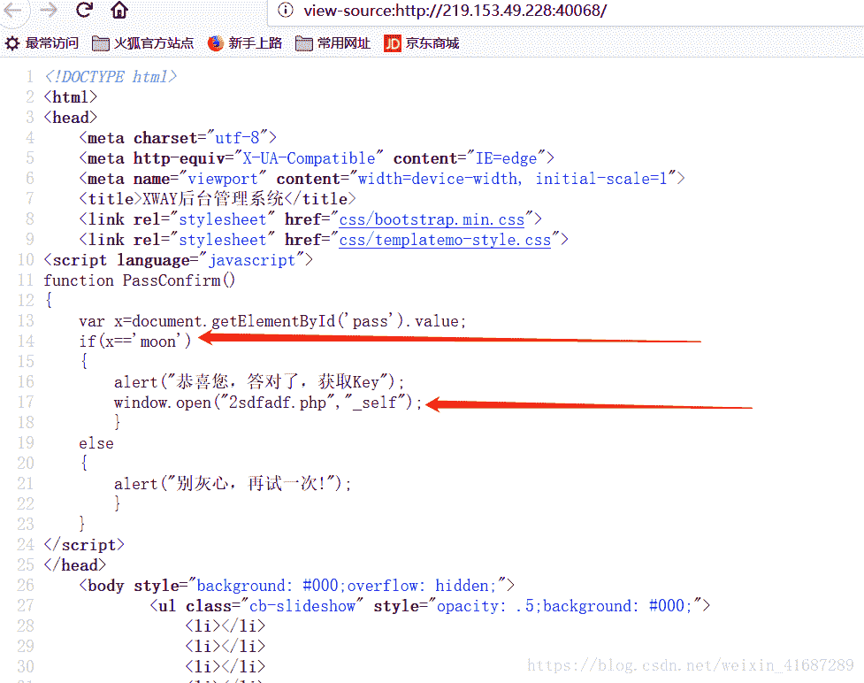

<!--yml
category: 未分类
date: 2022-04-26 14:33:54
-->

# 【CTF】加解密专题_BJFU_vth的博客-CSDN博客

> 来源：[https://blog.csdn.net/weixin_41687289/article/details/82706023](https://blog.csdn.net/weixin_41687289/article/details/82706023)

## 0x00:字母加密

弱智的要死。题目给了一串数字码 看到最大的是26 所以联想到是最初级的字母加密

```
13 15 26 08 05 25 05 19 
```

`python3`版解字母加密代码

```
l = ['','A','B','C','D','E','F','G','H','I','J','K','L','M','N','O','P','Q','R','S','T','U','V','W','X','Y','Z']
ls = input().split()
j = 0
for i in ls:
    ls[j] = int(i)
    print(l[ls[j]],end='')
    j += 1 
```

result:

```
MOZHEYES 
```

构造`mozheyes.php`即可拿到`key`。

## 0x01:JS分析

页面让登陆。
查看源码。

输入`moon`点提交即可。或者直接打开那个`php`页面即可。

## 0x02:base64编解码

直接上代码：

```
#python3解决base64编解码问题
#base64不能直接对字符串进行处理，只能处理bytelikeobj。
#所以在base64编解码之前，我们要把字符串变成bytelikeobj
import base64
def str2bytelike(str1): # 将字符串编码为byte-likeboj
    bytelike = str1.encode(encoding='utf8')
    return bytelike
def bytelike2base_64(bytelike): # 将bytelikeobj的str编码为bytelikeobj的base64
    # 并将bytelikeobj的base64解码为正常的base64字符串
    base_64 = base64.b64encode(bytelike)
    return base_64.decode()
def base_642str(bytelike):#将bytelikeobj的base64解码为bytelikeobj的str,
    #并将bytelikeobj的str解码为正常的str
    str1 = base64.b64decode(bytelike)
    return str1.decode()

#使用方法：将s1改为待编码的字符串即可进行编码。 将s2改为待解码的base64串即可。

####测试数据####
s1 = 'faker'
s2 = 'ZmFrZXI='
b1 = str2bytelike(s1)#编码为bytelikeobj  下同
b2 = str2bytelike(s2)
base = bytelike2base_64(b1)#编码为base64字符串
st = base_642str(b2)#解码为base64字符串
print(base,st) 
```

真正好用的在这儿：

```
import base64
def str2bytelike(str1):
    bytelike = str1.encode(encoding='utf8')
    return bytelike
def bytelike2base_64(bytelike):
    base_64 = base64.b64encode(bytelike)
    return base_64.decode()
def base_642str(bytelike):
    str1 = base64.b64decode(bytelike)
    return str1.decode()
tag = input('编码请输入1,解码请输入2。然后按回车键：')
if tag == '1':
    s = input('请输入字符串：')
    b = str2bytelike(s)
    base = bytelike2base_64(b)
    print(base)
else:
    s = input('请输入base64码：')
    b = str2bytelike(s)
    st = base_642str(b)
    print(st) 
```