<!--yml
category: 未分类
date: 2022-04-26 14:52:06
-->

# 【CTF大赛】陇剑杯-机密内存-解题过程分析_IT老涵的博客-CSDN博客_ctf内存分析

> 来源：[https://blog.csdn.net/hbohan/article/details/120513590](https://blog.csdn.net/hbohan/article/details/120513590)


## 前言

机密内存这道题是陇剑杯中的压轴题，题目中涉及到使用VMware加密功能进行加密的内存镜像，难度极大。我在这里详细的记录一下解题思路和过程，如有错误或疏漏的地方还请大佬们在评论区指出。

## 题目初探

拿到题目，为三个文件，其中mem_secret-963a4663.vmem为常见内存镜像文件，另外两个文件格式未知。

使用volatility进行分析无法识别profile。
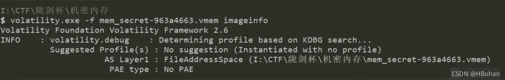
接着分析分析Encryption.bin01和Encryption.bin02文件，初步分析Encryption.bin01文件，无法发现任何端倪。

Encryption.bin02内可见字符较多，通过strings命令可以判断出Encryption.bin02是使用Vmware加密后的vmx虚拟机配置文件

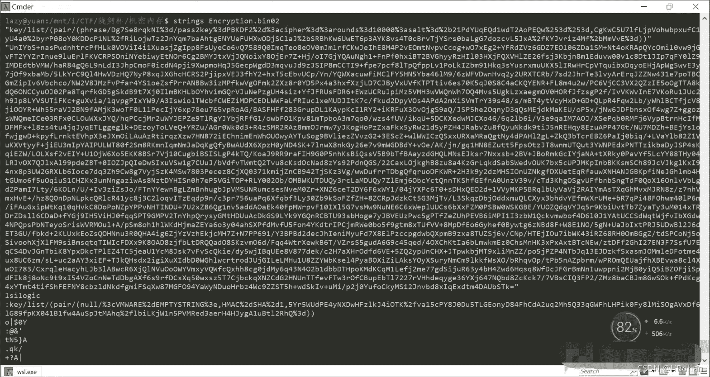
这里介绍一下虚拟机的配置文件vmx，改文件位于虚拟机实例的主目录下，用于记录虚拟机的配置——如虚拟机的内存、硬盘型号等，可以通过打开这个虚拟机文件以启动虚拟机的操作系统，我们也通过编辑该文件实现某种对虚拟机的配置需求。

对于同一虚拟机，在使用虚拟机加密操作前的vmx文件与加密后vmx文件是有所不同的：
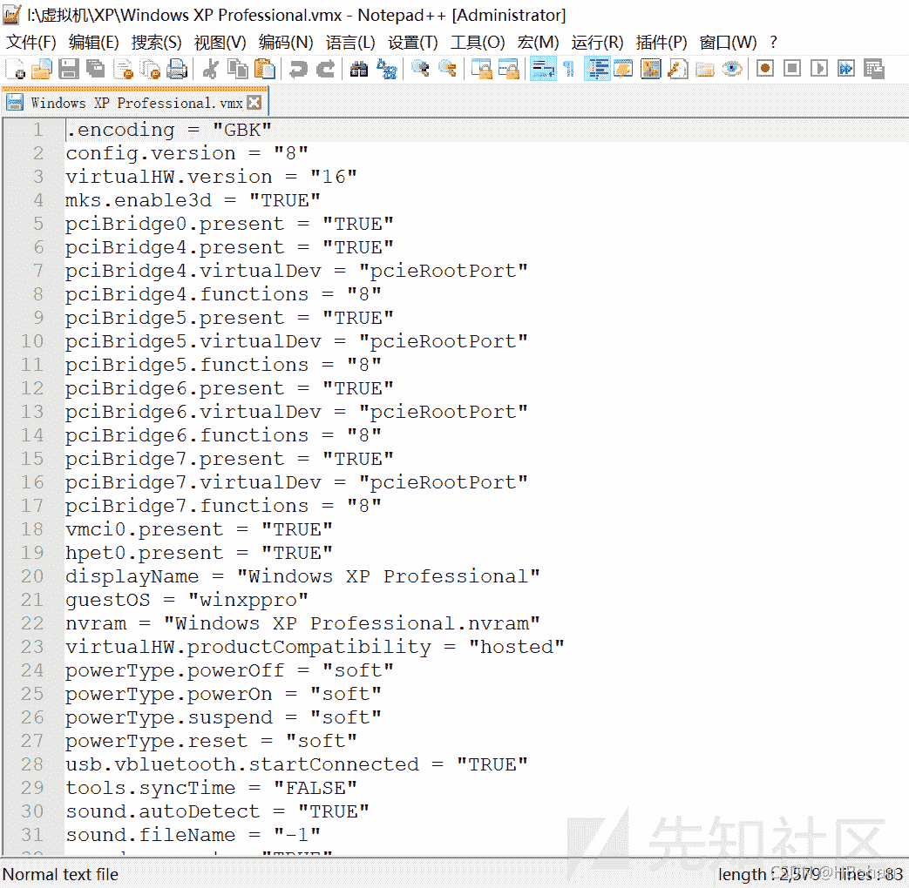
未加密的vmx文件是明文显示的，显示了这个虚拟机的显示名称，cpu配置，内存配置等等。下图是为未加密的vmx文件。
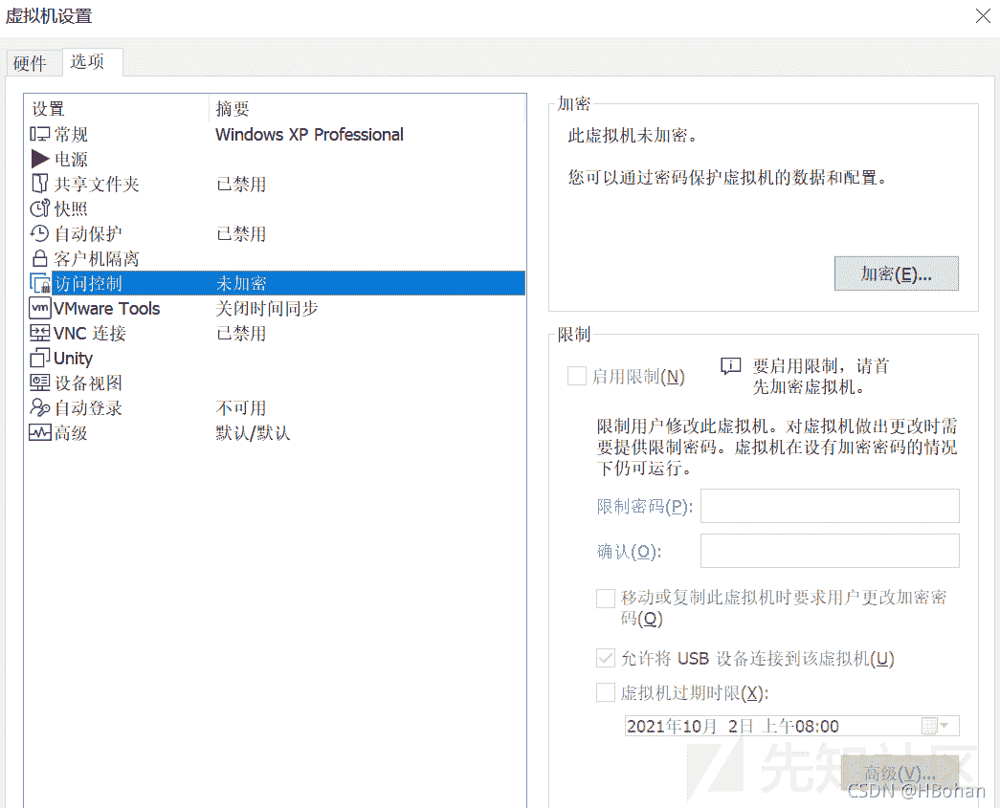
在虚拟机——设置——选项——访问控制处可以配置虚拟机加密，加密后的vmx内容如下图所示，可以看到：之前以明文形式呈现的配置内容全部加密显示，无法获取这个虚拟机的配置详细信息了，并且多了keySafe内容，就存在这里。如下图：
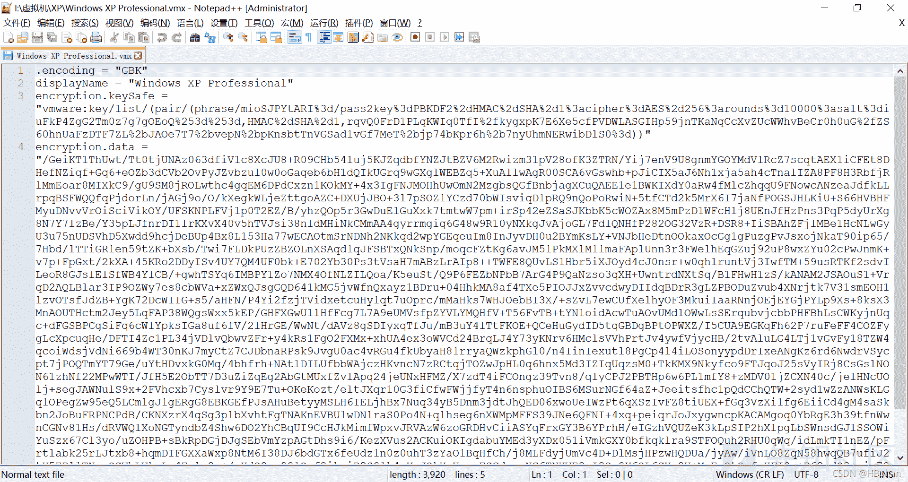
加密后的配置只需要.encoding、displayName、encryption.keySafe和encryption.data字段的内容，.encoding为虚拟机配置文件的编码，displayName为虚拟机的名称，encryption.keySafe字段存储了虚拟机密码，格式为vmware:key/list/xxxxxxxxx ，encryption.data是原来明文数据加密过后的结果。

但是对Encryption.bin02和加密的vmx进行对比，在Encryption.bin02的结尾还有一段冗余数据：

分析这段数据，对比加密的虚拟机，通过lsiogic关键词以及内容的偏移占用空间可以确定该内容为加密虚拟机的vmdk部分
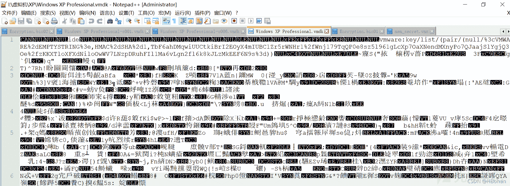
此处题目中是lsilogic，但对照虚拟机我用的是winxp，不支持lsilogic，所以是ide，而且vmx和vmdk两端数据直接有一段空行NUL数据

现已分析出Encryption.bin02为VMware虚拟机执行加密过后的配置文件，那么mem_secret-963a4663.vmem应该为运行状态虚拟机的内存页面文件，而结合常见虚拟机相关文件和文件大小可以大胆猜测Encryption.bin01为vmss文件
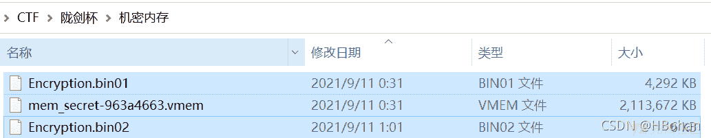
vmss文件用于储存虚拟机在挂起状态时的信息，为执行挂起操作后产生的文件（相当一个快照图片）

进一步对Encryption.bin01文件进行格式分析，可以发现该文件与vmware加密状态挂起的虚拟机vmss文件高度相似，遂判断该赛题给出的文件为vmware加密文件组
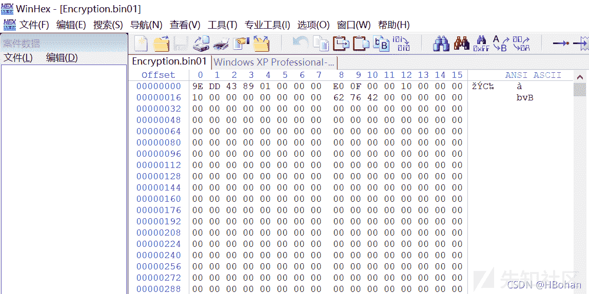
根据上述分析，题目中所给的文件全部为使用虚拟机加密过后的文件，因此后续的思路就是：找到虚拟机的密码，然后利用VMware加载虚拟机，将虚拟机加密功能关闭，就可以将所有文件还原成明文状态，此时就可以得到未加密状态的内存镜像，再使用volatility进行分析即可。

## 恢复文件

在思路梳理完成之后就需要对题目的文件进行分离和修复，经过反复操作和对照发现，题目中出题人分别删除了vmx和vmss中的部分通用关键信息，分别对vmx、vmdk和vmss文件进行还原操作：

**分离和修复vmx文件**
修复前：
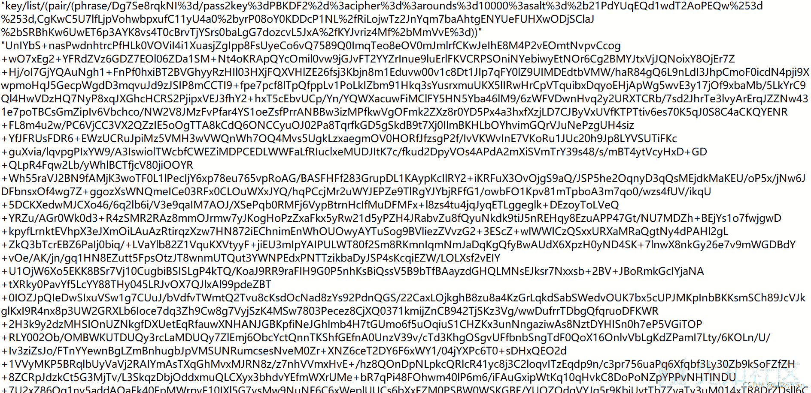
修复后：
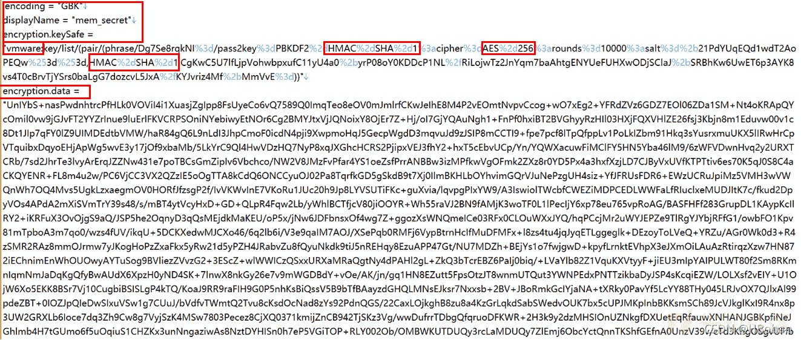
**还原vmss文件**
将Encryption.bin01文件重命名为mem_secret-963a4663.vmss，注意vmss文件的文件名一定要和vmem文件名对应，否则无法读取挂起的状态。

全部还原后的文件目录结构如下：
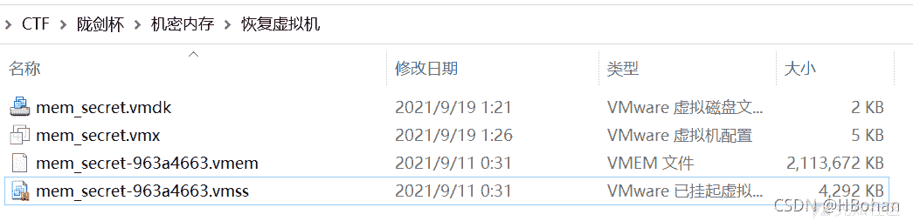

## 打开虚拟机

要打开虚拟机，需要获取打开的密码，此题无任何提示信息，猜测密码需要通过暴力破解的方式拿到，使用加密的vmx文件，利用pyvmx-cracker工具爆破虚拟机的密码。
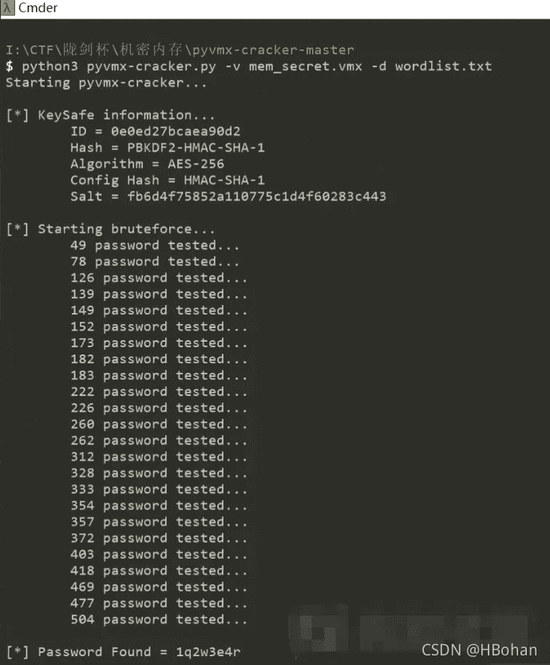
得到密码为1q2w3e4r
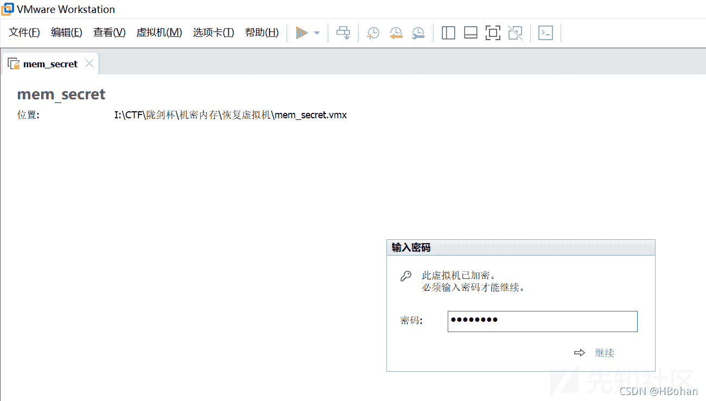
成功打开挂起状态的虚拟机
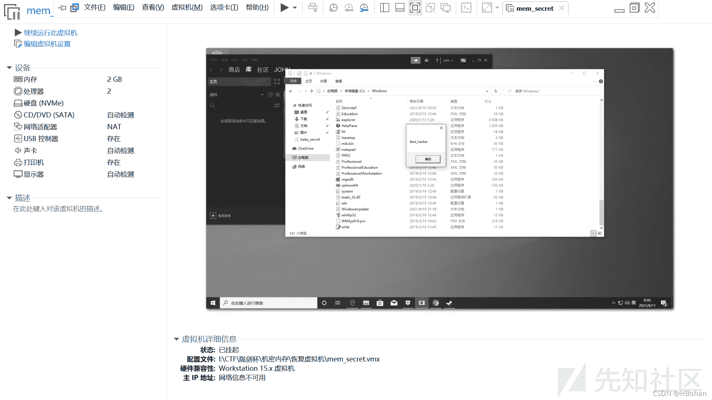
开机后发现无法打开，根据报错提示判断缺少vmdk虚拟磁盘文件，但是虚拟磁盘文件中包含一定的加密信息，此时我们已经获得了加密虚拟机的密码，因此可以自己创建一个新的虚拟机。
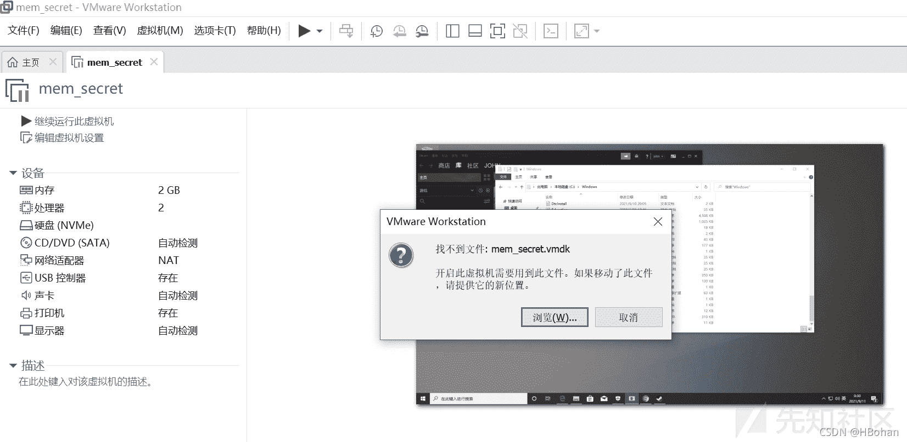
但是直接将这个vmdk加载到虚拟机是不行的，因为待加载的虚拟机使用了VMware加密，vmdk也会一起加密，在打开的时候会先对vmdk进行解密操作，分析未加密虚拟机的vmdk和已加密虚拟机vmdk作比较，发现使用Encryption.bin02的结尾还有一段冗余数据直接替换自己生成的vmdk加密磁盘头部即可，后经过操作发现这段数据是VMware打开虚拟机时，对vmdk进行解密的密钥串，关系到加密虚拟机的vmdk能否正常解密，这时候就是磁盘数据。

那么只要执行如下操作即可：创建一个新的虚拟机，创建的时候参数配置通过在Encryption.bin02的数据里捕风捉影（可以看出，出题人使用的都是默认配置），使用1q2w3e4r这个密码对虚拟机进行加密，然后将加密过后的虚拟机的vmdk文件拿出来给原来题目中提取的虚拟机使用，但是使用前需要替换掉头部的加密串信息。
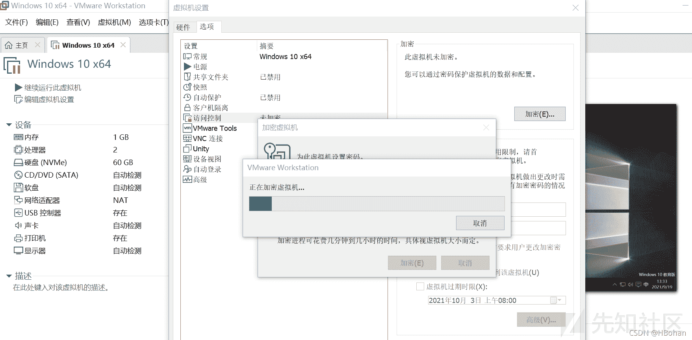
**分离和修复vmdk文件**
修复前：
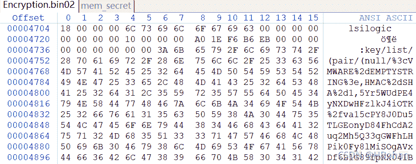
修复后：
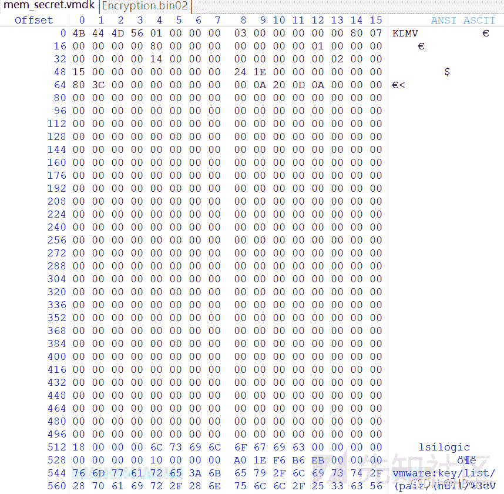
此时虚拟机修复完成，已经可以成功将虚拟机移除解密，注意：虚拟机不能点开机，否则内存镜像文件vmem将被删除
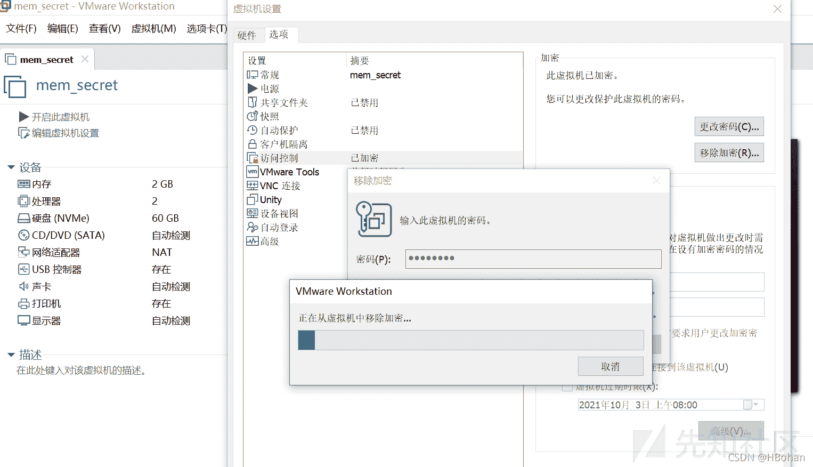
解密移除完成后，当前目录下的vmem文件即为未使用VMware加密的虚拟机内存镜像文件，此时理论上讲，已经可以使用volatility正常分析，尝试使用volatility2分析发现仍然搜索不到profile，推测题目为Windows10的内存镜像文件，遂使用Volatility3进行分析。

Volatility3是对Volatility2的重写，它基于Python3编写，对Windows 10的内存取证很友好，且速度比Volatility2快很多。对于用户而言，新功能的重点包括：大幅提升性能，消除了对–profile的依赖，以便框架确定需要哪个符号表（配置文件）来匹配内存示例中的操作系统版本，在64位系统（例如Window的wow64）上正确评估32位代码，自动评估内存中的代码，以避免对分析人员进行尽可能多的手动逆向工程等。

```
python3 vol.py -f mem_secret-963a4663.vmem windows.info 
```

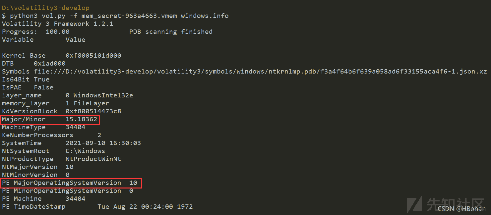

使用Volatility3可以看到操作系统版本是Windows10，且根据Major/Minor 15.18362可以确定具体的操作系统profile配置文件。在Volatility2 中使用–info看到具体对应的profile为Win10x86_18362，此后即可回归到volatility2，手动指定profile即可解题。
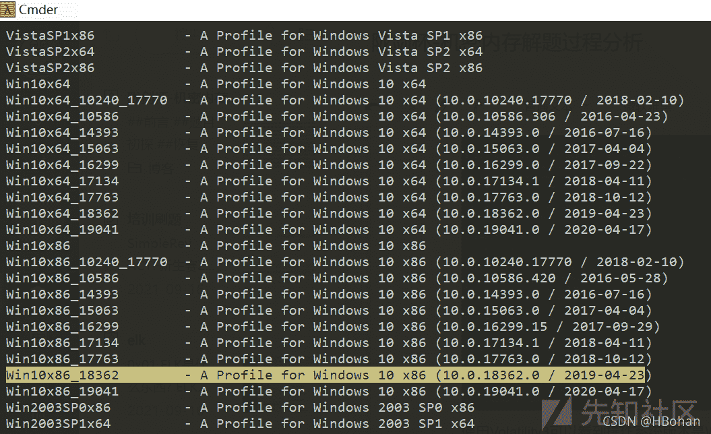

## 题目解答

（1）取证人员首先对容器的基本信息进行核实，经过确定该容器的基本信息为__。（答案为32位小写md5(容器操作系统系统的版本号+容器主机名+系统用户名），例如：操作系统的版本号为10.0.22449，容器主机名为DESKTOP-0521,系统登录用户名为admin，则该题答案为32位小写md5(10.0.22449DESKTOP-0521admin) 的值ae278d9bc4aa5ee84a4aed858d17d52a)

使用dumpregistry、WRR.exe对内存镜像进行注册表分析，发现主机名为DESKTOP-4N21ET2，系统的版本号为6.3.18363，系统登录用户名为Ado，则计算小写32位md5(6.3.18363DESKTOP-4N21ET2Ado)值为38c9307280315a1888681d133658e6ce。

使用dumpregistry导出注册表相关文件：

```
python2 vol.py -f mem_secret-963a4663.vmem --profile=Win10x64_18362 dumpregistry -D ./ 
```

使用WRR解析SYSTEM.reg文件获取到主机名为DESKTOP-4N21ET2
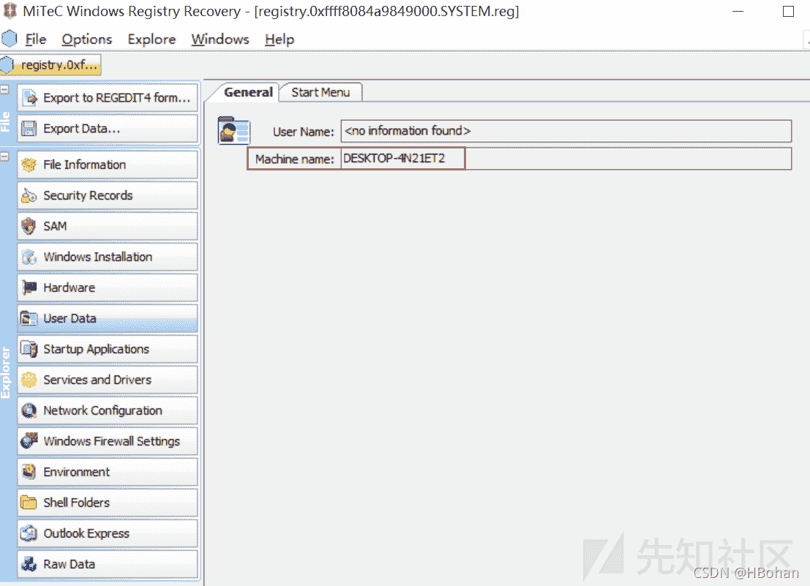
解析SOFTWARE.reg获得系统的版本号为6.3.18363
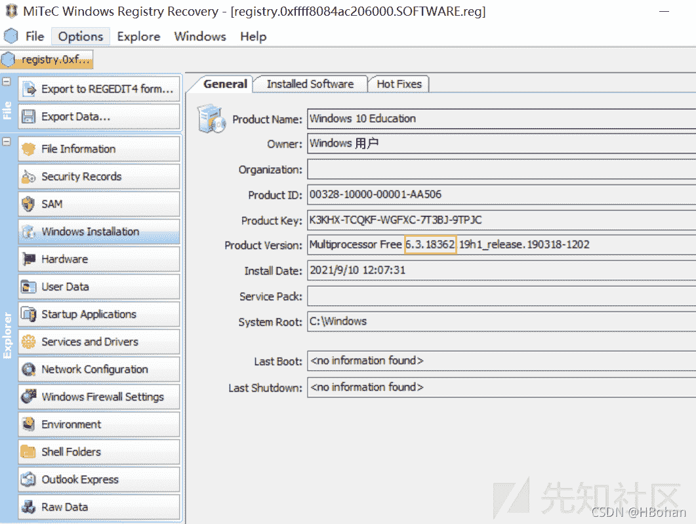
使用windows.filescan，导出结果搜索Desktop发现用户名为Ado
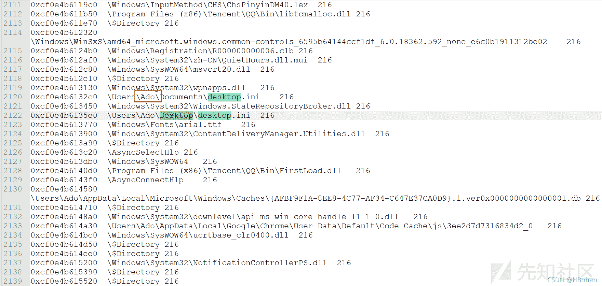
**（2）黑客入侵容器后曾通过木马控制端使用Messagebox发送过一段信息，该信息的内容是__。（答案为Messagebox信息框内内容）**
第二题的答案即为上面挂起状态虚拟机中看到的界面Messagebox内容：Best_hacker

**（3）经过入侵分析发现该容器受到入侵的原因为容器使用人的违规进行游戏的行为，该使用人进行游戏程序的信息是__。（答案为“32位小写md5(游戏程序注册邮箱+游戏程序登录用户名+游戏程序登录密码)，例如：注册邮箱为adol@163.com,登录用户名为user,密码为user1234，则该题答案为” adol@163.comuseruser1234”的小写md5值5f4505b7734467bfed3b16d5d6e75c16)**

根据题目要求，分析游戏程序，使用pslist查看进程信息可发现存在大量steam进程，对steam进程块使用winhex进行邮箱正则匹配，匹配到steam注册邮箱为john@uuf.me：
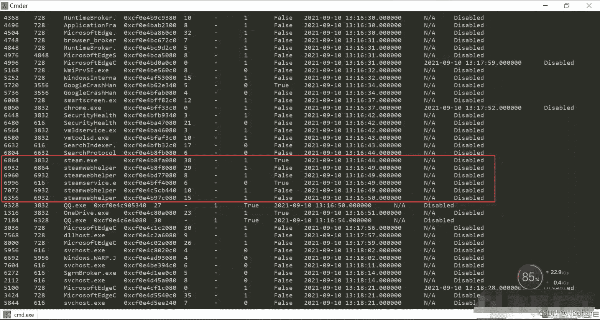
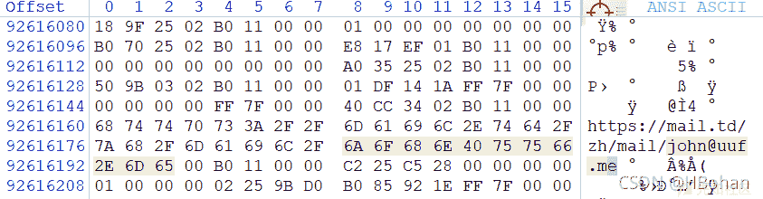
根据steam的登录特征，在steam进程块以及注册邮箱偏移地址附近，搜索关键词steamusername、password可以发现steam平台的登录信息，即用户名为jock_you1，密码为，jock.2021：

合并邮箱和用户名密码为john@uuf.mejock_you1jock.2021，计算md5小写32为值为：39a9ac5a37f4a4ce27b1227cf83700a6

**（4）经过入侵分析发现该容器曾被黑客植入木马控制的信息是_。（答案为“32位小写md5(木马程序进程名+木马回连ip地址+木马回连ip端口）”，例如：木马程序进程名为svhost.exe，木马回连ip为1.1.1.1，木马回连端口为1234，则该题答案为“svhost.exe1.1.1.11234”的32位小写md5值f02da74a0d78a13e7944277c3531bbea)**

使用pstree、netscan进行恶意程序分析，在使用pstree时发现伪装为steam的木马程序steam.exe，该程序并非steam自身程序且Wow64标识为True，并进行进程导出扫描，杀毒软件确切报毒。

```
python3 vol.py -f mem_secret-963a4663.vmem windows.pstree 
```

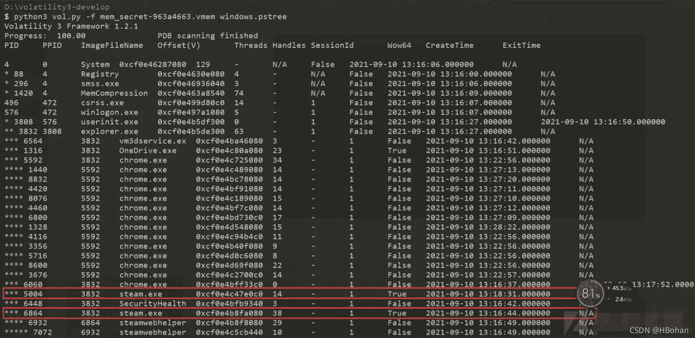
使用netscan扫描容器的网络连接情况，并对导出的steam.exe木马程序进行动态测试，发现木马程序回连ip为192.168.241.147，端口号为8808，与netscan中一致：

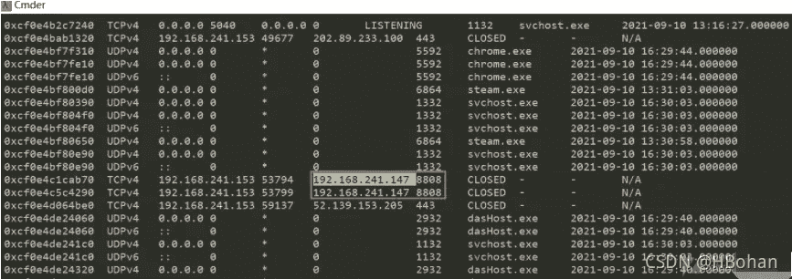
**（5）经过入侵分析，发现黑客曾经运行过痕迹清除工具，该工具运行的基本信息是__。（答案为“32为小写md5”(痕迹清除工具执行程序名+最后一次运行时间)，例如：黑客运行工具执行程序名为run.exe，运行时间为2021-07-10 10:10:13，则本题的答案为小写的32位md5(run.exe2021-07-10 10:10:13) 值为82d7aa7a3f1467b973505702beb35769，注意：本题中运行时间的格式为yy-mm-dd hh:mm:ss，时间时区为UTC+8）**

需要分析程序最后运行时间，使用userassist注册表分析程序的运行情况，并结合filescan扫描容器内文件情况，二者结合可以发现存储在容器桌面的无影无踪痕迹清理软件，该软件的程序执行名为：Wywz.exe，程序的运行时间结合userassist可以发现为2021-09-10 21:10:13 UTC+8（注意时区的转换），则该题答案为小写32位md5(Wywz.exe2021-09-1021:10:13) d46586ca847e6be1004037bc288bf60c

```
python2 vol.py -f mem_secret-963a4663.vmem --profile=Win10x64_18362 userassist 
```

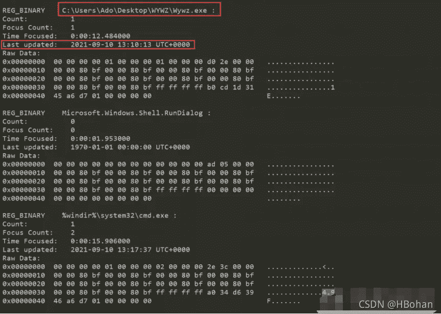

## 最后

【[获取网络安全学习资料](https://docs.qq.com/doc/DVFNpaGJvRFJiQ2Ro)】可以关注私我