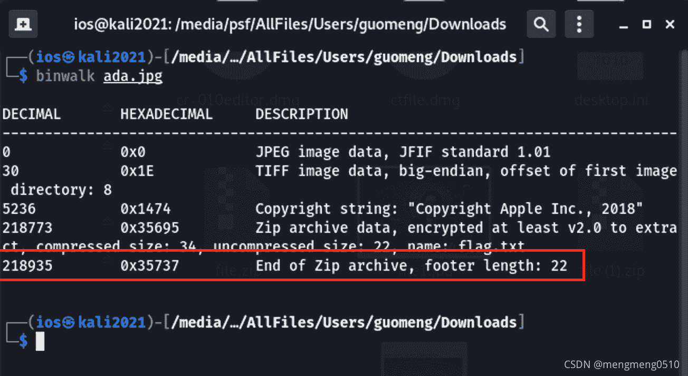
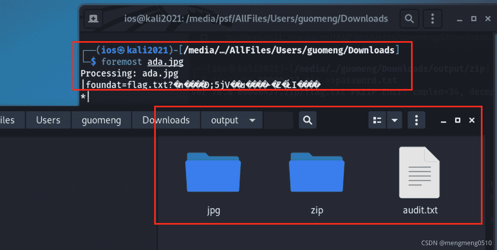
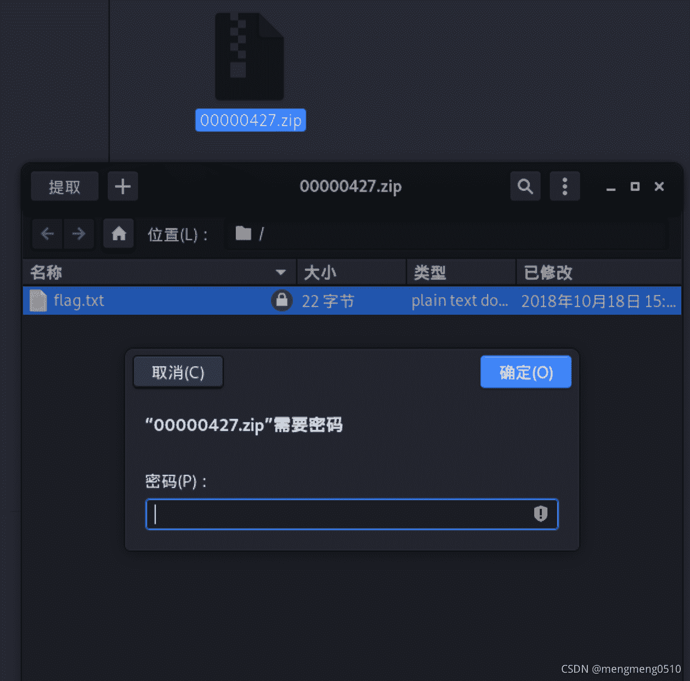
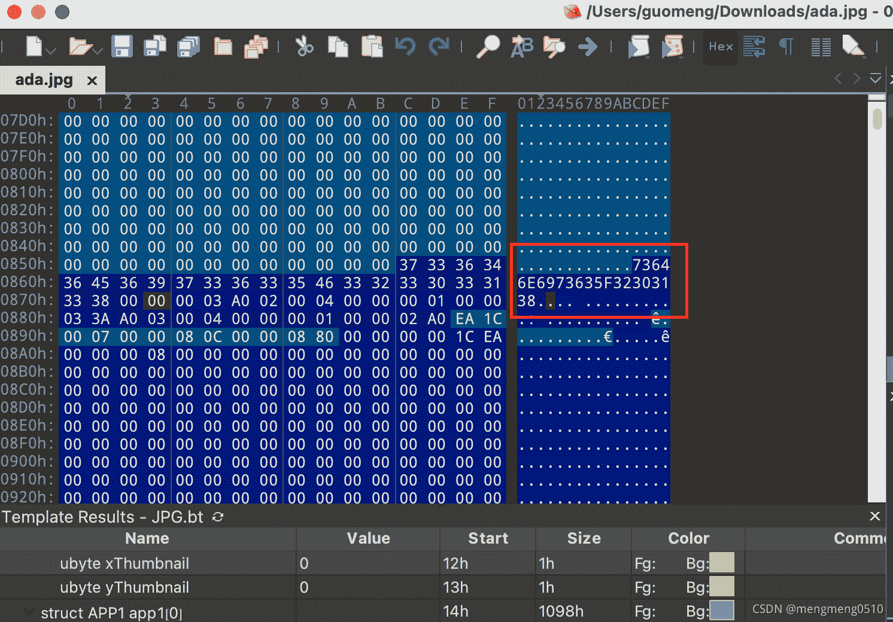
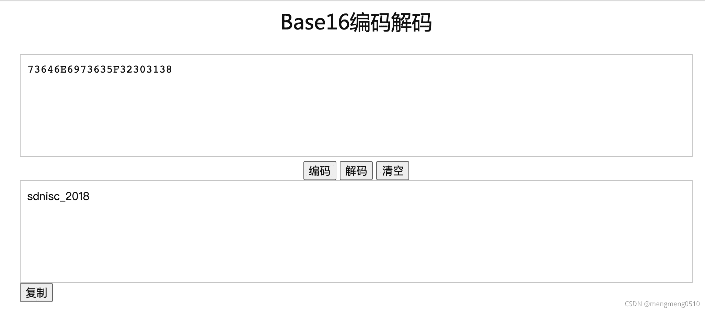
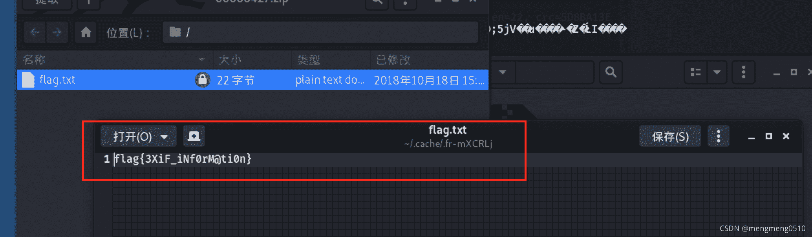

<!--yml
category: 未分类
date: 2022-04-26 14:43:42
-->

# 【CTF/MISC】图片隐写题（binwalk/foremost/010editer配合使用）_mengmeng0510的博客-CSDN博客_ctf隐写题

> 来源：[https://blog.csdn.net/mengmeng0510/article/details/120933296](https://blog.csdn.net/mengmeng0510/article/details/120933296)

# 题目

题目是一张图片：

寻找题目中隐藏的flag。

# 解题思路

一般来说我碰到图片隐写这种题，都会用到010editer和binwalk这两个工具，来看看图片中有没有什么隐藏的信息。

## binwalk工具查看是否有隐藏文件

首先我用binwalk工具查看一下图片中有没有隐藏其他的文件：

在里面我们发现藏有zip文件。

## foremost工具分离文件

foremost分离得到的文件存放在output文件夹下，我们可以看到有两个文件夹jpg和zip。jpg文件夹下就是存放着剥离后的照片。我们打开zip文件夹，发现里面有个压缩包，压缩包里面有个flag.txt文件。而这个flag.txt文件应该就藏着我们要找的flag信息了。但是此时我们发现解压文件需要密码：

## 010editer查看二进制数据，寻找解压密码

我们通过010editer工具打开ada.jpg文件，观察看有没有一些有用的信息，果然有意外发现：

我们在一堆00字节的中间发现了一串编码，我们发现这串编码只包含0~9的数字和大写字母ABCDEF，因此我们可以怀疑这串编码为base16编码，我们通过在线解码工具进行解码：

sdnisc_2018应该就是我们要找的解压密码：

# 解题心得

解题过程中要有思路，要有耐心，熟练掌握各种工具的使用，就一定能找到flag。

# 题目连接

https://ctf.bugku.com/challenges/detail/id/6.html?page=3