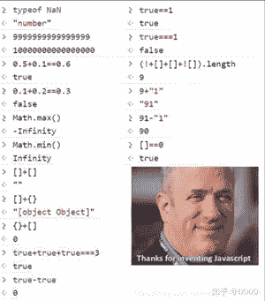

<!--yml
category: 未分类
date: 2022-04-26 14:48:48
-->

# 【moeCTF题解-0x05】Misc_框架主义者的博客-CSDN博客

> 来源：[https://blog.csdn.net/weixin_47102975/article/details/109537233](https://blog.csdn.net/weixin_47102975/article/details/109537233)

* * *

title: 【moeCTF题解-0x05】Misc
categories:

*   CTF
*   moeCTF
    tags:
*   CTF
*   Misc
*   Python

* * *

# 【moeCTF题解-0x05】Misc

> 如果把Web安全、二进制安全、密码学等等方向的研究看成是你约会时候和你的 男/女朋友吃的主餐，Misc杂项就是餐后小甜点。虽然很好吃，越吃越上瘾，但是 最后往往很年轻的时候的了糖尿病。
> 
> ——XDSEC@EndCat

可是我只会Misc呀`（o´・ェ・｀o）`

> **【moeCTF题解】总目录如下：**（若本文图片看不见请访问以下相应的地址）

# Misc

13/17

## Welcome

> 50points
> 
> 本人表达能力太差，故放上Endcat学姐写的入门pdf。 本题考点为16进制编辑器的简单使用（真的超简单！

这个PDF是EndCat写的一篇Misc入门指南，读罢指南，发现最后有一句话：

> 对了，我在这个文件里面隐藏了一点信息，你能找出来嘛：)

但是我用各种工具对这个PDF找来找去也没有发现什么，此时我发现题目还有另一个附件：

[外链图片转存失败,源站可能有防盗链机制,建议将图片保存下来直接上传(img-Y5yf93xT-1604659309698)(【moeCTF题解-0x05】Misc/profession.jpg)]

打开文件的二进制一看：

```
000075d0: 2E 2E 6D 6F 65 63 74 66 7B 4A 6F 31 6E 5F 30 75    ..moectf{Jo1n_0u
000075e0: 72 5F 70 72 6F 66 65 73 73 69 6F 6E 61 6C 5F 67    r_professional_g
000075f0: 72 6F 75 70 7D 2E 2E 2E 00 C4 6B 5F EB 7F CA 7A    roup}....Dk_k.Jz
00007600: 14 1F FF D9                                        ...Y 
```

这不就是flag啦：`moectf{Jo1n_0ur_professional_group}`

(っ °Д °;)っ

> Misc是什么意思？Misc的英文全写是Miscellaneous，意为大杂烩、杂项。从语 义来说，你可能会认为Misc涉及的是安全研究方向的方方面面，但实际上还是有 点偏差的。Misc分支在CTF赛事中也有较为明确的范围规定。举几个例子：社会 工程学（就是你们口口相传的“社 工”）、数字取证（Forensics，实训基地也有专门的电子取证分部是专门研究这个东西的）、隐写分析（Steganography）、编码 转换（Encode/Decode）等等。实际上Misc在一些较大的CTF赛事中，是作为 “穿插考点”而存在的。Misc也会涉及比较简单的古典密码学，通信传输协议，有的 时候甚至会让你分析一下从各种各样实际的硬件中扒下来的流量记录，单片机程序。
> 
> ——XDSEC@EndCat

## MD5

> 50points
> 
> c4d038b4bed09fdb1471ef51ec3a32cd
> 
> 请将得到的结果包上moectf{}进行提交

MD5是什么？

> **MD5信息摘要算法**（英语：MD5 Message-Digest Algorithm），一种被广泛使用的[密码散列函数](https://baike.baidu.com/item/%E5%AF%86%E7%A0%81%E6%95%A3%E5%88%97%E5%87%BD%E6%95%B0/14937715)，可以产生出一个128位（16[字节](https://baike.baidu.com/item/%E5%AD%97%E8%8A%82/1096318)）的散列值（hash value），用于确保信息传输完整一致。MD5由美国密码学家[罗纳德·李维斯特](https://baike.baidu.com/item/%E7%BD%97%E7%BA%B3%E5%BE%B7%C2%B7%E6%9D%8E%E7%BB%B4%E6%96%AF%E7%89%B9/700199)（Ronald Linn Rivest）设计，于1992年公开，用以取代[MD4](https://baike.baidu.com/item/MD4/8090275)算法。这套算法的程序在 RFC 1321 标准中被加以规范。1996年后该算法被证实存在弱点，可以被加以破解，对于需要高度安全性的数据，专家一般建议改用其他算法，如[SHA-2](https://baike.baidu.com/item/SHA-2/22718180)。2004年，证实MD5算法无法防止碰撞（collision），因此不适用于安全性认证，如[SSL](https://baike.baidu.com/item/SSL/320778)公开密钥认证或是[数字签名](https://baike.baidu.com/item/%E6%95%B0%E5%AD%97%E7%AD%BE%E5%90%8D/212550)等用途。
> 
> ——百度百科

*既然MD5这么不安全了，为什么感觉现在还在大量地被使用。比如全国大学生数学建模竞赛，甚至之前我当其志愿者监考的届全国中学生网络安全竞赛都用MD5验证文件……*

> 目前可以说md5已经基本被攻破了，一般的MD5的碰撞都可以在如下网上获取到
> 
> *   http://www.cmd5.com/
> *   http://www.ttmd5.com/
> *   http://pmd5.com/
> 
> ——[CTF Wiki](https://wiki.x10sec.org/crypto/hash/md5/)

*感觉这些网站都是通过字典来反加密的*

把题目中的c4d038b4bed09fdb1471ef51ec3a32cd解密得`114514`

所以flag：`moectf{114514}`

## base64

> 50points
> 
> bW9lY3RmJTdCZXpfYjY0JTIxJTdE
> 
> 来点究极送分题

送分：base64解密得：

`moectf%7Bez_b64%21%7D`

然后URL反转码得：

`moectf{ez_b64!}`

## hey fxck you!

> 100points
> 
> Good morning my neighbors!

附件是一张图片：

[外链图片转存失败,源站可能有防盗链机制,建议将图片保存下来直接上传(img-OhTxdFB4-1604659309700)(【moeCTF题解-0x05】Misc/good_morning_my_neighbors.png)]

*哼，又玩梗*

查看二进制没发现什么特别的，上`binwalk`发现能解包，解之：

解出文件`fk u.txt`内容如下：

```
++++++++[>>++>++++>++++++>++++++++>++++++++++>++++++++++++>++++++++++++++>++++++++++++++++>++++++++++++++++++>++++++++++++++++++++>++++++++++++++++++++++>++++++++++++++++++++++++>++++++++++++++++++++++++++>++++++++++++++++++++++++++++>++++++++++++++++++++++++++++++<<<<<<<<<<<<<<<<-]>>>>>>>>---.++.<+++++.--.>+++++.<+++.>>-----.--.<<-.>-.<<<<<+.>>>>>>.<<.>.<<<<<.>>>>+.+++++.------------.<+++++.>.<<<++.<.>>>>>>++++. 
```

啊这不是`Brainfuck`嘛，一种神奇的图灵完备的语言，而且很像图灵机的运行方式呢（但又不是）

> Müller的目标是创建一种简单的、可以用最小的[编译器](https://zh.wikipedia.org/wiki/%E7%BC%96%E8%AF%91%E5%99%A8)来实现的、符合[图灵完全](https://zh.wikipedia.org/wiki/%E5%9B%BE%E7%81%B5%E5%AE%8C%E5%85%A8)思想的编程语言。这种语言由八种[运算符](https://zh.wikipedia.org/wiki/%E8%BF%90%E7%AE%97%E7%AC%A6)构成，为[Amiga](https://zh.wikipedia.org/wiki/Amiga)机器编写的编译器（第二版）只有240个[字节](https://zh.wikipedia.org/wiki/%E5%AD%97%E8%8A%82)大小。[[1]](https://zh.wikipedia.org/wiki/Brainfuck#cite_note-1)
> 
> 就像它的名字所暗示的，Brainfuck[程序](https://zh.wikipedia.org/wiki/%E8%AE%A1%E7%AE%97%E6%9C%BA%E7%A8%8B%E5%BA%8F)很难读懂。尽管如此，Brainfuck[图灵机](https://zh.wikipedia.org/wiki/%E5%9B%BE%E7%81%B5%E6%9C%BA)一样可以完成任何计算任务。虽然Brainfuck的计算方式如此与众不同，但它确实能够正确运行。
> 
> 这种语言基于一个简单的机器模型，除了指令，这个机器还包括：一个以字节为单位、被初始化为零的[数组](https://zh.wikipedia.org/wiki/%E6%95%B0%E7%BB%84)、一个指向该数组的[指针](https://zh.wikipedia.org/wiki/%E6%8C%87%E9%92%88)（初始时指向数组的第一个字节）、以及用于输入输出的两个[字节流](https://zh.wikipedia.org/wiki/%E5%AD%97%E7%AF%80%E6%B5%81)。
> 
> 下面是这八种状态的描述，其中每个状态由一个[字符](https://zh.wikipedia.org/wiki/%E5%AD%97%E7%AC%A6)标识：
> 
> | 字符 | 含义 |
> | :-: | :-: |
> | `>` | 指针加一 |
> | `<` | 指针减一 |
> | `+` | 指针指向的字节的值加一 |
> | `-` | 指针指向的字节的值减一 |
> | `.` | 输出指针指向的单元内容（[ASCII码](https://zh.wikipedia.org/wiki/ASCII%E7%A0%81)） |
> | `,` | 输入内容到指针指向的单元（ASCII码） |
> | `[` | 如果指针指向的单元值为零，向后跳转到对应的`]`指令的次一指令处 |
> | `]` | 如果指针指向的单元值不为零，向前跳转到对应的`[`指令的次一指令处 |
> 
> 按照更节省时间的简单说法，`]`也可以说成“向前跳转到对应的`[`状态”。这两解释是一样的。
> 
> 第三种同价的说法，`[`意思是“向后跳转到对应的`]`”，`]`意思是“向前跳转到对应的`[`指令的次一指令处，如果指针指向的字节非零。”
> 
> Brainfuck程序可以用下面的替换方法翻译成[C语言](https://zh.wikipedia.org/wiki/C%E8%AF%AD%E8%A8%80)（假设`ptr`是`char *`[类型](https://zh.wikipedia.org/wiki/%E8%B3%87%E6%96%99%E9%A1%9E%E5%9E%8B)）：
> 
> | Brainfuck | C |
> | :-: | :-: |
> | `>` | `++ptr;` |
> | `<` | `--ptr;` |
> | `+` | `++*ptr;` |
> | `-` | `--*ptr;` |
> | `.` | `putchar(*ptr);` |
> | `,` | `*ptr = getchar();` |
> | `[` | `while (*ptr) {` |
> | `]` | `}` |
> 
> ——https://zh.wikipedia.org/wiki/Brainfuck

用[Brainfuck反汇编-高级版(Python2)](https://www.cnblogs.com/qintangtao/p/7117433.html)可以反汇编所给Brainfuck代码如下：

```
mem[0] += 8
while mem[0]:
        mem[2] += 2
        mem[3] += 4
        mem[4] += 6
        mem[5] += 8
        mem[6] += 10
        mem[7] += 12
        mem[8] += 14
        mem[9] += 16
        mem[10] += 18
        mem[11] += 20
        mem[12] += 22
        mem[13] += 24
        mem[14] += 26
        mem[15] += 28
        mem[16] += 30
        mem[0] -= 1
mem[8] -= 3
cmp mem[8] data[data_ptr]
mem[8] += 2
cmp mem[8] data[data_ptr]
mem[7] += 5
cmp mem[7] data[data_ptr]
mem[7] -= 2
cmp mem[7] data[data_ptr]
mem[8] += 5
cmp mem[8] data[data_ptr]
mem[7] += 3
cmp mem[7] data[data_ptr]
mem[9] -= 5
cmp mem[9] data[data_ptr]
mem[9] -= 2
cmp mem[9] data[data_ptr]
mem[7] -= 1
cmp mem[7] data[data_ptr]
mem[8] -= 1
cmp mem[8] data[data_ptr]
mem[3] += 1
cmp mem[3] data[data_ptr]
cmp mem[9] data[data_ptr]
cmp mem[7] data[data_ptr]
cmp mem[8] data[data_ptr]
cmp mem[3] data[data_ptr]
mem[7] += 1
cmp mem[7] data[data_ptr]
mem[7] += 5
cmp mem[7] data[data_ptr]
mem[7] -= 12
cmp mem[7] data[data_ptr]
mem[6] += 5
cmp mem[6] data[data_ptr]
cmp mem[7] data[data_ptr]
mem[4] += 2
cmp mem[4] data[data_ptr]
cmp mem[3] data[data_ptr]
mem[9] += 4
cmp mem[9] data[data_ptr] 
```

呃，其实直接用[网上现成](http://ctf.ssleye.com/brain.html)的BF解释器运行一下就行了，得到flag：`moectf{yes!yes!fk_U_2!}`

另，这是一个python写的BF解释器，https://github.com/pocmo/Python-Brainfuck

> Usage:
> `./brainfuck.py yourcode.bf`
> 
> You can use it as a module as well:
> `import brainfuck`

git clone 到本地后，同目录下运行如下脚本也可以解出flag：

```
import brainfuck

sourcecode = """
++++++++[>>++>++++>++++++>++++++++>++++++++++>++++++++++++>++++++++++++++>++++++++++++++++>++++++++++++++++++>++++++++++++++++++++>++++++++++++++++++++++>++++++++++++++++++++++++>++++++++++++++++++++++++++>++++++++++++++++++++++++++++>++++++++++++++++++++++++++++++<<<<<<<<<<<<<<<<-]>>>>>>>>---.++.<+++++.--.>+++++.<+++.>>-----.--.<<-.>-.<<<<<+.>>>>>>.<<.>.<<<<<.>>>>+.+++++.------------.<+++++.>.<<<++.<.>>>>>>++++.
"""

brainfuck.evaluate(sourcecode) 
```

## base64？¿

> 150points
> 
> “这这这这这真的是base64？”
> 
> ——被RX暴打的luoqian如是说道
> 
> `0H9MJjCNPiMgJHMQJNtfyEJgIjtS1Ig=`
> 
> **Hint:**
> 
> `vwxrstuopq34567ABCDEFGHIJyz012PQRSTKLMNOZabcdUVWXYefghijklmn89+/`

<mark>TODO</mark>

## Pseudo Encryption

> 150points
> 
> 小萌新arttnba3藏着flag的压缩包被万恶的luoqian师傅给加密了！arttnba3现在连压缩包都打不开了，你能帮他找出压缩包中的flag吗？
> 
> 注：flag因为出题人脑抽写错了一个词，不要在意（

题目附件下载下来是一个压缩包，直接解压提示`无法作为压缩包……`

查看二进制，发现文件头被恶意修改了：

```
 Offset: 00 01 02 03 04 05 06 07 08 09 0A 0B 0C 0D 0E 0F 	
00000000: 12 34 04 14 00 00 00 08 00 E1 AC 22 51 9C C5 9E    .4.......a,"Q.E.
00000010: 60 6D 34 00 00 EE 3A 00 00 08 00 00 00 66 6C 61    `m4..n:......fla
00000020: 67 2E 6A 70 67 CC 5A 77 3C DB D1 16 4F FB 3A 75    g.jpgLZw<[Q.O{:u 
```

于是把他修改回zip的文件头（注意这里不是位对齐的，得再添加一字节。而且先猜测是伪加密）

```
 Offset: 00 01 02 03 04 05 06 07 08 09 0A 0B 0C 0D 0E 0F 	
00000000: 50 4B 03 04 0A 00 00 00 08 00 E1 AC 22 51 9C C5    PK........a,"Q.E
00000010: 9E 60 6D 34 00 00 EE 3A 00 00 08 00 00 00 66 6C    .`m4..n:......fl
00000020: 61 67 2E 6A 70 67 CC 5A 77 3C DB D1 16 4F FB 3A    ag.jpgLZw<[Q.O{: 
```

修改后压缩包就可以解压了，果然没有密码

解压里面发现是一个

*高能预警*

[外链图片转存失败,源站可能有防盗链机制,建议将图片保存下来直接上传(img-zCY4MEda-1604659309701)(【moeCTF题解-0x05】Misc/flag.jpg)]

啊啊啊太吓人了叭😱

猜测图片隐写，观察文件的二进制，发现后面有一大段空字节的最后有如下数据：

```
00003aa0: 00 00 00 00 00 00 00 00 00 00 00 00 00 00 00 00    ................
00003ab0: 00 00 00 00 00 00 00 00 00 00 00 00 00 00 7F FF    ................
00003ac0: D9 20 62 57 39 6C 59 33 52 6D 4A 54 64 43 53 6E    Y.bW9lY3RmJTdCSn
00003ad0: 56 7A 4E 31 39 6A 4E 6D 46 75 4F 57 56 66 51 46    VzN19jNmFuOWVfQF
00003ae0: 39 69 4D 58 51 6C 4D 6A 45 6C 4E 30 51 3D          9iMXQlMjElN0Q= 
```

其中

`bW9lY3RmJTdCSnVzN19jNmFuOWVfQF9iMXQlMjElN0Q=`

有base64的特征，解码得到

`moectf%7BJus7_c6an9e_@_b1t%21%7D`

URL编码解码得到flag：

`moectf{Jus7_c6an9e_@_b1t!}`

## 不 会 吧 ？ 就 这 ¿

> 175points
> 
> 
> 
> FLAG形式：moectf{FLAG内容} 不 会 吧 ？ 就 这 ¿不 会 吧 ？ 就 这 ¿不 会 吧 ？ 就 这 ¿不 会 吧 ？ 就 这 ¿不 会 吧 ？ 就 这 ¿不 会 吧 ？ 就 这 ¿不 会 吧 ？ 就 这 ¿不 会 吧 ？ 就 这 ¿不 会 吧 ？ 就 这 ¿不 会 吧 ？ 就 这 ¿不 会 吧 ？ 就 这 ¿不 会 吧 ？ 就 这 ¿不 会 吧 ？ 就 这 ¿不 会 吧 ？ 就 这 ¿不 会 吧 ？ 就 这 ¿不 会 吧 ？ 就 这 ¿不 会 吧 ？ 就 这 ¿不 会 吧 ？ 就 这 ¿不 会 吧 ？ 就 这 ¿不 会 吧 ？ 就 这 ¿不 会 吧 ？ 就 这 ¿不 会 吧 ？ 就 这 ¿不 会 吧 ？ 就 这 ¿不 会 吧 ？ 就 这 ¿不 会 吧 ？ 就 这 ¿不 会 吧 ？ 就 这 ¿不 会 吧 ？ 就 这 ¿不 会 吧 ？ 就 这 ¿不 会 吧 ？ 就 这 ¿不 会 吧 ？ 就 这 ¿不 会 吧 ？ 就 这 ¿不 会 吧 ？ 就 这 ¿不 会 吧 ？ 就 这 ¿不 会 吧 ？ 就 这 ¿不 会 吧 ？ 就 这 ¿不 会 吧 ？ 就 这 ¿不 会 吧 ？ 就 这 ¿不 会 吧 ？ 就 这 ¿不 会 吧 ？ 就 这 ¿

？¿ ？¿ ？¿ ？¿ ？¿ ？¿ ？¿ ？¿ ？¿ ？¿ ？¿ ？¿ ？¿ ？¿ ？¿

先看一下题目，后面的一大段`不 会 吧 ？ 就 这 ¿`即有规律性，根据信息熵的原理，它只能蕴含很少量的信息，所以认为这个不是找到flag的重点，

下载题目附件图片如下：

[外链图片转存失败,源站可能有防盗链机制,建议将图片保存下来直接上传(img-c5AdID0F-1604659309704)(【moeCTF题解-0x05】Misc/puzzle.jpg)]

*这张图片与题干里的图片并不一样*

？¿ ？¿ ？¿ ？¿ ？¿ ？¿ ？¿ ？¿ ？¿ ？¿ ？¿ ？¿ ？¿ ？¿ ？¿

binwalk它！

```
$ binwalk puzzle.jpg -e 
```

提取出puzzle.txt内容如下：

```
不会吧？ 就这¿ 就这¿ 不会吧？ 不会吧？ 就这¿ 不会吧？ 就这¿ 
就这¿ 就这¿ 就这¿ 就这¿ 不会吧？ 不会吧？ 就这¿ 就这¿ 
不会吧？ 就这¿ 不会吧？ 就这¿ 不会吧？ 不会吧？ 不会吧？ 就这¿ 
不会吧？ 不会吧？ 不会吧？ 不会吧？ 不会吧？ 就这¿ 不会吧？ 就这¿ 
不会吧？ 不会吧？ 不会吧？ 就这¿ 不会吧？ 不会吧？ 不会吧？ 就这¿ 
就这¿ 就这¿ 就这¿ 不会吧？ 就这¿ 不会吧？ 不会吧？ 就这¿ 
就这¿ 就这¿ 不会吧？ 就这¿ 不会吧？ 不会吧？ 就这¿ 就这¿ 
就这¿ 就这¿ 不会吧？ 就这¿ 不会吧？ 不会吧？ 不会吧？ 就这¿ 
不会吧？ 不会吧？ 不会吧？ 不会吧？ 不会吧？ 不会吧？ 就这¿ 就这¿ 
不会吧？ 就这¿ 不会吧？ 不会吧？ 就这¿ 不会吧？ 就这¿ 就这¿ 
就这¿ 就这¿ 就这¿ 就这¿ 不会吧？ 不会吧？ 就这¿ 就这¿ 
就这¿ 不会吧？ 不会吧？ 不会吧？ 就这¿ 不会吧？ 不会吧？ 就这¿ 
不会吧？ 就这¿ 就这¿ 就这¿ 不会吧？ 不会吧？ 就这¿ 就这¿ 
不会吧？ 就这¿ 就这¿ 不会吧？ 不会吧？ 不会吧？ 不会吧？ 就这¿ 
不会吧？ 不会吧？ 不会吧？ 不会吧？ 不会吧？ 就这¿ 不会吧？ 就这¿ 
就这¿ 就这¿ 不会吧？ 就这¿ 不会吧？ 不会吧？ 不会吧？ 就这¿ 
就这¿ 就这¿ 就这¿ 不会吧？ 就这¿ 不会吧？ 不会吧？ 就这¿ 
不会吧？ 就这¿ 就这¿ 就这¿ 不会吧？ 不会吧？ 就这¿ 就这¿ 
不会吧？ 不会吧？ 就这¿ 就这¿ 不会吧？ 就这¿ 不会吧？ 就这¿ 
不会吧？ 不会吧？ 不会吧？ 不会吧？ 不会吧？ 不会吧？ 就这¿ 就这¿ 
```

发现里面就`不会吧？`与`就这¿`两种符号。根据信息论原理，可以简单地把这两者符号替换成`1`和`0`：

```
10011010
00001100
10101110
11111010
11101110
00010110
00101100
00101110
11111100
10110100
00001100
01110110
10001100
10011110
11111010
00101110
00010110
10001100
11001010
11111100 
```

发现每一行是8位，且最后都是0，根据ASCII码的特性（8位，且第一位都是0），猜测是倒序的ASCII，

建立解码脚本如下：

```
chrd = """10011010
00001100
10101110
11111010
11101110
00010110
00101100
00101110
11111100
10110100
00001100
01110110
10001100
10011110
11111010
00101110
00010110
10001100
11001010
11111100
"""
s = ""
str1 = ""
for i in chrd:
    if(i == '\n'):
        str1 = str1 + chr(int(s,2))
        s = ""
    else:
        s = i + s

print(str1) 
```

运行输出：`Y0u_wh4t?-0n1y_th1S?`

轻松得到flag：`moectf{Y0u_wh4t?-0n1y_th1S?}`

？¿ ？¿ ？¿ ？¿ ？¿ ？¿ ？¿ ？¿ ？¿ ？¿ ？¿ ？¿ ？¿ ？¿ ？¿

## Cor1e的支票

> 200points
> 
> `Cor1e`学姐给你发来一条消息, 这条消息据说每个句号价值`700`, 每个问号价值`2500`, 每个感叹号据说都是无价之宝.
> 
> **Hint：**
> 
> 题目描述中的`2500`与`700`与解题无关哦~不要当成重点了

这题没做出来，后来知道是`Ook`语言，孤陋寡闻了……

> [Ook!](http://www.dangermouse.net/esoteric/ook.html) 与Brainfuck类似, 但用单词`Ook！`，`Ook.` 和`Ook?`代替。

## 简 单 的社工题

> 200points
> **本题不需要使用脚本对服务器进行爆破！**
> 
> 简单的社工尝试！你能找到隐藏的**moectf**的flag吗？
> 
> 提示：百度贴吧 使用手机版贴吧寻找第一步的信息 flag格式：moectf{flag内容}
> 
> **Hints：**
> 
> 0x00.和图片隐写无关
> 
> 0x01.第一个hint请在获取奇怪的八+1个数据后再开
> 
> > 百度一下那两个英文单词拼出来的东西？
> 
> 0x02.第二个hint请在获取神必链接后再开
> 
> > 密码长度7位 后6位是一个常见弱口令
> > 
> > *我做的时候只提示了“弱口令”，于是做是时候稍微违反了一下规则，详见后文*
> 
> 0x03.第三个hint还请在获取到神必代码后不会使用再开
> 
> > 没开这个hint
> 
> 0x04.flag没有那么容易获得，不要在上面那几步你都没走过之前看到奇怪的长得像flag的东西就想当然

### 百度贴吧

随便搜索一下，便可以发现在[moectf吧](https://tieba.baidu.com/f?kw=moectf&ie=utf-8)里有[moectf2020-简单的社工尝试！](https://tieba.baidu.com/p/6870157760)这个贴子，内容如下：

> [玄影空灵星痕印](https://tieba.baidu.com/home/main?un=%E7%8E%84%E5%BD%B1%E7%A9%BA%E7%81%B5%E6%98%9F%E7%97%95%E5%8D%B0&ie=utf-8&id=tb.1.e1f236ee.tNGYXbOxOdntGStsKQrfBg&fr=pb)
> 
> 猜猜flag在哪呢
> 
> 
> 来自[Android客户端](http://c.tieba.baidu.com/c/s/download/pc?src=webtbGF)1楼2020-08-09 04:24

### 奇怪的八+1个数据

观察这个贴子一些相关信息，注意到楼主只关注了一个人[arttnba](https://tieba.baidu.com/home/main?un=arttnba&fr=ihome&ie=utf-8&id=tb.1.ddc60c23.YtAkkTMCwe6OQ9KcB8Nfcw)，这个人很可疑，没有什么动态，而且没有`3`，但关注了一堆奇奇怪怪的吧：

[外链图片转存失败,源站可能有防盗链机制,建议将图片保存下来直接上传(img-3zmo1zdj-1604659309708)(【moeCTF题解-0x05】Misc/image-20201025165801884.png)]

*这里就需要用手机版贴吧查看了，web版不知道为什么只能显示前8个吧*

吧名都很奇怪，这应该正是所谓的“奇怪的八+1个数据”了吧。

### 神必链接

考虑到用户关注的时间先后顺序，我们需要从下往上读：

`923431`、`ourmail.cn`

于是在https://ourmail.cn/中进一步寻找信息

打开 https://ourmail.cn/

加入群公邮号为`923431`的公邮群：

[外链图片转存失败,源站可能有防盗链机制,建议将图片保存下来直接上传(img-Hnhf3tgC-1604659309709)(【moeCTF题解-0x05】Misc/image-20201025171020254.png)]

发现需要密码，猜测了几十个简单密码无果后，于是……

> 【最屑出题人】19-arttnba3 2020/9/19 21:28:56
> @全体成员 社工题不需要你破坏题目环境哈
> 
> 【最屑出题人】19-arttnba3 2020/9/19 21:29:01
> 不要乱搞
> 
> 【最屑出题人】19-arttnba3 2020/9/19 21:29:07
> [外链图片转存失败,源站可能有防盗链机制,建议将图片保存下来直接上传(img-9VlQAg9i-1604659309710)(【moeCTF题解-0x05】Misc/image-20201025171440080.png)]
> 
> 【传说】19-golden_pigeon 2020/9/19 21:34:18
> [外链图片转存失败,源站可能有防盗链机制,建议将图片保存下来直接上传(img-UzJYzHwS-1604659309711)(【moeCTF题解-0x05】Misc/{}{`MVGPKE@7@RWBAVXKWWL-1603617200499.jpg)]
> 
> 【最屑出题人】19-arttnba3 2020/9/19 21:34:49
> 还有就是社工的对象是这个账号不是社工我
> 
> 【最屑出题人】19-arttnba3 2020/9/19 21:34:54
> [外链图片转存失败,源站可能有防盗链机制,建议将图片保存下来直接上传(img-bHiCpW4c-1604659309711)(【moeCTF题解-0x05】Misc/image-20201025171440080.png)]

~~啊啊啊方向错了~~

开hint，提示“弱口令”

可我已经试了好久的弱密码了

QAQ

因为网站试密码不需要验证码也（可能）没有次数限制，还能通过浏览器功能关闭密码错误的弹窗，简单写了一个按键精灵来试密码：

```
from pynput.mouse import Button, Controller
from pynput.keyboard import Key, Controller
import time

passwords = """
# 这里放常用弱口令字典
"""

def main():
    listPassword = []
    strs = ''
    for i in passwords:
        if(i == '\n'):
            listPassword.append(strs)
            strs = ''
        else:
            strs = strs + i
    keyboard = Controller()
    for i in range(0,5):
        print(5 - i)
        time.sleep(1)

    for i in listPassword:
        print(i)
        keyboard.type(i)
        keyboard.press(Key.enter)
        keyboard.release(Key.enter)

        for i in range(0,15):
            keyboard.press(Key.backspace)
            keyboard.release(Key.backspace)

    for i in range(999999):
        print(str(i))
        keyboard.type(str(i))
        keyboard.press(Key.enter)
        keyboard.release(Key.enter)

        for i in range(0,15):
            keyboard.press(Key.backspace)
            keyboard.release(Key.backspace)

if __name__ == '__main__':
    main() 
```

运行一下就直接加入成功了。

注：我使用的字典如下

```
123456789
a123456
123456
a123456789
1234567890
woaini1314
qq123456
abc123456
123456a
123456789a
147258369
zxcvbnm
987654321
12345678910
abc123
qq123456789
123456789.
7708801314520
woaini
5201314520
q123456
123456abc
1233211234567
123123123
123456.
0123456789
asd123456
aa123456
135792468
q123456789
abcd123456
12345678900
woaini520
woaini123
zxcvbnm123
1111111111111111
w123456
aini1314
abc123456789
111111
woaini521
qwertyuiop
1314520520
1234567891
qwe123456
asd123
000000
1472583690
1357924680
789456123
123456789abc
z123456
1234567899
aaa123456
abcd1234
www123456
123456789q
123abc
qwe123
w123456789
7894561230
123456qq
zxc123456
123456789qq
1111111111
111111111
0000000000000000
1234567891234567
qazwsxedc
qwerty
123456..
zxc123
asdfghjkl
0000000000
1234554321
123456q
123456aa
admin123
9876543210
110120119
qaz123456
qq5201314
123698745
5201314
000000000
as123456
123123
5841314520
z123456789
52013145201314
a123123
caonima
a5201314
wang123456
abcd123
123456789..
woaini1314520
123456asd
aa123456789
admin
741852963
a12345678
t12345678
t123456
admin123456
root123456
5201314
521
654321
admin
sa
toor
root123
adminroot
123
abc123
123456
1q2w3e4r5t
XUhUHp6tEsrvt5SU
cimerroot@123
adminsa123..
123123
oracle001
oracle.com
admin123..
adminroot123
root
888888
admin123 
```

### 神必代码

加入后发现一个叫`/s`的人发了一个奇怪的公告：

> 
> 
> /s
> 
> 8月9日 07:18
> 
> 发给: 全部成员 (1人未读，24人已读)
> 
> address：1O9JFcsUyqQ7T85WXmHH6nQ

公告里有它自己的回复：

> /s
> 
> 8月9日 07:42
> 
> a3cj

常逛百度贴吧的人一眼就看出来了是百度网盘的分享蓝链（因为防和谐吞链所以吧友们常常会把前面的域名去掉），补全构造如下：

https://pan.baidu.com/s/1O9JFcsUyqQ7T85WXmHH6nQ

打开输入密码`a3cj`发现分享的是一个`弗莱格.txt`

内容是：

`bW9lY3RmJTdCdzB3X1kwdV9jNG5fZjFuZF9tM19vdVQlMjElN0Q=`

base64特征，于是解码如下：

`moectf%7Bw0w_Y0u_c4n_f1nd_m3_ouT%21%7D`

URL解码得到flag：

`moectf{w0w_Y0u_c4n_f1nd_m3_ouT!}`

## A3FXCK

> 200points
> 
> 
> 
> “luoq1an向arttnba3推荐了世界上最优秀的语言Javascript，但对于实在是不精通编程的他来说，这无疑是一场灾难…”

题目附件是一张图片：

[外链图片转存失败,源站可能有防盗链机制,建议将图片保存下来直接上传(img-e7GEAAl2-1604659309713)(【moeCTF题解-0x05】Misc/MyBestJS.jpg)]

binwalk它！

得到一个`A3FXCK.txt`，内容很多，其开头如下

```
123456[]()+!
luoq1an recommended a new language to arttnba3 and the following text is the first programme written by him but something may not be right...

luoq1anarttnba2luoq1anarttnba3arttnba6luoq1anarttnba2arttnba5luoq1anarttnba2luoqi4nluoq1anarttnba5luoq1anarttnba2arttnba2arttnba5arttnba3luoq1anarttnba6luoq1anarttnba2arttnba2art……
…… 
```

根据题目图片和文本很容易猜出是[JSFuck](http://www.jsfuck.com/)，便可写出第一步的解密脚本：

```
"""
123456[]()+!
luoq1an recommended a new language to arttnba3 and the
 following text is the first programme written by
  him but something may not be right...
"""
import os
str1 = ""
with open((os.path.join(r"A3FXCK.txt")), 'r') as f:
    data = f.readline()
    print(data[1])
    for i in data:
        if(i == '1'):
            str1 = str1 + '['
        elif(i == '2'):
            str1 = str1 + ']'
        elif(i == '3'):
            str1 = str1 + '('
        elif(i == '4'):
            str1 = str1 + ')'
        elif(i == '5'):
            str1 = str1 + '+'
        elif(i == '6'):
            str1 = str1 + '!'

print(str1) 
```

得到JavaScript代码：

```
[][(![]+[])[+[]]+([![]]+[][[]  …… …… 
```

运行（比如直接输入到浏览器控制台里）便得flag：`moectf{J5Fxck_1s_1nt3res7in9!}`

## ⑨的完美算术教室

> 250points
> 
> `nc sec.arttnba3.cn 10001`
> 
> [外链图片转存失败,源站可能有防盗链机制,建议将图片保存下来直接上传(img-eZsnY4j6-1604659309713)(https://i.loli.net/2020/08/21/cpQafSrMVoLJmj2.png)]
> 
> **不会的可以先看免费的hint**
> 
> （みんなー！ チルノのさんすう教室（きょうしつ）はじまるよー！ あたいみたいな天才目指（てんさいめざ）して がんばっていってね！） キラキラ ダイヤモンド 辉（かがや）く星（ほし）のように 栄光（えいこう） 志望校（しぼうこう） なんとかして入（はい）ろう 天才 秀才（しゅうさい） トップ目指して GO GO （バーカバーカ バーカバーカ バーカバーカ） （ちょっ　ちがっ バカじゃないもん） （バーカバーカ バーカバーカ バーカバーカ） （バカっていうほうが バカなのよ） （バーカバーカ バーカバーカ バーカバーカ） （なによ うるさいわね このバカ！） （バーカバーカ バーカバーカ） （てれってれってれってれ ってってってっ てってってれ） 红魔馆（こうまかん）から バスが出（で）て 始（はじ）めに三人乗（さんにんの）りました 白玉楼（はくぎょくろう）で一人降（ひとりお）りて 半人（はんにん）だけ乗（の）りました 八云（やくも）さんちで二人降（ふたりお）りて 结局乗客合计何人（けっきょくじょうきゃくごうけいなんにん）だ 答（こた）えは答えは ゼロ人（にん）ゼロ人 なぜならなぜならそれは 幻想郷（げんそうぎょう）にバス无（な）い☆ 山落（やまお）ち意味（いみ）など无（な）いわ キャラクター 立（た）てばいいのよ 元気（げんき）があればなんでも ①（いち）・②（に）・⑨（きゅう） くるくる时计（とけい）の针（はり） ぐるぐる头回（あたままわ）る だってつぶら目玉（めだま） 二（ふた）つしかないのに 三本（さんぼん）の针（はり）なんて ちんぷんかん 次々问题出（つぎつぎもんだいで）る まだまだ授业続（じゅぎょうつづ）く 冻（こお）る部屋（へや）の中（なか） ひんやりとした 温度（おんど）も时间（じかん）も気（き）にせず ゆっくりしていってね！ （バーカバーカ バーカバーカ バーカバーカ） （だからバカじゃないって 言（い）ってるでしょ） （バーカバーカ バーカバーカ バーカバーカ） （いい加减（かげん）にしない と冷冻（れいとう）するわよ） （バーカバーカ バーカバーカ バーカバーカ） （そして粉々（こなごな）になって 死（し）ねばいいのよ） （バーカバーカ バーカバーカ） （てれってれって れってれって ってっ てってってってれ） 霊梦（れいむ）んとこの百万円（ひゃくまんえん）の 壷（つぼ）を谁（だれ）かが 割（わ）っちゃった （キャー） 永远亭（えいえんてい）のえーりん が弁偿（べんしょう）しに来（き）ましたよ 知（し）らんぷりの イタズラてゐ 结局赔偿金额（けっきょくばいしょうきんがく）いくら 答えは答えは ゼロ円（えん）ゼロ円 なぜならなぜならそれは そんな壷あるわけない 常识（じょうしき） 超（こ）えたところに 世界（せかい）の 真理（しんり）がある 秘密（ひみつ）の数字（すうじ） 目指して ①・②・⑨ ヘラヘラ ニヤけながら ゲラゲラ 笑（わら）いながら うっざー！ 因幡（いなば）ウサギ 可爱（かわい）げもないのに 新参（しんざん）の厨（ちゅう）どもは ホイ☆ホイ☆ホイ 再生（さいせい）百万回（ひゃくまんかい） もれなく 愚民（ぐみん）なんて どういうことなのよ どっちらかって言（い）うなら サーバー管理（かんり）も お疲（つか）れさんってとこね （わかった　アタイが あまりにも天才だから 嫉妬（しっと）してるんでしょ ほんと　しょうがないわね せっかくだからアタイの 天才の秘诀（ひけつ）を ちょっとだけ教（おし）えて あげてもいいわよ！） あらゆるあらゆる あらゆるあらゆるあらゆる あらゆる 叡智（えいち）を 集（あつ）めて集めて 集めて集めて 束（たば）ねても アタイのアタイのアタイの アタイのアタイのアタイの 丈夫（じょうぶ）な 头（あたま）に头に头に头に かなわない 朝饭（あさめし）朝饭朝饭朝饭朝饭朝饭 食（た）べたら 赤子（あかご）の赤子の赤子の赤子の 手（て）を捻（ひね）る アタイはアタイはアタイは アタイはアタイはアタイは カンペキ いわゆるいわゆるいわゆる いわゆる パーフェクト （ひゃ～ くおくちょうまんバッチリ☆） 山落ち意味など无いわ キャラクター 立てばいいのよ 元気があればなんでも ①・②・⑨！！ くるくる时计の针 ぐるぐる头回る だってつぶら目玉 二つしかないのに 三本の针なんて ちんぷんかん 次々问题出る まだまだ授业続く 冻る部屋の中 ひんやりとした 温度も时间も気にせず ゆっくりしていってね！ （バーカバーカ バーカバーカ） （バーカバーカ バーカバ－カ） （バーカバーカ バーカバーカ） （バーカバーカ バーカバ－カ） （バーカバーカ バーカバーカ） （もうバカでいいわよ 知（し）らない！） （バーカバーカ バーカバーカ） （てれってれってれってれっ てってっ てってってってれ）
> 
> **免费hint：**
> 
> 这道题需要你在单次连接下多次成功进行输入才能得到flag
> 
> 正确的答案不一定是算术正确的答案哟

？¿ ？¿ ？¿ ？¿ ？¿ ？¿ ？¿ ？¿ ？¿ ？¿ ？¿ ？¿ ？¿ ？¿ ？¿ ？¿ ？¿ ？¿

¿ ？¿ ？¿ ？¿ ？¿ ？¿ ？¿ 根据题意，一直输`9`就行 ¿ ？¿ ？¿ ？¿ ？¿ ？¿

？¿ ？¿ ？¿ ？¿ ？¿ ？¿ ？¿ ？¿ ？¿ ？¿ ？¿ ？¿ ？¿ ？¿ ？¿ ？¿ ？¿ ？¿

## 两只企鹅

> 300points
> 
> oh…企鹅把🔑吞进肚子里了…

白开了50points的hint，提示“注意代码冗余”

不了解pyc隐写，没写出来……

## 停不下来了啊啊啊啊啊啊啊

> 300hints
> 
> 停不下来了啊啊啊啊啊啊啊啊啊啊啊啊啊啊啊为什么我要一直啊啊啊啊啊啊啊啊六个小时啊啊啊啊啊啊啊啊啊啊啊我的啊啊啊啊啊啊啊啊里面好像掺入了什么奇怪的东西啊啊啊啊啊啊啊啊啊啊啊啊啊
> 
> flag请精确填写.
> 
> 附件下载链接: [超星云盘](http://pan-yz.chaoxing.com/share/info/52876a078c6dbf37) 提取码 : `fl4pil`
> 
> **hints：**
> 
> `ffmpeg`黑场帧检测
> 
> 再说多了这道题就真的是送分了哦…

参考：https://blog.csdn.net/ternence_hsu/article/details/89884245

```
ffmpeg -loglevel info  -i ~/test.mp4  -vf blackframe=95:30 -f null - 
```

得出黑场帧位然后直接在播放器（如potplayer）里定位即可

？¿ ？¿ ？¿ ？¿ ？¿ ？¿ ？¿ ？¿ ？¿ ？¿ ？¿ ？¿ ？¿ ？¿ ？¿

## 星空

> 300points
> 
> 星空真的很美，这道题真的很简单
> 
> 一个付费250points的hint

*这是一道社工题*

<mark>TODU</mark>

```
clear
% 导入图片
BGI = imread("full.jpg");
imshow(BGI)

% 高斯模糊
BGI2= imgaussfilt(BGI, 5);
imshow(BGI2);

% 空白底图
Out_I = uint8(zeros(1008,960,3));

% 420图片循环
for iI = 0:419
    imgName = "flag\out-" + num2str(iI) + ".jpg";
    imgIn = imread(imgName);
    imgIn2= imgaussfilt(imgIn, 1);
    % 21*20查找min
    mind = 9999999999999999;
    xy = [0,0];
    for i = 0:20
        for j = 0:19
            d = sum(abs(imgIn2(:,:,2:3) - BGI2(i*48+1:(i+1)*48,j*48+1:(j+1)*48,2:3)),"all");
            if d<mind
                mind = d;
                xy = [i,j];
            end
        end
    end
    i = xy(1);
    j = xy(2);
    Out_I(i*48+1:(i+1)*48,j*48+1:(j+1)*48,:) = imgIn;

end

imshow(Out_I) 
```

```
clear
% 图片合成

% 空白底图
Out_I = uint8(zeros(1008,960,3));

% 420图片循环
i = 0;
j = 0;
for iI = 0:419
    imgName = "flag\out-" + num2str(iI) + ".jpg";
    imgIn = imread(imgName);

    Out_I(i*48+1:(i+1)*48,j*48+1:(j+1)*48,:) = imgIn;
    i = i + 1;
    if(i>20)
        i = 0;
        j = j + 1;
    end
end

imshow(Out_I)
imwrite(Out_I,'out.png') 
```

moeCTF结束后开了巨贵hint，果然：

> Do you know gaps?

## Osu! Master!

> 300points
> 
> See you next time~
> 
> 链接: [ChaoXing](http://pan-yz.chaoxing.com/share/info/c31dc66b18510048) 提取码 : `x8ykvo`
> 
> 1, 请把背景暗化调低
> 
> 2, 请开启Storyboard
> 
> 3, 虽然文件是zip格式, 你只需要简单的把下载得到的压缩包后缀改为osz然后用Osu!打开即可, 或者直接将压缩包拖动到Osu!窗口里.
> 
> 4, Osu!的谱面只是给你一个提示而已.

<mark>TODU</mark>

[外链图片转存失败,源站可能有防盗链机制,建议将图片保存下来直接上传(img-78l456QF-1604659309714)(【moeCTF题解-0x05】Misc/image-20201030225314414.png)]

```
Sprite,Foreground,Centre,"moectf_icon_only.png",320,240
 S,0,2133,,0.168
 M,0,2133,2673,287,255
Sprite,Foreground,Centre,"moectf_icon_only.png",320,240
 S,0,2943,,0.168
 M,0,2943,3213,287,255
Sprite,Foreground,Centre,"moectf_icon_only.png",320,240
 S,0,3483,,0.168
 M,0,3483,4023,287,255
Sprite,Foreground,Centre,"moectf_icon_only.png",320,240
 S,0,4293,,0.168
 M,0,4293,4833,287,255
Sprite,Foreground,Centre,"moectf_icon_only.png",320,240
 S,0,5643,,0.168
 M,0,5643,6183,287,255
Sprite,Foreground,Centre,"moectf_icon_only.png",320,240
 S,0,6453,,0.168
 M,0,6453,6993,287,255 
```

```
out = ''
a = 0
for line in open(r'./xi.txt').readlines():
    if line[0:2] == ' M':
        l = line.split(',')

        if (eval(l[2])-a == 810):
            out = out + ' '
        a = eval(l[3])

        dtime = eval(l[3])-eval(l[2])

        if(dtime == 270):
            out = out + '.'
        elif (dtime == 540):
            out = out + '-'
        else:
            print('error!')
print(out)

'-.-- --- ..- .- .-. . --- ... ..- -- .- ... - . .-. ... --- ... --- ... - .-. --- -. --. - .... .. ... ..-. .-.. .- --. --. .. ...- . -.-- --- ..- - --- .-. . .-- .- .-. -.. -.-- --- ..- -.. --- -. --- - .- ..-. .-. .- .. -.. --- ..-. .. - ... .-.. . -. --. - .... .. - .. ... - .... . .-. .. --. .... - ..-. .-.. .- --.' 
```

运行输出：

`youareosumastersosostrongthisflaggiveyoutorewardyoudonotafraidofitslengthitistherightflag`

于是flag：

`moectf{youareosumastersosostrongthisflaggiveyoutorewardyoudonotafraidofitslengthitistherightflag}`

* * *

*后面的就没有做了*

* * *

0,6453,6993,287,255

```
 ```python
out = ''
a = 0
for line in open(r'./xi.txt').readlines():
    if line[0:2] == ' M':
        l = line.split(',')
        # print(eval(l[2])-a)
        if (eval(l[2])-a == 810):
            out = out + ' '
        a = eval(l[3])

        dtime = eval(l[3])-eval(l[2])
        # print(l[3],l[2],dtime)
        if(dtime == 270):
            out = out + '.'
        elif (dtime == 540):
            out = out + '-'
        else:
            print('error!')
print(out)

'-.-- --- ..- .- .-. . --- ... ..- -- .- ... - . .-. ... --- ... --- ... - .-. --- -. --. - .... .. ... ..-. .-.. .- --. --. .. ...- . -.-- --- ..- - --- .-. . .-- .- .-. -.. -.-- --- ..- -.. --- -. --- - .- ..-. .-. .- .. -.. --- ..-. .. - ... .-.. . -. --. - .... .. - .. ... - .... . .-. .. --. .... - ..-. .-.. .- --.'
# you are osu master so so strong this flag give you to reward you do not afraid of its length it is the right flag 
```

运行输出：

`youareosumastersosostrongthisflaggiveyoutorewardyoudonotafraidofitslengthitistherightflag`

于是flag：

`moectf{youareosumastersosostrongthisflaggiveyoutorewardyoudonotafraidofitslengthitistherightflag}`

* * *

*后面的就没有做了*

* * *

*未完并不一定待续……*