<!--yml
category: 未分类
date: 2022-04-26 14:36:48
-->

# 【vishwaCTF】misc题解wp_Sunlight_316的博客-CSDN博客

> 来源：[https://blog.csdn.net/weixin_51614272/article/details/124131315](https://blog.csdn.net/weixin_51614272/article/details/124131315)

# MISC

## Epistemus（信息检索、Twitter 隐写和cat命令）

打开图片，发现右下角有一个网站，没错就是这个网站，
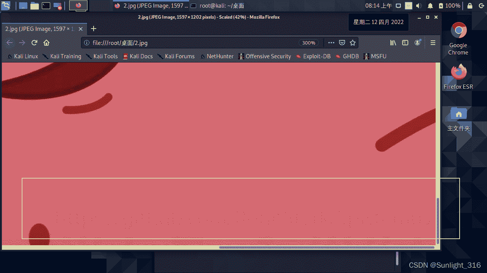

```
https: 
```

打开它，发现是github的项目，下载下来有三个文件，文本文件被识别为具有唯一字符的典型 Twitter 隐写消息
Twitter 隐写：
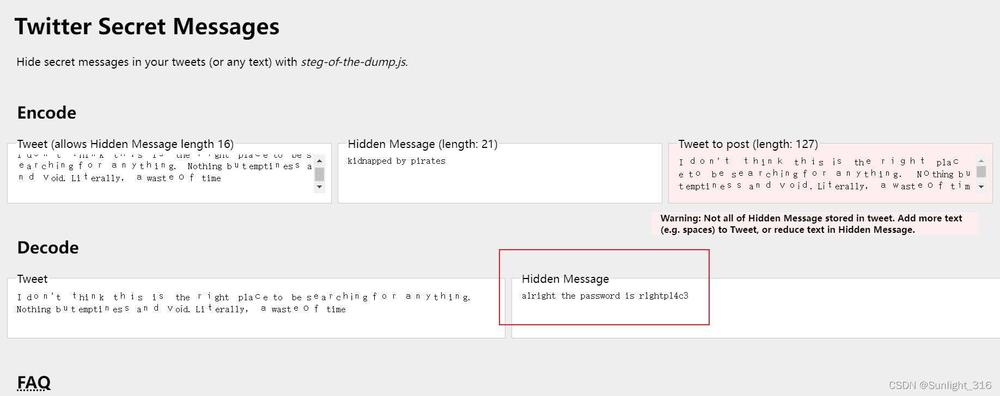所以这个就是压缩包的密码`r1ghtpl4c3`
打开压缩包发现有100多个文本文档，则用grep命令找{左括号，就可以找到flag
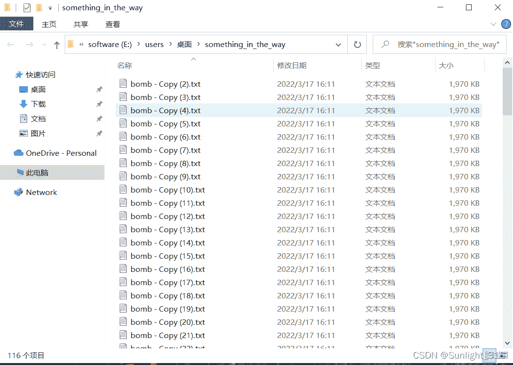

```
cat something_in_the_way/* | grep {   
flag:{th1ng$_a43_n0t_wh4t_th3y_4lw4y$_$33m} 
```


## So Forgetful!（流量包）

> 直接用networkminer打开得到password，一个base64就是flag

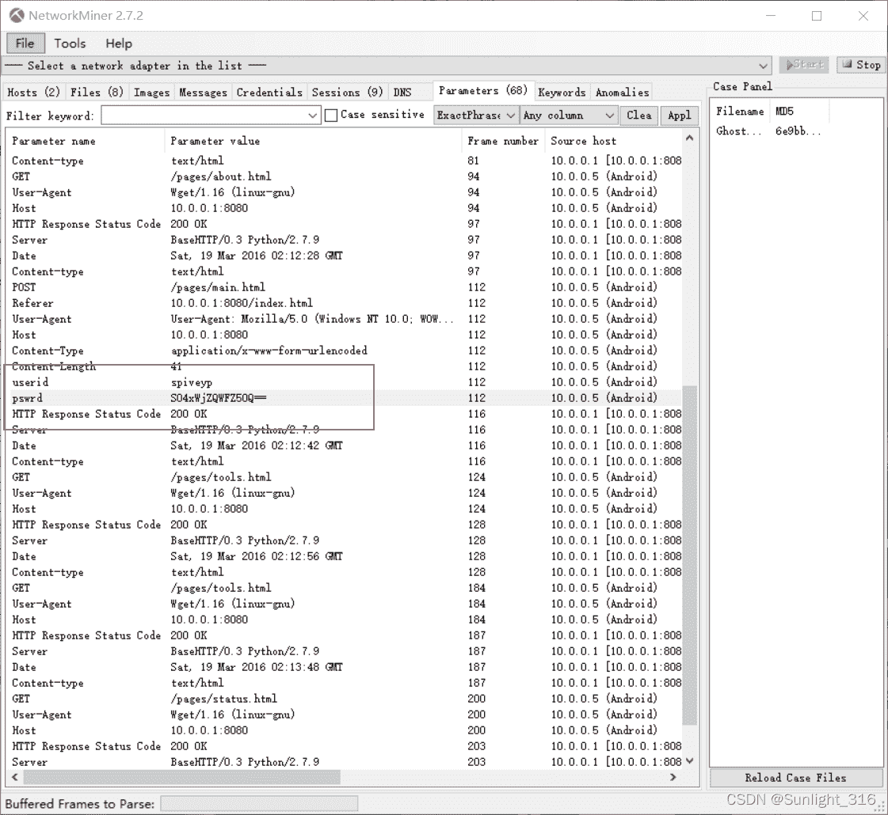

## The Last Jedi（binwalk和信息检索）

> biwalk分离一下得到一个压缩包，里面有一张图片，把图片放在010查看

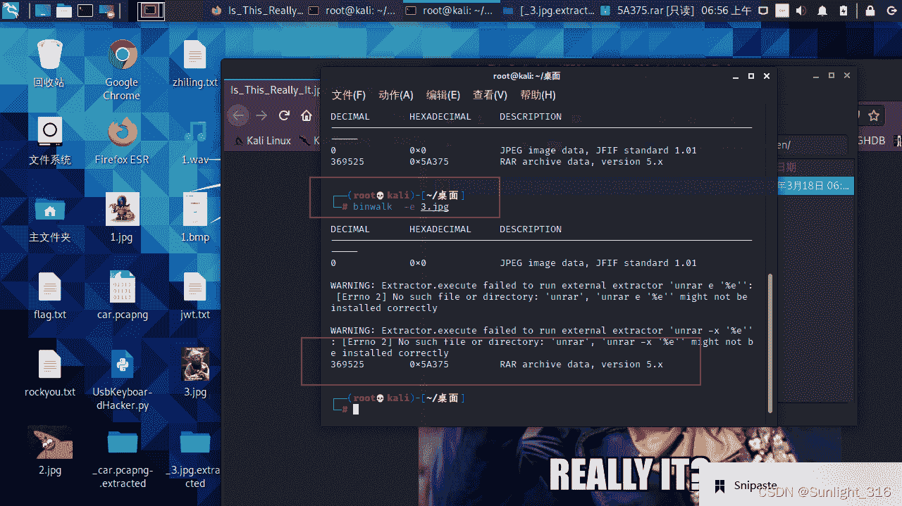

> 在文件尾部得到flag

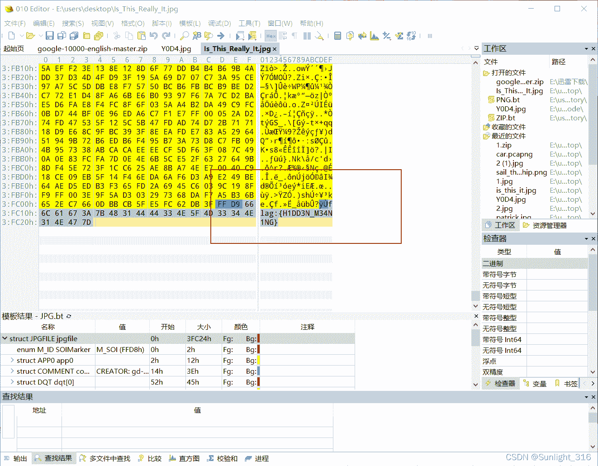

## Keep the flag high（文件头和rot47）

> 一张bmp图片，怎么都打不开，但是又有IDAT块等等，文件尾还是png文件尾，肯定是png，则添加png头得到一个二维码
> 添加的时候要注意不是直接在前面拼接头，而是把前8位替换成png头


> 得到一个新的图片：


> 用010打开次图片发现文件尾有一串异常数据，用strings命令也可得出这串字符：是rot47加密的密文

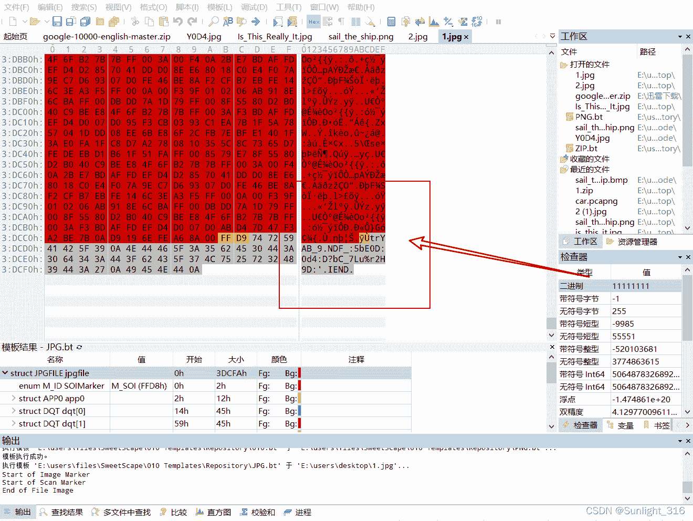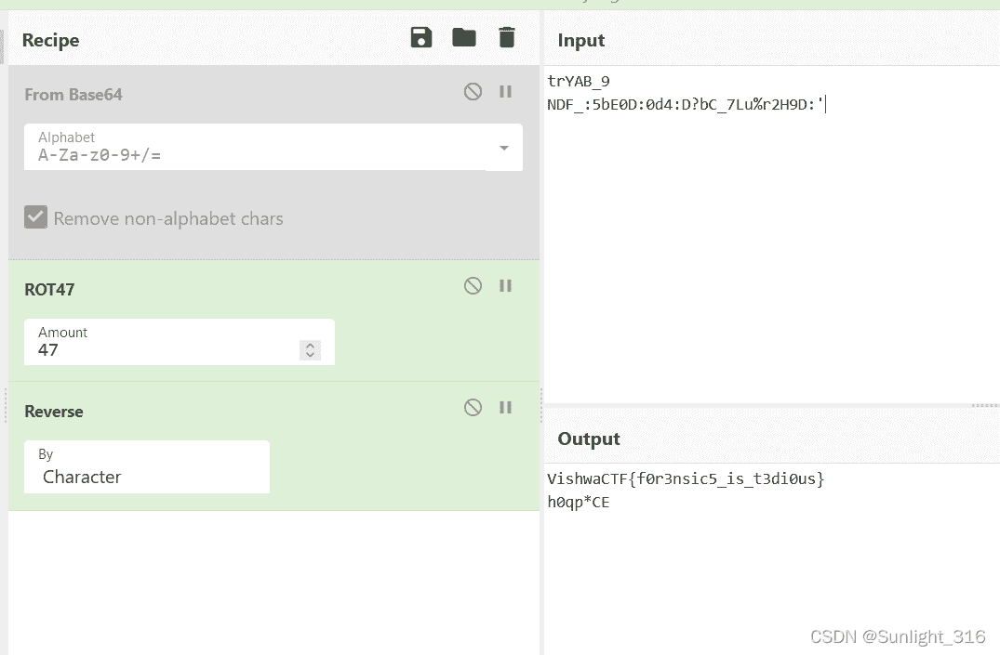

## Garfeld?（Audacity和维吉尼亚加密）

> 把频率放大到22K得到一个网址： https://pastebin.com/kTX7HTmm

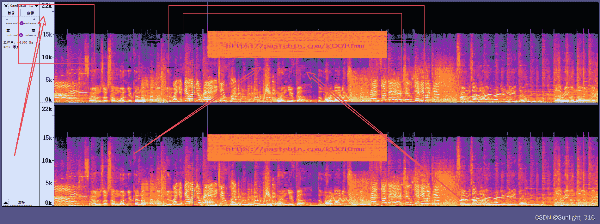

> 访问得到一串16进制数，转换一下得到一张jpg图片 010查看文件头异常，修改一下:

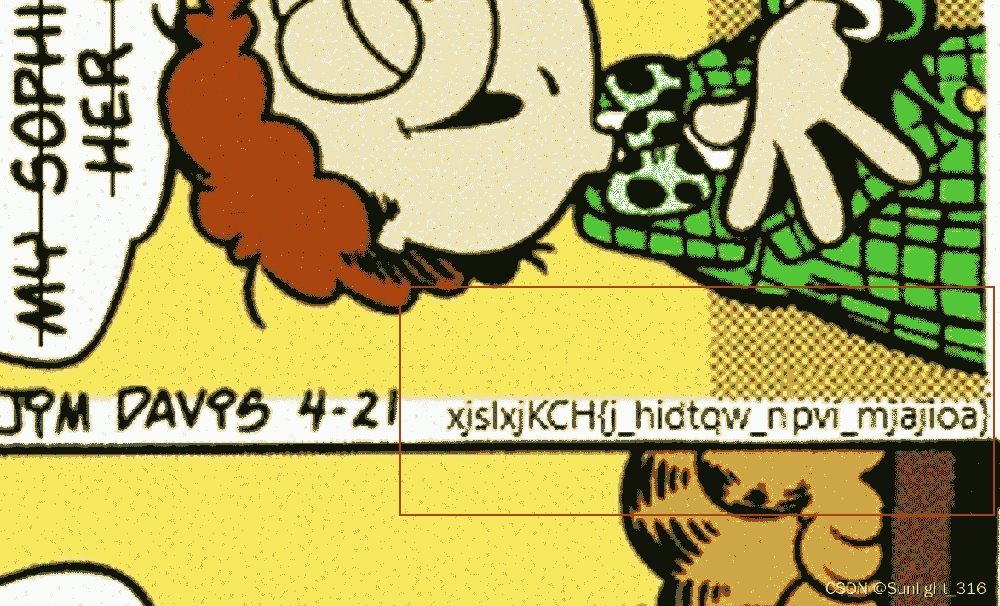套神wp：

*   得到`xjslxjKCH{j_hidtqw_npvi_mjajioa}`
*   flag格式为vishwaCTF,如果是rot那么x不可能同时代表v和w。
*   猜测变异凯撒，尝试后发现无规律
*   猜测维吉尼亚，首先用密文做密文，flag格式做key，解密得到开头为cbaebjIJC
*   将其作为key解密，得到vishwaCTF{h_gizsho_enth_mfzaafy}
*   然后**想到key的开头结尾都为C，尝试将cbaebjIJ作为key，得到flag**
    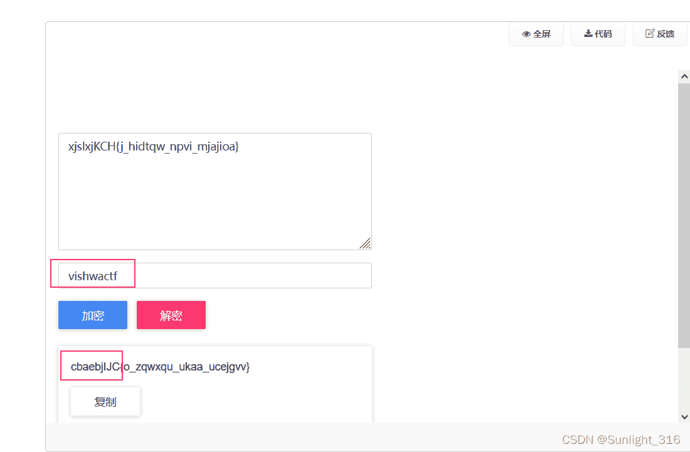
    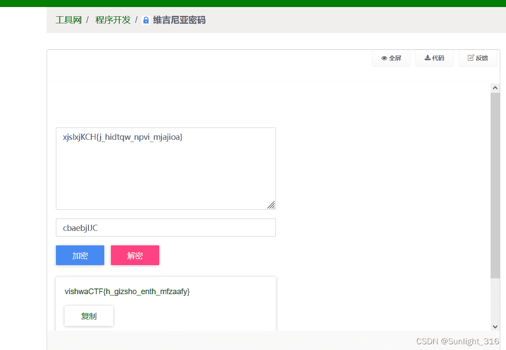