<!--yml
category: 未分类
date: 2022-04-26 14:42:55
-->

# 【二进制】【WP】MOCTF逆向题解_weixin_30684743的博客-CSDN博客

> 来源：[https://blog.csdn.net/weixin_30684743/article/details/101336980](https://blog.csdn.net/weixin_30684743/article/details/101336980)

# moctf 逆向第一题：SOEASY

这个是个 64 位的软件，OD 打不开，只能用 IDA64 打开，直接搜字符串（shift+F12）就可以看到

# moctf 逆向第二题：跳跳跳

这个题当初给了初学逆向的我很大的成就感，当时就学了改指令爆破，根本不会分析算法，这就能做出一道题还是很舒服的

打开程序，是个猜数游戏

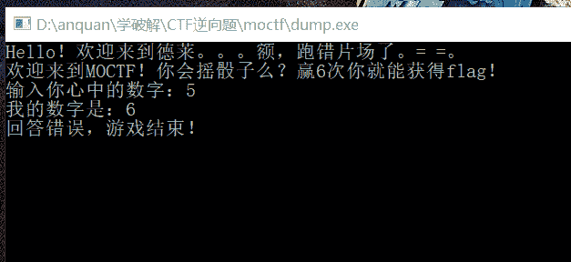

载入 OD 搜索字符串

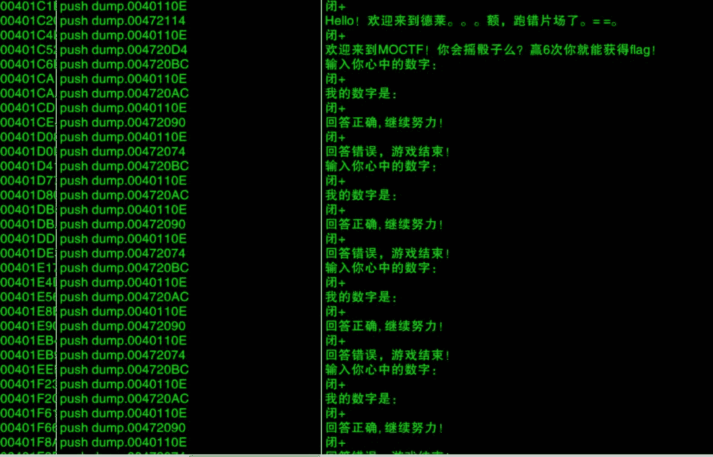

双击跟过去看看，很清晰了，那个 jnz 是关键，只要不让这个跳转实现就正确

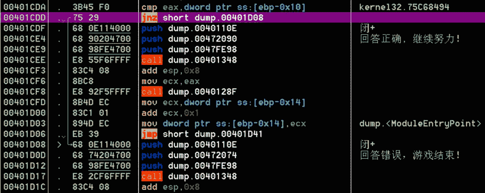

那就直接把他 NOP 掉吧

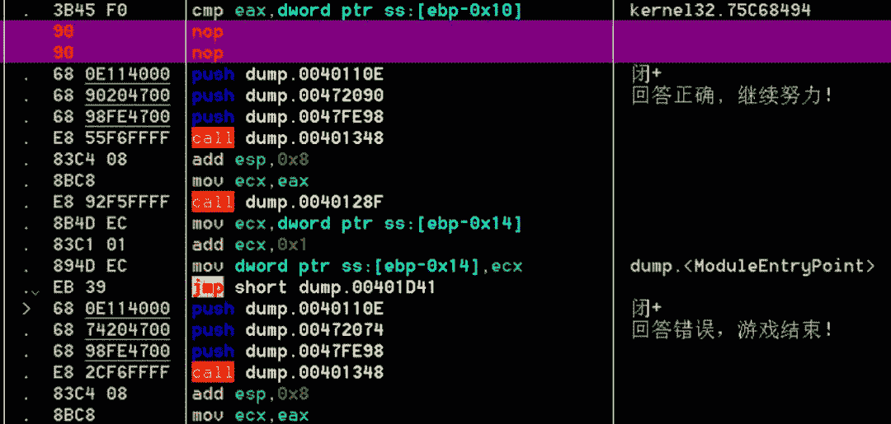

保存出来

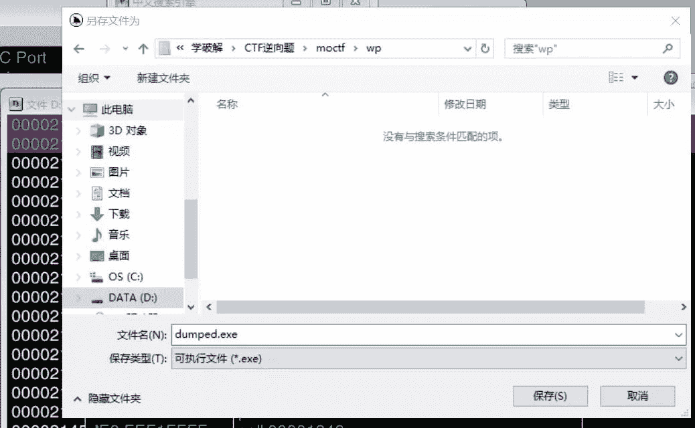

随便输入，最后还是可以成功出来 flag

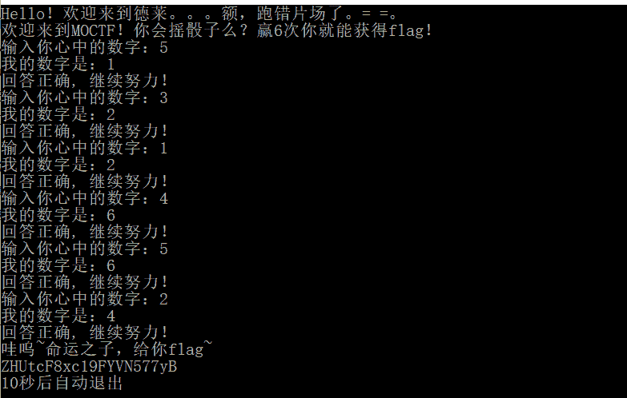

这个 falg 是 base64 加密的，之前在这里提交好多次总是不对，之后试了试才发现编码了

# moctf 逆向第三题：暗恋的苦恼

当时可是费了好大劲才看懂这个伪代码的 (不知道现在还看不看得懂)，这次用 OD 分析的还算顺利，但是也花了一个多小时……

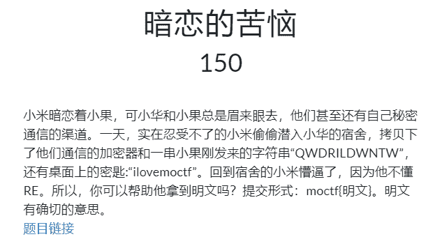

先来看一下流程：

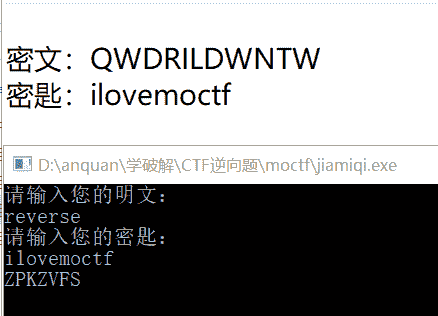

载入 OD，通过字符串找到获取输入的地方，在下图箭头所指的地方程序运行起来等待输入

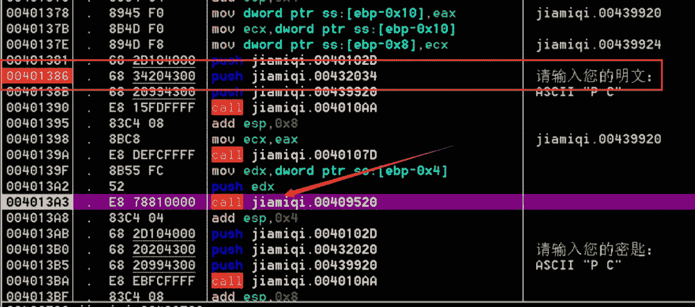

可以看到，经过一个 CALL 之后出现了加密后的字符串，那就跟进这个 CALL 看一下

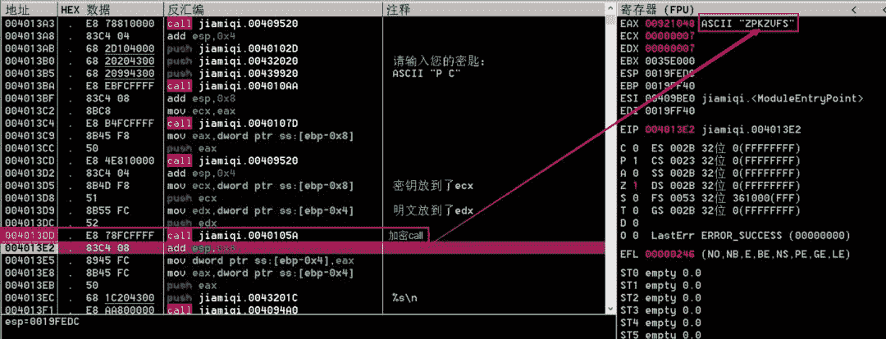

之后还得再进一个 CALL 才能发现程序算法 (程序是一个字一个字加密的刚开始会把输入的全部转换成大写)

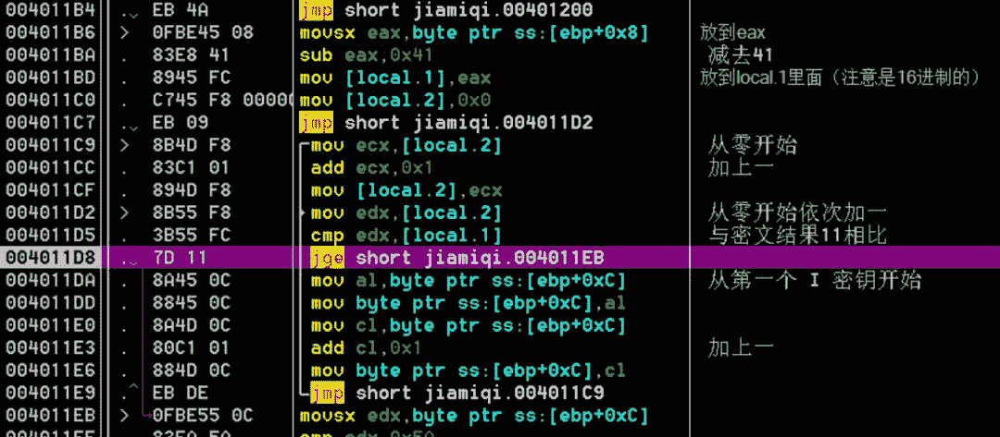

程序算法：

1\. 逐个取字符，转成大写的，然后用大写形式的 ASCII 码减去 41 (十六进制) 得到结果 (十六进制) 

2\. 然后用密钥的大写形式加上得到的结果

PS. 这里做了一些处理，如果加上以后结果超出了大写字母 Z (0x5A)，那么会再减去 19 (十六进制)

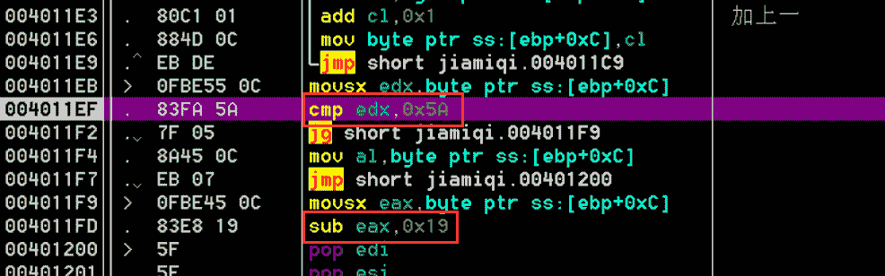

然而还有个问题，我发现给出的密文长度是比密钥长的，那怎么办？记得之前看的 writeup 说密钥循环使用的，即：ilovemoctfilovemoctf，这样一直排下去，不管多出来多少密文都可以加密

为了验证这个问题，我做了一个实验

这样输入的明文个数比密钥多一个，而且多的是与第一个一样的，我们看一下是不是按照那样循环是用的

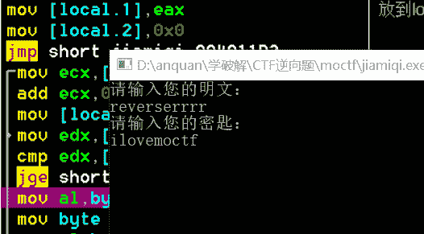

加密结果让我很欣慰，证明我记性还不错

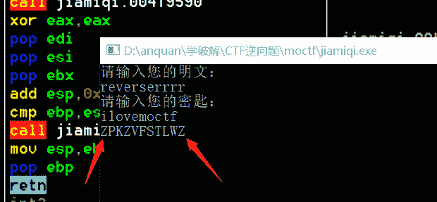

参考脚本，这或许会帮你更好的认识这个程序的流程

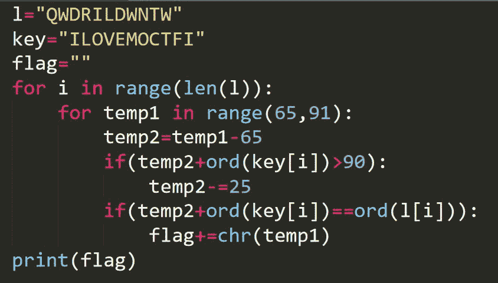

# moctf 逆向第四题：crackme1

打开后啥都不要求输入，出现一串字符，说是 flag，但是每次打开都不一样

载入 OD，通过字符串找到

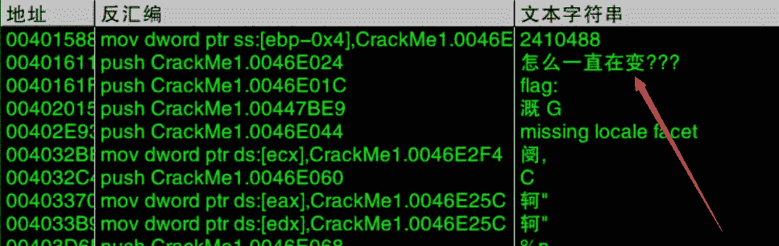

但是因为不知道该怎么分析，干脆直接段首下断，然后单步跟踪

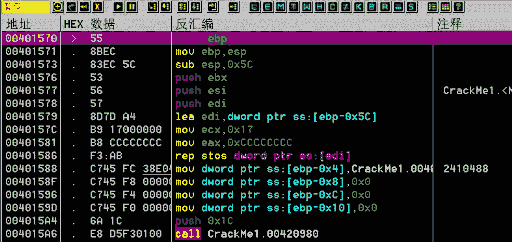

找到算法部分，算法：

1\. 逐个取定义好的 “2410488”

2\. 乘以 2 后减去 60 (十六进制)

3\. 除以 4 之后加上 3

4\. 对 10 取余，得到结果

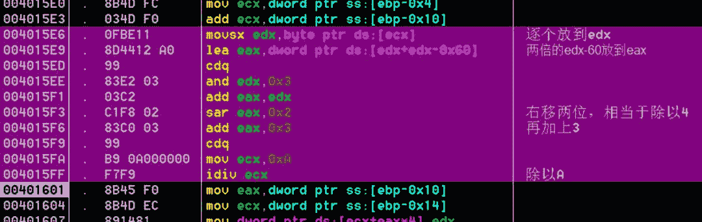

在刚开始一直不知道这里的数是怎么出来的，在心里把 [edx+edx-0x60] 当作一个地址了，后来发现，这他妈的不是存放的刚赋值的字符嘛！！

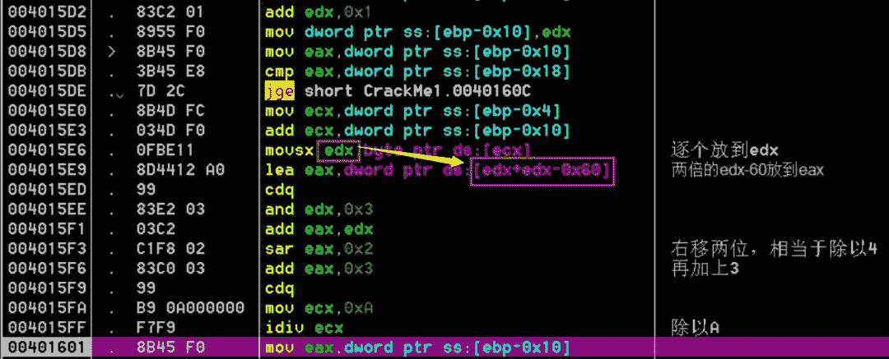

写出脚本，跑出 flag：4533577

# moctf 逆向第五题：crackme2

通过字符串定位获取输入的位置

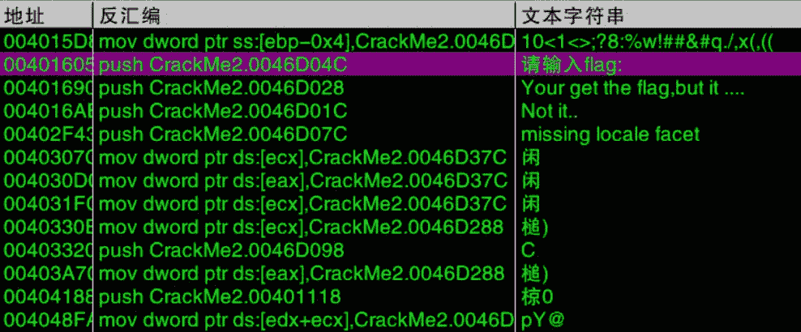

然后按步跟踪找到加密函数

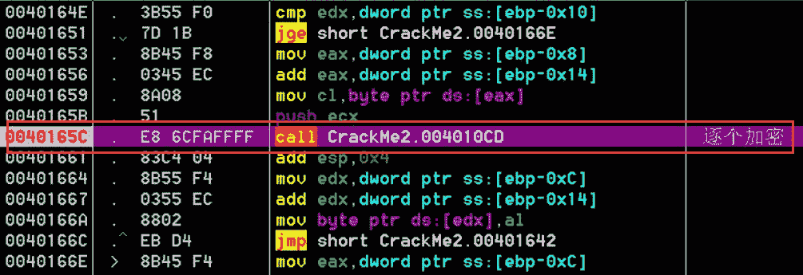

步入加密 CALL，分析算法：

1\. 依次取输入的字符串

2\. 从 6 开始，与输入的字符串进行异或

3\. 异或结果与定义好的字符串进行比较

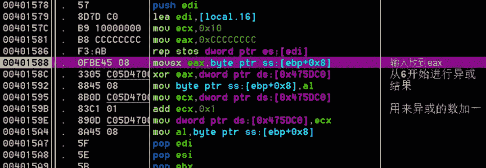

红框圈出来的是定义好的字符串

0<1<>;?8:%w!##&#q./,x(,((

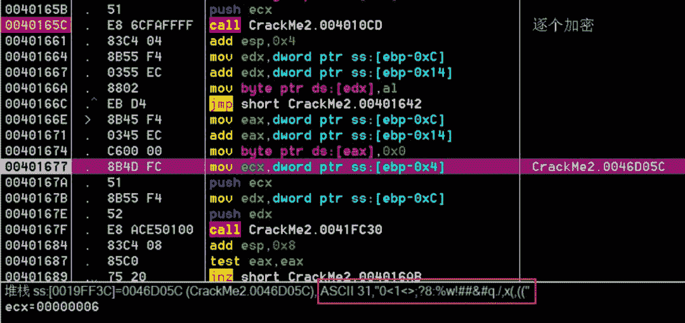

下面的那个 CALL 是进行对比的

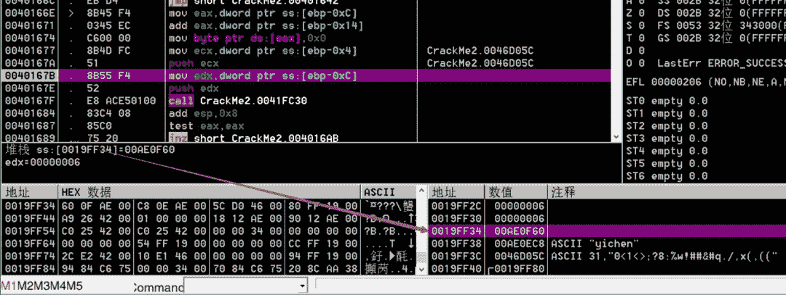

可以看到我们输入的进行加密后是 7F，而规定的应该是 31

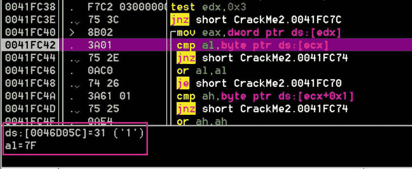

写出脚本跑出应该输入的字符串

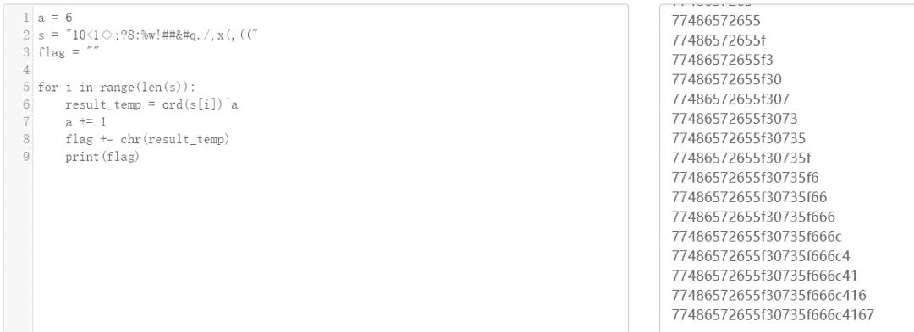

输入正确的后在进行测试，nice !!!

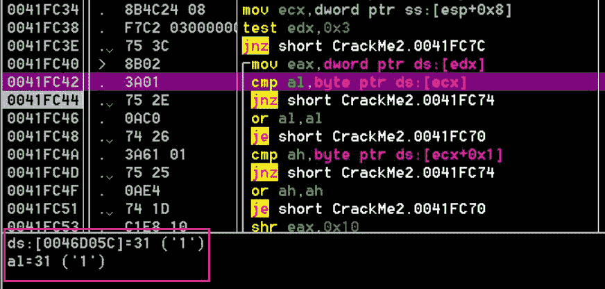

然而，这并不是 flag，需要将它转换成字符串形式

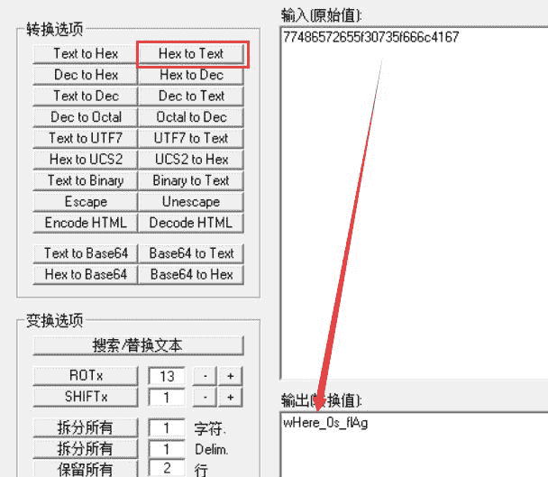

ps. 这是 N 个月前在公众号发的文章，转过来博客，主要是希望能够让更多人看见