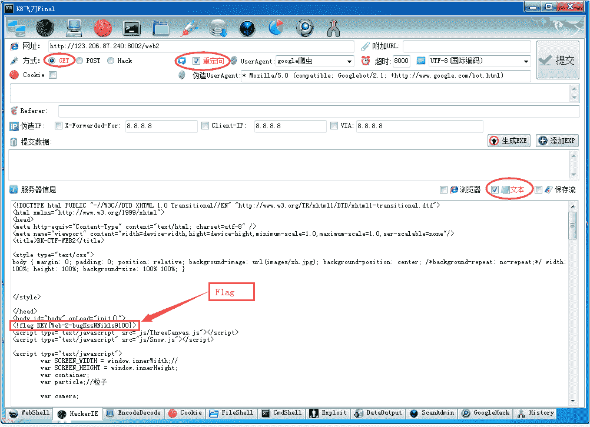
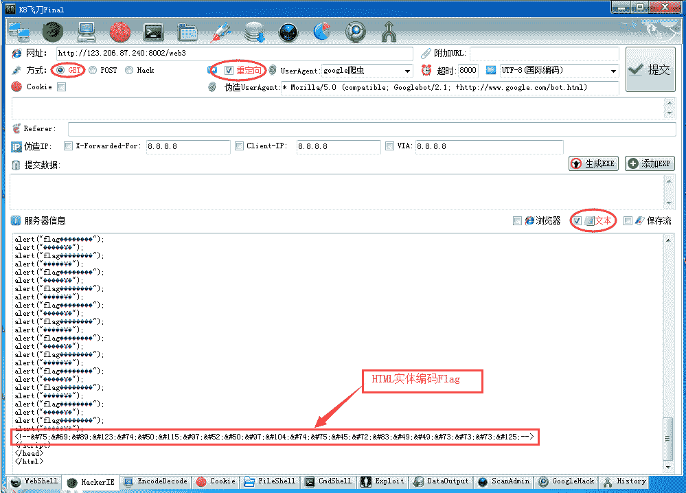
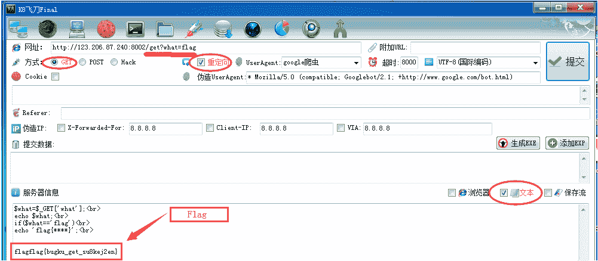
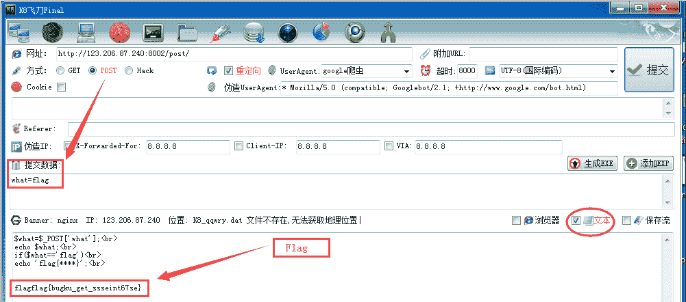
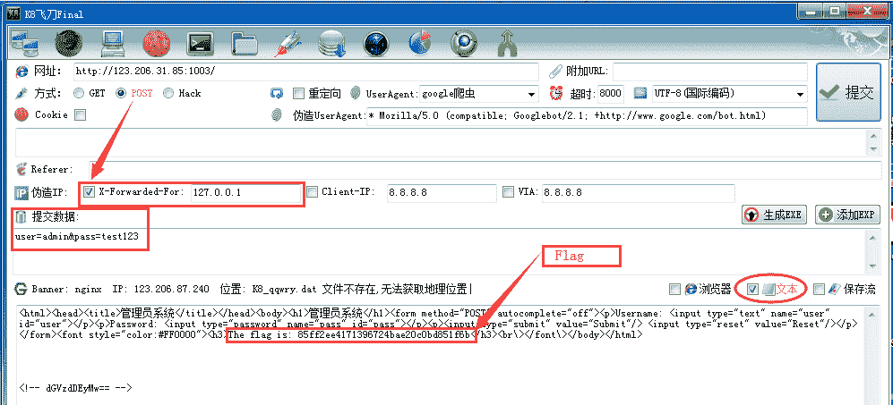
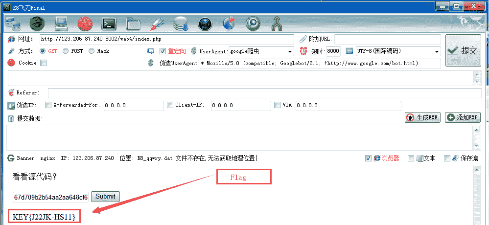
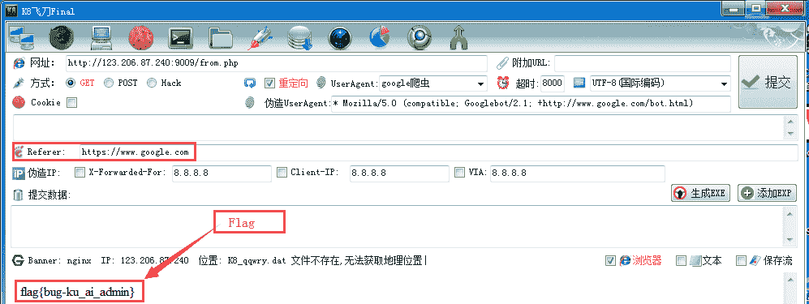
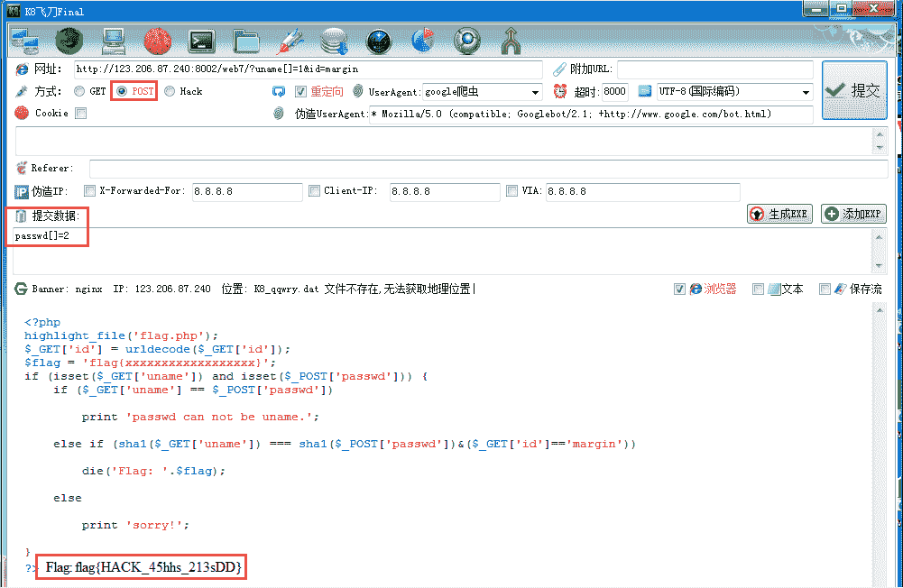
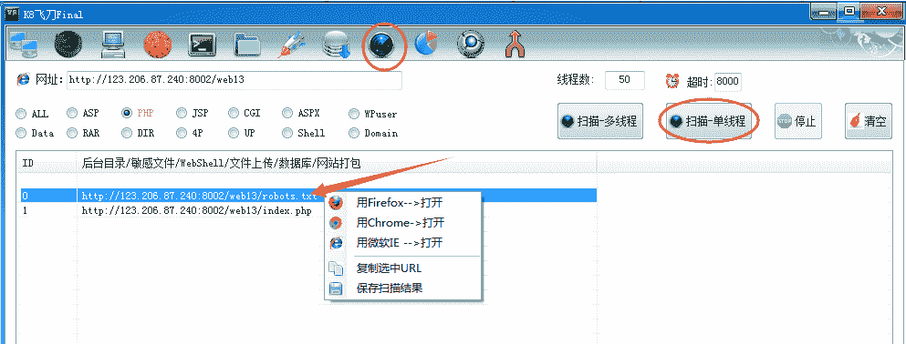
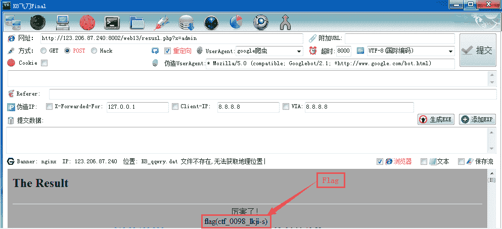

<!--yml
category: 未分类
date: 2022-04-26 14:19:07
-->

# 〖教程〗K8飞刀-网络安全CTF解题Web篇10个例子_k8gege的博客-CSDN博客

> 来源：[https://blog.csdn.net/k8gege/article/details/108178467](https://blog.csdn.net/k8gege/article/details/108178467)

前段时间有人和我说什么时候有空出些CTF用的工具，实际上CTF考查的内容，实战中用到的很多工具都可以使用，关键在于你懂不懂用。也看到有人搜索如何使用K8飞刀，在此以CTF题为例，教大家如何使用K8飞刀的HackerIE功能（相当于Hackbar插件的高级版），以及编码解码功能的使用（模块涉及多种编码以及加密解密算法），除了实战会用到以外，CTF也可以用到，不过CTF中常见的应该是BASE64、HTML编码、SQL注入编码之类的，实战中密码除了MD5、SHA1以外最常见的莫过于BASE64了，XSS里HTML编码等也会经常用到，至于什么栅栏密码之类的实战几乎很少遇到，所以有些CTF出题和实战还是两回事，虽然说栅栏算法也非常简单，但从实战角度来说，考查用处不大，实战几乎不见的有必要考吗？如同书呆子考试靠死记硬背靠运气拿高分，拿了高分实际工作解决不了新问题，这种就是没用。

### 考查知识点

1.查看HTML代码
2.GET提交
3.POST提交
4.伪造IP
5.Base64解密
6.HTML实体解密
7.PUT/MOVE漏洞
8.URL编码
9.目录扫描
10.Cookie欺骗

### 题目1 HTML查看

网址： http://123.206.87.240:8002/web2/

分析：
直接访问会看到一堆表情，浏览器右键查看HTML代码即可，（但实战遇到屏蔽右键查看就无效）

解题：

K8飞刀–HackerIE–Get方式–网址web2–结果选"文本"–提交，即可看到注释中的Flag

PS：K8飞刀可以无视”网站屏蔽查看HTML代码“功能，现实这样的网页很多，很多CTF不考查，所以CTF和实战是有区别的。

### 题目2 HTML实体

网址： http://123.206.87.240:8002/web3/

分析：
直接访问会无限弹框，提示FLAG就在这里，所以这里我们选择"文本"模式查看，浏览器模式会无限弹框。

解题：

K8飞刀–HackerIE–Get方式–网址web3–结果选"文本"–提交，看到一串可疑的HTML实体字符串，
编码解码–粘贴加密的Flag–右键选中Flag–编码转换–XSS跨站–HTML实体(Dec),解密获取Falg

PS：有些CTF也会把HTML实体编码放在图片里面(记事本打开图片就能看到)

### 题目3 GET提交

网址：http://123.206.87.240:8002/get/

w h a t = what= what=_GET[‘what’];

echo w h a t ; < b r > i f ( what;  if( what; if(what==‘flag’)

echo ‘flag{****}’; 

分析：
从页面代码看出，要求通过GET方式提交what=flag

解题：
网址 http://123.206.87.240:8002/get?what=flag
K8飞刀–HackerIE–Get方式–网址get–结果选"文本"–提交，可看到返回flag

### 题目4 POST提交

网址: http://123.206.87.240:8002/post/

w h a t = what= what=_POST[‘what’];

echo w h a t ; < b r > i f ( what;  if( what; if(what==‘flag’)

echo ‘flag{****}’; 

分析：
从页面代码看出，要求通过GET方式提交what=flag

解题：
K8飞刀–HackerIE–Post方式–网址post–结果选"文本"–提交，可看到返回flag
网址：http://123.206.87.240:8002/post/ 提交数据：what=flag

### 题目5 伪造IP

伪造IP这个考查点非常不错，因为现实中确实有很多网站后台存在IP限制。

网址：http://123.206.31.85:1003/ 管理员系统

使用K8飞刀访问提示“IP禁止访问”，切换文本看到注释中含有Base64字符串,编码解密得到test123

K8飞刀–HackerIE–Post方式–提交,返回Flag
提交数据：user=admin&pass=test123

X-Forwarded-For 值为 127.0.0.1

### 题目6 PUT漏洞

这里没找到在线的题(也懒得找),有些CTF可能会考查PUT写权限漏洞，实战也是一个很经典的漏洞，如IIS6写权限GetShell或Tomcat CVE-2017-12615，实际上如果Apache或Ngix配置不当也可以通过PUT直接GetShell的，但该功能飞刀里没有，需使用LadonExp才可实现。

遇到的话可参考
http://k8gege.org/Ladon/iisput
https://github.com/k8gege/K8CScan/tree/master/Video

### 题目7 URL编码

网址：http://123.206.87.240:8002/web4

访问看到几个URL编码的变量，那就解密看看吧

复制使用K8飞刀解密后得到Value值

提交后得到Flag

### 题目8 cookie欺骗

访问 http://123.206.87.240:8002/web11/ 会跳转到以下地址
http://123.206.87.240:8002/web11/index.php?line=&filename=a2V5cy50eHQ=
Cookie: margin=margin

解题：K8飞刀–HackerIE–设置Cookie提交即可

### 题目9 Referer来源

分析：访问提示，are you from google? 在URL里来源为Referer

http://123.206.87.240:9009/from.php

解题：K8飞刀设置Referer为google即可
Referer: https://www.google.com

### 题目9 PHP post

http://123.206.87.240:8002/web7/?uname[]=1&id=margin
post：passwd[]=2

### 题目10 目录扫描

http://123.206.87.240:8002/web13/
404 Not Found

分析：访问提示404，本页不存在，那我们扫目录看有哪些页面可访问

K8扫到robots.txt访问发现result.php,下面提示x=密码就出现flag

http://123.206.87.240:8002/web13/resusl.php?x=admin

### 解题速度

天下武功唯快不破，只有解题速度快，才有机会做更多的题，同样能全解的情况下，自然也是速度快的拿第一。

网上有不少教程对于，PUT提交或IP这种简单修改使用BURP来解题，这个也没什么问题，问题在于有些人并不熟悉相关工具。最怕的是你也熟悉该工具，但打CTF时，环境因素或自己不细心少了哪一步，会浪费掉很多时间，我们都知道如果几分钟就能把前面简单的FLAG提交，那么就会有更多的时间去解难题拿更高分。所以对于考查HTTP参数提交的知识点，可以完全使用K8飞刀或LadonExp这种一键的工具，不要使用Burp这种步骤多的工具，钥题时间越快对你越有利。实战也是一样，你早一天拿到目标，和只做到一半就被发现然后管理员打补丁，没办法再通过该漏洞GetShell甚至也无其它漏洞时你就知道错了。如果你多次提交失败管理员还是没发现，只能说明他很蠢，你运气好可以随便搞。

### 考查漏洞

对于一些更贴近实战的题，比如直接考查相关漏洞的，也可直接使用K8飞刀的漏洞库上的EXP进行测试，很简单只需提供URL即可一键利用。当然里面的EXP可能比较老，如果考查的漏洞里面没有，那只能换上其它针对性的工具。

### 工具下载

http://k8gege.org/Download