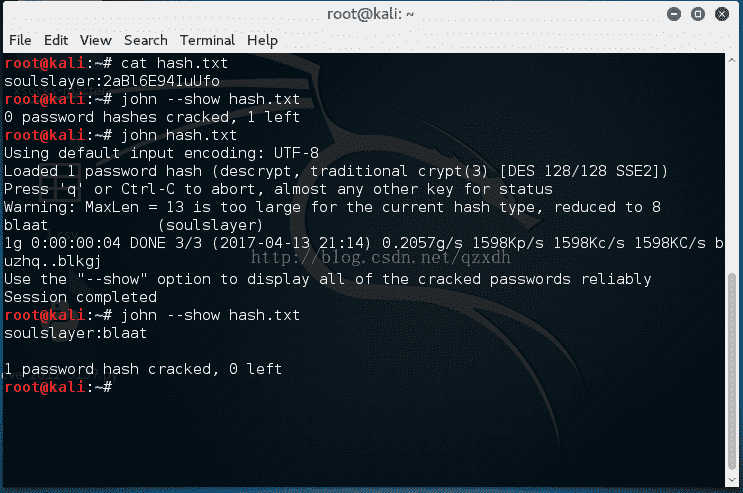

<!--yml
category: 未分类
date: 2022-04-26 14:37:57
-->

# 一个ctf题目解析，关于des(unix)解密_qzxdh的博客-CSDN博客_ctf des

> 来源：[https://blog.csdn.net/qzxdh/article/details/70168437](https://blog.csdn.net/qzxdh/article/details/70168437)

题目在https://www.net-force.nl/challenge/level103/

查看源文件soulslayer:2aBl6E94IuUfo

密文为13位

利用john可破解

