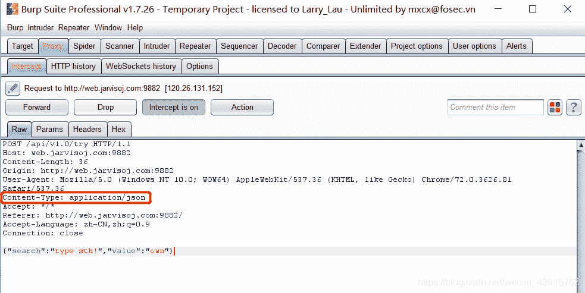
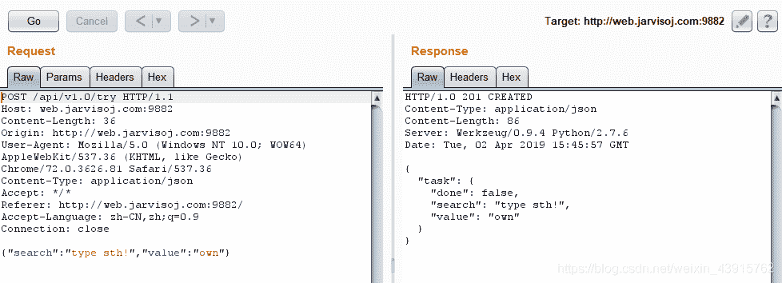
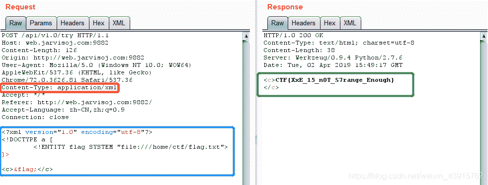

<!--yml
category: 未分类
date: 2022-04-26 14:48:59
-->

# 一道关于 XML 实体注入的 CTF题_YT--98的博客-CSDN博客_ctf xml注入

> 来源：[https://blog.csdn.net/weixin_43915762/article/details/88984470](https://blog.csdn.net/weixin_43915762/article/details/88984470)

###### 目标：获取目标及其 /home/ctf/flag.txt 中的 flag 值

* * *

##### 1\. 先通过抓包查看请求包

可以看到，Content-Type 是通过 JSON 来传送的。**若将传送的数据格式改为 XML，那么有可能服务器就会解析上传的 XML 脚本**来干一些不可描述的事情。

##### 2\. 将数据包发送到 Repeater 中进行测试。

##### 3\. 修改 Content-Type 的头部，并将数据内容改为构造的 XML ，来获取想要的信息

成功获取到信息。