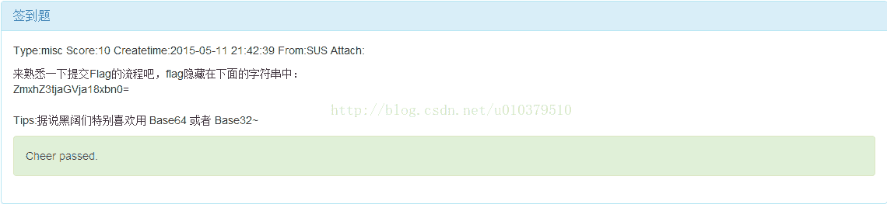

<!--yml
category: 未分类
date: 2022-04-26 14:45:34
-->

# 东南大学CTF之签到题_以夕阳落款的博客-CSDN博客_签到题解题思路ctf

> 来源：[https://blog.csdn.net/u010379510/article/details/45891229](https://blog.csdn.net/u010379510/article/details/45891229)

题目：

热身题，分值10分，一眼看就是base64，解码，得到flag{check_1n}，完成