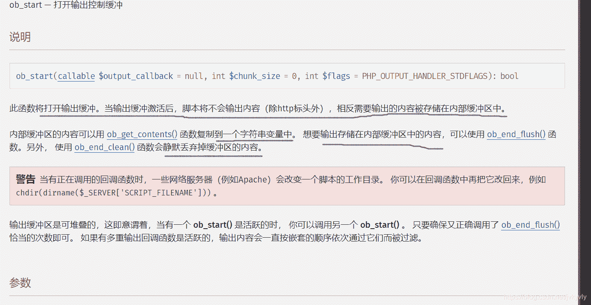
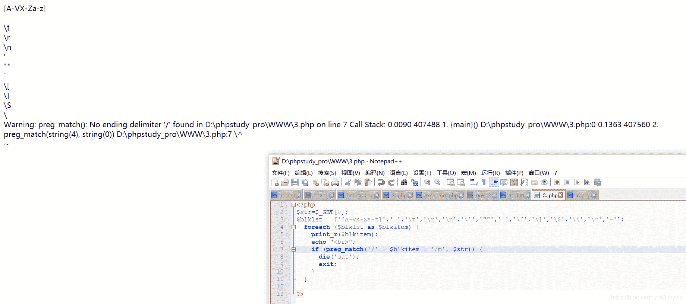
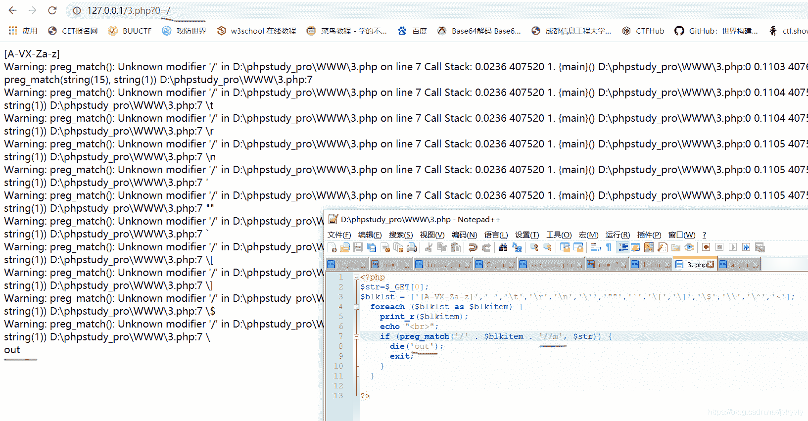

<!--yml
category: 未分类
date: 2022-04-26 14:51:17
-->

# 从一道CTF的非预期解看PHP反斜杠匹配问题_Je3Z的博客-CSDN博客

> 来源：[https://blog.csdn.net/jvkyvly/article/details/119036661](https://blog.csdn.net/jvkyvly/article/details/119036661)

主要是记录一下这个，然后题是 **国赛华南半决赛的Magicchar**

```
<?php
error_reporting(0);
include'flag.php';
function Magic($str){

  for($i=0; $i<=strlen($str)-1; $i++) {

    if ((ord($str[$i])<32) or (ord($str[$i])>126)) {
      die('sorry');
      exit;
    }

  }

  $blklst = ['[A-VX-Za-z]',' ','\t','\r','\n','\'','""','`','\[','\]','\$','\\','\^','~'];
  foreach ($blklst as $blkitem) {
    if (preg_match('/' . $blkitem . '/m', $str)) {
      die('out');
      exit;
    }
  }
}
if(!isset($_GET['yell'])) {
  show_source(__FILE__);
} else {
  $str = $_GET['yell'];
  Magic($str);
  ob_start();
  $res = eval("echo " . $str . ";");
  $out = ob_get_contents();
  ob_end_clean();
  if ($out === "Wa4nn") {
      echo $flag;
  } else {
    echo htmlspecialchars($out, ENT_QUOTES);
  }
}
?> 
```


预期解应该是：`?yell="W".("!"|"@")."4".("."|"@").("."|"@")`
非预期解：`?yell="W\1414\156\156"`
用双引号是因为eval那字符串拼接

然后主讲是非预期解

```
$blklst = ['[A-VX-Za-z]',' ','\t','\r','\n','\'','""','`','\[','\]','\$','\\','\^','~'];
  foreach ($blklst as $blkitem) {
    if (preg_match('/' . $blkitem . '/m', $str)) {
      die('out');
      exit; 
```

这个正则是有问题的，就是`'\\'`那，看似过滤了`'\'`确实是一个错误的写法，而且根本没过滤`'\'`，要写过滤`'\'`，应该是`'\\\\'`

```
因为'\\\\'先会经过php解析一次转义，变成'\\',然后再到正则里面再解析转义成最后的'\' 从而匹配 '\' 
```

而像`'\\'`不注意的话，很容易偏离最初的用意，像 安洵杯2019easy_web那题就是因为过滤反斜杠 `|\\|\\\\|` 这里的时候正则没有写好，这个正则就变成了匹配`|\`

而这题这个正则也是，到没有影响到其他的正则，就`'\\'`这是会报错的，这个报错是因为把正则右边的`'/'`给转义了

我们右边阔以再加一个`'/'`测试一下

发现确实是这样

然后再分享一篇文章，写得非常好[从一道CTF的非预期解看PHP反斜杠匹配问题](https://www.jianshu.com/p/076c5b422c96)