<!--yml
category: 未分类
date: 2022-04-26 14:35:41
-->

# 信息安全web入门——南邮ctf解题_sevenlob的博客-CSDN博客_南邮ctf

> 来源：[https://blog.csdn.net/sevenlob/article/details/103987096](https://blog.csdn.net/sevenlob/article/details/103987096)

# 南京邮电大学ctf——web

## 签到题

查看源码
鼠标右键查看源码或ctrl+u

## md5 collision

题目给出源码

```
<?php
$md51 = md5('QNKCDZO');
$a = @$_GET['a'];
$md52 = @md5($a);
if(isset($a)){
if ($a != 'QNKCDZO' && $md51 == $md52) {
    echo "nctf{*****************}";
} else {
    echo "false!!!";
}}
else{echo "please input a";}
?> 
```

### 弱类型

等于号 == 在进行比较的时候，会先将**字符串类型转化成相同**，再比较。
如果比较一个数字和字符串或者涉及到数字内容的字符串，则字符串会被转换成数值并且比较按照常数值进行比较

等于号 === 在进行比较的时候，会**先判断两种字符串的类型是否相等**，再比较。

```
在比较$a==$b

$a=' ';$b=null        

$a=null;$b=true      

$a=0;$b='0'       

$a=0;$b='abcdef'  

$a=1;$b='1abcdef' 

$a=1;$b='abcdef1' 

$a=0;$b='abcdef1' 

0e123=0e456 

0=='abcdef' 
```

**为0e开头的会被识别为科学记数法，结果均为0**

弱类型总结参考
[php弱类型shian总结 梁十安](https://www.cnblogs.com/liangxiyang/p/10925792.html)

[php弱类型总结](https://www.cnblogs.com/Mrsm1th/p/6745532.html)

### @错误控制操作符

在PHP中，@被称为错误控制操作符(error control operator)，前置@符号的表达式产生的任何错误都将被忽略。

### isset()

isset — 检测变量是否已设置并且非 NULL,返回true或false

### MD5——哈希算法

语法
md5(string,raw)

| 参数 | 描述 |
| --- | --- |
| string | 必需。规定要计算的字符串。 |
| raw | 可选。规定十六进制或二进制输出格式： |

规定十六进制或二进制输出格式：
TRUE - 原始 16 字符二进制格式
FALSE - 默认。32 字符十六进制数

[php md5（）函数 w3school](https://www.w3school.com.cn/php/func_string_md5.asp)
[PHP的md5（）函数 | 菜鸟教程](https://www.runoob.com/php/func-string-md5.html)

部分md5函数0e开头的值

| string(strlen($var)) $var | string(strlen(md5($ var))) md5($var) |
| --- | --- |
| s878926199a | 0e545993274517709034328855841020 |
| s155964671a | 0e342768416822451524974117254469 |
| s214587387a | 0e848240448830537924465865611904 |
| s214587387a | 0e848240448830537924465865611904 |
| s878926199a | 0e545993274517709034328855841020 |
| s1091221200a | 0e940624217856561557816327384675 |
| s1885207154a | 0e509367213418206700842008763514 |
| s1502113478a | 0e861580163291561247404381396064 |
| s1885207154a | 0e509367213418206700842008763514 |
| s1836677006a | 0e481036490867661113260034900752 |
| s155964671a | 0e342768416822451524974117254469 |
| s1184209335a | 0e072485820392773389523109082030 |
| s1665632922a | 0e731198061491163073197128363787 |
| s1502113478a | 0e861580163291561247404381396064 |
| s1836677006a | 0e481036490867661113260034900752 |
| s1091221200a | 0e940624217856561557816327384675 |
| s155964671a | 0e342768416822451524974117254469 |
| QNKCDZO | 0e830400451993494058024219903391 |
| 240610708 | 0e462097431906509019562988736854 |

### 题目分析

```
$md51 = md5('QNKCDZO');

$a = @$_GET['a'];

$md52 = @md5($a);

if(isset($a)){

if ($a != 'QNKCDZO' && $md51 == $md52) { 

    echo "nctf{*****************}";
} else {
    echo "false!!!";
}}
else{echo "please input a";} 
```

## 签到提2

网址打开要求输入zhimakaimen获得答案，但输入zhimakaimen时仍然显示“尚未登陆或口令错误”，Ctrl+u查看网页代码

```
 <html>
<meta http-equiv="Content-Type" content="text/html; charset=UTF-8" />
尚未登录或口令错误<form action="./index.php" method="post">
	<p>输入框：<input type="password" value="" name="text1" maxlength="10"><br>
	请输入口令：zhimakaimen
	<input type="submit" value="开门">
</form>

</html> 
```

发现输入框的最大输入长度为10（maxlength=10），则修改maxlength即可输入成功。

F12打开开发者工具调试界面
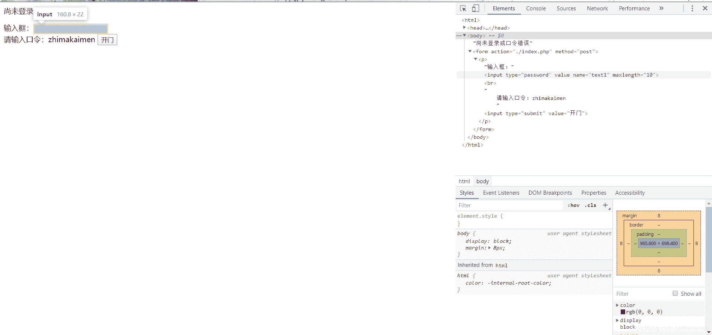
修改maxlength

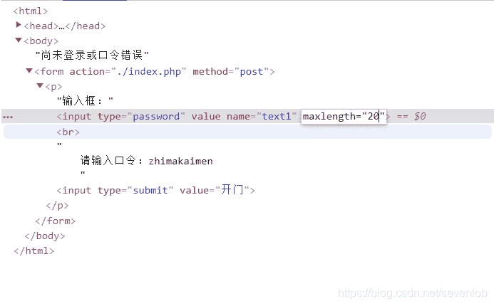
再次输入maxlength即可得到答案

## 这题不是WEB

**（建议在谷歌浏览器或火狐浏览器中打开，咋子Microsoft Edge中打开会显示乱码）**

打开页面，出现了一只一直在吃奥利奥的猫。
**你是在坑我？**

啥头绪也没有，看源码也找不到什么东西。

然后就百度了一下，把图片下载下来，然后用notepad++打开，在文件最后可以找到答案。
看来还真的不是web题。。。

## 层层递进

打开网页看源码，咋一看没什么特别，但有一个SO.html

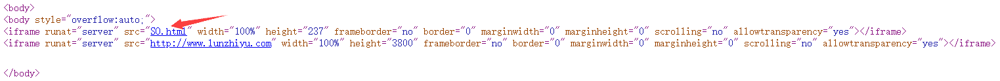
打开是半截之前的网页，源码中又有SO.html，如此几次，最后在SO.html的位置上有一个404.html，打开，答案就藏在一大串注释里

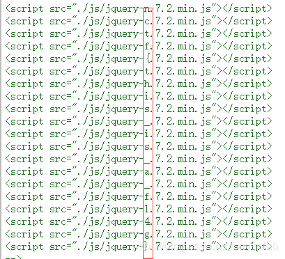
害，真的是有点麻烦

## AAencode

### Unicode

Unicode（统一码、万国码、单一码）是计算机科学领域里的一项业界标准，包括字符集、编码方案等。Unicode 是为了解决传统的字符编码方案的局限而产生的，它为每种语言中的每个字符设定了统一并且唯一的二进制编码，以满足跨语言、跨平台进行文本转换、处理的要求。

### AAencode

将JavaScript代码转换成常用的网络表情颜文字

### 题目分析

火狐打开，Alt调出菜单栏，文字编码跳到Unicode。

转码之后就是颜文字，之前有一个错误要改一下，但是现在好像看不到了，然后直接F12控制台run就出答案了

## 单身二十年

~~我就觉得这道题是在讽刺我~~
打开题目网页的时候，有东西一闪而过，所以就burpsuit抓包了。
先改代理，然后点开截包

就可以在burpsuit中找到一个search_key.php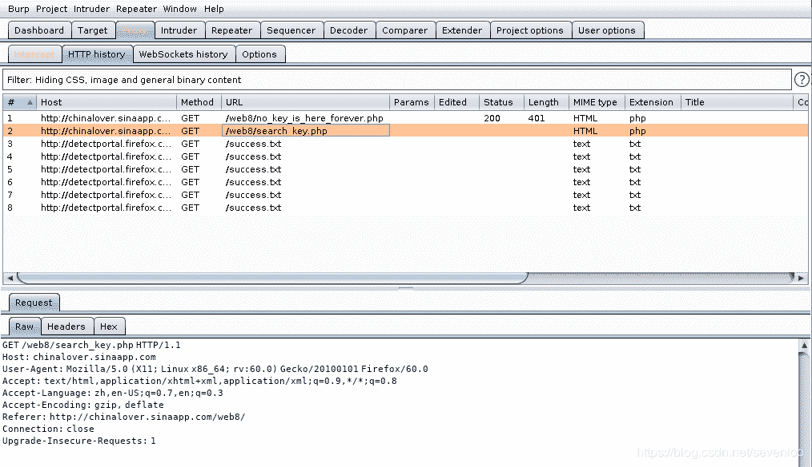
送到repeater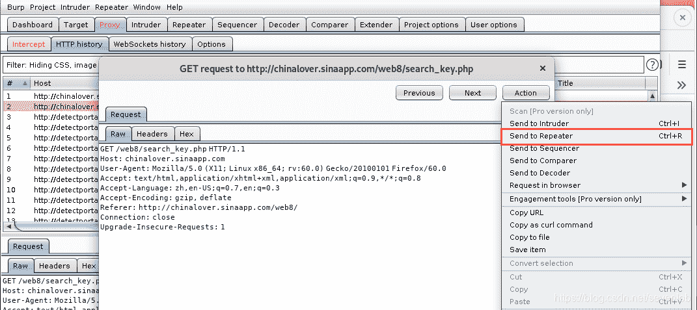
send一下就有答案了
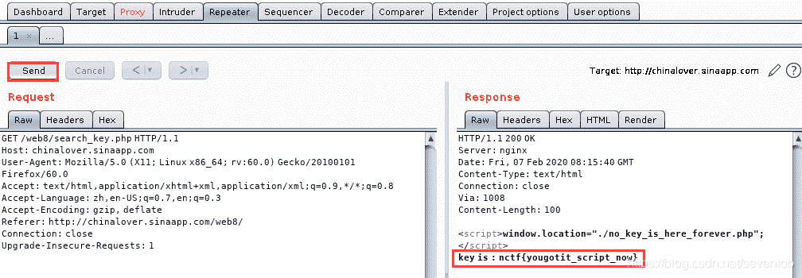
千万不要点了“到这里找key“之后才抓包，不然是找不到search_key.php的

## php decode

t题目给了一段PHP代码

```
<?php
function CLsI($ZzvSWE) {

    $ZzvSWE = gzinflate(base64_decode($ZzvSWE));

    for ($i = 0; $i < strlen($ZzvSWE); $i++) {

        $ZzvSWE[$i] = chr(ord($ZzvSWE[$i]) - 1);

    }

    return $ZzvSWE;

}
eval(CLsI("+7DnQGFmYVZ+eoGmlg0fd3puUoZ1fkppek1GdVZhQnJSSZq5aUImGNQBAA=="));
?> 
```

就想着把这一段放在编译器当中跑一下
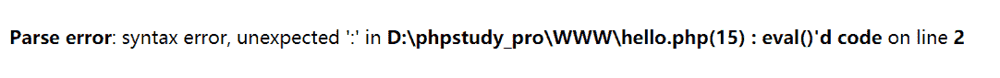
但是会报错，所以我返回去看了一下这段代码。**因为CLsI()函数返回的是一串字符串，而eval()函数是执行函数，所以将eval改为echo就行。**换了之后再跑一次就有答案了。
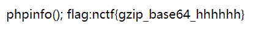

## 文件包含

毫无头绪，LFI是啥子鬼，所以我去查了一下

### LFI漏洞

主要参考了
[php://filter的使用 来着_warning_的博客](https://blog.csdn.net/destiny1507/article/details/82347371)
和
[谈一谈php://filter的用处 来自PHITHON的博客](https://www.leavesongs.com/PENETRATION/php-filter-magic.html)

本地文件包含（Local File Include）
把具有某一功能的函数写在一个独立的php文档中，当某一文件需要时直接调用该函数文档。由于程序员未对用户可控变量的输入进行检查，导致用户可以控制被包含的文件，成功利用时可以使web server将特定文件当成php执行，从而导致用户获取颐一定的服务器权限。

### php://filter协议

php://filter 是php中独有的一个协议，可以作为一个中间流来处理其他流，可以进行任意文件的读取；根据名字，filter，可以很容易想到这个协议可以用来过滤一些东西。
使用不同的参数可以达到不同的目的和效果：

| 名称 | 用法 | 备注 |
| --- | --- | --- |
| resource=<要过滤的数据流> | 指定了你要筛选过滤的数据流。 必选 |  |
| read=<读链的筛选列表> | 可以设定一个或多个过滤器名称，以管道符（ 竖线）分隔。 | 可选 |
| write=<写链的筛选列表> | 可以设定一个或多个过滤器名称，以管道符（竖线）分隔。 | 可选 |
| <；两个链的筛选列表> | 任何没有以 read= 或 write= 作前缀 的筛选器列表会视情况应用于读或写链。 |  |

### 题目分析

这个题真不知道该怎么做，在网上大概找了解题方法

使用这个payload直接读取index.php的源码
**http://4.chinalover.sinaapp.com/web7/index.php?file=php://filter/read=convert.base64-encode/resource=index.php**
这个东西用了一个php://filter这个协议，大致作用是使用php://filter协议以base64加密的方法输出网页中的全部内容，但是要怎么样输出不带加密，简单删掉部分语句是不行的，具体怎么弄我也不知道[手动狗头]

得到结果base64加密过的index.php的源码

```
PGh0bWw+CiAgICA8dGl0bGU+YXNkZjwvdGl0bGU+CiAgICAKPD9waHAKCWVycm9yX3JlcG9ydGluZygwKTsKCWlmKCEkX0dFVFtmaWxlXSl7ZWNobyAnPGEgaHJlZj0iLi9pbmRleC5waHA/ZmlsZT1zaG93LnBocCI+Y2xpY2sgbWU/IG5vPC9hPic7fQoJJGZpbGU9JF9HRVRbJ2ZpbGUnXTsKCWlmKHN0cnN0cigkZmlsZSwiLi4vIil8fHN0cmlzdHIoJGZpbGUsICJ0cCIpfHxzdHJpc3RyKCRmaWxlLCJpbnB1dCIpfHxzdHJpc3RyKCRmaWxlLCJkYXRhIikpewoJCWVjaG8gIk9oIG5vISI7CgkJZXhpdCgpOwoJfQoJaW5jbHVkZSgkZmlsZSk7IAovL2ZsYWc6bmN0ZntlZHVsY25pX2VsaWZfbGFjb2xfc2lfc2lodH0KCj8+CjwvaHRtbD4= 
```

然后把它解码，可以在在线工具网站解码，也可以用语言函数解码，这里可以使用python

```
import base64

str = "base64的值"
plantext = base64.b64decode(str).decode('utf-8')
print(plantext) 
```

解出来是这样的一段HTML代码，答案就在这里面
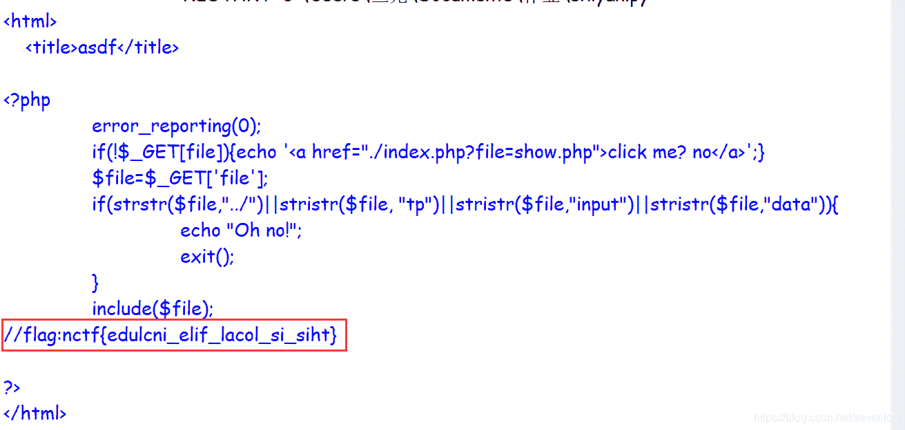

## 单身一百年也没用

~~单身狗没人权了吗~~
这个是和之前一样的界面，虽然我没看到一闪而过。。。但是我猜方法都是一样的，burpsuit抓包就行了
然后据说F12响应头里面也可以看到

## Dowload~!

不知道问什么无法访问，源码也看不到。。。过几天再试试

## COOKIE

题目提示：TIP: 0==not
所以1 == yes
点开网络刷新，在请求头中可以看到：Set-Cookie:Login=0
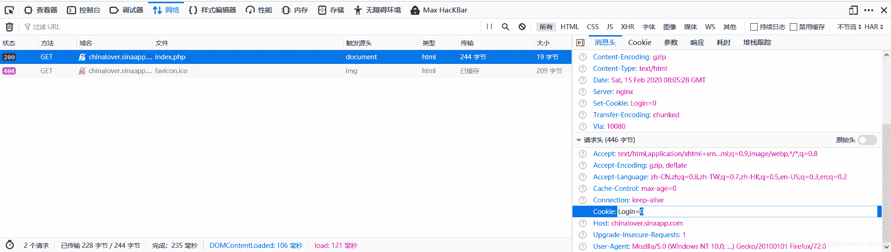
用burpsuite修改为Login=1，send就可以看到flag了

## MYSQL

之前不记得在哪写过一个robots协议的题了，所以看到这个就现在链接后面加了一个robots.txt来查看robots.txt
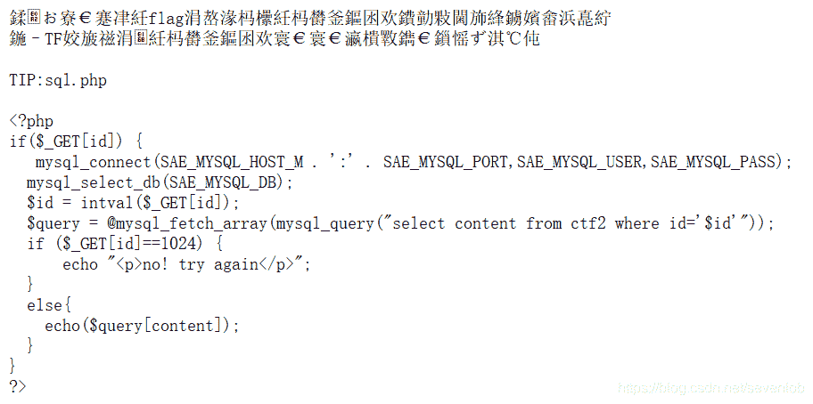
出来一堆乱码和一段PHP代码，改一下文字编码（方法之前讲过）

```
别太开心，flag不在这，这个文件的用途你看完了？
在CTF比赛中，这个文件往往存放着提示信息

TIP:sql.php

<?php
if($_GET[id]) {
   mysql_connect(SAE_MYSQL_HOST_M . ':' . SAE_MYSQL_PORT,SAE_MYSQL_USER,SAE_MYSQL_PASS);
  mysql_select_db(SAE_MYSQL_DB);
  $id = intval($_GET[id]);
  $query = @mysql_fetch_array(mysql_query("select content from ctf2 where id='$id'"));
  if ($_GET[id]==1024) {
      echo "<p>no! try again</p>";
  }
  else{
    echo($query[content]);
  }
}
?> 
```

这个代码是说，用get方式提交一个id。这里有个`intval`函数:成功时返回 var 的 integer 值，当满足`intval($_GET[id])`为1024但`$_GET[id]==1024`不成立是出flag，所以id在(1024,1025)就行。
`http://chinalover.sinaapp.com/web11/sql.php?id=1024.1`
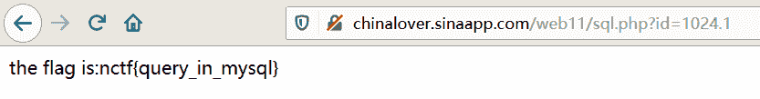