<!--yml
category: 未分类
date: 2022-04-26 14:45:00
-->

# 再不学点现代密码，CTF就Hold不住啦！_合天网安实验室的博客-CSDN博客

> 来源：[https://blog.csdn.net/qq_38154820/article/details/106329638](https://blog.csdn.net/qq_38154820/article/details/106329638)

点击蓝字

关注我们

**0x00  ****前记**

在许多CTF中，crypto中DES,AES,RSA三种现代密码频繁出现，今天在此做一下分享，给大家带来几个有趣的题目分析。

**0x01  ****现代密码之DES**

DES作为非常具有代表性的对称加密，十分受各大CTF的青睐，也成为了比赛中Crypto的热门考点，今天用一道经典例题，带大家领略一下DES的风采！

1

**题目前引**

这是一道与DES有关的题目，题目来自某安全平台，拿出来分享的原因是感觉题目还不错，需要细致了解DES的流程和pyDes库，考察点主要是DES的密钥编排。

2

**题目代码**

这里我就不完全贴出代码了，大部分是pyDes库的代码，只贴出最后关键部分

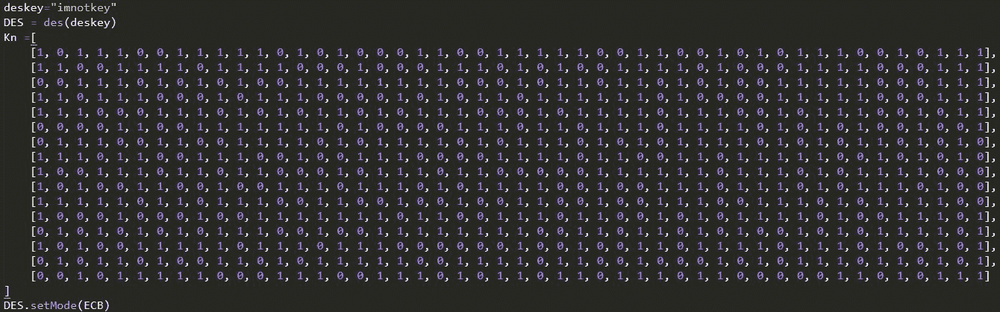

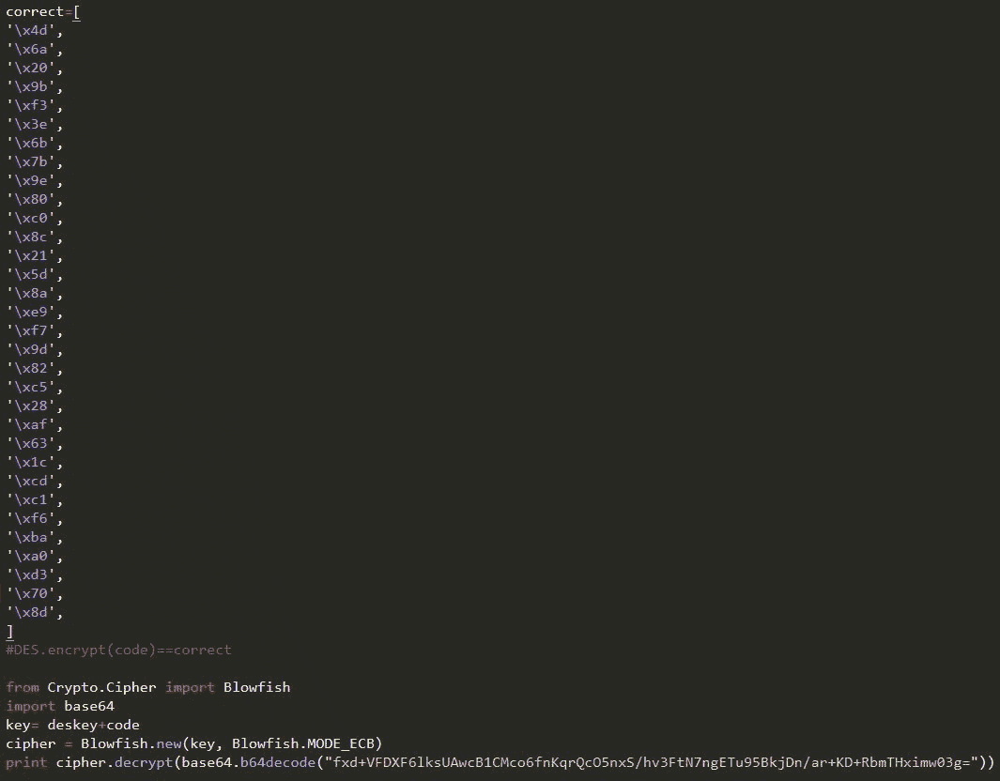

3

**主流程分析**

我们首先来看一下代码主流程看了什么：

1.设置了一个未知的deskey

2.然后用这个未知的deskey加密了code

3.然后用deskey+code作为key，调用blowfish密码，加密了flag

然后我们有

1.deskey的密钥编排后的子密钥

2.code加密后的密文correct

3.blowfish加密后的密文

所以思路还算清晰：

1.用deskey的子密钥反推deskey

2.用deskey的子密钥解密correct得到code

3.用得到的deskey和code作为密钥解密blowfish密文得到flag

然后我们容易知道DES的密钥编排过程为:

1.首先输入64bit密钥

2.将64bit密钥经过PC-1盒变成56bit

3.将56bit分为C0和D0，分别28bit

4.将C0，D0分别循环左移位，得到C1，D1

5.将C1，D1拼接，经过PC-2盒变成48bit子密钥key1

6.重复步骤4

7.生成16组子密钥

所以这里我有想法:

1.由子密钥key1经过逆PC-2盒推出C1，D1(得到48位已知和8位未知)

2.由C1，D1分别循环右移1位，得到C0，D0

3.由C0，D0经过逆PC-1盒得到deskey(已知48位，未知16位)

4.然后将deskey的16个未知量设置成a,b,c,d……

5.用带有未知参数的deskey生成16个子密钥

6.用16个带未知参数的子密钥和16个已知子密钥建立方程组

7.可以解出其中8个bit的未知量，剩余8个bit不重要，因为deskey实际加密只用了56位密钥

8.随机给剩下8bit赋值，作为一个deskey，解密correct

9.爆破剩余8bit的deskey变量，根据题目特性，应该会有一个可以是明文的字符串，即deskey

10.用deskey+code作为key解密blowfish密文，得到flag

由子密钥反推deskey

我们有子密钥

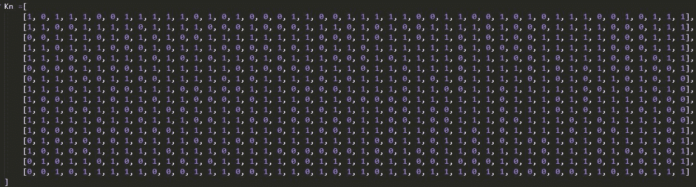

由子密钥key1开始逆推：

首先是逆PC-2盒：

key1 = [1, 0, 1, 1, 1, 0, 0, 1, 1, 1, 1, 1, 0, 1, 0, 1, 0, 0, 0, 1, 1, 0, 0, 1, 1, 1, 1, 1, 0, 0, 1, 1, 0, 0, 1, 0, 1, 0, 1, 1, 1, 0, 0, 1, 0, 1, 1, 1]

__pc2 = [

13, 16, 10, 23,  0,  4,

 2, 27, 14,  5, 20,  9,

22, 18, 11,  3, 25,  7,

15,  6, 26, 19, 12,  1,

40, 51, 30, 36, 46, 54,

29, 39, 50, 44, 32, 47,

43, 48, 38, 55, 33, 52,

45, 41, 49, 35, 28, 31

]

C1D1 = ['*']*56

for i in range(0,len(key1)):

    C1D1[__pc2[i]] = key1[i]

print C1D1

可以得到C1D1的值为:

 [1, 1, 0, 1, 0, 1, 1, 0, '*', 1, 1, 0, 0, 1, 1, 0, 0, '*', 1, 0, 1, '*', 0, 1, '*', 0, 1, 1, 1, 1, 1, 1, 1, 1, '*', 1, 1, '*', 1, 1, 1, 1, '*', 1, 0, 0, 0, 0, 0, 0, 0, 1, 0, '*', 0, 1]

然后我们循环右移动1位逆推出C0D0

C1:11010110*11001100*101*01*011

D1:111111*11*1111*1000000010*01

循环右移一位：

C0:111010110*11001100*101*01*01

D0:1111111*11*1111*1000000010*0

然后可以逆PC-1盒得到deskey

C0:111010110*11001100*101*01*01

D0:1111111*11*1111*1000000010*0

然后可以逆PC-1盒得到deskey

C0='111010110*11001100*101*01*01'

D0='1111111*11*1111*1000000010*0'

__pc1 = [56, 48, 40, 32, 24, 16, 8,

         0, 57, 49, 41, 33, 25, 17,

         9, 1, 58, 50, 42, 34, 26,

         18, 10, 2, 59, 51, 43, 35,

         62, 54, 46, 38, 30, 22, 14,

         6, 61, 53, 45, 37, 29, 21,

         13, 5, 60, 52, 44, 36, 28,

         20, 12, 4, 27, 19, 11, 3

         ]

C0D0 = C0+D0

res = ['*']*64

deskey = ""

for i in range(0,len(__pc1)):

    res[__pc1[i]] = C0D0[i]

for i in res:

    deskey += i

print deskey

得到deskey

11000***11**011*0010011*1001011*0111011*11*00*1*1*0*011*1001111*

然后我们给每个未知量替换为变量a,b,c……

得到

11000abc11de011f0010011g1001011h0111011i11j00k1L1m0n011o1001111p

然后我们用这个带未知量的deskey生成16个子密钥:

def zuoyiwei(str,num):

    my = str[num:len(str)]

    my = my+str[0:num]

    return my

def key_change_1(str):

    key1_list = [57,49,41,33,25,17,9,1,58,50,42,34,26,18,10,2,59,51,43,35,27,19,11,3,60,52,44,36,63,55,47,39,31,23,15,7,62,54,46,38,30,22,14,6,61,53,45,37,29,21,13,5,28,20,12,4]

    res = ""

    for i in key1_list:

        res+=str[i-1]

    return res

def key_change_2(str):

    key2_list = [14,17,11,24,1,5,3,28,15,6,21,10,23,19,12,4,26,8,16,7,27,20,13,2,41,52,31,37,47,55,30,40,51,45,33,48,44,49,39,56,34,53,46,42,50,36,29,32]

    res = ""

    for i in key2_list:

        res+=str[i-1]

    return res

def key_gen(str):

    key_list = []

    key_change_res = key_change_1(str)

    key_c = key_change_res[0:28]

    key_d = key_change_res[28:]

    for i in range(1,17):

        if (i==1) or (i==2) or (i==9) or (i==16):

            key_c = zuoyiwei(key_c,1)

            key_d = zuoyiwei(key_d,1)

        else:

            key_c = zuoyiwei(key_c,2)

            key_d = zuoyiwei(key_d,2)

        key_yiwei = key_c+key_d

        key_res = key_change_2(key_yiwei)

        key_list.append(key_res)

    return key_list

deskey = "11000abc11de011f0010011g1001011h0111011i11j00k1L1m0n011o1001111p"

print key_gen(deskey)

得到结果

['101110011111010100011001111100110010101110010111', '1j0n111101d110001m001110101k011110100011be0a0111',

'00111010jm100d11111110001011011ae01001111100011b', '1d0111000101110m00101nj1011111b010k00e1111000111',

'11j00011d01010110101110m01k1e1101110010b11001a11', '0000110m1111111010n001d1011011101e110101a10010k1',

'n1d1001100111101m11j10101b101k10111101010110101a', '111m1j00111001n011100001e11011a0110111110k10b010',

'10n111011011m00j0d1101100k00111e11011b01011110a0', '101001100dm011101110101j1100ba01110111010111k100',

'1111101j01110m1d001n0100110010011b0k11101a111e00', '1m001n0010011111j101100d11011001a1011110e0k11101',

'010j01ndm111001001111111b00110110101ka101011110e', '1010n11111011101d10000m01001a0e1011110b1101k0101',

'01md1010011010111110nj11101b001k0a10101e10110101', '00101111100mdj10n111010110110e110110a0k011010b11']

和题目中的Kn比对:

 ['101110011111010100011001111100110010101110010111', '110011110111100010001110101001111010001111000111',

 '001110101010011111111000101101101010011111000111', '110111000101110000101011011111101000011111000111',

 '111000111010101101011100010111101110010111001011', '000011001111111010000111011011101111010101001001',

 '011100110011110101111010111010101111010101101010', '111011001110010011100001111011001101111100101010',

 '100111011011000101110110000011111101110101111000', '101001100100111011101011110010011101110101110100',

 '111110110111001100100100110010011100111010111100', '100010001001111111011001110110010101111010011101',

 '010101010111001001111111100110110101001010111101', '101001111101110111000000100100110111101110100101',

 '010110100110101111100111101100100010101110110101', '001011111000111001110101101101110110000011010111']

我们容易得到8个变量的值，然后得到带有8个未知数的deskey

"1100001"+c+"1111011"+f+"0010011"+g+"1001011"+h+"0111011"+i+"1110001"+l+"1000011"+o+"1001111"+p       

然后题目的比较坑的地方来了

这个deskey大家会发现怎么都不对，我们阅读题目中给的程序

发现他对deskey的处理：

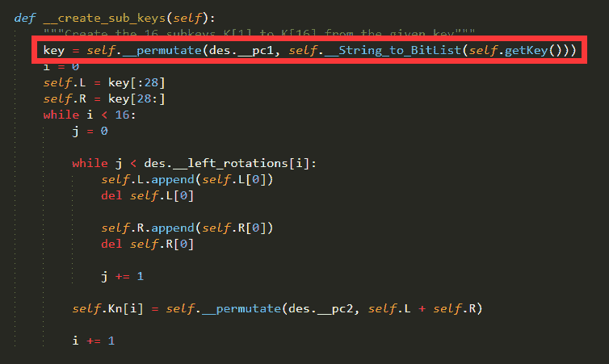

我们跟进这个__String_to_BitList()

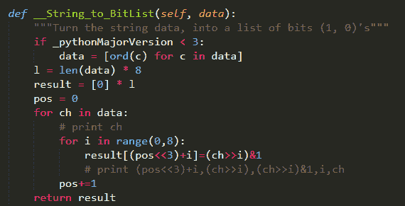

可以发现这个根本不是原版的pydes库的函数，我们来看看原版函数:

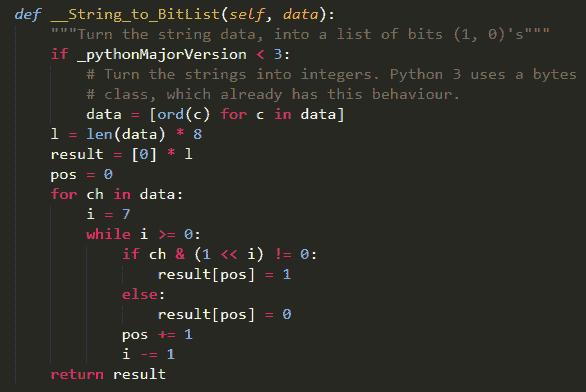

容易发现，我们题目中的处理deskey的函数

1.会先把deskey转换成64bit的二进制

2.然后将64bit的2进制，8个一组进行分组

3.再对每一组倒叙输出

4.然后再把8组拼接回来

什么意思呢？

比如

abcdefjhABCDEFJH

他处理后会变成

hjfedcbaHJFEDCBA

所以我们的deskey要进行处理:

deskey_old = '1100001"+c+"1111011"+f+"0010011"+g+"1001011"+h+"0111011"+i+"1110001"+L+"1000011"+o+"1001111"+p'.replace('"+','').replace('+"','')

deskey_new = ""

for i in range(0,len(deskey_old),8):

    deskey_new += deskey_old[i:i+8][::-1]

print deskey_new

得到

c1000011f1101111g1100100h1101001i1101110L1000111o1100001p1111001

然后我们就可以爆破8bit寻找可读明文字符串了

def bintostr(str):

    res = ""

    for i in range(0,len(str),8):

        res += chr(int(str[i:i+8],2))

    return res

for c in "01":

    for f in "01":

        for g in "01":

            for h in "01":

                for i in "01":

                    for L in "01":

                        for o in "01":

                            for p in "01":

                                str = c+"1000011"+f+"1101111"+g+"1100100"+h+"1101001"+i+"1101110"+L+"1000111"+o+"1100001"+p+"1111001"

                                str = bintostr(str)

                                print str

运行程序容易发现,只有一个可见字符串:

CodinGay

所以这一定使我们的deskey

解密correct

既然题目改变了des库的函数，所以为了解密的保险起见，我们调用题目中的代码进行解密

但是题中删去了des的解密函数

所以我们添加:

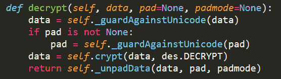

但是发现解密还不成功

于是我diff了一下题中的代码和pyDes库里的代码，发现这个函数需要改动

增加一个else

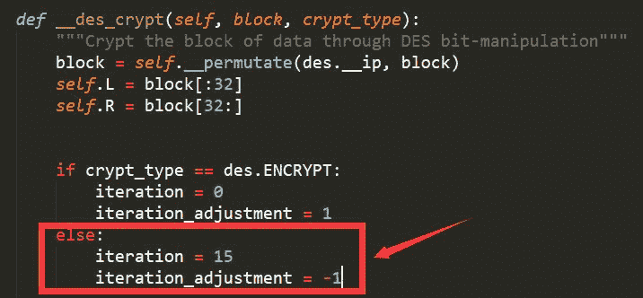

但是依旧解密不成功，我又接着看

发现crypt_type要依托来区分

而作者把这个都改成了0x00

所以我们恢复

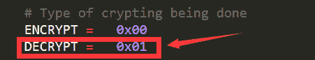

终于可以愉快的解密了

得到code：

LafetoborasdileiShelvapelocrana0

解密blowfish

这里就很简单了，直接给出代码

from Crypto.Cipher import Blowfish

import base64

deskey = "CodinGay"

code = "LafetoborasdileiShelvapelocrana0"

key= deskey+code

cipher = Blowfish.new(key, Blowfish.MODE_ECB)

print cipher.decrypt(base64.b64decode("fxd+VFDXF6lksUAwcB1CMco6fnKqrQcO5nxS/hv3FtN7ngETu95BkjDn/ar+KD+RbmTHximw03g="))

运行即可

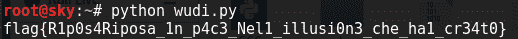

**0x02  ****现代密码之AES**

AES在目前的CTF中越来越受web的青睐，也是我入门现代密码学的引领（毕竟不会一点攻击手段，web都混不下去啦！）

1

**题目前引**

这是一道来自LCTF的题目改编而来（即LCTF的第一层，由于第二层是注入，所以在这里的密码学专题就不讲啦！），主要涉及了padding oracle attack和cbc字节翻转攻击

需要注意的是：这些攻击是针对CBC模式的，而不是AES的，同样的，这种攻击对DES的CBC模式同样适用

**先知先知**

注：这里以AES的CBC模式为例

2

**CBC加密模式**

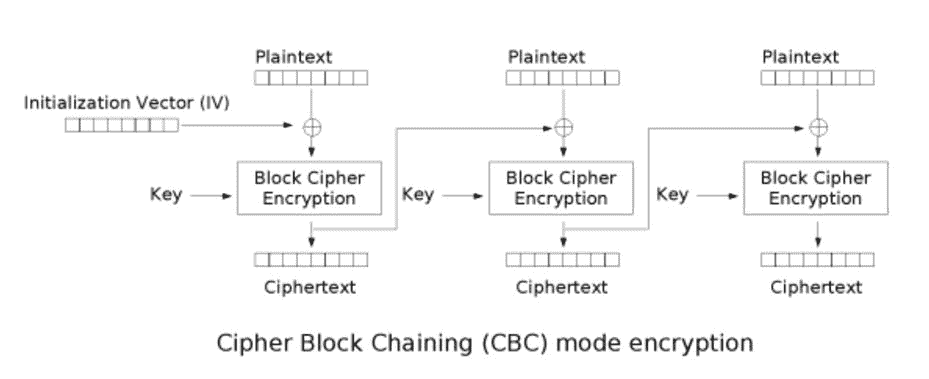

如图中所示，先从明文与IV异或，再将得到的结果进行AES加密，然后将密文作为下一组的IV，循环以得到所有组的密文

3

**CBC解密模式**

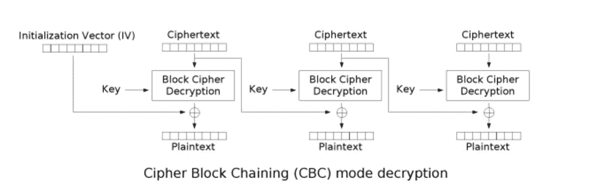

解密模式就是加密模式的逆过程，将密文经过AES解密处理，然后与IV异或即可得到明文，并且每组密文作为下一组的IV，循环即可得到所有组的明文

4

**PKCS#5填充规则**

因为加密是按照分组进行的，所以就存在填充的问题：

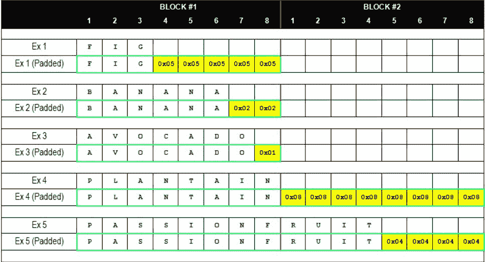

（注：图中按8个一组进行分组）

下面以16个一组分组进行举例，原理一致：

比如我们的明文为admin

则需要被填充为 

admin\x0b\x0b\x0b\x0b\x0b\x0b\x0b\x0b\x0b\x0b\x0b

一共11个\x0b

5

**侧信道/边信道攻击**

给出百度百科里的定义：

又称侧信道攻击:针对加密电子设备在运行过程中的时间消耗、功率消耗或电磁辐射之类的侧信道信息泄露而对加密设备进行攻击的方法被称为边信道攻击。这类新型攻击的有效性远高于密码分析的数学方法，因此给密码设备带来了严重的威胁。

而我们下面的Padding Oracle Attack攻击即这样一种侧信道攻击，我们并没有针对算法本身，而是依据http状态头的反馈获得我们需要的信息。

6

**Padding Oracle Attack攻击过程**

这里主要关注一下解密过程

密文cipher首先进行一系列处理，如图中的Block Cipher Decryption

我们将处理后的值称为middle中间值

然后middle与我们输入的iv进行异或操作

得到的即为明文

如果我们输入一个错误的iv，依旧是可以解密的，但是middle和我们输入的iv经过异或后得到的填充值可能出现错误

比如本来应该是

admin\x0b\x0b\x0b\x0b\x0b\x0b\x0b\x0b\x0b\x0b\x0b

而我们错误的得到

admin\x0b\x0b\x0b\x0b\x0b\x0b\x0b\x0b\x0b\x3b\x2c

这样解密程序往往会抛出异常(Padding Error)

应用在web里的时候，往往是302或是500报错

而正常解密的时候是200

所以这时，我们可以根据服务器的反应来判断我们输入的iv

我们假设middle中间值为(为了方便，这里按8位分组来阐述)

0x39 0x73 0x23 0x22 0x07 0x6a 0x26 0x3d

正确的解密iv应该为

0x6d 0x36 0x70 0x76 0x03 0x6e 0x22 0x39

解密后正确的明文为：

T E S T 0x04 0x04 0x04 0x04

但是关键点在于，我们可以知道iv的值，却不能得到中间值和解密后明文的值

而我们的目标是只根据我们输入的iv值和服务器的状态去判断出解密后明文的值

这里的攻击即叫做`Padding Oracle Attack攻击`

这时候我们选择进行爆破攻击

首先输入iv

0x00 0x00 0x00 0x00 0x00 0x00 0x00 0x00

这时候和中间值middle进行异或得到：

0x39 0x73 0x23 0x22 0x07 0x6a 0x26 0x3d

而此时程序会校验最后一位padding字节是否正确

我们知道正确的padding的值应该只有0x01~0x08，这里是0x3d，显然是错误的

所以程序会抛出500

知道这一点后，我们可以通过遍历最后一位iv，从而使这个iv和middle值异或后的最后一位是我们需要0x01

这时候有256种可能，不难遍历出

Iv:

0x00 0x00 0x00 0x00 0x00 0x00 0x00 0x3c

Middle:

0x39 0x73 0x23 0x22 0x07 0x6a 0x26 0x3d

两者异或后得到的是：

0x39 0x73 0x23 0x22 0x07 0x6a 0x26 0x01

这时候程序校验最后一位，发现是0x01，即可通过校验，服务器返回200

我们根据这个200就可以判断出，这个iv正确了

然后我们有公式：

Middle[8]^原来的iv[8] = plain[8]

Middle[8]^现在的iv[8] = 0x01

故此，我们可以算出`middle[8] = 0x01^现在的iv[8]`

然后带入式1：

Plain[8] = 0x01^现在的iv[8]^原来的iv

即可获取明文`plain[8]= 0x01^0x3c^0x39=0x04`

和我们之前解密成功的明文一致（最后4位为填充）

下面我们需要获取plain[7]

方法还是如出一辙

但是这里需要将iv更新，因为这次我们需要的是2个0x02，而非之前的一个0x01

所以我们需要将`现在的iv[8] = middle[8]^0x02`

（

为什么是`现在iv[8] = middle[8]^0x02`？

因为`现在的iv[8]^middle[8]=服务器校验的值`

而我们遍历倒数第二位，应该是2个0x02，所以服务器希望得到的是0x02，所以

现在的iv[8]^middle[8]=0x02

故此iv[8] = middle[8]^0x02

）

然后再继续遍历现在的iv[7]

方法还是和上面一样，遍历后可以得到

Iv:

0x00 0x00 0x00 0x00 0x00 0x00 0x24 0x3f

Middle:

0x39 0x73 0x23 0x22 0x07 0x6a 0x26 0x3d

两者异或后得到的是：

0x39 0x73 0x23 0x22 0x07 0x6a 0x02 0x02

然后此时的明文值：

Plain[7]=现在的iv[7]^原来的iv[7]^0x02

所以Plain[7] = 0x02^0x24^0x22=0x04

和我们之前解密成功的明文一致（最后4位为填充）

最后遍历循环，即可得到完整的plain

7

**CBC翻转攻击过程**

这个实际上和padding oracle攻击差不多

还是关注这个解密过程

但这时，我们是已知明文，想利用iv去改变解密后的明文

比如我们知道明文解密后是1dmin

我们想构造一个iv，让他解密后变成admin

还是原来的思路

原来的Iv[1]^middle[1]=plain[1]

而此时

我们想要

构造的iv[1]^mddle[1]=’a’

所以我们可以得到

构造的iv[1] = middle[1]^’a’

而

middle[1]=原来的iv[1]^plain[1]

所以最后可以得到公式

构造的iv[1]= 原来的iv[1]^plain[1]^’a’

所以即可造成数据的伪造

我们可以用这个式子，遍历明文，构造出iv，让程序解密出我们想要的明文

题目主要源码

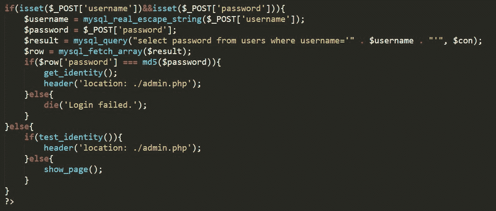

1.弱密码，经过尝试，账户和密码均为admin

而后可以进入get_identity()函数

跟进一下这个函数

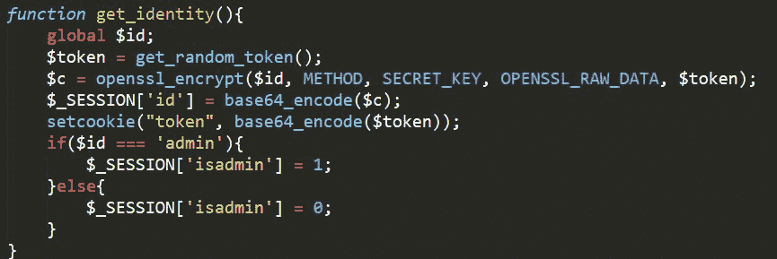

可见是一个AES-CBC的加密

2.如果未输入变量

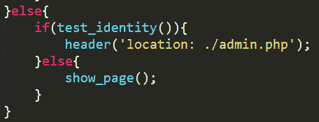

我们跟进这两个函数

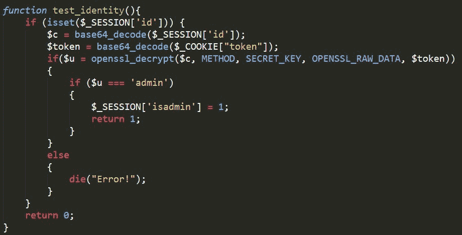

发现如果解密后发现密文等于admin，则可以把session的isadmin判断项置1

然后可以登录成功

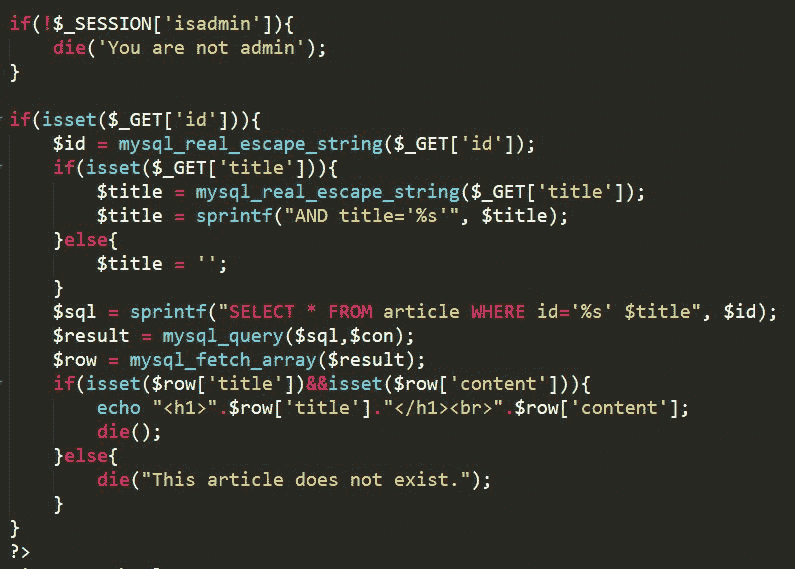

进入到下一层

8

**题目题解**

有了上面的知识基础，我们就可以很快速的破解这道题

首先是我们未知Plain,即这里的global $id

所以可以利用padding oracle攻击去得到这个值plain

然后得到这个值后，再利用cbc翻转攻击，将这个plain伪造成我们需要的admin

所以整体脚本如下：

（注：这里padding oracle只能爆出15位的明文，还剩一位，可以遍历爆破一下，一共0xff种可能）

#!/usr/bin/env python

# coding:utf-8

import requests

import urllib

import base64

url= " http://题目地址/simple-blog/login.php"

sessionid ="1a0jd795kj6ba331k6pjnaafh7"

old_token = "c3RtZkZqcjk2VnF5dk80Yw%3D%3D".replace("%3D","=").decode("base64")

middle = [0x00]*16

my_iv = [0x00]*16

plain = [0x00]*16

for j in range(0,16):

    for i in range(0,256):

        payload = ""

        my_iv[15-j] = i

        for k in my_iv:

            payload += chr(k)

        payload = urllib.quote(base64.b64encode(payload))

        cookie = {

            "PHPSESSID": sessionid,

            "token": payload

        }

        s = requests.get(url=url,cookies=cookie)

        if "Error!" not in s.content:

            middle[15-j] = i^(j+1)   #利用遍历值^Padding值 算出中间值

            plain[15-j] = middle[15-j]^ord(old_token[15-j]) #利用中间值^原来的iv 算出明文值

            for sb in range(0,j+1):

                my_iv[15 - sb] = middle[15 - sb]^(j+2) #将现在的iv更新成下一次的

            print "中间值",middle

            print "明文数组",plain

            print "--------------------------------------------------"

            break

my_want_str = "admin"+'\x0b'*11

for i in range(0,256):

    already = ""

    my_token = ""

    already += chr(i)

    for k in range(1,16):

        already+=chr(plain[k])

    for j in range(0,16):

        my_token += chr(ord(old_token[j])^ord(my_want_str[j])^ord(already[j]))

    my_token = urllib.quote(base64.b64encode(my_token))

    cookie = {

        "PHPSESSID": sessionid,

        "token": my_token

    }

    s = requests.get(url=url,cookies=cookie)

运行脚本上访问admin.php:

运行脚本后访问:

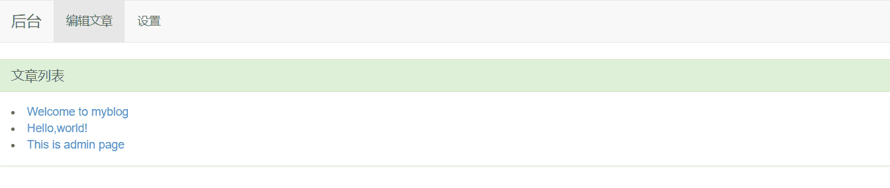

即可成功进入下一层

关于题目源码，LCTF的师傅们已经开源到了github：

*https://github.com/LCTF/LCTF2017*

**0x03  ****现代密码之RSA**

RSA可以说是CTF中Crypto题型的常客，笔者几乎参与的每场比赛都有RSA的题目

1

**首先介绍一下什么是RSA**

RSA算法是一种非对称密码算法，所谓非对称，就是指该算法需要一对密钥，使用其中一个加密，则需要用另一个才能解密。

RSA的算法涉及三个参数，n、e1、e2。

其中，n是两个大质数p、q的积，n的二进制表示时所占用的位数，就是所谓的密钥长度。

e1和e2是一对相关的值，e1可以任意取，但要求e1与(p-1)*(q-1)互质；再选择e2，要求(e2×e1)≡1(mod(p-1)×(q-1))。

（n，e1),(n，e2)就是密钥对。其中(n，e1)为公钥，(n，e2)为私钥。

RSA加解密的算法完全相同，设A为明文，B为密文，则：A≡B^e2( mod n)；B≡A^e1 (mod n)；（公钥加密体制中，一般用公钥加密，私钥解密）

e1和e2可以互换使用，即：

A≡B^e1 (mod n)；B≡A^e2( mod n);

2

**再介绍一下常见的RSA工具**

**1.PARI**

这个我工具我用的比较少了，一般是用来将大数16进制转10进制……或者是判断N的位数使用

指令也很简单：

第一步:x=87924348264132406875276140514499937145050893665602592992418171647042491658461

（当然，如果输入16进制，你要带上0x，他会底下自动给你显示10进制，十分方便）

第二步:binary(x)

他就会帮你把这个大数分解成2进制

第三步:length(x)

他可以帮你输出这个N的位数

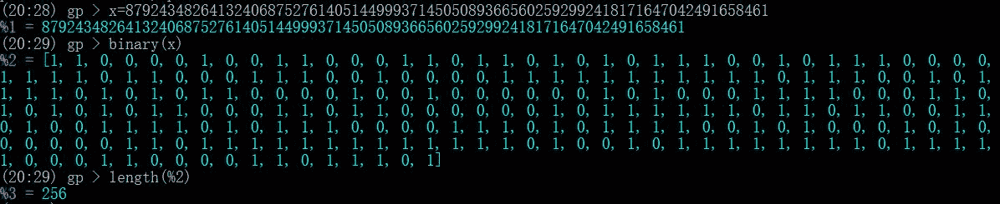

**2.openssl**

经常会遇到类似如下格式的公钥:

-----BEGIN PUBLIC KEY-----

MIGfMA0GCSqGSIb3DQEBAQUAA4GNADCBiQKBgQCh5Nk2GLiyQFMIU+h3OEA4UeFb

u3dCH5sjd/sLTxxvwjXq7JLqJbt2rCIdzpAXOi4jL+FRGQnHaxUlHUBZsojnCcHv

hrz2knV6rXNogt0emL7f7ZMRo8IsQGV8mlKIC9xLnlOQQdRNUssmrROrCG99wpTR

RNZjOmLvkcoXdeuaCQIDAQAB

-----END PUBLIC KEY-----

可以使用RSA将其转换成N和E的形式，指令如下:

openssl rsa -in public.key -pubin -noout -text -modulus

即可得到N和E

**3.yafu**

一个相当方便的大数分解工具

使用指令：（到yafu-x64.exe的目录下使用）

yafu-x64.exe factor(N)

例如要把大数87924348264132406875276140514499937145050893665602592992418171647042491658461分解

只需要：

yafu-x64.exe factor(87924348264132406875276140514499937145050893665602592992418171647042491658461)

即可

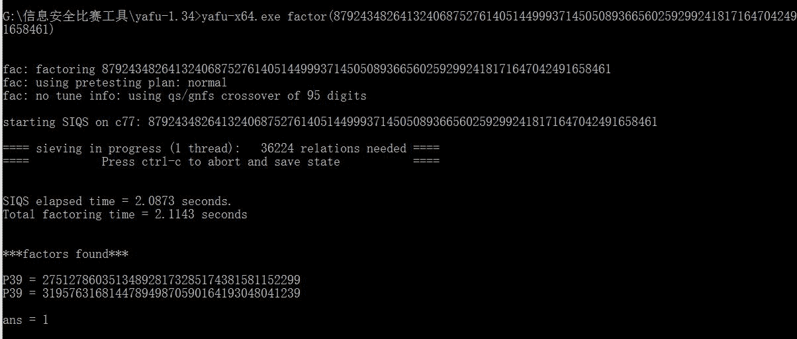

**4.非常好用的两个网站：**

*http://factordb.com/index.php*

*http://tool.chacuo.net/cryptrsapubkey*

第一个可以用来分解大数

第二个功能很多，大家可以自己探索

**5.RSATool**

这个工具相当直接

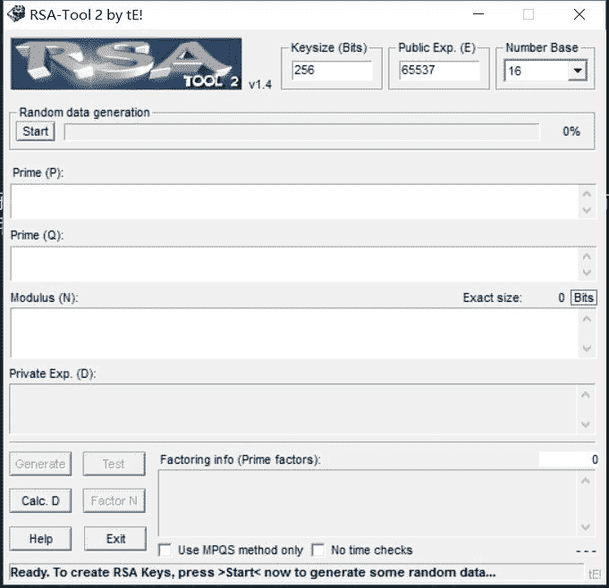

其中：

Keysize(Bits)：填写你N的位数

Public Exp.(E)：填写你的e的十进制值

Number Base：填写你下面N的进制（一般采用10进制）

Modulus(N)：填写N的十进制数（和Number Base填写的要对应）

然后点击左下角的Factor N

就会自动分解出P和Q

然后点击左下角的Calc. D

就会自动计算出D

然后点击左下角的Test

（这里好像有个Bug，要先加密一次，才能用解密功能）

然后把你的密文放在result里，点击decrypto

即可得到解密后的答案

3

**再说一下RSA常见题型**

1. RSA的共模攻击

2. RSA的低指数攻击

3. RSA的广播攻击

4. RSA的维纳攻击

这些题型已经算是比赛中的常见例题了，网上也有许多攻击与破解方案，我这里就不再赘述了，下面为大家带来最近发现的一些有趣的RSA题解

**0x04 ****RSA题目**

1

**题目前引**

这是一道根据已有的n,d,e去分解p,q的RSA，题目来自2017全国网络安全暨上海赛的初赛RSA300

**1.1程序分析**

一共3个选项:

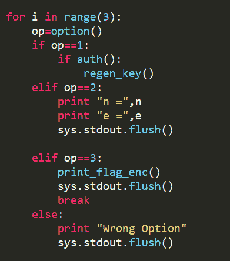

选项1:

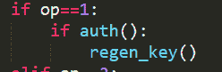

我们跟进函数：

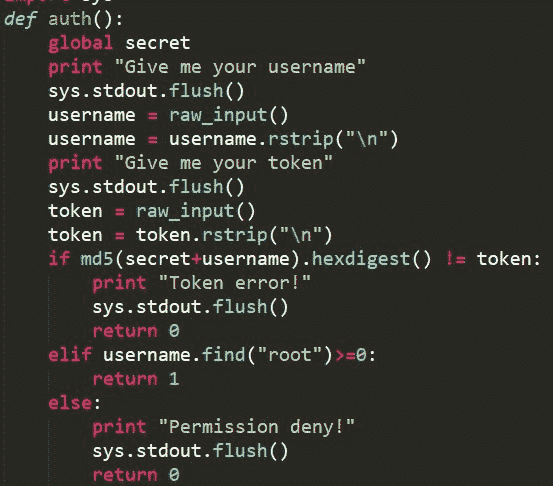

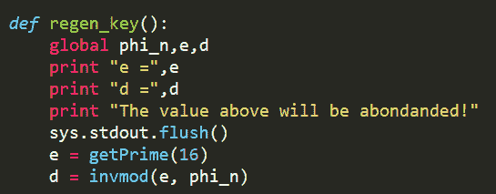

容易想到这里应该是一个hash长度拓展攻击

因为secret是我们已知长度，不知具体的salt

而secret+username我们已知知道了

secret+guest的md5

所以我们可以利用hashpump进行攻击，从而成为root，得到第一组e和d

然后选项2：

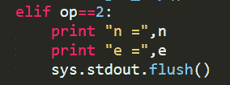

可以给出重新生成的n和e

然后选项3：

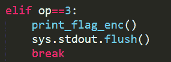

我们跟进这个函数

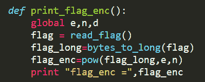

可以给出第二轮生成的e和n得到的密文

**1.2程序攻击**

首先我们确定一下思路:

先得到第一轮的e和d，再得到第二轮重新生成的e和不变的n，最后获取flag

所以我们首先进行hash长度拓展攻击

这里我们选择pwntools与题目进行交互

from pwn import *

from hashpumpy import *

p=remote('106.75.98.74

',10030)

p.recvuntil('This is your token: ')

h=p.recvline().strip()

a=hashpump(h,'guest','root',8)

p.recv()

p.sendline('1')

p.recv()

p.sendline(a[1])

p.recv()

p.sendline(a[0])

print p.recv()

p.interactive()

可以容易得到第一组e和d

e = 40213

d = 7500700469928887286518458227664699159278535487520757641922238090199917409016343569173939993906922756556831035504721854231002147097871069085579605909683755970246918670465100763853106096318395019569333288936689100858056883923422787373585911487853097453104638315266112565971841143733065838415785677352565366518286696159642641689659349714647415916777285391063620441166105432812587414551700794114394465506916507947677896007952395030521123001124229725209405882460927276297059921329305310826295983712199378473680414182815794064434492991619912020752957362646533601970102561949600259252301371098109684898098632567518246029061

然后获取不变的n和第二轮的e：

n = 16524717470949999696091971769521752440260107793769365422375442958484045294952841940896929215744211078147145479140490874058581566934021218492215673721914911457379024844979625103644603925450699551960861203528794105780148001600427357073029653134336087650342235280326312639863345637042556103665917352949033642897308785366329872282202458250082221058049458136595784478449079400726888282283678741404349251932226122657413860087195339718695834408124378779278152097697039166079786373183546878203429827668279703612664272707566842472777033850849491863616969677973480717909379202648999260739897757062596992962034283964483339890331

e = 51713

最后是密文:

c=14393216781722178003306512831950927649138730534659938473432658453893579089181643910227146230219873790364049290575161577576737668749258349821047730143664996540304846267849691627722700417655460486917490004775172766040499375305064669817859170100795609015892650599502208001994020595343601282023820768649108270834062429381494838401660862935250942907635115481123369593205062636738018108000462370324278749923060060752122371413390939737682554633793909003693581999343058203409653003990465873405008587925422815425152341277900009601352181012736488572123959271273718435444053362323902987467288142530197426611139316340183388954578

然后问题来了，如果用已知的n,e,d去得到p和q

这里我一开始思考了一下：

我们可以知道

d = e^-1 mod phi_n

所以我们容易得到

d*e = 1 mod phi_n

即

d*e-1|phi_n

所以我们可以分解`d*e-1`，他必有因素是phi_n，得到phi_n后我们就可以得到第二轮的d

但是由于分解的因素过多，直接排列组合配对出phi_n就很痛苦

所以这里有一个很好的算法:

https://www.di-mgt.com.au/rsa_factorize_n.html

可以很好的帮我们解决问题

算法实现:

脚本如下

import random

def gcd(a, b):

    if a < b:

        a, b = b, a

    while b != 0:

        temp = a % b

        a = b

        b = temp

    return a

def getpq(n, e, d):

    p = 1

    q = 1

    while p == 1 and q == 1:

        k = d * e - 1

        g = random.randint(0, n)

        while p == 1 and q == 1 and k % 2 == 0:

            k /= 2

            y = pow(g, k, n)

            if y != 1 and gcd(y - 1, n) > 1:

                p = gcd(y - 1, n)

                q = n / p

    return p, q

def main():

    n = 16524717470949999696091971769521752440260107793769365422375442958484045294952841940896929215744211078147145479140490874058581566934021218492215673721914911457379024844979625103644603925450699551960861203528794105780148001600427357073029653134336087650342235280326312639863345637042556103665917352949033642897308785366329872282202458250082221058049458136595784478449079400726888282283678741404349251932226122657413860087195339718695834408124378779278152097697039166079786373183546878203429827668279703612664272707566842472777033850849491863616969677973480717909379202648999260739897757062596992962034283964483339890331

    e = 40213

    d = 7500700469928887286518458227664699159278535487520757641922238090199917409016343569173939993906922756556831035504721854231002147097871069085579605909683755970246918670465100763853106096318395019569333288936689100858056883923422787373585911487853097453104638315266112565971841143733065838415785677352565366518286696159642641689659349714647415916777285391063620441166105432812587414551700794114394465506916507947677896007952395030521123001124229725209405882460927276297059921329305310826295983712199378473680414182815794064434492991619912020752957362646533601970102561949600259252301371098109684898098632567518246029061

    p, q = getpq(n, e, d)

    print p

    print q

if __name__ == '__main__':

    main()

可以得到p和q：

p = 116803972359246830950002720138413077148113956408220776890535345803005303891268315330897200540246172887169335591551592243064609663151911089959259139601097749649631698099961451191394321447353119887438164810634953619671204382075221416442255785950963637188549460847726333017672845807932145101586045638150628232999

q = 141473933952570870291987109677740142115118495048607431322824021521561294210766639642610839458071357533353534950484614107837113133499907017656928417943568186729082488790080005204231835973916579530731477122069042925690924156112706754053655741356596095895117019307476005281377103443987986040076775474329685986669

然后就很简单了，直接可以得到flag

n = 16524717470949999696091971769521752440260107793769365422375442958484045294952841940896929215744211078147145479140490874058581566934021218492215673721914911457379024844979625103644603925450699551960861203528794105780148001600427357073029653134336087650342235280326312639863345637042556103665917352949033642897308785366329872282202458250082221058049458136595784478449079400726888282283678741404349251932226122657413860087195339718695834408124378779278152097697039166079786373183546878203429827668279703612664272707566842472777033850849491863616969677973480717909379202648999260739897757062596992962034283964483339890331

c = 14393216781722178003306512831950927649138730534659938473432658453893579089181643910227146230219873790364049290575161577576737668749258349821047730143664996540304846267849691627722700417655460486917490004775172766040499375305064669817859170100795609015892650599502208001994020595343601282023820768649108270834062429381494838401660862935250942907635115481123369593205062636738018108000462370324278749923060060752122371413390939737682554633793909003693581999343058203409653003990465873405008587925422815425152341277900009601352181012736488572123959271273718435444053362323902987467288142530197426611139316340183388954578

e = 51713

p=141473933952570870291987109677740142115118495048607431322824021521561294210766639642610839458071357533353534950484614107837113133499907017656928417943568186729082488790080005204231835973916579530731477122069042925690924156112706754053655741356596095895117019307476005281377103443987986040076775474329685986669

q=116803972359246830950002720138413077148113956408220776890535345803005303891268315330897200540246172887169335591551592243064609663151911089959259139601097749649631698099961451191394321447353119887438164810634953619671204382075221416442255785950963637188549460847726333017672845807932145101586045638150628232999

d = modinv(e,(p-1)*(q-1))

m = fastExpMod(c,d,n)

print hex(m)

最后可以得到flag:

flag:flag{Do_you_think_change_e_d_means_change_the_key?}

2

**RSA题目二**

这是来自2017WHCTF的一道RSA题目，解决方法是：Coppersmith定理攻击

**2.1题目流程:**

先看函数主流程

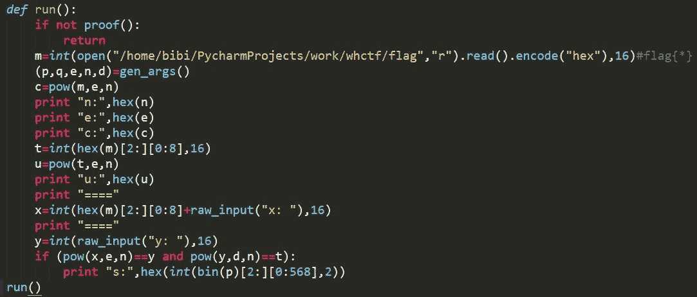

首先会进行proof检验，我们跟进一下

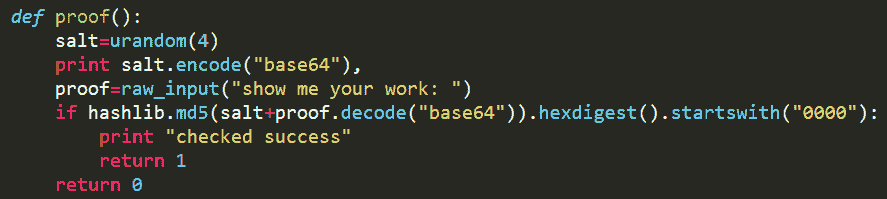

这里只需要随机给我们的salt与我们输入的东西拼接后的md5，以0000开头即可通过验证

然后会调用gen_args()函数

我们跟进一下

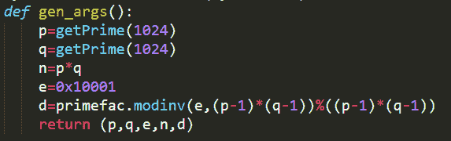

该函数会随机生成两个1024bit的p和q，并且用0x10001的e作为公钥，并返回生成的私钥d

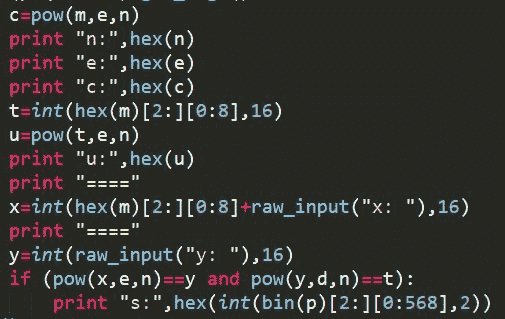

然后用刚生成的e和模数n去加密flag

并且将模数n，公钥e和密文c返回给我们

然后同样的方法加密了一下部分flag

但是我们发现后面的验证

如果我们的x输入空

则x = t

此时只要输入y = u

则显然

pow(x,e,n) == pow(t,e,n)

而pow(y,d,n)则显然是对u的解密，显然是t，所以这里的验证绕过

最后我们可以得到568bit的p

而我们需要的是1024bit的p，而后续的攻击，则是Coppersmith定理攻击

**2.2 Coppersmith定理攻击流程:**

在Coppersmith定理攻击中，我们需要已知576bit的信息量才可以得到完整的1024bit的p，所以这里我们需要8bit的爆破

所以得到sage的脚本如下

n = 0x77349378113d24885cae7d7f866ba4dd7e4a70da9b8f2bb6c471cd861c9cbea2611f071c51f5554c94d1cc053fc5a5151da7f98d83e842f33833844fb7334731d65dcd8960a5ec2776b05e6218c380272359fb9e2b292da6d71287141dfa62d7835b29d1bef0998eb21564f7e8f14976b097ee32da29cfdcdafec48f2e26d037728064bbede09c5f550a68fa6e159b39161a3721504547069619dead608b6e4ef9247987543a1798cdf8849f62a6ed1529ac888b88541dc9e441f4ebd048e970afc7b87753880d7bd55e35f96768163bfdca927488347887641d0e71781546b90dae1d2096b1710cf50cfa4504aaf5d72bed797e017e71c885ab1dc243076913

p = '0xc9c8f6b0bdd39dc243f9fa52b44338b9de1ff8e634d7dd658406a62b87dcb8b106e3f8ac9ceb5a756440f9ac52dbb5d9c795d35967068f86d803ae4a12fff3ccd3b0fabb27d8ea'

PR.< x > = PolynomialRing(Zmod(n))

for i in range(0,256):

    a = p+str(hex(i)[2:])+'1000000000000000000000000000000000000000000000000000000000000000000000000000000000000000000000000000000000000000'

    p_fake = int(a,16)

    pbits = 1024

    kbits = pbits - 576

    pbar = p_fake & (2 ^ pbits - 2 ^ kbits)

    f = x + pbar

    x_all = f.small_roots(X=2 ^ kbits, beta=0.4)

    if(x_all):

        x0 = x_all[0]

        print x0 + pbar

运行此脚本可以轻松得到完整的p=

141698255757635252660559761027843774756973990824454304305924164190046943890049953388292943867027173522777259148765603271493438292703018769515073718384258949734976361147979875450237657692859618300061338262712579481916913954880744396414419230894018094121403952935956958379068756579240400263234913967428600055789

然后就可以轻松分解模数n，从而得到d，然后获得Flag

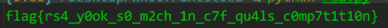

**0x05  后记**

现代密码题目层出不穷，尤其是RSA，出现的攻击手段更是五花八门，想要完全掌握还是很困难的，想要进阶还是必须得在实战中提升，由于个人水平问题，若文章中存在问题，请各位大佬斧正！

看不过瘾？合天2017年度干货精华请点击《[【精华】2017年度合天网安干货集锦](http://mp.weixin.qq.com/s?__biz=MjM5MTYxNjQxOA%3D%3D&chksm=bd5944558a2ecd431c78ad700abca82b6ed7f84dbf4811c992df4e464dbbc12124dd38df2554&idx=1&mid=2652846232&scene=21&sn=82123fbf2411874a427fb84cd111e39a#wechat_redirect)》

**别忘了投稿哟！！！**

合天公众号开启原创投稿啦！！！

大家有好的技术原创文章。

欢迎投稿至邮箱：*edu@heetian.com*；

合天会根据文章的时效、新颖、文笔、实用等多方面评判给予100元-500元不等的稿费哟。

有才能的你快来投稿吧！

重金悬赏 | 合天原创投稿奖励来啦

**    合天智汇**

网址 : *www.heetian.com*

电话：4006-123-731

长按图片，据说只有颜值高的人才能识别哦→