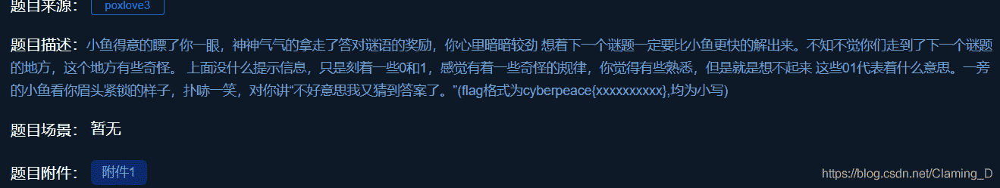

<!--yml
category: 未分类
date: 2022-04-26 14:51:00
-->

# 功防世界CTF-crypto-Morse_萌萌哒的baola的博客-CSDN博客

> 来源：[https://blog.csdn.net/Claming_D/article/details/106465778](https://blog.csdn.net/Claming_D/article/details/106465778)

## 【环境】

win10

## 【工具】

python

## 【题目】

标题：morse

附件内容：

```
11 111 010 000 0 1010 111 100 0 00 000 000 111 00 10 1 0 010 0 000 1 00 10 110 
```

## 【解题思路】

附件内容为 0和1组成的字符串，其特征像摩尔斯电码，我们将0和1替换为"·“和”-"，python3脚本如下：

```
cryptoText = "11 111 010 000 0 1010 111 100 0 00 000 000 111 00 10 1 0 010 0 000 1 00 10 110"
cryptoText = cryptoText.replace("1","-").replace("0",".")
print(cryptoText)
"""
输出结果：
-- --- .-. ... . -.-. --- -.. . .. ... ... --- .. -. - . .-. . ... - .. -. --.
""" 
```

对这串摩尔斯电码解密：

```
 """
@description: morse编码与解码
@author: baola
@file: morseCode.py
@version: python3.8.1
"""

a2mo_dict = {'a': '.-', 'b': '-...', 'c': '-.-.', 'd': '-..', 'e': '.',
             'f': '..-.', 'g': '--.', 'h': '....', 'i': '..', 'j': '.---',
             'k': '-.-', 'l': '.-..', 'm': '--', 'n': '-.', 'o': '---',
             'p': '.--.', 'q': '--.-', 'r': '.-.', 's': '...', 't': '-',
             'u': '..-', 'v': '...-', 'w': '.--', 'x': '-..-', 'y': '-.--', 'z': '--..',
             '0': '-----', '1': '.----', '2': '..---', '3': '...--', '4': '....-',
             '5': '.....', '6': '-....', '7': '--...', '8': '---..', '9': '----.'
             }
mo2a_dict = dict(zip(a2mo_dict.values(), a2mo_dict.keys()))

def start():
    """
    程序入口
    :return: NULL
    """
    choose = input("编码请按1，解码请按 0")
    if choose == "1":
        try:
            mo2a()
        except:
            print("请输入格式正确的摩尔斯电码")

    if choose == "0":
        try:
            a2mo()
        except:
            print("只能输入字母数字")

def mo2a():
    """
    摩尔斯电码转换为字符串
    :return: NULL
    """
    crypto_text = input("请输入摩尔斯电码：")
    morse_key = crypto_text.strip().split(" ")
    plain_text = [mo2a_dict[key] for key in morse_key]
    plain_text = "".join(plain_text)
    print("摩尔斯解码后的明文为：", plain_text)

def a2mo():
    """
    字符串编码成摩尔斯电码
    :return: NULL
    """
    crypto_text = ""
    plain_text = input("请输入要加密的明文：").strip().replace(" ", "")
    for word in plain_text:
        crypto_text += a2mo_dict[word] + " "
    print("编码后的摩尔斯电码为：", crypto_text)

start() 
```

解密得到：

```
morsecodeissointeresting 
```

## 【总结】

熟悉摩尔斯电码，会编写脚本实现摩尔斯电码的编码和解码。

本人水平有限，文章难免存在疏漏和不足之处，欢迎广大读者朋友批评指正。