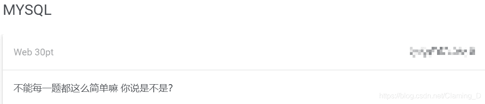
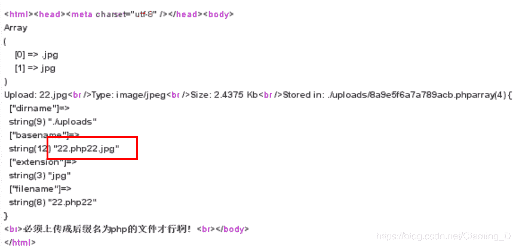
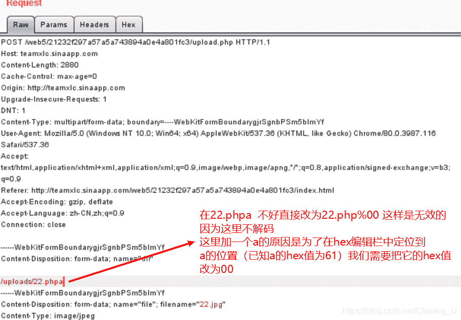
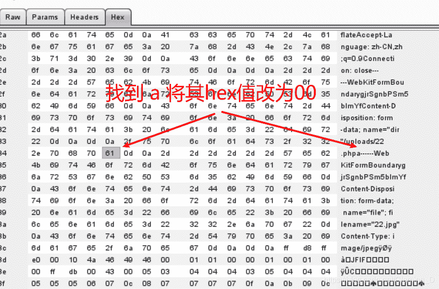
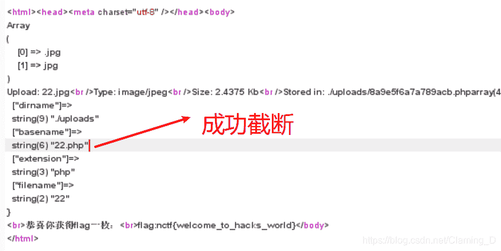
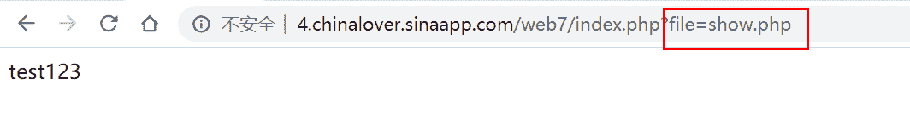

<!--yml
category: 未分类
date: 2022-04-26 14:52:53
-->

# 南邮CTF-web第一篇_萌萌哒的baola的博客-CSDN博客

> 来源：[https://blog.csdn.net/Claming_D/article/details/105254329](https://blog.csdn.net/Claming_D/article/details/105254329)

# 1 MYSQL


[传送门](http://chinalover.sinaapp.com/web11/)
解：

```
1、Do you know robots.txt？  有这句话提示查看网站的robots.txt文件
2、打开 http://chinalover.sinaapp.com/web11/robots.txt 页面里有一段提示和php代码 
```

```
<?php
if($_GET[id]) {
   mysql_connect(SAE_MYSQL_HOST_M . ':' . SAE_MYSQL_PORT,SAE_MYSQL_USER,SAE_MYSQL_PASS);
  mysql_select_db(SAE_MYSQL_DB);
  $id = intval($_GET[id]); 
  $query = @mysql_fetch_array(mysql_query("select content from ctf2 where id='$id'"));
  if ($_GET[id]==1024) { 
      echo "<p>no! try again</p>";
  }
  else{
    echo($query[content]);
  }
}
?> 
```

使用[intval()](https://www.runoob.com/php/php-intval-function.html)将get传参转化为整数赋值给id变量，无法进行常规的sql注入。
判断参数是否等于1024 暗示着 当$id 的值为1024时，页面会返回flag。

如何绕过 $_GET[id]==1024 这个条件判断呢？

由于 **$id = intval(1024.1) 的值为1024 **
所以只需要传参的值为浮点型，其整数部分为1024即可
题目提示 : TIP:sql.php
于是构造payload：
http://chinalover.sinaapp.com/web11/sql.php?id=1024.1
成功的到flag。

## 1.1 题目小结

阅读代码，了解代码运行流程，通过intval()函数的特点进行绕过

# 2 上传绕过


修改文件名

```
.jpg  拦截提示：必须上传成后缀名为php的文件才行啊
.php  拦截提示 ：不被允许的文件类型,仅支持上传jpg,gif,png后缀的文件

用%00截断试试
.jpg%00.php   拦截提示：必须上传成后缀名为php的文件才行啊
.php%00.jpg   拦截提示 ：不被允许的文件类型,仅支持上传jpg,gif,png后缀的文件
在文件名处使用%00无效 
```

对文件的名的操作无果，于是对路径下手

修改路径名 /uploads/22.php

添加的内容被拼接到文件名中，再次使用%00截断尝试。




## 2.1 题目小结

推测代码检测流程，然后运用%00截断绕过
经过不断猜测与尝试可以得到检测流程
检测流程：
首先对文件名进行判断看他是不是.jpg、.png、.gif 类型的文件
然后 将路径与上传的文件名进行拼接，拼接完后再次检测文件名是否为.php文件，所以我们对路径名进行%00截断就可以成功绕过.

# 3 本地包含

## 3.1题目描述：

这是一道本地文件包含的题目，说明存在[文件包含漏洞](cnblogs.com/appear001/p/11149996.html)，

点击链接，得到下面的页面，这个页面包含了show.php，show.php页面里没有显示任何有用的信息。但是看到了url传参的参数为file

由于题目没有提示要包含哪个文件，这里猜测就是当前文件。
猜测flag在index.php的源码里（也就是当前页面），所以我们需要想办法将index.php的源码读出来

## 3.2解题：

因为php文件无法在前端直接显示出来，将php文件转换成base64编码，解码后即可看到php文件源码。
使用PHP伪协议：php://filter(本地磁盘文件读取)
payload：?file=php://filter/read=convert.base64-encode/resource=index.php
解码后在源码中看到flag

## 3.3题目小结

这题flag藏在源码里面，由于存在本地文件包含漏洞，我们可以使用php伪协议的方式读取本地磁盘的文件内容。