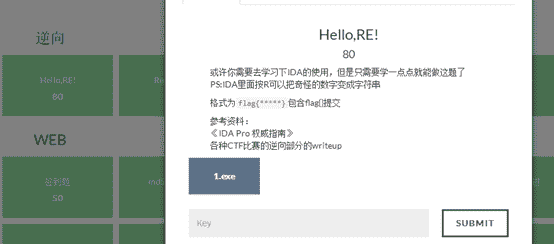
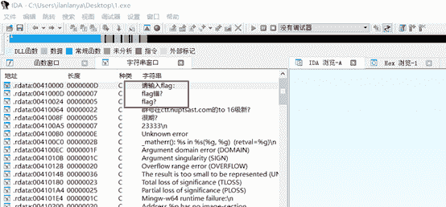
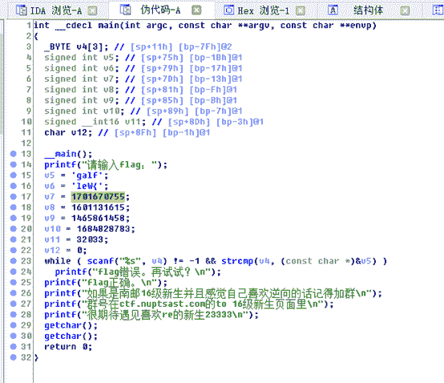
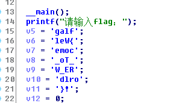
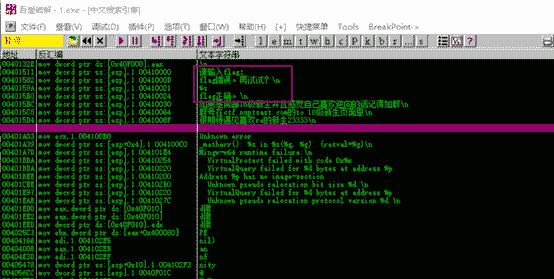
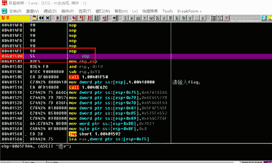
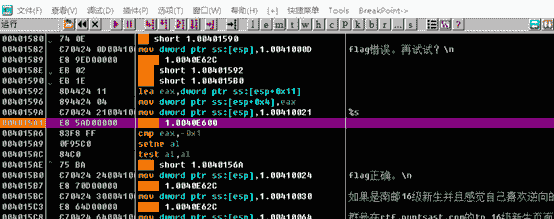
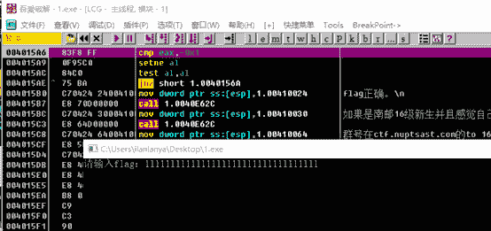
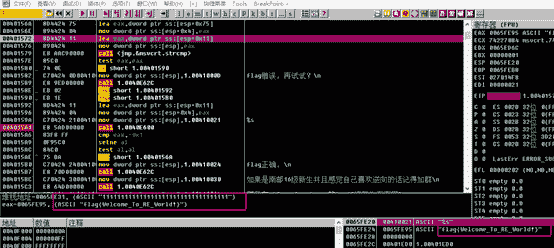

<!--yml
category: 未分类
date: 2022-04-26 14:49:14
-->

# 南邮CTF逆向题第一道Hello,RE!解题思路_iqiqiya的博客-CSDN博客

> 来源：[https://blog.csdn.net/xiangshangbashaonian/article/details/78878876](https://blog.csdn.net/xiangshangbashaonian/article/details/78878876)

首先可以看到提示如下

我还是查了一下 无壳

提示用IDA

那我们就载入 shift+f12查找字符串

双击进入 在右侧窗口接着双击 然后f5看到了伪代码 于是点击字符串全按R即可

我再用OD试一下

段首F2下断

F9运行 段下来后接着单步

走到这个call处

输入假码 回车

接着慢慢向下单步走

没走两步 就发现flag

