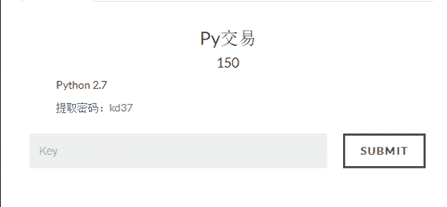
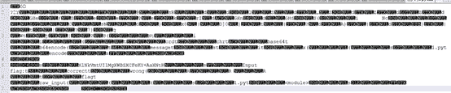
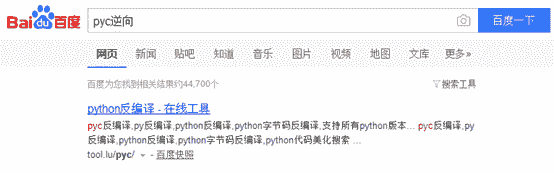
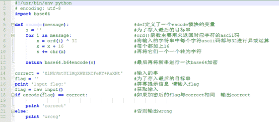
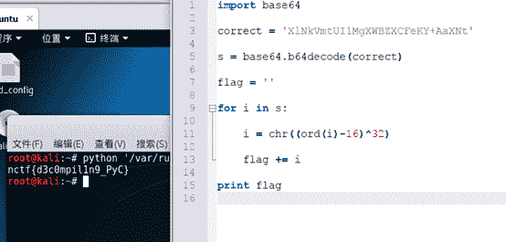

<!--yml
category: 未分类
date: 2022-04-26 14:47:02
-->

# 南邮CTF逆向题第三道Py交易解题思路_iqiqiya的博客-CSDN博客

> 来源：[https://blog.csdn.net/xiangshangbashaonian/article/details/78881637](https://blog.csdn.net/xiangshangbashaonian/article/details/78881637)

首先看题



下载后显示为Py.pyc 尝试notepad++打开显示乱码

所以直接百度



选择[https://tool.lu/pyc/](https://tool.lu/pyc/) 进行解密



```
#!/usr/bin/env python
# encoding: utf-8
import base64

def encode(message):                        #def定义了一个encode模块的变量
    s = ''                                  #为了存入最后的目标串
    for i in message:                       #ord()函数主要用来返回对应字符的ascii码
        x = ord(i) ^ 32                     #将输入的字符串中每个字符ascii码都与32进行异或运算
        x = x + 16                          #每个都加上16
        s += chr(x)                         #再将它们一个一个转为字符

    return base64.b64encode(s)              #最后再将新串进行一次base64加密

correct = 'XlNkVmtUI1MgXWBZXCFeKY+AaXNt'    #输入的串
flag = ''                                   #为了存入最后的目标串
print 'Input flag:'                         #屏幕提示信息 请输入flag
flag = raw_input()                          #获取输入
if encode(flag) == correct:                 #如果加密后的flag与correct相同  输出correct

    print 'correct' 
else:                                       #否则输出wrong
    print 'wrong' 
```

所以我们只要将这个串"XlNkVmtUI1MgXWBZXCFeKY+AaXNt"解一次base64

再将每个字符ascii码都减下16

接着与32异或即可得到flag

解密代码如下：

```
import base64

correct ='XlNkVmtUI1MgXWBZXCFeKY+AaXNt'

s = base64.b64decode(correct)

flag =''

for i in s:

i = chr((ord(i)-16)^32)

flag += i

print flag
```

运行结果：

